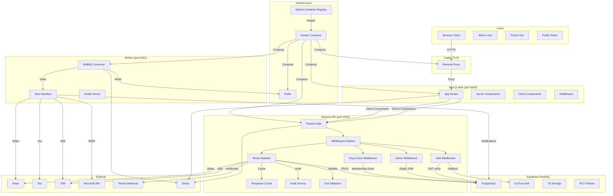

# System Architecture Diagram



## Data Flow (Request)

```
1. Browser → Caddy (TLS) → web:3000 (Next.js)
2. Server Component → http://api:4000 (Docker internal)
3. Client Component → https://api.* (public, inlined at build time)
4. API → Middleware → Auth → Admin Check → Org Access → Route → DB
5. Response → JSON envelope { success: true, data: T }
```

## Data Flow (Auth)

```
1. POST /api/v1/auth/sign-in → Supabase signInWithPassword
2. Returns JWT → stored in mct_session cookie (HttpOnly, Secure, SameSite=Lax)
3. Subsequent requests: middleware decodes JWT (base64url, no deps)
4. Validates exp → if valid, proceeds (no Supabase call)
5. If expired → Supabase auth.getUser() fallback
```

## Data Flow (Deploy)

```
1. Push to develop → GitHub Actions
2. Build 3 images (api, web, worker) → push to GHCR
3. SSH into droplet → docker save | gzip | ssh | gunzip | docker load
4. docker compose up -d
5. Clean old images
```

## Key Design Decisions

| Decision        | Rationale                                           |
| --------------- | --------------------------------------------------- |
| Single droplet  | ~$12-24/mo vs $150/mo AWS; simple to manage         |
| BullMQ over SQS | Simpler for single-droplet; SQS dormant as fallback |
| Hosted Supabase | Avoid managing Postgres + GoTrue + Storage          |
| In-memory cache | Acceptable for single-instance; Redis upgrade path  |
| Custom SDK      | Typed, bundleable, cookie or token auth             |
| PKCE + JWT      | Stateless, no external auth provider                |
