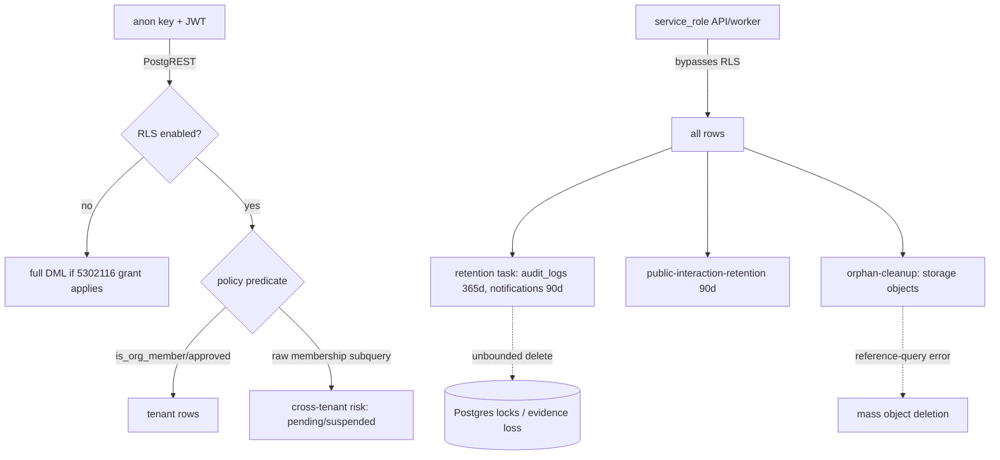

# Data, Schema, Migration, and Runtime Validation Audit

## Audit Metadata

- Audit name: repo-deep-dive
- Run: `20261002-0344-develop-6286137`
- Repository: `C:\temp\mainecybertech`
- Branch: develop
- Commit SHA: `6286137017c4b7c77e83ee420ec11382d984f263` (short `6286137`)
- Generated at: 2026-10-02
- Auditor: principal-level repository auditor (fresh pass; prior 20260806 run used only as a reconciliation baseline, every claim re-derived at the current commit)
- Area code: DATA
- Output path: `docs/audits/repo-deep-dive/20261002-0344-develop-6286137/07_data_schema_migration_runtime_validation.md`
- Scope limitations:
  - Static analysis of SQL migrations, TypeScript, CI workflows, and generator scripts only. No live Postgres/PostgREST session and no production connection (per shared safety rules). Policy, RLS and grant facts are derived from migration text, not from `pg_policies`, `pg_class` or a live `db lint`.
  - `node` and `pnpm` are not on the audit host PATH, so `scripts/verify-rls.mjs` and `scripts/generate-db-types.js --check` could not be executed; their behavior is established from source and their CI wiring, and marked `not reproducible` where execution was required.
  - The task brief stated "141 migrations in supabase/migrations". The current tree contains **127** `.sql` migration files, which is the number the repository itself asserts (`AGENTS.md` line 101, guarded by `scripts/check-docs-counts.mjs`). This is recorded as a scope discrepancy, not a repo defect.
  - Prompt-07 scope does not include the full web UI, storage-bucket object contents, or live data.

## Scope

Reviewed at commit `6286137` (branch `develop`):

- All 127 migration files under `supabase/migrations/` (versions `5302026` → `5302428`), including the 30 migrations added since the prior `5302128` baseline (`5302129`–`5302135`, `5302402`–`5302428`).
- All 9 seed files under `supabase/seeds/` (`00`–`08`) and their registration in `supabase/config.toml`.
- Migration ledger, version sequence, idempotency constructs, encryption, and destructive table-replacement migrations.
- Constraints (CHECK + enum types), indexes (including the dedicated FK-index migrations), foreign keys/cascades.
- RLS enablement and policy text; tenant columns; soft-delete columns; audit fields; retention helpers.
- Runtime validators (`apps/api/src/validators/*`, `apps/api/src/lib/validators.ts`, `apps/api/src/lib/delete-confirm.ts`), env/config validation (`apps/api/src/config/env.ts`, `apps/worker/src/env.ts`).
- Generated DB types (`packages/sdk/src/database.types.ts`) and the generator/CI drift gate.
- Migration CI (`.github/workflows/supabase-migrations.yml`), backup/restore CI (`.github/workflows/db-backup.yml`, `.github/workflows/db-restore-test.yml`), and the validate gate (`.github/workflows/validate.yml`).
- Optimistic-locking middleware and the 11 PATCH routes that use it.
- Destructive/retention helpers: `apps/worker/src/tasks/retention.ts`, `public-interaction-retention.ts`, `orphan-cleanup.ts`, `apps/worker/src/schedule-config.ts`.

Not reviewed: web-app UI behavior beyond permission-gated libs, storage bucket objects, live runtime behavior, production data, Terraform/deploy internals (other prompts), full API contract coverage (prompt 08).

## Evidence Reviewed

| Evidence | Type | Why relevant | Notes |
| --- | --- | --- | --- |
| `supabase/migrations/` (127 files) | SQL | Schema evolution source of truth | Contiguous `5302026`→`5302043`, then `5302050`→`5302083`, `5302085`→`5302135`, `5302402`→`5302428`; gaps recorded below |
| `5302026_supabase_consolidated_fresh_bootstrap…v3.sql` | SQL bootstrap | Core schema, enums, helper functions, RLS | Defines `is_org_member`, `is_org_approved_member`, `user_has_role`, `user_has_permission`, `is_super_admin`, `can_read_document` |
| `5302033/5302036/5302037/5302038` + `5302129` | SQL | `public_interactions` PII + prior P0 | 5302038 disables RLS; **5302129 re-enables and revokes anon/authenticated DML** |
| `5302116_grant_table_privileges.sql` | SQL | PostgREST grants + default privileges | Grants anon/authenticated/service_role full DML on **all** tables and all future tables |
| `5302129_supabase_rls_audit_fixes.sql` (1,298 lines) | SQL | Forward-fix for prior P0/P1/P2 | Re-enables RLS on public_interactions; hardens `increment_article_count`, `bulk_update_with_version`, `mark_task_read`; maps policy vocabulary; adds catalog rows; extends admin gates |
| `5302111` vs `5302129 §3` | SQL | bulk RPC column allowlist | 5302129 adds per-table allowlist + anon session block |
| `5302100` + `5302112` | SQL | approved-membership helper + rewrite | `is_org_member` requires `status='approved'` |
| `5302404/5302405/5302406/5302407` | SQL | Reintroduced raw membership predicates | Fixed by `5302412` |
| `5302414/5302417` | SQL | Reintroduced raw membership predicates | Fixed by `5302418`/`5302420` |
| `5302416/5302427` | SQL | Deny-all tables | RLS enabled; documented `-- rls: deny-all`-class intent |
| `5302419_fk_indexes.sql` | SQL | FK index backfill | 9 FK columns indexed |
| `5302113_add_check_constraints.sql` | SQL | `version >= 1` CHECKs + FK index | 9 versioned tables |
| `5302103_add_check_constraints.sql` | SQL | Bounded numeric CHECKs | 6 constraints |
| `5302108_fix_audit_logs_cascade.sql` | SQL | audit_logs org FK → CASCADE | Compliance-history loss on org delete (still open) |
| `5302109_soft_delete.sql` | SQL | `deleted_at`/`deleted_by` | No route uses them (see DATA-P1-003) |
| `apps/worker/src/tasks/retention.ts` | TS | audit_logs(365d)+notifications(90d) purge | Unbounded `.delete()`; no test |
| `apps/worker/src/tasks/public-interaction-retention.ts` | TS | 90-day PII purge | Selects ids for count |
| `apps/worker/src/tasks/orphan-cleanup.ts` | TS | Storage orphan removal | Boundary risk on partial listing (DATA-P2-003) |
| `apps/worker/src/schedule-config.ts` | TS | Scheduled scans | `retention` daily offset 70; `orphan-cleanup` 6h offset 76 |
| `apps/api/src/middleware/optimistic-locking.ts` | TS | If-Match parsing + version check | No-If-Match = permissive; DB `.eq("version")` still enforces |
| `apps/api/src/routes/{tickets,documents,projects,profiles,…}.ts` | TS | PATCH handlers | 11 routes with version preconditions |
| `apps/api/src/config/env.ts` | TS | Zod env validation | Strong required-key checks |
| `apps/api/src/validators/*` (31 files) | TS | Runtime request validation | Zod; `parsePartialUpdate` closes mass-assignment |
| `packages/sdk/src/database.types.ts` | Generated TS | Generated DB types | Header "Auto-generated … DO NOT EDIT"; contains newest tables |
| `scripts/verify-rls.mjs` | JS | Static RLS/migration hygiene check | Enforced in validate gate; 3 rules |
| `scripts/generate-db-types.js --check` | JS | Type drift gate | Enforced in validate gate |
| `.github/workflows/supabase-migrations.yml` | CI | Migration apply | `db diff … || true` (non-blocking) then `db push --include-all` |
| `.github/workflows/db-backup.yml` / `db-restore-test.yml` | CI | Backup + weekly restore test | Restore test prints counts, does not assert |
| `supabase/config.toml` + `supabase/seeds/00–08` | SQL | Seed registration/consistency | 9 seeds registered |

## Verification Performed

| Evidence | Type | Why relevant | Notes |
| --- | --- | --- | --- |
| `grep "DISABLE ROW LEVEL SECURITY" supabase/migrations` | Command | Prior P0 reproduction | Exactly 1 hit: `5302038` on `public.public_interactions`; superseded by `5302129` |
| `grep "ENABLE ROW LEVEL SECURITY"` | Command | RLS enablement | 4 static hits; cross-file scan below proves all 144 created tables enable RLS |
| Cross-file PowerShell scan: every `create table` name vs `alter table … enable row level security` anywhere | Command | Absolute RLS coverage | `TABLES CREATED: 144; NO ENABLE RLS ANYWHERE: 0` → **supported** |
| `grep "deleted_at\|deleted_by" apps/` | Command | Soft-delete usage | 4 hits, all `openapi/spec.ts` + a contract test; **zero route usage** → prior finding reproduced |
| `grep "requireIfMatch\|checkVersionMatch"` routes | Command | Optimistic locking | 11 route files wire the precondition |
| `grep "organization_id in (select organization_id from memberships"` | Command | Approved-status gap | 57 hits across bootstrap-era + `5302404/5302405/5302406/5302407` (fixed) |
| `grep "retention" apps/worker` | Command | Retention tasks | `retention.ts`, `public-interaction-retention.ts`, `schedule-config.ts` |
| Read `verify-rls.mjs` | Read | Confirms CI rule set | Rule 1 (live table must enable RLS), Rule 2 (policy presence warning), Rule 3 (policy drop-pairing ≥ `5302427`) |
| Read `validate.yml` | Read | CI wiring | Runs `generate-db-types.js --check` and `verify-rls.mjs` in the deploy gate |
| Read `AGENTS.md` line 101 | Read | Migration count self-consistency | States 127, `latest: 5302428`; matches tree → **supported** |
| Read `database.types.ts` (grep) | Read | Type freshness | Contains `store_campaigns`, `mfa_recovery_codes`, `phishing_targets`, `business_os_snapshots`, `compliance_controls`, `knowledge_base_articles` → current |
| `git rev-parse HEAD` / `git log -1` | Command | Commit binding | `6286137017c4b7c77e83ee420ec11382d984f263`, 2026-10-01 23:25:45 -0400 |
| `node scripts/verify-rls.mjs` | Command | Reproduce hygiene check | **not reproducible** — `node` absent on audit host |
| `node scripts/generate-db-types.js --check` | Command | Reproduce type drift check | **not reproducible** — `node` absent on audit host |

### Headline-claim reproduction outcomes

| Claim (source) | Outcome | Basis |
| --- | --- | --- |
| Prior `DATA-P0-001`: anon SELECT/UPDATE/DELETE on RLS-off `public_interactions` | **supported-fixed** | `5302129:41-47` enables RLS, revokes anon/authenticated SELECT/UPDATE/DELETE, grants INSERT only |
| Prior `DATA-P1-001`: `bulk_update_with_version` unbounded write-set | **supported-fixed** | `5302129:238-258` per-table column allowlist; `5302129:168-174` anon session block |
| Prior `DATA-P1-002`: `increment_article_count` PUBLIC definer write | **supported-fixed** | `5302129:88-127` revokes PUBLIC/anon, pins `search_path`, allowlists `field_name`, adds approved-member check |
| Prior `DATA-P1-003`: soft-delete columns unused | **supported-still-open** | No route references `deleted_at`/`deleted_by` at `6286137` |
| Prior `DATA-P2-001`: RLS policy permission vocabulary drift | **supported-fixed** | `5302129 §5` rewrites tickets/projects/documents policies to catalog keys (`edit`/`create`/`delete`) |
| Prior `DATA-P2-002`: `mark_task_read` caller-supplied user_id | **supported-fixed** | `5302129:328-371` caller-identity, task/org, approved-member checks |
| Prior `DATA-P2-003`: missing `retention`/`training-modules` catalog rows | **supported-fixed** | `5302129:780-825` inserts rows + role grants |
| `verify-rls.mjs` passes at this commit | **not reproducible** | `node` unavailable; read review indicates consistent with tree (all tables RLS-enabled) |
| `generate-db-types --check` passes | **partially supported** | Types contain newest tables; byte-level drift not reproduced |

## Executive Summary

The data/schema domain has materially improved since the prior `75d3926` audit and is now among the more mature areas of the repository. The prior **P0** (RLS disabled on the `public_interactions` PII leads table plus a blanket `anon` DML grant) is **verified fixed** at `6286137` by `5302129_supabase_rls_audit_fixes.sql`, which re-enables RLS, narrows `anon` to INSERT-only, and revokes SELECT/UPDATE/DELETE. The three prior P1 findings (`bulk_update_with_version` column allowlist, `increment_article_count` PUBLIC definer write, unused soft-delete columns — the last remains open) and the P2 findings (policy permission vocabulary, `mark_task_read` caller checks, missing `retention`/`training-modules` catalog rows) were also forward-fixed in `5302129`, and the fixes are consistent with the code that ships alongside them.

New controls are strong and CI-enforced: 144 created tables **all** enable RLS (independently reproduced); `scripts/verify-rls.mjs` statically fails a live table without RLS, warns on RLS-table-without-policy, and requires policy drop-pairing for migrations ≥ `5302427`; `scripts/generate-db-types.js --check` blocks type drift; `AGENTS.md` counts are guarded by `scripts/check-docs-counts.mjs`; and there is a daily `db-backup.yml` plus a weekly `db-restore-test.yml`. Optimistic locking is enforced at the database with `.eq("version", …)` on 11 PATCH routes, and `version >= 1` CHECKs cover 9 tables. Env validation is a strict Zod schema.

The remaining risks are quieter but real. **The most important is a recurring process defect**: the "approved membership" RLS predicate was reintroduced *six times* after it had been systemically fixed (`5302404`, `5302405`, `5302406`, `5302407`, `5302414`, `5302417`), each time fixed reactively by a later migration (`5302412`, `5302418`, `5302420`); during the window a pending/suspended member could read/write tenant tables via the anon-key + JWT path — including `phishing_targets`, which carries target **email/name PII**. Second, the new **`retention` worker task deletes from `audit_logs` and `notifications` with an unbounded `.delete()`** (no `.limit()`, no batching, no transaction), which is a mass-delete lock/latency risk and, for `audit_logs`, a 365-day compliance-evidence purge with no test coverage. Third, the **blanket `anon` DML grant in `5302116` plus `alter default privileges`** means every future table automatically inherits anon DML and correctness depends entirely on RLS — the exact configuration that produced the prior P0. Fourth, destructive table-replacement migrations (`5302406`, `5302407`) `drop table … cascade` **outside an explicit transaction**, so a mid-migration failure can leave schema partially applied with data loss. Fifth, soft-delete columns remain dead schema, still signalling recoverability that does not exist.

Recommended next actions: (1) make approved-membership predicate generation structural (template/lint) so new tables cannot reintroduce the gap; (2) batch and bound the `retention` task deletes and add a retention/unit test with fresh-vs-expired boundary data, and reconsider 365-day audit purge against a compliance archive; (3) stop blanket `anon` DML (`alter default privileges` and the `5302116` loop) and grant anon per-table, INSERT-only, where a public write path is genuinely required; (4) wrap destructive table-replacement migrations in `begin;…commit;` and archive data before `drop table … cascade`; (5) resolve the soft-delete decision.

## Inventory

| Item | Path / symbol | Purpose | Current state | Risk | Notes |
| --- | --- | --- | --- | --- | --- |
| Migrations | `supabase/migrations/` (127 files) | Schema evolution | Applied via CI `db push` | Low | Gaps: `5302027`, `5302039/40`, `5302044–49`, `5302084` |
| Roles | `5302026` + `5302128` | 13 roles | `is_system=true`, fixed UUIDs | Low | 5302128 adds 8 MSP roles |
| Permission catalog | `5302028`+`5302118`+`5302129`+`5302424`+`5302426` | Data-driven keys | Now includes `retention`, `training-modules`, `users/roles/orgs/memberships:manage`, `status:create/edit/delete` | Low | Prior drift fixed |
| Optimistic locking | `5302051`+`5302052`+`5302130`+`5302409`+middleware | Version columns + If-Match | 11 PATCH routes; `.eq("version")` write precondition | Low | `domain_monitors.version` added in 5302409 |
| bulk RPC | `5302111` + `5302129 §3` | Versioned bulk write | Hardened: allowlist, anon block, per-row org check | Low | Allowlist is `tickets: status,priority`; `documents: folder_path,description,visibility` |
| mark_task_read RPC | `5302122` + `5302129 §4` | RLS-bypass read marking | Caller-identity + task/org + approved-member | Low | Fixed |
| Project-task RPCs | `5302130` | approve/comment with explicit user_id | Approved-member + task/org checks | Low | Old signatures dropped |
| Soft delete | `5302109` | `deleted_at`/`deleted_by` | Schema only; **no route usage** | Med | DATA-P1-003 |
| Retention | `5302117` + `retention.ts` + `public-interaction-retention.ts` | PII/audit/notification purge | 3 policies scheduled daily | Med | Unbounded deletes (DATA-P1-002) |
| RLS | all migrations | Tenant isolation | 144/144 created tables enable RLS (reproduced) | Low | `verify-rls.mjs` gates it |
| Grants | `5302116` | PostgREST privileges | blanket anon/authenticated DML + default privileges | Med | DATA-P2-001 |
| Generated types | `packages/sdk/src/database.types.ts` | SDK types | Generated from SQL; CI drift gate | Low | Current incl. newest tables |
| Seeds | `supabase/seeds/00–08` | Demo/test data | Registered in `config.toml` | Low | E2E path uses `db reset` |
| Backup/restore | `db-backup.yml`, `db-restore-test.yml`, `scripts/backup-database.sh` | Recovery | Daily backup; weekly restore test (prints, no assert) | Med | Restore test not gated |
| Migration CI | `supabase-migrations.yml` | Apply to hosted | `db diff \|\| true` then `db push` | Med | Drift check non-blocking (DATA-P2-004) |
| Hygiene gate | `scripts/verify-rls.mjs`, `check-docs-counts.mjs`, `generate-db-types.js --check` | Static gates | Enforced by `validate.yml` | Low | Strong |

## Domain Scorecard

| Category | Score | Evidence | Gap | Recommended action |
| --- | ---: | --- | --- | --- |
| Database schema | 4 | Enums, universal `organization_id`, `version` columns, deny-all tables documented | Soft-delete dead; `business_os_snapshots` has no tenant column | Resolve soft delete; decide snapshot tenant scope |
| Migrations | 4 | 127 idempotent files; destructive replacements present; CI applies | No down-migrations; destructive `drop table` unwrapped; drift diff non-blocking | Wrap destructive migrations in transactions; make diff blocking |
| Constraints | 4 | `version>=1` (9 tables), 6 bounded CHECKs, enum types | Few NOT NULLs on newer module tables; no cross-table invariant | Add NOT NULL where app assumes it |
| Indexes | 4 | `5302056/5302082/5302102/5302107/5302117/5302419`; FK-index backfill | No index-coverage regression test | Add FK index lint |
| Foreign keys/cascades | 3 | CASCADE on tenant FKs; `impersonation_log` SET NULL | `audit_logs` org CASCADE destroys history | Change to SET NULL or archive (DATA-P2-005) |
| RLS | 4 | 144/144 tables enable RLS; helper-based policies; `verify-rls` gate | Approved-status predicate reintroduced 6×; blanket anon DML | Structural predicate + per-table anon grants (DATA-P1-001, DATA-P2-001) |
| Tenant columns | 4 | `organization_id` universal on tenant tables | `business_os_snapshots` platform-only by design | Document platform-only tables |
| Soft deletes | 1 | `5302109` columns | Zero route usage | Implement or drop (DATA-P1-003) |
| Audit fields | 4 | `audit_logs`, `impersonation_log`, `logAuditEvent` | 365-day purge; org-delete cascade | Archive policy; preserve on delete |
| Retention | 3 | 3 policies (public_interactions, audit_logs, notifications) | Unbounded deletes; no tests; many stores lack a policy | Batch deletes; extend framework (DATA-P1-002, DATA-P2-006) |
| Seeds/fixtures | 4 | 9 seeds registered; E2E-verified | Drift from schema possible | Add schema-consistency CI check |
| Generated DB types | 4 | Generated + CI `--check` drift gate | Parser is custom (SQL→TS), may miss exotic DDL | Keep gate; add spot-check test |

## Detailed Review

### Item: Migration pipeline (`5302026` → `5302428`)

- Evidence: 127 files; `supabase/config.toml`; `.github/workflows/supabase-migrations.yml`; `scripts/verify-rls.mjs`.
- What it does: consolidated fresh bootstrap + ~120 incremental migrations, seeded by 9 files.
- How it appears to work: sequential, idempotent-by-convention (`if not exists`, `on conflict`, `pg_constraint` guards, `drop policy if exists`); applied to hosted dev/prod by CI, `db reset` for E2E.
- Dependencies: role/permission catalog ordering; demo data guarded.
- Current controls: idempotency; `concurrency` group serialises pushes; pinned Supabase CLI `2.107.0`; `verify-rls.mjs` + `generate-db-types.js --check` + `check-docs-counts.mjs` in the deploy gate.
- Missing controls: no down-migrations; `db diff … || true` never blocks on drift; no empty-DB apply-and-warn job; destructive replacements not transaction-wrapped.
- Risks: partial-apply on destructive migration failure (DATA-P2-003); silent drift not caught (DATA-P2-004).
- Recommended improvement: make the dry-run diff blocking (remove `|| true`), add `supabase db reset` smoke in CI, wrap `drop table … cascade` migrations in `begin;…commit;`.
- Suggested tests: CI job that applies the full set to an empty DB and fails on warnings; assert 127 rows in `schema_migrations`.
- Suggested docs: `docs/MIGRATIONS.md` with version-gap rationale and destructive-migration policy.

### Item: `public_interactions` PII lifecycle

- Evidence: `5302033`, `5302036`, `5302037`, `5302038`, `5302117`, `5302129 §1`, `5302425`; `public-interaction-retention.ts`.
- What it does: anon INSERT-only contact-form leads, 90-day purge, bot flagging.
- How it appears to work: RLS re-enabled; `anon`/`authenticated` INSERT only; service_role full; worker purges rows older than 90 days with `is_bot` filterable.
- Current controls: RLS + INSERT policy; `idx_public_interactions_created_at` for the purge; `idx_public_interactions_is_bot`.
- Missing controls: no test for the anon-vs-authenticated RLS matrix; no unbounded-delete guard in the purge (bounded by age, acceptable).
- Risks: low; the residual is that the INSERT-only anon path is the sole public write surface.
- Recommended improvement: add an RLS matrix test (anon SELECT/DELETE must fail; anon INSERT must succeed).
- Suggested tests: `supabase db reset` + psql role-matrix script.
- Suggested docs: keep the table COMMENT as the retention contract.

### Item: `retention` worker task

- Evidence: `apps/worker/src/tasks/retention.ts:41-61`; `schedule-config.ts:47`.
- What it does: deletes `audit_logs` older than 365 days and `notifications` older than 90 days; scheduled daily.
- How it appears to work: two `.delete().lt("created_at", cutoff)` calls as service_role.
- Current controls: configurable day counts; scheduled with a distinct offset; logs a summary.
- Missing controls: no `.limit()`/batch/`.select()` count; no transaction; no unit test; the function returns `{ok:true}` even when both sub-purges failed (paths push an error string but do not flip `ok`).
- Risks: mass-delete latency/locks on large tables; silent failure returns success (DATA-P1-002); audit-history evidence loss.
- Recommended improvement: batch with `.limit(N)` loops keyed on `created_at`, return `{ok:false}` when either purge errors, and confirm audit retention against a data-governance policy.
- Suggested tests: fresh-vs-expired boundary test; simulate error → `ok:false`.
- Suggested docs: retention matrix with owner and legal basis per table.

### Item: RLS helper model

- Evidence: `5302026:638-734`; `5302100:8-20`; `5302112:19`; `5302412`; `5302418`; `5302420`.
- What it does: `is_org_member`/`is_org_approved_member` centralise approved-membership checks; `user_has_role`/`user_has_permission` gate module actions.
- How it appears to work: `is_org_member` requires `status='approved'`; policies call these helpers.
- Current controls: helper reuse across the bulk of the schema; `search_path` pinned on `is_org_member`.
- Missing controls: no template/guard preventing new policies from hand-writing raw membership subqueries; the gap recurred 6 times.
- Risks: pending/suspended-member access during the unfixed window (DATA-P1-001).
- Recommended improvement: add a `verify-rls`-style lint that fails any new policy using a raw `memberships` subquery without `status='approved'` (or forbids raw subqueries entirely in favour of the helper).
- Suggested tests: lint + a pending-member psql probe per new module table.
- Suggested docs: `docs/RLS-rollout.md` add "always use the approved helper".

### Item: Optimistic locking / version preconditions

- Evidence: `apps/api/src/middleware/optimistic-locking.ts`; 11 routes; `5302113`; `5302409`.
- What it does: parses `If-Match`, compares `version`, and every write includes `.eq("version", current.version)`.
- How it appears to work: the DB precondition is authoritative; a missing `If-Match` does not disable the write precondition because the update filters on the current version.
- Current controls: `version>=1` CHECKs (9 tables); 409 on conflict.
- Missing controls: middleware treats a missing `If-Match` as permissive (still safe due to `.eq`), so a caller cannot *force* a version check and last-write-wins applies when the value is read-then-race-updated; no version column on many newer module tables.
- Risks: silent last-write-wins is prevented at DB level for locked tables; unlocked tables rely on last-write-wins by design.
- Recommended improvement: document which entities are versioned; consider requiring `If-Match` on high-contention resources.
- Suggested tests: concurrent PATCH → one 409.
- Suggested docs: add a versioned-entity table to `docs/API_ERROR_HANDLING.md`.

## Scenario / Control Matrix

| ID | Scenario or control | Evidence | Current control | Gap | Severity | Recommendation |
| --- | --- | --- | --- | --- | --- | --- |
| DATA-001 | Database schema | 127 migrations, enums, tenant cols | Mature, idempotent | Soft-delete dead; snapshot tenant scope | P2 | Resolve soft delete; document platform tables |
| DATA-002 | Migrations | `supabase-migrations.yml` | Applied, serialised, pinned CLI | Drift diff non-blocking; no down-migrations | P2 | Make diff blocking; document forward-only |
| DATA-003 | Constraints | `5302103`, `5302113` | `version>=1`, bounded numeric CHECKs | Few NOT NULLs on new module tables | P3 | Add NOT NULL where assumed |
| DATA-004 | Indexes | `5302056/…/5302419` | Broad FK/query coverage | No index-coverage test | P3 | Add FK-index lint |
| DATA-005 | Foreign keys/cascades | `5302055`, `5302108` | Deliberate cascades | audit_logs org cascade wipes history | P2 | SET NULL or archive |
| DATA-006 | RLS | 144/144 enabled; `verify-rls` | Static RLS gate | Approved-status recurrence; blanket anon DML | P1 | Structural predicate + per-table anon grants |
| DATA-007 | Tenant columns | universal `organization_id` | Per-org scoping + RLS | Platform-only tables undocumented | P3 | Document role/table semantics |
| DATA-008 | Soft deletes | `5302109` | Columns only | Zero route usage | P1 | Implement or remove |
| DATA-009 | Audit fields | `audit_logs`, `impersonation_log` | Comprehensive | 365-day purge; org-delete cascade | P2 | Archive + preserve on delete |
| DATA-010 | Retention | 3 policies | Scheduled daily | Unbounded deletes; no tests; gaps | P1 | Batch + test + extend framework |
| DATA-011 | Seeds/fixtures | 9 seeds | Registered, E2E-verified | Drift risk | P2 | CI schema lint |
| DATA-012 | Generated DB types | `database.types.ts` + `--check` | Generated + drift gate | Custom parser | P3 | Keep gate; spot-check test |

## Findings

### Finding ID: DATA-P1-001 - Approved-membership RLS predicate reintroduced six times; pending/suspended members could access tenant data

- Severity: P1
- Confidence: High
- Area: RLS / multi-tenant isolation
- Evidence:
  - `supabase/migrations/5302404_cab.sql` — `cab_meetings`/`cab_agenda_items` policies use `organization_id in (select organization_id from memberships where user_id = auth.uid())` with **no** `status = 'approved'`.
  - `supabase/migrations/5302405_hardware_staging.sql:23-44` — `hardware_staging_checks` same raw predicate.
  - `supabase/migrations/5302406_device_profiles.sql:24-52` — `device_profiles` same raw predicate.
  - `supabase/migrations/5302407_network_diagrams.sql:32-54` — `network_diagrams` same raw predicate.
  - `supabase/migrations/5302414_client_portal_entitlements.sql:21-32` and `supabase/migrations/5302417_phishing_targets.sql:21-32` — same raw predicate; `phishing_targets` carries `email` + `name`.
  - Fixes were reactive: `supabase/migrations/5302412_rls_approved_status_gap.sql` (cab/hardware/device/network), `5302418_rls_approved_status_gap_2.sql` (entitlements/phishing), `5302420_rls_entitlements_and_impersonation_fix.sql`, `5302428_client_portal_entitlements_platform_admin.sql`.
  - `supabase/migrations/5302100_fix_rls_membership_status.sql:8-20` — the correct helper `is_org_member(org_id)` requiring `status='approved'`, which `5302112` had already applied schema-wide.
- What is happening: A systemic fix (approved-status on membership predicates) was applied in `5302100`/`5302112`, but six subsequent module migrations hand-wrote the pre-fix predicate again. Between each introduction and its reactive fix, an authenticated user whose membership was `pending`/`suspended` passed RLS on those tables (the API would have rejected them, but the anon-key + JWT PostgREST path bypasses the API).
- Why it matters: Tenant isolation is the security boundary for a multi-tenant MSP platform; six independent recurrences show the defect is a process gap, not a one-off, and the next module migration will likely repeat it.
- User / business impact: Pending/suspended users could read or mutate another tenant's CAB records, hardware staging, device profiles, network diagrams, portal entitlements and — most sensitively — phishing target names/emails.
- Security / privacy / reliability impact: Cross-tenant read/write via the public client credential; PII exposure (`phishing_targets.email`) on the affected window.
- Recommended fix: Add a `verify-rls.mjs` rule that fails any policy containing a raw `memberships` subquery lacking `status = 'approved'`, preferring `public.is_org_member(...)`/`is_org_approved_member(...)`; document the helper as mandatory.
- Suggested validation: Lint unit test feeding a raw-predicate policy → failure; psql probe with a `pending` membership → 0 rows on each module table.
- Owner suggestion: Platform/backend lead.
- Effort estimate: S (lint) + M (backfill audit of all policies).
- Dependencies: `scripts/verify-rls.mjs`; `5302112` helper model.
- Status: partially-fixed (all six instances were closed at `6286137`, but the generating defect is open).
- Endpoint / data path: anon-key + JWT → PostgREST `/rest/v1/<table>` → RLS predicate → tenant rows.
- Attack path: suspended member retains JWT → direct PostgREST read of `phishing_targets` (PII) → cross-tenant disclosure; chains with prompt 25 isolation scenarios.

### Finding ID: DATA-P1-002 - `retention` worker task performs unbounded deletes and reports success on partial failure

- Severity: P1
- Confidence: High
- Area: Data lifecycle / retention
- Evidence:
  - `apps/worker/src/tasks/retention.ts:41-50` — `supabase.from("audit_logs").delete().lt("created_at", auditCutoff.toISOString())` with no `.limit()`/batch/pagination, `auditLogRetentionDays = 365`.
  - `apps/worker/src/tasks/retention.ts:52-61` — same unbounded `.delete()` for `notifications`, `notificationRetentionDays = 90`.
  - `apps/worker/src/tasks/retention.ts:46-49,57-60` — on error the code pushes a failure string but still `return { ok: true }` at line 64.
  - `apps/worker/src/schedule-config.ts:47` — `{ name: "retention", intervalMs: SCAN_INTERVAL_DAILY_MS, offsetMin: 70 }`.
  - No `apps/worker/src/__tests__/retention.test.ts` exists (test dir listing).
- What is happening: A daily production task issues whole-table age deletes with no batch bound and no affected-row count, and returns `ok:true` even when a delete errored. `audit_logs` (compliance evidence) is purged at 365 days with no archive step.
- Why it matters: Large unbounded DELETEs can hold locks, bloat WAL, and time out under load; a silent success masks a broken purge (or a partially-applied one); an irreversible audit purge with no archive is a governance risk.
- User / business impact: Worst case a nightly job stalls the primary database; compliance evidence older than a year is destroyed with no restore path.
- Security / privacy / reliability impact: Availability risk (lock/IO spike); auditabilty loss; no observable failure signal from the task result.
- Recommended fix: Loop `delete().lt("created_at", cutoff).limit(N).select("id")` until fewer than N rows return; count rows in the result; return `{ ok: false }` if either sub-purge reports an error; confirm the 365-day audit policy with data governance and archive (or `set null` / cold-store) rather than hard-delete.
- Suggested validation: Unit test with fresh + expired fixtures asserting only expired rows are targeted and the count is returned; error-fixture test asserting `ok:false`.
- Owner suggestion: Backend/worker lead.
- Effort estimate: M.
- Dependencies: Data-governance retention decision (prompt 18).
- Status: open (new finding this run).

### Finding ID: DATA-P1-003 - Soft-delete columns remain dead schema; DELETE endpoints hard-delete

- Severity: P1
- Confidence: High
- Area: Data lifecycle / integrity
- Evidence:
  - `supabase/migrations/5302109_soft_delete.sql` — adds `deleted_at`/`deleted_by` to tickets/projects/documents plus indexes.
  - `grep "deleted_at|deleted_by" apps/` → only `apps/api/src/openapi/spec.ts:516-517` and `apps/api/src/__tests__/openapi-contracts.test.ts:237-238`; **zero** route/service/worker usages.
- What is happening: The schema advertises tombstone semantics (columns + indexes) that no read path filters on and no write path populates; DELETE routes physically remove rows.
- Why it matters: False recoverability; if the columns were intended to gate visibility, deleted records are neither hidden nor retained — they are gone.
- User / business impact: Accidental permanent data loss with no restore; audit rows for the entity disappear.
- Security / privacy / reliability impact: Compliance/tombstone expectations unmet; recovery capability absent.
- Recommended fix: Either implement tombstones (DELETE sets `deleted_at = now(), deleted_by = auth.uid()`, list/get add `.is("deleted_at", null)`, add admin restore) or drop the columns and document hard delete.
- Suggested validation: Delete a ticket → row retained with `deleted_at` set; list excludes it; get-by-id 404.
- Owner suggestion: Backend lead.
- Effort estimate: M (implement) / S (remove).
- Dependencies: Product decision.
- Status: still-open (reproduced from prior `DATA-P1-003` at `75d3926`).

### Finding ID: DATA-P2-001 - Blanket `anon` DML grant + default privileges make every future table anon-writable unless RLS happens to stop it

- Severity: P2
- Confidence: High
- Area: Data access / RLS defense-in-depth
- Evidence:
  - `supabase/migrations/5302116_grant_table_privileges.sql:23-38` — loop grants `select, insert, update, delete on table public.%I to anon` for **all** existing tables.
  - `supabase/migrations/5302116_grant_table_privileges.sql:59-70` — `alter default privileges in schema public grant select, insert, update, delete on tables to anon` (and authenticated/service_role) for all **future** tables.
  - `supabase/migrations/5302129_supabase_rls_audit_fixes.sql:43-47` — the forward-fix revokes `select, update, delete` from `anon`/`authenticated` **only on `public_interactions`**; the blanket grant/default-privilege remains for everything else.
- What is happening: Every table, present and future, is granted full DML to the public `anon` role; access control rests entirely on RLS being enabled with restrictive policies. This is precisely the configuration that produced the prior P0 (a single `disable row level security` restored anon full access to a PII table).
- Why it matters: RLS is one statement away from silently re-exposing any table; a future `DISABLE ROW LEVEL SECURITY` or a permissive `using (true)` policy immediately grants anon full DML.
- User / business impact: Latent — no current exposure (all tables enable RLS and `verify-rls.mjs` gates that), but a single regression becomes a data breach.
- Security / privacy / reliability impact: Elevated blast radius for any RLS mistake; violates least privilege.
- Recommended fix: Remove the `alter default privileges … to anon` statements; replace the 5302116 loop's anon grant with targeted per-table grants to `anon` (INSERT-only where a public write path exists, e.g. `public_interactions`, `store_quotes`); keep `authenticated`/`service_role` grants.
- Suggested validation: `select grantee, privilege_type from information_schema.role_table_grants where grantee='anon'` → only the allowlisted tables; new-table test asserting no anon grant by default.
- Owner suggestion: Platform lead.
- Effort estimate: M.
- Dependencies: Enumerate legitimate anon write paths.
- Status: open (new finding this run; the prior P0 was fixed for one table only).

### Finding ID: DATA-P2-002 - Destructive table-replacement migrations are not transaction-wrapped

- Severity: P2
- Confidence: High
- Area: Migrations / data safety
- Evidence:
  - `supabase/migrations/5302406_device_profiles.sql:5-17` — `drop table if exists public.device_profiles cascade;` then `create table …` with no `begin;…commit;`.
  - `supabase/migrations/5302407_network_diagrams.sql:13-24` — `drop table if exists network_diagrams;` then `create table …`, no transaction.
  - Contrast: `5302404_cab.sql`, `5302405_hardware_staging.sql`, `5302410`, `5302418`, `5302420`, `5302422`, `5302424`, `5302427`, `5302428` all use `begin;…commit;`.
- What is happening: Two migrations drop and recreate a table (destroying existing rows) without a transaction, so a failure between drop and create leaves the table missing while the migration ledger records a partial apply.
- Why it matters: `drop table … cascade` also drops dependent objects/policies; an interrupted run is a schema-consistency incident requiring manual repair, with permanent data loss.
- User / business impact: Potential outage of the device-profile/network-diagram features and loss of any existing records.
- Security / privacy / reliability impact: Reliability and data-loss risk during deploy; no down-path.
- Recommended fix: Wrap these (and any future `drop table … cascade`) in `begin;…commit;`, and archive rows to a backup table before the drop where data may exist.
- Suggested validation: CI applies migrations to a seeded DB and asserts a failure injected mid-migration rolls back.
- Owner suggestion: Platform lead.
- Effort estimate: S.
- Dependencies: None.
- Status: open (new finding this run).

### Finding ID: DATA-P2-003 - `orphan-cleanup` deletes storage objects based on a truncated listing

- Severity: P2
- Confidence: Medium
- Area: Data lifecycle / destructive helper
- Evidence:
  - `apps/worker/src/tasks/orphan-cleanup.ts:15-17` — `supabase.storage.from(bucket).list("", { limit: 1000 })` (only the first 1000 entries; no pagination).
  - `apps/worker/src/tasks/orphan-cleanup.ts:28-49` — for the `documents` bucket it selects `documents.storage_path in (paths)` and removes any listed file whose path is not referenced; the `avatars` branch does the same for `profiles.avatar_url`.
  - `apps/worker/src/tasks/orphan-cleanup.ts:56,58` — the avatars query has no limit while the storage list is capped at 1000.
- What is happening: Orphan detection compares a capped storage listing against reference sets; correctness holds today because the comparison would treat *unlisted* files as non-existent (safe), but the task also removes any *listed* file whose reference query returned error/empty (the queries do not check `error`), and it only ever sees the first page.
- Why it matters: A reference-query failure that returns `data: null` yields an empty reference set, so every listed file is treated as an orphan and deleted — a destructive failure mode driven by a transient DB error. This is the "deleting too much is a latent P0-class defect" boundary case.
- User / business impact: Worst case, mass deletion of document/avatar objects referenced by rows whose query failed.
- Security / privacy / reliability impact: Irreversible data loss on a transient error; existing test mocks do not cover the query-error path.
- Recommended fix: Treat a `null`/error reference result as "do not delete"; abort the bucket pass on any read error; paginate the storage listing.
- Suggested validation: Unit test where the `documents`/`profiles` reference query returns `{ data: null, error }` → assert zero removals.
- Owner suggestion: Backend/worker lead.
- Effort estimate: S.
- Dependencies: `orphan-cleanup.test.ts` mock harness.
- Status: open (new finding this run).

### Finding ID: DATA-P2-004 - Migration CI dry-run diff is non-blocking; drift is never gated

- Severity: P2
- Confidence: High
- Area: Migration CI / drift
- Evidence:
  - `.github/workflows/supabase-migrations.yml` — step "Diff migrations (dry-run)" runs `supabase db diff --linked --schema public || true`, so drift between the linked database and the migration set is printed but never fails; the next step runs `supabase db push --include-all`.
  - `|| true` explicitly discards a non-zero exit.
- What is happening: Any out-of-band change to the hosted database (manual SQL, dashboard edits) is not detected as a release blocker, and the pipeline applies migrations over it.
- Why it matters: `db push --include-all` on a drifted database can produce surprising results or mask that the migrations no longer describe production; drift is the classic precursor of "works in staging, breaks in prod".
- User / business impact: Schema drift can cause runtime 500s or silent behavioural differences between environments.
- Security / privacy / reliability impact: No enforced guarantee that the checked-in schema equals deployed state.
- Recommended fix: Capture `supabase db diff` output and fail (or open a required-review notification) when the diff is non-empty; keep an explicit escape hatch for intentional manual fixes.
- Suggested validation: CI job where a manual drift is present → pipeline fails.
- Owner suggestion: Platform/DevOps lead.
- Effort estimate: S.
- Dependencies: Hosted-project access policy.
- Status: open (new finding this run).

### Finding ID: DATA-P2-005 - `audit_logs` org-delete cascade destroys compliance history; 365-day purge has no archive

- Severity: P2
- Confidence: High
- Area: Audit / compliance
- Evidence:
  - `supabase/migrations/5302108_fix_audit_logs_cascade.sql` — `audit_logs.organization_id` FK changed to `on delete cascade`.
  - `apps/worker/src/tasks/retention.ts:41-44` — deletes `audit_logs` older than 365 days.
- What is happening: Audit rows are destroyed both when an organization is deleted (cascade) and after one year (purge), with no archive step in either path.
- Why it matters: Audit logs are the compliance record; both tenant teardown and routine ageing erase the evidence trail.
- User / business impact: Loss of evidence during offboarding and for aged incidents.
- Security / privacy / reliability impact: Compliance exposure; no ability to reconstruct historical tenant activity.
- Recommended fix: Change the FK to `on delete set null` (the column is nullable) or archive to cold storage before deletion; route the 365-day purge through an archive sink.
- Suggested validation: Delete an org in a test DB → audit rows retained with `organization_id = null`.
- Owner suggestion: Platform lead.
- Effort estimate: S–M.
- Dependencies: Data-governance retention decision.
- Status: still-open (carried from prior `DATA-P3-002`, escalated to P2 given the added purge path).

### Finding ID: DATA-P2-006 - Several stores lack a retention policy and owner

- Severity: P2
- Confidence: Medium
- Area: Retention inventory
- Evidence:
  - Retention tasks exist only for `public_interactions` (`5302117` + `public-interaction-retention.ts`), `audit_logs` and `notifications` (`retention.ts`).
  - No retention handling found for `impersonation_log` (`5302133`), `document_shares` (`5302043`), `webhook_dead_letters` (`5302050`), `webhook_deliveries` (`5302032`, made nullable in `5302410`), `business_os_snapshots` (`5302416`), or `satisfaction_pulses` (customer feedback text).
  - `webhook_deliveries` idempotency rows are bounded by `5302410`'s nullable `webhook_id` fix but have no purge.
- What is happening: Only three tables have an explicit purge; the rest grow without a documented policy or owner.
- Why it matters: Unbounded growth raises storage cost and timing-attack surface, and PII-bearing tables (`satisfaction_pulses`, `impersonation_log`) without a policy are a governance gap.
- User / business impact: Rising storage cost; undefined handling of customer feedback and cross-tenant access logs.
- Security / privacy / reliability impact: Privacy exposure for stores that should be aged out; no owner for disposal.
- Recommended fix: Create a retention inventory (table → policy → owner → last exercised) and extend the `retention` framework to the PII/audit-adjacent stores listed above.
- Suggested validation: CI/check that every table in a maintained retention manifest has a task or an explicit "no retention" waiver.
- Owner suggestion: Platform lead + data-governance.
- Effort estimate: M.
- Dependencies: `retention.ts` batching fix (DATA-P1-002).
- Status: open (new finding this run).

### Finding ID: DATA-P3-001 - Pre-baseline policies created without a preceding `drop policy if exists`

- Severity: P3
- Confidence: High
- Area: Migrations hygiene
- Evidence:
  - `scripts/verify-rls.mjs:259-278` — Rule 3 only enforces drop-pairing for migration prefixes `>= 5302427`.
  - `supabase/migrations/5302404_cab.sql` (bare creates), `5302405_hardware_staging.sql:22-56` (drops present), `5302414_client_portal_entitlements.sql:21-32` and `5302417_phishing_targets.sql:21-32` (bare creates, no drops).
- What is happening: Some pre-`5302427` migrations create policies without dropping them first; re-applying such a migration would error on the duplicate policy name. `verify-rls` deliberately exempts history.
- Why it matters: Re-run / partial-apply safety for the exempt range; new migrations are already enforced.
- User / business impact: None today.
- Security / privacy / reliability impact: Low — affects idempotency of historical migrations only.
- Recommended fix: Backfill `drop policy if exists` into the affected historical migrations (or document the exemption in `docs/MIGRATIONS.md`).
- Suggested validation: `verify-rls.mjs` with the baseline temporarily lowered.
- Owner suggestion: Platform lead.
- Effort estimate: S.
- Dependencies: `verify-rls.mjs` baseline.
- Status: open (informational).

### Finding ID: DATA-P3-002 - Migration version gaps undocumented; brief states 141 migrations, tree has 127

- Severity: P3
- Confidence: High
- Area: Migrations hygiene / self-consistency
- Evidence:
  - Missing sequence versions: `5302027`, `5302039`, `5302040`, `5302044`–`5302049`, `5302084`.
  - `AGENTS.md:101` states `SQL migrations | 127 | … (latest: 5302428 …)`; `supabase/migrations/` contains 127 `.sql` files; `scripts/check-docs-counts.mjs:259-283` guards the count.
  - The audit brief says "141 migrations", which no repository artifact supports.
- What is happening: Version gaps remain unexplained in-repo, and the brief's count differs from both the tree and the repo's own guarded count (127).
- Why it matters: `db push` tracks by version, so gaps are harmless functionally, but they hinder incident forensics; the count mismatch is a scope note, not a defect.
- User / business impact: None.
- Security / privacy / reliability impact: None.
- Recommended fix: Add a migration history table to `docs/MIGRATIONS.md` listing retired versions and rationale.
- Suggested validation: N/A (documentation).
- Owner suggestion: Platform lead.
- Effort estimate: S.
- Dependencies: Git history.
- Status: open (informational; prior `DATA-P3-001` remains valid).

## Risks

| Risk | Severity | Likelihood | Impact | Evidence | Mitigation |
| --- | --- | --- | --- | --- | --- |
| Approved-status RLS predicate reintroduced in new migrations → cross-tenant access | P1 | Medium (6 recurrences) | PII/tenant data exposure via anon-key+JWT | `5302404/…/5302417` vs `5302412/5302418/5302420` | `verify-rls` raw-subquery lint; helper-only template |
| Unbounded retention deletes stall the DB / silent purge failure | P1 | Medium | Availability; evidence loss | `retention.ts:41-64` | Batch + bound + error propagation |
| Dead soft-delete columns → permanent data loss on delete | P1 | High | Irreversible loss, compliance gap | `5302109` vs zero route usage | Implement or remove |
| Future table auto-granted anon DML → single RLS mistake = breach | P2 | Low–Medium | High blast radius | `5302116:35,64` | Per-table anon grants; drop default privileges |
| Destructive `drop table … cascade` not transactional | P2 | Low | Data loss / partial schema | `5302406:5`, `5302407:13` | Wrap in `begin;…commit;`; archive first |
| Orphan cleanup deletes on reference-query error | P2 | Low | Mass object loss | `orphan-cleanup.ts:28-62` | Abort on error; paginate |
| Migration drift never blocks deploy | P2 | Medium | Prod/runtime divergence | `supabase-migrations.yml` `db diff … || true` | Make diff blocking |
| Audit history lost to cascade + 365-day purge | P2 | Medium | Compliance exposure | `5302108`, `retention.ts:41-44` | SET NULL / archive |
| Undefined retention for PII-adjacent stores | P2 | Medium | Privacy/cost | no policy for `impersonation_log`, `satisfaction_pulses`, `webhook_deliveries` | Retention inventory + framework |

## Recommendations

### Immediate / Release Blocking

1. **DATA-P1-001**: Add the raw-membership-subquery lint to `scripts/verify-rls.mjs` so no new policy can bypass `is_org_member`/`is_org_approved_member` without `status='approved'`. (All current instances are already fixed; this closes the generator.)
2. **DATA-P1-002**: Batch and bound the `retention` task deletes, return `{ok:false}` on any purge error, and add a retention unit test. Confirm the 365-day audit purge against governance.

### This Week

3. **DATA-P1-003**: Decide soft delete — implement tombstones or drop `deleted_at`/`deleted_by`.
4. **DATA-P2-005 / DATA-P2-002**: Preserve audit history on org delete (SET NULL/archive); wrap destructive `drop table … cascade` migrations in transactions.
5. **DATA-P2-003**: Harden `orphan-cleanup` to abort on reference-query error and paginate the storage listing.

### This Month

6. **DATA-P2-001**: Replace blanket `anon` DML grants and `alter default privileges … to anon` with per-table, INSERT-only grants for genuine public write paths.
7. **DATA-P2-004**: Make the migration dry-run diff blocking (remove `|| true`).
8. **DATA-P2-006**: Publish a retention inventory and extend the retention framework to the listed PII/audit-adjacent stores.

### Later / Platform Evolution

9. **DATA-P3-001 / DATA-P3-002**: Backfill drop-pairing for pre-baseline policies; document migration version gaps and the destructive-migration policy.
10. Consider requiring `If-Match` on high-contention resources and documenting the versioned-entity set.

## Quick Wins

| Quick win | Why it helps | Files likely involved | Validation |
| --- | --- | --- | --- |
| Add raw-membership-subquery lint rule | Prevents DATA-P1-001 recurrence | `scripts/verify-rls.mjs` | Lint unit test fails on a raw predicate |
| `.limit(N)` loop + row count in `retention.ts` | Bounds mass deletes; makes purge observable | `apps/worker/src/tasks/retention.ts` | Fresh/expired boundary test |
| Return `{ok:false}` on purge error | Surfaces silent failures | `apps/worker/src/tasks/retention.ts` | Error-fixture test |
| Wrap `5302406`/`5302407`-style migrations in `begin;…commit;` | Atomic schema change | `supabase/migrations/5302406*.sql`, `5302407*.sql` | Inject failure → rollback |
| Abort `orphan-cleanup` on reference-query error | Prevents mass deletion | `apps/worker/src/tasks/orphan-cleanup.ts` | Error-path unit test |
| Remove `alter default privileges … to anon` | Least privilege for all future tables | new migration | `role_table_grants` for anon |

## Hardening Backlog

| Backlog item | Priority | Owner suggestion | Effort | Dependency |
| --- | --- | --- | --- | --- |
| verify-rls raw-membership lint | P1 | Platform lead | S | `verify-rls.mjs` |
| retention batching + error propagation + test | P1 | Backend/worker lead | M | Governance decision |
| soft-delete implementation or removal | P1 | Platform lead | M | Product decision |
| per-table anon grants; drop default privileges | P2 | Platform lead | M | Anon write-path inventory |
| transactional destructive migrations | P2 | Platform lead | S | None |
| orphan-cleanup error-abort + pagination | P2 | Backend/worker lead | S | Test harness |
| blocking drift diff in migration CI | P2 | DevOps lead | S | Hosted access policy |
| audit retention archive / SET NULL | P2 | Platform lead | M | Governance decision |
| retention inventory + extension | P2 | Platform lead | M | `retention.ts` fix |
| pre-baseline drop-pairing backfill + docs | P3 | Platform lead | S | `verify-rls.mjs` |
| versioned-entity documentation | P3 | Backend lead | S | None |

## Suggested Tests

- **Unit** — `retention.ts`: fresh vs expired fixtures; assert only expired rows targeted and a returned count; error fixture asserts `{ok:false}`.
- **Unit** — `orphan-cleanup.ts`: reference query returns `{data:null,error}` → zero removals; >1000 files pagination.
- **Unit** — `verify-rls.mjs`: fixture policy with a raw `memberships` subquery → failure.
- **Integration** — RLS matrix probe (psql or PostgREST) for `public_interactions`: `anon` SELECT/DELETE → denied; `anon` INSERT → allowed; `authenticated` non-member → denied.
- **Integration** — approved-status probe: create a `pending` membership, run the probe against `phishing_targets`, `client_portal_entitlements`, `cab_meetings`, `device_profiles` → 0 rows/denied.
- **Integration** — RPC abuse: `bulk_update_with_version` with `organization_id` in `data` → rejected; `mark_task_read` with another user's id → raised; `increment_article_count` as anon → denied (regression guards for the `5302129` fixes).
- **E2E / CI** — `supabase db reset` applies all 127 migrations + 9 seeds with no warnings; assert `select count(*) from schema_migrations` = 127; run `verify-rls.mjs` and `generate-db-types.js --check` (already in `validate.yml`).
- **CI** — migration drift: non-empty `supabase db diff` fails the workflow.
- **CI** — grant regression: assert `anon` holds DML only on the allowlisted public tables.
- **Manual** — restore drill: `db-restore-test.yml` should assert an expected table count and fail on mismatch (currently prints only).

## Suggested Documentation Updates

- `docs/MIGRATIONS.md` (new): version table incl. retired versions (`5302027`, `5302039/40`, `5302044–49`, `5302084`), forward-only policy, destructive-migration rules (transaction + archive), and the `5302427` policy drop-pairing baseline.
- `docs/RETENTION.md` (new): table → policy → owner → last exercised, and the audit-archive decision.
- `docs/RLS_ROLLOUT.md` (extend): mandatory use of `is_org_member`/`is_org_approved_member`; forbid raw membership subqueries.
- `docs/PERMISSION_MATRIX.md` (extend): note the newly added catalog keys (`retention`, `training-modules`, `*:manage`, `status:create/edit/delete`).
- `AGENTS.md`: keep the migration count (127) and `latest: 5302428` in sync (already CI-guarded).
- `docs/ROLLBACK_PROCEDURES.md`: note migrations are forward-only and soft-delete stance.

## Open Questions

| Question | Why it matters | Evidence needed |
| --- | --- | --- |
| Why were migration versions `5302027`, `5302039/40`, `5302044–49`, `5302084` retired? | Confirm no lost schema change | Git history of `supabase/migrations/` |
| Is the 365-day `audit_logs` purge an approved data-governance policy, and is an archive required? | Drives DATA-P2-005 / DATA-P1-002 fix shape | Governance/legal decision |
| Which tables are intended to be anon-writable? | Scopes DATA-P2-001 remediation | Product/security decision |
| Was the recurring approved-status gap caused by a code-generation template, and does that template still exist? | Root cause of DATA-P1-001 | Migration authoring tooling / agent instructions |
| Should the soft-delete columns be implemented or removed? | DATA-P1-003 | Product decision |
| `business_os_snapshots` has no `organization_id` — is it intentionally platform-global? | Tenant-scoping completeness | Prompt 25/platform decision |
| The brief cites 141 migrations but the tree asserts 127 — which is correct? | Scope alignment | A repo artifact asserting 141 (none found) |

## Appendix

### A. Migration version sequence (gaps marked)

```
5302026, 5302028, 5302029, 5302030, 5302031, 5302032, 5302033, 5302034,
5302035, 5302036, 5302037, 5302038, 5302041, 5302042, 5302043, 5302050,
5302051, 5302052, 5302053, 5302054, 5302055, 5302056, 5302057, 5302058,
5302059, 5302060, 5302061, 5302062, 5302063, 5302064, 5302065, 5302066,
5302067, 5302068, 5302069, 5302070, 5302071, 5302072, 5302073, 5302074,
5302075, 5302076, 5302077, 5302078, 5302079, 5302080, 5302081, 5302082,
5302083, 5302085, 5302086, 5302087, 5302088, 5302089, 5302090, 5302091,
5302092, 5302093, 5302094, 5302095, 5302096, 5302097, 5302098, 5302099,
5302100 ... 5302135 (contiguous), 5302402 ... 5302428 (contiguous)

Missing: 5302027, 5302039, 5302040, 5302044, 5302045, 5302046, 5302047,
5302048, 5302049, 5302084
```

### B. Migrations added since the prior `5302128` baseline (30 files)

`5302129` (RLS audit fixes), `5302130` (project-task RPCs), `5302131` (governance manage perms), `5302132` (store RLS fix), `5302133` (impersonation_log), `5302134` (store catalog tables), `5302135` (profiles encrypted PII), `5302402` (knowledge base), `5302403` (compliance), `5302404` (cab), `5302405` (hardware staging), `5302406` (device profiles), `5302407` (network diagrams), `5302408` (store tenant scoping), `5302409` (domain monitors version), `5302410` (webhook deliveries nullable), `5302411` (satisfaction pulse columns), `5302412` (RLS approved-status gap), `5302413` (incident runbook link), `5302414` (client portal entitlements), `5302415` (website monitor SEO), `5302416` (business OS snapshots), `5302417` (phishing targets), `5302418` (RLS gap 2), `5302419` (FK indexes), `5302420` (RLS entitlements + impersonation fix), `5302421` (store proposal link), `5302422` (store campaigns), `5302423` (store portal scope), `5302424` (manage actions), `5302425` (public_interactions is_bot), `5302426` (status actions), `5302427` (MFA recovery codes), `5302428` (entitlements platform admin).

### C. Prior-run finding reconciliation (75d3926 → 6286137)

| Prior finding | Status at 6286137 | Evidence |
| --- | --- | --- |
| DATA-P0-001 (anon DML on RLS-off public_interactions) | verified-fixed | `5302129:41-79` |
| DATA-P1-001 (bulk RPC no allowlist) | verified-fixed | `5302129:238-258` |
| DATA-P1-002 (increment_article_count PUBLIC definer) | verified-fixed | `5302129:88-127` |
| DATA-P1-003 (soft-delete dead schema) | still-open | no route usage |
| DATA-P2-001 (policy vocabulary drift) | verified-fixed | `5302129 §5` |
| DATA-P2-002 (mark_task_read caller id) | verified-fixed | `5302129:328-371` |
| DATA-P2-003 (missing catalog modules) | verified-fixed | `5302129:780-825` |
| DATA-P2-004 (seven dead tables) | not re-audited here | prompt 03/08 |
| DATA-P3-001 (version gaps) | still-open | DATA-P3-002 |
| DATA-P3-002 (audit org cascade) | still-open, escalated | DATA-P2-005 |

### D. Mermaid — data lifecycle and trust boundaries



### E. Commands run (audit host)

```
git rev-parse HEAD                                  → 6286137017c4b7c77e83ee420ec11382d984f263
git branch --show-current                           → develop
Get-ChildItem supabase/migrations -Filter *.sql     → 127 files
grep "DISABLE ROW LEVEL SECURITY"                   → 1 hit (5302038, superseded by 5302129)
grep "ENABLE ROW LEVEL SECURITY"                    → 4 static hits; cross-file scan: 144 created, 0 without RLS
grep "deleted_at|deleted_by" apps/                  → 4 hits (openapi + test only; no route usage)
grep "requireIfMatch|checkVersionMatch" routes/     → 11 route files
grep "organization_id in (select organization_id from memberships" → 57 hits
node scripts/verify-rls.mjs                         → not reproducible (node absent)
node scripts/generate-db-types.js --check           → not reproducible (node absent)
```
