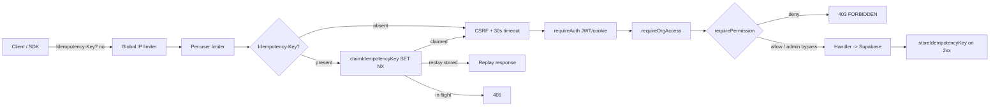
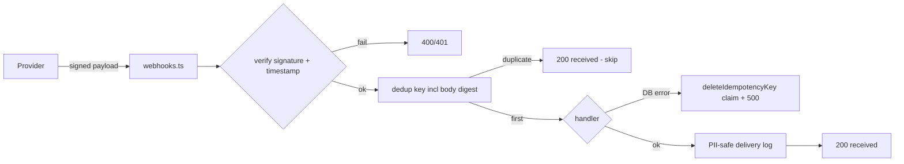

# API Contracts, Realtime, and Integrations Audit

## Audit Metadata

- Audit name: repo-deep-dive
- Run: 20261002-0344-develop-6286137
- Repository: C:\temp\mainecybertech
- Branch: develop
- Commit SHA: 6286137017c4b7c77e83ee420ec11382d984f263 (short `62861370`; verified with `git rev-parse HEAD`)
- Generated at: 2026-10-02
- Auditor: subagent (prompt 08 pass) — fresh read-only pass, cross-checked against the older 75d3926 report but not copied from it
- Area code: API
- Output path: docs/audits/repo-deep-dive/20261002-0344-develop-6286137/08_api_contracts_realtime_integrations.md
- Scope limitations:
  - Read-only static audit of the source at HEAD. No runtime, database, Redis, Stripe/Jira/JSM/M365, or production access.
  - `node` and `git` are not on `PATH` in this shell (`C:\Program Files\Git\cmd\git.exe` used explicitly for git; no `node` binary found), so the deterministic repository tools (`scripts/openapi-audit.js`, Jest suites, `tools/repo_inventory.py`) were **not executed**. Their inputs were read and reasoned over statically; where execution was needed the outcome is recorded as `not reproducible` in Verification Performed.
  - The pre-generated `docs/audits/repo-deep-dive/20261002-0344-develop-6286137/inventory.json` (branch `develop`, sha `62861370`, dirty `false`) was used as an inventory input.
  - Worker task handler bodies for `module-tasks`, `m365-calendar-sync`, `scheduled-notifications`, `retention` were skimmed, not exhaustively read.
  - Web Next.js server actions were reviewed at surface level (they proxy the same SDK/API), not every action file.

## Scope

Reviewed at HEAD `62861370`:

**API routing and middleware**
- `apps/api/src/app.ts` (router mounting order, global middleware chain)
- All 75 non-test route source files under `apps/api/src/routes/**` (61 routers mounted under `/api/v1`)
- Middleware: `auth.ts`, `permissions.ts`, `org-access.ts`, `admin.ts`, `idempotency.ts`, `optimistic-locking.ts`, `rate-limit.ts`, `csrf.ts`, `error.ts`, `not-found.ts`, `request-id.ts`, `request-timeout.ts`, `cache.ts`, `security.ts`, `security-headers.ts`
- `apps/api/src/lib/*` relevant to contracts/integrations: `http-client.ts`, `circuit-breaker.ts`, `idempotency.ts`, `permissions.ts`, `roles.ts`, `pagination.ts`, `ssrf-guard.ts`, `task-producer.ts`, `webhook-dispatcher.ts`, `webhook-signature.ts`, `tenant.ts`, `delete-confirm.ts`, `metrics.ts`
- `apps/api/src/types/index.ts` (envelope), `apps/api/src/config/env.ts` (integration secret keys)

**Contracts / OpenAPI**
- `apps/api/src/openapi/spec.ts` (RouteDef list), `apps/api/src/openapi/builder.ts`, `apps/api/src/openapi/generate.ts`, `docs/openapi.yaml` (generated, 412 quoted path keys)
- `scripts/openapi-audit.js`, `.github/workflows/test.yml` and `validate.yml` gates
- `docs/API_ERROR_HANDLING.md`, `docs/API_RATE_LIMITING.md`, `docs/API_VERSIONING.md`, `docs/API_ENDPOINT_INVENTORY.md`

**SDK**
- `packages/sdk/src/client.ts`, `index.ts`, `billing.ts`, `analytics.ts` and the 55 API accessors
- Web SDK usage: `apps/web/lib/client-api.ts`, `lib/api.ts`, `components/NotificationBell.tsx`

**Realtime / webhooks / integrations**
- `apps/api/src/routes/notifications.ts` (SSE + Supabase realtime), `routes/webhooks.ts` (Stripe/Jira/JSM/M365 inbound), `routes/webhook-management.ts` (outbound endpoints + dead letters)
- `apps/worker/src/tasks/webhook-retry.ts`, `stripe-reconcile.ts`, `jira-sync.ts`, `jsm-sync.ts`; `apps/worker/src/schedule-config.ts`

**Not reviewed in depth:** RLS policy SQL, Terraform/DO infra, M365 calendar sync body, `module-tasks` body, Next.js client components beyond `NotificationBell`.

## Evidence Reviewed

| Evidence | Type | Why relevant | Notes |
| -------- | ---- | ------------ | ----- |
| `apps/api/src/app.ts` | source | Router mount order + global middleware | 61 routers under `/api/v1`; global IP limiter, per-user limiter, idempotency, CSRF, 30s timeout |
| `apps/api/src/types/index.ts` | source | `success()`/`failure()` envelope | `{success,data}` / `{success,error:{code,message,status,details?}}`; no `request_id` field |
| `apps/api/src/middleware/permissions.ts` | source | `requirePermission(module,action)` | Present since prior audit; resolves per-org effective permissions, admin bypass |
| `apps/api/src/lib/permissions.ts` | source | Effective permission resolver | Shared by `me.ts` + middleware; overrides applied per-org set |
| `apps/api/src/routes/*.ts` (75 files) | source | Route contracts, validation, guards | 200 `requirePermission` call sites across routes |
| `apps/api/src/routes/webhooks.ts` | source | Inbound webhook handling | Body-digest dedup key + claim release on failure |
| `apps/api/src/routes/notifications.ts` | source | SSE stream | Local JWT revalidation via `req.userJwt` |
| `apps/api/src/lib/http-client.ts` | source | Outbound resilience | Timeout + retries on 429/5xx + circuit breaker |
| `apps/api/src/lib/webhook-dispatcher.ts` | source | Outbound webhook delivery | Queue-first + inline retry/DLQ + SSRF guard |
| `apps/api/src/lib/ssrf-guard.ts` | source | Webhook URL safety | Sync + DNS-resolving checks |
| `apps/api/src/lib/idempotency.ts` + `middleware/idempotency.ts` | source | Idempotency semantics | Atomic claim + response replay, owner+route scoping |
| `apps/api/src/openapi/spec.ts`/`generate.ts`, `docs/openapi.yaml` | source | Contract source of truth | Spec.ts unchanged since openapi.yaml; 412 paths |
| `scripts/openapi-audit.js` + CI workflows | source/CI | Contract drift gate | Gates MISSING (fails), EXTRA only warns |
| `packages/sdk/src/client.ts` | source | SDK retry/timeout semantics | Retries POST on 429/502/503/504; no `Idempotency-Key` |
| `apps/web/components/NotificationBell.tsx` | source | Realtime client | EventSource + cookie; one-shot polling fallback |
| `apps/worker/src/tasks/{webhook-retry,stripe-reconcile,jira-sync,jsm-sync}.ts` | source | Background delivery/retries | Partial-failure reporting gaps |
| `docs/API_ERROR_HANDLING.md` etc. | docs | Published contract statements | Codes/status/`request_id` do not match implementation |

## Verification Performed

| Evidence | Type | Why relevant | Notes |
| -------- | ---- | ------------ | ----- |
| `git -C C:\temp\mainecybertech rev-parse HEAD` | command | Confirm audited revision | Output `6286137017c4b7c77e83ee420ec11382d984f263`; branch `develop` — **supported** |
| `git log -1 --format` | command | Confirm commit date/subject | `62861370 2026-10-01 23:25:45 -0400 docs: record the widened a11y default gate` — **supported** |
| `git status --short` | command | Confirm working tree vs inventory `dirty:false` | Only untracked `docs/audits/repo-deep-dive/` (this run's artifacts); app tree clean — **supported** |
| `grep requirePermission` across `apps/api/src` | command | Verify API-side RBAC exists (prior API-P1-001) | 200 call sites in routes; middleware present — prior finding **verified-fixed** |
| `Select-String` mutation-route/`requirePermission` matrix per route file | command | Find unguarded mutations | Files with mutations and no permission guard enumerated (see Inventory) — **supported** |
| `grep Idempotency-Key packages/sdk apps/web` | command | Verify SDK sends idempotency keys | No matches anywhere — prior API-P2-009 **still-open** |
| Read `webhooks.ts:264-268,359-363,215-220,308-313` | source | Verify dedup key + claim release | Body digest in key; claim deleted on failure — prior API-P1-003/P1-004 **verified-fixed** |
| Read `notifications.ts:51-86` | source | Verify SSE revalidation | Verifies `req.userJwt` locally — prior API-P2-008 **verified-fixed** |
| Read `billing.ts:311-327` | source | Verify portal-session org resolution | body→query→header→cookie — prior API-P1-005 **verified-fixed** |
| Read `vendors.ts:166-187`, `license-optimizer.ts:55-123` | source | Verify route ordering | Static routes before `/:id` — prior API-P1-002 **verified-fixed** |
| Read `validators/governance.ts:13-22`, `governance.ts:107-124` | source | Verify state-machine PATCH guard | `updateChangeSchema` excludes status/approved_by — prior API-P1-006 **verified-fixed** |
| `docs/openapi.yaml` quoted-path count | command | Count documented paths | 412 path keys; header says 412 — **supported** |
| `git log 81b54a85..HEAD -- apps/api/src/openapi/spec.ts` | command | Check spec vs generated doc drift | Empty (spec unchanged since generation) — doc **not stale** by route set |
| `node scripts/openapi-audit.js` / `pnpm test` | command | Reproduce CI coverage + contract tests | `node` unavailable in shell — **not reproducible** (analyzed statically) |
| `docs/API_ERROR_HANDLING.md` vs `middleware/error.ts`, `types/index.ts` | source+docs | Verify documented error contract | Codes/status/`request_id` mismatch — **unsupported** as written (see API-P2-004) |
| Read `apps/worker/src/tasks/{jira,jsm}-sync.ts`, `stripe-reconcile.ts` | source | Verify integration retry/reporting | jsm no 429 retry; jira/stripe return `ok:true` on partial failure — **supported** |

## Executive Summary

The API contract surface is materially stronger than the 75d3926 baseline. Six of the seven prior high-severity findings are fixed and reproduced in source at HEAD:

- **API-P1-001 (RBAC UI-only)** → **verified-fixed.** `apps/api/src/middleware/permissions.ts` implements `requirePermission(module,action)` and it is applied at 200 call sites across the route tree; `apps/api/src/lib/permissions.ts` resolves role+override permissions per org.
- **API-P1-002 (route shadowing)** → **verified-fixed.** `vendors.ts` renewals and `license-optimizer.ts` reclaimable/summary are registered before `/:id`.
- **API-P1-003 / API-P1-004 (webhook dedup + claim loss)** → **verified-fixed.** Jira/JSM dedup keys now include a SHA-256 body digest and the claim is deleted in the catch so retries reprocess.
- **API-P1-005 (portal session)** → **verified-fixed.** `create-portal-session` resolves the org from body → query → `X-Active-Org` → cookie.
- **API-P1-006 (state-machine PATCH)** → **verified-fixed.** `updateChangeSchema` deliberately excludes state-machine columns and the crud PATCH falls back to a partial whitelist.
- **API-P2-008 (SSE self-termination)** → **verified-fixed.** Revalidation verifies `req.userJwt` locally.

Additional strengths: outbound HTTP now retries 429/5xx with a circuit breaker; idempotency middleware atomically claims keys, scopes them to caller+route, and replays the stored success response; outbound webhooks have a queue-first path plus inline retries, DLQ, and an SSRF guard; webhook deliveries store PII-safe summaries; an OpenAPI spec is generated to `docs/openapi.yaml` (412 paths) and gated in CI for route coverage.

The remaining findings are concentrated in **boundary completeness and contract accuracy**, not headline architecture:

1. **Unguarded mutations remain in a handful of routers** (API-P2-001): most notably `apps/api/src/routes/governance.ts:180` (`POST /change-requests/:id/submit`, a state transition with no `requirePermission`) and `apps/api/src/routes/client-onboarding-command-center.ts` (5 mutations, auth+org only). `final/procurement.ts` and the public `store`/`analytics`/`public` surfaces are unauthenticated/by-design but unguarded or only globally limited.
2. **Integration partial failures report success** (API-P2-002): `jira-sync`, `jsm-sync`, and `stripe-reconcile` return `{ok:true}` even when per-item errors were counted, and `jsm-sync` has no 429/5xx retry (unlike `jira-sync`/`stripe-reconcile`). Outbound `webhook-dispatcher` inline idempotency uses a non-atomic check-then-store.
3. **Published error contract is inaccurate** (API-P2-003/API-P2-004): `docs/API_ERROR_HANDLING.md` documents codes (`VALIDATION_FAILED`, `AUTH_TOKEN_EXPIRED`, `PERM_INSUFFICIENT`), 422 status, and a body `request_id` that the implementation does not emit; `rateLimitByUser` returns a plain string 429 that the SDK cannot parse as JSON.
4. **SDK still retries unsafe POSTs without an `Idempotency-Key`** (API-P2-005, carried from the prior audit and now **still-open**) despite the API's replay-capable idempotency middleware — a transient 503 after commit can double-create.
5. **OpenAPI binding/coverage is one-directional** (API-P2-006/P3-002): the committed `docs/openapi.yaml` records no commit hash, and the CI audit treats documented-but-missing routes as warnings only.

Overall REST/contracts domain score: **4/5** — the layer is production-ready with tests/docs/observability, but not yet "mature/continuously validated" because permission coverage is not uniform, integration failure reporting is lossy, published error docs contradict the code, and the SDK retry/idempotency contract remains asymmetric.

## Inventory

| Item | Path / symbol | Purpose | Current state | Risk | Notes |
| ---- | ------------- | ------- | ------------- | ---- | ----- |
| Envelope types | `apps/api/src/types/index.ts` | `success()`/`failure()` contract | Implemented, consistent | Low | 204 deletes bypass body (by design); no `request_id` field |
| Router mounting | `apps/api/src/app.ts` | 61 routers under `/api/v1` | Implemented | Low | Global limiter skips `/api/v1/webhooks/` |
| Permission middleware | `apps/api/src/middleware/permissions.ts` | `requirePermission(module,action)` | Implemented, 200 call sites | Low | Admin/super_admin bypass; per-org resolution |
| Effective permissions | `apps/api/src/lib/permissions.ts` | role+override union per org | Implemented (per-org overrides) | Low | Shared with `me.ts` |
| Route files | `apps/api/src/routes/**` (75) | Endpoints | Implemented | Medium | Guard coverage not uniform (see API-P2-001) |
| Idempotency (request) | `middleware/idempotency.ts` + `lib/idempotency.ts` | Atomic claim + replay | Implemented | Low | Owner+route scoped; 409 while in-flight |
| Idempotency (webhook ingress) | `routes/webhooks.ts` | Dedup per provider | Implemented | Low | Body-digest keys; claim released on failure |
| Outbound HTTP | `lib/http-client.ts`, `circuit-breaker.ts` | Timeout/retry/breaker | Implemented | Low | Retries 429/5xx; 4xx not retried |
| Outbound webhooks | `lib/webhook-dispatcher.ts` | Org webhook delivery | Implemented | Medium | Queue-first; inline path non-atomic dedup |
| Dead letters | `routes/webhook-management.ts` (`/dead-letters`) | DLQ list/retry/dismiss | Implemented | Low | Tenant-scoped via endpoint ownership |
| SSRF guard | `lib/ssrf-guard.ts` | Block private/loopback URLs | Implemented | Low | Sync + DNS resolution; redirects not followed |
| SSE notifications | `routes/notifications.ts` `/stream` | Realtime stream | Implemented | Low | Local JWT revalidation; keepalive 30s |
| Realtime client | `apps/web/components/NotificationBell.tsx` | EventSource consumer | Implemented | Low | One-shot polling fallback, no reconnect |
| SDK client | `packages/sdk/src/client.ts` | Typed client | Implemented | Medium | Retries unsafe POSTs; no `Idempotency-Key` |
| OpenAPI spec | `apps/api/src/openapi/spec.ts` | RouteDef contract | Implemented | Low | 412 documented paths |
| Generated contract | `docs/openapi.yaml` | Offline contract | Implemented, current | Low | No commit binding |
| OpenAPI CI gate | `scripts/openapi-audit.js`, `test.yml`/`validate.yml` | Drift gate | Implemented | Low | MISSING fails; EXTRA warns only |
| Rate limiting | `middleware/rate-limit.ts` | IP/user/auth/email/metrics buckets | Implemented | Low | `rateLimitByUser` 429 is plain string |
| Error handler | `middleware/error.ts` | Normalized AppError/ZodError | Implemented | Low | 5xx messages genericized; no `request_id` |
| Worker integrations | `apps/worker/src/tasks/*` | Jira/JSM/Stripe/webhook retry | Implemented | Medium | Partial-failure `ok:true`; jsm no 429 retry |

## Domain Scorecard

| Category | Score | Evidence | Gap | Recommended action |
| --- | ---: | --- | --- | --- |
| REST/RPC routes | 4 | 61 mounted routers; consistent envelope; 200 `requirePermission` sites; shadowing fixed | A few mutations unguarded (`governance` submit, `client-onboarding`, `procurement`, public surfaces) | Close permission gaps; add a route-guard coverage test |
| Server actions | 3 | 37 `"use server"` action files proxy the SDK | No action↔route contract tests | Add thin contract tests for high-value actions |
| WebSocket/realtime | 4 | SSE `/notifications/stream` + Supabase realtime channel; cookie JWT revalidation fixed | Client fallback is one-shot polling; no proactive reconnect | Add reconnect/backoff on `auth_expired` |
| Subscriptions/events | 3 | Per-user `postgres_changes` channel; sanitized payloads | No documented disconnect/reconnect contract | Document + test reconnect semantics |
| Webhooks | 4 | 4 providers signature-verified; body-digest dedup; claim release; retry+DLQ worker; SSRF guard | Inline dispatcher dedup non-atomic; M365 `GET` route unverified here | Use `claimIdempotencyKey` in inline dispatcher |
| External clients | 3 | `httpClients` timeout/retry/breaker; `jira-sync`/`stripe-reconcile` retry 429 | `jsm-sync` no 429/5xx retry | Add retry to `jsm-sync` |
| Retries/timeouts/circuit breakers | 4 | `HttpClient` (retry 429/5xx, breaker), 30s request timeout, worker `AbortSignal.timeout` | SDK retries unsafe POSTs without idempotency key | Send `Idempotency-Key` or drop unsafe retries |
| Pagination/filter/sort | 3 | `{items,total,page,limit}` on most lists; `parsePagination`/`LIST_HARD_CAP` helper | Some lists return capped raw arrays; limited sort params | Unify envelopes; add sort validation |
| Error response format | 3 | Global handler normalizes AppError/ZodError; 5xx genericized | `rateLimitByUser` plain-string 429; docs claim unsupported codes/`request_id` | Envelope 429; reconcile docs to code |
| OpenAPI/versioning | 4 | Generated `openapi.yaml` (412 paths), runtime `/openapi.json`, CI coverage gate | No commit binding; EXTRA-only warnings; `info.version` is `1.0.0` static | Bind artifact to commit; tighten audit |
| Request/response validation | 4 | Zod on most mutations; `parsePartialUpdate`; contract tests | Some legacy routes rely on service-layer schemas | Extend contract tests |
| Auth/rate limit | 4 | Multi-layer limiters (IP/user/auth-email/email/metrics); CSRF; JWT fast-path; permission layer exists | Guard coverage not uniform; per-user limiter output shape | Close gaps; envelope 429 |

## Detailed Review

### Item: Response envelope & error handling

- Evidence: `apps/api/src/types/index.ts:24-38`, `apps/api/src/middleware/error.ts:20-51`, `apps/api/src/middleware/not-found.ts`, `apps/api/src/middleware/rate-limit.ts:27-40`.
- What it does: Every JSON response uses `{success,data}` or `{success,error:{code,message,status,details?}}`. `AppError` and `ZodError` are normalized in one place; 5xx messages are replaced with a generic client message while the real message is logged.
- How it appears to work: Consistent. 404s use the same envelope. ZodError maps to `VALIDATION` at HTTP 400 (not 422).
- Missing controls: `rateLimitByUser` returns a plain string (`"Too many requests from this user..."`) with HTTP 429, not the JSON envelope; `executiveFetch` in the SDK does `await res.json()` and therefore throws a parse error on that body. Error bodies do not include `request_id` (only the `X-Request-ID` header is set in `middleware/request-id.ts:18`).
- Risks: Client error handling inconsistency; docs mismatch (see findings).
- Recommended improvement: Return `failure("RATE_LIMIT", ..., 429)` from `rateLimitByUser`; optionally echo `request_id` in the envelope.

### Item: API-side permission enforcement

- Evidence: `apps/api/src/middleware/permissions.ts`, `apps/api/src/lib/permissions.ts`, 200 `requirePermission` call sites.
- What it does: Resolves the active org (query → body → `X-Active-Org` → cookie → `req.orgId`), computes the union of role permissions plus per-org overrides, and denies 403 unless the `${module}:${action}` key is present (super_admin/admin bypass).
- How it appears to work: Applied broadly to module CRUD + lifecycle actions (approvals, findings verify/resolve, dns-changes manage, etc.).
- Missing controls: Not applied uniformly — `governance.ts` `submit`, all five `client-onboarding-command-center` mutations, `final/procurement/compare`, `bulk/invite` (uses `requireAdmin`), and the public `store`/`analytics`/`public` surfaces lack a module permission. See API-P2-001.
- Risks: An org member whose role denies a module can still trigger those specific actions.

### Item: Idempotency (request + webhook)

- Evidence: `apps/api/src/middleware/idempotency.ts:24-105`, `apps/api/src/lib/idempotency.ts:98-182`, `apps/api/src/routes/webhooks.ts:40-49,69-222`.
- What it does: When `Idempotency-Key` is present, the middleware atomically claims a key scoped by caller+method+route, replays the stored success response on retry, and returns 409 while in flight; failed responses release the key. Webhook ingress dedups on provider keys (Stripe `event.id`; Jira/JSM `webhookEvent+issueKey+body-digest`).
- How it appears to work: Sound and improved over the prior commit.
- Missing controls: The SDK never sends `Idempotency-Key` (grep: no matches in `packages/sdk` or `apps/web`), and the inline `webhook-dispatcher` uses `checkIdempotencyKey`+`storeIdempotencyKey` (non-atomic) rather than `claimIdempotencyKey`.
- Risks: Duplicate records on retried unsafe POSTs; duplicate outbound webhook sends under concurrency.

### Item: SSE / realtime

- Evidence: `apps/api/src/routes/notifications.ts:30-146`, `apps/api/src/middleware/auth.ts:43-60`, `apps/web/components/NotificationBell.tsx:81-119`.
- What it does: Authenticated SSE stream over a per-user Supabase realtime channel with 30s keepalives and a 5-minute revalidation that now verifies `req.userJwt` locally across comma-separated JWT secrets.
- How it appears to work: Cookie-authenticated EventSource sessions survive past 5 minutes (prior bug fixed).
- Missing controls: The web client's `es.onerror` closes the stream and starts a 30s polling interval once; it does not attempt to reconnect the EventSource (and the interval cleanup returned from `onerror` is not wired to effect cleanup). No documented reconnect contract.
- Risks: Graceful degradation only; realtime reliability depends on the proxy not dropping the connection.

### Item: Outbound integrations & retries

- Evidence: `apps/api/src/lib/http-client.ts:46-76`, `apps/api/src/lib/circuit-breaker.ts`, `apps/worker/src/tasks/jira-sync.ts:47-75`, `apps/worker/src/tasks/jsm-sync.ts:61-69`, `apps/worker/src/tasks/stripe-reconcile.ts:28-55`.
- What it does: `HttpClient` retries 429/5xx with linear backoff and trips a circuit breaker on thrown errors; worker Jira/Stripe fetches retry 429 and network errors with `AbortSignal.timeout(15_000)`.
- Missing controls: `jsm-sync` uses raw `fetch` with a 15s timeout but **no retry** on 429/5xx. `jira-sync` (line 206) and `stripe-reconcile` (line 146) always return `{ok:true}` even after counting per-item errors, and `jsm-sync` returns `ok:true` unless every insert failed.
- Risks: Silent partial sync failures; unbounded staleness not surfaced to alerting.

### Item: OpenAPI / versioning

- Evidence: `apps/api/src/openapi/spec.ts`, `apps/api/src/openapi/generate.ts:48-60`, `docs/openapi.yaml` (412 paths), `scripts/openapi-audit.js`, `.github/workflows/test.yml:61-67`.
- What it does: `buildSpec()` is served at runtime (`/api/v1/openapi.json`) and materialized to `docs/openapi.yaml` by `generate:openapi`. CI validates the spec and runs `openapi-audit.js`, which fails when a statically-resolvable route is missing from the spec and warns about spec entries with no statically-resolvable route.
- Missing controls: The generated artifact records `info.version: "1.0.0"` and no commit/date (binding gap). Documented-but-missing entries are warnings only, so a spec route that no longer exists will not fail CI. `spec.ts` is unchanged since `docs/openapi.yaml` was regenerated (commit 81b54a85), and the only route-touching commit since (`c9f855af`) added guards, not routes, so the artifact is currently consistent by route set.

### Item: SDK client retry/idempotency

- Evidence: `packages/sdk/src/client.ts:20-127,129-156`, `apps/web/lib/client-api.ts`.
- What it does: 30s timeout, 3 retries with exponential backoff on 429/502/503/504 for all methods including POST/PUT/PATCH/DELETE; forwards `X-Active-Org`; adds CSRF header for cookie-only unsafe calls.
- Missing controls: No `Idempotency-Key` on retried unsafe requests; `retryableStatuses` includes 429 but the API's per-user 429 body is a plain string the SDK cannot parse into an `ApiError`.
- Risks: Duplicate creates on transient failures; opaque errors on rate limiting.

## Scenario / Control Matrix

| ID | Scenario or control | Evidence | Current control | Gap | Severity | Recommendation |
| --- | --- | --- | --- | --- | --- | --- |
| API-001 | REST/RPC routes | `app.ts`, 75 route files | Envelope + Zod + 200 permission guards | A few mutations unguarded | P2 | Close guards; add coverage test |
| API-002 | Server actions | 37 `"use server"` files | Proxy SDK calls | No action↔route contract tests | P3 | Add thin contract tests |
| API-003 | WebSocket/realtime | `notifications.ts` | SSE + keepalive + local JWT revalidation | Client no reconnect | P3 | Add EventSource reconnect/backoff |
| API-004 | Subscriptions/events | Supabase channel in SSE | Per-user filter | No documented disconnect contract | P3 | Document + test |
| API-005 | Webhooks | `webhooks.ts`, `webhook-management.ts` | Sig verify + digest dedup + DLQ + SSRF | Inline dispatch dedup non-atomic | P2 | Use atomic claim inline |
| API-006 | External clients | `http-client.ts`, worker tasks | Timeout/retry/breaker | `jsm-sync` no retry | P2 | Add retry to `jsm-sync` |
| API-007 | Retries/timeouts/breakers | `http-client.ts`, `request-timeout.ts` | Retry 429/5xx + breaker + 30s timeout | SDK unsafe retries w/o key | P2 | Send `Idempotency-Key` |
| API-008 | Pagination/filter/sort | `pagination.ts`, list routes | `{items,total,page,limit}` mostly | Capped raw arrays; few sort params | P3 | Unify + validate sort |
| API-009 | Error response format | `error.ts`, `rate-limit.ts` | Normalized envelope | String 429; no `request_id` | P3 | Envelope 429 |
| API-010 | OpenAPI/versioning | `spec.ts`, `openapi.yaml`, CI | Generated spec + coverage gate | No commit binding; EXTRA-only | P3 | Bind artifact; tighten audit |
| API-011 | Request/response validation | Zod validators, `parsePartialUpdate` | Broad on mutations | Legacy routes thin | P3 | Extend contract tests |
| API-012 | Auth/rate limit | `auth.ts`, `rate-limit.ts`, `permissions.ts` | Multi-layer | Guard coverage not uniform | P2 | Close remaining gaps |

## Findings

### Finding ID: API-P2-001 - Mutations remain unguarded by `requirePermission` in several routers (including a governance state transition)

- Severity: P2
- Confidence: High
- Area: Authorization / API contracts
- Evidence:
  - `apps/api/src/routes/governance.ts:180` — `router.post("/change-requests/:id/submit", async ...)` has **no** `requirePermission`, while approve/reject/implement/verify at `:206/:239/:268/:297` do.
  - `apps/api/src/routes/client-onboarding-command-center.ts:129` (create), `:142` (patch), `:162` (delete), `:180` (`/:id/complete-phase`), `:223` (`/:id/checklist/:itemId`) — auth + `requireOrgAccess` only; no `requirePermission`.
  - `apps/api/src/routes/final/procurement.ts:8` — `POST /procurement/compare` reads `organization_id` from query with no guard (read-only body-for-convenience endpoint).
  - Public by design, but unguarded and only on the global IP limiter: `apps/api/src/routes/store/quotes.ts:68` (`POST /store/quotes`), `apps/api/src/routes/analytics.ts:27` (`POST /analytics/track`), `apps/api/src/routes/public.ts:122` (`POST /public/submit`).
- What is happening: The permission layer (`middleware/permissions.ts`) is applied at 200 sites but not universally. A `governance` "submit" is a state transition (draft→`pending_review`, sets `submitted_at`) yet requires no module permission; the entire client-onboarding command center accepts create/update/delete/phase-completion from any approved org member; procurement compare is unguarded.
- Why it matters: The prior audit's headline risk was "RBAC is UI-only." That is largely fixed, but residual unguarded mutations mean the enforcement boundary is still uneven for specific modules/actions, and a "view-only" member can still mutate those records via the API.
- User / business impact: Roles that should be read-only can create/submit/delete on the affected modules; audit logs record the action as legitimate.
- Security / privacy / reliability impact: Residual privilege-escalation surface within a tenant; inconsistent control boundary is hard to reason about in compliance reviews.
- Recommended fix: Add `requirePermission("change-requests","edit")` to the submit route; add a `client-onboarding` module guard set to the five onboarding mutations; decide whether `procurement/compare` should require `procurement:view`. For public surfaces, document the "intentionally public" intent and add a dedicated limiter.
- Suggested validation: Extend `apps/api/src/__tests__/middleware-permissions.test.ts` and add per-router tests asserting a role lacking the module:action receives 403 on these routes.
- Owner suggestion: API principal engineer
- Effort estimate: S (0.5 day for guards + tests)
- Dependencies: Catalog must contain the module keys (`change-requests`, `client-onboarding`)
- Status: open
- Endpoint / data path: `POST /api/v1/governance/change-requests/:id/submit` → `getScopedClient(req,"governance","write")` → `change_requests.update`
- Attack path: An org member with a view-only role calls the unguarded `submit` and client-onboarding mutations directly, bypassing the UI permission gate.

### Finding ID: API-P2-002 - External integration syncs report success while dropping items, and `jsm-sync` has no HTTP retry

- Severity: P2
- Confidence: High
- Area: External integrations / reliability
- Evidence:
  - `apps/worker/src/tasks/jira-sync.ts:206` returns `{ ok: true }` even though it counts `errors` (line 184) per item.
  - `apps/worker/src/tasks/stripe-reconcile.ts:146` returns `{ ok: true }` after `errors++` (line 116/132).
  - `apps/worker/src/tasks/jsm-sync.ts:61-69` uses raw `fetch` with `AbortSignal.timeout(15_000)` and **no retry** on 429/5xx (contrast `jira-sync.ts:62-66` and `stripe-reconcile.ts:42-46`, which back off on 429).
  - `apps/api/src/lib/http-client.ts:74-76` shows the intended retryable set (429, 5xx).
- What is happening: Background integration jobs can partially fail while returning an `ok:true` result. The worker consumer and alerting therefore treat a run with N dropped records as a clean success. `jsm-sync` additionally will not recover from a transient 429/5xx, silently skipping a whole batch.
- Why it matters: These jobs are the reconciliation backbone for tickets (JSM), tasks (Jira), and billing/subscription state (Stripe). A silently partial reconciliation produces stale records with no operator signal.
- User / business impact: Tickets/tasks/subscriptions/invoice statuses can drift from the source systems; billing suspension decisions depend on `stripe-reconcile` accuracy.
- Security / privacy / reliability impact: Reliability/observability gap; no data loss on write, but undetected staleness.
- Recommended fix: Return `{ ok: false, error }` when `errors > 0` (or add a structured `partial` result with counts); add a 429/5xx retry wrapper to `jsm-sync` matching `jira-sync`.
- Suggested validation: Unit tests injecting a failing per-item write (or a mocked 500) and asserting the task result reflects failure; add a worker test for `jsm-sync` 429 retry.
- Owner suggestion: Worker/API platform engineer
- Effort estimate: S-M (1 day)
- Dependencies: Task result contract consumed by `apps/worker/src/consumer-*`
- Status: open
- Endpoint / data path: worker task `jira-sync`/`jsm-sync`/`stripe-reconcile` → source API → Supabase upserts
- Attack path: none identified

### Finding ID: API-P2-003 - Published error-handling contract contradicts the implementation (codes, 422, and `request_id`)

- Severity: P2
- Confidence: High
- Area: Contracts / documentation accuracy
- Evidence:
  - `docs/API_ERROR_HANDLING.md:37-83` documents codes `AUTH_TOKEN_EXPIRED`, `VALIDATION_FAILED` (422), `PERM_INSUFFICIENT`, `RESOURCE_NOT_FOUND`, and a body field `request_id` (`:6-20`, `:155-161`).
  - `apps/api/src/middleware/error.ts:20-51` emits AppError codes as-is (`UNAUTHORIZED`, `FORBIDDEN`, `NOT_FOUND`, …), `ZodError` as `VALIDATION` at **400**, and a generic `INTERNAL_SERVER_ERROR`.
  - `apps/api/src/types/index.ts:1-38` — the envelope has no `request_id` field.
  - `apps/api/src/middleware/request-id.ts:15-19` sets `X-Request-ID` as a header only.
  - `apps/api/src/middleware/permissions.ts:88` throws `FORBIDDEN` (not `PERM_INSUFFICIENT`).
- What is happening: The error-handling document describes a taxonomy and a body `request_id` the API does not produce. Consumer code that switches on the documented codes (as the doc's own example does at `:229-243`) will not match real responses.
- Why it matters: A published contract that is wrong is worse than no contract; downstream clients, SDK error mapping, and future AI agents will code against fictional codes.
- User / business impact: Clients surface generic/wrong error messages; support triage relies on codes that never appear.
- Security / privacy / reliability impact: Low direct; observability and support quality.
- Recommended fix: Either (a) update `docs/API_ERROR_HANDLING.md` to the real codes/statuses and header-based request id, or (b) add a code-mapping layer in `error.ts` to the documented taxonomy and include `request_id` in the envelope. Prefer (a) plus the 429 envelope fix (API-P3-001).
- Suggested validation: A contract test asserting the emitted `error.code`/`status` for representative AppError and ZodError cases; review the doc against it.
- Owner suggestion: API documentation + implementation agent
- Effort estimate: S (0.5 day)
- Dependencies: None
- Status: open
- Endpoint / data path: all routes → `middleware/error.ts`
- Attack path: none identified

### Finding ID: API-P2-004 - SDK retries unsafe requests without an `Idempotency-Key` (duplicate creates on transient failure)

- Severity: P2
- Confidence: High
- Area: SDK / retry semantics
- Evidence:
  - `packages/sdk/src/client.ts:20-26` (`retryableStatuses: [429,502,503,504]`), `:60-120` (retry loop applies to all methods; `unsafeMethods` at `:49` is used only for the CSRF header), `:129-156` (`request()` sets no `Idempotency-Key`).
  - `grep "Idempotency-Key|idempotencyKey" packages/sdk/src apps/web` → **no matches**.
  - `apps/api/src/middleware/idempotency.ts:24-28` — the middleware only activates when the client sends the header.
  - `apps/web/lib/client-api.ts:16-22` constructs the client without idempotency support.
- What is happening: A POST/PATCH/DELETE that reaches the API and commits, but whose response is lost (e.g., 503 at the proxy), is retried up to 3 times by the SDK. Because no `Idempotency-Key` is sent, the API cannot dedupe and the mutation can be applied multiple times.
- Why it matters: The API's idempotency investment is real but unused by the only first-party client; the safety is one-sided.
- User / business impact: Duplicate tickets/comments/documents/projects under flaky networks — a previously observed complaint pattern.
- Security / privacy / reliability impact: Data duplication and support noise; no confidentiality issue.
- Recommended fix: Have `ApiClient.request()` generate a UUID `Idempotency-Key` for unsafe methods and pass it through retries (same key across attempts); or disable retries for unsafe methods when no key can be supplied.
- Suggested validation: SDK unit test asserting the header is present and stable across retry attempts; API test that a replayed key returns the stored response (`X-Idempotent-Replay: true`).
- Owner suggestion: SDK owner
- Effort estimate: S (0.5 day)
- Dependencies: None (middleware already supports replay)
- Status: still-open (carried from prior run 75d3926, confirmed present at HEAD)
- Endpoint / data path: SDK `POST/PATCH/DELETE *` → API idempotency middleware
- Attack path: none identified

### Finding ID: API-P2-005 - Outbound webhook dispatcher uses a non-atomic idempotency check (duplicate deliveries under concurrency)

- Severity: P2
- Confidence: Medium
- Area: Webhooks / reliability
- Evidence:
  - `apps/api/src/lib/webhook-dispatcher.ts:139-141` uses `checkIdempotencyKey(...)` (read) then `:157` delivers, then `:193-195` `storeIdempotencyKey(...)` on 2xx.
  - Contrast the atomic `claimIdempotencyKey` (`SET NX EX`) used for inbound webhooks at `apps/api/src/routes/webhooks.ts:40-49` and by `middleware/idempotency.ts:45`.
  - `apps/api/src/lib/idempotency.ts:62-91` documents the check-then-store race the atomic claim was introduced to prevent.
- What is happening: The inline (queue-unavailable fallback) delivery path reads the dedup key, sends, and only stores the key after a 2xx. Two concurrent dispatches of the same event for the same endpoint can both pass the check and both deliver. The 3-attempt internal retry also re-POSTs without an atomic claim.
- Why it matters: Duplicate outbound webhooks can cause duplicate downstream effects (e.g., a client creating two tickets from one `project.created`).
- User / business impact: Noisy/duplicated downstream integrations for orgs on the fallback path.
- Security / privacy / reliability impact: Reliability/consistency; no confidentiality issue.
- Recommended fix: Replace the read/store pair with `claimIdempotencyKey(idempotencyKey, "processing")` before delivery and only mark it `done` on success (release on terminal 4xx), mirroring the inbound webhook pattern.
- Suggested validation: Concurrency test that fires two dispatches of the same event and asserts a single POST.
- Owner suggestion: API platform engineer
- Effort estimate: S (0.5 day)
- Dependencies: None
- Status: open
- Endpoint / data path: event → `dispatchWebhook()` → inline `deliverWithRetry()` → endpoint URL
- Attack path: none identified (reliability, not security)

### Finding ID: API-P3-001 - Minor contract inconsistencies (`rateLimitByUser` non-enveloped 429, capped raw-array lists, no `request_id`)

- Severity: P3
- Confidence: High
- Area: Consistency / hygiene
- Evidence:
  - `apps/api/src/middleware/rate-limit.ts:27-40` — `rateLimitByUser` `message` is a plain string, unlike the global limiter JSON envelope at `app.ts:125-143`; `packages/sdk/src/client.ts:76` parses `res.json()`, so the string body raises a parse error surfaced as an opaque failure.
  - `apps/api/src/lib/pagination.ts:14-19` — `LIST_HARD_CAP` exists for lists that "still return a plain array"; e.g. `apps/api/src/routes/analytics.ts:64-78` and `billing.subscriptions` return raw arrays.
  - `docs/API_ERROR_HANDLING.md:155-161` claims a body `request_id`; `apps/api/src/middleware/error.ts` never includes one.
- What is happening: Several small shape/consistency gaps persist. Rate-limited authenticated clients get a non-JSON body; some list endpoints return raw capped arrays; error bodies omit request id.
- Why it matters: Client error typing, SDK ergonomics, and traceability.
- User / business impact: Minor; SDK shows a generic failure for 429 instead of a structured error.
- Security / privacy / reliability impact: None severe.
- Recommended fix: Return the JSON envelope from `rateLimitByUser`; unify remaining list shapes; optionally add `request_id` to `failure()`.
- Suggested validation: A limiter test asserting the 429 body parses as the standard envelope.
- Owner suggestion: Implementation agent
- Effort estimate: S (0.5 day)
- Dependencies: None
- Status: open

### Finding ID: API-P3-002 - OpenAPI artifact is not bound to a commit and the CI audit warns (not fails) on documented-but-missing routes

- Severity: P3
- Confidence: High
- Area: OpenAPI / CI contract
- Evidence:
  - `apps/api/src/openapi/generate.ts:48-58` writes `docs/openapi.yaml` with a static `info.version: "1.0.0"` and a regeneration note; no commit/date metadata.
  - `docs/openapi.yaml:1-9` confirms the header/version.
  - `scripts/openapi-audit.js:109-124` — `MISSING` exits 1, but `EXTRA` (spec entries with no statically-resolvable route) is printed as a warning only and never fails.
  - `docs/openapi.yaml` was last written at commit `81b54a85` (2026-09-29); HEAD is `62861370`. `git log 81b54a85..HEAD -- apps/api/src/openapi/spec.ts` is empty and the only route-touching commit since (`c9f855af`) added guards, so the artifact is currently consistent by route set.
- What is happening: The generated contract cannot be traced to the revision it represents, and a spec entry with no backing route can silently remain as documented-but-missing.
- Why it matters: Binding (per shared rules) requires generated artifacts to record their source revision; stale phantom endpoints mislead consumers.
- User / business impact: Low today; risk of doc drift over time.
- Security / privacy / reliability impact: None direct.
- Recommended fix: Embed commit/date in the generated header (from `GIT_SHA`); fail CI on `EXTRA` entries that are not on an explicit allowlist of dynamic-factory routes.
- Suggested validation: CI step asserting the generated header contains the current commit; a test listing unresolved spec entries against an allowlist.
- Owner suggestion: Implementation agent
- Effort estimate: M (1 day including allowlist)
- Dependencies: `GIT_SHA` availability in CI
- Status: open

### Finding ID: API-P3-003 - Realtime client has no reconnect path; server emits `auth_expired` with no documented client handling

- Severity: P3
- Confidence: Medium
- Area: Realtime / resilience
- Evidence:
  - `apps/api/src/routes/notifications.ts:55-85` ends the stream and emits `event: auth_expired` when the JWT is expired.
  - `apps/web/components/NotificationBell.tsx:108-113` — `es.onerror` closes the EventSource and starts a single 30s polling interval; it never reconnects the stream, and the interval returned by `onerror` is not tied to the effect cleanup.
  - `apps/api/src/routes/notifications.ts:138-142` cleans up the channel on `req.on("close")`.
- What is happening: After a token rotation, expiry, or transient drop, the bell degrades permanently to polling until the component remounts. No client-side handling for the `auth_expired` event is present.
- Why it matters: The advertised realtime channel silently becomes polling latency; connection state is not observable to the client.
- User / business impact: Notification latency up to 30s after any drop.
- Security / privacy / reliability impact: Minor resource churn; no data exposure.
- Recommended fix: Add an `auth_expired` listener and a bounded reconnect-with-backoff for `onerror`, closing polling once reconnected.
- Suggested validation: Component test that simulates `onerror`/`auth_expired` and asserts a reconnect attempt; a >5-minute SSE smoke test.
- Owner suggestion: Web + API engineers
- Effort estimate: S (0.5 day)
- Dependencies: None
- Status: open (partially addresses prior API-P2-008's client half; server half is fixed)

## Risks

| Risk | Severity | Likelihood | Impact | Evidence | Mitigation |
| --- | --- | --- | --- | --- | --- |
| Residual unguarded mutations bypass RBAC | P2 | Medium | Medium | `governance.ts:180`, `client-onboarding-command-center.ts:*` | Add guards; coverage test |
| Integration sync silently partial / no retry | P2 | Medium | High | worker `jira-sync:206`, `stripe-reconcile:146`, `jsm-sync:61-69` | Fail on errors; add retry |
| Documented error contract is wrong | P2 | High | Low-Med | `docs/API_ERROR_HANDLING.md` vs `error.ts` | Reconcile docs/code |
| SDK double-create on transient 5xx | P2 | Medium | Medium | `client.ts` retry loop; no key | Send `Idempotency-Key` |
| Duplicate outbound webhooks under concurrency | P2 | Low-Med | Medium | `webhook-dispatcher.ts:139-195` | Atomic claim |
| Rate-limit 429 body unparseable by SDK | P3 | Certain | Low | `rate-limit.ts:27-40` | Envelope 429 |
| OpenAPI not commit-bound; EXTRA not gated | P3 | Medium | Low | `generate.ts:48-58`, `openapi-audit.js:109-124` | Bind + tighten audit |
| Realtime client never reconnects | P3 | Medium | Low | `NotificationBell.tsx:108-113` | Add reconnect |

## Recommendations

### Immediate / Release Blocking

None. No P0 or P1 findings remain open at this commit.

### This Week

1. **API-P2-001**: Add `requirePermission` guards to the governance `submit` route and the five client-onboarding mutations. (0.5 day)
2. **API-P2-002**: Make worker integration tasks fail on partial errors and add a retry wrapper to `jsm-sync`. (1 day)
3. **API-P2-004**: Send a stable `Idempotency-Key` from `ApiClient` on unsafe methods. (0.5 day)
4. **API-P2-003**: Reconcile `docs/API_ERROR_HANDLING.md` with the real error envelope/codes. (0.5 day)

### This Month

5. **API-P2-005**: Switch inline webhook dispatch to atomic `claimIdempotencyKey`. (0.5 day)
6. **API-P3-001**: Envelope the per-user 429; unify remaining raw-array lists. (0.5 day)
7. **API-P3-002**: Bind `docs/openapi.yaml` to commit + gate `EXTRA` spec entries. (1 day)
8. **API-P3-003**: Add realtime reconnect/backoff and `auth_expired` handling. (0.5 day)

### Later / Platform Evolution

9. Add a route-guard coverage test that enumerates mutating routes and asserts each carries a recognized guard (permission/admin/auth).
10. Add operator-facing dashboards/alerts for integration partial-failure counts and DLQ growth.
11. Consider per-endpoint rate limits for public `store`/`public`/`analytics` surfaces.

## Quick Wins

| Quick win | Why it helps | Files likely involved | Validation |
| --- | --- | --- | --- |
| Guard governance submit + onboarding mutations | Closes residual RBAC gap | `routes/governance.ts`, `routes/client-onboarding-command-center.ts` | Permission test → 403 |
| Fail worker tasks on item errors | Makes sync failures observable | `tasks/jira-sync.ts`, `tasks/jsm-sync.ts`, `tasks/stripe-reconcile.ts` | Unit test with injected failure |
| SDK `Idempotency-Key` generation | Stops duplicate creates | `packages/sdk/src/client.ts` | SDK header test |
| Envelope the 429 | Structured client errors | `middleware/rate-limit.ts` | Limiter test |
| Fix error docs | Accurate published contract | `docs/API_ERROR_HANDLING.md` | Doc review vs contract test |

## Hardening Backlog

| Backlog item | Priority | Owner suggestion | Effort | Dependency |
| --- | --- | --- | --- | --- |
| Uniform API route guards + coverage test | P2 | API principal | 1d | Permission catalog keys |
| Integration partial-failure semantics | P2 | Worker platform | 1d | Task result contract |
| SDK idempotency-key support | P2 | SDK owner | 0.5d | — |
| Error contract reconciliation | P2 | API + docs | 0.5d | — |
| Atomic outbound webhook dedup | P2 | API platform | 0.5d | — |
| OpenAPI commit binding + EXTRA gate | P3 | Implementation agent | 1d | CI GIT_SHA |
| Realtime reconnect semantics | P3 | Web + API | 0.5d | — |

## Suggested Tests

- **Unit (authz):** role with no `change-requests:edit` gets 403 on `POST /governance/change-requests/:id/submit`; no `client-onboarding:*` gets 403 on the onboarding mutations.
- **Unit (worker):** `jira-sync`/`jsm-sync`/`stripe-reconcile` return a failing `TaskResult` when any item errors; `jsm-sync` retries a mocked 429 then succeeds.
- **Unit (idempotency):** SDK POST retried on 503 carries the same `Idempotency-Key`; API replays stored response with `X-Idempotent-Replay: true`.
- **Unit (webhooks):** two concurrent inline dispatches of the same event → one POST.
- **Unit (rate limit):** `rateLimitByUser` 429 body parses as `{success:false,error:{code,status}}`.
- **Integration (billing):** `POST /billing/create-portal-session` resolves org via `X-Active-Org` (regression for the fixed contract).
- **Integration (SSE):** stream stays open >5 minutes with a cookie session and emits no `auth_expired`.
- **CI (contracts):** route-guard coverage test; OpenAPI `EXTRA` allowlist test; generated-doc commit-binding assertion.
- **Manual:** trigger a Jira/JSM webhook retry after a forced handler error and confirm the same event is reprocessed (claim release).

## Suggested Documentation Updates

- `docs/API_ERROR_HANDLING.md` — replace documented codes/statuses/`request_id` with the actual envelope (`error.ts`, `types/index.ts`); note ZodError is 400/`VALIDATION`.
- `docs/API_RATE_LIMITING.md` — document the per-user 429 body shape and the `X-Active-Org`/cookie org precedence; note `rateLimitAuth` is keyed by email when present.
- `docs/API_ENDPOINT_INVENTORY.md` — already flagged historical; consider deleting in favor of `docs/openapi.yaml`.
- `docs/openapi.yaml` (generated `generate.ts` header) — add commit/date binding.
- Add `docs/API_PERMISSION_MODEL.md` describing `requirePermission`, per-org resolution, and the modules that intentionally do not use it (public/store/analytics).
- Add/extend `docs/modules/webhook-management.md` with the atomic-dedup and DLQ-retry semantics.

## Open Questions

| Question | Why it matters | Evidence needed |
| --- | --- | --- |
| Is the missing guard on `governance submit` and client-onboarding intentional (e.g., any member may submit)? | Determines whether API-P2-001 is a defect or a documented decision | Product/security sign-off |
| Are worker task `{ok:false}` results wired to alerting? | Determines impact of API-P2-002 | `apps/worker/src/consumer-*.ts`, monitoring config |
| Do Jira/JSM webhook payload timestamps validate within tolerance in production? | Confirms the fixed dedup/timestamp path is exercised | Capture one real payload (`validateWebhookTimestamp`) |
| Is the M365 webhook `GET /m365` handler exercised/verified? | M365 verification callback behavior | Read `webhooks.ts:419+` and a real M365 callback |
| Is `docs/openapi.yaml` regenerated in CI or only locally? | Whether the artifact can drift silently | Search CI for `generate:openapi` |
| Are the public `store`/`analytics`/`public` surfaces intended to be unauthenticated with only the global limiter? | Availability/abuse posture | Product/security decision |

## Appendix

### Route + guard inventory method

- Enumerated 61 `app.use("/api/v1/...")` mounts in `apps/api/src/app.ts`.
- Counted mutation registrations (`router.post|patch|put|delete`) per route file (75 non-test files) with `Select-String`/regex and cross-referenced each file for a `requirePermission` import.
- Files with mutation routes and **no** `requirePermission` import: `auth.ts`, `admin.ts`, `analytics.ts`, `bulk.ts`, `client-onboarding-command-center.ts`, `client-portal.ts`, `final/procurement.ts`, `notification-preferences.ts`, `notifications.ts`, `profiles.ts`, `public.ts`, `store/*.ts`, `webhooks.ts`. Of these, `bulk` uses `requireAdmin`, `client-portal` uses `requireAdmin`, `auth`/`webhooks`/`public`/`store`/`analytics` are public or signature-verified, and `notifications`/`profiles`/`notification-preferences` are self-scoped — leaving `governance submit` (guarded file, unguarded route), `client-onboarding-command-center`, and `final/procurement` as the actionable gaps.

### Prior-finding disposition at HEAD (62861370)

| Prior finding (75d3926) | Status at HEAD | Evidence |
| --- | --- | --- |
| API-P1-001 RBAC UI-only | verified-fixed | `middleware/permissions.ts`, 200 call sites |
| API-P1-002 Route shadowing | verified-fixed | `vendors.ts:166-187`, `license-optimizer.ts:55-123` |
| API-P1-003 Jira/JSM dedup over-broad | verified-fixed | `webhooks.ts:264-268,359-363` (body digest) |
| API-P1-004 Webhook claim-before-process | verified-fixed | `webhooks.ts:215-220,308-313,408-412` |
| API-P1-005 Portal session org from query | verified-fixed | `billing.ts:311-327` |
| API-P1-006 State-machine PATCH bypass | verified-fixed | `validators/governance.ts:13-22`, `governance.ts:107-124` |
| API-P2-007 me/permissions org-global overrides | partially-fixed | `lib/permissions.ts` resolves per-org for the middleware; verify `me.ts` per-org output separately |
| API-P2-008 SSE self-terminates | verified-fixed | `notifications.ts:55-85` |
| API-P2-009 SDK retries unsafe POSTs | still-open | `client.ts`; no `Idempotency-Key` anywhere (API-P2-004) |
| API-P2-010 No HTTP-status retries | verified-fixed | `http-client.ts:52-76` (429/5xx) |
| API-P2-011 Unguarded org filters → 500 | partially-fixed | Several routes still use unconditional `.eq("organization_id", req.query.organization_id as string)` (e.g. `vendors.ts:36`) |
| API-P3-012 Minor inconsistencies | still-open | `rate-limit.ts:27-40`, raw-array lists, docs drift (API-P3-001/003) |

### Mermaid: request + idempotency + permission flow (current)

### Mermaid: webhook lifecycle (current)

### Command log (excerpt)

- `git -C C:\temp\mainecybertech rev-parse HEAD` → `6286137017c4b7c77e83ee420ec11382d984f263`
- `git status --short` → `?? docs/audits/repo-deep-dive/`
- Mutation-route/guard matrix via `Select-String` over `apps/api/src/routes/**/*.ts`
- `Select-String -Pattern 'requirePermission\('` → 200 call sites
- `grep "Idempotency-Key|idempotencyKey" packages/sdk/src apps/web` → no matches
- `git log 81b54a85..HEAD -- apps/api/src/openapi/spec.ts` → empty
- `node scripts/openapi-audit.js` → not reproducible (node absent); CI gate read at `.github/workflows/test.yml:64-67`
