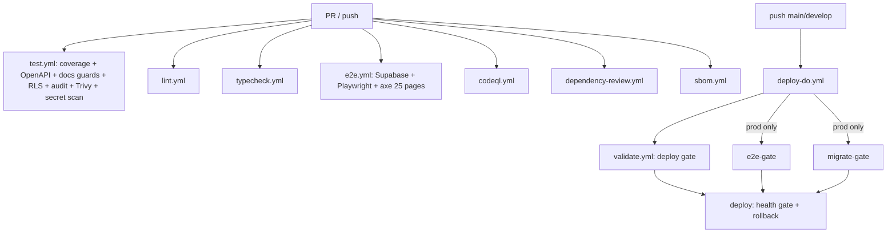

# Testing, Quality, and Release Confidence Audit

## Audit Metadata

- Audit name: repo-deep-dive
- Run: 20261002-0344-develop-6286137
- Repository: C:\temp\mainecybertech
- Branch: develop
- Commit SHA: 62861370 (6286137017c4b7c77e83ee420ec11382d984f263, 2026-10-01 23:25:45 -0400, `docs: record the widened a11y default gate`)
- Generated at: 2026-10-02
- Auditor: Principal repository auditor (subagent; fresh audit at the current commit, prior report used only for change tracking)
- Area code: TEST
- Output path: docs/audits/repo-deep-dive/20261002-0344-develop-6286137/09_testing_quality_release_confidence.md
- Scope limitations:
  - **No test suite was executed.** This environment has no `node`, `pnpm`, or `git` on PATH by default, no `node_modules` (`apps/api/node_modules` and root `node_modules` both absent), and no reachable package registry guaranteed. Every count below is derived from repository source (test-file enumeration, `describe`/`it`/`test` enumeration, `jest.config.mjs`, workflow YAML), not from a live run. Execution-dependent claims are marked `not reproducible` in Verification Performed.
  - **E2E was not executed** — it additionally requires the local Supabase stack (`supabase start` + `supabase db reset`) and production builds of API/web; outside this audit window.
  - **No access to CI history** — GitHub Actions run logs/results for this SHA were not available; statements about "green" come from repository docs and must be treated as `unverified` where they are self-attested.
  - No application code, config, or test file was modified. Only this report file was written.

## Scope

Reviewed at commit 62861370:

- Test estates across `apps/api` (114 suite files), `apps/web` (271 suite files), `apps/worker` (9), `packages/sdk` (3), plus `packages/ui`/`packages/config` (0).
- Jest configuration + coverage thresholds for all four packages (`apps/*/jest.config.mjs`, `packages/sdk/jest.config.mjs`), the web custom environment (`jest-custom-environment.js`), and setup/teardown files.
- Playwright configuration (`apps/web/playwright.config.ts`), E2E spec inventory (90 specs), shared fixtures (`e2e/fixtures.ts`), global auth setup (`e2e/global.setup.ts`), and the accessibility spec (`e2e/a11y.spec.ts`).
- All 16 CI workflows in `.github/workflows/`, with deep reading of `test.yml`, `validate.yml`, `e2e.yml`, `a11y-breadth.yml`, `codeql.yml`, `chromatic.yml`, `sbom.yml`, `db-restore-test.yml`, `supabase-migrations.yml`, `dependency-review.yml`, and the gate structure of `deploy-do.yml`.
- Pre-commit hook (`.husky/pre-commit`), `lint-staged` config, root `package.json` scripts, and the `turbo.json` task graph.
- Testing/verification scripts: `scripts/check-docs-counts.mjs`, `scripts/check-docs-links.mjs`, `scripts/openapi-audit.js`, `scripts/verify-rls.mjs`, `scripts/verify-prompts.js`, `scripts/generate-db-types.js`, `scripts/sync-review-md.mjs`, and the k6 load suite under `scripts/load-testing/`.
- Docs that make test/coverage claims: `AGENTS.md`, `README.md`, `docs/testing.md`, `docs/CI.md`, `docs/WEB_UI_CONVENTIONS.md`.

Not reviewed: runtime behavior of any suite; actual coverage percentages; CI job outcomes; the content of the 90 E2E specs beyond their names and the a11y spec; `packages/ui` Storybook stories beyond inventory; production systems.

## Evidence Reviewed

| Evidence | Type | Why relevant | Notes |
|---|---|---|---|
| `apps/api/jest.config.mjs` | Config | API coverage gate | branches 30 / functions 50 / lines 55 / statements 58 |
| `apps/web/jest.config.mjs` | Config | Web coverage gate | branches 38 / functions 38 / lines 45 / statements 46 |
| `apps/worker/jest.config.mjs` | Config | Worker coverage gate | branches 5 / functions 15 / lines 12 / statements 12 |
| `packages/sdk/jest.config.mjs` | Config | SDK coverage gate | branches 33 / functions 38 / lines 40 / statements 40 |
| `apps/api/src/__tests__/` (114 files) | Test source | API unit/integration inventory | `openapi-contracts.test.ts`, `security.test.ts`, `security-suite.test.ts`, `ssrf-guard.test.ts`, `idempotency.test.ts`, `webhook-signature.test.ts`, `middleware-rate-limit.test.ts` |
| `apps/web/__tests__/` + co-located (271 files) | Test source | Web/component inventory | Jest + Testing Library; `middleware.test.ts` among them |
| `apps/worker/src/__tests__/` (9 files) | Test source | Worker inventory | `task-handlers`, `orphan-cleanup`, `webhook-retry`, `ssrf-guard`, `scan-lock`, `schedule-config`, `sla-business-os`, `health`, `main` |
| `packages/sdk/src/__tests__/` (3 files) | Test source | SDK inventory | `client-fetch`, `sdk-expanded`, `sdk` |
| `apps/web/e2e/` (90 `*.spec.ts`) | Test source | E2E inventory | admin/portal/marketing/auth + `a11y.spec.ts` |
| `apps/web/e2e/a11y.spec.ts` | Test source | Accessibility gate | `BASE_PAGES` = 25 paths; `FULL_PAGES` = 43; tags include `wcag22aa` |
| `.github/workflows/test.yml` | CI | PR/push gate | coverage + OpenAPI + docs counts/links + DB types + RLS + `pnpm audit` + Trivy + secret diff scan |
| `.github/workflows/validate.yml` | CI | Deploy gate | coverage + guards + secrets scan + lint + typecheck + prompt-provenance |
| `.github/workflows/e2e.yml` | CI | E2E + a11y pipeline | Supabase local + `db reset` + builds + Playwright; prod-only via `workflow_call` |
| `.github/workflows/a11y-breadth.yml` | CI | a11y triage | weekly `e2e.yml` call with `a11y_full: true`; not a required check |
| `.github/workflows/codeql.yml` | CI | SAST | `javascript-typescript`, `security-and-quality` |
| `.github/workflows/chromatic.yml` | CI | Visual regression | `continue-on-error: true`; Storybook webpack build known-broken |
| `.github/workflows/db-restore-test.yml` | CI | Backup restore drill | weekly restore into `postgres:16-alpine` |
| `scripts/openapi-audit.js` | Script | Contract coverage | Fails when a static route is missing from the spec |
| `apps/api/src/__tests__/openapi-contracts.test.ts` | Test source | Contract tests | Validates live responses against spec success schemas |
| `scripts/check-docs-counts.mjs` | Script | Doc self-consistency | Guards tests/suites/pages/routes/migrations/workflows vs repo |
| `scripts/load-testing/*.js` (5 scripts) | Script | Load/failure | k6 smoke, tickets, auth, SSE, health spike |
| `.husky/pre-commit` | Hook | Pre-commit gate | `scripts/scan-secrets.sh` + `lint-staged` |
| `docs/testing.md`, `docs/CI.md`, `AGENTS.md`, `README.md` | Docs | Claimed state | Counts and a11y page count claims |

## Verification Performed

| Claim / artifact | Type | Method | Outcome |
|---|---|---|---|
| HEAD is `62861370` on `develop` | Metadata | `git rev-parse` / `git log -1` | supported |
| AGENTS.md total "3,490 tests, all passing. 397 suites." | Aggregate | Summed per-package rows (1,258+1,832+296+104 = 3,490; 114+271+3+9 = 397) | supported (internal consistency) |
| Suite counts (API 114, Web 271, SDK 3, Worker 9) | Aggregate | Enumerated `*.test.ts(x)`/`*.spec.ts(x)` matching each `jest.config.mjs` `testMatch`, excluding node_modules/E2E | supported (exact match) |
| Test counts (API 1,258 / Web 1,832 / SDK 296 / Worker 104) | Aggregate | Enumerated `it(`/`test(` occurrences | partially supported — SDK 296 exact; API 1,148, Web 1,654, Worker 81 (Jest counts parameterized `it.each` rows, so doc totals exceed raw call sites; direction consistent) |
| E2E "90 spec files" (AGENTS/README/docs) | Aggregate | Counted `apps/web/e2e/**/*.spec.ts` (excluding `fixtures.ts`, `global.setup.ts`) | supported (90) |
| a11y default gate "scans 19 core routes" (`docs/testing.md:66`, `docs/WEB_UI_CONVENTIONS.md:87`, `docs/CI.md:13,56`) | Doc claim | Read `a11y.spec.ts` `BASE_PAGES` | **unsupported** — `BASE_PAGES` has 25 paths; AGENTS.md:58 says 25 ("the default PR gate now scans **25 pages**") |
| a11y breadth "68 routes" | Doc claim | 25 (`BASE_PAGES`) + 43 (`FULL_PAGES`) | supported (68) |
| `pnpm test:coverage` is the CI gate | Config | `test.yml:59`, `validate.yml:71`; root `package.json:16` | supported |
| "No secret-scan step in CI" (prior audit TEST-P2-005) | Finding status | `test.yml` `secrets-scan` job (lines 140-166); `validate.yml:100-125` | **regressed→fixed**: now open at both PR and deploy gate |
| "No executable load tests" (prior audit TEST-P2-002) | Finding status | 5 runnable k6 scripts present under `scripts/load-testing/` | **fixed** |
| "No contract tests vs OpenAPI" (prior audit TEST-P2-003) | Finding status | `openapi-contracts.test.ts` + `openapi-audit.js` in CI | **fixed** |
| Chromatic non-blocking | Config | `chromatic.yml:24` `continue-on-error: true` | supported (still non-blocking) |
| E2E prod-only gate | Config | `deploy-do.yml:262` `if: needs.setup.outputs.name == 'prod'` | supported |
| Docs-counts guard wired into CI | Config | `test.yml:69-72`, `validate.yml:83-86` | supported |
| Test suites pass | Execution | Cannot run (no node/pnpm/node_modules) | not reproducible |
| E2E suite passes at this SHA | Execution | Requires Supabase stack + builds | not reproducible |
| Coverage thresholds actually met | Execution | Requires `test:coverage` run | not reproducible |

## Executive Summary

The test estate at `62861370` is **broad and well-gated**, and three of the prior audit's six findings have been remediated (CI secret scanning, executable k6 load tests, OpenAPI contract tests). The four unit packages expose **397 suite files** matching AGENTS.md exactly, coverage thresholds are configured and CI-enforced via `pnpm test:coverage` in both the PR gate (`test.yml`) and the deploy gate (`validate.yml`), the E2E pipeline is fully wired against a local Supabase stack, and a 25-page axe gate now runs on every E2E pass with WCAG 2.2 tags. `scripts/check-docs-counts.mjs` enforces test/suite/page/route/migration/workflow counts against the repo, which is unusually mature for a project of this size.

Strengths:

- **Self-consistency tooling.** `check-docs-counts.mjs`, `openapi-audit.js`, `verify-rls.mjs`, `generate-db-types.js --check`, `verify-prompts.js`, and `sync-review-md.mjs` are all wired into CI, so a large class of drift is caught automatically.
- **Contract tests exist and derive from the spec.** `openapi-contracts.test.ts` resolves schemas from `buildSpec()` and validates live supertest responses against them — not a stale copy.
- **Security test depth.** API has `security.test.ts`, `security-suite.test.ts`, `ssrf-guard.test.ts`, `idempotency.test.ts`, `webhook-signature.test.ts`, `middleware-rate-limit.test.ts` and more; a hard `Trivy` + `pnpm audit` + diff secret scan run in `test.yml`.
- **Expanded a11y gate.** 25 default pages, `wcag22aa` gated, 68 in the weekly breadth triage.

Major risks:

1. **Documentation contradicts code on the accessibility gate width** (TEST-P2-001): a commit whose message is literally *"docs: record the widened a11y default gate"* updated AGENTS.md to 25 pages but left `docs/testing.md`, `docs/WEB_UI_CONVENTIONS.md`, and `docs/CI.md` at 19. `check-docs-counts.mjs` does not parse the a11y page count, so CI cannot catch it.
2. **The worker's ~17 data-mutating scan tasks still lack direct tests** (TEST-P2-002): `apps/worker/src/tasks/module-tasks.ts` has no dedicated suite; only `sla-business-os.test.ts` imports from it. The worker branch-coverage threshold is 5%, effectively a no-op.
3. **Visual regression is still non-blocking and its build is known-broken** (TEST-P3-001): `chromatic.yml` sets `continue-on-error: true` because the Storybook webpack build fails (`SB_BUILDER-WEBPACK5_0002`).
4. **E2E flakiness is acknowledged but unresolved** (TEST-P2-003): AGENTS.md documents run-to-run flakiness in data-dependent specs; the E2E gate is prod-only, which currently masks it because no `main` deploy has succeeded since the gate was added.
5. **No scheduled production smoke test** (TEST-P3-002): health is checked only at deploy time; there is no cron hitting prod `/health`, login, or a critical read path.

Recommended next actions: fix the a11y doc drift and add an a11y-count guard to `check-docs-counts.mjs`; add a table-driven `module-tasks` test suite and raise the worker branch threshold; either fix the Storybook build or replace Chromatic with Playwright screenshot diffs; add a scheduled prod smoke workflow; and record a fresh, verifiable E2E count at this SHA.

## Inventory

| Item | Path / symbol | Purpose | Current state | Risk | Notes |
|---|---|---|---|---|---|
| API tests | `apps/api/src/__tests__/*` (114 suites) | Route/middleware/service integration via supertest | Implemented | Low | Docs claim 1,258 tests |
| Web tests | `apps/web/__tests__/*` + co-located (271 suites) | Page/component/action tests | Implemented | Low | Docs claim 1,832 tests |
| Worker tests | `apps/worker/src/__tests__/*` (9 suites) | Env schema + task handlers | Implemented, thin | Medium | No `module-tasks` suite |
| SDK tests | `packages/sdk/src/__tests__/*` (3 suites) | Mocked-fetch client tests | Implemented | Low | Docs claim 296 tests |
| E2E | `apps/web/e2e/**/*.spec.ts` (90) | Full-stack Playwright chromium | Implemented | Medium | Prod-only gate; documented flaky |
| Component/visual | `packages/ui` stories (7) + `chromatic.yml` | Storybook + Chromatic | Partial/broken | Medium | `continue-on-error: true` |
| Accessibility | `apps/web/e2e/a11y.spec.ts` (25 default / 68 full) | axe WCAG A/AA + 2.2 | Implemented, expanded | Low-Medium | Docs say 19 |
| Contract tests | `openapi-contracts.test.ts`, `scripts/openapi-audit.js` | Spec-vs-impl parity | Implemented | Low | New since prior audit |
| Migration/RLS | `e2e.yml` `db reset`, `verify-rls.mjs`, `db-restore-test.yml` | Migrations apply + RLS hygiene + restore drill | Implemented (indirect) | Low-Medium | No SQL unit assertions |
| Security tests | `security*.test.ts`, `ssrf-guard`, `idempotency`, `webhook-signature`, CI `secrets-scan`/Trivy/audit/CodeQL/dependency-review | App + supply-chain security | Implemented | Low | No DAST/fuzz |
| Load/failure | `scripts/load-testing/{api.basic.smoke,tickets.load,auth.load,sse.load,health.spike}.js` | k6 load + spike | Implemented (manual) | Medium | Not run in CI |
| Smoke tests | API/worker `/health`, deploy-do health gate, `global.setup.ts` login | Deploy-time smoke | Implemented (deploy only) | Medium | No scheduled prod smoke |
| Pre-commit | `.husky/pre-commit` | Secret scan + lint-staged | Implemented | Low | Duplicated in CI |
| CI gates | `test.yml`, `validate.yml`, `e2e.yml`, `codeql.yml`, `sbom.yml`, `dependency-review.yml` | Release safety | Implemented | Low | 16 workflows total |
| Docs guards | `check-docs-counts.mjs`, `check-docs-links.mjs` | Doc drift detection | Implemented | Low | Doesn't cover a11y count |

## Domain Scorecard

| Category | Score | Evidence | Gap | Recommended action |
|---|---:|---|---|---|
| Unit tests | 5 | 397 suites across 4 packages; thresholds set; `pnpm test:coverage` in `test.yml`+`validate.yml` | Not executed this audit (env) | Keep; add `--detectOpenHandles` hygiene if warnings persist |
| Integration tests | 4 | 114 API supertest suites incl. router/middleware/service; `openapi-contracts.test.ts` drives real handlers | Supabase still mocked; no Postgres-backed tier | Add a thin PostgREST-backed tier for critical CRUD |
| API tests | 5 | 114 suites; security/idempotency/rate-limit/ssrf/webhook-signature coverage | — | Keep |
| E2E | 4 | 90 specs; full-stack `e2e.yml`; retries 2; timeouts bounded | Documented flakiness; no fresh count at this SHA | Re-run CI E2E at 62861370; record count; triage flaky specs |
| Component tests | 4 | 271 web suites; Testing Library; `middleware.test.ts` | Co-located vs `__tests__` split; some client components uncovered | Use coverage report to target gaps |
| Visual regression | 1 | `chromatic.yml` present but `continue-on-error: true`; Storybook build broken | Not enforced | Fix Storybook (Next 15 + webpack5) or use Playwright screenshot diffs |
| Accessibility | 4 | `a11y.spec.ts` 25 default pages, `wcag22aa` gated; 68-page weekly triage | Docs say 19; only critical/serious fail; long tail uncovered | Reconcile docs; add guard; expand gate incrementally |
| Contract tests | 4 | `openapi-contracts.test.ts` + `openapi-audit.js` in CI | Contract tests cover 14 routes; audit is static-only for factory routes | Extend to more routes; validate request schemas too |
| Migration tests | 3 | `e2e.yml` `supabase db reset`; `verify-rls.mjs`; `db-restore-test.yml` | No SQL-level assertion suite; restore drill uses S3 secrets | Add migration unit tests + a fixture-based schema assertion |
| Security tests | 4 | App security suites + CI secrets-scan/Trivy/audit/CodeQL/dependency-review | No DAST/fuzz; no security-focused E2E | Add a small authenticated-negative E2E set |
| Load/failure tests | 2 | 5 k6 scripts exist | Not run in CI; no thresholds enforced; no failure-injection (Redis/Supabase down) | Add a scheduled k6 job + failure-injection tests |
| Smoke tests | 3 | `/health` (api/worker), deploy health gate, `global.setup.ts` | No scheduled prod smoke (health+login+read) | Add a cron smoke workflow |

## Detailed Review

### Item: Unit test estate (4 packages)

- Evidence: `apps/api/jest.config.mjs`, `apps/web/jest.config.mjs`, `apps/worker/jest.config.mjs`, `packages/sdk/jest.config.mjs`; suite enumeration 114/271/9/3.
- What it does: Jest + ts-jest; API uses node env + supertest, Web uses a custom jsdom environment with `@mct/ui` mapped to source, worker exports `envSchema`/`parseEnv`/`runWorkerTasks` for testability, SDK drives a mocked fetch.
- How it appears to work: `testMatch` finds `__tests__/**` and `*.test|spec.ts(x)`; API ignores `helpers.ts` and `/openapi/`; Web ignores `.next`/`e2e`.
- Dependencies: `turbo run test:coverage`; per-package `test`/`test:watch` scripts.
- Current controls: global coverage thresholds in all four configs; CI fails below them.
- Missing controls: no `--detectOpenHandles`; worker branch threshold 5%.
- Risks: Low overall; worker task logic risk is medium (see TEST-P2-002).
- Recommended improvement: table-driven worker tests; keep thresholds.
- Suggested tests: worker `module-tasks` handler matrix.
- Suggested docs: none beyond count reconciliation.

### Item: API integration + contract tests

- Evidence: `apps/api/src/__tests__/openapi-contracts.test.ts` (669 lines), `security.test.ts`, `security-suite.test.ts`, `idempotency.test.ts`, `ssrf-guard.test.ts`, `webhook-signature.test.ts`, `middleware-rate-limit.test.ts`; `scripts/openapi-audit.js`.
- What it does: supertest requests against `createTestApp()`; contract tests pull success schemas from `buildSpec()` and validate responses with a dependency-free JSON-schema walker; `openapi-audit.js` reconstructs the Express route tree and fails on routes missing from the spec.
- How it appears to work: `openapi-audit.js` parses `app.ts` mounts + `router.<verb>("literal")` calls and compares to `spec.ts` `method/path` entries; dynamic factory routes are warnings.
- Dependencies: OpenAPI spec `apps/api/src/openapi/spec.ts`; `helpers.ts` mock builder.
- Current controls: CI runs `validate-openapi.ts` + `openapi-audit.js` in both `test.yml` and `validate.yml`.
- Missing controls: contract coverage is a curated 14-route list; factory CRUD routes only checked statically.
- Risks: Low.
- Recommended improvement: extend the contract matrix; add request-side schema validation.
- Suggested tests: contract tests for the `registerCrud` factory families.
- Suggested docs: none.

### Item: E2E + accessibility

- Evidence: `apps/web/playwright.config.ts`, `.github/workflows/e2e.yml`, `apps/web/e2e/a11y.spec.ts`, `apps/web/e2e/fixtures.ts`, `apps/web/e2e/global.setup.ts`, 90 specs.
- What it does: Playwright chromium against production builds + local Supabase + seeds; `setup` project signs in once and stores `.playwright-auth.json`; a11y scans 25 default routes (68 with `A11Y_FULL=1`).
- How it appears to work: `retries: 2` and `workers: 1` in CI, 45s test / 15s action / 30s navigation timeouts, traces/videos on first retry, bounded `networkidle` before axe, `baseURL` from `E2E_BASE_URL`.
- Dependencies: Supabase CLI 2.107.0 pinned; API/web production builds; E2E secrets.
- Current controls: `forbidOnly` in CI; artifact upload on failure; prod-only `workflow_call` gate; pull_request path filters.
- Missing controls: no fresh count at this SHA; documented flakiness; a11y docs say 19 pages but code has 25.
- Risks: Medium (release-confidence accuracy).
- Recommended improvement: reconcile a11y docs + guard; triage flaky specs with `retries` stats; run E2E at this SHA.
- Suggested tests: keep a11y breadth green; promote pages deliberately.
- Suggested docs: see TEST-P2-001.

### Item: CI execution and gates

- Evidence: `.github/workflows/*.yml` (16), `docs/CI.md`, `deploy-do.yml` gate wiring.
- What it does: `test.yml` (PR/push) runs coverage + OpenAPI + docs guards + DB types + RLS + `pnpm audit --prod` + Trivy + a diff secret scan. `validate.yml` (`workflow_call`, the deploy gate) mirrors coverage + guards + secrets scan + lint + typecheck + prompt provenance + review.md sync. `deploy-do.yml` calls `validate` always, and `e2e-gate`/`migrate-gate` prod-only.
- How it appears to work: `deploy` uses `always() && !failure() && !cancelled()`, so skipped gates (dev) do not block, but a failed `validate` does.
- Dependencies: pinned action SHAs; corepack pnpm 10.
- Current controls: least-privilege `permissions:` blocks; hard `pnpm audit`; Trivy `exit-code: 1`.
- Missing controls: E2E not run on dev deploys (by design); Chromatic non-blocking.
- Risks: Low-Medium.
- Recommended improvement: document dev-vs-prod gate asymmetry explicitly in `docs/testing.md`.
- Suggested tests: planted-secret negative test (described below).
- Suggested docs: `docs/CI.md` a11y count.

### Item: Load, smoke, and failure testing

- Evidence: `scripts/load-testing/{README.md,api.basic.smoke.js,tickets.load.js,auth.load.js,sse.load.js,health.spike.js}`; `deploy-do.yml` Health check step; API/worker `/health`.
- What it does: k6 scripts for smoke, CRUD load, auth load, SSE load, and a health spike; deploy-time HTTP + container health checks with rollback.
- How it appears to work: README documents `k6 run ...` per script; thresholds are described as patterns (smoke <1% err/p95<2s, load <5%/p95<3s, spike <0.1%/p99<100ms).
- Dependencies: k6 installed locally; `AUTH_TOKEN`/credentials for authenticated scripts.
- Current controls: none automated — scripts are manual.
- Missing controls: no CI job, no enforced thresholds, no failure injection.
- Risks: Medium — capacity/scale behavior unproven.
- Recommended improvement: add a scheduled/manual k6 workflow against a staging URL + a Redis-down/Supabase-down failure test.
- Suggested tests: failure-injection tests described in Suggested Tests.
- Suggested docs: `scripts/load-testing/README.md` add real baseline results.

## Scenario / Control Matrix

| ID | Scenario or control | Evidence | Current control | Gap | Severity | Recommendation |
|---|---|---|---|---|---|---|
| TEST-001 | Unit tests | 397 suites; 4 jest configs; `test:coverage` in CI | CI coverage gate | Not executed this audit | — | Keep; run locally |
| TEST-002 | Integration tests | 114 API suites w/ supertest | Router/service integration | Supabase mocked | P3 | Add DB-backed tier |
| TEST-003 | API tests | `openapi-contracts`, `security*`, `ssrf`, `idempotency`, rate-limit | Strong | Factory routes contract-thin | P3 | Extend contract matrix |
| TEST-004 | E2E | 90 specs; `e2e.yml` | Full-stack CI, prod-only | Fresh count missing; flaky | P2 | Re-run at SHA; triage flakes |
| TEST-005 | Component tests | 271 web suites | Testing Library | Some client components uncovered | P3 | Coverage-guided additions |
| TEST-006 | Visual regression | `chromatic.yml` `continue-on-error` | Non-blocking | Build broken | P3 | Fix Storybook or Playwright diffs |
| TEST-007 | Accessibility | `a11y.spec.ts` 25/68 | axe gate | Docs say 19; long tail uncovered | P2 | Reconcile docs + guard; expand |
| TEST-008 | Contract tests | `openapi-contracts.test.ts`, `openapi-audit.js` | Spec-vs-impl + live schemas | 14-route matrix | P3 | Broaden |
| TEST-009 | Migration tests | `db reset`, `verify-rls.mjs`, `db-restore-test.yml` | Hygiene + restore | No SQL assertion suite | P3 | Add migration tests |
| TEST-010 | Security tests | App suites + secrets/Trivy/audit/CodeQL/dependency-review | Layered | No DAST/fuzz | P2 | Add negative E2E |
| TEST-011 | Load/failure tests | 5 k6 scripts | Manual only | No CI, no failure injection | P2 | Scheduled k6 + chaos |
| TEST-012 | Smoke tests | `/health`, deploy gate, `global.setup.ts` | Deploy-time | No scheduled prod smoke | P3 | Cron smoke workflow |

## Findings

### Finding ID: TEST-P2-001 - Accessibility gate width contradicts the code (docs say 19 pages, code scans 25)

- Severity: P2
- Confidence: High
- Area: Testing / Accessibility / Documentation consistency
- Evidence:
  - `apps/web/e2e/a11y.spec.ts` — `BASE_PAGES` array contains **25** `{ path, name }` entries; `const full = process.env.A11Y_FULL === "1"`; `pages = full ? [...BASE_PAGES, ...FULL_PAGES] : BASE_PAGES`; tags line: `["wcag2a","wcag2aa","wcag21a","wcag21aa","wcag22aa"]`.
  - `AGENTS.md:58` — "the default PR gate now scans **25 pages** ... The remaining 43-page `FULL_PAGES` set (68 total)".
  - `docs/testing.md:66` — "scans 19 core routes".
  - `docs/WEB_UI_CONVENTIONS.md:87` — "scans 19 core routes".
  - `docs/CI.md:13` — "(19-route gate, 68 with `A11Y_FULL`)"; `docs/CI.md:56` — "promote routes into the default 19-route gate".
  - `scripts/check-docs-counts.mjs` — no parser for the a11y page count (it checks web components, tests/suites, pages, workflows, scripts, migrations, OpenAPI paths, E2E spec files, RLS policies only).
  - HEAD commit subject `62861370 docs: record the widened a11y default gate` — the same commit updated AGENTS.md but not the three other docs.
- What is happening: The default accessibility gate was widened from 19 to 25 pages (the E2E input `a11y_full` and the `a11y-breadth.yml` triage set are unchanged at 68). One doc (AGENTS.md) was updated; three others still describe the old width, and no CI guard covers this number.
- Why it matters: Reviewers and future agents reading `docs/testing.md`/`docs/CI.md` will believe the accessibility gate is narrower (19) than it is (25), and may over-promise the `A11Y_FULL` split or mis-scope a11y work. It also demonstrates that "counts are measured, not hand-maintained" (docs/testing.md:3) is only true for the counts `check-docs-counts.mjs` knows about — a11y is outside that net.
- User / business impact: Mis-scoped accessibility remediation and unreliable WCAG-AA coverage claims to clients; the compliance narrative ("what do you test?") is inconsistent across canonical docs.
- Security / privacy / reliability impact: Low directly; correctness/trust impact is real for an accessibility-sensitive client portal.
- Recommended fix: Update `docs/testing.md:66`, `docs/WEB_UI_CONVENTIONS.md:87`, and `docs/CI.md:13,56` to 25 pages (68 with `A11Y_FULL`). Add an a11y-count check to `scripts/check-docs-counts.mjs` that counts `path:` entries in `BASE_PAGES`/`FULL_PAGES` in `a11y.spec.ts` and asserts the documented numbers.
- Suggested validation: `node scripts/check-docs-counts.mjs` exits 0 with the new check; deliberately changing a doc number makes it exit 1.
- Owner suggestion: Frontend engineer + docs owner.
- Effort estimate: S
- Dependencies: None.
- Status: open
- Endpoint / data path: N/A (test documentation)
- Attack path: none identified

### Finding ID: TEST-P2-002 - Worker data-mutating scan tasks still lack a dedicated test suite; branch threshold is a no-op

- Severity: P2
- Confidence: High
- Area: Testing / Coverage
- Evidence:
  - `apps/worker/jest.config.mjs` — `coverageThreshold.global.branches = 5`, functions 15, lines 12, statements 12.
  - `apps/worker/src/tasks/module-tasks.ts` — the module-task handlers (scan/patch/endpoint/m365/backup-dr/dmarc/status/phishing/saas families) live here.
  - `apps/worker/src/__tests__/` — 9 suites: `sla-business-os`, `task-handlers`, `health`, `main`, `orphan-cleanup`, `scan-lock`, `schedule-config`, `ssrf-guard`, `webhook-retry`. **No `module-tasks.test.ts`.**
  - `apps/worker/src/__tests__/tasks/sla-business-os.test.ts:79` — the only import from `../../tasks/module-tasks`.
  - Prior audit `09_testing_quality_release_confidence.md` (75d3926) flagged the same gap as TEST-P3-003; it remains open.
- What is happening: The worker holds long-running, data-mutating scan tasks that write to production tables when scheduled, but their handler logic is only exercised indirectly. A 5% branch threshold passes with almost no branch coverage.
- Why it matters: A silent logic regression in a scan task (e.g., a wrong status transition or an empty-result overwrite) would not be caught before deploy; the worker runs unattended.
- User / business impact: Corrupted or stale security-posture data presented to clients; harder incident triage because there is no assertion-level test to bisect.
- Security / privacy / reliability impact: Reliability/correctness of scheduled jobs that mutate tenant-scoped data.
- Recommended fix: Add a table-driven `apps/worker/src/__tests__/module-tasks.test.ts` covering each handler's success, empty, error, and mixed/concurrent-lock paths with mock rows; raise `branches` to ~25% once covered.
- Suggested validation: Worker suite green at the raised threshold; deliberately breaking a handler branch fails the new tests.
- Owner suggestion: Implementation agent (worker).
- Effort estimate: M
- Dependencies: None.
- Status: still-open (carried from 75d3926 TEST-P3-003)
- Endpoint / data path: BullMQ worker → `module-tasks.ts` handlers → Supabase tables (per task)
- Attack path: none identified

### Finding ID: TEST-P2-003 - E2E flakiness is documented but unresolved, and the prod-only gate masks it

- Severity: P2
- Confidence: Medium
- Area: Testing / Release confidence
- Evidence:
  - `AGENTS.md:52` — "E2E has known run-to-run flakiness: data-dependent tests (notification bell, project/user/document detail, admin-documents modal) fail intermittently due to CI API/Supabase contention ... The E2E gate is prod-only (`deploy-do.yml` `if: name == 'prod'`) ... As of 2026-09-21 there are no successful `main`-branch `deploy-do` runs since E2E was made a prod-only gate."
  - `apps/web/playwright.config.ts:7` — `retries: process.env.CI ? 2 : 0`.
  - `apps/web/e2e/fixtures.ts` — `visibleWithin()` helper added to tolerate slow/absent seed data (per AGENTS.md).
  - `deploy-do.yml:262` — `e2e-gate` runs only when `needs.setup.outputs.name == 'prod'`.
- What is happening: Known-flaky data-dependent specs still exist. Because the E2E gate only runs for prod deploys and no prod deploy has succeeded since the gate was introduced, the flakiness has not been observed gating a real release — the repo states this explicitly.
- Why it matters: The first successful `main` deploy could fail on flakiness unrelated to the change, and "E2E is green" claims rest on PR runs against the dev configuration. The team cannot yet distinguish product regressions from seed-contention flakes without manual triage.
- User / business impact: A blocked prod release at an inopportune time; engineer time spent re-running rather than fixing.
- Security / privacy / reliability impact: Release-process reliability, not product security.
- Recommended fix: Instrument flake rate (Playwright JSON reporter + a small script), convert remaining data gates to `visibleWithin()`, and de-flake or quarantine the named specs with an owner/expiry. Add one successful dry-run of the prod E2E gate before relying on it.
- Suggested validation: N consecutive CI E2E runs at this SHA with zero retry-recovered failures on the named specs.
- Owner suggestion: Platform/Frontend engineer.
- Effort estimate: M
- Dependencies: CI access to run E2E repeatedly.
- Status: still-open (carried from 75d3926 TEST-P2-001, partially addressed)
- Endpoint / data path: E2E → web `:3000` → API `:4000` → local Supabase
- Attack path: none identified

### Finding ID: TEST-P2-004 - Load tests exist but are manual-only with no enforced thresholds or failure injection

- Severity: P2
- Confidence: High
- Area: Testing / Resilience validation
- Evidence:
  - `scripts/load-testing/` — `api.basic.smoke.js`, `tickets.load.js`, `auth.load.js`, `sse.load.js`, `health.spike.js` (now real scripts, moving prior audit TEST-P2-002 from "absent" to "manual").
  - `scripts/load-testing/README.md:48-71` — the CI integration is shown only as an **example** workflow (`load-test.yml`) that does not exist in `.github/workflows/`.
  - `.github/workflows/` — no load-test workflow; scheduled workflows are a11y-breadth, codeql, db-restore-test, db-backup, sbom only.
  - `README.md:75-79` — thresholds described as "common patterns", not enforced by CI.
- What is happening: The load tooling is real but inert. Nothing runs it, and there are no recorded baseline results; rate-limit thresholds and the single-droplet capacity remain empirically unproven. There is also no failure-injection (Redis-down, Supabase-down, queue-down) test.
- Why it matters: "Release confidence" for performance/capacity is unverifiable; a traffic spike or a dependency outage has no validated degradation path.
- User / business impact: Unknown capacity ceiling; potential outage under load with no baseline to design against.
- Security / privacy / reliability impact: Reliability under load and dependency failure.
- Recommended fix: Add a manual/scheduled k6 workflow (against a staging URL) that runs the existing scripts and uploads results; add failure-injection tests for Redis-down (cache falls back), queue-down (enqueue returns false), and Supabase-down (circuit breaker tripped, `/health` unhealthy).
- Suggested validation: k6 job produces a baseline artifact; failure-injection tests assert the documented degradation.
- Owner suggestion: Platform engineer.
- Effort estimate: M
- Dependencies: Staging environment + credentials.
- Status: partially-fixed (scripts added; execution/thresholds absent)
- Endpoint / data path: k6 → API `:4000` (`/health`, `/auth/*`, `/tickets`, SSE) → Supabase/Redis
- Attack path: none identified

### Finding ID: TEST-P3-001 - Visual regression is still non-blocking with a known-broken Storybook build

- Severity: P3
- Confidence: High
- Area: Testing / Visual regression
- Evidence:
  - `.github/workflows/chromatic.yml:19-24` — comment "the Storybook webpack build currently fails with `SB_BUILDER-WEBPACK5_0002`" and `continue-on-error: true` at job level.
  - `chromatic.yml:58` — `exitZeroOnChanges: true` (changes never fail the job even if it ran).
  - `package.json:33-41` — Storybook 8.6.18 + Chromatic 17.5.0; 7 story files under `packages/ui`.
  - `docs/CI.md` — Chromatic classified "Best-effort".
- What is happening: UI screenshot diffing is configured but cannot gate anything: the build fails and the job is allowed to fail.
- Why it matters: CSS/layout regressions ship without visual review.
- User / business impact: Cosmetic/regression defects reach clients.
- Security / privacy / reliability impact: Low.
- Recommended fix: Either fix the Next 15 + webpack5 Storybook mismatch, or drop Chromatic in favor of `toHaveScreenshot()` baselines for the top pages in Playwright (already running in CI).
- Suggested validation: A deliberate CSS change produces a failing screenshot diff in CI.
- Owner suggestion: Frontend engineer.
- Effort estimate: M
- Dependencies: Storybook/Next alignment or Playwright snapshot baselines.
- Status: still-open (carried from 75d3926 TEST-P3-002)
- Endpoint / data path: CI → `pnpm storybook:build` → Chromatic
- Attack path: none identified

### Finding ID: TEST-P3-002 - No scheduled production smoke check (health + login + critical read)

- Severity: P3
- Confidence: High
- Area: Testing / Smoke
- Evidence:
  - `deploy-do.yml:488-535` — "Health check" runs `/health` (API), worker health over SSH, and `/login` (web) **only during deploy**.
  - `.github/workflows/` — scheduled workflows are `a11y-breadth.yml`, `codeql.yml`, `db-restore-test.yml`, `db-backup.yml`, `sbom.yml`; none hits production.
  - Prior audit TEST-012 flagged the same gap at 75d3926; still open.
- What is happening: There is no recurring check that the deployed production stack is up and can authenticate.
- Why it matters: An outage between deploys (cert expiry, container crash, Supabase problem) is detected only by users or monitoring (if any) — not by the CI/release system.
- User / business impact: Longer time-to-detect for outages.
- Security / privacy / reliability impact: Observability/availability gap.
- Recommended fix: Add a cron workflow (e.g., every 15 min) that curls prod `/health` for api + worker, verifies a `/login` 200/30x, and performs a read-only authenticated request; alert on failure.
- Suggested validation: A simulated outage in a staging environment turns the smoke job red.
- Owner suggestion: Platform engineer.
- Effort estimate: S–M
- Dependencies: Prod/staging URLs + a read-only test credential (secret).
- Status: still-open (carried from 75d3926 TEST-012)
- Endpoint / data path: cron → `https://api.*/health`, `https://app.*/login`
- Attack path: none identified

### Finding ID: TEST-P3-003 - Coverage thresholds remain modest and cannot be confirmed met at this SHA

- Severity: P3
- Confidence: Medium
- Area: Testing / Coverage
- Evidence:
  - `apps/api/jest.config.mjs:14-21` — 30/50/55/58 (branches/functions/lines/statements).
  - `apps/web/jest.config.mjs:41-48` — 38/38/45/46.
  - `packages/sdk/jest.config.mjs:14-21` — 33/38/40/40.
  - `apps/worker/jest.config.mjs:14-21` — 5/15/12/12.
  - `docs/testing.md:32-39` — threshold table matches the configs (self-consistent).
  - Cannot execute `pnpm test:coverage` (no node/pnpm/node_modules) — actual coverage is `Unknown`.
- What is happening: Thresholds are realistic and CI-enforced, but web/api gates permit large uncovered regions and the worker branch floor is effectively no gate. Actual coverage percentages at this SHA were not reproducible in this environment.
- Why it matters: A passing gate does not mean critical paths are covered; the threshold is a floor, not a target.
- User / business impact: Conservative — low risk of false confidence for API/web, but the worker gap is real (see TEST-P2-002).
- Security / privacy / reliability impact: Low.
- Recommended fix: Publish per-package coverage from CI (artifact/dashboard) so the real number is observable; raise the worker gate after TEST-P2-002.
- Suggested validation: Coverage artifact attached to the `test` job.
- Owner suggestion: Implementation agent.
- Effort estimate: S
- Dependencies: CI run.
- Status: open
- Endpoint / data path: N/A
- Attack path: none identified

## Risks

| Risk | Severity | Likelihood | Impact | Evidence | Mitigation |
|---|---|---|---|---|---|
| Contradictory a11y docs mislead scoping | P2 | High (already true) | Mis-reported coverage | `a11y.spec.ts` 25 vs docs 19 | Reconcile + add guard (TEST-P2-001) |
| Worker scan-task regression ships | P2 | Medium | Tenant data corruption | no `module-tasks` suite; branch gate 5% | Table-driven tests + raise threshold (TEST-P2-002) |
| First prod deploy fails on E2E flake | P2 | Medium | Blocked release | AGENTS.md:52; prod-only gate | Flake instrumentation + de-flake (TEST-P2-003) |
| Capacity/outage untested | P2 | Medium | Outage under spike | k6 scripts manual-only | Scheduled k6 + chaos (TEST-P2-004) |
| UI regressions ship | P3 | Medium | Cosmetic defects | Chromatic non-blocking | Fix Storybook or Playwright snapshots (TEST-P3-001) |
| Outage undetected between deploys | P3 | Medium | Longer MTTR | no scheduled prod smoke | Cron smoke (TEST-P3-002) |
| Coverage floor hides gaps | P3 | Low | Silent regressions | worker 5% branches | Publish coverage; raise gate (TEST-P3-003) |

## Recommendations

### Immediate / Release Blocking

None verified as blocking at this SHA from repository evidence. However, the following should be confirmed before the next release because they cannot be proven green from here:

1. Re-run `pnpm test:coverage` at 62861370 and confirm all four thresholds hold (not reproducible in this environment).
2. Re-run the CI E2E job at 62861370 and record the actual pass/suite count (TEST-P2-003).

### This Week

3. Reconcile the a11y page count in `docs/testing.md`, `docs/WEB_UI_CONVENTIONS.md`, and `docs/CI.md` to 25 (68 full), and add an a11y-count guard to `scripts/check-docs-counts.mjs` (TEST-P2-001).
4. Add a `module-tasks` table-driven test suite and raise the worker branch threshold after it lands (TEST-P2-002).
5. Add a scheduled production smoke workflow (health + login + authenticated read) (TEST-P3-002).

### This Month

6. Add a k6 workflow (manual/scheduled) that runs the existing scripts and records a baseline; add Redis/queue/Supabase failure-injection tests (TEST-P2-004).
7. Instrument E2E flake rate and de-flake the named data-dependent specs (TEST-P2-003).
8. Publish coverage artifacts from `test.yml` and raise the worker gate (TEST-P3-003).

### Later / Platform Evolution

9. Fix the Storybook/Next build or replace Chromatic with Playwright screenshot baselines (TEST-P3-001).
10. Add a thin Postgres-backed integration tier for critical CRUD paths (scorecard: integration).
11. Extend contract tests from the curated 14 routes to the CRUD factory families.
12. Add a small authenticated negative-path E2E set (authz/tenant isolation) beyond unit middleware tests.

## Quick Wins

| Quick win | Why it helps | Files likely involved | Validation |
|---|---|---|---|
| Update a11y count 19 → 25 in three docs | Removes direct contradiction | `docs/testing.md`, `docs/WEB_UI_CONVENTIONS.md`, `docs/CI.md` | `check-docs-counts.mjs` (with new check) |
| Add a11y count parser to docs guard | Prevents recurrence | `scripts/check-docs-counts.mjs`, `apps/web/e2e/a11y.spec.ts` | Exit 1 on tampered doc |
| Add k6 scripts to a dispatchable workflow | Turns dormant tooling on | new `.github/workflows/load-test.yml` | Manual run produces artifact |
| Document dev-vs-prod gate asymmetry | Prevents false "E2E green" claims | `docs/testing.md`, `docs/CI.md` | Review |
| Add Playwright JSON reporter + flake summary | Quantifies E2E flakiness | `apps/web/playwright.config.ts` | Retry stats in CI |

## Hardening Backlog

| Backlog item | Priority | Owner suggestion | Effort | Dependency |
|---|---|---|---|---|
| a11y doc reconciliation + guard | P2 | Frontend + docs | S | — |
| `module-tasks` test suite | P2 | Implementation agent | M | — |
| Scheduled prod smoke | P3 | Platform engineer | S–M | Prod URLs + read-only credential |
| k6 CI job + baseline | P2 | Platform engineer | M | Staging URL |
| Failure-injection tests (Redis/queue/Supabase) | P2 | Implementation agent | M | — |
| E2E flake triage | P2 | Platform/Frontend | M | CI E2E access |
| Coverage artifact publication | P3 | Implementation agent | S | CI run |
| Visual regression enforcement | P3 | Frontend engineer | M | Storybook fix or Playwright snapshots |
| Postgres-backed integration tier | P3 | Platform engineer | L | Test DB setup |
| Contract matrix expansion | P3 | Implementation agent | S–M | — |
| DAST/negative-path E2E | P2 | Security + Frontend | M | E2E harness |

## Suggested Tests

- **Worker (unit, table-driven):** one row per `module-tasks` handler with mock Supabase responses for success, empty result, error, and mixed/concurrent (scan-lock held) inputs.
- **Contract:** extend `openapi-contracts.test.ts` to the `registerCrud` factory families; add request-side schema validation (currently only success responses are validated).
- **Failure injection (integration):** Redis-down → cache falls back to memory; queue-down → `enqueueTask` returns false; Supabase-down → circuit breaker trips and `/health` reports unhealthy.
- **Migration (integration):** apply `supabase db reset` in CI and assert a fixture schema (table/column/policy presence) so a migration typo fails a unit-style test rather than only E2E.
- **E2E (negative security):** an unauthenticated/other-org user hitting a by-id endpoint gets 403/404 (complements unit middleware tests).
- **CI security:** plant a dummy secret in a branch and assert both `test.yml` `secrets-scan` and `validate.yml` fail; then remove it.
- **Accessibility:** a docs-guard test that fails when `BASE_PAGES` count changes without the docs being updated.
- **Load:** schedule `tickets.load.js` + `health.spike.js` against staging; assert error-rate/latency thresholds from the README.
- **Manual validation:** the manual QA checklist below, executed once per release.

## Suggested Documentation Updates

- `docs/testing.md` — change "19 core routes" to 25 (68 with `A11Y_FULL`); add a short "what `pnpm test:coverage` does NOT cover" section (no executed E2E, no load, no visual regression).
- `docs/WEB_UI_CONVENTIONS.md` — change "19 core routes" to 25 (line 87).
- `docs/CI.md` — change "19-route gate" to 25 (lines 13 and 56).
- `scripts/load-testing/README.md` — replace the example CI snippet with the real workflow name and record baseline results.
- `AGENTS.md` — keep the a11y note but add the doc-drift caveat; ensure future count changes touch all canonical docs.
- `docs/INDEX.md` — add a "release confidence / test estate" reference if a runbook is created.

## Open Questions

| Question | Why it matters | Evidence needed |
|---|---|---|
| Do all four packages pass `test:coverage` at 62861370? | Release gate | CI job log or local run at this SHA |
| What is the actual E2E pass count and flake rate at this SHA? | Release claim | CI E2E run at 62861370 |
| Which `module-tasks` handlers are exercised indirectly today? | Coverage gap sizing | Coverage report for `apps/worker/src/tasks/module-tasks.ts` |
| Why do `docs/testing.md`/`docs/CI.md`/`WEB_UI_CONVENTIONS.md` still say 19? | Doc process | Commit history for the three docs |
| Will the Storybook webpack error be fixed or is Playwright the intended replacement? | Visual regression plan | Owner decision / issue tracker |
| Is there any production monitoring that already covers the smoke gap (TEST-P3-002)? | Avoid duplicate work | `infra/` monitoring config, external monitors |
| Where do the k6 scripts get a staging target? | Load-test CI design | Staging URL/secret ownership |

## Appendix

### A. Suite-file counts vs declared counts (enumerated at 62861370)

```
Package | Suite files (enumerated) | AGENTS.md declared | Match
API     | 114                      | 114                | yes
Web     | 271                      | 271                | yes
SDK     | 3                        | 3                  | yes
Worker  | 9                        | 9                  | yes
Total   | 397                      | 397                | yes
```

Test-call enumeration (`it(`/`test(` occurrences), which undercounts `it.each` rows:

```
API    1148  (declared 1258)
Web    1654  (declared 1832)
SDK     296  (declared 296)
Worker   81  (declared 104)
```

### B. Accessibility page inventory (from `apps/web/e2e/a11y.spec.ts`)

- Default gate (`BASE_PAGES`): 25 paths — login, signup, store, case-studies, resources, privacy, terms, status, portal dashboard/support/projects/documents/profile/assets/findings/notifications/client-knowledge-base, admin dashboard/tickets/projects/users/findings/assets/licenses/service-catalog.
- Triage set (`FULL_PAGES`, requires `A11Y_FULL=1`): 43 paths (marketing home/contact/blog, store compare/quote, portal approvals/budgets/status/runbooks/risk-register/sop-library/training-hub/qbr/compliance-readiness/incident-response/service-catalog/vendor-contracts/profile/security, admin organizations/roles/audit/governance/approval-requests/dmarc/domain-monitors/break-glass/incidents/onboarding/offboarding/patch-compliance/training-hub/uptime-monitor/vendor-contracts/webhooks/webhooks/dead-letters and 8 admin/store pages).
- Total with `A11Y_FULL=1`: 68. Tags: `wcag2a`, `wcag2aa`, `wcag21a`, `wcag21aa`, `wcag22aa`. Only `critical`/`serious` impacts fail.

### C. CI workflow inventory (16 files at this SHA)

`a11y-breadth.yml`, `build-push.yml`, `chromatic.yml`, `codeql.yml`, `db-backup.yml`, `db-restore-test.yml`, `dependency-review.yml`, `deploy-do.yml`, `e2e.yml`, `lint.yml`, `sbom.yml`, `supabase-migrations.yml`, `terraform-do.yml`, `test.yml`, `typecheck.yml`, `validate.yml`.

### D. Mermaid — release-gate flow



### E. Manual QA checklist (pre-release)

- [ ] `pnpm test:coverage` passes all 4 package thresholds at the release SHA
- [ ] CI `test.yml`, `lint.yml`, `typecheck.yml`, `codeql.yml`, `sbom.yml` green at the release SHA
- [ ] CI E2E green at the release SHA (actual count recorded)
- [ ] a11y gate green (25 default pages); breadth scan (`A11Y_FULL=1`) not regressed
- [ ] `openapi-audit.js` and `check-docs-counts.mjs` pass (no drift)
- [ ] `supabase db push` applies without error (prod dry-run)
- [ ] Deploy health gate: api `/health` 200, worker health 200, web `/login` reachable
- [ ] Login → portal dashboard → create ticket → notification badge on the deployed environment
- [ ] k6 smoke (`api.basic.smoke.js`) against the target environment within thresholds
- [ ] Restore drill: latest backup restores into the throwaway DB (weekly job evidence)

### F. Prior-audit finding status at 62861370

| Prior finding (75d3926) | Status now | Evidence |
|---|---|---|
| TEST-P2-002 No executable load/failure tests | partially-fixed | 5 k6 scripts exist; still manual-only (now TEST-P2-004) |
| TEST-P2-003 No contract tests vs OpenAPI | fixed | `openapi-contracts.test.ts` + `openapi-audit.js` in CI |
| TEST-P2-004 a11y covers only 4 pages | fixed/expanded | default gate now 25 pages, `wcag22aa` |
| TEST-P2-005 No secret-scan in CI | fixed | `secrets-scan` job in `test.yml` + `validate.yml` |
| TEST-P3-002 Visual regression non-blocking | still-open | `chromatic.yml` `continue-on-error: true` (now TEST-P3-001) |
| TEST-P3-003 Worker module tasks low coverage | still-open | no `module-tasks` suite; branch gate 5% (now TEST-P2-002) |
| TEST-P2-001 E2E count drift / unverifiable | partially-addressed | docs now say 90 specs (matches); flakiness documented (now TEST-P2-003) |
