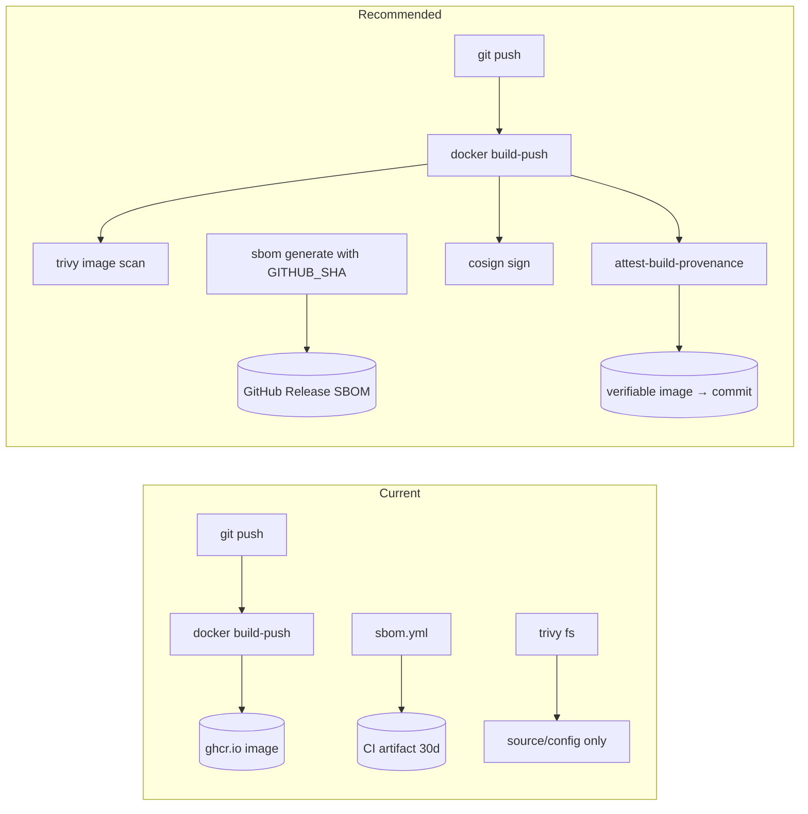

# Supply Chain, Dependency, and Secrets Audit

## Audit Metadata

- Audit name: repo-deep-dive
- Run: 20261002-0344-develop-6286137
- Repository: mainecybertech / mct-portal (pnpm monorepo)
- Branch: develop
- Commit SHA: 6286137017c4b7c77e83ee420ec11382d984f263 (short: 6286137)
- Generated at: 2026-10-02T03:44 (audit session)
- Auditor: Principal Repository Auditor (AI subagent)
- Area code: SC
- Output path: docs/audits/repo-deep-dive/20261002-0344-develop-6286137/11_supply_chain_dependency_secrets.md
- Scope limitations:
  - `pnpm-lock.yaml` (11,915 lines / 1,481 resolved package entries) was not read line-by-line; integrity was sampled and cross-checked with `pnpm` tooling and the SBOM script.
  - No network access to the npm registry advisory database beyond what `pnpm audit` performs; advisory IDs are reproduced from `pnpm audit` output at the audited commit.
  - CI status, GitHub Environment protection rules, branch protection, and Dependabot PR *results* could not be read (no GitHub API access in the audit role). Dependabot PR branches are evidenced from local `git branch -a` only.
  - No container image was built or pulled, so image-level scanning claims are about workflow configuration, not exercised runs.
  - Secret values were never printed; only names, paths, and placeholder/real classification are reported.

## Scope

Reviewed at commit `6286137` (branch `develop`):

- Package manifests: root `package.json`, `apps/api/package.json`, `apps/web/package.json`, `apps/worker/package.json`, `packages/config/package.json`, `packages/sdk/package.json`, `packages/ui/package.json`, and `pnpm-workspace.yaml`.
- Lockfile: single root `pnpm-lock.yaml` (lockfileVersion `'9.0'`), its `overrides:` block, and `importers:`.
- pnpm governance: `.npmrc`, root `pnpm.overrides`, `pnpm.onlyBuiltDependencies`, `packageManager` pin.
- Dependency risk: `pnpm audit` (prod and full), `pnpm why` for overridden packages, `pnpm licenses list --prod`.
- Dependabot: `.github/dependabot.yml`, and Dependabot PR branches visible in `git branch -a`.
- GitHub Actions supply chain: every `uses:` in `.github/workflows/*.yml` (pin style), each workflow's `permissions:` block.
- SBOM/provenance: `.github/workflows/sbom.yml`, `scripts/generate-sbom.mjs`, `scripts/verify-prompts.js` + `prompts/manifest.json`.
- Containers: `apps/api/Dockerfile`, `apps/web/Dockerfile`, `apps/worker/Dockerfile`, `docker-compose.yml`, `infra/digitalocean/docker-compose.yml`, `.dockerignore`.
- Secrets: `scripts/scan-secrets.sh`, `scripts/scan-secrets.ps1`, `.husky/pre-commit`, secret-scan jobs in `test.yml`/`validate.yml`, `.env.example` files, `.gitignore`, tracked key/cert/credential files, `docs/SECRETS_ROTATION.md`, `docs/JWT_ROTATION.md`, `docs/GITHUB_SECRETS_AND_VARIABLES_MATRIX.md`, secret flow in `deploy-do.yml`.
- License risk: `pnpm licenses list --prod` aggregated, root `license` field.

Not reviewed: full transitive license texts, the 787-file `prompts/` pack content beyond its integrity gate, Terraform module internals, runtime registry/SSO configuration state.

## Evidence Reviewed

| Evidence | Type | Why relevant | Notes |
|---|---|---|---|
| `package.json` (root) | Manifest | Workspace, scripts, overrides, onlyBuiltDependencies | `private: true`, `license: ISC`, `packageManager: pnpm@10.34.3` |
| `pnpm-lock.yaml` | Lockfile | Determinism / integrity | lockfileVersion `'9.0'`, 1,481 components, single lockfile |
| `pnpm-workspace.yaml` | Workspace | Package globs | `apps/*`, `packages/*` |
| `.npmrc` | Registry config | Pinning / confusion defense | `registry=https://registry.npmjs.org/`, `auto-install-peers=true` |
| `apps/*/package.json`, `packages/*/package.json` | Manifests | Direct dependency surface | 6 workspace packages |
| `pnpm audit --prod` output | Tool run | Production vulnerability state | `No known vulnerabilities found` |
| `pnpm audit` (full) output | Tool run | Dev+prod vulnerability state | 1 low, 2 moderate, 3 high, 1 critical |
| `pnpm licenses list --prod` | Tool run | License inventory | 12 licenses; includes FSL-1.1-MIT and LGPL-3.0-or-later |
| `pnpm why <pkg>` | Tool run | Override efficacy | js-yaml@5.2.2, sharp@0.35.4 resolve override targets |
| `.github/dependabot.yml` | Config | Automated updates | npm + github-actions + docker + terraform, weekly, grouped |
| `git branch -a` | VCS | Dependabot PR backlog | 14 open `dependabot/*` remote branches |
| `.github/workflows/*.yml` | CI config | Action pinning, permissions, gates | 17 workflows; all `uses:` SHA-pinned |
| `.github/workflows/sbom.yml` + `scripts/generate-sbom.mjs` | CI + script | SBOM generation | CycloneDX 1.5, 1,481 components (reproduced) |
| `.github/workflows/dependency-review.yml` | CI config | PR dependency gate | `fail-on-severity: high` |
| `scripts/scan-secrets.sh` / `.ps1` | Scripts | Local secret scanning | Wired into `.husky/pre-commit`; CI mirror in `test.yml`/`validate.yml` |
| `apps/*/.env.example` (3) | Env examples | Placeholder hygiene | All use `<your-…>` placeholders / empty values |
| `infra/terraform/digitalocean/env/prod.tfvars` | Tracked config | Potential secret exposure | Tracked but values are placeholders (verified) |
| `.gitignore` | Config | Secret exclusion | `.env*` ignored, `!.env.example` negated; not `*.tfvars` |
| `.dockerignore` | Config | Build-context hygiene | Excludes `.env*`, `node_modules`, docs, infra, prompts |
| `apps/*/Dockerfile` (3) | Container | Base image pinning + non-root | All `node:20-alpine@sha256:fb4cd12c…`, non-root `USER` |
| `docs/SECRETS_ROTATION.md` | Doc | Rotation policy | 30+ secrets with frequencies/procedures |
| `scripts/verify-prompts.js` + `prompts/manifest.json` | Provenance | Prompt-pack integrity | SHA-256 manifest; verify passes |

## Verification Performed

| Evidence | Type | Why relevant | Notes |
|---|---|---|---|
| `git rev-parse HEAD` | Command | Confirm audited commit | `6286137017c4b7c77e83ee420ec11382d984f263`, branch `develop` |
| `git branch -a` | Command | Dependabot PR backlog | 14 `remotes/origin/dependabot/*` branches present |
| `pnpm audit --audit-level=high --prod` | Command | Reproduce prod gate claim | `No known vulnerabilities found` (exit 0) → **supported** |
| `pnpm audit` (full, no `--prod`) | Command | Reproduce dev-tool exposure | `1 low | 2 moderate | 3 high | 1 critical` → dev-only critical/high confirmed |
| `pnpm why next` | Command | Locate critical `next` advisory | `next@16.3.5` under `@storybook/nextjs@8.6.18` (dev); app `apps/web` resolves `next@15.5.25` |
| `pnpm why js-yaml` / `pnpm why sharp` | Command | Verify override efficacy | Single versions: `js-yaml@5.2.2`, `sharp@0.35.4` — both satisfy overrides → **supported** |
| `node scripts/generate-sbom.mjs <tmp>` | Command | Reproduce SBOM claim | `Wrote 1481 components`, `specVersion 1.5`, hashes present → **supported** |
| `pnpm licenses list --prod --json` | Command | License inventory | Aggregated license set captured (see Appendix) |
| `node scripts/verify-prompts.js verify` | Command | Reproduce prompt provenance gate | `Prompt provenance OK — all files match manifest.` → **supported** |
| `git grep -nE '<secret patterns>'` (excl. node_modules, *.md) | Command | Secret-like string sweep | No matches (exit 1) → **supported: no live secret-like strings in tracked non-doc sources** |
| `git ls-files` key/cert/credential filter | Command | Tracked secret material | Only `infra/terraform/digitalocean/env/prod.tfvars`; values verified placeholder |
| `prod.tfvars` placeholder classification | Command | Confirm no real secret committed | `do_token`, `cloudflare_api_token`, etc. match placeholder pattern (len < example) |
| `Select-String` on workflows for `uses:@vN/main` | Command | Action pinning audit | No unpinned refs found → **supported** |
| `Select-String` for `attest|cosign|slsa|sigstore` | Command | Provenance/signing presence | No hits in workflows → **unsupported: no artifact provenance/signing** |

### Headline claim verdicts (prior run → current commit)

| Prior finding | Prior claim | Current verdict | Evidence at `6286137` |
|---|---|---|---|
| `SC-P1-001` | No SBOM generation | **verified-fixed** | `sbom.yml` + `generate-sbom.mjs` produce 1,481-component CycloneDX 1.5 SBOM (reproduced) |
| `SC-P1-002` | No container vulnerability scanning | **partially-fixed** | Trivy `scan-type: fs` with `exit-code: 1` in `test.yml`; no image/registry scan |
| `SC-P2-001` | No `.npmrc` | **verified-fixed** | `.npmrc` pins `registry.npmjs.org` |
| `SC-P2-002` | Docker base images not SHA-pinned | **verified-fixed** | All 3 Dockerfiles `node:20-alpine@sha256:fb4cd12c…` |
| `SC-P2-003` | `pnpm audit` runs with `continue-on-error` | **verified-fixed** | `validate.yml`/`test.yml` run `pnpm audit --audit-level=high --prod` as a hard gate (no `continue-on-error`) |
| `SC-P3-001` | Root license is ISC | **still-open** | `package.json:4` `"license": "ISC"` |

### Self-consistency checks

- Lockfile `overrides:` block (lines 8–27) matches root `package.json` `pnpm.overrides` (20 entries) exactly → consistent.
- Lockfile `importers:` include the root and each workspace package; single-lockfile model → consistent with `pnpm-workspace.yaml`.
- SBOM `metadata.tools[0].name = scripts/generate-sbom.mjs` — tool is self-recorded; SBOM carries no git SHA, so binding to a commit is inferred from the workflow context only (see SC-P2-004).

## Executive Summary

The supply chain posture has materially improved since the prior audit (`62da92c`). Six of six prior findings are resolved or partly resolved, and the repository now exercises several controls it previously only lacked:

- A committed `.npmrc` pins the public registry.
- `pnpm audit --audit-level=high --prod` is a **hard gate** (no `continue-on-error`) in both the reusable `validate.yml` and `test.yml`, and `validate.yml` is called by the prod `deploy-do.yml` and `terraform-do.yml` paths — so a high/critical **production** dependency blocks deploy.
- All three Dockerfiles pin `node:20-alpine` to a SHA digest **and** run as a non-root user.
- Every GitHub Action `uses:` reference across all 17 workflows is pinned to a full commit SHA (no `@vN`/`@main`).
- A working CycloneDX 1.5 SBOM generator exists (`scripts/generate-sbom.mjs`, reproduced: 1,481 components) and runs in `sbom.yml`.
- `.github/workflows/dependency-review.yml` gates PRs with `fail-on-severity: high`.
- Trivy filesystem scanning runs with `exit-code: "1"` for CRITICAL/HIGH.
- Secret scanning is defense-in-depth: a pre-commit hook (`scripts/scan-secrets.sh` via `.husky/pre-commit`, plus a PowerShell variant) mirrored by a `secrets-scan` CI job in `test.yml` and `validate.yml`, which is part of the deploy gate.
- The prompt pack (787 files) is integrity-protected by a SHA-256 manifest verified in CI (`prompt-provenance` job), and verification passes at this commit.
- `pnpm audit --prod` is clean; all `.env.example` files use obvious placeholders; no private keys, cloud tokens, or credential files are tracked.

The remaining exposure is concentrated in three areas:

1. **Dev-tree critical vulnerability.** The full `pnpm audit` reports 1 critical (Next.js `next/og` RCE, `GHSA-vcvr-r3jv-pc5j`, fixed in `>=16.3.6`) plus 3 high and 2 moderate, all reachable only through the dev/test toolchain (`@storybook/nextjs` pulls `next@16.3.5`). The existing `next` override is scoped `">=15.5.24 <16"` and therefore **cannot** apply to the `16.3.5` dev resolution. The prod app (`apps/web`) is on the patched `15.5.25` line. This is a developer-machine and CI-runner hygiene issue, not a production runtime issue, but it is a genuine open critical in the resolved tree.
2. **No artifact provenance/signing or image-level scanning.** `deploy-do.yml` requests `id-token: write` but never uses it (no `actions/attest`, cosign, or SLSA generator); images are built and pushed to GHCR with `push: true` and no attestation; Trivy scans the filesystem, not the built image. The SBOM is uploaded as a short-lived CI artifact (30 days) and is not attached to a release or image.
3. **License policy is inventoried but not enforced.** `pnpm licenses list --prod` reveals `FSL-1.1-MIT` (`@sentry/cli`, a Functional Source License, non-OSI) and `Apache-2.0 AND LGPL-3.0-or-later` (`@img/sharp-win32-x64`); `.github/workflows/dependency-review.yml` gates severity but there is no license allow-list gate in CI.

Additionally, the Dependabot PR backlog is large (14 open branches) and contains at least one stale/conflicting update (`next-16.2.9` — the resolved app version is already `15.5.25` and the dev tree is on `16.3.5`), which suggests updates are not being merged promptly.

Recommended next actions: bump/patch the dev `next` resolution to `>=16.3.6` (or constrain storybook's next path), add image-level scanning + an `actions/attest-build-provenance` step to the image build, wire the SBOM to releases, and add a license allow-list gate.

## Inventory

| Item | Path / symbol | Purpose | Current state | Risk | Notes |
|---|---|---|---|---|---|
| Root manifest | `package.json` | Workspace + overrides + scripts | Implemented | Low | `private: true`; `license: ISC`; `packageManager: pnpm@10.34.3` |
| Workspace | `pnpm-workspace.yaml` | Package globs | Implemented | Low | `apps/*`, `packages/*` |
| Lockfile | `pnpm-lock.yaml` | Determinism | Implemented | Low | Single lockfile, v9.0, 1,481 pkgs |
| Registry config | `.npmrc` | Pin registry | Implemented | Low | `registry.npmjs.org` |
| Overrides | `package.json:58-79`, `pnpm-lock.yaml:8-27` | Vuln mitigation | Implemented | Medium | 20 overrides; one (`next`) mis-scoped |
| onlyBuiltDependencies | `package.json:55-57` | Postinstall allow-list | Implemented | Low | `["@sentry/cli"]` only |
| Dependabot | `.github/dependabot.yml` | Auto-updates | Implemented | Medium | npm/GHA/docker/terraform; large PR backlog |
| Dependency review | `.github/workflows/dependency-review.yml` | PR severity gate | Implemented | Low | `fail-on-severity: high` |
| SBOM generator | `scripts/generate-sbom.mjs` | CycloneDX output | Implemented | Low | 1,481 components; no commit binding |
| SBOM workflow | `.github/workflows/sbom.yml` | CI SBOM artifact | Implemented | Medium | Artifact only (30d), not release-attached |
| Prompt provenance | `scripts/verify-prompts.js`, `prompts/manifest.json` | Pack integrity | Implemented | Low | Verifies at this commit |
| Trivy (fs) | `.github/workflows/test.yml:security-scan` | Source/config scan | Implemented | Medium | `exit-code: 1`; not image scan |
| Trivy (image) | — | Container image scan | Missing | P2 | Not present |
| Provenance/signing | — | SLSA/cosign/attest | Missing | P2 | `id-token: write` unused |
| Secret scanner (sh) | `scripts/scan-secrets.sh` | Pre-commit scan | Implemented | Low | Wired via `.husky/pre-commit` |
| Secret scanner (ps1) | `scripts/scan-secrets.ps1` | Windows pre-commit | Implemented | Low | Different/coarser pattern set than `.sh` |
| CI secret scan | `test.yml`, `validate.yml` `secrets-scan` | Diff scan in CI | Implemented | Low | Mirrors `.sh` patterns |
| API Dockerfile | `apps/api/Dockerfile` | API image | Implemented | Low | SHA-pinned base, non-root `appuser` |
| Web Dockerfile | `apps/web/Dockerfile` | Web image | Implemented | Low | SHA-pinned base, non-root `nextjs` |
| Worker Dockerfile | `apps/worker/Dockerfile` | Worker image | Implemented | Low | SHA-pinned base, non-root `appuser` |
| e2e compose image | `docker-compose.yml` (e2e) | Playwright runner | Tag-only | P3 | `mcr.microsoft.com/playwright:v1.61.0` |
| Env examples | `apps/*/.env.example`, `infra/digitalocean/.env.example` | Placeholders | Implemented | Low | Clean |
| Tracked tfvars | `infra/terraform/digitalocean/env/prod.tfvars` | Terraform vars | Tracked (placeholders) | Medium | Not gitignored; values are placeholders now |
| Rotation docs | `docs/SECRETS_ROTATION.md`, `docs/JWT_ROTATION.md` | Rotation policy | Implemented | Low | 30+ secrets documented |
| Root license | `package.json:4`, `LICENSE` | Legal | `ISC` | P3 | Non-standard for commercial SaaS |

## Domain Scorecard

| Category | Score | Evidence | Gap | Recommended action |
|---|---:|---|---|---|
| Package manifests | 4 | 7 manifests, `private: true`, `packageManager` pin, engines | License `ISC` | Move to `MIT`/`Apache-2.0`; add license gate |
| Lockfiles | 5 | Single `pnpm-lock.yaml` v9.0; `--frozen-lockfile` in every install step | None | None |
| Workspace dependencies | 5 | `pnpm-workspace.yaml`; lockfile `importers` for all workspaces | None | None |
| Unused/duplicate/deprecated deps | 3 | No `depcheck`/`pnpm dedupe --check` in CI | No duplicate/unused gate | Add `pnpm dedupe --check` + `depcheck` advisory job |
| Native/build deps | 4 | `onlyBuiltDependencies: ["@sentry/cli"]` | No audit of newly-required build scripts | Re-review allow-list when deps change |
| Transitive risk indicators | 3 | `pnpm audit` clean on `--prod`; 1 critical + 3 high in dev tree | Dev `next@16.3.5` RCE; `next` override mis-scoped | Patch dev `next` to `>=16.3.6` |
| Dependabot/Renovate | 3 | `.github/dependabot.yml` present, grouped, 4 ecosystems | 14 open PR branches; stale `next` PR; no auto-merge | Triage backlog; enable patch auto-merge |
| Package scripts/postinstall | 4 | `onlyBuiltDependencies` restricts; `prepare: husky` explicit | Root scripts call `powershell`/`npx` in dev helpers | Document dev-script trust; keep allow-list tight |
| Docker base images | 4 | All 3 app Dockerfiles SHA-pinned, non-root | e2e compose image tag-only; no image scan | Digest-pin e2e image; scan built images |
| GitHub Actions deps | 5 | All `uses:` pinned to full SHAs across 17 workflows | No Dependabot auto-merge for GHA | None critical |
| Environment examples | 5 | 4 `.env.example` files, placeholders only | None | None |
| Secret-like strings | 4 | No live patterns in tracked source; pre-commit + CI scan | Scanner variants diverge; no full-history gate in CI | Unify scanner sets; add periodic history scan |

## Detailed Review

### Item: Lockfile integrity

- Evidence: `pnpm-lock.yaml` (lockfileVersion `'9.0'`), root-only; `pnpm install --frozen-lockfile` in `validate.yml`, `test.yml`, `build-push.yml`, `apps/*/Dockerfile`.
- What it does: Provides a single deterministic dependency tree for the whole workspace.
- How it appears to work: `checkout` → `corepack prepare pnpm@10` (with retry) → `pnpm install --frozen-lockfile`. Docker builds use `--filter` for api/worker and full install for web.
- Dependencies: pnpm 10 via corepack; `packageManager` pin `pnpm@10.34.3`.
- Current controls: Single lockfile; frozen installs everywhere; registry pinned.
- Missing controls: No check that the lockfile is up to date when only a manifest changes (frozen install would catch this in CI though); no signature/integrity attestation of the lockfile itself.
- Risks: Low.
- Recommended improvement: None urgent.
- Suggested tests: CI job asserting `pnpm install --frozen-lockfile` fails if a manifest diverges (already implicit).
- Suggested docs: Note in `CONTRIBUTING.md` that the root lockfile is the only lockfile.

### Item: pnpm.overrides

- Evidence: `package.json:58-79` (20 overrides), `pnpm-lock.yaml:8-27` (identical set), `pnpm why js-yaml` → `5.2.2`, `pnpm why sharp` → `0.35.4`.
- What it does: Forces patched transitive versions.
- How it appears to work: Most overrides apply globally; two are scoped (`minimatch@>=10.0.0>brace-expansion`, `body-parser@<1.20.6`, `postcss@<=8.5.17`); one is range-scoped `next: ">=15.5.24 <16"`.
- Current controls: Overrides present and lockfile-synced.
- Missing controls: The `next` override cannot match the `next@16.3.5` resolution pulled in by `@storybook/nextjs`; no automation validates that every override actually narrows to a patched version.
- Risks: A critical advisory (`next/og` RCE) persists in the dev tree because the override's `<16` cap excludes the vulnerable `16.3.5` line.
- Recommended improvement: Change the dev resolution (bump `@storybook/nextjs` or add a scoped override such as `next@>=16.0.0: ">=16.3.6"`), and add a CI assertion that parses `pnpm audit --json` and fails on any critical regardless of prod/dev (see SC-P1-001).
- Suggested tests: `pnpm audit --json` parser gate; `pnpm why next` snapshot.
- Suggested docs: Record override rationale + target advisory in a table (`.github` or `docs/DEPENDENCY_POLICY.md`).

### Item: onlyBuiltDependencies / postinstall

- Evidence: `package.json:55-57` `onlyBuiltDependencies: ["@sentry/cli"]`; root script `"prepare": "husky"`.
- What it does: Restricts package build scripts to a single allow-listed package, blocking arbitrary postinstall execution.
- Current controls: Allow-list; pnpm 10 default `side-effects-cache` behavior.
- Missing controls: No periodic review process when Dependabot adds packages needing builds.
- Risks: Low; strong control.
- Recommended improvement: Document the review step for adding entries.
- Suggested tests: CI check that `onlyBuiltDependencies` is non-empty and reviewed via CODEOWNERS.
- Suggested docs: Add to `CONTRIBUTING.md`.

### Item: Dependabot / update governance

- Evidence: `.github/dependabot.yml` (npm grouped: sentry, typescript-eslint, testing, aws-sdk; github-actions; docker; terraform; weekly Monday; `open-pull-requests-limit: 10`; `versioning-strategy: increase`); `git branch -a` shows 14 open `dependabot/*` branches.
- What it does: Automates dependency PRs.
- How it appears to work: Groups related packages, labels PRs, weekly schedule.
- Current controls: Grouped updates, four ecosystems covered.
- Missing controls: No auto-merge for patch/minor; large backlog indicates slow triage; the `next-16.2.9` branch is stale relative to resolved versions.
- Risks: Medium — control-plane drift; security patches linger.
- Recommended improvement: Add patch auto-merge after CI; add a monthly backlog SLA; close stale branches.
- Suggested tests: none (process).
- Suggested docs: `docs/DEPENDENCY_POLICY.md`.

### Item: Docker base images

- Evidence: `apps/api/Dockerfile:1`, `apps/web/Dockerfile:1`, `apps/worker/Dockerfile:1` → `FROM node:20-alpine@sha256:fb4cd12c85ee03686f6af5362a0b0d56d50c58a04632e6c0fb8363f609372293`; non-root `USER appuser`/`USER nextjs`; `.dockerignore` excludes `.env*`.
- What it does: Reproducible, non-root runtime images.
- Current controls: SHA digest pins; non-root users; build context excludes env/infra/docs.
- Missing controls: No image digest recorded in a lock/attestation; `e2e` compose image not digest-pinned.
- Risks: Low for app images; P3 for e2e image.
- Recommended improvement: Digest-pin `mcr.microsoft.com/playwright:v1.61.0`; add image scanning.
- Suggested tests: Build image and run Trivy `image` scan.
- Suggested docs: Document base-image bump procedure.

### Item: SBOM / provenance / signing

- Evidence: `.github/workflows/sbom.yml` (push/PR/schedule; uploads `sbom.cdx.json`, 30-day retention); `scripts/generate-sbom.mjs` (CycloneDX 1.5, dependency-free parser); reproduced `Wrote 1481 components`.
- What it does: Produces a CycloneDX SBOM from the lockfile.
- Current controls: SBOM generated in CI; hashes (SHA-512) embedded per component; `bom-ref`/`purl` present.
- Missing controls: SBOM not attached to releases or images; SBOM carries no git SHA/commit binding; no artifact signing or build provenance (`deploy-do.yml` has `id-token: write` but no attest step); no `metadata.supplier`/authors.
- Risks: Medium — cannot cryptographically tie a shipped image to its SBOM or a commit.
- Recommended improvement: Emit `metadata.component.version` from `GITHUB_SHA`; add `actions/attest-build-provenance` and cosign to image build; attach SBOM to GitHub Releases.
- Suggested tests: Assert SBOM `metadata` contains the commit SHA; verify attestation exists for a pushed image.
- Suggested docs: `docs/SBOM.md` describing consumption.

### Item: Secret handling

- Evidence: `scripts/scan-secrets.sh` (11-pattern set incl. `AKIA`, `ghp_`, `gho_`, `github_pat_`, `sk_live_`, `xox*`, PRIVATE KEY, JWT), `.husky/pre-commit` runs it; `test.yml`/`validate.yml` `secrets-scan` job with the same patterns; `scripts/scan-secrets.ps1` with a **different, coarser** list (`SUPABASE_*`, `JWT_SECRET`, `STRIPE_SECRET_KEY`, `AKIA`, `ghp_`, PRIVATE KEY); `.gitignore` ignores `.env*` but keeps `!.env.example`; `deploy-do.yml` passes secrets via `env:`/`envs:` (no inline `${{ secrets.* }}` inside `run:`); `CF_ORIGIN_KEY`/`CI_SSH_PRIVATE_KEY` written to host with `chmod 600`.
- What it does: Blocks committed secrets locally and in CI; keeps secrets out of build context.
- Current controls: Pre-commit + CI scan; env-based secret injection; `.dockerignore`; rotation docs; no live secrets in tree.
- Missing controls: CI scan is diff-based only (not full history); `.ps1` and `.sh` pattern sets diverge (a Windows contributor could commit `sk_live_`/`github_pat_` undetected by the `.ps1`); no `.env.example` placeholder assertion in CI.
- Risks: Medium — local Windows scanning is weaker than CI/Linux.
- Recommended improvement: Unify the pattern list into a single shared file consumed by both scripts and CI; add an optional full-history scan job (scheduled).
- Suggested tests: Unit test running both scanners against fixture strings for `sk_live_`, `github_pat_`, `xox`.
- Suggested docs: Note scanner variant relationship in `docs/SECRETS_ROTATION.md`.

### Item: License compliance

- Evidence: `pnpm licenses list --prod` aggregation (see Appendix); `package.json:4` `"license": "ISC"`; `LICENSE` present; `dependency-review.yml` gates severity only.
- Current controls: Inventory obtainable; dependency-review severity gate.
- Missing controls: No license allow-list gate in CI; FSL-1.1-MIT and LGPL-3.0-or-later not explicitly accepted; root license non-standard.
- Risks: Medium for legal/compliance clarity (`FSL` is non-OSI; `LGPL` carries distribution obligations).
- Recommended improvement: Add a license-check job (`license-checker-rspack`/`pnpm licenses` + allow-list) failing on unlisted licenses; document accepted licenses.
- Suggested tests: CI job with a fixture manifest containing a GPL package asserting failure.
- Suggested docs: `docs/LICENSE_POLICY.md`.

## Scenario / Control Matrix

| ID | Scenario or control | Evidence | Current control | Gap | Severity | Recommendation |
|---|---|---|---|---|---|---|
| SC-001 | Package manifests | `package.json`, 6 workspace manifests | `private`, engines, packageManager pin | Roots `ISC`; no license gate | P3/P2 | Standardize license; add license CI gate |
| SC-002 | Lockfiles | `pnpm-lock.yaml` single, frozen installs | Deterministic install | None | — | None |
| SC-003 | Workspace dependencies | `pnpm-workspace.yaml`, lockfile `importers` | Correct workspace graph | None | — | None |
| SC-004 | Unused/duplicate/deprecated deps | No depcheck in CI | none | No dedupe/unused gate | P3 | Add `pnpm dedupe --check` + depcheck advisory |
| SC-005 | Native/build deps | `onlyBuiltDependencies: ["@sentry/cli"]` | Allow-list enforced | No review process documented | P3 | Document allow-list review |
| SC-006 | Transitive risk indicators | `pnpm audit` full: 1C/3H/2M | `--prod` clean; CI `--prod` gate | Dev `next@16.3.5` RCE; `next` override mis-scoped | P1 | Patch dev `next` ≥16.3.6 |
| SC-007 | Dependabot/Renovate | `.github/dependabot.yml`, 14 branches | 4 ecosystems, grouped | Backlog, stale PR, no auto-merge | P2 | Triage + patch auto-merge |
| SC-008 | Package scripts/postinstall | `onlyBuiltDependencies`, `prepare: husky` | Restricted builds | None major | — | Keep tight |
| SC-009 | Docker base images | 3 Dockerfiles SHA-pinned, non-root | Reproducible, non-root | e2e image tag-only; no image scan | P2/P3 | Digest-pin e2e; scan images |
| SC-010 | GitHub Actions deps | all `uses:` SHA-pinned | Full-SHA pins | No GHA auto-merge | — | None critical |
| SC-011 | Environment examples | 4 `.env.example` | Placeholders only | No CI placeholder assertion | P3 | Add example-file lint |
| SC-012 | Secret-like strings | pre-commit + CI scan; grep clean | Diff scan, no live secrets | `.ps1` patterns weaker; diff-only | P2 | Unify patterns; add history scan |

## Findings

### Finding ID: SC-P1-001 - Critical/high advisories persist in the dev dependency tree; `next` override is mis-scoped

- Severity: P1 - High
- Confidence: High
- Area: Supply Chain / Dependency Risk
- Evidence:
  - `pnpm audit` (full, no `--prod`) at `6286137`: `Severity: 1 low | 2 moderate | 3 high | 1 critical`.
  - Critical: Next.js Remote Code Execution in `next/og` ImageResponse, `next` `>=16.2.0 <16.3.6`, patched `>=16.3.6` (`GHSA-vcvr-r3jv-pc5j`).
  - High: `webpack-dev-middleware` path traversal `<7.4.5` (`GHSA-g84c-rxfj-3j2c`); `brace-expansion` DoS (`<1.1.20`).
  - `pnpm why next` → `next@16.3.5` under `@storybook/nextjs@8.6.18` (`devDependencies`).
  - `package.json:73` override `"next": ">=15.5.24 <16"` — cannot apply to a `16.x` resolution.
  - `apps/web/package.json:27` `"next": "^15.5.21"`; `apps/web/node_modules/next/package.json` resolves `15.5.25`.
  - `validate.yml:38` / `test.yml` audit prod-only, so the dev critical does not fail CI.
- What is happening: The production app uses a patched Next.js (`15.5.25`), but Storybook's bundled `@storybook/nextjs` resolves a vulnerable `next@16.3.5`. Because the `next` override caps at `<16`, it does not neutralize that path. CI's audit gate runs `--prod` and therefore does not see it.
- Why it matters: The dev/CI toolchain is an executable attack surface (contributor machines, CI runners, and any environment running Storybook). A critical RCE reachable in the `next/og` code path can be triggered while building/rendering Storybook content.
- User / business impact: Developer machines and CI runners are exposed; a compromise there can reach source, secrets available to the runner, and the publish pipeline. No direct production-runtime exposure identified (`apps/web` is patched).
- Security / privacy / reliability impact: Medium-to-high for the build/development environment; low for production runtime.
- Recommended fix:
  1. Bump the Storybook chain so its `next` resolves to `>=16.3.6` (update `@storybook/nextjs`), or add a scoped override, e.g. `"next@>=16.0.0": ">=16.3.6"`, keeping the existing `<16` cap for anything else.
  2. Add a CI gate that runs `pnpm audit --json` and fails on any `critical` at any scope (prod or dev), separate from the existing prod-only hard gate.
- Suggested validation: Re-run `pnpm audit` and confirm `0 critical`; `pnpm why next` shows a single patched `next`; the new audit gate fails on a synthetic critical.
- Owner suggestion: Platform/Web team
- Effort estimate: S (≤0.5 day)
- Dependencies: Ability to move `@storybook/nextjs` within compatible range
- Status: open

### Finding ID: SC-P2-001 - No image-level container scanning; Trivy scans filesystem only

- Severity: P2 - Medium
- Confidence: High
- Area: Supply Chain / Container Security
- Evidence:
  - `test.yml:security-scan` runs `aquasecurity/trivy-action@c07df6fec6fa692e6fd1200d50aaa1fdd66f03c8` with `scan-type: fs`, `scan-ref: .`, `exit-code: "1"`, `severity: CRITICAL,HIGH`, and `skip-files: pnpm-lock.yaml,...`.
  - `deploy-do.yml:192,214,236` and `build-push.yml:36,64,97` build/push images with `docker/build-push-action@10e90e3645eae34f1e60eeb005ba3a3d33f178e8`, `push: true`, no scan or attest step.
  - No `scan-type: image` occurrence in any workflow.
- What is happening: The critical/high Trivy gate scans source/config, while the shipped container images (which bundle the OS layers of `node:20-alpine` and installed `node_modules`) are never scanned. Lockfile scanning is explicitly skipped with comments deferring to `pnpm audit`.
- Why it matters: Base-image OS package CVEs and image-layer content are the classic container supply-chain gap. A clean `pnpm audit` says nothing about the Alpine layer or files copied into the image.
- User / business impact: Production images may ship with unpatched OS packages; incident response lacks an image-level view.
- Security / privacy / reliability impact: Medium.
- Recommended fix: Add a Trivy/image or Grype step after each `docker/build-push-action` in `deploy-do.yml` (and `build-push.yml`), scanning the pushed digest with `exit-code: 1` for CRITICAL/HIGH (respecting `ignore-unfixed`), and upload SARIF.
- Suggested validation: A deliberately vulnerable base-image build fails the image scan.
- Owner suggestion: Infrastructure/Platform team
- Effort estimate: S (≤0.5 day)
- Dependencies: None (Trivy action already used)
- Status: partially-fixed (fs scan added; image scan still absent)

### Finding ID: SC-P2-002 - No artifact provenance, attestation, or signing; `id-token: write` requested but unused

- Severity: P2 - Medium
- Confidence: High
- Area: Supply Chain / Provenance
- Evidence:
  - `deploy-do.yml:29` grants `id-token: write`; no `aws-actions/configure-aws-credentials`, `actions/attest-build-provenance`, cosign, or SLSA generator anywhere.
  - `Select-String` for `attest|provenance|cosign|slsa|sigstore` returns only the unrelated `prompt-provenance` job in `validate.yml:185-195`.
  - `build-push.yml` / `deploy-do.yml` push images to `ghcr.io` with tags by `github.sha`, no digest/signature.
- What is happening: Builds produce unsigned images and no verifiable build provenance. OIDC is enabled but not exercised for attestation.
- Why it matters: Consumers (and the deploy itself) cannot cryptographically verify that a running image was produced by this repository's workflow from a specific commit. This is the SLSA/provenance layer that makes image tampering detectable.
- User / business impact: Reduced trust and slower incident response; no compliance-grade build attestation.
- Security / privacy / reliability impact: Medium.
- Recommended fix: Add `actions/attest-build-provenance@<sha>` with `subject-name`/`subject-digest` after each image push, and (optionally) cosign signing. Wire `id-token: write` to the actual attest step.
- Suggested validation: `gh attestation verify oci://ghcr.io/<org>/mct-api:<sha>` succeeds.
- Owner suggestion: Infrastructure/Platform team
- Effort estimate: M (1–3 days)
- Dependencies: GHCR permissions; GitHub OIDC availability
- Status: open

### Finding ID: SC-P2-003 - License policy not enforced in CI; non-OSI and LGPL licenses present

- Severity: P2 - Medium
- Confidence: High
- Area: Supply Chain / Licensing
- Evidence:
  - `pnpm licenses list --prod --json` includes `FSL-1.1-MIT` (2: `@sentry/cli`, `@sentry/cli-win32-x64`) and `Apache-2.0 AND LGPL-3.0-or-later` (1: `@img/sharp-win32-x64`), plus `CC-BY-4.0` (`caniuse-lite`), `MIT-0` (`nodemailer`), `BlueOak-1.0.0` (5), `0BSD`, `ISC` (12).
  - `.github/workflows/dependency-review.yml` uses `fail-on-severity: high` only — no license allow-list.
  - `package.json:4` `"license": "ISC"`.
- What is happening: Licenses are inventoried but not policed. `FSL-1.1-MIT` is a Functional Source License (source-available, not OSI-approved); `LGPL-3.0-or-later` may impose relinking/distribution obligations if redistributed.
- Why it matters: For a commercial SaaS, unvetted licenses are a legal/business risk; a future transitive dependency under a copyleft license could slip in unnoticed.
- User / business impact: Legal exposure and audit friction; no automated drift protection.
- Security / privacy / reliability impact: Low (compliance/business risk).
- Recommended fix: Add a CI license gate with an explicit allow-list (MIT, Apache-2.0, BSD-2/3-Clause, ISC, 0BSD, BlueOak-1.0.0, MIT-0, CC0) and an exception list documenting accepted `FSL-1.1-MIT`/`LGPL` usage; fail on anything new. Standardize the root license (`MIT`/`Apache-2.0`).
- Suggested validation: A PR introducing a GPL-3.0 dependency fails the license gate.
- Owner suggestion: Platform team + Legal/Founder
- Effort estimate: S (≤0.5 day) for the gate; legal review for exceptions
- Dependencies: Legal sign-off on accepted licenses
- Status: open

### Finding ID: SC-P2-004 - SBOM is generated but not bound to a commit or attached to releases/images

- Severity: P2 - Medium
- Confidence: High
- Area: Supply Chain / SBOM
- Evidence:
  - `.github/workflows/sbom.yml`: triggers on push/PR to `main`/`develop`, weekly schedule, `workflow_dispatch`; uploads `sbom.cdx.json` as artifact `sbom-cyclonedx`, `retention-days: 30`.
  - `scripts/generate-sbom.mjs:102-110`: `metadata.timestamp` is `new Date().toISOString()`; `metadata.component.version` is `rootPkg.version` from `package.json` (no commit SHA); tool version hardcoded `"1.0.0"`.
  - No `release:` trigger or `sbom` reference in `deploy-do.yml`/`build-push.yml`.
- What is happening: The SBOM is a transient CI artifact. It records no git SHA and is not attached to the image or a GitHub Release, so a shipped image cannot be mapped back to a specific SBOM.
- Why it matters: SBOM value depends on binding it to the exact artifact shipped. A 30-day artifact detached from the image is weak evidence for incident response and non-compliant with common attestation expectations (e.g., EO 14028-style "SBOM per release").
- User / business impact: Slower CVE triage; weaker compliance posture.
- Security / privacy / reliability impact: Medium.
- Recommended fix: Set `metadata.component.version`/`bom-ref` from `GITHUB_SHA`, create a GitHub Release (or attach to an existing one) with the SBOM, and emit a container SBOM (Syft/Trivy) alongside the image attestation. Extend retention or store in the release.
- Suggested validation: For a tagged commit, a release artifact `sbom.cdx.json` exists whose `metadata` contains the commit SHA; `trivy image` SBOM references the same digest.
- Owner suggestion: Platform team
- Effort estimate: M (1–3 days)
- Dependencies: Release process; SC-P2-002 attestation
- Status: partially-fixed (generation added; binding/attachment missing)

### Finding ID: SC-P3-001 - Root package license remains "ISC"

- Severity: P3 - Low
- Confidence: High
- Area: Supply Chain / Licensing
- Evidence:
  - `package.json:4` `"license": "ISC"`.
  - `LICENSE` file present at repo root.
- What is happening: The monorepo declares `ISC`, a valid OSI license but uncommon for a commercial platform.
- Why it matters: Contributor/consumer clarity; consistency with any external-facing packages.
- User / business impact: Negligible; cosmetic/legal clarity.
- Security / privacy / reliability impact: None.
- Recommended fix: Change to `MIT` or `Apache-2.0` and ensure `LICENSE` matches; keep private packages if any.
- Suggested validation: SPDX check on `package.json`.
- Owner suggestion: Legal/Founder
- Effort estimate: S (≤0.5 day)
- Dependencies: Legal decision
- Status: still-open

### Finding ID: SC-P3-002 - e2e Docker image is not digest-pinned

- Severity: P3 - Low
- Confidence: High
- Area: Supply Chain / Container
- Evidence:
  - `docker-compose.yml` e2e service: `image: mcr.microsoft.com/playwright:v1.61.0` (tag only, no `@sha256:`).
  - App Dockerfiles are SHA-pinned, making this an inconsistency.
- What is happening: The Playwright e2e runner image is referenced by mutable tag.
- Why it matters: Minor reproducibility/supply-chain inconsistency; the e2e service is dev/CI-only.
- User / business impact: Negligible.
- Security / privacy / reliability impact: Low.
- Recommended fix: Pin to `mcr.microsoft.com/playwright@sha256:<digest>` and let Dependabot (docker ecosystem) update it.
- Suggested validation: `docker compose config` shows the digest; e2e still runs.
- Owner suggestion: QA/Platform team
- Effort estimate: S (≤0.5 day)
- Dependencies: None
- Status: open

### Finding ID: SC-P3-003 - Secret-scanner pattern sets diverge between `.sh` and `.ps1`

- Severity: P3 - Low
- Confidence: High
- Area: Supply Chain / Secrets
- Evidence:
  - `scripts/scan-secrets.sh:13` — 11 patterns including `sk_(live|test)_`, `github_pat_`, `gho_`, `ghu_`, `xox[baprs]-`, JWT.
  - `scripts/scan-secrets.ps1:3-11` — coarse list: `SUPABASE_SERVICE_ROLE_KEY`, `SUPABASE_ANON_KEY`, `JWT_SECRET`, `STRIPE_SECRET_KEY`, `AKIA...`, `ghp_...`, PRIVATE KEY.
  - CI (`test.yml:153`, `validate.yml:112`) uses the richer `.sh` pattern set.
- What is happening: A contributor committing on Windows via the PS1 hook (or invoking `scan-secrets.ps1`) runs a weaker check than CI. Real-looking `sk_live_`, `github_pat_`, `xox` tokens would be undetected locally.
- Why it matters: Defense-in-depth is asymmetric; the local gate is the first and fastest line.
- User / business impact: Low (CI still catches it), but local UX could allow a near-miss.
- Security / privacy / reliability impact: Low.
- Recommended fix: Extract the pattern list to a single shared artifact (e.g., `scripts/secret-patterns.txt`) consumed by the `.sh`, `.ps1`, and CI steps.
- Suggested validation: A fixture string for `sk_live_...` fails both scripts.
- Owner suggestion: Platform team
- Effort estimate: S (≤0.5 day)
- Dependencies: None
- Status: open

### Finding ID: SC-P2-005 - Dependabot PR backlog is large and not triaged; one stale update conflicts with resolved versions

- Severity: P2 - Medium
- Confidence: Medium
- Area: Supply Chain / Update Governance
- Evidence:
  - `git branch -a` shows 14 open `remotes/origin/dependabot/*` branches: `github_actions/actions/checkout-7`, `actions/setup-node-6`, `docker/login-action-4`, `hashicorp/setup-terraform-4`, `supabase/setup-cli-2`; npm `aws-sdk-574edbf31d`, `bullmq-5.79.2`, `dotenv-17.4.2`, `lucide-react-1.22.0`, `next-16.2.9`, `sentry-12c8700302`, `supabase-2.108.0`, `supabase/supabase-js-2.108.2`, `testing-fa268b1472`, `typescript-eslint-2d74dea1ee`.
  - `.github/dependabot.yml` sets `open-pull-requests-limit: 10` (npm), `versioning-strategy: increase`, weekly.
  - Resolved `next` is `15.5.25` (app) / `16.3.5` (storybook), so the `next-16.2.9` PR is both stale and, even if merged, would not reach the patched `16.3.6` — it would still carry SC-P1-001.
- What is happening: Many Dependabot PRs are open and one is out of step with the current resolution. Whether these are failing CI or merely unmerged cannot be determined without the GitHub API.
- Why it matters: A growing backlog means security updates linger, and stale PRs create merge conflicts and false confidence ("Dependabot is on it").
- User / business impact: Slower patching; higher merge cost.
- Security / privacy / reliability impact: Medium.
- Recommended fix: Triage the backlog, close superseded branches, enable auto-merge for patch/minor behind required checks, and raise the PR limit or split ecosystems if volume is the blocker.
- Suggested validation: Backlog reduced to ≤ a few active, current PRs; `pnpm audit --prod` remains clean.
- Owner suggestion: Platform team
- Effort estimate: S (≤0.5 day) triage; ongoing process
- Dependencies: Branch protection state (not inspectable here)
- Status: open

## Risks

| Risk | Severity | Likelihood | Impact | Evidence | Mitigation |
|---|---|---|---|---|---|
| Dev/CI critical Next.js RCE reachable via Storybook | P1 | Medium | High (build-env compromise) | `pnpm audit` full; `pnpm why next` | Patch dev `next` ≥16.3.6; audit gate on all scopes |
| Unsigned images, no build provenance | P2 | Medium | High if tampering occurs | `deploy-do.yml:29` unused `id-token`; no attest | `actions/attest-build-provenance` + cosign |
| Image layer CVEs unscanned | P2 | Medium | High | `test.yml` fs scan only | Trivy image scan on pushed digest |
| SBOM not bound to artifact/commit | P2 | Medium | Medium | `sbom.yml`; `generate-sbom.mjs` metadata | Emit SHA; attach to releases + image |
| Unvetted licenses (FSL/LGPL) | P2 | Low–Medium | Medium (legal) | `pnpm licenses list --prod` | License allow-list CI gate |
| Dependabot backlog drift | P2 | Medium | Medium | 14 open branches; stale `next` PR | Triage + patch auto-merge |
| Weaker Windows pre-commit scanner | P3 | Low | Low | `.ps1` vs `.sh` patterns | Unify pattern set |
| e2e image mutable tag | P3 | Low | Low | `docker-compose.yml` | Digest-pin |
| `ISC` root license | P3 | Low | Low | `package.json:4` | Standardize license |

## Recommendations

### Immediate / Release Blocking

1. Remediate SC-P1-001: patch the dev `next` resolution to `>=16.3.6` and add an all-scope `pnpm audit --json` critical gate.

### This Week

2. SC-P2-001: add image-level Trivy/Grype scanning to the image build jobs.
3. SC-P2-002: add `actions/attest-build-provenance` (and optionally cosign) after each image push; actually use `id-token: write`.
4. SC-P2-005: triage the Dependabot backlog and enable patch auto-merge behind required checks.

### This Month

5. SC-P2-004: emit the commit SHA in the SBOM and attach it to GitHub Releases and/or the image attestation.
6. SC-P2-003: add a license allow-list CI gate and decide on FSL/LGPL exceptions.
7. SC-P3-003: unify secret-scan pattern sets.
8. SC-P3-001: standardize the root license.

### Later / Platform Evolution

9. SC-P3-002: digest-pin the e2e Playwright image.
10. Add a scheduled full-history secret scan job.
11. Add `pnpm dedupe --check` and a `depcheck` advisory job (SC-004).
12. Consider SLSA Build Level 3 via a reusable build workflow and `slsa-github-generator`.

## Quick Wins

| Quick win | Why it helps | Files likely involved | Validation |
|---|---|---|---|
| Bump/patch dev `next` ≥16.3.6 | Removes the only critical in the tree | `package.json` overrides; `@storybook/nextjs` dep | `pnpm audit` shows 0 critical; `pnpm why next` patched |
| Add image Trivy scan | Closes the container-layer gap | `.github/workflows/deploy-do.yml`, `build-push.yml` | Image scan fails on a vulnerable base |
| Attest build provenance | Verifiable image → commit link | `.github/workflows/deploy-do.yml` | `gh attestation verify` succeeds |
| Emit `GITHUB_SHA` in SBOM | Binds SBOM to the shipped commit | `scripts/generate-sbom.mjs` | SBOM `metadata` contains SHA |
| Unify secret patterns | Equal local and CI scanning | `scripts/scan-secrets.{sh,ps1}` | Fixture token fails both |
| Digest-pin e2e image | Reproducible Playwright runner | `docker-compose.yml` | `docker compose config` shows digest |

## Hardening Backlog

| Backlog item | Priority | Owner suggestion | Effort | Dependency |
|---|---|---|---|---|
| All-scope `pnpm audit --json` critical gate | P1 | Platform | S | None |
| Patch dev `next` / storybook chain | P1 | Web/Platform | S | Storybook compat |
| Image-level vulnerability scanning | P2 | Infrastructure | S | Trivy (present) |
| Build provenance & signing | P2 | Infrastructure | M | OIDC, GHCR |
| SBOM → release/image attachment | P2 | Platform | M | Provenance |
| License allow-list gate | P2 | Platform + Legal | S | Legal decisions |
| Dependabot triage + patch auto-merge | P2 | Platform | S | Branch protection |
| Unify secret scanners | P3 | Platform | S | None |
| Standardize root license | P3 | Legal/Founder | S | Legal |
| e2e image digest pin | P3 | QA/Platform | S | None |
| Full-history secret scan job | P3 | Platform | S | None |
| dedupe/depcheck advisory | P3 | Platform | S | None |

## Suggested Tests

- Unit: parser test for `scripts/generate-sbom.mjs` asserting `metadata.component.version` equals the injected commit SHA and that a malformed lockfile throws.
- Unit: fixture test running `scripts/scan-secrets.sh` and `scripts/scan-secrets.ps1` against strings for `sk_live_`, `github_pat_`, `xoxb-`, `AKIA`, and a PEM header; both must fail.
- CI: an `audit-all-scopes` job parsing `pnpm audit --json` and failing on any `critical` regardless of `--prod`; a negative fixture PR to prove it fails.
- CI: a license-gate job using `pnpm licenses list --prod --json` against an allow-list; a fixture with a GPL package must fail.
- CI security: Trivy `scan-type: image` step per built image with `exit-code: 1` for CRITICAL/HIGH; assert SARIF upload.
- CI provenance: a workflow step running `gh attestation verify` on the just-pushed image.
- Regression: Dependabot PR that upgrades a package requiring a build script must be rejected unless added to `onlyBuiltDependencies`.
- Manual validation: run `pnpm install --frozen-lockfile` on a clean checkout with the lockfile and a mutated manifest to confirm divergence fails.
- Manual validation: run `node scripts/verify-prompts.js verify` and confirm it fails after an intentional prompt edit (proves the integrity gate is live).

## Suggested Documentation Updates

- Create `docs/DEPENDENCY_POLICY.md`: override rationale table (advisory ↔ override ↔ target version), allow-list for build scripts, Dependabot triage SLA, patch auto-merge policy.
- Create `docs/SBOM.md`: how to generate, where it is stored, how it binds to releases/images, and how to consume it in incident response.
- Create `docs/LICENSE_POLICY.md`: accepted licenses, exception list (FSL-1.1-MIT, LGPL-3.0-or-later), and the CI gate.
- Update `docs/SECRETS_ROTATION.md`: note the relationship/divergence between `scan-secrets.sh`, `scan-secrets.ps1`, and the CI `secrets-scan` job; document the `.env.example` placeholder convention.
- Update `CONTRIBUTING.md`: state that the root `pnpm-lock.yaml` is the only lockfile, and that `onlyBuiltDependencies` changes require review.
- Update `SECURITY.md`: add the provenance/attestation verification command for released images.

## Open Questions

| Question | Why it matters | Evidence needed |
|---|---|---|
| Are the open Dependabot PRs failing CI or merely unmerged? | Determines whether the bottleneck is conflicts or review capacity | GitHub API: PR checks/status for each `dependabot/*` branch |
| Is `dependency-review.yml` and the `secrets-scan` job required/blocking on `main`/`develop`? | A gate only protects if required | Branch protection / ruleset configuration |
| Are GitHub Environments `dev`/`prod` protected with required reviewers? | `GITHUB_SECRETS_AND_VARIABLES_MATRIX.md` states "no protection rules" | Repo environment settings |
| Can `@storybook/nextjs` move to a version resolving `next >=16.3.6` without breaking Storybook? | Blocks the SC-P1-001 fix path | Storybook release notes / compat matrix |
| Is the FSL-1.1-MIT `@sentry/cli` license acceptable for CI/build use only? | Legal acceptance of non-OSI license | Legal decision |
| Is `prod.tfvars` intended to be committed? | It is tracked and not gitignored; currently placeholders | Owner intent / Terraform backend design |
| Does any release/tag process expect an attached SBOM today? | Priorities SC-P2-004 | Release runbook / stakeholder input |

## Appendix

### A. Override map (root `package.json:58-79` ↔ `pnpm-lock.yaml:8-27`)

| Override | Scope | Resolved (reproduced) |
|---|---|---|
| `postcss: >=8.5.10` | global | — |
| `js-yaml: >=4.3.0` | global | `js-yaml@5.2.2` |
| `@opentelemetry/core: >=2.8.0` | global | — |
| `esbuild: >=0.28.1` | global | — |
| `form-data: >=4.0.6` | global | — |
| `multer: >=2.3.0` | global | — |
| `fast-uri: >=4.1.3` | global | — |
| `minimatch@>=10.0.0>brace-expansion: >=5.0.12` | scoped | — |
| `uuid: >=11.1.1` | global | — |
| `body-parser@<1.20.6: >=1.20.6` | scoped | — |
| `sharp: >=0.35.4` | global | `sharp@0.35.4` |
| `postcss@<=8.5.17: >=8.5.18` | scoped | — |
| `image-size: >=2.0.4 <3` | global | — |
| `nanoid: >=3.3.18` | global | — |
| `next: >=15.5.24 <16` | global | dev resolution `next@16.3.5` **escapes** this |
| `browserslist: >=4.28.7` | global | — |
| `nodemailer: >=10.0.6` | global | — |
| `postcss-selector-parser: >=6.1.3` | global | — |
| `baseline-browser-mapping: >=2.11.0` | global | — |
| `qs: >=6.16.0` | global | — |

### B. License inventory (`pnpm licenses list --prod --json`)

| License | Count | Notable packages |
|---|---:|---|
| MIT | 278 | — |
| Apache-2.0 | 53 | `@aws-sdk/*` |
| ISC | 12 | `graceful-fs`, `semver`, `lucide-react`, `which` |
| BSD-2-Clause | 7 | — |
| BSD-3-Clause | 6 | — |
| BlueOak-1.0.0 | 5 | `glob`, `minimatch`, `minipass`, `path-scurry`, `lru-cache` |
| FSL-1.1-MIT | 2 | `@sentry/cli`, `@sentry/cli-win32-x64` (non-OSI) |
| Apache-2.0 AND LGPL-3.0-or-later | 1 | `@img/sharp-win32-x64` |
| CC-BY-4.0 | 1 | `caniuse-lite` |
| MIT-0 | 1 | `nodemailer` |
| 0BSD | 1 | `tslib` |
| (MIT OR CC0-1.0) | 1 | `type-fest` |

### C. Dependabot branches at `6286137` (`git branch -a`)

GitHub Actions: `actions/checkout-7`, `actions/setup-node-6`, `docker/login-action-4`, `hashicorp/setup-terraform-4`, `supabase/setup-cli-2`.
npm: `aws-sdk-574edbf31d`, `bullmq-5.79.2`, `dotenv-17.4.2`, `lucide-react-1.22.0`, `next-16.2.9`, `sentry-12c8700302`, `supabase-2.108.0`, `supabase/supabase-js-2.108.2`, `testing-fa268b1472`, `typescript-eslint-2d74dea1ee`.
Total: 14. (Presence only; PR mergeability/CI status not verifiable in the audit role.)

### D. Command outputs (abridged)

```
$ pnpm audit --audit-level=high --prod
No known vulnerabilities found

$ pnpm audit           # full tree
Severity: 1 low | 2 moderate | 3 high | 1 critical

$ pnpm why next
next@16.3.5
└─┬ @storybook/nextjs@8.6.18
  └── mct-portal (devDependencies)

$ node scripts/generate-sbom.mjs <tmp>
Wrote 1481 components to <tmp>

$ node scripts/verify-prompts.js verify
Prompt provenance OK — all files match manifest.
```

### E. Action pinning sample (all workflows SHA-pinned)

- `actions/checkout@11bd71901bbe5b1630ceea73d27597364c9af683`
- `actions/setup-node@1d0ff469b7ec7b3cb9d8673fde0c81c44821de2a`
- `actions/upload-artifact@ea165f8d65b6e75b540449e92b4886f43607fa02`
- `docker/build-push-action@10e90e3645eae34f1e60eeb005ba3a3d33f178e8`
- `aquasecurity/trivy-action@c07df6fec6fa692e6fd1200d50aaa1fdd66f03c8`
- `github/codeql-action/*@1190a975f95ce23525efb6a3fc21ea29567c1b52`
- `actions/dependency-review-action@2031cfc080254a8a887f58cffee85186f0e49e48`
- `appleboy/ssh-action@0ff4204d59e8e51228ff73bce53f80d53301dee2`

Negative result: `Select-String` for `uses: <x>@(v[0-9]|main|master|latest)` returned no matches.

### F. Provenance/attestation search (negative result)

`Select-String` for `attest|provenance|cosign|slsa|sigstore|actions/attest` across `.github/workflows/*.yml` returned only the `prompt-provenance` job name in `validate.yml` (prompt-pack integrity), i.e. no artifact/provenance attestation for built containers.

### G. Mermaid: current vs recommended image supply chain


