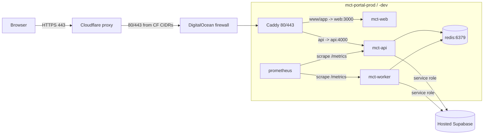

# Infrastructure, Deployment, and Environment Drift Audit

## Audit Metadata

- Audit name: repo-deep-dive
- Run: 20261002-0344-develop-6286137
- Repository: https://github.com/MaineCyberTech/mainecybertech (MCT client portal monorepo)
- Branch: develop
- Commit SHA: 6286137017c4b7c77e83ee420ec11382d984f263
- Generated at: 2026-10-02 03:44 UTC
- Auditor: principal-level repository auditor (fresh pass; subagent)
- Area code: INFRA
- Output path: docs/audits/repo-deep-dive/20261002-0344-develop-6286137/12_infra_deployment_environment_drift.md
- Scope limitations:
  - No live access to the DigitalOcean droplet, hosted Supabase, GHCR, the DO Spaces state buckets, or the GitHub `dev`/`prod`/`prod-approval` environments. All statements derive from repository files at HEAD (`6286137`).
  - Prior report consulted for continuity: `prompts/repo-deep-dive/20260806-1722-develop-75d3926/12_infra_deployment_environment_drift.md` (commit `75d3926`). Its findings were re-verified against the current commit, not copied.
  - Secret values were never printed; only variable NAMES and file paths are referenced.
  - `git` was not on `PATH` in the audit shell; it was invoked via `C:\Program Files\Git\cmd\git.exe`.
  - Terraform/OpenTofu CLI was not installed in the audit environment; Terraform claims were verified by reading `.tf`/workflow files and the provider/version documentation, not by running `terraform init` (see Finding INFRA-P1-002, Confidence Medium for that specific claim).

## Scope

Reviewed (repository files at `6286137`):

- Dockerfiles: `apps/api/Dockerfile`, `apps/web/Dockerfile`, `apps/worker/Dockerfile`, `.dockerignore`.
- Compose: root `docker-compose.yml` (local dev) and `infra/digitalocean/docker-compose.yml` (production stack).
- Terraform/OpenTofu: `infra/terraform/digitalocean/{providers,variables,droplet,firewall,dns,outputs}.tf`, `env/{backend.dev.hcl,backend.prod.hcl,dev.tfvars.example,prod.tfvars,prod.tfvars.example}`, `cloud-init.yml`, `.terraform.lock.hcl`, `infra/terraform/README.md`.
- Cloud/hosting config: `vercel.json`, `infra/digitalocean/README.md`.
- Deploy scripts: `scripts/backup-database.sh`, `scripts/backup-database.ps1`, `scripts/restore-database.sh`, `scripts/rollback.sh`, `scripts/validate-terraform-env.sh`, `scripts/install-terraform.ps1`.
- Reverse proxy: `infra/digitalocean/Caddyfile`, `Caddyfile.prod`, `Caddyfile.dev`.
- Environment examples: `infra/digitalocean/.env.example`, `apps/api/.env.example`, `apps/web/.env.example`, `apps/worker/.env.example`.
- Runtime validators: `apps/api/src/config/env.ts`, `apps/worker/src/env.ts`, `apps/web/lib/env.ts`.
- Observability: `infra/digitalocean/prometheus.yml`, `prometheus.rules.yml`.
- Deploy/CI workflows: `.github/workflows/deploy-do.yml`, `terraform-do.yml`, `build-push.yml`, `supabase-migrations.yml`, `db-backup.yml`, `db-restore-test.yml`, `e2e.yml`, `.github/dependabot.yml`.
- Documentation asserting infra/environment behavior: `docs/FINAL_DEPLOYMENT_OPERATIONS_HANDBOOK.md`, `docs/MONITORING_AND_ALERTING.md`, `docs/ROLLBACK_PROCEDURES.md`, `docs/ENVIRONMENT_VARIABLES.md`, `docs/GITHUB_SECRETS_AND_VARIABLES_MATRIX.md`, `docs/SECRETS_ROTATION.md`, `docs/RTO_RPO.md`, `docs/PRODUCTION_VS_TESTING_DOMAINS.md`, `docs/DEPLOYMENT_OPTIONS_COMPARISON.md`, `AGENTS.md`.

Not reviewed: runtime state of the droplets/hosted services; actual GitHub secret/variable values; live DNS; Container Registry contents; the retired AWS Terraform (absent from the tree); secrets inside any local `.env.local`/`.env` on developer machines (`apps/*/.env` and `apps/*/.env.local` are gitignored and were not opened).

## Evidence Reviewed

| Evidence | Type | Why relevant | Notes |
| --- | --- | --- | --- |
| `apps/{api,web,worker}/Dockerfile` | Dockerfiles | Build/runtime hygiene, users, healthchecks | All digest-pinned `node:20-alpine`, non-root uid 1001, HEALTHCHECK |
| `.dockerignore` | Build config | Secret/build-context hygiene | Excludes `.env*`, `node_modules`, `infra/`, `docs/` |
| `infra/digitalocean/docker-compose.yml` | Compose | Production runtime security profile | 6 services; cap_drop ALL, no-new-privileges, read_only, tmpfs, mem limits, digest pins |
| `docker-compose.yml` (root) | Compose | Local dev stack | Builds from source, `env_file` per app, e2e service |
| `infra/digitalocean/Caddyfile{,.dev,.prod}` | Reverse proxy | TLS, headers, metrics blocked | CSP removed from edge (delegated to app middleware); `/metrics` 404 |
| `infra/digitalocean/prometheus.yml` + `prometheus.rules.yml` | Observability | Scrape config + alert rules | Scrapes api/worker/localhost; no Alertmanager |
| `infra/terraform/digitalocean/*.tf` | Terraform | IaC for droplet/firewall/DNS | Spaces s3 backend, `use_lockfile = true`, prevent_destroy, CF-only 80/443 |
| `infra/terraform/digitalocean/env/*` | Terraform vars/backend | Env isolation | dev/prod buckets + keys; prod.tfvars tracked |
| `infra/terraform/digitalocean/cloud-init.yml` | Bootstrap | Docker install + UFW | UFW SSH from admin_ip_ranges; 2376 removed |
| `.github/workflows/deploy-do.yml` | Deploy pipeline | Build → SSH deploy → health gate → rollback | IMAGE_TAG required; printf env writer; targeted image cleanup |
| `.github/workflows/terraform-do.yml` | Terraform pipeline | plan/apply | Manual-only; `terraform_version: 1.9`; no admin_ip_ranges |
| `.github/workflows/db-backup.yml`, `db-restore-test.yml` | Backup/restore | RTO/RPO evidence | pg_dump→S3; restore test counts tables only |
| `apps/api/src/config/env.ts`, `apps/worker/src/env.ts` | Runtime validators | Env contract | Zod; required keys fail fast |
| `docs/FINAL_DEPLOYMENT_OPERATIONS_HANDBOOK.md` et al. | Docs | Documented behavior to compare against config | Multiple stale statements (see INFRA-P2-005) |
| `.github/dependabot.yml` | Supply chain | Dependency bot coverage | npm, github-actions, docker, terraform |

## Verification Performed

| Evidence | Type | Why relevant | Notes |
| --- | --- | --- | --- |
| `git rev-parse HEAD` (via `C:\Program Files\Git\cmd\git.exe`) | Command | Confirm audited commit | `6286137017c4b7c77e83ee420ec11382d984f263`, branch `develop`, 2026-10-01 23:25:45 -0400 |
| `git check-ignore -v infra/terraform/digitalocean/env/prod.tfvars` | Command | Gitignore vs tracked drift | `prod.tfvars` is TRACKED and NOT ignored (only `dev.tfvars` matches `.gitignore:57`) → INFRA-P3-008 confirmed |
| `git ls-files "*.env*" ".env*"` | Command | Env-file tracking | Only 4 `.env.example` files tracked; no real `.env` committed |
| `git diff 75d3926..6286137 -- infra .github/workflows docker-compose.yml vercel.json` | Command | Prior-finding re-verification | 29 files changed; used to classify each prior finding |
| Compose `mem_limit` enumeration | Command | Capacity math | api 256 + worker 256 + web 512 + redis 48 + prometheus 256 + caddy 64 = **1,392 MB** |
| `Select-String ... 'envs: "'` + `printf 'VAR=%s\n'` cross-check | Command | Env name drift | 38 vars in `envs:`; 34 written to `.env`; 6 schema-referenced vars never written (INFRA-P2-006) |
| `git grep NEXT_PUBLIC_*KEY/SECRET/TOKEN` | Command | Client-exposed secrets check | Only `NEXT_PUBLIC_TURNSTILE_SITE_KEY` (public by design); no secret NEXT_PUBLIC_* found |
| `git grep` secret patterns (`AKIA`, `ghp_`, `BEGIN PRIVATE KEY`, `sk_live_`) | Command | Secret leak check | Hits only inside the scanner's own pattern definitions (`scripts/scan-secrets.*`); no real secret in tree |
| `Test-Path infra/terraform/aws` | Command | Doc accuracy | Returns `False` → `infra/terraform/README.md` references a directory that does not exist |
| Web search: Terraform `use_lockfile` availability | External | Version compatibility | `use_lockfile` introduced in Terraform **1.10.0**; workflows pin 1.9 → INFRA-P1-002 |
| Read `apps/web/middleware.ts` (`buildCsp`) | Source read | CSP verification | Prod CSP is nonce-based (`'nonce-…' 'strict-dynamic'`); localhost keeps `unsafe-inline` → prior CSP finding verified-fixed |
| `git diff` of `docker-compose.yml`, `Caddyfile*`, `providers.tf`, `terraform-do.yml` | Command | Prior-finding status | Prometheus `prom-data` volume, caddy healthcheck, `use_lockfile`, concurrency all present at HEAD |

## Executive Summary

The container and deployment baseline remains strong and has **improved materially** since the 2026-08-06 pass (`75d3926`). At the current commit `6286137`:

- All three images are multi-stage, run as non-root uid 1001, pin their base image by digest, and ship `HEALTHCHECK`s. Compose applies `cap_drop: [ALL]`, `no-new-privileges`, `read_only` rootfs + `tmpfs`, memory limits, and digest-pinned third-party images.
- The prior **Prometheus tmpfs** issue is fixed — the TSDB now lives on the named volume `prom-data` (compose) so the 30-day retention window survives restarts.
- The prior **edge CSP defeat** is fixed — Caddy no longer emits `Content-Security-Policy`, and `apps/web/middleware.ts` produces a nonce-based production CSP (`script-src 'self' 'nonce-…' 'strict-dynamic'`), covered by `apps/web/__tests__/middleware.test.ts`.
- The prior **dead `:latest` compose defaults** are fixed — images now require `IMAGE_TAG` via `${IMAGE_TAG:?…}` and the deploy workflow pins to the commit SHA.
- The prior **image-cleanup ordering** is fixed — cleanup now runs *after* `compose down`/`up` and only after the container health gate passes, with an auto-rollback to `PREV_TAG` on failure.
- The prior **UFW 2376 exposure** is removed from `cloud-init.yml`.
- A Terraform `concurrency` group and `prevent_destroy` on the firewall were added.

However, several high-value gaps remain and two **new/regressed** issues were introduced by the remediation itself:

1. **SSH is still open to the entire internet** on both droplets — `admin_ip_ranges` defaults to `["0.0.0.0/0", "::/0"]` and the `terraform-do.yml` tfvars generator still never sets it (`INFRA-P1-001`, still-open).
2. **The Terraform state-locking fix is broken under the pinned Terraform version** — `providers.tf` sets `use_lockfile = true` (a Terraform ≥ 1.10 feature) while every workflow pins `terraform_version: 1.9`, which will fail `terraform init`/`validate` with "Unsupported argument". This turns the intended P2 fix into a release-blocking pipeline failure (`INFRA-P1-002`, new).
3. **The dev droplet is under-provisioned and now drifts from its own example** — CI hardcodes `s-1vcpu-512mb-10gb` for dev while `env/dev.tfvars.example` says `s-1vcpu-1gb`, and the compose stack reserves ~1,392 MB of limits (`INFRA-P2-004`).
4. **Monitoring alerts still have no delivery path** — `prometheus.rules.yml` includes `MCTServiceDown`/`MCTHighRequestErrorRate`/`Watchdog`, but no Alertmanager exists in the stack; the Watchdog "validates" nothing (`INFRA-P2-003`).
5. **Filesystem-documented operations no longer match the filesystem** — the deployment handbook, monitoring doc, and rollback guide describe an older pipeline (heredoc `.env`, `200/526` health acceptance, `cancel-in-progress: true`, push-triggered terraform apply, `docker image prune -af`) (`INFRA-P2-005`).

Plus: optional integration/security env vars (`M365_CLIENT_STATE`, `JIRA/JSM/M365_WEBHOOK_SECRET`, `METRICS_TOKEN`, `MFA_ENFORCEMENT_ENABLED`) are referenced in compose but never written by the deploy pipeline (`INFRA-P2-006`); Redis was weakened to `read_only: false` with `SETUID`/`SETGID` caps and its password is still exposed in `command:`/healthcheck args (`INFRA-P2-007`); `env/prod.tfvars` is still tracked despite `.gitignore` (`INFRA-P3-008`); the restore test uses a different, unpinned Postgres major than the backup script (`INFRA-P3-009`); and `docs/RTO_RPO.md` claims Redis AOF persistence that compose does not enable (`INFRA-P3-010`).

Overall domain score: **3.9 / 5** — production-grade container hygiene and a genuinely improved deploy pipeline, held back by an internet-wide SSH default, a Terraform version/locking contradiction that will break CI, and a stale operations documentation set.

## Inventory

| Item | Path / symbol | Purpose | Current state | Risk | Notes |
| --- | --- | --- | --- | --- | --- |
| API Dockerfile | `apps/api/Dockerfile` | Build + runtime | Good | Low | `node:20-alpine` digest-pinned, `appuser` uid 1001, `HEALTHCHECK /health`, prod-only deps |
| Web Dockerfile | `apps/web/Dockerfile` | Next.js standalone | Good | Low | `nextjs` uid 1001, `--chown`, build args for `NEXT_PUBLIC_*`, `HEALTHCHECK` |
| Worker Dockerfile | `apps/worker/Dockerfile` | Build + runtime | Good | Low | `appuser` uid 1001, `HEALTHCHECK 127.0.0.1:3001/health` |
| Prod compose | `infra/digitalocean/docker-compose.yml` | Droplet stack | Good | Med | 6 services; security profile strong; redis `read_only:false`; no Alertmanager |
| Local compose | `docker-compose.yml` | Dev stack | Functional | Low | Builds from source; e2e service with default test creds |
| Caddy set | `infra/digitalocean/Caddyfile{,.dev,.prod}` | TLS + routing | Good | Low | Origin certs (prod) / `tls internal` (dev); `/metrics` → 404; caddy healthcheck |
| Prometheus | `prometheus.yml`, `prometheus.rules.yml` | Metrics + alerts | Functional | Med | Volume-backed TSDB; rules defined; **no delivery path** |
| providers.tf | `infra/terraform/digitalocean/providers.tf` | Backend + providers | **Broken under pin** | **High** | Spaces s3 backend + `use_lockfile = true` (needs TF ≥ 1.10; workflows pin 1.9) |
| variables.tf | `infra/terraform/digitalocean/variables.tf` | Tunables | Gap | High | `admin_ip_ranges` default `0.0.0.0/0`, `::/0` |
| firewall.tf | `infra/terraform/digitalocean/firewall.tf` | Ingress rules | Gap | High | SSH from `admin_ip_ranges` (world by default); 80/443 CF-only; prevent_destroy |
| droplet.tf / cloud-init.yml | `infra/terraform/digitalocean/` | Droplet bootstrap | Good | Low | prevent_destroy; UFW mirrors admin_ip_ranges; 2376 removed |
| dns.tf | `infra/terraform/digitalocean/dns.tf` | DNS records | Good | Low | CF proxied; prod `.com` records, dev `.us` conditional |
| backend.{dev,prod}.hcl | `infra/terraform/digitalocean/env/` | State buckets | Good | Low | Separate Spaces buckets/keys; `encrypt = true` |
| prod.tfvars | `infra/terraform/digitalocean/env/prod.tfvars` | Terraform vars | Stale/tracked | Low | Placeholders; tracked despite `.gitignore`; missing `admin_ip_ranges` |
| dev.tfvars.example | `infra/terraform/digitalocean/env/dev.tfvars.example` | Terraform vars template | Drift | Med | Says `s-1vcpu-1gb`; CI generates `s-1vcpu-512mb-10gb` |
| deploy-do.yml | `.github/workflows/deploy-do.yml` | Deploy pipeline | Good | Med | Env writer omits 6 schema vars; health gate + rollback solid |
| terraform-do.yml | `.github/workflows/terraform-do.yml` | Terraform pipeline | Gap | High | Manual-only; pins TF 1.9; never sets `admin_ip_ranges` |
| db backup/restore | `db-backup.yml`, `db-restore-test.yml`, `scripts/backup-database.sh` | Backup/DR | Partial | Med | Restore checks table count only; Postgres 15 vs 16 mismatch |
| Runtime validators | `apps/api/src/config/env.ts`, `apps/worker/src/env.ts`, `apps/web/lib/env.ts` | Env contract | Good | Low | Zod fail-fast; worker superRefine on BullMQ |
| Env examples | `apps/*/.env.example`, `infra/digitalocean/.env.example` | Operator templates | Good | Low | Placeholders only; no real values |
| Secret refs | `.github/workflows/deploy-do.yml` `envs:` + `printf` block | Secret delivery | Good | Med | Forwarded via `env:` (never inline in `run:`); Redis pw in process args |
| Ops docs | `FINAL_DEPLOYMENT_OPERATIONS_HANDBOOK.md`, `MONITORING_AND_ALERTING.md`, `ROLLBACK_PROCEDURES.md`, `ENVIRONMENT_VARIABLES.md`, `RTO_RPO.md` | Operator guidance | **Stale** | Med | Describe older pipeline/config |

## Domain Scorecard

| Category | Score | Evidence | Gap | Recommended action |
| --- | ---: | --- | --- | --- |
| Dockerfiles | 5 | 3/3 multi-stage, non-root uid 1001, digest-pinned base, HEALTHCHECK, prod-only deps | None observed | Keep |
| Compose | 4 | Security profile, required `IMAGE_TAG`/`REDIS_PASSWORD`, read_only+tmpfs, mem limits, prom volume, caddy healthcheck | redis `read_only:false` + SETUID/SETGID; no alertmanager; no worker healthcheck at compose level | Harden redis (INFRA-P2-007); add alert delivery (INFRA-P2-003) |
| Terraform/OpenTofu | 2 | Spaces backend, env buckets, CF-only ingress, prevent_destroy, concurrency, UFW mirror | `use_lockfile` incompatible with pinned TF 1.9; SSH 0.0.0.0/0; prod.tfvars tracked | INFRA-P1-001, INFRA-P1-002, INFRA-P3-008 |
| Cloud/hosting config | 3 | droplet/cloud-init/DNS coherent; vercel.json minimal | `infra/terraform/README.md` references non-existent `aws/`; capacity drift | INFRA-P2-004, INFRA-P3-011 |
| Deploy scripts | 3 | printf env writer, health gate, auto-rollback, targeted cleanup | Optional vars not deployed; docs disagree | INFRA-P2-006, INFRA-P2-005 |
| Reverse proxy | 4 | TLS (origin/internal), SSE flush, headers, `/metrics` 404, healthcheck, CSP delegated to app | dev Caddyfile still sets a permissive CSP (acceptable, dev-only) | Keep; validate nonce CSP end-to-end |
| Environment examples | 3 | 4 `.env.example` templates, placeholders only | dev droplet size drift; examples list 6 vars the pipeline never deploys | INFRA-P2-004, INFRA-P2-006 |
| Runtime validators | 4 | Zod in API + worker; web `lib/env.ts` defaults | Web validator is optional/defaulted | None required |
| Secret references | 4 | GitHub Secrets → `env:` → printf `.env`; `chmod 600`; no inline `run:` interpolation | Redis password in args; optional secrets not delivered | INFRA-P2-006, INFRA-P2-007 |
| Build args | 4 | `NEXT_PUBLIC_*` with defaults; Turnstile site key wired | Test-accounts flag differs between `build-push.yml`/`deploy-do.yml` (env-derived both, low) | Document build-arg contract |
| Container users | 5 | api/worker `appuser`, web `nextjs`, compose drops ALL caps | None observed (redis caps added for setpriv) | Keep |
| Health/readiness/liveness | 3 | Dockerfile HEALTHCHECKs + compose healthchecks (redis/api/caddy) + deploy health gate | No Alertmanager; worker health non-fatal; no liveness probe for prometheus | INFRA-P2-003 |

Overall domain score: **3.9 / 5**

## Detailed Review

### Item: Dockerfiles (api / web / worker)

- Evidence: `apps/api/Dockerfile`, `apps/web/Dockerfile`, `apps/worker/Dockerfile`, `.dockerignore`.
- What it does: Builds with pnpm (corepack `pnpm@10`, 3-attempt retry), then installs `--prod --ignore-scripts` in a fresh runtime stage as uid 1001 with `NODE_ENV=production` and a `HEALTHCHECK`. Web uses Next standalone output with `packages/` copied; builder stage removes `.next/cache`.
- How it appears to work: Base image `node:20-alpine@sha256:fb4cd12c…` is identical across all three; healthchecks probe `/health` (api), `/health:3001` (worker), `/` (web).
- Current controls: digest-pinned base, non-root user, multi-stage build, prod-only deps, bounded build context via `.dockerignore` (excludes `.env*`, `infra/`, `docs/`, tests).
- Missing controls: no image vulnerability scan of the *published* image (Trivy runs fs-mode in `test.yml` per `AGENTS.md`); SBOM is generated (`sbom.yml`) but not attested with cosign/provenance.
- Risks: Low.
- Recommended improvement: keep as-is; add cosign attestation/scan as platform-evolution backlog.
- Suggested tests: `docker run --rm <image> id -u` must be `1001` for all three.
- Suggested docs: none.

### Item: docker-compose.yml (production)

- Evidence: `infra/digitalocean/docker-compose.yml`.
- What it does: Runs `redis`, `api`, `worker`, `web`, `prometheus`, `caddy`. Shared `x-security` (cap_drop ALL, no-new-privileges) and `x-logging` (10m × 3) anchors. `IMAGE_TAG` and `REDIS_PASSWORD` are mandatory (`${VAR:?}`), Redis has `SETUID`/`SETGID` caps added and `read_only: false`; apps are `read_only: true` with `tmpfs /tmp`.
- Current controls: Redis auth with no fallback; healthchecks on redis/api/caddy; `depends_on` now `service_healthy` for api/worker → redis and `service_started` for web → api; digest pins on redis/caddy/prometheus; Prometheus has no published ports; `prom-data` named volume.
- Missing controls / risks:
  - Redis runs `read_only: false` with `SETUID`/`SETGID` — a deliberate trade-off (setpriv support) that weakens the previous "read_only rootfs" posture for that service; undocumented.
  - `REDIS_PASSWORD` appears in the `command:` and healthcheck args → visible via `docker inspect`/process list.
  - No `alertmanager` service (see INFRA-P2-003).
  - `worker` has no compose-level healthcheck (relies on the image's `HEALTHCHECK`); the deploy gate still treats worker health as non-fatal.
- Recommended improvement: document the Redis trade-off (or use a `redis.conf` mounted read-only with `REDISCLI_AUTH` for the healthcheck); add alert delivery.
- Suggested tests: `docker compose config --quiet` on a fresh checkout; assert `${IMAGE_TAG}` and `${REDIS_PASSWORD}` are required (compose exits non-zero without them).
- Suggested docs: note Redis read_only exception in `infra/digitalocean/README.md`.

### Item: Terraform (DigitalOcean + Cloudflare)

- Evidence: `infra/terraform/digitalocean/{providers,variables,droplet,firewall,dns,outputs}.tf`, `env/*`, `cloud-init.yml`.
- What it does: One droplet per environment (`mct-portal-${environment}`, nyc3, `prevent_destroy`), DO firewall (SSH from `admin_ip_ranges`; 80/443 from Cloudflare IPv4+IPv6 CIDR data sources; full egress), Cloudflare proxied A records (prod `.com`, dev `.us` conditional on `cloudflare_zone_id_us`), state in DO Spaces via the s3 backend with per-env backend config.
- Current controls: `prevent_destroy` on droplet and firewall; provider versions pinned via `.terraform.lock.hcl` (digitalocean 2.90.0, cloudflare 5.20.0); `encrypt = true`; workflow `concurrency` group; gates (`validate` always; e2e + migrations for prod apply); `prod-approval` environment on the prod apply job; UFW on the droplet mirrors `admin_ip_ranges`.
- Missing controls / risks:
  - `providers.tf` sets `use_lockfile = true` — Terraform ≥ 1.10 only — while `terraform-do.yml` pins `terraform_version: 1.9` and `scripts/install-terraform.ps1` downloads 1.9.8. `terraform init` will reject the backend argument. (INFRA-P1-002)
  - `admin_ip_ranges` default `0.0.0.0/0`/`::/0` and the CI tfvars generator never overrides it. (INFRA-P1-001)
  - `required_version = ">= 1.5"` does not express the ≥ 1.10 requirement introduced by `use_lockfile`.
  - `prod.tfvars` is tracked (gitignore ineffective) and stale. (INFRA-P3-008)
  - `terraform-do` is now `workflow_dispatch`-only (documented as intentional in the workflow comment), so drift between code and the real droplet is no longer caught automatically.
- Recommended improvement: bump `terraform_version` to ≥ 1.10 (and the lock constraint / install script) or drop `use_lockfile` until then; source `admin_ip_ranges` from a GitHub secret; untrack `prod.tfvars`.
- Suggested tests: a CI `terraform init -backend=false` + `terraform validate` step catches the version/argument mismatch.
- Suggested docs: document state locking mechanism and terraform version floor.

### Item: Reverse proxy (Caddy)

- Evidence: `Caddyfile`, `Caddyfile.prod`, `Caddyfile.dev`.
- What it does: Routes www/app → `web:3000`, api → `api:4000` (with `flush_interval -1` for the SSE stream); TLS via Cloudflare origin certs (prod/default) or `tls internal` (dev); returns 404 for public `/metrics`; sets security headers + HSTS (preload on prod, no-preload on dev).
- Current state: The previous edge CSP override was removed (verified in `git diff`), so the application's nonce-based CSP is no longer replaced by a weaker `'unsafe-inline'` policy. `Caddyfile.dev` still sets an explicit permissive CSP (dev-only, acceptable). A `caddy validate` healthcheck was added.
- Risks: Low. The dev fallback path in `deploy-do.yml` uses `sed` to swap the TLS line when certs are missing; that is only exercised on dev.
- Recommended improvement: none urgent; verify the CSP reaches the browser unmodified in prod.
- Suggested tests: `caddy validate` in CI; response header assertion that `Content-Security-Policy` contains `'nonce-` on a prod host.
- Suggested docs: `docs/MONITORING_AND_ALERTING.md` still describes the old health-check semantics (see INFRA-P2-005).

### Item: Env validators & secret references

- Evidence: `apps/api/src/config/env.ts`, `apps/worker/src/env.ts`, `apps/web/lib/env.ts`, `infra/digitalocean/.env.example`, `apps/*/.env.example`, `deploy-do.yml`.
- What it does: Zod validates every required value at boot (`SUPABASE_*`, `JWT_SECRET` ≥ 32 chars; worker `superRefine` requires `REDIS_URL` when `QUEUE_BACKEND=bullmq`). The deploy workflow forwards selected GitHub secrets as `env:` variables to `appleboy/ssh-action` and writes them to `/opt/mct-portal/.env` with `printf '%s'` (no re-expansion) and `chmod 600`.
- Current state: The pipeline writes 34 names; the API schema/examples reference at least six more that are not written (`M365_CLIENT_STATE`, `JIRA_WEBHOOK_SECRET`, `JSM_WEBHOOK_SECRET`, `M365_WEBHOOK_SECRET`, `METRICS_TOKEN`, `MFA_ENFORCEMENT_ENABLED`). `M365_CLIENT_STATE` gates inbound M365 webhook validation (`apps/api/src/routes/webhooks.ts:435`); if unset, M365 webhook events fail closed (feature-dead).
- Risks: Medium (silent capability loss; security control could be off).
- Recommended improvement: add the six names to the deploy `envs:` list and `printf` block (defaulting empty where intentional), or document them as deliberately unset.
- Suggested tests: a CI check that every key in `apps/api/src/config/env.ts` is either written by the deploy generator or explicitly listed as deploy-excluded.
- Suggested docs: `docs/ENVIRONMENT_VARIABLES.md` (also fix the "heredoc" description).

## Scenario / Control Matrix

| ID | Scenario or control | Evidence | Current control | Gap | Severity | Recommendation |
| --- | --- | --- | --- | --- | --- | --- |
| INFRA-001 | SSH exposure | `variables.tf:76-89`, `firewall.tf:19-23`, `terraform-do.yml` tfvars step | `admin_ip_ranges` default `0.0.0.0/0`+`::/0`; CI never sets it; UFW mirrors it | SSH open on prod+dev | P1 | INFRA-P1-001 |
| INFRA-002 | Terraform version/locking | `providers.tf:16`, `terraform-do.yml:43,171,211`, `install-terraform.ps1:5` | `use_lockfile=true` with TF 1.9 pin | `init` fails; no effective locking | P1 | INFRA-P1-002 |
| INFRA-003 | Alert delivery | `prometheus.rules.yml`, compose (no alertmanager) | Rules evaluated; liveness Watchdog | No delivery target | P2 | INFRA-P2-003 |
| INFRA-004 | Dev capacity | `terraform-do.yml:66` vs `dev.tfvars.example`, compose mem limits (~1,392 MB) | Hardcoded 512MB CE for dev | OOM risk + example drift | P2 | INFRA-P2-004 |
| INFRA-005 | Ops docs accuracy | handbook/monitoring/rollback/env-vars vs workflow/config | Docs describe older pipeline | Operators misled | P2 | INFRA-P2-005 |
| INFRA-006 | Optional env delivery | `deploy-do.yml` vs `env.ts`/examples | 34 delivered; 6 referenced not delivered | Silent feature/security loss | P2 | INFRA-P2-006 |
| INFRA-007 | Redis hardening | compose redis service | `read_only:false`; SETUID/SETGID; password in args | Weakened FS isolation; secret exposure | P2 | INFRA-P2-007 |
| INFRA-008 | Gitignore drift | `.gitignore:57` vs tracked `prod.tfvars` | Ignore rule ineffective | Future accidental secret commit | P3 | INFRA-P3-008 |
| INFRA-009 | Restore correctness | `db-restore-test.yml:41`, `backup-database.sh:29` | Restore checks table count only; PG16 vs PG15 | Unvalidated DR | P3 | INFRA-P3-009 |
| INFRA-010 | Redis persistence claim | `RTO_RPO.md` vs compose redis command | No `appendonly yes` | RPO claim unsupported | P3 | INFRA-P3-010 |
| INFRA-011 | Terraform README | `infra/terraform/README.md` | Claims `aws/` exists | Dead reference | P3 | INFRA-P3-011 |
| INFRA-012 | Terraform trigger drift | `terraform-do.yml` vs `ROLLBACK_PROCEDURES.md:116-120`, handbook | Manual-only now | Rollback runbook step is a no-op | P3 | INFRA-P3-012 |

## Findings

### Finding ID: INFRA-P1-001 - SSH is open to the internet on both droplets (admin_ip_ranges default 0.0.0.0/0 and CI never overrides it)

- Severity: P1 (High)
- Confidence: High
- Area: Infrastructure — network exposure
- Evidence:
  - `infra/terraform/digitalocean/variables.tf` lines 76-89: `variable "admin_ip_ranges" { ... default = ["0.0.0.0/0", "::/0"] }`
  - `.github/workflows/terraform-do.yml` "Create tfvars file" step (lines 57-79): writes `do_token`, `ssh_fingerprint`, `cloudflare_*`, `droplet_size`, `environment` — **no `admin_ip_ranges`**
  - `infra/terraform/digitalocean/firewall.tf` lines 19-23: SSH inbound rule `source_addresses = var.admin_ip_ranges`
  - `infra/terraform/digitalocean/cloud-init.yml` lines 23-26: `ufw --force enable` then per-CIDR `ufw allow from ${cidr} … port 22`
  - `infra/terraform/digitalocean/env/prod.tfvars` and `dev.tfvars.example`: no `admin_ip_ranges`
  - `AGENTS.md` "Known Debt" and `docs/audits/comprehensive-audit/2026-08-26/report.md` (P0-07 / P1-10) record this as accepted-risk historically; the accepted-risk decision is about key-only auth, not about removing the default.
- What is happening: Every `terraform apply` (dev and prod, including via the manual workflow) opens TCP 22 to `0.0.0.0/0` and `::/0` at both the DigitalOcean firewall and the in-droplet UFW. Authentication is limited to the root SSH key (`ssh_keys = [var.ssh_fingerprint]` in `droplet.tf`); there is no password auth.
- Why it matters: The droplet hosts the entire production stack — the API (with Supabase service-role DB access), web, worker, Redis, and `/opt/mct-portal/.env` (~34 secrets). Internet-wide SSH makes key theft/brute-force the only barrier to full compromise, and there is no source-IP restriction to fail over to.
- User / business impact: A leaked deploy key yields full tenant-data access (Supabase service role) and the ability to exfiltrate all integration secrets.
- Security / privacy / reliability impact: P1 network exposure on the production host; single-factor control point.
- Recommended fix: (a) add `admin_ip_ranges` to the `terraform-do.yml` tfvars generator sourced from a GitHub secret (office/VPN CIDRs; if CI egress must be allowed, use a dedicated key and document that GitHub Actions egress is dynamic); (b) change the `variables.tf` default to a deny-safe value or make the variable required with no default; (c) after apply, verify the DO firewall source set.
- Suggested validation: `terraform plan` must show the SSH source set changing to the restricted CIDRs; then SSH from a non-allowed IP must time out and from an allowed IP must succeed.
- Owner suggestion: platform/infrastructure
- Effort estimate: S
- Dependencies: GitHub environment secret holding allowed CIDRs; coordination so an apply does not lock CI out of the droplet mid-deploy.
- Status: still-open
- Endpoint / data path: TCP 22 → droplet sshd → root shell → `/opt/mct-portal/.env` (secrets) + Docker socket → all containers/DB credentials.
- Attack path: Internet-wide SSH + leaked/reused `CI_SSH_PRIVATE_KEY` → root on prod droplet → Supabase service-role key exfiltration → all tenants' data. (Chains with SECRETS/AUTH areas.)

### Finding ID: INFRA-P1-002 - Terraform state-locking fix is incompatible with the pinned Terraform version (use_lockfile requires >= 1.10, workflows pin 1.9)

- Severity: P1 (High)
- Confidence: Medium (verified by file evidence + external provider docs; not executed because Terraform is not installed in the audit environment)
- Area: Infrastructure — CI/IaC correctness
- Evidence:
  - `infra/terraform/digitalocean/providers.tf` lines 4-17: `backend "s3" { ... use_lockfile = true }`
  - `infra/terraform/digitalocean/providers.tf` line 2: `required_version = ">= 1.5"`
  - `.github/workflows/terraform-do.yml` lines 41-43, 169-171, 209-211: `uses: hashicorp/setup-terraform@…` with `with: terraform_version: 1.9`
  - `scripts/install-terraform.ps1` line 5: downloads `terraform_1.9.8_windows_amd64.zip`
  - External: HashiCorp documents `use_lockfile` as introduced in Terraform 1.10.0 (S3 native locking). Terraform 1.9 does not recognize the argument.
- What is happening: The remediation that added state locking (`use_lockfile = true`) was not accompanied by a version bump. Under the version every pipeline pins (1.9), `terraform init` will fail with "Unsupported argument" for the backend configuration, so `plan`/`validate`/`apply` cannot run at all. Effectively the terraform workflow is broken at HEAD and the intended locking guarantee is not delivered.
- Why it matters: The previous audit flagged the absence of state locking (INFRA-P2-002). This change *looks* like a fix but is a latent pipeline failure — worse than the original gap because it is silent until someone runs terraform. It also means any infrastructure change (including INFRA-P1-001) cannot be applied through CI.
- User / business impact: Infrastructure changes are blocked or require manual/version-tinkered runs; operators may work around it by running un-pinned local Terraform, reintroducing the concurrency risk.
- Security / privacy / reliability impact: IaC pipeline unavailable; no verified locking; potential for state corruption if someone bypasses the version guard.
- Recommended fix: Raise `terraform_version` to a version that supports S3 `use_lockfile` (1.10+, and confirm DO Spaces S3-compatible conditional writes behave) in all three setup steps and `scripts/install-terraform.ps1`; update `required_version` to `>= 1.10` (or `>= 1.11` if the team wants the fully-matured path). Alternatively, temporarily remove `use_lockfile` until the bump lands.
- Suggested validation: a CI job running `terraform init -backend=false` then `terraform validate` against the pinned version must pass; and a real `init` against the Spaces backend must succeed and create a `.tflock` object.
- Owner suggestion: platform/infrastructure
- Effort estimate: S
- Dependencies: Confirm DO Spaces supports the conditional-write semantics Terraform uses for lock files; otherwise keep the concurrency group as the only guard and document it.
- Status: regressed (prior P2-002 state-locking gap was addressed in code but rendered inoperative by the version pin)
- Endpoint / data path: GitHub Actions `terraform-do.yml` → `terraform init` → DO Spaces backend.
- Attack path: none identified (availability/correctness, not security).

### Finding ID: INFRA-P2-003 - Prometheus alert rules have no delivery path (no Alertmanager)

- Severity: P2 (Medium)
- Confidence: Medium (config verified; delivery absence is a negative that is complete in-repo, runtime not observed)
- Area: Infrastructure — observability
- Evidence:
  - `infra/digitalocean/prometheus.rules.yml` lines 1-40: header comment "for delivery (email/Slack/etc.) an Alertmanager deployment is required"; rules `MCTServiceDown`, `MCTHighRequestErrorRate`, `Watchdog`
  - `infra/digitalocean/docker-compose.yml`: no `alertmanager` service; Prometheus has no `--web.enable-*` notification wiring
  - `docs/MONITORING_AND_ALERTING.md` §7 lists only Sentry/GitHub/DO-monitoring channels; no Prometheus alert delivery
- What is happening: Prometheus evaluates the alert rules and the `Watchdog` rule (`expr: vector(1)`) fires continuously, but there is no Alertmanager and no receiver, so no rule ever reaches a human. The `Watchdog`'s stated purpose ("firing once a day means the alerting pipeline is healthy") validates an empty pipeline.
- Why it matters: A dead API/worker (`MCTServiceDown`) or a 5xx spike is only detected by users or by the deploy workflow's own health checks during a deploy — not between deploys.
- User / business impact: Longer outages; discoverable only via customer reports or manual SSH.
- Security / privacy / reliability impact: Detection gap; the platform's monitoring claim exceeds the delivered control.
- Recommended fix: Deploy a digest-pinned Alertmanager with a real receiver (email/Slack/Teams), wire `alertmanager_config`/`alerting:` into `prometheus.yml`, and add it to the deploy workflow's copy step and health gate. Until then, edit docs to state that Prometheus rules are evaluated but not delivered.
- Suggested validation: trigger one rule (e.g., stop the worker or set `vector(1)` rule to a test route) and confirm a message reaches the channel.
- Owner suggestion: platform
- Effort estimate: M
- Dependencies: A notification channel/credential (SMTP or webhook) and a secret.
- Status: still-open
- Endpoint / data path: Prometheus rule evaluation → (missing) Alertmanager → (missing) receiver.
- Attack path: none identified.

### Finding ID: INFRA-P2-004 - Dev droplet capacity is under-provisioned and the CI value drifts from dev.tfvars.example

- Severity: P2 (Medium)
- Confidence: High
- Area: Infrastructure — capacity + config drift
- Evidence:
  - `.github/workflows/terraform-do.yml` line 66: `DROPLET_SIZE: ${{ steps.env.outputs.name == 'prod' && 's-2vcpu-2gb' || 's-1vcpu-512mb-10gb' }}`
  - `infra/terraform/digitalocean/env/dev.tfvars.example` line 5: `droplet_size = "s-1vcpu-1gb"`
  - `infra/digitalocean/docker-compose.yml` mem limits: redis 48m + api 256m + worker 256m + web 512m + prometheus 256m + caddy 64m = **1,392 MB** configured caps
  - `docs/FINAL_DEPLOYMENT_OPERATIONS_HANDBOOK.md` line 215 still says web `mem_limit` is 256MB (actual 512MB)
- What is happening: CI provisions dev at 512MB while the example file (and the compose stack's own limits) assume ≥ 1GB. The web service alone was raised to 512MB in this window.
- Why it matters: A 512MB droplet with two JVM-less but memory-hungry Node services, Prometheus, Caddy, Redis, and Docker overhead will thrash or OOM-kill containers, producing flaky dev/staging behavior and deploy health-gate failures.
- User / business impact: Unreliable staging; noisy deploy failures unrelated to code.
- Security / privacy / reliability impact: Availability of the dev environment.
- Recommended fix: Align the CI dev size with `dev.tfvars.example` (at minimum `s-1vcpu-1gb`, preferably `s-2vcpu-2gb` to mirror prod) or trim `mem_limit`s; keep `dev.tfvars.example` in sync.
- Suggested validation: `free -m` and `docker stats --no-stream` on the dev droplet under a deploy; assert no OOM-kills in `dmesg`/`docker events`.
- Owner suggestion: platform/infrastructure
- Effort estimate: S
- Dependencies: Droplet resize (a terraform apply, currently blocked by INFRA-P1-002).
- Status: still-open

### Finding ID: INFRA-P2-005 - Operations documentation contradicts the current pipeline and configuration

- Severity: P2 (Medium)
- Confidence: High
- Area: Infrastructure — documentation drift
- Evidence (each claim vs the current file):
  - `docs/FINAL_DEPLOYMENT_OPERATIONS_HANDBOOK.md` line 54: says deploy `concurrency` uses `cancel-in-progress: true`; actual `deploy-do.yml` line 38 sets `cancel-in-progress: false` (intentional — never abort an in-flight deploy).
  - Handbook line 58: says "Old MCT images are cleaned up via `docker image prune -af`"; actual `deploy-do.yml` lines 479-481 do a targeted `docker rmi` of non-current `mct-(api|worker|web)` tags plus `docker image prune -f` **after** the health gate.
  - Handbook line 38: says the API health check accepts `200/526` and web accepts any non-000; actual `deploy-do.yml` lines 503-534 require API `200` and web `200/301/302/307`.
  - Handbook line 103 ("25+ secrets … via SSH heredoc") and `docs/ENVIRONMENT_VARIABLES.md` line 144 ("via SSH heredoc"): actual writer uses `printf '%s'` with secrets forwarded through `env:` (no heredoc).
  - Handbook line 136: says firewall serves ports "22/80/443/2376"; actual `firewall.tf` has 22/80/443 only (2376 removed) — the same stale claim appears in `docs/MEGA_AUDIT_2026-06-18.md` line 472.
  - Handbook lines 48-50: says Migrations gate is required for "All deploys"; actual `deploy-do.yml` lines 266-270 runs `migrate-gate` only when `name == 'prod'`.
  - Handbook line 143 and `docs/ROLLBACK_PROCEDURES.md` lines 116-120: describe terraform applying on push; actual `terraform-do.yml` is `workflow_dispatch`-only (input `apply` required).
  - Handbook line 215: web `mem_limit` "256MB"; actual 512MB.
  - `docs/MONITORING_AND_ALERTING.md` §6 (lines 179-189): stale health-check semantics (same `526`/any-code claims) and names the rollback input `input.rollback-tag` (actual `rollback_sha`), and §8 line 241 lists web 256m.
  - `docs/RTO_RPO.md` line 11: "Redis … AOF persistence"; compose runs `redis-server --requirepass …` with no `--appendonly yes`.
  - `infra/terraform/README.md` lines 5-6: says `aws/` is "dormant, migrated to DO"; `infra/terraform/aws/` does not exist.
- What is happening: Several operator-facing documents describe a previous generation of the pipeline and config. An operator following the handbook (e.g., expecting `526` to be healthy, or that a `git push` triggers a terraform apply) will reach a wrong conclusion or execute a no-op step.
- Why it matters: Runbooks are exercised during incidents; stale steps waste time and can mask real failures (e.g., believing a 526 is healthy).
- User / business impact: Longer incidents; incorrect rollback attempts.
- Security / privacy / reliability impact: Reliability of incident response; the heredoc/"shared secrets" description also misstates the (better) current secret handling.
- Recommended fix: Update the handbook, `MONITORING_AND_ALERTING.md`, `ROLLBACK_PROCEDURES.md`, `ENVIRONMENT_VARIABLES.md`, and `RTO_RPO.md` to match HEAD exactly; add a CI docs-consistency check for the highest-value claims (health codes, concurrency, terraform trigger) or generate those sections from the workflow where feasible.
- Suggested validation: a reviewer can follow each runbook step at HEAD and it succeeds; add a unit/lint check that greps the workflow for the values the docs quote.
- Owner suggestion: platform + docs
- Effort estimate: M
- Dependencies: none
- Status: still-open (grew since the prior pass; the prior audit's documentation-update section was not actioned for these files)

### Finding ID: INFRA-P2-006 - Integration/security env vars referenced by the app schema are not delivered by the deploy pipeline

- Severity: P2 (Medium)
- Confidence: High (pipeline content verified; droplet state unknown)
- Area: Infrastructure — environment drift
- Evidence:
  - `apps/api/src/config/env.ts` lines 38-49 define `JIRA_WEBHOOK_SECRET`, `JSM_WEBHOOK_SECRET`, `M365_WEBHOOK_SECRET`, `M365_CLIENT_STATE`, `TURNSTILE_SECRET_KEY`, `METRICS_TOKEN`, `MFA_ENFORCEMENT_ENABLED`
  - `apps/api/.env.example` lines 30-44 list them
  - `infra/digitalocean/docker-compose.yml` lines 63-92 interpolate `M365_CLIENT_STATE`, `JIRA_WEBHOOK_SECRET`, `JSM_WEBHOOK_SECRET`, `M365_WEBHOOK_SECRET`, `METRICS_TOKEN`, `MFA_ENFORCEMENT_ENABLED` (all with `:-` empty defaults)
  - `.github/workflows/deploy-do.yml`: the `envs:` list has 38 names; the `printf` writer emits 34; cross-check shows `M365_CLIENT_STATE`, `JIRA_WEBHOOK_SECRET`, `JSM_WEBHOOK_SECRET`, `M365_WEBHOOK_SECRET`, `METRICS_TOKEN`, `MFA_ENFORCEMENT_ENABLED` are **not** written to `/opt/mct-portal/.env`
  - `apps/api/src/routes/webhooks.ts` line 435 reads `getEnv().M365_CLIENT_STATE` to validate inbound M365 webhook notifications
  - `DEPLOY_REF`, `REPO_SLUG`, `GHCR_TOKEN`, `GHCR_ACTOR` are in `envs:` but intentionally not written (they are shell-only) — not a defect
- What is happening: Because every omitted var is optional in Zod, the API boots fine. But the capability it gates is silently absent unless someone set it manually on the droplet: M365 webhook validation fails closed (all M365 webhook events rejected), webhook HMAC secrets for Jira/JSM/M365 are unset, the `/metrics` bearer gate is disabled, and MFA enforcement stays off. (Turnstile, FIELD_ENCRYPTION_KEY, and RLS flags *were* wired in this window — see `git diff`.)
- Why it matters: A security control (M365 `clientState` validation) and a feature (captcha, metrics gate) can be off in production despite green CI, and there is no artifact proving they are on.
- User / business impact: M365 calendar integration silently broken; no proactive signal.
- Security / privacy / reliability impact: Potential reduction in webhook-auth strength; `/metrics` gate disabled by default.
- Recommended fix: Add the six names to `deploy-do.yml` `envs:` + `printf` block (empty defaults are fine for optional ones, but then set explicit values via GitHub secrets where the control is intended to be on), or document them as deliberately excluded and record why. Confirm current droplet state for `M365_CLIENT_STATE`/`METRICS_TOKEN`.
- Suggested validation: a CI check that every key in `apps/api/src/config/env.ts` is either written by the deploy generator or listed in an explicit "not deployed" allowlist; on the droplet, `grep -c` the keys in `/opt/mct-portal/.env`.
- Owner suggestion: platform
- Effort estimate: S
- Dependencies: GitHub secrets/vars for the values where the control should be active.
- Status: partially-fixed (3 of 9 previously-missing vars now wired: `FIELD_ENCRYPTION_KEY`, `TURNSTILE_SECRET_KEY`, `RLS_READS/WRITES_ENABLED`)
- Endpoint / data path: `POST /api/v1/webhooks/m365` → `getEnv().M365_CLIENT_STATE` (unset) → validation failure.
- Attack path: none identified (fails closed); the risk is silent feature/control loss, not exploitability.

### Finding ID: INFRA-P2-007 - Redis container hardening was weakened and its password remains in process arguments

- Severity: P2 (Medium, elevated from prior P3-009 because the filesystem isolation regression is additive)
- Confidence: High
- Area: Infrastructure — container hardening + secret handling
- Evidence:
  - `infra/digitalocean/docker-compose.yml` lines 27-47: redis now has `read_only: false`, `cap_add: [SETUID, SETGID]`, `command: redis-server --requirepass ${REDIS_PASSWORD:?…}`, and healthcheck `redis-cli -a ${REDIS_PASSWORD:?…} ping`
  - `git diff 75d3926..6286137` shows the change: `-    read_only: true` → `+    read_only: false` and `+    cap_add: SETUID/SETGID`
  - Commit context (`git log`): `39377e10 fix: add SETUID/SETGID caps to redis service for setpriv`
- What is happening: To allow Redis to drop privileges at runtime (setpriv), the container was given `SETUID`/`SETGID` and its root filesystem made writable. It also still receives the password as a command-line argument and in the healthcheck command, so `docker inspect`/`ps` on the droplet reveals it.
- Why it matters: Redis is the only service whose rootfs is now writable and which carries privilege-escalation-capable capabilities, narrowing the otherwise-strong `cap_drop: ALL` posture. The password exposure is a defense-in-depth issue on a shared host.
- User / business impact: Low direct user impact; increases blast radius of any container-level compromise.
- Security / privacy / reliability impact: Reduced container isolation; secret visible to anyone with droplet shell/inspect access.
- Recommended fix: Prefer a read-only rootfs with a mounted `redis.conf` (password via `requirepass` file) and set `REDISCLI_AUTH` for the healthcheck, or restrict the writable paths to a tmpfs/volume rather than the whole rootfs; document the setpriv trade-off if it must remain. Consider a dedicated non-root Redis or a managed queue.
- Suggested validation: `docker inspect` on the redis container must not print the password; `docker exec … ls /` confirms read-only if reintroduced; Redis still authenticates.
- Owner suggestion: platform
- Effort estimate: S
- Dependencies: Redis config file / secret file conventions in the deploy workflow.
- Status: regressed (prior INFRA-P3-009 was open; the read-only rootfs that the prior scorecard credited was removed in this window)

### Finding ID: INFRA-P3-008 - `env/prod.tfvars` is tracked despite an ignore rule that names it

- Severity: P3 (Low)
- Confidence: High
- Area: Infrastructure — repo hygiene
- Evidence:
  - `.gitignore` line 57: `**/env/*.tfvars`
  - `git ls-files infra/terraform/digitalocean/env` lists `prod.tfvars` (tracked) alongside `*.example` files
  - `git check-ignore -v infra/terraform/digitalocean/env/prod.tfvars` returns nothing (not ignored); only `dev.tfvars` matches the rule
  - `infra/terraform/digitalocean/env/prod.tfvars` contains placeholder values only, and is stale (no `admin_ip_ranges`, `droplet_size = "s-2vcpu-2gb"`)
- What is happening: The file was tracked before the ignore rule existed, so the rule is ineffective for it. Today it holds placeholders, but it is the exact file an operator may edit with real tokens locally.
- Why it matters: A future edit risks committing real DO/Cloudflare tokens; the stale content also misleads operators about prod config (it omits `admin_ip_ranges`).
- User / business impact: Low now; high if a real token is committed.
- Security / privacy / reliability impact: Potential credential leak vector.
- Recommended fix: `git rm --cached infra/terraform/digitalocean/env/prod.tfvars` and rely on `prod.tfvars.example` (the deploy pipeline generates tfvars at runtime anyway).
- Suggested validation: fresh clone contains no `*.tfvars`; `git status` clean after the change.
- Owner suggestion: platform
- Effort estimate: Trivial
- Dependencies: none
- Status: still-open

### Finding ID: INFRA-P3-009 - Restore test uses a different Postgres major than the backup script and verifies only table counts

- Severity: P3 (Low)
- Confidence: High
- Area: Infrastructure — backup/DR
- Evidence:
  - `scripts/backup-database.sh` line 29: `docker run --rm -v … postgres:15 sh -c "pg_dump …"`
  - `.github/workflows/db-restore-test.yml` line 41: `docker run … postgres:16-alpine` (unpinned, no digest)
  - `db-restore-test.yml` lines 51-57: verification runs `SELECT count(*) FROM information_schema.tables …` and a `_migrations` count; no row-count assertion on business tables
  - `docs/RTO_RPO.md` line 22 asserts "Daily pg_dump to S3 (30-day retention)… Supabase PITR (7-day)"
  - `AGENTS.md` "Known Debt": scheduled `db-backup`/`db-restore-test` "only fire from the default branch, and the last backup runs failed"
- What is happening: The backup dump is produced with PG15's `pg_dump` while the restore test loads it into PG16 (matching nothing in particular), and the restore is considered successful if it merely produces a non-empty table count. Combined with the AGENTS note that scheduled backup runs have been failing, the DR path is not credibly exercised.
- Why it matters: A "green" restore test can pass on an empty or partial restore; the Postgres version mismatch can introduce subtle restore failures that table-count checks do not catch.
- User / business impact: DR confidence is overstated; a real incident may reveal an unusable backup.
- Security / privacy / reliability impact: Recovery capability unverified (`not exercised` in effect).
- Recommended validation / fix: Pin both to the same Postgres major (prefer matching the Supabase project version and by digest); assert row counts for a small set of critical tables (e.g., `profiles`, `organizations`, `tickets`) and fail if zero; surface a notification on restore-test failure as `db-backup.yml` does.
- Suggested validation: a deliberately truncated dump must fail the restore test.
- Owner suggestion: platform/data
- Effort estimate: S
- Dependencies: knowledge of the critical-table set (or generate from migrations).
- Status: still-open
- Endpoint / data path: `pg_dump` (PG15) → Spaces → `db-restore-test.yml` (PG16) → throwaway DB → table-count check only.

### Finding ID: INFRA-P3-010 - `docs/RTO_RPO.md` claims Redis AOF persistence that compose does not enable

- Severity: P3 (Low)
- Confidence: High
- Area: Infrastructure — documentation / DR accuracy
- Evidence:
  - `docs/RTO_RPO.md` line 11: "Redis | 30 minutes | 24 hours | AOF persistence; recreated from DB on loss"
  - `infra/digitalocean/docker-compose.yml` line 36: `command: redis-server --requirepass ${REDIS_PASSWORD:?…}` — no `--appendonly yes`; the base `redis:7-alpine` default is RDB snapshots, not AOF
  - `redis-data` volume exists (line 38), so *some* persistence exists, but not the AOF the doc claims
- What is happening: The documented persistence mechanism and the 24-hour RPO are not guaranteed by the compose command. Whether Redis actually persists depends on default RDB save points and volume behavior.
- Why it matters: Operators planning recovery will overestimate Redis durability; queued jobs may be lost.
- User / business impact: Lost background jobs after a Redis restart (mitigated if queues are idempotent/recreated, which is not demonstrated here).
- Security / privacy / reliability impact: Reliability/RPO accuracy.
- Recommended fix: Either enable `--appendonly yes --appendfsync everysec` (or a tuned policy) to match the claim, or correct `RTO_RPO.md` to state the actual persistence and RPO.
- Suggested validation: restart redis and confirm data survival per the chosen policy.
- Owner suggestion: platform
- Effort estimate: S
- Dependencies: none
- Status: still-open

### Finding ID: INFRA-P3-011 - `infra/terraform/README.md` references an `aws/` directory that does not exist

- Severity: P3 (Low)
- Confidence: High
- Area: Infrastructure — documentation hygiene
- Evidence:
  - `infra/terraform/README.md` lines 5-6: "`aws/` - AWS infrastructure (dormant, migrated to DO)"; "`digitalocean/` - DigitalOcean infrastructure (active)"
  - `Test-Path infra/terraform/aws` → `False`; the directory listing of `infra/terraform/` shows only `digitalocean/` and `README.md`
  - Related stale AWS references survive in `docs/DEPLOYMENT_OPTIONS_COMPARISON.md` (already marked Historical) and old audit docs
- What is happening: The README sends readers to a non-existent directory, implying dormant AWS infrastructure that may still exist.
- Why it matters: Low, but it undermines trust in the IaC docs and can send an operator hunting for AWS resources that are not managed here.
- Recommended fix: Remove the `aws/` line or annotate it as "removed".
- Suggested validation: `ls infra/terraform` matches the README exactly.
- Owner suggestion: platform
- Effort estimate: Trivial
- Dependencies: none
- Status: still-open

### Finding ID: INFRA-P3-012 - Terraform is manual-dispatch only, so the "push to trigger apply" rollback runbook step is a no-op

- Severity: P3 (Low)
- Confidence: High
- Area: Infrastructure — runbook accuracy
- Evidence:
  - `.github/workflows/terraform-do.yml` lines 3-14: `on: workflow_dispatch` only, with comment "Manual-only by design (2026-09-29)"; `apply` boolean input gates the apply jobs (lines 156, 196)
  - `docs/ROLLBACK_PROCEDURES.md` lines 116-120: "# Push to trigger terraform-do workflow / git push origin <branch>" and line 120 "will run a plan on the PR/push and apply automatically (dev) or require prod-approval (main)"
  - `docs/FINAL_DEPLOYMENT_OPERATIONS_HANDBOOK.md` line 143: "Triggered on push to main/develop …"
- What is happening: The terraform workflow no longer runs on push/PR, but multiple runbooks still instruct operators to push to trigger an apply.
- Why it matters: A rollback step that silently does nothing wastes incident time and can leave an operator believing infra has reverted when it has not.
- Recommended fix: Update `ROLLBACK_PROCEDURES.md` and the handbook to the dispatch procedure (`gh workflow run terraform-do.yml -f apply=true --ref <branch>`) and note the `prod-approval` gate; when push/PR triggers are restored (per the workflow comment), revert the docs.
- Suggested validation: following the documented step actually starts a run with the `apply` input.
- Owner suggestion: platform
- Effort estimate: Trivial
- Dependencies: none (related to INFRA-P2-005)
- Status: still-open

## Risks

| Risk | Severity | Likelihood | Impact | Evidence | Mitigation |
| --- | --- | --- | --- | --- | --- |
| Internet-wide SSH on both droplets | P1 | Certain (current config) | Full compromise on key leak | `variables.tf:76-89`, `firewall.tf:19-23`, `terraform-do.yml` tfvars step | INFRA-P1-001 |
| Terraform pipeline fails at `init` | P1 | Certain when run | IaC changes blocked; locking not delivered | `providers.tf:16` vs `terraform-do.yml:43` | INFRA-P1-002 |
| Silent feature/control loss (M365 webhook auth, metrics gate, MFA) | P2 | Medium | Broken integration / weaker control in prod | `env.ts` vs `deploy-do.yml` writer | INFRA-P2-006 |
| Alerts never delivered | P2 | Certain (no Alertmanager) | Outages found by users | compose (no alertmanager), `prometheus.rules.yml` | INFRA-P2-003 |
| Dev droplet OOM | P2 | Medium–High | Flaky staging; failed deploys | `terraform-do.yml:66` vs compose ~1,392 MB | INFRA-P2-004 |
| Operator follows stale runbook | P2 | Medium | Slower/misdirected incident response | handbook/monitoring/rollback/env-vars | INFRA-P2-005, INFRA-P3-012 |
| Redis isolation regression / password exposure | P2 | Low–Medium | Larger blast radius on host compromise | compose redis service | INFRA-P2-007 |
| Accidental commit of real tfvars secrets | P3 | Low | Credential leak | tracked `prod.tfvars` | INFRA-P3-008 |
| DR confidence overstated | P3 | Medium | Restore fails under real incident | PG 15 vs 16 + table-count check | INFRA-P3-009 |

## Recommendations

### Immediate / Release Blocking

1. **INFRA-P1-002** — Fix the Terraform version/locking contradiction before any `terraform-do` run. Raise `terraform_version` (≥ 1.10) in all three setup steps and `scripts/install-terraform.ps1`, or remove `use_lockfile` until then; update `required_version`.
2. **INFRA-P1-001** — Source `admin_ip_ranges` from a GitHub secret and change the default to a deny-safe value. This is the highest-value security change in this audit.

### This Week

3. **INFRA-P2-006** — Reconcile the deploy `.env` writer with the API schema (add or explicitly exclude the six vars); confirm droplet state for `M365_CLIENT_STATE`/`METRICS_TOKEN`.
4. **INFRA-P2-004** — Align the CI dev droplet size with `dev.tfvars.example` (≥ 1GB).
5. **INFRA-P3-008** — `git rm --cached` `env/prod.tfvars`.
6. **INFRA-P3-012 / INFRA-P2-005 (partial)** — Correct the terraform-trigger statements in `ROLLBACK_PROCEDURES.md` and the handbook.

### This Month

7. **INFRA-P2-003** — Add Alertmanager + a receiver and wire it into compose/prometheus.
8. **INFRA-P2-005** — Bring the operations docs (handbook, monitoring, env-vars, RTO/RPO) into line with HEAD, and add lightweight CI checks for the most volatile claims.
9. **INFRA-P2-007** — Re-harden Redis (read-only rootfs via config file / `REDISCLI_AUTH`, or document the setpriv trade-off).
10. **INFRA-P3-009 / INFRA-P3-010** — Fix restore-test fidelity and correct/implement Redis persistence claims.

### Later / Platform Evolution

11. Add post-build image vulnerability scanning + cosign attestation for published GHCR images.
12. Introduce a staging environment distinct from dev (the `PRODUCTION_VS_TESTING_DOMAINS.md` and `DEPLOYMENT_OPTIONS_COMPARISON.md` docs still describe Vercel/AWS, which no longer applies).
13. Re-enable `terraform-do` push/PR triggers once `DO_API_TOKEN` is rotated and environments have protection rules (per the workflow's own comment), restoring drift detection.

## Quick Wins

| Quick win | Why it helps | Files likely involved | Validation |
| --- | --- | --- | --- |
| Bump terraform version to ≥ 1.10 (or drop `use_lockfile`) | Unblocks the IaC pipeline and delivers real locking | `terraform-do.yml`, `scripts/install-terraform.ps1`, `providers.tf` | `terraform init -backend=false && terraform validate` passes |
| Add `admin_ip_ranges` to CI tfvars | Closes internet-wide SSH | `terraform-do.yml` + secret, `variables.tf` | plan shows restricted source |
| `git rm --cached env/prod.tfvars` | Enforces gitignore intent | `infra/terraform/digitalocean/env/prod.tfvars` | fresh clone has no `*.tfvars` |
| Align dev droplet size with its example | Removes capacity drift | `terraform-do.yml:66`, `dev.tfvars.example` | plan diff shows new size |
| Fix docs health-code / concurrency / trigger claims | Operator trust | handbook, `MONITORING_AND_ALERTING.md`, `ROLLBACK_PROCEDURES.md` | review each step at HEAD |
| Add six missing vars to the deploy writer | Restores M365 captcha/metrics/MFA capability | `deploy-do.yml` | `.env` on droplet contains the keys |

## Hardening Backlog

| Backlog item | Priority | Owner suggestion | Effort | Dependency |
| --- | --- | --- | --- | --- |
| Alertmanager + receiver wired into compose and prometheus | P2 | platform | M | SMTP/webhook credential |
| Redis read-only rootfs via config file / `REDISCLI_AUTH` | P2 | platform | S | redis.conf convention |
| Docs-consistency CI check (grep workflows for documented values) | P2 | platform + docs | M | none |
| Image scan + SBOM attestation (cosign) for GHCR images | P3 | platform | M | cosign + GHCR attestations |
| Staging environment distinct from dev | P3 | platform | L | second droplet + DNS |
| Restore-test row-count assertions + failure notification | P3 | platform/data | S | critical-table list |
| State-lock verification test (Spaces conditional writes) | P3 | platform | S | terraform ≥ 1.10 |

## Suggested Tests

- **CI (Terraform):** add `terraform init -backend=false && terraform validate` with the pinned version; this alone catches INFRA-P1-002.
- **CI (Terraform):** after INFRA-P1-001, assert the firewall SSH source set via `doctl compute firewall get` in a read-only step.
- **CI (env drift):** a script that parses `apps/api/src/config/env.ts` keys and asserts each is either written by the `deploy-do.yml` generator or listed in an explicit `deploy-excluded` allowlist (catches INFRA-P2-006).
- **CI (compose):** `docker compose config --quiet` on a fresh checkout must fail loudly when `IMAGE_TAG`/`REDIS_PASSWORD` are unset (guards the now-required interpolation).
- **CI (container users):** `docker run --rm <image> id -u` must be `1001` for api/web/worker.
- **Deploy:** double-deploy to dev and assert `docker images | grep mct-` stays bounded (guards the cleanup path).
- **DR:** restore test must assert non-zero row counts for a small critical-table set and must fail on a truncated dump (INFRA-P3-009).
- **Observability:** stop the worker and confirm the `MCTServiceDown` alert reaches the receiver (INFRA-P2-003) — currently `not exercised`.
- **Manual:** `docker inspect` the redis container must not reveal `REDIS_PASSWORD`; verify Redis authenticates.
- **Documentation (manual walk):** execute the handbook/rollback steps verbatim at HEAD and record where they no-op or mislead (INFRA-P2-005, INFRA-P3-012).

## Suggested Documentation Updates

- `docs/FINAL_DEPLOYMENT_OPERATIONS_HANDBOOK.md` — concurrency (`cancel-in-progress: false`), image cleanup method, health-check acceptance codes (200 for API; 200/301/302/307 for web), env delivery (printf, not heredoc), firewall ports (22/80/443, no 2376), migrations gate is prod-only, terraform is manual-dispatch, web `mem_limit` 512m.
- `docs/MONITORING_AND_ALERTING.md` — health-check semantics, rollback input name (`rollback_sha`), memory limits, and mark Prometheus alert delivery as **not exercised** until Alertmanager lands.
- `docs/ROLLBACK_PROCEDURES.md` — replace "push to trigger terraform" with the `workflow_dispatch` procedure; correct the DO Spaces bucket/key names (actual: `portal-terraform-state-development`/`-production`, key `digitalocean/{dev,prod}/terraform.tfstate`).
- `docs/ENVIRONMENT_VARIABLES.md` — replace "via SSH heredoc" with the printf/env-forwarding description; list the six vars not delivered by the pipeline.
- `docs/RTO_RPO.md` — correct the Redis persistence mechanism/RPO, or implement AOF; note restore test limitations.
- `infra/terraform/README.md` — remove the non-existent `aws/` line; add the terraform version floor (≥ 1.10 once fixed).
- `infra/digitalocean/README.md` — document the Redis `read_only: false` + SETUID/SETGID trade-off.
- `docs/PRODUCTION_VS_TESTING_DOMAINS.md` and `docs/DEPLOYMENT_OPTIONS_COMPARISON.md` — both still describe Vercel/AWS origins; either refresh to the DigitalOcean droplet/Caddy architecture or clearly mark as historical (comparison already carries a historical banner; the domains doc does not).

## Open Questions

| Question | Why it matters | Evidence needed |
| --- | --- | --- |
| Are `M365_CLIENT_STATE`, `METRICS_TOKEN`, `MFA_ENFORCEMENT_ENABLED`, and webhook secrets set manually on the droplets? | Determines whether M365 webhook auth / metrics gate / MFA are live | `grep` the keys in `/opt/mct-portal/.env` (redacted) |
| Does DO Spaces honor Terraform's `use_lockfile` conditional writes? | Determines whether bumping Terraform actually delivers locking | A `terraform init` + apply against the Spaces backend with TF ≥ 1.10 |
| What is the dev droplet's real memory/usage? | Validates INFRA-P2-004 | `free -m`, `docker stats --no-stream`, `dmesg | grep -i oom` |
| Are the scheduled `db-backup`/`db-restore-test` runs succeeding on the default branch? | AGENTS.md says recent runs failed; DR is unverified | GitHub Actions run history / last successful artifact |
| Which CIDRs should `admin_ip_ranges` contain? | Required input for INFRA-P1-001 | Network map (office/VPN/CI egress policy) |
| Is the DO Spaces state bucket versioned/backed up? | State loss = infrastructure loss | Spaces bucket settings |
| Is `s-1vcpu-512mb-10gb` a currently valid DigitalOcean size slug? | Affects whether INFRA-P2-004 is a resize or a failure | DO size catalog / latest terraform apply output |
| Why does `terraform-do` pin 1.9 while the lockfile uses a 1.10 feature? | Root cause of INFRA-P1-002; may indicate the lockfile was never re-inited | Git history of `providers.tf` and `.terraform.lock.hcl` |

## Appendix

### A. Environment matrix (verified at HEAD)

| Dimension | dev | prod |
| --- | --- | --- |
| Branch | `develop` | `main` |
| Droplet name | `mct-portal-dev` | `mct-portal-prod` |
| Droplet size (CI) | `s-1vcpu-512mb-10gb` | `s-2vcpu-2gb` |
| Droplet size (example) | `s-1vcpu-1gb` (drift) | `s-2vcpu-2gb` |
| Domains | `app/api/www.mainecybertech.us` | `app/api/www.mainecybertech.com` |
| Terraform backend | `portal-terraform-state-development`, key `digitalocean/dev/terraform.tfstate` | `portal-terraform-state-production`, key `digitalocean/prod/terraform.tfstate` |
| Caddyfile | `Caddyfile.dev` (tls internal) | `Caddyfile.prod` (CF origin certs) |
| Env gates | `validate` only | `validate` + `e2e` + `migrations`; `prod-approval` on terraform apply |
| Test accounts page | `NEXT_PUBLIC_TEST_ACCOUNTS_ENABLED=true` | `false` |
| RLS flags | from `RLS_READS/WRITES_ENABLED` secrets | same |

### B. Image digest pins (verified at HEAD)

| Image | Pin | Source |
| --- | --- | --- |
| `node:20-alpine` | `sha256:fb4cd12c85ee03686f6af5362a0b0d56d50c58a04632e6c0fb8363f609372293` | all three Dockerfiles |
| `redis:7-alpine` | `sha256:e7723ff73d963f5cc6d9c4643ea3d989527a402a319239054e9472a7fb9219a2` | `infra/digitalocean/docker-compose.yml` |
| `prom/prometheus:v3.5.1` | `sha256:4b05278adfb2e2781063781edd7ca88cc649ea5270cea1696618886a37eeb298` | same |
| `caddy:2-alpine` | `sha256:5f5c8640aae01df9654968d946d8f1a56c497f1dd5c5cda4cf95ab7c14d58648` | same |
| `postgres:15` (backup, no digest) | unpinned | `scripts/backup-database.sh` |
| `postgres:16-alpine` (restore, no digest) | unpinned | `.github/workflows/db-restore-test.yml` |
| `mcr.microsoft.com/playwright:v1.61.0` (local e2e, tag-pinned) | no digest | root `docker-compose.yml` |

### C. Container user model (verified at HEAD)

- api/worker: `addgroup --system --gid 1001 appuser && adduser --system --uid 1001 appuser`, `USER appuser`.
- web: `addgroup --system --gid 1001 nodejs`, `adduser --system --uid 1001 nextjs`, artifacts copied `--chown=nextjs:nodejs`, `USER nextjs`.
- compose: `cap_drop: [ALL]` + `security_opt: [no-new-privileges:true]` on all six services; caddy adds back `NET_BIND_SERVICE`; redis adds back `SETUID`/`SETGID` (see INFRA-P2-007).

### D. Deploy env name cross-check (verified by command)

- `envs:` names: 38. `printf`-written names: 34.
- Referenced in `envs:` but intentionally shell-only (not written): `DEPLOY_REF`, `REPO_SLUG`, `GHCR_TOKEN`, `GHCR_ACTOR`.
- Referenced by the API schema/compose but never written: `M365_CLIENT_STATE`, `JIRA_WEBHOOK_SECRET`, `JSM_WEBHOOK_SECRET`, `M365_WEBHOOK_SECRET`, `METRICS_TOKEN`, `MFA_ENFORCEMENT_ENABLED`.

### E. Prior-finding disposition (75d3926 → 6286137)

| Prior ID | Prior title | Current status |
| --- | --- | --- |
| INFRA-P1-001 | SSH 0.0.0.0/0 | still-open (INFRA-P1-001) |
| INFRA-P2-002 | No state locking / no concurrency | partially-fixed in intent, but broken by version pin → INFRA-P1-002 |
| INFRA-P2-003 | Prometheus TSDB on tmpfs | verified-fixed (named volume `prom-data`) |
| INFRA-P2-004 | No Alertmanager + edge CSP | CSP part verified-fixed; Alertmanager part still-open (INFRA-P2-003) |
| INFRA-P2-005 | Dev droplet 512MB | still-open + example drift (INFRA-P2-004) |
| INFRA-P2-006 | Ineffective image prune ordering | verified-fixed |
| INFRA-P3-007 | Dead `:latest` compose defaults | verified-fixed (`${IMAGE_TAG:?}`) |
| INFRA-P3-008 | 5 optional vars not deployed | partially-fixed (3 wired; 6 remain) → INFRA-P2-006 |
| INFRA-P3-009 | Redis password in process args | still-open + isolation regression → INFRA-P2-007 |
| INFRA-P3-010 | `env/prod.tfvars` tracked | still-open (INFRA-P3-008) |
| INFRA-P3-011 | UFW 2376 stale | verified-fixed |
| (handbook) | Claimed `docker image prune -af` / 2376 firewall | still stale → INFRA-P2-005 |

### F. Mermaid — deployed request path (from repository files)

### G. Commands used (reproducibility)

- `git rev-parse HEAD`, `git branch --show-current`, `git log -1` → commit/branch verification.
- `git diff 75d3926..6286137 -- infra .github/workflows docker-compose.yml vercel.json` → prior-finding disposition.
- `git ls-files "*.env*" ".env*"` and `git check-ignore -v env/prod.tfvars` → env/gitignore drift.
- `Select-String … 'envs: "'` + `printf 'VAR=%s\n'` extraction → env name drift.
- `git grep NEXT_PUBLIC_*KEY/SECRET/TOKEN` and `git grep` secret patterns → client-secret / leak checks.
- `Test-Path infra/terraform/aws` → documentation accuracy.
- Web search "terraform s3 backend use_lockfile version 1.10" → version floor confirmation.

---

*Report produced by a read-only audit at commit `6286137017c4b7c77e83ee420ec11382d984f263` (branch `develop`). No code, infrastructure, or configuration was modified.*
