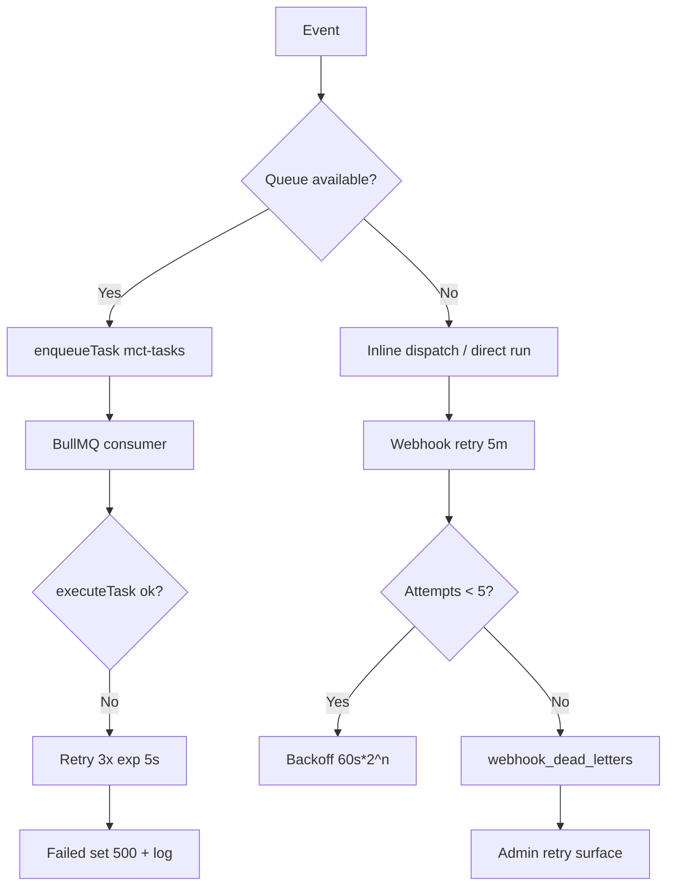

# Resilience, Recovery, and Failure Modes Audit

## Audit Metadata

- Audit name: repo-deep-dive
- Run: 20261002-0344-develop-6286137
- Repository: C:/temp/mainecybertech
- Branch: develop
- Commit SHA: 62861370 (6286137017c4b7c77e83ee420ec11382d984f263)
- Generated at: 2026-10-02T03:44Z
- Auditor: Principal repository auditor (fresh audit at HEAD; prior 75d3926 report used only as a regression checklist)
- Area code: RES
- Output path: docs/audits/repo-deep-dive/20261002-0344-develop-6286137/13_resilience_recovery_failure_modes.md
- Scope limitations:
  - AUDIT-ONLY. No application code, config, migration, or infra file was modified. Only this report was written.
  - No live failure injection, chaos run, load test, or production/Redis/Supabase access was performed. All statements are code-path and artifact analysis at the audited commit.
  - Redis/BullMQ runtime behaviour is analysed from source and tests; no live Redis was available in the audit environment, so queue claims are `supported` by code, not reproduced against a running broker.
  - Backup/restore was not executed. `db-restore-test.yml` evidence is configuration-only; the last real exercise is `not exercised` within this audit (see Verification Performed).
  - Secret values were never read or printed; only key names/paths are cited.

## Scope

Reviewed at commit 62861370 (branch `develop`):

- **API lifecycle:** `apps/api/src/main.ts` (startup probe, cache init, SIGTERM/SIGINT drain, `unhandledRejection`, `uncaughtException`), `apps/api/src/app.ts` (middleware order, `requestTimeout(30000)`).
- **Worker lifecycle:** `apps/worker/src/main.ts` (scheduling, `runScheduledTask`, scan lock), `apps/worker/src/shutdown.ts` (`inFlightTasks`/drain), `apps/worker/src/consumer-sqs.ts`, `apps/worker/src/consumer-bullmq.ts`, `apps/worker/src/producer.ts`, `apps/worker/src/schedule-config.ts`, `apps/worker/src/lib/scan-lock.ts`, `apps/worker/src/health-server.ts`.
- **Queue:** BullMQ producer/consumer (API + worker), job options (`attempts`, `backoff`, `removeOnComplete/Fail`), `QUEUE_BACKEND` selection and defaults.
- **Timeouts / retries / backoff / circuit breakers:** `apps/api/src/middleware/request-timeout.ts`, `apps/api/src/lib/circuit-breaker.ts`, `apps/api/src/lib/http-client.ts`, `apps/api/src/services/supabase.ts`, `apps/api/src/routes/health.ts`, `packages/sdk/src/client.ts`, `apps/worker/src/email.ts`, webhook fetch paths.
- **Idempotency:** `apps/api/src/middleware/idempotency.ts`, `apps/api/src/lib/idempotency.ts`, webhook idempotency keys.
- **Webhook recovery / DLQ:** `apps/api/src/lib/webhook-dispatcher.ts`, `apps/worker/src/tasks/webhook-dispatcher.ts`, `apps/worker/src/tasks/webhook-retry.ts`, `apps/worker/src/lib/ssrf-guard.ts`, `apps/api/src/lib/ssrf-guard.ts`.
- **Data hygiene & recovery tasks:** `apps/worker/src/tasks/retention.ts`, `orphan-cleanup.ts`, `public-interaction-retention.ts`, `apps/worker/src/tasks/index.ts`.
- **Migrations / backups / rollback:** `.github/workflows/supabase-migrations.yml`, `.github/workflows/db-backup.yml`, `.github/workflows/db-restore-test.yml`, `docs/SUPABASE_MIGRATION_WORKFLOW.md`, `docs/RTO_RPO.md`, `docs/ROLLBACK_PROCEDURES.md`, `docs/TROUBLESHOOTING.md`, `supabase/migrations/`.
- **Deploy / runtime failure behaviour:** `.github/workflows/deploy-do.yml`, `infra/digitalocean/docker-compose.yml`, `infra/digitalocean/prometheus.rules.yml`, `infra/digitalocean/prometheus.yml`, `apps/worker/Dockerfile`, root `docker-compose.yml`.
- **Tests:** worker `__tests__` (`schedule-config`, `scan-lock`, `orphan-cleanup`, `webhook-retry`, `ssrf-guard`, `main`), API `__tests__` (`circuit-breaker`, `http-client`, `idempotency`, `lib-idempotency`, `webhook-dead-letters`).

Not reviewed in depth (out of scope for this prompt; owned by other prompts): RLS/tenancy correctness (06/37), full API contract surface (08), full observability stack (14), container hardening (36), supply chain (11/35), all 127 migrations' content (07).

## Evidence Reviewed

| Evidence | Type | Why relevant | Notes |
| -------- | ---- | ------------ | ----- |
| `apps/api/src/main.ts` | Source | API shutdown/rejection behaviour | Verified: drain + 10s force exit; `unhandledRejection` log-and-continue (lines 73-75); `uncaughtException` → exit(1) |
| `apps/api/src/app.ts` | Source | Middleware wiring | `requestTimeout(30000)` at line 151; idempotency at 149; auth routers after |
| `apps/api/src/middleware/request-timeout.ts` | Source | Timeout control | Sends 408 only — does **not** abort the underlying handler |
| `apps/api/src/lib/circuit-breaker.ts` | Source | Breaker implementation | threshold 5 / success 2 / 30s; `Promise.race` + `op.catch` race-loss guard |
| `apps/api/src/services/supabase.ts` | Source | Breaker wiring | `circuitBreakingFetch` wraps admin + user-scoped clients; health uses no-breaker client |
| `apps/api/src/lib/http-client.ts` | Source | Outbound retry/breaker | `httpClients.{stripe,jsm,teams,geo}`; 10s default timeout, 3 retries, linear backoff |
| `apps/api/src/routes/public.ts` | Source | Raw outbound fetch | Turnstile `verifyCaptcha` raw `fetch` with no AbortController (line 30) |
| `apps/api/src/routes/auth.ts` | Source | Raw outbound fetch | Supabase token exchange + RPC raw `fetch` with no AbortController (lines 206, 234) |
| `apps/api/src/routes/health.ts` | Source | Health/readiness | DB + Stripe + JSM + Redis reported; Redis reported but never degrades status |
| `apps/api/src/lib/health.ts` | Source | Redis probe | 3s connect timeout, no reconnect strategy, one-shot |
| `apps/api/src/middleware/idempotency.ts` + `lib/idempotency.ts` | Source | Idempotency | Atomic `SET NX`, response replay, 24h TTL, scoped by owner+method+route |
| `apps/api/src/lib/webhook-dispatcher.ts` | Source | Inline dispatch | SSRF guard re-check, 10s AbortController, 3 attempts, idempotency key |
| `apps/worker/src/tasks/webhook-retry.ts` | Source | Retry + DLQ | MAX_RETRIES 5, 60s*2^n backoff, dead_letter writes, SSRF re-check |
| `apps/worker/src/tasks/webhook-dispatcher.ts` | Source | Queued dispatch | SSRF re-check, 10s AbortController, `redirect: manual` |
| `apps/worker/src/main.ts` | Source | Worker scheduling | 6 fixed intervals + 17 staggered scans via `schedule-config`; only `uncaughtException` handler |
| `apps/worker/src/schedule-config.ts` | Source | Scan configuration | 17 scans incl. `retention`, `orphan-cleanup`, `scheduled-notifications`; distinct offsets |
| `apps/worker/src/lib/scan-lock.ts` | Source | Multi-replica dedupe | Redis `SET NX PX` + Lua release; fail-open when Redis absent |
| `apps/worker/src/producer.ts` | Source | BullMQ producer | attempts 3, exp backoff 5s, removeOnComplete 100 / removeOnFail 500 |
| `apps/api/src/lib/task-producer.ts` | Source | BullMQ producer | Same options; never throws |
| `apps/worker/src/consumer-bullmq.ts` | Source | BullMQ consumer | `lockDuration = WORKER_TIMEOUT`; SIGTERM/SIGINT drain; no force-exit fallback |
| `apps/worker/src/consumer-sqs.ts` | Source | Inline/SQS path | `QUEUE_BACKEND` default `inline` waits forever; SQS retries by not deleting |
| `apps/worker/src/env.ts` | Source | Env schema | `QUEUE_BACKEND` default `"inline"`; superRefine requires REDIS_URL for bullmq |
| `apps/worker/src/health-server.ts` | Source | Worker health | 503 while draining; queue degraded still 200 |
| `apps/worker/src/shutdown.ts` | Source | Drain helper | Replaces (not appends) `inFlightTasks` set |
| `apps/worker/src/email.ts` | Source | Email failure behaviour | 3 attempts, 1s*2^n backoff, 10s connection/socket/greeting timeouts |
| `apps/worker/src/tasks/retention.ts` / `orphan-cleanup.ts` | Source | Hygiene tasks | retention uses service role; orphan-cleanup now uses `getSupabaseAdmin()` |
| `apps/worker/src/tasks/index.ts` | Source | Task registration | 23 handlers registered incl. `retention`, `orphan-cleanup` |
| `.github/workflows/deploy-do.yml` | CI config | Deploy health gate/rollback | 18×10s health loop, auto-rollback to `PREV_TAG`; worker health non-fatal |
| `.github/workflows/supabase-migrations.yml` | CI config | Migration failure behaviour | `supabase db push --include-all`; serialized by concurrency group; **no migrate-gate on dev** |
| `.github/workflows/db-restore-test.yml` | CI config | Restore verification | Weekly restore to temp PG; count check only |
| `.github/workflows/db-backup.yml` | CI config | Backup | Daily `pg_dump`; Slack alert on failure |
| `infra/digitalocean/prometheus.rules.yml` | Config | Alerts / dead-man's switch | `MCTServiceDown`, `MCTHighRequestErrorRate`, `Watchdog`; no external Alertmanager |
| `infra/digitalocean/docker-compose.yml` | Config | Prod runtime | `QUEUE_BACKEND: bullmq`; Redis password required; restart unless-stopped |
| `docker-compose.yml` (root) | Config | Dev runtime | Worker has **no** `QUEUE_BACKEND` → defaults to `inline` |
| `docs/RTO_RPO.md`, `docs/ROLLBACK_PROCEDURES.md`, `docs/TROUBLESHOOTING.md` | Docs | Recovery runbooks | RTO/RPO table; Docker/Supabase/Terraform rollback; worker section omits QUEUE_BACKEND |
| `AGENTS.md` (lines 255-285) | Docs | Claimed controls | Claims "Consumer: SQS-based" and "Graceful shutdown 10s drain" |

## Verification Performed

| Claim / item | Expected | Observed at 62861370 | Outcome |
| --- | --- | --- | --- |
| API `unhandledRejection` log-and-continue | Handler present, no exit | `apps/api/src/main.ts:73-75` logs and continues | supported |
| API graceful shutdown drains + force exit | SIGTERM/SIGINT + 10s force | `main.ts:51-67`; `setTimeout(...10_000).unref()` | supported |
| Worker `unhandledRejection` handler | Parity with API | Only `uncaughtException` at `apps/worker/src/main.ts:30`; no `unhandledRejection` listener (grep) | **unsupported** (still absent) |
| Prior RES-P2-001: retention/orphan-cleanup never scheduled | Fixed at HEAD | `schedule-config.ts:47-48` schedules both; `main.ts:123-149` iterates `scheduledScans` | supported (fixed) |
| Prior RES-P3-001: only first scan offset honored | Fixed at HEAD | `main.ts:142-148` applies `initialScanDelayMs(scan)` per scan; `schedule-config.ts` + `schedule-config.test.ts` assert distinct offsets | supported (fixed) |
| Prior RES-P3-002: Redis omitted from /health | Fixed at HEAD | `routes/health.ts:102-103` calls `checkRedisHealth`; reports but never degrades 200→503 | partially supported (reported, not liveness-affecting by design) |
| Prior RES-P3-003: worker SSRF re-check missing | Fixed at HEAD | `worker/src/tasks/webhook-dispatcher.ts:63`, `webhook-retry.ts:82` call `assertSafeUrl` | supported (fixed) |
| Prior RES-P3-005: orphan-cleanup used anon key | Fixed at HEAD | `orphan-cleanup.ts:9` uses `getSupabaseAdmin()` (service role) | supported (fixed) |
| Circuit breaker wired into Supabase | Breaker wraps client fetch | `services/supabase.ts:21-26,40,99` | supported |
| `QUEUE_BACKEND` default | Prior report said "bullmq" | `apps/worker/src/env.ts:11` default `"inline"`; prod compose sets `bullmq`; root compose does not | **unsupported** as stated previously; dev/prod divergence is real |
| `WORKER_TIMEOUT` wired to job execution | Abort/cancel long jobs | Only used as BullMQ `lockDuration` (`consumer-bullmq.ts:32`); not an AbortController for handler work | unsupported (timeout is advisory lock, not cancellation) |
| AGENTS.md "Consumer: SQS-based" | Accurate | Production uses BullMQ (`infra/.../docker-compose.yml:115`); SQS is a dormant option | unsupported (doc stale) |
| Deploy auto-rollback on failed health | Rollback to previous tag | `deploy-do.yml:454-477` health loop + `IMAGE_TAG="$PREV_TAG" up -d` | supported |
| Backup/restore exercised | Recent run with evidence | `db-restore-test.yml` weekly schedule exists; no run artifact captured in this audit | not reproducible / not exercised |
| Webhook retry lifecycle E2E | Retry → DLQ proof | `webhook-retry.test.ts` covers only "no deliveries" + query-failure; no lifecycle test | partially supported |
| Raw outbound fetch timeouts | AbortController on all external calls | `public.ts:30` (Turnstile), `auth.ts:206,234` (Supabase) have no AbortController | unsupported |

## Executive Summary

The resilience posture at 62861370 is **materially stronger** than the prior 75d3926 audit, and most of the previous P2/P3 findings are genuinely fixed rather than restated:

**Verified strengths**
- The API has a deliberate, documented lifecycle: non-fatal Redis probe and cache init, SIGTERM/SIGINT drain with a 10s force-exit, log-and-continue `unhandledRejection`, and exit-on-fatal `uncaughtException` (`apps/api/src/main.ts`).
- The scan scheduler was restructured into `apps/worker/src/schedule-config.ts`: **17 scans** now include `retention`, `orphan-cleanup`, and `scheduled-notifications` (previously dead code), each with its own honoured boot offset and a Redis distributed **scan lock** (`lib/scan-lock.ts`) so multiple replicas do not duplicate notifications. Unit tests assert distinct offsets and lock pass-through.
- Webhook reliability is the strongest path: both the API inline dispatcher and the worker dispatcher/retry apply the SSRF guard with `redirect: manual`, 10s AbortControllers, exponential backoff, a 5-attempt cap, and a `webhook_dead_letters` DLQ with an admin surface.
- Idempotency is genuinely correct now: atomic `SET NX` claim, response replay for retries, 409 for concurrent duplicates, and keys scoped by owner + method + route.
- The circuit breaker is wired into the Supabase admin **and** user-scoped clients (5 failures → open 30s → half-open), with a no-breaker client reserved for health probes so probes cannot wedge the API.
- Outbound HTTP to Stripe/JSM/Teams/geo is routed through `HttpClient` (timeout + retry + breaker) in billing and public routes.
- Deploy has a real health gate and auto-rollback to the previous image tag; migrations are serialized and prod-gated.

**Residual risks (this audit)**
1. **Worker has no `unhandledRejection` handler** — the exact asymmetry flagged at 75d3926 is still present. A stray rejection in a timer/scheduled path is not captured by Sentry and behaves differently from the API.
2. **`WORKER_TIMEOUT` is not a real timeout** — it is only BullMQ `lockDuration`. Long-running handlers are not aborted, and the codebase carries an acknowledged open item (`docs/CODE_REVIEW_2026-06-16.md`). Combined with a task registry that has **no generic task DLQ**, permanently expensive/stuck jobs are only visible as logs.
3. **Dev/prod queue divergence** — `QUEUE_BACKEND` defaults to `inline`; only the infra compose sets `bullmq`. A developer running the root `docker-compose.yml` gets a worker that consumes nothing, while the API (prod-gated on `NODE_ENV`) may still enqueue. This is a silent "jobs pile up" mode and contradicts `AGENTS.md`.
4. **Raw `fetch` without AbortController** in `public.ts` (Turnstile) and `auth.ts` (Supabase token/RPC) — bounded only by the 30s request-timeout middleware, which sends a 408 but does not abort the handler.
5. **Generic task jobs have no DLQ** — after 3 attempts the job sits in the failed set (bounded 500) with a log line only; there is no `task_dead_letters` equivalent to the webhook DLQ.
6. **Detector-in-domain gap** — the only availability detector is Prometheus inside the same droplet/compose stack; there is no external dead-man's switch, and the alert pipeline's "Watchdog" rule can only be validated by an Alertmanager that is deliberately not deployed.

**Recommended next actions:** add the worker `unhandledRejection` handler; make `WORKER_TIMEOUT` actually abort handler work (or document it as lock-only) and add a task DLQ; fix the `QUEUE_BACKEND` default/compose divergence; add AbortControllers to the two raw fetches; and stand up an external (off-droplet) health/dead-man's switch.

## Inventory

| Item | Path / symbol | Purpose | Current state | Risk | Notes |
| ---- | ------------- | ------- | ------------- | ---- | ----- |
| API shutdown | `apps/api/src/main.ts` `shutdown()` | SIGTERM/SIGINT drain + 10s force | Implemented | Low | `shutdownCache()` before `server.close` |
| API rejection handling | `apps/api/src/main.ts:73-75` | Log-and-continue | Implemented as claimed | Low | No `exit(1)` by design |
| API fatal handling | `apps/api/src/main.ts:77-80` | Exit on `uncaughtException` | Implemented | Low | — |
| Request timeout | `middleware/request-timeout.ts` (`app.ts:151`) | 30s cap | Implemented (soft) | Medium | Sends 408; does not abort handler |
| Cache | `middleware/cache.ts` | Redis + memory fallback | Implemented | Low | SCAN-based invalidation; mount-scoped keys |
| Circuit breaker | `lib/circuit-breaker.ts` + `services/supabase.ts` | Supabase fetch breaker | Implemented, wired | Low | Test-env bypass; no-breaker probe client |
| Outbound HttpClient | `lib/http-client.ts` | Retry + timeout + breaker | Implemented | Low | `stripe/jsm/teams/geo` presets; used in billing + public |
| Raw outbound fetch | `routes/public.ts:30`, `routes/auth.ts:206,234` | Turnstile / Supabase token+RPC | No AbortController | Medium | Bounded only by 30s middleware |
| Redis health probe | `lib/health.ts` + `routes/health.ts:102` | Redis health in /health | Implemented as reported-only | Low-Medium | Status reported; never degrades 200→503 |
| BullMQ producer (API) | `lib/task-producer.ts` | Enqueue tasks | Implemented | Low | Never throws; `NODE_ENV==="production"` default-enable |
| BullMQ producer (worker) | `src/producer.ts` | Enqueue scheduled tasks | Implemented | Low | Same options |
| BullMQ consumer | `src/consumer-bullmq.ts` | Execute jobs | Implemented (prod) | Low | `lockDuration=WORKER_TIMEOUT`; drain on signal; no force-exit |
| SQS/inline consumer | `src/consumer-sqs.ts` | Dormant / inline path | Present | Medium | `inline` blocks forever; SQS retries by not acking |
| Queue backend selection | `src/env.ts:11` | `QUEUE_BACKEND` | Default `inline` | Medium | Prod compose sets `bullmq`; root compose does not |
| Scan scheduler | `src/schedule-config.ts` + `main.ts` | 17 staggered scans | Implemented | Low | Distinct offsets; env-gated stripe; retentions scheduled |
| Scan lock | `src/lib/scan-lock.ts` | Multi-replica dedupe | Implemented | Low | Fail-open when Redis down (single-replica assumption) |
| Worker shutdown/drain | `src/shutdown.ts` + consumers | in-flight drain | Implemented | Low-Medium | No worker force-exit fallback; no `unhandledRejection` |
| Worker health | `src/health-server.ts` | Liveness + draining 503 | Implemented | Low | Queue degraded still 200 |
| Webhook dispatch/retry/DLQ | API + worker dispatchers, `webhook-retry.ts` | Delivery reliability | Implemented, strong | Low | SSRF re-check, redirect manual, 5 attempts, dead_letter |
| Idempotency | `middleware/idempotency.ts` + `lib/idempotency.ts` | Duplicate suppression | Implemented, correct | Low | Atomic claim + replay + scoped keys |
| Email | `src/email.ts` | SMTP send | Implemented | Low | 3 attempts, backoff, 10s timeouts; failures return false |
| Data hygiene tasks | `tasks/retention.ts`, `orphan-cleanup.ts`, `public-interaction-retention.ts` | PII/storage purge | Implemented + scheduled | Low | Service-role clients; orphan-cleanup fixed |
| Generic task DLQ | — | Failed-job persistence | Absent | Medium | Only BullMQ failed set (500) + log |
| Migrations | `.github/workflows/supabase-migrations.yml` | Schema apply | Implemented | Medium | Serialized; prod-gated via deploy-do; not gated on dev |
| Backup | `.github/workflows/db-backup.yml` + `scripts/backup-database.sh` | Daily pg_dump | Implemented | Medium | Slack alert on failure |
| Restore test | `.github/workflows/db-restore-test.yml` | Weekly restore | Implemented (config) | Medium | Count-only verification |
| Rollback | `docs/ROLLBACK_PROCEDURES.md` + deploy-do | App/DB/infra rollback | Implemented | Low | 3 DB options; state restore documented |
| Alerts / dead-man's switch | `infra/digitalocean/prometheus.rules.yml` | Availability alerts | Partial | Medium | In-stack only; no Alertmanager; Watchdog unrouted |
| Offline client | `apps/web/app/**/error.tsx`, `(portal)/error.tsx` | Client error boundaries | Implemented | Low | No offline/PWA data cache |

## Domain Scorecard

| Category | Score | Evidence | Gap | Recommended action |
| --- | ---: | --- | --- | --- |
| Timeouts | 3 | `requestTimeout(30000)` (`app.ts:151`); `HttpClient` 5-15s; webhook 10s AbortController; Redis probe 3s | `request-timeout` does not abort work; raw fetches in `public.ts`/`auth.ts` lack AbortController; `WORKER_TIMEOUT` is lock-only | Add AbortControllers to raw fetches; document/implement real handler cancellation |
| Retries/backoff | 4 | BullMQ 3 attempts + exp 5s; webhook 5 attempts 60s*2^n; `HttpClient` 3 retries; email 3 attempts | Generic tasks have no post-retry DLQ | Add `task_dead_letters` |
| Idempotency | 4 | Atomic `SET NX` claim, response replay, owner+method+route scoping, webhook keys | Worker queued dispatcher inserts no `idempotency_key` column | Add key to worker dispatcher inserts |
| Circuit breakers | 4 | Supabase admin+user clients; `HttpClient` presets for Stripe/JSM/Teams/geo; test-env bypass | Some worker/outbound paths and raw fetches are unbreakered | Extend breaker to worker outbound + raw fetches |
| Queue DLQ | 3 | Webhook `webhook_dead_letters` + admin surface; BullMQ failed set 500 | No generic task DLQ | Add task DLQ table + `failed` handler |
| Webhook recovery | 5 | SSRF re-check, redirect manual, 5-attempt exp backoff, DLQ, endpoint last_error/last_success_at | Lifecycle E2E test thin | Add retry→DLQ lifecycle test |
| Worker recovery | 3 | BullMQ failed/error handlers; drain; scan lock; in-flight set fixed | No `unhandledRejection`; no force-exit; no task DLQ | Add handler + force-exit + DLQ |
| Graceful shutdown | 4 | API drain + 10s force; worker drain + bull close; scan-lock close | Worker has no force-exit fallback; health server `unref`'d | Add worker force-exit timer |
| DB/Redis/API/email/file/realtime failure | 3 | Memory cache fallback; queue fallback to direct run; scanner tasks per-item error states; email retries | Turnstile/Supabase raw fetch hang risk; no alerting on email/SMTP failure; realtime not covered | Add AbortControllers; alert on email failure; document realtime failure |
| Offline client | 3 | Route-group `error.tsx`, `global-error.tsx`, retry buttons | No offline data cache/service worker for portal data | Document; consider PWA caching |
| Transactions | 2 | No cross-table transactions; bulk ops partial-success by design | Multi-write flows (write + notify + audit) fire-and-forget; scans update per-row | Document partial-write semantics; consider RPC transactions for key flows |
| Partial writes | 3 | Graceful degradation; cache invalidation; per-item error returns in scans | Scan batches and multi-insert flows are non-transactional | Acceptable; document guarantees |

## Detailed Review

### Item: API startup, unhandledRejection, graceful shutdown

- Evidence: `apps/api/src/main.ts` (lines 23-80), `apps/api/src/app.ts`.
- What it does: listens; probes Redis non-fatally; initialises cache non-fatally; drains on SIGTERM/SIGINT with a 10s force-exit; logs-and-continues `unhandledRejection`; exits(1) on `uncaughtException`.
- How it appears to work: Verified directly. Redis probe and cache init failures only log. `shutdownCache()` is called before `server.close()`. The 10s force timer is `.unref()`'d (fine — the server keeps the loop alive).
- Dependencies: Redis (optional), Supabase (optional at boot).
- Current controls: drain, 10s force, non-fatal dependency init, fatal-only exit policy.
- Missing controls: none significant for the API.
- Risks: Low.
- Recommended improvement: none.
- Suggested tests: assertion that SIGTERM closes the server and the cache is shut down (a `main` test exists but was not read to confirm shutdown coverage).
- Suggested docs: keep `AGENTS.md` accurate (it is for the API).

### Item: Worker scheduling and scan lock

- Evidence: `apps/worker/src/main.ts` (lines 37-149), `apps/worker/src/schedule-config.ts`, `apps/worker/src/lib/scan-lock.ts`, tests `schedule-config.test.ts`, `scan-lock.test.ts`.
- What it does: 6 fixed intervals (public-interaction-retention 24h, webhook-retry 5m, sla-log-check 1h, business-os-snapshot 24h, automation-run-check 1h, approval-overdue-check 1h) plus 17 `scheduledScans` (hourly/6h/daily) with per-scan boot offsets. `runScheduledTask` acquires a Redis lock, then enqueues; on queue unavailability it runs directly.
- How it appears to work: Verified. `retention`, `orphan-cleanup`, `scheduled-notifications` are now scheduled (previously dead). `initialScanDelayMs` is applied per scan. `withScanLock` fails open when Redis is absent (single-replica assumption documented). `offsetsAreDistinct()` is unit-tested.
- Dependencies: Redis (optional for lock/queue), Supabase.
- Current controls: distributed lock, distinct boot offsets, env gating (`requiresEnv`), direct-execution fallback.
- Missing controls: no guard against a *slow* prior run overlapping the next interval (interval-based, not completion-based); lock TTL is fixed at `min(interval-60s, 10min)`.
- Risks: Low-Medium (overlap for a scan slower than its lock TTL).
- Recommended improvement: skip a tick if the previous run for that scan has not completed (in-process guard), or make lock TTL explicit per scan.
- Suggested tests: overlap test — start a long fake scan and assert the next tick is skipped.
- Suggested docs: `AGENTS.md` worker section (currently says SQS-based).

### Item: Queue producer/consumer and backend selection

- Evidence: `apps/worker/src/producer.ts`, `apps/api/src/lib/task-producer.ts`, `apps/worker/src/consumer-bullmq.ts`, `apps/worker/src/consumer-sqs.ts`, `apps/worker/src/env.ts`, `infra/digitalocean/docker-compose.yml:115`, root `docker-compose.yml`.
- What it does: BullMQ `mct-tasks` queue; producers never throw; consumer default is `inline` unless `QUEUE_BACKEND` is set. Job options: attempts 3, exponential 5s, removeOnComplete 100, removeOnFail 500. `lockDuration = WORKER_TIMEOUT`.
- How it appears to work: In production compose, `QUEUE_BACKEND: bullmq` so the worker consumes. In the root dev compose the worker has no `QUEUE_BACKEND`, so it logs "Running in inline mode" and blocks forever consuming nothing — while the API's `isTaskQueueEnabled()` is prod-gated on `NODE_ENV`, so in dev it also won't enqueue by default (consistent, but the divergence is a footgun).
- Dependencies: Redis for BullMQ.
- Current controls: bounded retries, producer never throws, inline/SQS fallbacks.
- Missing controls: generic task DLQ; worker-side idempotency key; real handler timeout.
- Risks: Medium (dev/prod divergence; no DLQ).
- Recommended improvement: default `QUEUE_BACKEND` to `bullmq` in the schema (or fail fast), align the root compose; add a task DLQ.
- Suggested tests: env test asserting the chosen default and that `bullmq` without REDIS_URL is rejected (the superRefine exists); DLQ insert test.
- Suggested docs: `docs/TROUBLESHOOTING.md` worker section; `AGENTS.md`.

### Item: Webhook dispatch + retry + DLQ

- Evidence: `apps/api/src/lib/webhook-dispatcher.ts`, `apps/worker/src/tasks/webhook-dispatcher.ts`, `apps/worker/src/tasks/webhook-retry.ts`, `apps/worker/src/lib/ssrf-guard.ts`, `apps/api/src/lib/ssrf-guard.ts`, `apps/api/src/routes/webhook-management.ts`, tests `webhook-retry.test.ts`, `ssrf-guard.test.ts`.
- What it does: API dispatches via queue, else inline with retry + idempotency; worker dispatcher delivers queued; webhook-retry (5 min) retries failed deliveries up to 5 attempts with 60s*2^n backoff, then dead-letters. Blocked URLs and PII-stripped summaries are dead-lettered immediately.
- How it appears to work: Verified in source. SSRF guard is applied on both API and worker paths with `redirect: manual`. Endpoint `last_error`/`last_success_at`/`last_failure_at` maintained. `webhook_dead_letters` has an admin surface (`AGENTS.md:547-549`).
- Dependencies: Supabase, Redis (queue), DNS (for SSRF resolve).
- Current controls: strong (retry, backoff, DLQ, SSRF, signature, redirect guard).
- Missing controls: worker queued dispatcher inserts deliveries without an `idempotency_key` column value (API inline path sets it) — replay/duplicate dedup on the queued path relies on the retry task only.
- Risks: Low-Medium.
- Recommended improvement: set `idempotency_key` in the worker dispatcher insert so the queued and inline paths are consistent.
- Suggested tests: full lifecycle (fail → retry → dead-letter → admin retry) integration test.
- Suggested docs: `docs/modules/webhook-management.md`.

### Item: Idempotency

- Evidence: `apps/api/src/middleware/idempotency.ts`, `apps/api/src/lib/idempotency.ts`, tests `idempotency.test.ts`, `lib-idempotency.test.ts`, `webhook-dead-letters.test.ts`.
- What it does: On `Idempotency-Key`, atomically claims via `SET NX EX` (24h TTL), replays the first successful response on retry, returns 409 while in-flight, drops the key on non-2xx so retries can succeed. Keys scoped by owner + method + `baseUrl+path`.
- How it appears to work: Verified. In-memory fallback with a mutex when Redis is absent. Fails open on claim error (documented).
- Dependencies: Redis (optional).
- Current controls: strong.
- Missing controls: fail-open behaviour is intentional but means a Redis outage disables duplicate suppression.
- Risks: Low.
- Recommended improvement: none; document fail-open semantics.
- Suggested tests: concurrent duplicate → 409; replay returns original body; key scoped per owner.
- Suggested docs: `docs/API_RATE_LIMITING.md` or a new idempotency note.

### Item: Circuit breaker / outbound HTTP

- Evidence: `apps/api/src/lib/circuit-breaker.ts`, `apps/api/src/services/supabase.ts`, `apps/api/src/lib/http-client.ts`, `apps/api/src/lib/metrics.ts`, tests `circuit-breaker.test.ts`, `http-client.test.ts`.
- What it does: breaker (5 failures / 30s / 2 half-open successes) wraps Supabase fetch for admin + user clients; `HttpClient` provides timeout + retry + breaker; presets for Stripe/JSM/Teams/geo used in `billing.ts` and `public.ts`; breaker state exported to a Prometheus gauge.
- How it appears to work: Verified. `op.catch(()=>{})` prevents unhandled rejection when the race loses. Test env bypasses the breaker. Health probes use the no-breaker client.
- Dependencies: none beyond fetch.
- Current controls: strong on the wired paths.
- Missing controls: raw fetches (`public.ts:30` Turnstile, `auth.ts:206/234`) bypass `HttpClient`; worker outbound (module-tasks uptime/domain/phishing) uses `fetch` with AbortController but no breaker.
- Risks: Medium (raw fetch hang risk; worker egress unbreakered).
- Recommended improvement: route raw fetches through `httpClient`/presets; add a worker-side HttpClient/breaker for repeated outbound calls.
- Suggested tests: breaker wiring test asserting Supabase calls go through the breaker; raw-fetch timeout test.
- Suggested docs: `docs/MONITORING_AND_ALERTING.md` (breaker gauge).

### Item: Retry/DLQ for generic tasks

- Evidence: `apps/worker/src/producer.ts:43-48`, `apps/api/src/lib/task-producer.ts:50-55`, `apps/worker/src/consumer-bullmq.ts:36-41`, `apps/worker/src/task-registry.ts`.
- What it does: generic jobs retry 3× with exp backoff; on permanent failure the job stays in BullMQ's failed set (bounded 500) and logs `"BullMQ job failed permanently"`.
- How it appears to work: Verified. There is no `task_dead_letters` table and no `failed`-handler persistence.
- Dependencies: Redis.
- Current controls: bounded failed set + logs + metrics.
- Missing controls: actionable, queryable DLQ for generic tasks; no alert on repeated failures.
- Risks: Medium (silent repeated failures for scheduled scans).
- Recommended improvement: add `task_dead_letters` (type, payload, error, attempts, last_attempt_at) written from the `failed` handler; surface count in `/metrics`.
- Suggested tests: permanently failing handler → DLQ row.
- Suggested docs: `docs/MONITORING_AND_ALERTING.md`.

### Item: Data hygiene / retention

- Evidence: `apps/worker/src/tasks/retention.ts`, `orphan-cleanup.ts`, `public-interaction-retention.ts`, `apps/worker/src/tasks/index.ts`, `schedule-config.ts`.
- What it does: `retention` purges `audit_logs` >365d and `notifications` >90d (service role); `orphan-cleanup` removes unreferenced storage objects (service role, fixed); `public-interaction-retention` purges `public_interactions` >90d.
- How it appears to work: All three are now scheduled (`retention` daily, `orphan-cleanup` 6-hourly, `public-interaction-retention` daily). Retention uses per-call Supabase client with service role; orphan-cleanup uses the shared admin client.
- Dependencies: Supabase service role.
- Current controls: scheduled, service-role, per-item logging.
- Missing controls: no dry-run/limit and no verification that row counts shrank; orphan-cleanup lists only 1000 objects per bucket (large buckets partially cleaned).
- Risks: Low-Medium (partial cleanup at scale).
- Recommended improvement: paginate storage listing; add a count assertion/log.
- Suggested tests: seeded rows are purged; storage listing paginates.
- Suggested docs: `docs/features/data-retention-policy-manager.md`.

### Item: Migrations, backups, rollback

- Evidence: `.github/workflows/supabase-migrations.yml`, `.github/workflows/db-backup.yml`, `.github/workflows/db-restore-test.yml`, `docs/SUPABASE_MIGRATION_WORKFLOW.md`, `docs/ROLLBACK_PROCEDURES.md`, `docs/RTO_RPO.md`, `supabase/migrations/`.
- What it does: migration workflow runs `supabase db push --include-all`, serialized by a concurrency group, environment `prod` on `main` else `dev`; deploy-do gates prod behind `migrate-gate` but skips it on dev. Daily `pg_dump` to S3 with Slack failure alert. Weekly restore test into a temp PostgreSQL.
- How it appears to work: Migration failure fails the workflow; on prod the deploy is blocked because `deploy` uses `!failure()`. On dev, `migrate-gate` is skipped, so app deploy is not blocked by a migration failure — but the migration workflow still fails loudly. No automatic DB rollback exists; rollback is manual (reverse migration / PITR / SQL), documented in three options.
- Dependencies: Supabase CLI 2.107.0, GH secrets, S3, DO Spaces.
- Current controls: serialized migrations, prod gate, daily backup, weekly restore test, documented rollback.
- Missing controls: no `down`/reverse migration automation; restore test checks only table counts (no row/constraint validation); no captured evidence of the last real restore run.
- Risks: Medium (recovery is manual and un-exercised in-audit).
- Recommended improvement: add a row-count/checksum sample to the restore test; record last restore date in `docs/RTO_RPO.md`.
- Suggested tests: restore test asserting a known table's row count / FK integrity.
- Suggested docs: `docs/SUPABASE_MIGRATION_WORKFLOW.md` (failure/rollback section).

### Item: Alerts / dead-man's switch

- Evidence: `infra/digitalocean/prometheus.rules.yml`, `infra/digitalocean/prometheus.yml`, `infra/digitalocean/docker-compose.yml` (Prometheus inside the stack).
- What it does: Prometheus scrapes API and worker `/metrics` every 15s; rules for service-down, 5xx rate, and a daily Watchdog.
- How it appears to work: Prometheus runs inside the same compose stack/droplet as the services it monitors. The file itself notes an Alertmanager is required for delivery and that Watchdog "is used to validate the alert path".
- Dependencies: Alertmanager (not present).
- Current controls: in-stack rules.
- Missing controls: **external** dead-man's switch; routed alert delivery; queue-depth alert.
- Risks: Medium (detector lives inside the failed domain).
- Recommended improvement: route alerts to an external receiver (PagerDuty/Slack/uptime service) and add an off-droplet HTTP check of `/health`.
- Suggested tests: fire a synthetic down and confirm delivery.
- Suggested docs: `docs/MONITORING_AND_ALERTING.md`.

### Item: Offline client / partial writes

- Evidence: `apps/web/app/(admin|portal|public)/error.tsx`, `apps/web/app/global-error.tsx`, `apps/api/src/lib/notify.ts`, `apps/worker/src/tasks/module-tasks.ts` (per-item `ok:false`).
- What it does: route-group error boundaries + global error; mutations degrade gracefully; scans return per-item errors and continue.
- How it appears to work: Verified error boundaries exist; `createNotification` is best-effort (logs on failure); scans catch and report per item.
- Dependencies: n/a.
- Current controls: error boundaries, graceful degradation.
- Missing controls: no offline cache/service worker for portal data; multi-write flows (write + notify + audit) are not transactional.
- Risks: Low-Medium.
- Recommended improvement: document partial-write semantics; consider an RPC/transaction wrapper for the highest-value multi-write flows.
- Suggested tests: force notification failure and assert the primary write still succeeds and is observable.
- Suggested docs: `docs/API_ERROR_HANDLING.md`.

## Scenario / Control Matrix

| ID | Scenario or control | Evidence | Current control | Gap | Severity | Recommendation |
| --- | --- | --- | --- | --- | --- | --- |
| RES-001 | Timeouts | `app.ts:151`, `request-timeout.ts`, `http-client.ts`, webhook AbortControllers | 30s request cap; 5-15s outbound; 10s webhook; 3s Redis probe | Soft 408 doesn't abort; raw fetches lack AbortController | P2 | AbortController on raw fetches; real handler cancellation |
| RES-002 | Retries/backoff | BullMQ 3 + exp 5s; webhook 5 + 60s*2^n; HttpClient 3; email 3 | Solid multi-layer | No generic task DLQ | P2 | Add `task_dead_letters` |
| RES-003 | Idempotency | `middleware/idempotency.ts`, `lib/idempotency.ts` | Atomic claim + replay + scoped keys | Worker queued dispatcher omits `idempotency_key` | P3 | Add key to worker dispatcher insert |
| RES-004 | Circuit breakers | `services/supabase.ts`, `http-client.ts` | Supabase admin+user; Stripe/JSM/Teams/geo presets | Raw fetches unbreakered; worker egress unbreakered | P3 | Extend breaker |
| RES-005 | Queue DLQ | `webhook_dead_letters`; BullMQ failed set | Webhook-specific DLQ | Generic tasks | P2 | Task DLQ + alert |
| RES-006 | Webhook recovery | `webhook-retry.ts`, worker dispatcher | 5 attempts + DLQ + SSRF + redirect manual | Lifecycle E2E thin | P3 | Add lifecycle test |
| RES-007 | Worker recovery | `consumer-bullmq.ts`, `shutdown.ts` | failed/error handlers; in-flight drain; scan lock | No `unhandledRejection`; no force-exit; no DLQ | P2 | Add handler + force-exit + DLQ |
| RES-008 | Graceful shutdown | `main.ts` API; `consumer-*.ts` worker | API drain+10s; worker drain+bull close | Worker no force-exit fallback | P3 | Add worker force-exit timer |
| RES-009 | DB/Redis/API/email/file failure | cache fallback, queue fallback, /health, email retries | Degradation paths present | Raw fetch hang; no email-failure alert; realtime not covered | P2 | AbortControllers + email alert |
| RES-010 | Offline client | `apps/web/app/**/error.tsx` | Error boundaries | No offline data cache | P3 | Document; consider PWA |
| RES-011 | Transactions | bulk partial-success by design | Documented behaviour | Multi-write flows non-transactional | P3 | Document; RPC for key flows |
| RES-012 | Partial writes | scans per-item, cache invalidation | Graceful | Scan batches non-transactional | P3 | Acceptable; document |
| RES-013 | Queue backend default | `env.ts:11`, root compose vs infra compose | Prod `bullmq` | Dev defaults to `inline` (worker consumes nothing) | P2 | Align default/compose |
| RES-014 | Worker task timeout | `consumer-bullmq.ts:32` | `lockDuration=WORKER_TIMEOUT` | Not a real cancellation | P2 | AbortController or document lock-only |
| RES-015 | Dead-man's switch | `prometheus.rules.yml` (in-stack) | In-stack alerts | No external detector/Alertmanager | P2 | Off-droplet check + alert routing |
| RES-016 | Backup/restore exercise | `db-restore-test.yml`, `db-backup.yml` | Weekly restore test; daily backup | Only count check; last run not evidenced | P2 | Row/constraint assertions; record last run |
| RES-017 | Migration failure on dev | `deploy-do.yml` gates | Prod migrate-gate; dev skipped | Dev deploy not blocked by migration failure | P3 | Document; optionally gate dev |
| RES-018 | Scan overlap | interval-based scheduling | Distinct offsets + lock TTL | Slow scan can overlap next tick | P3 | In-process overlap guard |
| RES-019 | Orphan-cleanup pagination | `orphan-cleanup.ts` (list limit 1000) | Service-role cleanup | Only first 1000 objects per bucket | P3 | Paginate listing |
| RES-020 | Deploy rollback | `deploy-do.yml:454-477` | Health gate + auto-rollback | Worker health non-fatal in deploy check | P3 | Make worker health blocking when queue enabled |

## Findings

### Finding ID: RES-P2-001 - Worker process has no `unhandledRejection` handler

- Severity: P2
- Confidence: High
- Area: Resilience / Worker
- Evidence:
  - `apps/worker/src/main.ts` — only `process.on("uncaughtException", ...)` at line 30; no `unhandledRejection` listener.
  - `apps/api/src/main.ts` — lines 73-75 implement the log-and-continue model the worker lacks.
  - Repo-wide grep for `unhandledRejection` returns only the API `main.ts` match.
- What is happening: Any rejected promise in a worker path not covered by `.catch` (for example a metric promise, a timer callback, or a future scheduled handler) is not routed to Sentry and follows Node's default behaviour for the running Node version instead of the API's deliberate log-and-continue policy. This is the same asymmetry flagged in the 75d3926 audit (prior RES-P3-004) and is **still open**.
- Why it matters: The worker drives scans, webhook retry, retention, and notification email. An unhandled rejection can silently drop scheduled work or (on older Node semantics) terminate the process, and it is invisible in Sentry/logs, so it cannot be triaged.
- User / business impact: Missed scans, missed webhook retries and notifications, harder incident diagnosis.
- Security / privacy / reliability impact: Reliability/observability; no direct security impact.
- Recommended fix: Add `process.on("unhandledRejection", (reason) => { logger.error({ err: reason }, "Unhandled promise rejection — continuing"); Sentry.captureException(reason); })` in `apps/worker/src/main.ts`, mirroring the API.
- Suggested validation: Unit test firing a rejected promise and asserting the handler logs/captures and the process does not exit; confirm Sentry event emission in a test double.
- Owner suggestion: Implementation agent.
- Effort estimate: S
- Dependencies: None.
- Status: open (carried from prior RES-P3-004 at 75d3926)
- Endpoint / data path: none (process-level)
- Attack path: none identified

### Finding ID: RES-P2-002 - `WORKER_TIMEOUT` is not a real task timeout; generic task failures have no DLQ

- Severity: P2
- Confidence: High
- Area: Resilience / Worker
- Evidence:
  - `apps/worker/src/consumer-bullmq.ts:32` — `lockDuration: env.WORKER_TIMEOUT` is the only use of the value.
  - `apps/worker/src/env.ts:10` — `WORKER_TIMEOUT` default 30000, documented as "Job timeout in ms" in `docs/ENVIRONMENT_VARIABLES.md:91`.
  - `apps/worker/src/consumer-bullmq.ts:36-41` — the `failed` handler only logs `"BullMQ job failed permanently"`.
  - `apps/worker/src/producer.ts:43-48` / `apps/api/src/lib/task-producer.ts:50-55` — `attempts: 3`, `removeOnFail: 500`; no persistent dead-letter record.
  - `docs/CODE_REVIEW_2026-06-16.md:499,721` — acknowledges "Task timeout (WORKER_TIMEOUT) doesn't cancel the actual task".
- What is happening: `WORKER_TIMEOUT` sets BullMQ's lock duration, so a handler that runs longer does not get aborted — BullMQ may consider the lock stale and re-deliver the job, which can cause duplicate work rather than cancellation. Separately, after 3 failed attempts a generic task is only logged; there is no queryable `task_dead_letters` table equivalent to `webhook_dead_letters`.
- Why it matters: Long or stuck scan handlers can be re-run concurrently (duplicate notifications/emails) and then disappear into a bounded failed set; operators have no durable surface to see or replay permanently failed scheduled work.
- User / business impact: Duplicate notification emails / repeated external calls; silent permanent failures of scans; no replay path.
- Security / privacy / reliability impact: Reliability; potential duplicate outbound email/API calls.
- Recommended fix: Either (a) pass an `AbortSignal` into handlers so `WORKER_TIMEOUT` can cancel work, or clearly document it as lock-only and add per-handler internal timeouts; and (b) add a `task_dead_letters` table (type, payload, error, attempts, last_attempt_at) written from the consumer `failed` handler, with a `/metrics` counter.
- Suggested validation: Test a handler that exceeds the timeout and assert the documented behaviour (aborted vs lock-renewed); test that a permanently failing handler writes a DLQ row.
- Owner suggestion: Implementation agent + platform engineer (schema).
- Effort estimate: M
- Dependencies: Migration for `task_dead_letters` (optional — reuse a JSONB table).
- Status: open
- Endpoint / data path: BullMQ `mct-tasks` → `consumer-bullmq.ts` → `executeTask` → task handler
- Attack path: none identified

### Finding ID: RES-P2-003 - `QUEUE_BACKEND` default `inline` diverges from production and can silently stall all queued work

- Severity: P2
- Confidence: High
- Area: Resilience / Configuration
- Evidence:
  - `apps/worker/src/env.ts:11` — `QUEUE_BACKEND: z.enum(["bullmq","sqs","inline"]).default("inline")`.
  - `apps/worker/src/consumer-sqs.ts:89-93` — `inline` logs and then `await new Promise(() => {})` (consumes nothing).
  - `infra/digitalocean/docker-compose.yml:115` — production sets `QUEUE_BACKEND: bullmq`.
  - root `docker-compose.yml:38-54` — the worker service sets only `NODE_ENV`/`HEALTH_PORT`, so it defaults to `inline`.
  - `AGENTS.md:276` — claims the consumer is "SQS-based" (also stale).
- What is happening: The schema default is `inline`, but only the production compose pins `bullmq`. Anyone running the root compose (or any environment that forgets the variable) gets a worker that starts, reports healthy, and processes nothing, while the API may still enqueue depending on `NODE_ENV`/`TASK_QUEUE_ENABLED`. This is a silent "jobs accumulate" failure mode.
- Why it matters: A misconfigured deployment looks healthy but does no asynchronous work (scans, webhook delivery, notifications), which is hard to detect because worker `/health` returns 200 regardless of the backend.
- User / business impact: Webhooks delayed/undelivered, notifications and scans silently stopped.
- Security / privacy / reliability impact: Reliability; missed webhook deliveries and data-hygiene tasks.
- Recommended fix: Default `QUEUE_BACKEND` to `bullmq` (fail fast when `REDIS_URL` is missing — the superRefine already enforces this for `bullmq`), and set `QUEUE_BACKEND: bullmq` in the root compose worker; update `AGENTS.md`.
- Suggested validation: Env test asserting the default; integration test that a `bullmq` worker with a queue actually consumes a job; health response that surfaces the active backend.
- Owner suggestion: Implementation agent.
- Effort estimate: S
- Dependencies: None.
- Status: open
- Endpoint / data path: Worker startup → `runWorkerTasks()` → `env.QUEUE_BACKEND`
- Attack path: none identified

### Finding ID: RES-P2-004 - External `fetch` calls without `AbortController` in `public.ts` and `auth.ts`

- Severity: P2
- Confidence: High
- Area: Resilience / Timeouts
- Evidence:
  - `apps/api/src/routes/public.ts:30` — `await fetch("https://challenges.cloudflare.com/turnstile/v0/siteverify", {...})` with no signal/timeout.
  - `apps/api/src/routes/auth.ts:206-216` — Supabase token-exchange `fetch` with no signal/timeout.
  - `apps/api/src/routes/auth.ts:234-239` — Supabase RPC `bootstrap_portal_access` `fetch` with no signal/timeout.
  - `apps/api/src/middleware/request-timeout.ts` — sends a 408 but does not abort the handler.
- What is happening: These external calls rely solely on the global 30s request-timeout middleware for bounding. That middleware returns 408 to the client but leaves the upstream `fetch` running, so a slow/hung Cloudflare or Supabase endpoint holds the request handler, socket, and (for the circuit-breaker-wrapped Supabase client paths) does not interact with the breaker at all because these use raw `fetch`.
- Why it matters: A hung third-party response consumes server resources past the client-visible timeout and bypasses the breaker, unlike the rest of the codebase which uses `AbortController` and/or `HttpClient`.
- User / business impact: Login/callback and public form submissions can hang; resource pressure under third-party degradation.
- Security / privacy / reliability impact: Reliability/availability.
- Recommended fix: Route these through `httpClient`/`httpClients` presets (which apply timeout + retry + breaker) or add explicit `AbortController` with a short timeout and clear the timer in a `finally`.
- Suggested validation: Test with a mocked fetch that never resolves and assert the call aborts within the configured timeout.
- Owner suggestion: Implementation agent.
- Effort estimate: S
- Dependencies: None.
- Status: open
- Endpoint / data path: `POST /api/v1/public/submit` → `verifyCaptcha`; `POST /api/v1/auth/callback` → Supabase token exchange + RPC
- Attack path: none identified

### Finding ID: RES-P2-005 - Availability detection lives inside the failed domain; no external dead-man's switch or alert delivery

- Severity: P2
- Confidence: High
- Area: Resilience / Observability
- Evidence:
  - `infra/digitalocean/prometheus.rules.yml:1-40` — `MCTServiceDown`, `MCTHighRequestErrorRate`, `Watchdog`; header comment states an Alertmanager is required for delivery.
  - `infra/digitalocean/docker-compose.yml:164-184` — Prometheus runs inside the same compose stack as the API/worker it monitors.
  - `infra/digitalocean/prometheus.yml:11-24` — scrapes API and worker on the internal network.
- What is happening: The detector (Prometheus) runs inside the very stack/droplet whose failure it is meant to detect, and no Alertmanager/receiver is deployed, so the rules fire into nothing. The `Watchdog` rule is explicitly "used to validate the alert path" but that path is not wired to a receiver in-repo.
- Why it matters: Per the prompt's extended checks, when a detector lives inside the failed domain an external dead-man's switch is required. A whole-droplet outage (disk full, kernel panic, network) produces no alert.
- User / business impact: Outages go unnoticed until users report them, extending MTTR beyond the 15-minute RTO target.
- Security / privacy / reliability impact: Reliability/incident readiness.
- Recommended fix: Add an off-droplet check (external uptime service or scheduled CI job hitting `https://<api>/health` and `https://<app>/login`) and route Prometheus alerts to a real receiver (Slack/PagerDuty) with an external Watchdog expectation.
- Suggested validation: Scheduled workflow asserting `/health` returns 200 from outside the droplet; synthetic alert firing reaching the receiver.
- Owner suggestion: Platform engineer.
- Effort estimate: S-M
- Dependencies: External receiver credentials (secret).
- Status: open
- Endpoint / data path: `GET /health`, `GET /metrics`
- Attack path: none identified

### Finding ID: RES-P2-006 - Backup/restore recovery is configured but not evidenced as exercised, and the restore test verifies only table counts

- Severity: P2
- Confidence: High
- Area: Resilience / Recovery
- Evidence:
  - `.github/workflows/db-restore-test.yml:51-57` — "Verify database integrity" only counts `information_schema.tables`; there is no row-count, constraint, or application-level check.
  - `.github/workflows/db-backup.yml:1-28` — daily `pg_dump` with a Slack failure alert.
  - `docs/RTO_RPO.md:5-24` — RTO/RPO targets and backup strategy, but no "last verified" date.
- What is happening: A weekly restore test workflow exists (good), but it validates only that tables were created, not that data is usable; and this audit found no run artifact recording a successful real restore. Per the shared rules, this counts as `not exercised` with the last exercise date `Unknown`.
- Why it matters: A restore that recreates schema but loses/garbles data would still pass the current check, giving false confidence in the documented 5-minute RPO / 1-hour RTO.
- User / business impact: A real disaster could exceed RTO/RPO without anyone having validated the recovery path.
- Security / privacy / reliability impact: Reliability/data-recovery confidence.
- Recommended fix: Extend the restore test to assert a known row count and a referential-integrity sample; record the last successful restore date and log link in `docs/RTO_RPO.md`.
- Suggested validation: Restore test failing when a seeded table's row count is altered/absent; run once and attach evidence.
- Owner suggestion: Platform engineer.
- Effort estimate: S-M
- Dependencies: Access to backup bucket (secret).
- Status: open
- Endpoint / data path: S3 backup → temp PostgreSQL → restore verification
- Attack path: none identified

### Finding ID: RES-P3-001 - Worker graceful shutdown has no force-exit fallback

- Severity: P3
- Confidence: High
- Area: Resilience / Shutdown
- Evidence:
  - `apps/worker/src/consumer-bullmq.ts:56-66` — waits on `bullWorker.close()` + `drainInFlight()`; no timeout/force exit.
  - `apps/api/src/main.ts:59-63` — API has a 10s force-exit; the worker does not.
  - `apps/worker/src/consumer-sqs.ts:110-145` — SQS path sets `markShuttingDown` and drains; no force exit either.
- What is happening: If a worker task hangs during drain, the worker never exits; container stop relies on Docker's default SIGKILL timeout (10s in most setups) rather than an application-controlled force exit.
- Why it matters: An unresponsive drain delays deploys/restarts and can leave the container in a repeated force-kill cycle; parity with the API's controlled 10s force-exit is missing.
- User / business impact: Slower/rougher deploys; restart loops during incidents.
- Security / privacy / reliability impact: Reliability.
- Recommended fix: Add a `setTimeout(() => { logger.error("Forced worker shutdown"); process.exit(1); }, 10_000).unref()` after initiating drain, mirroring the API.
- Suggested validation: Test with a deliberately hanging task asserting the process exits within the window.
- Owner suggestion: Implementation agent.
- Effort estimate: S
- Dependencies: None.
- Status: open
- Endpoint / data path: none (process-level)
- Attack path: none identified

### Finding ID: RES-P3-002 - Worker queued webhook dispatcher inserts deliveries without an idempotency key

- Severity: P3
- Confidence: High
- Area: Resilience / Idempotency
- Evidence:
  - `apps/worker/src/tasks/webhook-dispatcher.ts:114-127` — insert has `retry_count`/`next_retry_at` but no `idempotency_key` column.
  - `apps/api/src/lib/webhook-dispatcher.ts:139,179` — the inline API path computes and stores `idempotency_key`.
- What is happening: The queue-native delivery path does not record an idempotency key, unlike the inline fallback path, so dedup semantics differ by route. If the same event is delivered via queue retries, there is no key to correlate duplicates.
- Why it matters: Inconsistent dedup between the two dispatch paths weakens the otherwise strong webhook idempotency story.
- User / business impact: Rare duplicate webhook deliveries to customers on the queued path.
- Security / privacy / reliability impact: Low; correctness.
- Recommended fix: Compute and store an `idempotency_key` in the worker dispatcher insert, matching the API inline path.
- Suggested validation: Test asserting both paths write the same-shaped row including `idempotency_key`.
- Owner suggestion: Implementation agent.
- Effort estimate: S
- Dependencies: None.
- Status: open
- Endpoint / data path: event → `enqueueTask("webhook-dispatcher")` → worker dispatcher → `webhook_deliveries`
- Attack path: none identified

### Finding ID: RES-P3-003 - `AGENTS.md` documents the worker consumer incorrectly and omits the queue backend divergence

- Severity: P3
- Confidence: High
- Area: Resilience / Documentation
- Evidence:
  - `AGENTS.md:274-279` — "Worker (142 lines)" / "Consumer: SQS-based (`runWorkerTasks` from `consumer-sqs.ts`)" / graceful shutdown note.
  - `infra/digitalocean/docker-compose.yml:115` — production uses `QUEUE_BACKEND: bullmq`.
  - `apps/worker/src/consumer-sqs.ts:83-87` — bullmq imports `consumer-bullmq.ts`.
- What is happening: `AGENTS.md` describes the worker as SQS-based, which is the dormant path; production is BullMQ. It also does not mention the `inline` default risk.
- Why it matters: Operators and future AI agents using `AGENTS.md` as the source of truth will misunderstand the queue topology and may mis-diagnose "worker healthy but no jobs processed".
- User / business impact: Slower incident diagnosis; wrong remediation.
- Security / privacy / reliability impact: Operational/documentation risk.
- Recommended fix: Update the worker section to describe BullMQ as the production consumer, SQS/inline as alternates, and note the `QUEUE_BACKEND` default.
- Suggested validation: Doc review; cross-link to `docs/ENVIRONMENT_VARIABLES.md`.
- Owner suggestion: Documentation owner.
- Effort estimate: S
- Dependencies: RES-P2-003 (fix default first).
- Status: open
- Endpoint / data path: none
- Attack path: none identified

### Finding ID: RES-P3-004 - Deploy health gate treats worker unhealthiness as non-fatal

- Severity: P3
- Confidence: High
- Area: Resilience / Deployment
- Evidence:
  - `.github/workflows/deploy-do.yml:515-522` — worker health check failure logs "Warning: Worker health check returned HTTP ... (non-fatal — worker is restart-loop tolerant)".
  - `apps/worker/src/health-server.ts:10-31` — worker `/health` returns 503 only when shutting down; queue degraded is still 200.
- What is happening: The deploy's post-deploy gate requires API and web health but explicitly tolerates a failing worker. Combined with the fact that worker `/health` does not reflect a broken queue backend unless the process is draining, a worker that is up but not consuming can pass.
- Why it matters: A deploy can "succeed" with a non-functional worker, silently stalling all async work.
- User / business impact: Delayed webhooks/notifications/scans after a deploy, discovered late.
- Security / privacy / reliability impact: Reliability/incorrect release confidence.
- Recommended fix: When `QUEUE_BACKEND=bullmq`, make the worker health check blocking in deploy, and have `/health` return 503 (or a distinct `degraded` that the gate reads) when the queue is disconnected.
- Suggested validation: Deploy dry-run with a worker whose REDIS_URL is wrong; assert the gate fails.
- Owner suggestion: Platform engineer.
- Effort estimate: S-M
- Dependencies: RES-P2-003.
- Status: open
- Endpoint / data path: `GET http://worker:3001/health` during deploy
- Attack path: none identified

### Finding ID: RES-P3-005 - Orphan cleanup lists at most 1000 objects per bucket and cannot verify the purge shrank anything

- Severity: P3
- Confidence: High
- Area: Resilience / Data hygiene
- Evidence:
  - `apps/worker/src/tasks/orphan-cleanup.ts:15-17` — `.list("", { limit: 1000 })`.
  - `apps/worker/src/tasks/orphan-cleanup.ts:80-81` — logs `totalRemoved` but the task always returns `{ ok: true }` even when removals fail.
- What is happening: Buckets larger than 1000 objects are only partially scanned per run (the task runs 6-hourly, so it may eventually catch up, but there is no pagination and no guarantee), and the task reports success regardless of per-bucket removal errors.
- Why it matters: The hygiene task can appear healthy while leaving storage growth effectively unbounded, contradicting its purpose.
- User / business impact: Storage cost creep; stale files retained.
- Security / privacy / reliability impact: Low; cost/hygiene.
- Recommended fix: Paginate `storage.list`; return `{ ok: false }` when any bucket's removal fails, or at least emit a metric.
- Suggested validation: Test with a mocked listing that returns exactly 1000 and a second page; assert pagination and non-`ok` on removal failure.
- Owner suggestion: Implementation agent.
- Effort estimate: S
- Dependencies: None.
- Status: open
- Endpoint / data path: worker `orphan-cleanup` → Supabase storage `documents`/`avatars`
- Attack path: none identified

## Risks

| Risk | Severity | Likelihood | Impact | Evidence | Mitigation |
| --- | --- | --- | --- | --- | --- |
| Worker jobs permanently fail with no DLQ/replay | P2 | Medium | Silent loss of scans/notifications | `consumer-bullmq.ts:36-41`, no `task_dead_letters` | Add task DLQ + alert |
| Worker restarts/duplicate runs from a non-cancelling timeout | P2 | Medium | Duplicate emails/external calls | `consumer-bullmq.ts:32` lock-only timeout | Real cancellation or documented lock-only |
| Worker consumes nothing (`inline` default) in a misconfigured environment | P2 | Medium | All async work stalls silently | `env.ts:11`, root compose | Align default/compose; health surfacing |
| Hung third-party calls beyond client timeout | P2 | Low-Medium | Resource pressure, 408 with lingering work | `public.ts:30`, `auth.ts:206/234` | AbortController / HttpClient |
| Whole-droplet outage undetected | P2 | Medium | Extended MTTR vs 15-min RTO | In-stack Prometheus, no Alertmanager | External dead-man's switch |
| Restore path unvalidated for data integrity | P2 | Medium | Disaster recovery over-promises | `db-restore-test.yml:51-57` | Stronger restore assertions + evidence |
| Stray worker rejection silently swallowed/terminating | P2 | Low | Dropped scheduled work | No `unhandledRejection` handler | Add handler (RES-P2-001) |
| Deploy passes with dead worker | P3 | Medium | Post-deploy silent stall | `deploy-do.yml:515-522` | Blocking worker gate |
| Storage orphan accumulation | P3 | Medium | Cost creep | `orphan-cleanup.ts:15-17` | Paginate + failure metric |
| Duplicate webhook delivery on queued path | P3 | Low | Customer noise | Missing `idempotency_key` in worker dispatcher | Add key |
| Slow drain delays deploy/restart | P3 | Low | Restart roughness | No worker force-exit | Add 10s force-exit |
| Scan overlap on slow scans | P3 | Low | Duplicate work | Interval scheduling + fixed lock TTL | In-process overlap guard |

## Recommendations

### Immediate / Release Blocking

None. There are no P0/P1 findings at 62861370. The item closest to release-relevant is RES-P2-003 (worker `QUEUE_BACKEND` default), because a single misconfigured environment silently halts all async work; recommend fixing it in the same change as the `AGENTS.md` correction before the next production deploy.

### This Week

1. Add the worker `unhandledRejection` handler (RES-P2-001).
2. Change `QUEUE_BACKEND` default to `bullmq` (or fail-fast) and align the root compose; update `AGENTS.md` (RES-P2-003, RES-P3-003).
3. Add `AbortController` timeouts to the raw fetches in `public.ts` and `auth.ts` (RES-P2-004).
4. Decide `WORKER_TIMEOUT` semantics and document it; add the `task_dead_letters` table + `failed`-handler write (RES-P2-002).

### This Month

5. Add an external dead-man's switch + alert receiver (RES-P2-005).
6. Strengthen the restore test and record the last real exercise (RES-P2-006).
7. Add the worker 10s force-exit; make the deploy worker health gate blocking when the queue is enabled (RES-P3-001, RES-P3-004).
8. Store `idempotency_key` on the worker webhook dispatcher path (RES-P3-002).

### Later / Platform Evolution

9. Paginate and harden `orphan-cleanup` (RES-P3-005).
10. Add scan overlap guard and per-scan lock TTL tuning (RES-018).
11. Failure-injection/chaos suite (Redis down, Supabase down, queue down, SMTP down, worker kill mid-task).
12. Consider transactional RPCs for the highest-value multi-write flows.

## Quick Wins

| Quick win | Why it helps | Files likely involved | Validation |
| --- | --- | --- | --- |
| Worker `unhandledRejection` handler | Parses to API behaviour; Sentry capture | `apps/worker/src/main.ts` | Fired-rejection test |
| `QUEUE_BACKEND` default → `bullmq`; root compose | Removes silent "worker does nothing" mode | `apps/worker/src/env.ts`, `docker-compose.yml`, `AGENTS.md` | Env test + consume test |
| AbortController on raw fetches | Bounds third-party hangs | `apps/api/src/routes/public.ts`, `apps/api/src/routes/auth.ts` | Hung-fetch test |
| Worker 10s force-exit | Parity with API drain | `apps/worker/src/consumer-bullmq.ts` | Hanging-task test |
| `idempotency_key` in worker dispatcher | Uniform webhook dedup | `apps/worker/src/tasks/webhook-dispatcher.ts` | Row-shape test |
| Worker health surfaces queue backend | Makes RES-P2-003 visible | `apps/worker/src/health-server.ts` | /health JSON assertion |

## Hardening Backlog

| Backlog item | Priority | Owner suggestion | Effort | Dependency |
| --- | --- | --- | --- | --- |
| Worker `unhandledRejection` | P2 | Implementation agent | S | — |
| Task DLQ + real/decisive timeout semantics | P2 | Implementation agent + platform | M | Migration |
| `QUEUE_BACKEND` default/compose alignment | P2 | Implementation agent | S | — |
| Raw-fetch timeouts | P2 | Implementation agent | S | — |
| External dead-man's switch + alert routing | P2 | Platform engineer | S-M | Receiver secret |
| Restore-test assertions + evidence | P2 | Platform engineer | S-M | Backup access |
| Worker force-exit | P3 | Implementation agent | S | — |
| Blocking worker deploy gate | P3 | Platform engineer | S-M | RES-P2-003 |
| Worker dispatcher idempotency key | P3 | Implementation agent | S | — |
| Orphan-cleanup pagination | P3 | Implementation agent | S | — |
| Scan overlap guard | P3 | Implementation agent | S | — |
| Chaos/failure-injection suite | P3 | Platform engineer | M | Staging env |

## Suggested Tests

- **Unit (worker):** `unhandledRejection` handler logs/captures and does not exit (RES-P2-001).
- **Unit (worker):** `QUEUE_BACKEND` schema default and bullmq-without-REDIS_URL rejection (RES-P2-003).
- **Unit (worker):** hanging task triggers worker force-exit within 10s (RES-P3-001).
- **Unit (worker):** orphan-cleanup paginates listings and returns `ok:false` on removal failure (RES-P3-005).
- **Unit (API):** `verifyCaptcha` and Supabase token exchange abort on timeout (RES-P2-004).
- **Integration (worker):** permanently failing task writes a `task_dead_letters` row (RES-P2-002).
- **Integration (queue):** `QUEUE_BACKEND=bullmq` worker consumes an enqueued job end-to-end; `inline` worker is flagged unhealthy (RES-P2-003, RES-P3-004).
- **E2E (webhooks):** failed delivery → scheduled retry → dead-letter after 5 attempts → admin retry (RES-P3-002 and lifecycle).
- **CI:** external scheduled check hits `https://<api>/health` and `https://<app>/login` from outside the droplet (RES-P2-005).
- **CI (recovery):** restore test asserts a known row count and FK integrity, not just table count (RES-P2-006).
- **Chaos/manual:** Redis down (memory cache + scan-lock fail-open + degraded worker), Supabase down (breaker opens, liveness green via no-breaker probe), SMTP down (email returns false, notification still created), worker killed mid-task (BullMQ re-delivery; no duplicate side effects), queue full/down (scheduled tasks execute directly).

## Suggested Documentation Updates

- `AGENTS.md` (lines 274-285) — correct the worker consumer description (BullMQ primary; SQS/inline alternates) and note the `QUEUE_BACKEND` default.
- `docs/TROUBLESHOOTING.md` — add a "worker healthy but not processing" section (check `QUEUE_BACKEND` and `REDIS_URL`; check BullMQ waiting count).
- `docs/RTO_RPO.md` — record the last verified restore date and link the CI run; clarify the restore test's scope.
- `docs/MONITORING_AND_ALERTING.md` — document the external dead-man's switch, alert receiver, and breaker/queue-depth gauges.
- `docs/ROLLBACK_PROCEDURES.md` — add a "worker stuck in drain" procedure and a note that dev deploys are not blocked by migration failures.
- `docs/ENVIRONMENT_VARIABLES.md` — clarify `WORKER_TIMEOUT` semantics (lock duration, not cancellation) once decided.
- `docs/modules/webhook-management.md` — document the idempotency-key parity between inline and queued dispatch.

## Open Questions

| Question | Why it matters | Evidence needed |
| --- | --- | --- |
| Is `WORKER_TIMEOUT` intended as a hard cancellation or a BullMQ lock? | Determines fix vs document-only for RES-P2-002 | Product/eng decision; `docs/CODE_REVIEW_2026-06-16.md` open item |
| Was the `QUEUE_BACKEND=inline` default deliberate for local dev? | Affects whether RES-P2-003 is a bug or intent | Commit history / issue tracker |
| Is there any external uptime monitor today (Cloudflare/DO/UptimeRobot)? | Gates RES-P2-005 severity | Ops config outside repo |
| When did the restore test last pass, and what did it restore? | Recovery readiness claim (`docs/RTO_RPO.md`) | CI run history (not in repo) |
| Are storage buckets expected to exceed 1000 objects? | Determines RES-P3-005 urgency | Production bucket sizes |
| Is `circuit breakers` expected on worker outbound (domain/phishing/uptime probes)? | Determines scope of RES-004 | Eng decision |
| Is the dev deploy intentionally not migration-gated? | Correctness of RES-017 | Team decision |

## Appendix

### Failure mode inventory (critical paths)

| Path | Failure | Current behaviour | Verdict |
| --- | --- | --- | --- |
| Request handling | Supabase down | Breaker opens after 5 failures (admin + user clients); health uses no-breaker client | Acceptable |
| Request handling | Redis down | Cache → memory; idempotency → in-memory; queue → fallback; `/health` reports Redis but stays 200 | Acceptable (by design) |
| Request handling | Turnstile/Supabase auth endpoint hangs | Raw fetch, no AbortController; 30s middleware returns 408 to client but work persists | GAP (RES-P2-004) |
| Webhook delivery | Endpoint down | Queue/inline → retry 5× exp backoff → `webhook_dead_letters` | Solid |
| Webhook delivery | Blocked/rebinding URL | SSRF guard + `redirect: manual` → dead-letter | Solid |
| Scheduled scans | Queue down | `runScheduledTask` runs directly | Solid |
| Scheduled scans | Multiple replicas | Redis scan lock (fail-open if Redis down) | Solid |
| Task permanently fails | — | 3 attempts, retained in failed set (500), log only | GAP (RES-P2-002) |
| Task runs too long | — | `lockDuration` only; no abort → possible re-delivery/duplication | GAP (RES-P2-002) |
| Worker process | Stray rejection | No handler; not Sentry-captured | GAP (RES-P2-001) |
| Worker shutdown | Hanging task | Drain with no force-exit | Minor gap (RES-P3-001) |
| Data hygiene | Growth | retention/orphan/public-interaction scheduled | Solid (pagination gap) |
| Migration apply | Bad migration | Workflow fails; prod deploy blocked; rollback manual (reverse/PITR/SQL) | Acceptable |
| Backup/restore | Data loss | Daily pg_dump; weekly restore count-only; last exercise unknown | GAP (RES-P2-006) |
| Monitoring | Whole-stack outage | In-stack Prometheus; no Alertmanager/external switch | GAP (RES-P2-005) |
| Deploy | Unhealthy new image | Health loop 18×10s + auto-rollback to `PREV_TAG` | Solid |
| Deploy | Worker dead | Non-fatal warning in gate | GAP (RES-P3-004) |

### Critical path resilience matrix

| Critical path | Timeout | Retry | Idempotency | Breaker | DLQ | Recovery |
| --- | --- | --- | --- | --- | --- | --- |
| API request → Supabase | db.timeout 30s + breaker 30s | client retries | Idempotency-Key | Yes | n/a | Health probe (no-breaker) |
| API → Stripe/JSM/Teams/geo | 5-15s | 1-2 retries | n/a | Yes (HttpClient) | n/a | Graceful error |
| API → Turnstile/Supabase auth | none (middleware 30s) | none | n/a | No | n/a | 408 to client | 
| Webhook outbound | 10s | 5 (worker) / 3 (inline) | Key (inline only) | No | Yes (`webhook_dead_letters`) | Admin retry |
| Queue task | lock 30s | 3 | n/a | n/a | No | Direct-run fallback |
| Scheduled scan | lock TTL | 3 | Scan lock | n/a | No | Direct run |
| Email (SMTP) | 10s×3 | 3 | n/a | No | No | Returns false |

### Mermaid: failure/backoff and recovery paths

### Raw verification commands (negative results are evidence)

- `grep -ri "unhandledRejection" apps/` → only `apps/api/src/main.ts` (worker absent).
- `grep -ri "SIGTERM|SIGINT" apps/` → API `main.ts`; worker `consumer-bullmq.ts`, `consumer-sqs.ts`.
- `grep -rn "QUEUE_BACKEND"` → `env.ts:11` default `inline`; `infra/digitalocean/docker-compose.yml:115` = `bullmq`; root `docker-compose.yml` none.
- `grep -rn "fetch(" apps/api/src` → raw fetches at `public.ts:30`, `auth.ts:206/234`, `webhook-dispatcher.ts:33`, `webhook-management.ts:466`, `health.ts:22` (timeout-wrapped).
- `grep -rn "httpClients\."` → `billing.ts`, `public.ts` only.
- `supabase/migrations` filename prefixes show intentional gaps (e.g. 5302039/5302040/5302044-5302049/5302084/5302136-5302401) — out of scope here; owned by prompt 07.
