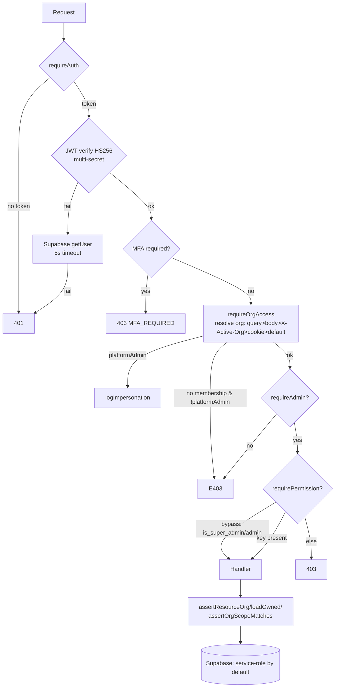

# Access Control Matrix Audit

## Audit Metadata

- Audit name: repo-deep-dive
- Run: `20261002-0344-develop-6286137`
- Repository: mainecybertech
- Branch: develop
- Commit SHA: `6286137017c4b7c77e83ee420ec11382d984f263`
- Generated at: 2026-10-01T23:25:45-04:00 (HEAD timestamp); report generated 2026-10-02T03:44 local
- Auditor: principal-level repository auditor (repo-deep-dive prompt 24)
- Area code: ACM
- Output path: docs/audits/repo-deep-dive/20261002-0344-develop-6286137/24_access_control_matrix_audit.md
- Companion artifact: docs/audits/repo-deep-dive/20261002-0344-develop-6286137/access_control_matrix.md
- Prior run (continuity): `prompts/repo-deep-dive/20260728-0142-develop-21a10d6/24_access_control_matrix_audit.md`
- Scope limitations:
  - Static review only. No live Supabase project, no network access to a running API, no database. RLS-call behavior under `auth.uid()` and the reserved `get_analytics_summary` RPC are `Unverified` / `not reproducible` statically (see Verification Performed).
  - Role and permission resolution is configuration-driven (`permissions`, `role_permissions`, `user_permission_overrides` rows). The seeded catalog was read from migrations; the *deployed* catalog could differ and is `Unknown`.

## Scope

Reviewed (repository evidence at the commit above):

- Roles: `apps/api/src/lib/roles.ts`, `supabase/migrations/5302128_role_catalog_expansion.sql`, `5302118_permission_matrix_full_catalog.sql`, `5302028_seed_permissions.sql`, `5302026_...bootstrap...v3.sql`.
- Permissions: `apps/api/src/lib/permissions.ts`, `apps/api/src/middleware/permissions.ts`, `5302131`, `5302424`.
- Org/tenant/workspace membership: `apps/api/src/middleware/org-access.ts`, `apps/api/src/lib/tenant.ts`, `apps/api/src/routes/memberships.ts`.
- Project/ticket/document/billing/API-key/webhook permission: the 75 route files under `apps/api/src/routes/**` and their per-route guards.
- Admin console: `apps/api/src/routes/admin.ts`, `audit.ts`, `analytics.ts`, `business-os.ts`, `dashboard.ts`, `roles.ts`, `users.ts`, `bulk.ts`; web-side `apps/web/lib/auth/admin.ts`, `apps/web/lib/permissions.ts`, `apps/web/components/HasPermission.tsx`, `RouteGuard.tsx`.
- Public/authenticated/internal routes: `apps/api/src/app.ts` mount table; `routes/{docs,health,public,webhooks}.ts`; inline public blocks in `file-requests.ts`, `status-page.ts`, `batch.ts`, `store/*`, `analytics.ts`.
- Server actions / middleware / client-side hiding: `middleware/{auth,admin,permissions,org-access,csrf,rate-limit}.ts`; web permission helpers.
- API endpoints: route matrix in the companion artifact.
- Background jobs: worker usage of service-role and RLS is out of this prompt's direct scope but noted where it intersects role identity (RLS helper functions).
- DB helpers: `is_super_admin`, `is_org_member`, `is_org_approved_member`, `user_has_role`, `user_has_permission` in the bootstrap migration.
- Audit logs: `apps/api/src/services/audit.ts`, `services/impersonation.ts`; `routes/audit.ts`.
- Authz tests: the ~40 `403/FORBIDDEN` test files plus `middleware-{auth,admin,permissions,org-access}.test.ts`, `tenant-scoping-guard.test.ts`, `tenant.test.ts`, `me-permissions.test.ts`.

Not reviewed (out of scope / not present):

- Deployed environment configuration (`RLS_READS_ENABLED`, `RLS_WRITES_ENABLED`, `MFA_ENFORCEMENT_ENABLED`, `CORS_ORIGIN`).
- Live RLS policy behavior against a hosted database.
- Non-TypeScript assets, Terraform, and CI (covered by sibling reports 10/12/36).

## Evidence Reviewed

| Evidence | Type | Why relevant | Notes |
|---|---|---|---|
| `apps/api/src/lib/roles.ts` | Source | `PLATFORM_ADMIN_KEYS` (8) and `roleKeyOf` | Defines cross-tenant trust set |
| `apps/api/src/lib/permissions.ts` | Source | `ADMIN_BYPASS_KEYS` (2), `resolveEffectivePermissions` | Effective-permission resolver |
| `apps/api/src/middleware/auth.ts` | Source | JWT verify (HS256 pinned), multi-secret, Supabase fallback, MFA gate | 143 lines |
| `apps/api/src/middleware/admin.ts` | Source | `requireAdmin` (admin/super_admin, any approved membership) | 36 lines |
| `apps/api/src/middleware/org-access.ts` | Source | `requireOrgAccess`, `requireOrgAccessByParam`, `assertOrgScopeMatches`, `assertSharesActiveOrg` | 324 lines |
| `apps/api/src/middleware/permissions.ts` | Source | `requirePermission(module, action)` + admin bypass + org-agnostic fallback | 93 lines |
| `apps/api/src/lib/tenant.ts` | Source | `assertResourceOrg`, `loadOwned` | Row-level tenant check |
| `apps/api/src/services/supabase.ts` | Source | `getSupabaseAdmin` (service role), `getSupabaseUser`, `getScopedClient` RLS gate | service-role default |
| `apps/api/src/services/service-role.ts` | Source | `withServiceRole` audited escalation wrapper | Not adopted broadly |
| `apps/api/src/services/impersonation.ts` | Source | `logImpersonation` fire-and-forget | Cross-tenant audit trail |
| `apps/api/src/app.ts` | Source | Middleware order + all route mounts | 244 lines |
| `apps/api/src/routes/**` (75 files) | Source | Per-route guard usage | See matrix |
| `supabase/migrations/5302118_permission_matrix_full_catalog.sql` | Migration | Permission catalog + role grants | 433 lines |
| `supabase/migrations/5302128_role_catalog_expansion.sql` | Migration | 8-role expansion + grants | 422 lines |
| `supabase/migrations/5302131_governance_manage_permissions.sql` | Migration | `manage` actions for governance | |
| `supabase/migrations/5302424_manage_actions.sql` | Migration | `manage` for users/roles/orgs/memberships | |
| `supabase/migrations/5302042_api_keys.sql` | Migration | API-key schema + RLS | |
| `supabase/migrations/5302032_webhook_endpoints.sql` | Migration | Webhook schema (`secret` plaintext column) + RLS | |
| `supabase/migrations/5302026_...bootstrap...v3.sql` | Migration | RLS helper functions keyed on `auth.uid()` | lines 638-734 |
| `apps/api/src/__tests__/middleware-permissions.test.ts` | Test | 14 permission-middleware cases | |
| `apps/api/src/__tests__/middleware-org-access.test.ts` | Test | 14 org-access cases | |
| Sibling `06_security_authz_tenancy_audit.md` | Report | SEC-P2-001..005, SEC-P3-001..004 | Cross-referenced |
| Sibling `37_supabase_rls_policy_deep_dive.md` | Report | RLS-P2-001..003, RLS-P3-001..004 | Cross-referenced |
| Sibling `08_api_contracts_realtime_integrations.md` | Report | API-P2-001 | Cross-referenced |
| Sibling `45_exploit_chain_attack_path_audit.md` | Report | CHAIN-P1-001, CHAIN-P2-003 | Cross-referenced |

## Verification Performed

| Evidence | Type | Why relevant | Notes |
|---|---|---|---|
| `git log -1` at repo | Command | Bind commit | HEAD = `6286137017c4b7c77e83ee420ec11382d984f263`, branch `develop` |
| Grep count `requireAuth` per route file | Command | Coverage census | 55/75 route files carry router-level `requireAuth`; remaining are public or composed sub-routers |
| Grep `router.use(requireAuth ...)` | Command | Router-level guard | Confirms middleware placement |
| Grep `requirePermission("…","…")` distinct keys | Command | Build permission inventory | 96 distinct module:action keys referenced in code |
| Grep `'manage'` in migrations | Command | Key existence | `users/roles/organizations/memberships` manage added by `5302424`; `change-requests/dns-changes/risk-register` by `5302131` |
| Read `client-onboarding-command-center.ts` | Walk | Reproduce SEC-P2-001 | 0 `requirePermission` matches — **still open** (supported) |
| Read `lib/roles.ts` vs `lib/permissions.ts` | Walk | Reproduce SEC-P2-002 | 8 vs 2 keys — **still open** (supported) |
| Read `services/supabase.ts:163-186` | Walk | Reproduce SEC-P2-005 | `RLS_*_ENABLED` empty default → service-role — **still open** (supported) |
| Grep `PLATFORM_ADMIN_KEYS` / `ADMIN_BYPASS_KEYS` | Command | Trust-set divergence | API + web copies; divergence persists |
| Read RLS helper functions | Walk | Identity-resolution trust | All keyed on `auth.uid()`, not user-supplied strings (supported) |
| Grep `403|FORBIDDEN|...` in tests | Command | Authz test coverage | 40 files contain forbidden-access assertions |
| Read `api-keys.ts`, `5302042`, `webhook-management.ts` | Walk | Key/token lifecycle | Expiry stored; no pruning; webhook secret plaintext column |
| Read `5302118`, `5302128`, `5302131`, `5302424` | Walk | Permission satisfiability | `:manage` keys now exist for admin modules |

### Claim reproducibility summary

| Prior/eligible claim | How checked | Outcome |
|---|---|---|
| SEC-P2-001 client-onboarding lacks `requirePermission` | Read file + grep | **Supported — still open** |
| SEC-P2-002 `PLATFORM_ADMIN_KEYS` (8) ≠ `ADMIN_BYPASS_KEYS` (2) | Read both files | **Supported — still open** |
| SEC-P2-005 service-role default (RLS bypassed) | Read `getScopedClient` | **Supported — still open** |
| SEC-P3-003 notification-preferences body org unscoped | Read route | **Supported — still open** |
| Prior ACM-F001 users/profiles lack org scoping | Read routes | **Unsupported now — remediated**; both routers now `requireAuth, requireOrgAccess` (`SEC-P1-002` family) |
| Prior ACM-F002 organizations list bypasses org access | Read `organizations.ts:152-234` | **Partially fixed** — handler scopes list to member orgs unless platform admin; platform-admin (now 8 keys) still sees all |
| Prior ACM-F004 webhook GET lacks admin gate | Read `webhook-management.ts:52-74` | **Partly fixed** — router is A,O; GET returns masked secrets; manage-gated for writes. Read still available to any org member (`RLS-P3` mirror) |
| Prior ACM-F006 no role-based authz in module CRUD | Grep `requirePermission` | **Unsupported now — remediated** for most modules; outlier = client-onboarding |

## Executive Summary

The repository has, at this commit, a substantially more complete access-control
system than the prior run recorded. The `SEC-P1-001` remediation ("permission
catalog is UI-only") is real: `requirePermission(module, action)` is applied
across roughly 40 modules, backed by a data-driven resolver
(`lib/permissions.ts`) that unions `role_permissions` across approved
memberships, applies per-org `user_permission_overrides`, and is covered by 14
middleware unit tests. Tenant isolation is layered: router-level
`requireOrgAccess` resolves an active org, handlers use `assertResourceOrg` /
`loadOwned` for row-level checks, and cross-tenant platform-admin traversals are
written to `impersonation_log`.

Three structural issues remain and they are the headline of this matrix:

1. **An inconsistent trust model between the two privilege constants.**
   `requireOrgAccess` treats all 8 `PLATFORM_ADMIN_KEYS` as cross-tenant, while
   `requirePermission`/`requireAdmin` only trust 2 (`admin`, `super_admin`). A
   `dispatcher`/`finance`/`onboarding-specialist` credential is a cross-tenant
   *read* pivot but not a write bypass. This is a latent hazard and is scored
   `ACM-P2-002` (mirrors SEC-P2-002, CHAIN-P1-001).
2. **A wiring outlier.** `client-onboarding-command-center.ts` performs full
   CRUD with only `requireOrgAccess` + `loadOwned`, though the module exists in
   the catalog with `create/edit/delete` permissions. Any org member can mutate
   onboarding records within their own tenant. `ACM-P1-001` (mirrors SEC-P2-001,
   CHAIN-P2-003).
3. **RLS is not a backstop on API requests by default.** `getScopedClient`
   returns the service-role client unless a module is explicitly allow-listed in
   `RLS_READS_ENABLED`/`RLS_WRITES_ENABLED` (empty by default). Every tenant
   boundary therefore rests on handler code, not on the database.
   `ACM-P2-003` (mirrors SEC-P2-005).

Additional matrix findings: several write actions are gated by `view`
permissions (`ai:view` guarding a POST), several `manage` keys are referenced
only in RLS and granted to no role (dead predicates), `profiles` enumeration is
possible via `GET /profiles?email=`, webhook signing secrets are stored
plaintext with no rotation/expiry, and API keys store `expires_at` but nothing
prunes or enforces it.

Strengths: consistent middleware order; algorithm-pinned JWT verification with a
bounded Supabase fallback; MFA enforcement hook; a real permission resolver with
override semantics; `impersonation_log`; broad `403` test coverage; and admin
override scoping (`assertSharesActiveOrg`) that blocks an admin of one tenant
from reading another tenant's PII.

Recommended next actions, in order: wire `requirePermission` on onboarding;
decide and document the MSP-role trust model; add `assertOrgScopeMatches` to
`notification-preferences`; begin the incremental RLS rollout; add a catalog-lint
test that every `requirePermission` key exists in `permissions`.

## Inventory

| Item | Path / symbol | Purpose | Current state | Risk | Notes |
|---|---|---|---|---|---|
| Platform admin keys | `lib/roles.ts:9` | Cross-tenant trust set | 8 keys | High | Diverges from bypass set |
| Admin bypass keys | `lib/permissions.ts:26` | Permission bypass set | 2 keys | High | Diverges from platform set |
| Permission resolver | `lib/permissions.ts:49` | Compute effective perms | Implemented, uncached | Med | SEC-P3-004 |
| Permission middleware | `middleware/permissions.ts:54` | Enforce `module:action` | Implemented | Low | Org-agnostic fallback |
| Admin middleware | `middleware/admin.ts:6` | admin/super_admin gate | Implemented | Low | |
| Org access | `middleware/org-access.ts:176` | Resolve/verify org | Implemented | Med | Platform-admin breadth |
| Tenant helpers | `lib/tenant.ts:32,66` | Row-level checks | Implemented | Low | |
| Service-role client | `services/supabase.ts:28` | DB access | Default client | High | RLS bypassed |
| Scoped client | `services/supabase.ts:163` | RLS selector | Allow-list gated | High | Empty default |
| Service-role wrapper | `services/service-role.ts:20` | Audited escalation | Exists, narrow use | Med | |
| Impersonation log | `services/impersonation.ts:16` | Cross-tenant trail | Fire-and-forget | Med | Failure doesn't block |
| Permission catalog | `5302118` (+`5302131`,`5302424`) | permissions/role_permissions | Seeded | Low | `manage` keys added late |
| Role catalog | `5302128` | 8 new roles | Seeded | Low | |
| RLS helpers | `5302026:638-734` | DB-side identity | Keyed on `auth.uid()` | Low | Unforgeable |
| API keys | `routes/api-keys.ts`, `5302042` | Programmatic access | CRUD present | Med | No expiry enforcement |
| Webhook endpoints | `routes/webhook-management.ts`, `5302032` | Outbound webhooks | CRUD + masking | Med | Plaintext secret column |
| Public routes | `routes/{public,docs,health,webhooks}.ts` | Unauthenticated surface | Present | Low | Signature-verified webhooks |
| Client onboarding | `routes/client-onboarding-command-center.ts` | Onboarding CRUD | **No permission gate** | High | ACM-P1-001 |
| Web permission mirror | `apps/web/lib/{permissions,roles}.ts` | UI hide/show | Present | Med | UI-only guard for some actions |
| Authz tests | `apps/api/src/__tests__/*` | Regression | Broad | Low | 40 files w/ 403 assertions |

## Domain Scorecard

| Category | Score | Evidence | Gap | Recommended action |
|---|---:|---|---|---|
| Roles | 4 | `lib/roles.ts`, `5302128` | Two divergent trust sets; role catalog documented but MSP classification only in code | Consolidate/document classification (ACM-P2-002) |
| Permissions | 4 | `lib/permissions.ts`, `middleware/permissions.ts`, 14 tests | Write actions gated by `view`; dead `manage` keys; no catalog-lint test | Key lint + action-correctness pass (ACM-P2-004, ACM-P3-002) |
| Org/tenant/workspace membership | 3 | `org-access.ts`, `tenant.ts`, `memberships.ts` | Platform-admin breadth; service-role default | Trust-model decision + RLS rollout (ACM-P2-002/003) |
| Project/ticket/document/billing/API key/webhook permission | 4 | Per-route guards across ~40 routers | Onboarding outlier; webhook read open to org members; API-key expiry unenforced | ACM-P1-001, ACM-P2-005, ACM-P2-006 |
| Admin console | 4 | `admin.ts`, `audit.ts`, `roles.ts`, `users.ts`, web `requireAdminAccess` | `GET /roles/:id` A-only; analytics broken RPC (SEC-P2-004) | Minor tightening |
| Public/authenticated/internal routes | 4 | `app.ts` mount table, inline public blocks | Public store/status/lead surfaces widen the anonymous surface | Document public surface (ACM-P3-003) |
| Server actions | 3 | Next server actions use `requireAdminAccess`; API is the enforcement point | UI-only hiding for some per-module actions | Verify each action re-checks server-side (ACM-P3-001) |
| API endpoints | 4 | Matrix in companion artifact | Guard gaps above | Add guard-coverage CI gate |
| Background jobs | 3 | Worker uses service-role (RLS-RLS-P2-001 mirror) | No role identity in jobs | Confirm worker isolation boundary |
| DB helpers | 4 | `5302026:638-734` | `storage_path_org_id` trusts object name (RLS-P3-003) | See sibling RLS report |
| Middleware | 4 | `auth.ts`, `admin.ts`, `permissions.ts`, `org-access.ts` | Ordering fine; resolver uncached | Cache resolver (SEC-P3-004) |
| Client-side hiding | 3 | `HasPermission.tsx`, `RouteGuard.tsx` | Hide-only; API must enforce (mostly does) | Keep as defense-in-depth only (ACM-P3-001) |

## Detailed Review

### Item: Permission catalog and role grants

- Evidence: `5302118_permission_matrix_full_catalog.sql`, `5302128_role_catalog_expansion.sql`, `5302131_governance_manage_permissions.sql`, `5302424_manage_actions.sql`, `5302028_seed_permissions.sql`.
- What it does: seeds `permissions(module_key, action_key, group_key, scope, label, description)` and `role_permissions`.
- How it appears to work: `super_admin` gets all; `admin` gets all except `:delete`; MSP roles get scoped unions; client roles get portal-scoped `view`/`create`/`edit`.
- Dependencies: `lib/permissions.ts` reads these tables at request time.
- Current controls: data-driven, override-aware.
- Missing controls: no test asserting the referenced-vs-defined key set; several keys referenced only in RLS are granted to no role.
- Risks: `ACM-P2-004`, `ACM-P3-002`.
- Recommended improvement: add a `permission-catalog.test.ts` cross-check.
- Suggested tests: assert every `requirePermission(a,b)` and every `user_has_permission(_, m, a)` string exists in the catalog.
- Suggested docs: `docs/modules/roles.md` — document catalog-lint.

### Item: Effective-permission resolver

- Evidence: `lib/permissions.ts:49-152`.
- What it does: super-admin bypass; approved memberships → `role_permissions` union; `user_permission_overrides`; deny-by-default.
- How it appears to work: matches `middleware/permissions.ts` comment contract.
- Dependencies: `memberships`, `roles`, `role_permissions`, `permissions`, `user_permission_overrides`.
- Current controls: tests (14) cover grant/deny/override/bypass/org-scope.
- Missing controls: no cache; no metric on resolution latency.
- Risks: `ACM-P3-004` (cost), no correctness gap found.
- Recommended improvement: TTL cache keyed by (userId, orgId).
- Suggested tests: cache-hit/stale tests.
- Suggested docs: `docs/modules/roles.md`.

### Item: Org access middleware

- Evidence: `middleware/org-access.ts:176-324`.
- What it does: resolves org from query → body → `X-Active-Org` → cookie → default membership; verifies access; logs impersonation; asserts body/param matching.
- How it appears to work: platform admins bypass membership; `resolveDefaultOrgId` leaves them org-agnostic (`orgId=null`).
- Dependencies: `memberships`, `roles`, `impersonation_log`.
- Current controls: `assertBodyOrgMatches`, `assertOrgScopeMatches`, `assertSharesActiveOrg`.
- Missing controls: trust set includes 6 MSP roles beyond admin.
- Risks: `ACM-P2-002`, `ACM-P2-003`.
- Recommended improvement: split "internal role" from "cross-tenant traversal".
- Suggested tests: matrix of role × target-org for read/write.
- Suggested docs: ADR on MSP operating model (see SEC-P2-002).

### Item: API endpoint guards

- Evidence: the route matrix (companion artifact §3) and per-file guard grep.
- What it does: applies A/O/P/AD per route.
- How it appears to work: consistent, with named exceptions.
- Dependencies: middleware modules.
- Current controls: broad.
- Missing controls: onboarding outlier; `ai:view` gating a write; `GET /roles/:id` A-only; store admin writes without org scope (global catalog).
- Risks: `ACM-P1-001`, `ACM-P2-004`, `ACM-P3-002`, `ACM-P3-005`.
- Recommended improvement: per-outlier fixes below.
- Suggested tests: forbidden-access suite per module.
- Suggested docs: `docs/portal_admin_permissions_guide.md`.

### Item: Key and token lifecycle

- Evidence: `routes/api-keys.ts`, `5302042`, `routes/webhook-management.ts`, `5302032`, `middleware/auth.ts`.
- What it does: issues hashed API keys; stores webhook secrets; rotates JWT secrets via CSV.
- How it appears to work: API key hash = sha256; webhook secret same-column plaintext.
- Dependencies: `api_keys`, `webhook_endpoints`.
- Current controls: masking on webhook read; `is_active` revoke; DELETE.
- Missing controls: no expiry enforcement/pruning; no webhook secret rotation/expiry; no certificate inventory in repo.
- Risks: `ACM-P2-006`, `ACM-P2-007`.
- Recommended improvement: enforce `expires_at`/`is_active` at verification; add pruning job.
- Suggested tests: expired-key rejection; secret rotation.
- Suggested docs: `docs/modules/auth.md`, key-rotation runbook.

## Scenario / Control Matrix

| ID | Scenario or control | Evidence | Current control | Gap | Severity | Recommendation |
|---|---|---|---|---|---|---|
| ACM-001 | Non-admin org member mutates onboarding within their tenant | `client-onboarding-command-center.ts` | `requireOrgAccess` + `loadOwned` | No `requirePermission` despite catalog module | P1 | Add `requirePermission("client-onboarding-command-center", …)` (ACM-P1-001) |
| ACM-002 | Low-trust MSP role as cross-tenant read pivot | `lib/roles.ts:9`, `org-access.ts:44` | `PLATFORM_ADMIN_KEYS` (8) bypass org check | Write denied but read broad | P2 | Split trust sets (ACM-P2-002) |
| ACM-003 | Cross-tenant isolation enforced only by handlers | `services/supabase.ts:163` | `getScopedClient` allow-list | Empty default → service role | P2 | RLS rollout (ACM-P2-003) |
| ACM-004 | Write action gated by `view` permission | `ai.ts:174` | `requirePermission("ai","view")` on POST | Action mismatch | P2 | Gate writes with create/edit (ACM-P2-004) |
| ACM-005 | Webhook endpoint listing to any org member | `webhook-management.ts:52` | A,O; secrets masked | Read not manage-gated | P2 | Consider `webhooks:view` check or accept (ACM-P2-005) |
| ACM-006 | API-key expiry unenforced / never pruned | `routes/api-keys.ts`, `5302042` | `expires_at` stored | No query filters expiry | P2 | Enforce + prune (ACM-P2-006) |
| ACM-007 | Webhook secret stored plaintext, no rotation | `5302032:8` | column `secret text` | No expiry/rotation | P2 | Encrypt/rotate (ACM-P2-007) |
| ACM-008 | Profile enumeration by email/id | `profiles.ts:56-91` | A,O; RLS client | Any authed user can query by email | P2 | Restrict enumeration (ACM-P2-008) |
| ACM-009 | `manage` keys referenced only in RLS, granted to none | bootstrap policies | none | Dead predicates | P3 | Remove or grant (ACM-P3-005) |
| ACM-010 | UI-only hiding of module actions | `HasPermission.tsx`, `RouteGuard.tsx` | Hide-only | API must enforce | P3 | Keep as defense-in-depth (ACM-P3-001) |
| ACM-011 | Permission catalog drift | migrations vs code | no lint | Unchecked keys | P3 | Catalog-lint test (ACM-P3-002) |
| ACM-012 | Public surface undocumented | `app.ts`, inline blocks | per-route public | No single inventory | P3 | Document public routes (ACM-P3-003) |

## Findings

### Finding ID: ACM-P1-001 - Client-onboarding mutations run without any `requirePermission` gate

- Severity: P1
- Confidence: High
- Area: Access control / permission enforcement
- Evidence:
  - `apps/api/src/routes/client-onboarding-command-center.ts`
  - Symbol / route / workflow: router-level `router.use(requireAuth)` + `router.use(requireOrgAccess)` (lines 29-30); `POST /` (129), `PATCH /:id` (142), `DELETE /:id` (162), `POST /:id/complete-phase` (180), `PATCH /:id/checklist/:itemId` (223) — zero `requirePermission` matches in the file.
  - Catalog module exists: `supabase/migrations/5302118_permission_matrix_full_catalog.sql:276-279` defines `client-onboarding-command-center:{view,create,edit,delete}`; `5302128:236` grants create/edit to `onboarding-specialist`, `5302128:183` grants `view` to `project-manager`.
- What is happening: Any approved member of an organization — including a `client-viewer`, `client_user`, or any MSP role — can create, edit, delete, and phase-complete onboarding records for that org via the API, because only tenant scoping (`loadOwned`) is enforced and no module permission is checked. `loadOwned` correctly prevents cross-tenant access, so the gap is intra-tenant capability, not tenant leakage.
- Why it matters: The permission catalog is advertised and editable in the admin console, but this module's grants are not consulted. Operators granting/revoking `client-onboarding-command-center:*` will observe no effect.
- User / business impact: Client-side users can manipulate MSP onboarding workflows (project state, phases, checklists), corrupting delivery records; audit/attribution noise.
- Security / privacy / reliability impact: Capability escalation within a tenant; integrity loss of onboarding state; contributes to the "intra-tenant capability escalation" chain (CHAIN-P2-003).
- Recommended fix: Import `requirePermission` and apply: `POST /` → `create`; `PATCH /:id`, `POST /:id/complete-phase`, `PATCH /:id/checklist/:itemId` → `edit`; `DELETE /:id` → `delete`; keep reads at `requireOrgAccess`. Mirror the pattern in `approvals.ts`.
- Suggested validation: Extend `apps/api/src/__tests__/client-onboarding-command-center.test.ts` with a `client_viewer`/`client_user` membership expected to receive `403 FORBIDDEN` on POST/PATCH/DELETE; and a role with the grant expected `2xx`.
- Owner suggestion: API platform team (author of the onboarding module).
- Effort estimate: S
- Dependencies: None (catalog keys already exist). Aligns with sibling SEC-P2-001.
- Status: open

### Finding ID: ACM-P2-002 - `PLATFORM_ADMIN_KEYS` (org traversal) and `ADMIN_BYPASS_KEYS` (permission bypass) are inconsistent trust sets

- Severity: P2
- Confidence: High
- Area: Access control / roles / tenant isolation
- Evidence:
  - `apps/api/src/lib/roles.ts:9-18` — `PLATFORM_ADMIN_KEYS = [super_admin, admin, dispatcher, engineer, security-analyst, project-manager, finance, onboarding-specialist]`.
  - `apps/api/src/lib/permissions.ts:26` — `ADMIN_BYPASS_KEYS = [super_admin, admin]`.
  - `apps/api/src/middleware/org-access.ts:44-58,116-124,139-145` — `isPlatformAdminKey` grants cross-tenant traversal and sets `platformAdmin=true`.
  - `apps/api/src/middleware/permissions.ts:30-32,70-85` — only `ADMIN_BYPASS_KEYS` bypass permission checks.
- What is happening: A `dispatcher` credential can request any tenant's `requireOrgAccess` routes (reads return tenant data for every module the module-permission grants allow), and is only stopped from cross-tenant writes by `requirePermission`. The two constants encode different notions of "platform admin" and are maintained separately in API and web (`apps/web/lib/roles.ts:9`).
- Why it matters: The model is confusing and over-broad on the read side; a future author may reconcile the constants in the wrong direction (widening the bypass to 8 keys or narrowing traversal to 2), silently changing blast radius. This is the pre-condition cited by CHAIN-P1-001.
- User / business impact: Over-broad internal read access; hard-to-predict behavior across role changes.
- Security / privacy / reliability impact: Any one of 8 role keys becomes a cross-tenant read pivot if a credential is leaked; the write blast radius depends on a second, differently-defined constant.
- Recommended fix: Define one explicit classification (e.g. `PLATFORM_ADMIN_KEYS` = cross-tenant traversal; a documented note that permission bypass is intentionally narrower), add an inline comment cross-referencing both constants, and add a unit test asserting the two sets and their intended relationship. Consider deriving one from the other with a documented delta.
- Suggested validation: New test `lib/roles-trust-sets.test.ts` asserting the exact membership and the documented relationship; a role×org authorization matrix test.
- Owner suggestion: Security + API platform.
- Effort estimate: M
- Dependencies: Product decision on MSP operating model. Mirrors SEC-P2-002 and CHAIN-P1-001.
- Status: open

### Finding ID: ACM-P2-003 - RLS is not a database backstop on API requests (service-role is the default client)

- Severity: P2
- Confidence: High
- Area: Tenant isolation / DB helpers
- Evidence:
  - `apps/api/src/services/supabase.ts:163-186` — `getScopedClient` returns `getSupabaseUser` only when `moduleKey ∈ RLS_READS_ENABLED/RLS_WRITES_ENABLED` **and** `req.orgScope.platformAdmin` is false; otherwise `getSupabaseAdmin()` (service role).
  - `apps/api/src/config/env.ts:54-55` — both allow-lists optional/undefined by default.
  - `apps/api/src/services/supabase.ts:28-48` — `getSupabaseAdmin` uses `SUPABASE_SERVICE_ROLE_KEY`.
- What is happening: Every route that calls `getScopedClient` (or `getSupabaseAdmin` directly) bypasses RLS unless the module is explicitly enabled. Tenant boundaries therefore depend entirely on middleware + handler predicates.
- Why it matters: A single missing `assertResourceOrg`/org predicate in a handler becomes a cross-tenant data exposure with no second line of defense.
- User / business impact: Larger blast radius for any scoping regression; harder incident scope reasoning.
- Security / privacy / reliability impact: Single-layer tenant isolation.
- Recommended fix: Continue the incremental RLS rollout per `docs/RLS-rollout.md` / `docs/MT-P0-001-RLS-remediation-design.md`; prioritize high-risk modules (tickets, documents, profiles, client-portal). Add a CI check that new `requireOrgAccess` routes use `getScopedClient`.
- Suggested validation: Enable one module in staging, run an allow/deny RLS behavior test (RLS-P3-002) and the route regression suite.
- Owner suggestion: API platform + DBA.
- Effort estimate: L
- Dependencies: `RLS_READS_ENABLED`/`RLS_WRITES_ENABLED` rollout. Mirrors SEC-P2-005 and CHAIN-P2-005.
- Status: open

### Finding ID: ACM-P2-004 - Write and state-transition actions gated by `view` permissions (action mismatch)

- Severity: P2
- Confidence: High
- Area: Permission model consistency
- Evidence:
  - `apps/api/src/routes/ai.ts:174` — `router.post("/triage/analyze", requirePermission("ai", "view"), …)` gates a mutating/expensive POST with the `view` action.
  - `apps/api/src/routes/ai.ts:213` — `POST /triage/convert` correctly uses `tickets:create` (contrast).
  - Catalog: `5302118:310-313` defines `ai:{view,create,edit,delete}`.
- What is happening: A caller holding only `ai:view` (the read grant, given to all `client-viewer`/`client_user` for portal-scope and to most MSP roles) can trigger AI triage analysis.
- Why it matters: The action vocabulary (`view/create/edit/delete/manage/export`) is the contract operators use to reason about grants; using `view` for a write breaks that contract.
- User / business impact: Read-only client users can consume AI cost/features intended for staff.
- Security / privacy / reliability impact: Over-permissive execution; potential cost/abuse surface (unauthenticated is not the case, but low-trust authenticated is).
- Recommended fix: Change the guard to `requirePermission("ai", "create")` (or `edit`), and review the whole route set for `"view"` guards on non-GET verbs.
- Suggested validation: Static test asserting no `requirePermission(m,"view")` appears on a `router.(post|patch|put|delete)`; `ai.test.ts` case for `client_viewer` receiving 403 on `/triage/analyze`.
- Owner suggestion: API platform.
- Effort estimate: S
- Dependencies: None. Related to API-P2-001.
- Status: open

### Finding ID: ACM-P2-005 - Webhook endpoint and delivery reads are available to any org member (not manage-gated)

- Severity: P2
- Confidence: Medium
- Area: API key/webhook permission
- Evidence:
  - `apps/api/src/routes/webhook-management.ts:52-74` — `GET /` and `GET /dead-letters` under router-level A,O with no `requirePermission("webhooks","view")`.
  - `webhook-management.ts:259-272` — `GET /:id` returns data via `maskWebhookData`.
  - `5302032_webhook_endpoints.sql:28-33` — select policy = super_admin or approved member.
  - Writes are `requirePermission("webhooks","manage")`.
- What is happening: Any approved org member can list webhook endpoints (URL, events, masked secret) and delivery/dead-letter records. Secret values are masked (`maskWebhookData`, lines 22-31), which mitigates the worst case.
- Why it matters: Webhook URLs and event subscriptions reveal integration topology; dead-letter bodies may contain PII. The catalog defines `webhooks:view`; it is not consulted.
- User / business impact: Internal integration details exposed to low-trust members.
- Security / privacy / reliability impact: Information disclosure; SSRF target enumeration feed for CHAIN-style compositions.
- Recommended fix: Gate reads with `requirePermission("webhooks","view")` (or accept and document). Note the sibling RLS report's `RLS-P2-001` (MSP admin keys missing from the admin-gate policy) applies to the DB-side equivalent.
- Suggested validation: `webhook-management.test.ts` case for a client user expecting 403 on `GET /`.
- Owner suggestion: API platform.
- Effort estimate: S
- Dependencies: None. Mirrors prior ACM-F004 (partially addressed).
- Status: partially-fixed

### Finding ID: ACM-P2-006 - API keys store `expires_at` but nothing enforces or prunes expiry

- Severity: P2
- Confidence: Medium
- Area: Key lifecycle
- Evidence:
  - `apps/api/src/routes/api-keys.ts:17-21` — `expiresAt` accepted on create; `56-91` inserts `expires_at`.
  - `supabase/migrations/5302042_api_keys.sql:10` — `expires_at timestamptz` (nullable); no check constraint or pruning job.
  - No query in the repository filters on `expires_at` or `is_active` at verification time (Grep of `api_keys` across `apps/api/src`).
- What is happening: Expiry is recorded and displayed but not enforced anywhere in the reviewed code; there is no scheduled prune of expired/inactive keys. Whether any consumer *verifies* API keys at all is `Unknown` (no verification handler found).
- Why it matters: The extended verification check (key/token lifecycle) requires issuance, expiry, pruning, and revocation evidence. Issuance and revocation (`is_active=false`, DELETE) exist; expiry and pruning do not.
- User / business impact: Indefinite credential validity if a key is not manually revoked.
- Security / privacy / reliability impact: Stale credentials; accumulated inactive rows.
- Recommended fix: Add an expiry/active check to the key-verification path (once one exists), and a scheduled pruner (or partial index filtered on active+unexpired). Document the verification path.
- Suggested validation: Test that an expired key is rejected by the verification path; test that the pruner removes only expired rows.
- Owner suggestion: API platform + ops.
- Effort estimate: M
- Dependencies: Confirm whether API keys are verified anywhere (Open Question OQ-1).
- Status: open

### Finding ID: ACM-P2-007 - Webhook signing secrets are stored plaintext with no rotation or expiry

- Severity: P2
- Confidence: Medium
- Area: Key lifecycle / secrets
- Evidence:
  - `supabase/migrations/5302032_webhook_endpoints.sql:8` — `secret text` column.
  - `apps/api/src/routes/webhook-management.ts:286` (insert), `340` (update), `448-450` (HMAC via `createHmac("sha256", webhook.secret)`).
  - `webhook-management.ts:22-31` — masking on read only.
- What is happening: Webhook signing secrets are stored in plaintext, caller-supplied, with no expiry and no rotation workflow. They are masked on read (good) but recoverable by anyone with DB/service-role access.
- Why it matters: Signing secrets authenticate inbound payload provenance to receivers; plaintext storage widens exposure and there is no rotation evidence.
- User / business impact: Receiver-side trust loss if a secret leaks.
- Security / privacy / reliability impact: Secret-at-rest exposure; no rotation path.
- Recommended fix: Store an encrypted/hashed secret or a KMS-wrapped value; add a documented rotation endpoint/runbook; consider per-endpoint timestamps to bound replay.
- Suggested validation: Test that the API never returns an unmasked secret; rotation test updates verification; runbook walk.
- Owner suggestion: API platform + security.
- Effort estimate: M
- Dependencies: Secret-management approach (`docs/ENV`/rotation). Related to 38_env_secret_rotation.
- Status: open

### Finding ID: ACM-P2-008 - Profiles are enumerable by email/id for any authenticated user

- Severity: P2
- Confidence: Medium
- Area: Object-level authorization
- Evidence:
  - `apps/api/src/routes/profiles.ts:54-91` — `GET /` under A,O builds a `profiles` query from `?ids=` and `?email=`; no self/role restriction; uses `getSupabaseUser` (RLS client).
  - `profiles.ts:93-118` — `GET /:id` restricts to self or `is_super_admin`, but `GET /?email=` bypasses that intent.
  - `5302135_profiles_encrypted_pii.sql` exists (PII encryption), but the list endpoint returns `select("*")`.
- What is happening: A caller can resolve arbitrary profiles by email (and id) through the collection endpoint, returning fields the `GET /:id` handler deliberately guards. Whether RLS blocks this depends on the `profiles` select policy (not enabled for this module by default — ACM-P2-003).
- Why it matters: The singular endpoint's self-or-admin rule is defeated by the collection endpoint; PII exposure risk (profile-pii tests exist, suggesting this surface is sensitive).
- User / business impact: Email→identity resolution across the tenant.
- Security / privacy / reliability impact: PII disclosure; enumeration.
- Recommended fix: Restrict `GET /` to `ids` the caller may see (same-org members) and remove/limit the `email` filter; or route through a permission (`users:view`).
- Suggested validation: `profiles.test.ts`/`profile-pii.test.ts` case: a low-trust user querying another user's email gets 403 or filtered result.
- Owner suggestion: API platform.
- Effort estimate: S
- Dependencies: Confirm deployed `profiles` RLS policy (Open Question OQ-3). Related to prior ACM-F001.
- Status: open

### Finding ID: ACM-P3-001 - Client-side permission hiding is UI-only for several module actions

- Severity: P3
- Confidence: Medium
- Area: Client-side hiding vs server enforcement
- Evidence:
  - `apps/web/components/HasPermission.tsx`, `apps/web/components/RouteGuard.tsx`, `apps/web/lib/permissions.ts`, `apps/web/lib/use-permissions.ts`.
  - Web UI gating patterns appear in `apps/web/app/(portal)/*/page.tsx` and admin components (see grep census).
- What is happening: The web app hides/disables actions based on the caller's permission set; those actions are enforced server-side by `requirePermission` for most modules — but not all (ACM-P1-001, ACM-P2-004, ACM-P2-005).
- Why it matters: UI-only guards create a false sense of enforcement and are trivially bypassed via direct API calls.
- User / business impact: Behavioral inconsistency between UI and API.
- Security / privacy / reliability impact: None where the API also enforces; real gap where it does not.
- Recommended fix: Treat UI hiding strictly as defense-in-depth; keep the API as the source of truth. Add the guard-coverage CI gate after ACM-P1-001/ACM-P2-004/005 are fixed.
- Suggested validation: A CI test enumerating mutating routes and asserting each has a `requirePermission` (allow-list of intentionally admin/org-only routes).
- Owner suggestion: Web + API platform.
- Effort estimate: M
- Dependencies: Fixes for ACM-P1-001/004/005.
- Status: open

### Finding ID: ACM-P3-002 - No catalog-lint: referenced permission keys are not checked against the `permissions` table

- Severity: P3
- Confidence: High
- Area: Permission model consistency
- Evidence:
  - 96 distinct `requirePermission("module","action")` keys referenced in code (grep).
  - Catalog seeded in `5302118`, extended by `5302131` and `5302424`; no test cross-checks code ↔ catalog (search of `apps/api/src/__tests__` for catalog assertions finds none).
  - `5302424_manage_actions.sql` header explicitly records a prior mismatch ("routes already call `requirePermission(..., "manage")` … the catalog only defined view/create/edit/delete").
- What is happening: The only defense against code/catalog drift is manual comment. A referenced-but-undefined key yields an unsatisfiable guard (only bypass roles pass), which is a silent capability denial; a defined-but-unused key is dead configuration.
- Why it matters: Correctness of the whole permission model depends on this correspondence.
- User / business impact: Non-admin roles may be silently denied or over-granted.
- Security / privacy / reliability impact: Silent authorization drift.
- Recommended fix: Add `permission-catalog.test.ts` that parses `requirePermission("a","b")` and RLS `user_has_permission(_, 'a','b')` strings and asserts membership in `5302118`+extensions.
- Suggested validation: The test itself; run in CI.
- Owner suggestion: API platform.
- Effort estimate: S
- Dependencies: None.
- Status: open

### Finding ID: ACM-P3-003 - Public route surface is broad and has no single documented inventory

- Severity: P3
- Confidence: High
- Area: Public/authenticated/internal routes
- Evidence:
  - `apps/api/src/app.ts:153-177` (`/health`, `/metrics`, `/api/v1/docs`, `/api/v1/openapi.json`).
  - `routes/public.ts` (`GET /init`, `POST /submit`, `POST /csp-report`), `routes/webhooks.ts` (inbound), `routes/docs.ts`.
  - Inline public blocks: `file-requests.ts:75` (`GET /public/:token`), `status-page.ts:13` (`GET /public/:orgId`), `batch.ts:17` (`GET /status/public`), `store/catalog.ts`/`promotions.ts`/`quotes.ts` public reads, `analytics.ts:27` (`POST /track`), `documents.ts:145` (`GET /shares/:token`).
- What is happening: A meaningful anonymous surface exists across many files; only `app.ts` and per-file inline positions reveal it.
- Why it matters: The anonymous surface is the highest-value target set for abuse; operators and future agents need one list.
- User / business impact: Harder security review and rate-limit tuning.
- Security / privacy / reliability impact: Unintended exposure if a new handler is placed above the router-level auth line.
- Recommended fix: Add a "public endpoints" section to `docs/API` and an OpenAPI tag; add a test that asserts every mutating route not on the allow-list is behind `requireAuth`.
- Suggested validation: Route-inventory CI diff.
- Owner suggestion: API platform + docs.
- Effort estimate: S
- Dependencies: None. Related to API-P3-002 (OpenAPI binding).
- Status: open

### Finding ID: ACM-P3-004 - `GET /roles/:id` and `GET /me/permissions` are readable without an admin gate

- Severity: P3
- Confidence: High
- Area: Admin console / permission exposure
- Evidence:
  - `apps/api/src/routes/roles.ts:64-78` — `GET /:id` under router-level `requireAuth` only; returns role metadata.
  - `apps/api/src/routes/me.ts:8-35` — `GET /permissions` requires only `requireAuth`; returns the caller's own effective permissions (intended).
- What is happening: Role metadata is world-readable to any authenticated user; `me/permissions` is intentionally self-scoped.
- Why it matters: Role metadata alone is low-sensitivity; the finding is recorded for completeness of the route matrix rather than as a material risk.
- User / business impact: Minimal.
- Security / privacy / reliability impact: Information disclosure (role names/descriptions).
- Recommended fix: Optional — gate `GET /roles/:id` with `requireAdmin` for consistency with `GET /roles/with-permissions`.
- Suggested validation: `roles.test.ts` case.
- Owner suggestion: API platform.
- Effort estimate: S
- Dependencies: None.
- Status: open

### Finding ID: ACM-P3-005 - RLS policies reference `manage` permissions that no role holds (dead predicates)

- Severity: P3
- Confidence: Medium
- Area: Permission model consistency / DB helpers
- Evidence:
  - `5302026_...bootstrap...v3.sql:765,792,1160,1164,1220,1251,1449,1524,1550` — `user_has_permission(_, 'documents'|'tickets'|'projects'|'contracts'|'appointments'|'billing', 'manage')`.
  - Catalog inserts for `manage` are limited to `notifications, billing, settings, store*, api-keys, webhooks` (`5302118:47,69,71,291-309`), plus `change-requests/dns-changes/risk-register` (`5302131`) and `users/roles/organizations/memberships` (`5302424`).
  - No `documents:manage`, `tickets:manage`, `projects:manage`, `contracts:manage`, or `appointments:manage` rows are inserted anywhere (grep of migrations).
- What is happening: These RLS predicates can never be true (no such permission row exists), so the `or user_has_permission(..., 'manage')` clauses are inert; the policies rely on their other clauses.
- Why it matters: Dead predicates obscure the effective policy and mislead reviewers into believing a `manage` escape hatch exists.
- User / business impact: None directly.
- Security / privacy / reliability impact: Review/maintenance hazard; a later author may "grant" a manage row and unexpectedly widen a policy.
- Recommended fix: Either add the intended `manage` rows (and grants) or delete the dead clauses; add the catalog-lint test (ACM-P3-002).
- Suggested validation: Coverage scan of `user_has_permission` strings vs catalog.
- Owner suggestion: DBA + API platform.
- Effort estimate: S
- Dependencies: ACM-P3-002. Related to RLS-P3-001.
- Status: open

## Risks

| Risk | Severity | Likelihood | Impact | Evidence | Mitigation |
|---|---|---|---|---|---|
| Intra-tenant capability escalation on onboarding | P1 | Certain (by construction) | Workflow integrity loss | ACM-P1-001 | Wire `requirePermission` |
| Low-trust MSP credential as cross-tenant read pivot | P2 | Medium (credential leak) | Mass client-data read | ACM-P2-002 | Split trust sets |
| No RLS backstop on API queries | P2 | Certain (by config) | Larger blast radius on any scoping bug | ACM-P2-003 | Incremental RLS rollout |
| Over-permissive action gating (`ai:view` on POST) | P2 | Certain | Cost/abuse, contract drift | ACM-P2-004 | Correct action keys |
| Integration topology disclosure to org members | P2 | Medium | Info disclosure | ACM-P2-005 | `webhooks:view` gate |
| Indefinite API-key validity | P2 | Medium | Stale credential abuse | ACM-P2-006 | Enforce expiry + prune |
| Plaintext webhook secret | P2 | Low-Med | Receiver trust loss | ACM-P2-007 | Encrypt/rotate |
| Profile enumeration | P2 | Medium | PII disclosure | ACM-P2-008 | Restrict collection endpoint |
| Permission code/catalog drift | P3 | Medium | Silent authz drift | ACM-P3-002 | Catalog-lint test |
| Dead `manage` predicates mislead reviewers | P3 | Low | Future mis-grant | ACM-P3-005 | Clean clauses |

## Recommendations

### Immediate / Release Blocking

1. Wire `requirePermission("client-onboarding-command-center", …)` on all onboarding mutations (ACM-P1-001).
2. Fix `POST /ai/triage/analyze` to require `ai:create` (ACM-P2-004).
3. Add `assertOrgScopeMatches` to `notification-preferences` PUT (sibling SEC-P3-003) — verify against the current file.

### This Week

1. Decide and document the MSP-role trust model; reconcile `PLATFORM_ADMIN_KEYS` vs `ADMIN_BYPASS_KEYS` with a test (ACM-P2-002).
2. Gate webhook endpoint/delivery reads with `webhooks:view` or document the accepted posture (ACM-P2-005).
3. Restrict `profiles` collection enumeration by email/id (ACM-P2-008).
4. Add the permission catalog-lint test (ACM-P3-002).

### This Month

1. Enforce `expires_at`/`is_active` on API-key verification and add a pruner (ACM-P2-006).
2. Encrypt/rotate webhook signing secrets; document a rotation runbook (ACM-P2-007).
3. Begin the incremental RLS rollout for high-risk modules (ACM-P2-003).
4. Add a public-route inventory + guard-coverage CI gate (ACM-P3-001, ACM-P3-003).
5. Clean dead `manage` predicates or grant them intentionally (ACM-P3-005).

### Later / Platform Evolution

1. Consolidate the role/permission model into a single declarative policy source consumed by API, web, and SQL (eliminates the API/web/DB three-way copy drift).
2. Introduce a formal authorization test matrix (role × module × action × tenant) run in CI against a seeded database.
3. Consider an authorization service or OPA-style policy engine if module count continues to grow.

## Quick Wins

| Quick win | Why it helps | Files likely involved | Validation |
|---|---|---|---|
| Wire onboarding `requirePermission` | Closes the clearest capability gap | `routes/client-onboarding-command-center.ts` | 403 test for client roles |
| `ai:create` on `/triage/analyze` | Restores action-vocabulary correctness | `routes/ai.ts:174` | `ai.test.ts` 403 for viewer |
| Catalog-lint test | Prevents future drift | new `__tests__/permission-catalog.test.ts` | Test passes on current catalog |
| `requirePermission("webhooks","view")` on reads | Closes info disclosure | `routes/webhook-management.ts:52,74,259,398` | 403 test |
| Restrict profiles `email` filter | Removes enumeration | `routes/profiles.ts:56-91` | profile-pii test |
| Cross-reference comments on both trust constants | Documents intent | `lib/roles.ts`, `lib/permissions.ts` | Review |

## Hardening Backlog

| Backlog item | Priority | Owner suggestion | Effort | Dependency |
|---|---|---|---|---|
| Onboarding permission wiring | P1 | API platform | S | — |
| Trust-model decision + test | P2 | Security + API | M | MSP ops decision |
| RLS rollout for high-risk modules | P2 | API + DBA | L | env allow-lists |
| API-key expiry enforcement + pruner | P2 | API + ops | M | verification path |
| Webhook secret encryption/rotation | P2 | API + security | M | secret management |
| Profiles enumeration restriction | P2 | API | S | deployed RLS confirm |
| Webhook read gate | P2 | API | S | — |
| Action-key correctness review | P2 | API | S | — |
| Catalog-lint + route-coverage CI gates | P3 | API | M | outlier fixes |
| Dead `manage` predicate cleanup | P3 | DBA | S | catalog lint |
| Public-route inventory doc | P3 | API + docs | S | — |
| Role-admin gate on `GET /roles/:id` | P3 | API | S | — |

## Suggested Tests

- **Unit**
  - `requirePermission` for a `client_user` denied on onboarding mutations, allowed with the grant.
  - `requirePermission("ai","create")` denies `ai:view`-only callers.
  - Trust-set constants: assert `PLATFORM_ADMIN_KEYS ⊇ ADMIN_BYPASS_KEYS` and documented delta.
  - Catalog-lint: every code/RLS `module:action` string resolves to a `permissions` row.
- **Integration**
  - Role × org matrix: for each role, request a representative read/write route in a member org and a non-member org; assert 200/403/404 as intended.
  - Forbidden-access suite: one test per router asserting a low-trust member receives `403` on each mutating route.
  - Profile enumeration: `GET /profiles?email=` for a non-admin returns filtered/denied.
- **E2E**
  - Sign in as each seeded role (dispatcher/engineer/finance/onboarding-specialist/client-viewer/client-billing) and exercise the admin/portal shells; assert menu visibility matches effective permissions.
- **CI**
  - Route-guard coverage gate (mutating route ⇒ `requirePermission` unless allow-listed).
  - Permission catalog-lint.
  - Public-route allow-list test.
- **Security**
  - Cross-tenant read/write attempts for a non-platform role.
  - Platform-admin cross-tenant traversal writes to `impersonation_log`.
  - Expired/inactive API-key rejection.
- **Regression**
  - Lock the current `403` behaviors in the existing 40 test files; add snapshots of the route→guard map.
- **Manual validation**
  - Walk `docs/RLS-rollout.md` enabling one module in staging; verify allow/deny.
  - Rotate a webhook secret and verify HMAC on a receiver.

## Suggested Documentation Updates

- `docs/modules/roles.md` — add the MSP-internal vs platform-admin classification, the two trust constants, and the catalog-lint contract.
- `docs/portal_admin_permissions_guide.md` — document that every module action maps to `module:action`, and the correct action for writes.
- New `docs/ACCESS-CONTROL-MATRIX.md` — link the companion artifact and define the guard precedence rules.
- New ADR — "MSP operating model: internal role vs cross-tenant traversal" (referenced by sibling SEC-P2-002).
- `docs/modules/auth.md` — document API-key expiry/revocation lifecycle and webhook secret rotation.
- `docs/RLS-rollout.md` / `docs/RLS-coverage-matrix.md` — keep current; mark service-role default (ACM-P2-003).
- API docs/OpenAPI — add a "Public endpoints" tag (ACM-P3-003).

## Open Questions

| Question | Why it matters | Evidence needed |
|---|---|---|
| OQ-1: Are API keys verified anywhere at request time? | Determines whether expiry enforcement is even reachable | Grep/consumer for `key_hash` verification outside `routes/api-keys.ts` |
| OQ-2: What is the deployed `permissions`/`role_permissions` state? | Catalog read from migrations may differ from production | Hosted DB read-only export |
| OQ-3: Is `profiles` RLS enabled in production for the API path? | Determines ACM-P2-008 severity | `RLS_READS_ENABLED` values + `profiles` policies |
| OQ-4: Which modules are in `RLS_READS_ENABLED`/`RLS_WRITES_ENABLED`? | Determines ACM-P2-003 real coverage | Deployment env config |
| OQ-5: Is broad cross-tenant read for `dispatcher`/`onboarding-specialist` an accepted requirement? | Drives ACM-P2-002 fix direction | Product/security decision |
| OQ-6: Is `client-viewer` intended to reach `GET /webhook-endpoints`? | Determines ACM-P2-005 posture | Product decision |
| OQ-7: Do the store admin writes need org scoping or are catalog/promo tables global? | Determines whether store writes are a tenant-isolation gap | `store_products`/`store_categories` schema + policy intent |

## Appendix

### A. Guard census (commands run)

```
git log -1  ->  6286137017c4b7c77e83ee420ec11382d984f263  (develop)

route files total .......................... 75
files with router-level requireAuth ......... 55
files with requireAuth count ................ 55 (router.use) + per-route
distinct requirePermission keys referenced .. 96
```

Per-file guard counts (auth/org/admin/perm):

```
admin.ts 2/0/2/0        ai.ts 2/2/0/3          analytics.ts 3/0/3/0
api-keys.ts 2/2/0/4     approvals.ts 2/2/0/8   assets.ts 2/2/0/4
audit.ts 2/0/2/0        auth.ts 14/0/0/0       batch.ts 2/2/0/4
billing.ts 2/2/0/2      bulk.ts 2/2/2/0        business-os.ts 2/0/2/0
cab.ts 2/2/0/4          client-onboarding-command-center.ts 2/2/0/0
client-portal.ts 2/3/3/0  compliance.ts 2/2/0/5  dashboard.ts 2/0/2/0
device-profiles.ts 2/2/0/4  dmarc-coach.ts 2/2/0/5  docs.ts 0/0/0/0
documents.ts 2/2/0/11   domain-monitors.ts 2/2/0/4  dynamic-client-forms-builder.ts 2/2/0/6
edu-automation.ts 2/2/2/15  field-services.ts 2/2/0/7  file-requests.ts 2/2/0/5
final.ts 2/2/0/0        final/crud.ts 0/0/0/4   final/dns-changes.ts 0/0/0/4
findings.ts 2/2/0/6     governance.ts 2/2/0/11  health.ts 0/0/0/0
insurance-binder.ts 2/2/0/4  knowledge-base.ts 2/2/0/4  license-optimizer.ts 2/2/0/4
me.ts 2/0/0/0           memberships.ts 2/2/0/4  network-diagrams.ts 2/2/0/4
notification-preferences.ts 2/2/0/0  notifications.ts 2/2/2/0
organizations.ts 3/7/6/4  profiles.ts 2/2/0/0  projects.ts 2/3/0/11
proposals.ts 2/2/0/13   public.ts 0/0/0/0      qbr.ts 2/2/0/4
roles.ts 2/0/4/5        satisfaction-pulse-widget.ts 2/3/0/11
search.ts 2/2/2/0       search-portal.ts 2/0/0/0
security-ops.ts 2/2/0/5  security-suite.ts 2/2/0/6  service-catalog.ts 2/2/0/4
sla.ts 2/2/0/0          staging.ts 2/2/0/4      status-page.ts 2/2/0/4
store.ts 0/0/0/0        store/campaigns.ts 5/5/5/0  store/catalog.ts 8/0/9/0
store/promotions.ts 5/0/5/0  store/quotes.ts 8/3/8/0  store/visual-assets.ts 5/0/5/0
tickets.ts 2/2/2/6      training-hub.ts 2/2/0/9  uptime-monitor.ts 2/2/0/4
users.ts 2/2/5/3        vendors.ts 2/2/0/4      webhook-management.ts 2/2/0/7
webhooks.ts 0/0/0/0
```

### B. Trust-set divergence

```
PLATFORM_ADMIN_KEYS (lib/roles.ts:9)   = super_admin, admin, dispatcher, engineer,
                                         security-analyst, project-manager, finance,
                                         onboarding-specialist   (8)
ADMIN_BYPASS_KEYS   (lib/permissions.ts:26) = super_admin, admin            (2)
requireAdmin        (middleware/admin.ts:25) = admin, super_admin           (2)
```

### C. Middleware order (from `app.ts`)

```
helmet -> cors -> express.json -> cookieParser -> securityHeaders -> inputSanitizer
-> limiter (rateLimit, IP) -> rateLimitByUser -> requestId -> requestLogger
-> idempotencyMiddleware -> csrfProtection -> requestTimeout(30000)
-> /health, /metrics (token-gated 404), /api/v1 docs
-> per-router: requireAuth -> requireOrgAccess/requireAdmin -> requirePermission -> handler
```

### D. RLS helper identity functions (all key on `auth.uid()`)

`is_super_admin` (638), `is_org_member` (653), `is_org_approved_member` (668),
`user_has_role` (684), `user_has_permission` (702) — all `SECURITY DEFINER`,
`search_path=public`. No user-controllable string is trusted for identity.

### E. Cross-reference to sibling reports

| This finding | Sibling | Relationship |
|---|---|---|
| ACM-P1-001 | SEC-P2-001, CHAIN-P2-003 | Same outlier, capability escalation |
| ACM-P2-002 | SEC-P2-002, CHAIN-P1-001 | Same trust-set divergence |
| ACM-P2-003 | SEC-P2-005, CHAIN-P2-005, RLS-P2-001 | Service-role default + RLS gate |
| ACM-P2-004 | API-P2-001 | Unguarded/wrong-guard mutations |
| ACM-P2-005 | RLS-P2-001 | Webhook read posture |
| ACM-P3-005 | RLS-P3-001 | Dead `manage` predicates / anon DML baseline |

### F. Mermaid — effective authorization flow


