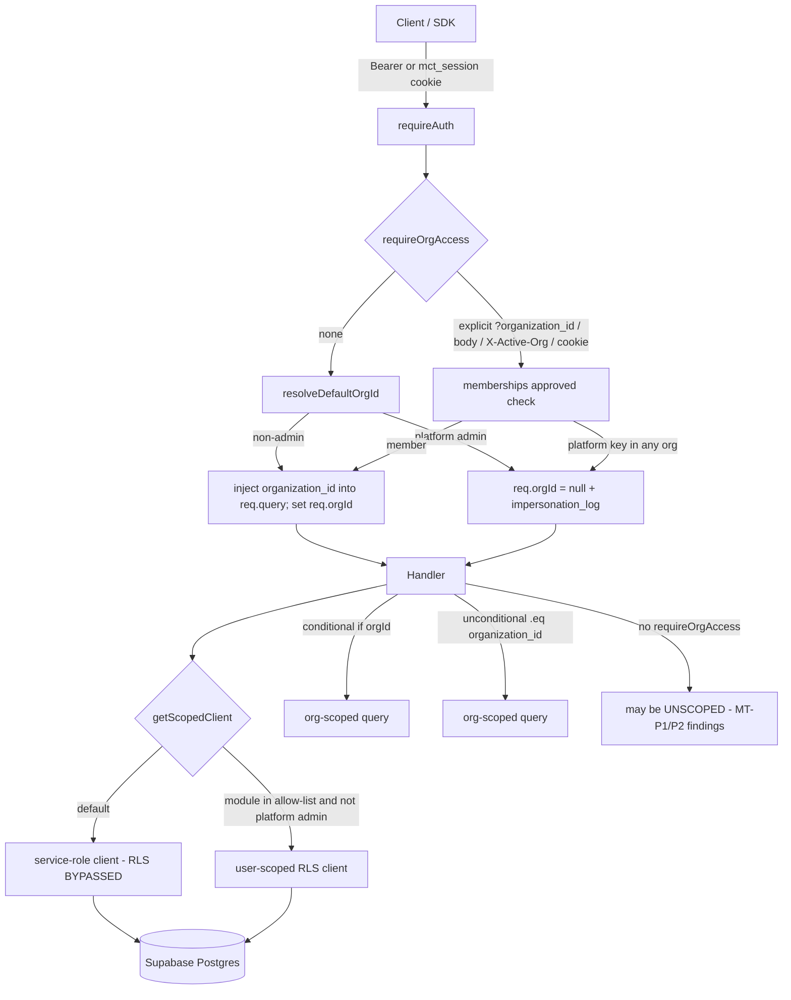

# Multi-Tenant Isolation Attack Simulation

## Audit Metadata

- Audit name: repo-deep-dive
- Run: 20261002-0344-develop-6286137
- Repository: C:/temp/mainecybertech
- Branch: develop
- Commit SHA: 6286137017c4b7c77e83ee420ec11382d984f263 (short `62861370`, dated 2026-10-01)
- Generated at: 2026-10-02
- Auditor: automated deep-dive subagent (prompt 25), static analysis only
- Area code: MT
- Output path: docs/audits/repo-deep-dive/20261002-0344-develop-6286137/25_multi_tenant_isolation_attack_simulation.md
- Scope limitations:
  - **Audit-only, no execution.** No requests were sent, no database or live system was touched. All conclusions are static reasoning over source, migrations, tests, and docs. Every dynamic step is marked `assumed` with what would confirm it.
  - The deployed values of `RLS_READS_ENABLED` / `RLS_WRITES_ENABLED` are GitHub/droplet **secrets** and are not in the repo, so "which modules are RLS-enforced in any environment" is `Unknown` (see sibling `37_supabase_rls_policy_deep_dive.md` §16).
  - This report does **not** re-derive RLS policy correctness (sibling `37`, `RLS-*`), general authn/authz (`06`, `SEC-*`), API contract drift (`08`, `API-*`), or exploit-chain composition (`45`, `CHAIN-*`). It cross-references them and focuses on **whether cross-tenant object access is possible via application-layer scoping on each access path**.
  - Sibling `24_access_control_matrix_audit.md` (ACM-*) was **not present** in this run folder at write time (only `06`, `07`, `08`, `09`, `10`, `11`, `12`, `13`, `20`, `32`–`38`, `45` exist). Cross-reference to ACM-* is therefore `Unknown`/pending.

## Scope

Reviewed (static evidence only):

- Tenant/org identity: `req.orgId`, `req.orgScope`, `X-Active-Org`, `mct_active_org` cookie, `?organization_id`.
- Membership/access gates: `requireOrgAccess`, `requireOrgAccessByParam`, `requireAdmin`, `requirePermission`, `assertSharesActiveOrg`, `assertOrgScopeMatches` (`apps/api/src/middleware/*`, `apps/api/src/lib/tenant.ts`).
- DB access paths: `getSupabaseAdmin`, `getScopedClient`, `getSupabaseUser` (`apps/api/src/services/supabase.ts`), and per-route query construction across all 62 route modules.
- By-id routes, list/filter endpoints, export endpoints, realtime/SSE channels, file/storage objects, search, background jobs, cache keys, admin overrides, invitations, webhooks, audit logs.
- The anon-key + JWT RLS path: grants (`5302116`), membership helpers (`is_org_member`, `is_org_approved_member`), storage object policies, and the API's default-to-service-role behavior.

Not reviewed here: UI-side rendering of tenant data (prompts 04/05), billing reconciliation (29), notification delivery (30), search indexing internals (31), and the deployed secret values.

## Evidence Reviewed

| Evidence | Type | Why relevant | Notes |
|---|---|---|---|
| `apps/api/src/services/supabase.ts:163-186` | Code | `getScopedClient` — the client selector that decides RLS vs service-role per request | Defaults to `getSupabaseAdmin()` unless `RLS_READS_ENABLED`/`RLS_WRITES_ENABLED` lists the module |
| `apps/api/src/middleware/org-access.ts:1-324` | Code | Resolves `req.orgId`/`req.orgScope`; injects `organization_id` into `req.query`; platform-admin/impersonation path | Conditional org filters rely on this injection |
| `apps/api/src/lib/tenant.ts:1-97` | Code | `assertResourceOrg`, `loadOwned` — entity→org verification helpers | 14 `assertResourceOrg` + 67 `loadOwned` call sites |
| `apps/api/src/routes/tickets.ts:104-120,499-543` | Code | By-id read/list; bulk update via service role + RPC | `GET /:id` filter is conditional on injected org |
| `apps/api/src/routes/projects.ts:188-203,365-466` | Code | `assertProjectInOrg`, `/:id/detail` with memberships/profiles/tasks | Explicit project-org gate on sub-routes |
| `apps/api/src/routes/documents.ts:244-257,301-461,566-592,925-971` | Code | By-id read, upload, signed-url, shares | Storage path `orgs/<uuid>/...`; explicit membership check on share routes |
| `apps/api/src/routes/audit.ts:9-88` | Code | Audit log list + export | `requireAuth, requireAdmin` only — **no `requireOrgAccess`** |
| `apps/api/src/routes/search.ts:27-101` | Code | Admin global search | `organizations` query has no org filter; `requireAdmin` gated |
| `apps/api/src/routes/dashboard.ts:13-52` | Code | `GET /summary` platform-wide counts | `requireAuth, requireAdmin` only |
| `apps/api/src/routes/business-os.ts:14-207` | Code | Platform-wide summary, recent-activity, org-health, snapshots | `requireAuth, requireAdmin` only |
| `apps/api/src/routes/notifications.ts:30-341` | Code | SSE stream + CRUD | Realtime channel filter is `user_id=eq.<uid>` only |
| `apps/api/src/middleware/cache.ts:154-227` | Code | Cache key construction | Key suffixed `:org=<orgId>` or `:user=<uid>` |
| `apps/api/src/routes/api-keys.ts:34-177` | Code | `loadOwned` + conditional org predicate | Fail-closed except explicit platform-admin impersonation |
| `apps/api/src/routes/webhook-management.ts:52-541` | Code | Dead-letter tenant scoping, `loadOwned`, `assertResourceOrg` | Strongest entity→org checks in the tree |
| `apps/api/src/routes/final/crud.ts:25-183`, `apps/api/src/routes/batch.ts:40-217` | Code | Shared by-id CRUD generators | **Unconditional** `.eq("organization_id", req.query.organization_id)` |
| `apps/api/src/routes/file-requests.ts:75-195` | Code | Public token upload path | `requirePermission` before auth/org middleware |
| `apps/api/src/routes/me.ts`, `apps/api/src/lib/permissions.ts:49-152` | Code | Permission union; org-scoping of overrides | `orgId` optional → unions across all orgs when null |
| `apps/worker/src/tasks/*.ts` | Code | Background jobs (scans, retention, webhook retry, notifications) | All use service role across all orgs by design |
| `supabase/migrations/5302026...v3.sql:668-682,760-796,997-1026,2300-2377` | Migration | Membership helpers, profiles/documents RLS, storage object policies | `storage_path_org_id` regex expects `<uuid>/...` |
| `supabase/migrations/5302116_grant_table_privileges.sql:33-35,60-70` | Migration | anon/authenticated full DML on all tables | RLS is the only gate for anon key |
| `supabase/migrations/5302111_harden_bulk_update_rpc.sql`, `5302129_supabase_rls_audit_fixes.sql` | Migration | Hardened definer RPCs (anon revoked) | `bulk_update_with_version`/`increment_article_count` |
| `docs/RLS-rollout.md`, `docs/adr/README.md` (ADR-008), `apps/api/.env.example` | Docs | RLS rollout posture | Allow-lists empty by default |
| Siblings `06`, `37`, `08`, `45` (this run) | Reports | Cross-reference targets | See "Cross-references" below |

## Verification Performed

| Evidence | Type | Why relevant | Notes |
|---|---|---|---|
| `rg "requireOrgAccess" apps/api/src/routes/*.ts` (per-file) | Command | Which routers mount the org gate | 14 router files do **not** reference `requireOrgAccess`: `admin.ts`, `analytics.ts`, `audit.ts`, `auth.ts`, `business-os.ts`, `dashboard.ts`, `docs.ts`, `health.ts`, `me.ts`, `public.ts`, `roles.ts`, `search-portal.ts`, `store.ts`, `webhooks.ts` |
| `rg requireAdmin` ∩ `¬requireOrgAccess` | Command | Admin-gated routers that never resolve a tenant scope | `admin.ts`, `analytics.ts`, `audit.ts`, `business-os.ts`, `dashboard.ts`, `roles.ts` |
| `rg "getScopedClient\("` | Command | Count of RLS-gated client selections | 333 call sites in `apps/api/src/routes/**` |
| `rg "getSupabaseAdmin\("` | Command | Count of service-role call sites in routes | 107 call sites (writes, admin-only, no-`req` paths) |
| `rg "loadOwned\("` / `assertResourceOrg\(` / `assertOrgScopeMatches\(` / `assertSharesActiveOrg\(` | Command | Entity→org gate adoption | 67 / 14 / 9 / 9 call sites respectively |
| Static re-derivation: does `requireOrgAccess` inject org when absent? | Manual | Determines whether `if (orgId)` filters are effective | **supported** — `org-access.ts:209-211` sets `req.query.organization_id = defaultOrgId` and `req.orgId` |
| Static re-derivation: storage writer vs `storage_path_org_id` | Manual | Cross-check the object-path contract | **unsupported (mismatch)** — writer emits `orgs/<uuid>/...`; helper regex requires `<uuid>/...` at string start |
| Static re-derivation: realtime filter | Manual | Whether SSE/Realtime can deliver another user's/org's rows | Channel filter is `user_id=eq.<uid>`; org is not in the filter (`assumed` that `notifications` RLS/Realtime auth does not widen it) |
| Static re-derivation: permission union when `orgId` is null | Manual | Whether a caller with a grant in org A can act on org B | **supported** — `resolveEffectivePermissions(userId, null)` unions all approved memberships (`lib/permissions.ts:77-95`) |
| Prior-run continuity diff (`20260728-0142-develop-21a10d6/25_...md`) | Manual | Confirm earlier MTI findings are not blindly copied | Prior MTI-001/002/004 (unscoped by-id fetches, no bulk filter) are **fixed**: tickets/projects/documents now filter by injected org; `bulk` document ops pre-filter via `resolveOwnedDocumentIds` |

Verification verdicts used below: `supported` / `partially supported` / `unsupported` / `not reproducible`; simulated/manual steps are marked `assumed`.

## Executive Summary

Since the prior run (`20260728`, commit `21a10d6`), the API has **substantially hardened application-layer tenant scoping**. The three CRITICALs from the prior report are remediated: tickets/projects/documents by-id reads now carry an org predicate, document bulk operations pre-filter IDs to the caller's org (`resolveOwnedDocumentIds`, `documents.ts:599-612`), and project sub-resource routes gate the parent project through `assertProjectInOrg`. Two shared CRUD generators (`final/crud.ts`, `batch.ts`) apply an **unconditional** org predicate on every by-id read/write, which is the most robust pattern in the tree. Entity→org helpers (`loadOwned`, `assertResourceOrg`) are used 67 and 14 times, respectively, and `webhook-management.ts` layers belt-and-braces checks.

The isolation model is nonetheless **application-layer-only for almost all traffic**: `getScopedClient` defaults to the service-role client, which bypasses RLS, and the RLS allow-lists (`RLS_READS_ENABLED`/`RLS_WRITES_ENABLED`) are empty by default (this is sibling `SEC-P2-005`; it is the single trust assumption under which every MT finding below must be read). Because the conditional `if (orgId)` pattern is effective only when `requireOrgAccess` has run and injected an org, the residual MT risks cluster in three places:

1. **Routers that never mount `requireOrgAccess`** but expose cross-tenant data (`audit.ts`, `dashboard.ts`, `business-os.ts`, `search.ts` organizations list) — these return or filter by caller-supplied `organization_id` with no server-side tenant pin.
2. **Paths where the entity→org check is the membership predicate itself but the caller can still reach it before the gate** (`file-requests.ts` public upload).
3. **The storage/first-party RLS contract** diverging from the writer (`orgs/<uuid>/` vs `<uuid>/`), and the Realtime/SSE channel scoping being user-only.

Overall domain score: **3 / 5** for tenant isolation — functional and meaningfully hardened, with several residual gaps and no automated cross-tenant regression proof. Strengths outweigh the August picture; the top actions are cheap.

Top 3 risks: a platform admin (or any `admin`/`super_admin` role in any org) reading **all tenants' audit logs and dashboards** (MT-P1-001, MT-P1-002); the **public file-request upload** accepting cross-tenant writes with a permission that is unioned across orgs (MT-P1-003).

## Inventory

| Item | Path / symbol | Purpose | Current state | Risk | Notes |
|---|---|---|---|---|---|
| Org scope resolution | `middleware/org-access.ts` `requireOrgAccess`, `requireOrgAccessByParam` | Resolve caller tenant, inject `organization_id` | Implemented, per-request | Low | 14 routers don't mount it |
| Client selector | `services/supabase.ts` `getScopedClient` | RLS vs service-role | Implemented, defaults service-role | High (single layer) | Cross-ref `SEC-P2-005` |
| Entity→org helpers | `lib/tenant.ts` `loadOwned`, `assertResourceOrg` | Verify a row's org before use | Implemented, partial adoption | Medium | 67/14 call sites |
| Body/param org assertions | `middleware/org-access.ts` `assertBodyOrgMatches`, `assertOrgScopeMatches`, `assertSharesActiveOrg` | Block cross-org targets in body | Implemented | Low | `assertBodyOrgMatches` runs inside `requireOrgAccess` |
| Tickets by-id | `routes/tickets.ts:104-120` | Read ticket + comments | Conditional `.eq("organization_id", orgId)` | Medium (see MT-P2-002) | Effective because of injection |
| Projects by-id/detail | `routes/projects.ts:188-203,341-466` | Read project, memberships, profiles, tasks | Explicit `assertProjectInOrg` + conditional filter | Low–Medium | `:id/detail` sub-queries scoped to `scopeOrgId` |
| Documents by-id/share | `routes/documents.ts` | Read, upload, signed-url, share CRUD | Conditional filter + explicit membership check on shares | Medium | Storage path mismatch (MT-P2-003) |
| Audit log | `routes/audit.ts` | List/export audit logs | `requireAdmin` only; conditional org filter | High | MT-P1-001 |
| Global search | `routes/search.ts` | Admin search across entities | `requireAdmin`; org-unfiltered `organizations` term | Medium | MT-P2-001 |
| Dashboards | `routes/dashboard.ts`, `routes/business-os.ts` | Platform aggregates, recent activity, org health | `requireAdmin` only | High | MT-P1-002 |
| Notifications SSE | `routes/notifications.ts:30-146` | Realtime notification stream | Filter `user_id=eq.<uid>` | Low–Medium | MT-P2-004 |
| Response cache | `middleware/cache.ts` | Cache GET responses | Key = path+query+`:org=`/`:user=` | Low | Fixes prior MTI-008 |
| API keys | `routes/api-keys.ts` | Org API keys | `loadOwned` + conditional predicate | Low | Fail-closed unless impersonation |
| Webhook mgmt | `routes/webhook-management.ts` | Endpoints, deliveries, dead letters | `loadOwned` + `assertResourceOrg` | Low | Reference pattern |
| Shared CRUD | `routes/final/crud.ts`, `routes/batch.ts` | Generic module CRUD | **Unconditional** org predicate | Low | Best pattern; adopt elsewhere |
| File requests | `routes/file-requests.ts` | Token upload for clients | `requirePermission` pre-auth | High | MT-P1-003 |
| Background jobs | `apps/worker/src/tasks/*` | Scans, retention, retry, notifications | Service-role, all-org by design | Low–Medium | Not user-reachable |
| Membership helpers RLS | `migrations/5302026...:668-682` | `is_org_member`, `is_org_approved_member` | Implemented | Low | Approved-status refinements in `5302100/5302112/5302129` |
| Storage object policy | `migrations/5302026...:2300-2377` + `5302026...:799-825` | Documents bucket access | Implemented | High (mismatch) | MT-P2-003 |

## Domain Scorecard

| Category | Score | Evidence | Gap | Recommended action |
|---|---:|---|---|---|
| Tenant/org/workspace IDs | 4 | `org-access.ts:7-11,71-82,176-254`; cookie/header/query precedence; `req.orgScope` exposed | Caller-supplied `organization_id` still trusted on routers without `requireOrgAccess` | Add a global assertion that `req.orgId` is set before any tenant read |
| Membership checks | 4 | `checkOrgAccess` `memberships` + `roles!inner`; `assertSharesActiveOrg`; `assertBodyOrgMatches` | Platform-admin cross-tenant path is role-key based and broad (8 keys) | Split `PLATFORM_ADMIN_KEYS` (cross-ref `CHAIN-P1-001`/`SEC-P2-002`) |
| DB queries | 3 | 333 `getScopedClient` + 107 `getSupabaseAdmin` call sites; conditional vs unconditional predicates | Conditional `if (orgId)` is safe only post-injection; some routers never inject | Prefer unconditional predicate pattern (`final/crud.ts`) |
| API routes | 3 | `app.ts:179-238`; 14 routers without `requireOrgAccess` | `audit`, `dashboard`, `business-os`, `analytics`, `roles` admin-only routers | Add explicit org scope or document/justify platform-wide |
| Server actions | 2 | Web talks to Supabase only via API (`AGENTS.md:216-217`) | No server actions touch the DB directly in this repo; Web is an API client | N/A here; verify web fetchers pass active org (prompts 04/05) |
| Client fetchers | 3 | SDK sends `X-Active-Org` (`AGENTS.md:285`); API re-resolves from cookie/header | Active-org header is attacker-supplyable but re-validated against membership | None beyond MT-P2-002 |
| RLS | 3 | `getScopedClient` allow-list; ADR-008; `5302116` broad grants | Empty allow-lists → RLS bypassed on API by default (cross-ref `SEC-P2-005`, `RLS-*`) | Execute staged RLS rollout; per-table readiness |
| Storage/file access | 3 | `documents.ts` bucket pinned; byte sniffing; storage policies | Writer path `orgs/<uuid>/` vs policy regex `<uuid>/` | Align path contract or fix helper (MT-P2-003) |
| Realtime channels | 3 | `notifications.ts:89-121` Realtime subscribe; SSE with 5-min JWT revalidation | Channel filter is user-only; no org in filter; RLS backstop unknown | Add explicit org assertion + document Realtime auth model (MT-P2-004) |
| Search/export | 3 | `tickets.ts`/`projects.ts`/`audit.ts` `/export`; `search.ts` scoping | `audit` export unscoped; `search` organizations unfiltered | Scope exports and search to resolved org |
| Admin overrides | 3 | `lib/permissions.ts` overrides applied per org; `impersonation_log` on cross-tenant | Broad platform-admin roles; no alerting | Split roles; alert on impersonation (cross-ref `IR-P1-006`/`IR-P2-002`) |
| Invitations | 4 | `bulk.ts` invite; `bulk/…` gated by `requireOrgAccess` + `assertBodyOrgMatches` | No `requirePermission("memberships","create")` on bulk invite (cross-ref `SEC-P2-001` family) | Add permission check |

## Detailed Review

### Item: Org scope resolution (`requireOrgAccess`)

- Evidence: `apps/api/src/middleware/org-access.ts:7-11,71-82,176-254`.
- What it does: Resolves the caller's tenant from `?organization_id` → `body.organizationId` → `X-Active-Org` → `mct_active_org`; verifies an approved membership; supports a platform-admin cross-tenant (impersonation) path that is audited via `logImpersonation`; writes `req.orgId`/`req.orgScope` and, when no explicit org is present, **injects** the resolved org into `req.query.organization_id` (`:209-211`).
- How it appears to work: For a non-platform user with one membership, every downstream `if (orgId)` filter becomes effective because the query now carries the resolved org. For an **org-agnostic platform admin**, `req.orgId` stays `null` and no query is injected.
- Dependencies: `memberships`/`roles` tables, `isPlatformAdminKey`, `logImpersonation`.
- Current controls: Per-request evaluation; injected org; `assertBodyOrgMatches` blocks body/query org mismatch for non-admins.
- Missing controls: The injection is the *only* thing making `if (orgId)` safe; routers that don't mount this middleware get no injection.
- Risks: Any route using `if (orgId)` without this middleware silently degrades to unscoped.
- Recommended improvement: Make the resolved scope a hard precondition for tenant reads (e.g. a `requireTenantScope` guard or an assertion in a shared query helper).
- Suggested tests: For every tenant-scoped route, a test that omitting `?organization_id` still scopes to the caller's org.
- Suggested docs: Document the injection contract and the "no `requireOrgAccess` ⇒ no `req.orgId`" rule in `AGENTS.md`.

### Item: Client selector (`getScopedClient`)

- Evidence: `apps/api/src/services/supabase.ts:144-186`; `apps/api/.env.example` (allow-lists empty); `docs/RLS-rollout.md`.
- What it does: Returns a user-scoped (RLS) client only for modules listed in `RLS_READS_ENABLED`/`RLS_WRITES_ENABLED`; otherwise the service-role client. Platform admins remain on service role even when enabled.
- Current controls: Opt-in allow-list; platform-admin bypass is intentional.
- Missing controls: Default is bypass; the allow-list is a secret so coverage is unknown.
- Risks: No RLS backstop for any application-layer scoping regression. This is the umbrella trust assumption for this report. (Cross-ref `SEC-P2-005`.)
- Recommended improvement: Track per-module enablement in a non-secret manifest; add a CI check that flags `getSupabaseAdmin()` reads on tenant tables not yet allow-listed.
- Suggested tests: Cross-tenant regression suite that runs each module under both clients.
- Suggested docs: Extend `docs/RLS-rollout.md` with a status matrix.

### Item: Shared CRUD generators (`final/crud.ts`, `batch.ts`)

- Evidence: `apps/api/src/routes/final/crud.ts:85-164`; `apps/api/src/routes/batch.ts:92-163`.
- What it does: Emit `GET/PATCH/DELETE /:path/:id` with an **unconditional** `.eq("organization_id", req.query.organization_id)`.
- How it appears to work: Because `requireOrgAccess` runs on the router, `req.query.organization_id` is always populated for non-platform users → fail-closed. For an un-pinned platform admin, `organization_id` is `undefined`; `.eq(col, undefined)` matches no rows → still fail-closed (but an org-agnostic admin therefore cannot read these tables without an explicit `?organization_id`, which is the correct posture).
- Current controls: Unconditional predicate; `requirePermission` on writes.
- Missing controls: Uses `getSupabaseAdmin` for `final/crud.ts` reads (no RLS backstop), but the predicate is unconditional.
- Risks: Low. This is the model the rest of the tree should adopt.
- Recommended improvement: Extract this pattern into a shared helper and migrate conditional-filter routes to it.

### Item: Audit log and platform dashboards

- Evidence: `routes/audit.ts:9-88`; `routes/dashboard.ts:10-52`; `routes/business-os.ts:11-207`.
- What it does: `audit.ts` lists/exports `audit_logs` filtered only when a caller-supplied `organization_id` is present; `dashboard.ts` and `business-os.ts` return platform-wide counts/lists to any `admin`/`super_admin`-role holder.
- Current controls: `requireAdmin` (approved membership with role key `admin`/`super_admin` in **any** org).
- Missing controls: No `requireOrgAccess`; no server-side tenant pin; no impersonation audit for these reads.
- Risks: An admin in a single client org can read every tenant's audit trail and cross-tenant aggregates. See MT-P1-001 / MT-P1-002.

### Item: Public file-request upload

- Evidence: `routes/file-requests.ts:75-195` (routes declared before `router.use(requireAuth)`/`requireOrgAccess` at `:197-198`).
- What it does: Fetches a `file_requests` row by token and uploads the file into `data.storage_path`, with `requirePermission("file-requests", "create")` as the only gate.
- How it appears to work: `requirePermission` needs `req.authUser` (401 for anon), so the endpoint requires a JWT. Because `requireOrgAccess` has not run, `extractOrgId` returns null and `resolveEffectivePermissions(userId, null)` unions grants across **all** the caller's orgs. A user granted `file-requests:create` in org A therefore passes for a token belonging to org B and uploads into org B's request folder.
- Current controls: Token validity, status/expiry/max-files, byte sniffing, per-request MIME allow-list.
- Missing controls: No entity→org check binding the caller to the request's org; no `requireOrgAccess`.
- Risks: Cross-tenant file write / quota consumption. See MT-P1-003.

### Item: Storage object access contract

- Evidence: `routes/documents.ts:337` (`orgs/${organizationId}/…`); `migrations/5302026...:799-825` (`storage_path_org_id` regex `^([uuid])(/|$)`); `migrations/5302026...:2318-2337` (insert `with check` requires `storage_path_org_id(name) is not null`).
- What it does: The API writes objects under `orgs/<uuid>/…`; the RLS helper derives an org only if the path **starts** with the raw UUID.
- How it appears to work: For `orgs/<uuid>/…`, `storage_path_org_id` returns `null`, so with RLS enabled the insert check fails (fails closed → upload denied), and the read/delete policies also cannot derive an org. Today the API uploads with the service role, so RLS is bypassed and real uploads work — masking the divergence.
- Current controls: Bucket pinned server-side; per-object unique path; service-role upload.
- Missing controls: No test asserting the storage path contract; helper and writer disagree.
- Risks: If the `documents` module is ever added to `RLS_WRITES_ENABLED`, uploads break (availability), and any user-scoped read of the bucket would be unable to derive the org. See MT-P2-003 (cross-ref `RLS-P3-003`).

### Item: Realtime / SSE notifications

- Evidence: `routes/notifications.ts:30-146`.
- What it does: Opens a Supabase Realtime channel `notifications:<uid>` subscribed to `postgres_changes` on `notifications` with `filter: user_id=eq.<uid>`, and revalidates the signed JWT every 5 minutes locally.
- How it appears to work: Delivery is keyed by user; org is not part of the filter. The initial unread fetch filters `user_id` + `read=false` only.
- Current controls: JWT verification on connect; periodic expiry check; `sanitizeNotification` strips fields.
- Missing controls: No org assertion on the channel; relies on Realtime/`notifications` RLS to not widen beyond `user_id` (deployment-dependent → `assumed`).
- Risks: If the Realtime auth/RLS path is permissive, org-crossing notification rows could stream. Low likelihood given the user filter. See MT-P2-004.

### Item: Cache keys

- Evidence: `middleware/cache.ts:154-168`.
- What it does: Builds keys from full path + serialized query, suffixed `:org=<req.orgId>` when present else `:user=<uid>`.
- Current controls: Org or user suffix; prefix-based invalidation.
- Missing controls: For an un-pinned platform admin, `req.orgId` is null and the key falls back to `:user=`; and the query is part of the key, so an attacker-supplied `organization_id` changes the key but not the scope (scope comes from the query too). Prior-run MTI-008 (nonexistent `authUser.orgId`) is **fixed** (`supported`).
- Risks: Low; the key is an identity/scope discriminator, not a bypass.

### Item: Background jobs

- Evidence: `apps/worker/src/tasks/*.ts`.
- What it does: All tasks use the service-role client and iterate across all orgs (scans, retention, webhook retry, notification fan-out), scoping notifications by the row's `organization_id`.
- Current controls: Jobs are not user-reachable; notification writes carry the correct org.
- Missing controls: No per-tenant allow-list; global `retention` deletes `audit_logs` older than 365 days across every tenant (cross-ref `DATA-P2-005`, `CHAIN-P2-006`).
- Risks: System-wide operations are correct-by-design, but destructive global jobs have no tenant-level guard. MT-P3-001.

## Scenario / Control Matrix

| ID | Scenario or control | Evidence | Current control | Gap | Severity | Recommendation |
|---|---|---|---|---|---|---|
| MT-001 | Tenant/org/workspace IDs | `org-access.ts:7-11,176-254` | Resolved + injected; membership verified | Caller-supplied org trusted where middleware absent | P2 | Require resolved scope before tenant reads |
| MT-002 | Membership checks | `org-access.ts:27-63`, `lib/tenant.ts:96-97` | Approved-membership + entity→org helpers | Platform-admin path broad (8 role keys) | P1 | Split role keys; audit cross-tenant reads |
| MT-003 | DB queries | `supabase.ts:163-186`; `final/crud.ts:85-164` | Unconditional predicate in shared CRUD; conditional elsewhere | Default service-role (no RLS backstop) | P2 | Staged RLS rollout; prefer unconditional predicates |
| MT-004 | API routes | `app.ts:179-238`; 14 routers w/o `requireOrgAccess` | Middleware layering per router | Admin routers expose cross-tenant data | P1 | Add org scope or justify |
| MT-005 | Server actions | `AGENTS.md:216-217` | Web is API-only | None in-repo | P3 | Confirm web fetchers (prompts 04/05) |
| MT-006 | Client fetchers | `AGENTS.md:285` | `X-Active-Org` re-validated vs membership | Header attacker-supplyable | P2 | Assert body/param org (MT-P2-002) |
| MT-007 | RLS | `getScopedClient`; `5302116` | Allow-list + policies | Empty allow-list; broad anon grants | P2 | Rollout + per-table readiness (`RLS-*`) |
| MT-008 | Storage/file access | `documents.ts:337`; `5302026...:799-825,2318-2337` | Bucket pinned; service-role upload | Path contract mismatch | P2 | Align writer/helper (MT-P2-003) |
| MT-009 | Realtime channels | `notifications.ts:89-121` | `user_id=eq.<uid>` filter; JWT revalidation | No org in filter; RLS unknown | P2 | Add org assertion; document model |
| MT-010 | Search/export | `search.ts:27-101`; `audit.ts:60-88` | Caller-supplied org filter | Unscoped audit export; org list | P1 | Scope by resolved org |
| MT-011 | Admin overrides | `lib/permissions.ts`; `impersonation_log` | Overrides per org; impersonation audited | Broad roles; no alerting | P2 | Split roles; alert (`IR-P1-006`) |
| MT-012 | Invitations | `bulk.ts:33-189` | `requireOrgAccess` + `assertBodyOrgMatches` | No `memberships:create` permission | P2 | Add permission check |

## Findings

### Finding ID: MT-P1-001 - Audit log list and export are not org-scoped by default

- Severity: P1
- Confidence: High
- Area: API routes / audit logs / export
- Evidence:
  - `apps/api/src/routes/audit.ts:11` — `router.use(requireAuth, requireAdmin)` (no `requireOrgAccess`)
  - `apps/api/src/routes/audit.ts:20-25` and `:64-69` — `audit_logs` query filters `organization_id` **only** `if (orgId)`, where `orgId = req.query.organization_id`
  - `apps/api/src/middleware/admin.ts:14-30` — `requireAdmin` passes if the user holds an `admin`/`super_admin` role in **any** approved membership; it does not scope to an org
  - `apps/api/src/services/supabase.ts:185` — default service-role client (RLS bypassed)
- What is happening: A user who is an `admin`/`super_admin` in a single client org can call `GET /api/v1/audit` (and `/api/v1/audit/export`) **without** `?organization_id`; the query is then unscoped and returns every tenant's audit rows via the service-role client. The audit trail includes `actor_user_id`, `entity_type`, `entity_id`, and `metadata`.
- Why it matters: This is a direct cross-tenant read of the platform's most sensitive operational record, available to a role that is granted per client org. There is no `requireOrgAccess`, no injected org, and no RLS backstop on this router.
- User / business impact: Any single-tenant admin can enumerate all customers' activity, entity IDs, and metadata — a serious trust and confidentiality breach.
- Security / privacy / reliability impact: Cross-tenant data exposure (P1). No impersonation audit is written for these reads because they bypass `requireOrgAccess`.
- Recommended fix: Add `requireOrgAccess` to `audit.ts` and make the org predicate unconditional (`.eq("organization_id", req.orgId)`); for the org-agnostic platform-admin case, require an explicit `?organization_id` and log via `withServiceRole`/`logImpersonation`.
- Suggested validation: As an admin of org A, `GET /audit` with no `?organization_id` returns only org A rows; `GET /audit/export` likewise; a platform admin without an explicit org is forced to supply one.
- Owner suggestion: API team + security.
- Effort estimate: S.
- Dependencies: None.
- Status: open
- Endpoint / data path: `GET /api/v1/audit`, `GET /api/v1/audit/export` → `from("audit_logs")` → service-role PostgREST.
- Attack path: Approved `admin` in org A → `GET /api/v1/audit` (no query) → all tenants' audit rows. Relates to `CHAIN-P1-001` (low-trust MSP role pivot) but is reachable with a plain `admin` role in a single client org.

### Finding ID: MT-P1-002 - Platform dashboards expose all-tenant aggregates to any single-org admin

- Severity: P1
- Confidence: High
- Area: API routes / dashboards
- Evidence:
  - `apps/api/src/routes/dashboard.ts:10-11,13-52` — `requireAuth, requireAdmin`; `GET /summary` counts all `organizations`/`tickets`/`projects`/`documents` and `memberships where status='pending'`
  - `apps/api/src/routes/business-os.ts:11-12,14-207` — `requireAuth, requireAdmin`; `GET /summary` (all orgs + recent list), `GET /recent-activity` (latest `audit_logs` across all orgs, `:117-121`), `GET /org-health` (per-org ticket/project counts, `:131-191`)
  - `apps/api/src/middleware/admin.ts:14-30` — any `admin`/`super_admin` in any org passes
- What is happening: `business-os /recent-activity` returns the newest `audit_logs` rows globally (no `organization_id` filter at all), and `/org-health` returns a per-tenant operational snapshot. `dashboard /summary` returns platform-wide totals. All are reachable by a single-org admin with no cross-tenant audit record.
- Why it matters: Business-sensitive cross-tenant intelligence (customer names, ticket/project volumes, recent activity) is exposed to any client-org admin. This is the same trust-level issue as MT-P1-001 but via aggregate surfaces.
- User / business impact: Competitive/tenant intelligence leakage; reputational risk if a client admin sees other customers.
- Security / privacy / reliability impact: Cross-tenant data exposure (P1); no impersonation trail.
- Recommended fix: Gate these routers with `requireAdmin` + explicit super-admin requirement (as `admin.ts /organizations` does at `:24-32`), or restrict to `platform`-scoped roles verified against a dedicated flag, and log every platform-wide access.
- Suggested validation: A single-org admin receives only their org's figures (or 403); a genuine platform admin sees global figures and an audit entry is written.
- Owner suggestion: API team + product.
- Effort estimate: S–M.
- Dependencies: Decide which roles are "platform" vs "client admin".
- Status: open
- Endpoint / data path: `GET /api/v1/dashboard/summary`, `GET /api/v1/business-os/summary|recent-activity|org-health|snapshots`.
- Attack path: Single-org `admin` → `GET /business-os/recent-activity` → all tenants' recent audit activity.

### Finding ID: MT-P1-003 - Public file-request upload authorizes with a permission unioned across all orgs

- Severity: P1
- Confidence: Medium
- Area: API routes / storage / invitations of client uploads
- Evidence:
  - `apps/api/src/routes/file-requests.ts:75-195` — public routes are registered **before** `router.use(requireAuth); router.use(requireOrgAccess);` at `:197-198`
  - `apps/api/src/routes/file-requests.ts:109-147` — `POST /public/:token/upload` gates on `requirePermission("file-requests", "create")`, then reads `file_requests` by token and uploads to `data.storage_path` with no entity→org check
  - `apps/api/src/middleware/permissions.ts:34-52` — `requireOrgAccess` has not run, so `extractOrgId` returns `null`
  - `apps/api/src/lib/permissions.ts:77-82` — `resolveEffectivePermissions(userId, null)` unions grants across all approved memberships
- What is happening: A user who holds `file-requests:create` in org A passes the permission gate for a token that belongs to org B, and the upload is written into org B's request folder (`data.storage_path`), incrementing org B's `upload_count`. The endpoint requires a JWT (because `requirePermission` needs `req.authUser`) even though it is modelled as a public link.
- Why it matters: Cross-tenant write + storage quota consumption with only a token (which is shared with external clients by design). The gate does not bind the caller to the request's org.
- User / business impact: A client of org A can inject files into org B's intake and consume its limits; org B's staff receive notifications for files they did not solicit.
- Security / privacy / reliability impact: Cross-tenant integrity exposure (P1); potential malware delivery into a victim org's intake.
- Recommended fix: Bind the caller to the request's org — e.g. require `requireOrgAccess`, then verify `file_requests.organization_id === req.orgId`, or (if the link is truly public) remove the JWT requirement and treat the token as the sole capability with strict rate limiting and a server-chosen path derived from the request row.
- Suggested validation: A user with `file-requests:create` only in org A uploads to an org B token → 403/404 and no object is written; uploads to an own-org token succeed.
- Owner suggestion: API team.
- Effort estimate: S–M.
- Dependencies: Product decision on whether clients authenticate for upload links.
- Status: open
- Endpoint / data path: `POST /api/v1/file-requests/public/:token/upload` → `from("file_requests").eq("token",…)` → `storage.from("documents").upload("<storage_path>/…")`.
- Attack path: Org A user with `file-requests:create` → obtains/receives an org B token → writes into org B storage.

### Finding ID: MT-P2-001 - Admin global search lists all organizations and can fall through unscoped

- Severity: P2
- Confidence: High
- Area: API routes / search
- Evidence:
  - `apps/api/src/routes/search.ts:12` — `router.use(requireAuth, requireAdmin, requireOrgAccess)`
  - `apps/api/src/routes/search.ts:27-56` — the `organizations` query (`:93-97`) has **no** org filter at all, and the `userQuery` falls through unscoped when `adminOrgIds.length === 0` (`:51-56`)
  - `apps/api/src/routes/search.ts:22` — service-role client
- What is happening: `GET /api/v1/search?q=…` returns matching `organizations` (name/slug/status) across the whole platform to any admin, and if the caller somehow has no approved memberships the user/ticket/project/document queries are issued without an org filter. `requireOrgAccess` does inject an org for non-platform users, but the `organizations` query ignores it.
- Why it matters: Tenant directory enumeration; the unscoped fallback contradicts the "scope to the admin's organizations" intent stated in the comment at `:26`.
- User / business impact: Minor-to-moderate cross-tenant information disclosure (customer names/slugs).
- Security / privacy / reliability impact: Cross-tenant read (P2); the fallthrough is a latent scoping bug.
- Recommended fix: Constrain the `organizations` query to the caller's resolved org (or to `adminOrgIds`), and make `userFinal` default to an empty result (not all profiles) when `adminOrgIds` is empty.
- Suggested validation: As an admin of org A, searching a substring present only in org B's name returns nothing; with zero memberships, search returns empty lists.
- Owner suggestion: API team.
- Effort estimate: S.
- Dependencies: None.
- Status: open
- Endpoint / data path: `GET /api/v1/search?q=` → `from("organizations").or("name.ilike…,slug.ilike…")`.
- Attack path: Single-org admin → search by guessable substring → enumerate other tenants.

### Finding ID: MT-P2-002 - By-id org filters are conditional, so they fail open if the org gate is not reached

- Severity: P2
- Confidence: High
- Area: DB queries / API routes
- Evidence:
  - `apps/api/src/routes/tickets.ts:106-113`, `:210-212`, `:288-290`, `:315-320`, `:470-480` — `if (orgId) query = query.eq("organization_id", orgId)`
  - `apps/api/src/routes/documents.ts:246-249`, `:473-477`, `:568-575` — same conditional pattern
  - `apps/api/src/middleware/org-access.ts:209-211` — the org is injected into `req.query` only when `requireOrgAccess` runs
  - Contrast: `apps/api/src/routes/final/crud.ts:88-93`, `apps/api/src/routes/batch.ts:95-100` — unconditional `.eq("organization_id", req.query.organization_id)`
- What is happening: The conditional form is safe **only** when the router mounts `requireOrgAccess` and the middleware injects the org. If a future route is added without the middleware, or a handler reads `req.params.id` before the filter is applied in a refactor, the query degrades to an unscoped by-id fetch against the service-role client. The unconditional form in `final/crud.ts`/`batch.ts` is immune to that mistake.
- Why it matters: The current safety is an emergent property of two files (router mount + middleware injection) rather than a local invariant. This is exactly the class of bug the prior run found (MTI-001/002) and that this cycle fixed; the fix reduced blast radius but did not remove the footgun.
- User / business impact: Potential future cross-tenant read/write if the pattern is violated.
- Security / privacy / reliability impact: Latent cross-tenant exposure (P2); no RLS backstop (service-role default).
- Recommended fix: Migrate conditional by-id filters to unconditional predicates using `req.orgId`, or introduce a `tenantQuery(req, table)` helper that always applies the org and throws if `req.orgId` is unset for a non-platform user.
- Suggested validation: A route-level test that calls every `GET /:id` without `?organization_id` and asserts the query includes the caller's org; a lint/grep gate that fails on `if (orgId)` around `organization_id`.
- Owner suggestion: API team.
- Effort estimate: M.
- Dependencies: `req.orgId` population contract.
- Status: open
- Endpoint / data path: All `GET/PATCH/DELETE /:id` in `tickets.ts`, `projects.ts`, `documents.ts`, and other conditional-filter routers.
- Attack path: none identified today (conditional form is safe post-injection); this is a regression-enabling weakness, not a live exploit.

### Finding ID: MT-P2-003 - Storage writer path and RLS org-derivation disagree (`orgs/<uuid>/` vs `<uuid>/`)

- Severity: P2
- Confidence: High (static mismatch); Medium that it is live (depends on module RLS enablement, which is a secret)
- Area: Storage/file access / RLS
- Evidence:
  - `apps/api/src/routes/documents.ts:337` — `const storagePath = \`orgs/${organizationId}/${Date.now()}-${safeName}\``
  - `supabase/migrations/5302026...:801-814` — `storage_path_org_id` regex `^([0-9a-fA-F]{8}-…)(/|$)` requires the raw UUID at string start
  - `supabase/migrations/5302026...:2318-2337` — insert policy `with check (… storage_path_org_id(name) is not null …)`
  - `apps/api/src/routes/file-requests.ts:252` — a second writer uses `uploads/requests/<token>` (also non-UUID-prefixed)
- What is happening: For every document uploaded through the API, `storage_path_org_id('orgs/<uuid>/…')` returns `null` (the first segment is `orgs`, not a UUID), so the `documents` insert/update/delete storage policies cannot derive an org. Today uploads succeed only because the API uses the service-role client (RLS bypassed, per `SEC-P2-005`). If `documents` is added to `RLS_WRITES_ENABLED`, uploads would be denied, and any user-scoped bucket read would be unable to authorize.
- Why it matters: The storage isolation contract is inconsistent between the writer and the policy. It fails closed (denial) rather than open, so it is not a live cross-tenant leak — but it breaks the rollout story and could push an operator to widen a policy under pressure.
- User / business impact: Upload/version-replacement outages when the module is RLS-enabled; risk of an emergency loosening of the storage policy.
- Security / privacy / reliability impact: Availability and defense-in-depth integrity (P2). Cross-ref `RLS-P3-003`, which covers the "name-derived org" trust issue; this finding adds the concrete prefix mismatch.
- Recommended fix: Make the writer emit `<org_uuid>/<…>` (drop the `orgs/` prefix) and likewise align `file-requests`/logo/avatar paths, **or** update `storage_path_org_id` to parse the `orgs/<uuid>/` and `uploads/...` forms. Add a test asserting the writer path satisfies the policy helper.
- Suggested validation: `select public.storage_path_org_id('orgs/<uuid>/x')` returns `null` today; after the fix it returns the UUID; with `documents` in `RLS_WRITES_ENABLED`, an approved member uploads successfully and a non-member is denied.
- Owner suggestion: DB owner + API team.
- Effort estimate: S.
- Dependencies: `documents` module RLS enablement decision.
- Status: open
- Endpoint / data path: `POST /api/v1/documents/upload` → `storage.from("documents").upload("orgs/<org>/…")` → `storage.objects` policy `storage_path_org_id(name)`.
- Attack path: none identified (fails closed); misconfiguration/availability chain only.

### Finding ID: MT-P2-004 - Realtime/SSE notification channel is scoped by user only, with no org assertion

- Severity: P2
- Confidence: Medium
- Area: Realtime channels / notifications
- Evidence:
  - `apps/api/src/routes/notifications.ts:89-121` — `supabase.channel(\`notifications:${userId}\`).on("postgres_changes", { table: "notifications", filter: \`user_id=eq.${userId}\` }, …)`
  - `apps/api/src/routes/notifications.ts:124-136` — initial fetch filters `user_id` + `read=false` only
  - `apps/api/src/services/supabase.ts:163-186` — `getScopedClient(req, "notifications", "read")`; with `notifications` not allow-listed this is the service-role client, so the subscription is not itself RLS-constrained by the module flag
- What is happening: The stream delivers rows matching `user_id`. Org is not part of the filter, and the JWT revalidation checks only signature/expiry, not org membership. If the Realtime authorization for the `notifications` table is unset or permissive in the hosted project, the filter is the sole scope. Whether Realtime enforces `notifications` RLS is not visible from the repo (`assumed`).
- Why it matters: Notifications can carry module IDs and titles from multiple orgs for a user who belongs to several orgs, and the channel does not constrain the active org. A user switching active orgs may still receive rows for other orgs they belong to (lower severity), but if RLS/Realtime auth is misconfigured the filter could be bypassed.
- User / business impact: Minor cross-org notification leakage; no direct record bodies (`sanitizeNotification` strips fields).
- Security / privacy / reliability impact: Defense-in-depth gap for realtime (P2).
- Recommended fix: Add the active org to the `filter` (`user_id=eq.<uid>&organization_id=eq.<orgId>`) or assert in the payload handler that `payload.new.organization_id === req.orgId` before writing to the stream; document the Realtime auth model and confirm RLS is enabled on `notifications`.
- Suggested validation: With a user in orgs A and B and active org A, an insert for org B does not appear on the stream; an insert for org A does.
- Owner suggestion: API team + DB owner.
- Effort estimate: S.
- Dependencies: Hosted Realtime configuration (not in repo).
- Status: open
- Endpoint / data path: `GET /api/v1/notifications/stream` (SSE) → Supabase Realtime `postgres_changes` on `notifications`.
- Attack path: `assumed` — if Realtime does not enforce `notifications` RLS, an authenticated user could subscribe with an arbitrary `user_id` filter; what would confirm: an integration test subscribing as user A for user B's notifications.

### Finding ID: MT-P2-005 - Platform-admin cross-tenant access is role-key based, broad, and unalerted

- Severity: P2
- Confidence: High
- Area: Admin overrides / membership
- Evidence:
  - `apps/api/src/lib/roles.ts:9-22` — `PLATFORM_ADMIN_KEYS` contains 8 keys: `super_admin`, `admin`, `dispatcher`, `engineer`, `security-analyst`, `project-manager`, `finance`, `onboarding-specialist`
  - `apps/api/src/middleware/org-access.ts:43-59,110-124` — any one of those keys in **any** approved membership grants cross-tenant switch/access, audited to `impersonation_log`
  - `apps/api/src/lib/tenant.ts:42-55` — `assertResourceOrg` allows the org-agnostic platform admin through and logs `cross_tenant_resource_access`
  - `docs/audits/.../33_incident_tabletop_exercise.md` (IR-P1-006, IR-P2-002) — no runtime detection/alerting for tenant-isolation abuse
- What is happening: `isPlatformAdminKey` treats every MSP-internal role as fully cross-tenant for **org access**. That is by design, but `requireAdmin` (the only gate on the audit/dashboard routers above) recognizes just `admin`/`super_admin`; the mismatch means the broad key set does not uniformly confer the platform-wide reads in MT-P1-001/002, while it does confer cross-tenant object access elsewhere. Combined with no alerting, cross-tenant traversal is quiet.
- Why it matters: A low-trust MSP role (e.g. `onboarding-specialist`) can traverse tenants on `requireOrgAccess`-gated routes; the only record is a service-role `impersonation_log` row with no alert. This is the same theme as sibling `SEC-P2-002` and `CHAIN-P1-001`; this finding records the MT-scoping angle (which routes this key set reaches) rather than re-deriving the chain.
- User / business impact: Tenant data access by any MSP role; reputational exposure.
- Security / privacy / reliability impact: Broad cross-tenant authorization (P2); insufficient detection.
- Recommended fix: Split `PLATFORM_ADMIN_KEYS` into "cross-tenant read" vs "cross-tenant write" vs "org member" tiers; require an explicit, time-boxed grant or break-glass for cross-tenant access; alert on `impersonation_log` writes.
- Suggested validation: With MFA/flag on, a `dispatcher` (or `onboarding-specialist`) cannot read an org it is not a member of unless a platform grant exists; every cross-tenant access emits an alert.
- Owner suggestion: Platform lead + security.
- Effort estimate: M–L.
- Dependencies: Role taxonomy; alerting path.
- Status: open
- Endpoint / data path: Any `requireOrgAccess`-gated route with `?organization_id=<victim>` or an active-org switch.
- Attack path: Leaked low-trust MSP credential → cross-tenant reads (composition detailed in `CHAIN-P1-001`).

### Finding ID: MT-P2-006 - Platform-wide report generators run as service role with no tenant guard on scope inputs

- Severity: P2
- Confidence: Medium
- Area: Background jobs / reports / exports
- Evidence:
  - `apps/worker/src/tasks/module-tasks.ts:991-1124` — `qbrScheduledGenerate` iterates every draft `qbr_reports` row and builds `report_data` from that row's `organization_id` via the service-role client
  - `apps/worker/src/tasks/module-tasks.ts:1286-1350` — `businessOsSnapshot` computes org-wide metrics for all orgs
  - `apps/worker/src/tasks/retention.ts:41-61` — global `audit_logs`/`notifications` purge with no per-tenant guard
- What is happening: Report/snapshot/purge jobs operate globally with the service role. Per-org fan-out is keyed on each row's `organization_id`, which is correct, but the jobs accept a caller-supplied `payload` merged over defaults (`retention.ts:20-23`) with no tenant scoping, and there is no guard preventing a job invocation from acting on another tenant's data if the payload is ever exposed to a lower-trust caller (the queue producer is `enqueueTask`).
- Why it matters: If queue payloads become user-influenced (e.g. via `webhook-management` retry or future admin tooling), a global service-role task with no tenant check is a high-blast-radius primitive.
- User / business impact: Low today; latent risk if job invocation gains a user-facing trigger.
- Security / privacy / reliability impact: Defense-in-depth for background jobs (P2).
- Recommended fix: Keep destructive/global tasks service-role-only and unreachable from user input; when enqueuing tenant work, pass and validate the org in the handler; add a guard that rejects payloads that attempt to widen scope.
- Suggested validation: A queued task with a mismatched org payload is rejected or ignored; a job cannot read another tenant's rows without an explicit platform grant.
- Owner suggestion: Worker/queue owner.
- Effort estimate: S–M.
- Dependencies: Task producer contract (`lib/task-producer.ts`).
- Status: open
- Endpoint / data path: `apps/worker/src/tasks/*` via queue → service-role Supabase.
- Attack path: none identified (no user-facing trigger today).

### Finding ID: MT-P3-001 - No automated cross-tenant isolation regression suite for application-layer scoping

- Severity: P3
- Confidence: High
- Area: Tests / tenant isolation
- Evidence:
  - `apps/api/src/__tests__/get-scoped-client.test.ts`, `apps/api/src/__tests__/supabase-scoped-client.test.ts` — cover client **selection**, not behavior
  - `apps/api/src/middleware/*.test.ts` — dedicated suites exist for org-access/permissions/subscription/admin middleware
  - No test file asserts "as user in org A, `GET /<module>/:id` for an org B row returns 404" across the route tree (grep for `organization_id` cross-tenant fixtures in route suites returns none)
- What is happening: Middleware behavior is well tested, but the end-to-end property "no route returns another tenant's object without an explicit platform grant" is not encoded as a suite. The conditional-filter pattern (MT-P2-002) therefore depends on convention, not on a failing test.
- Why it matters: Without a cross-tenant regression gate, the next refactor can silently reintroduce MTI-001/002/004-class bugs.
- User / business impact: Increased risk of future tenant-data exposure.
- Security / privacy / reliability impact: Test-coverage gap (P3).
- Recommended fix: Add a parameterized API test suite (per route module) that authenticates as org A, requests known org B IDs, and asserts 403/404; run it in CI with both the service-role and (where enabled) RLS client.
- Suggested validation: The suite fails if any by-id route drops its org predicate; CI blocks the PR.
- Owner suggestion: QA/API team.
- Effort estimate: M.
- Dependencies: Seed data with two orgs; test harness.
- Status: open
- Endpoint / data path: n/a (test harness).
- Attack path: none identified.

## Risks

| Risk | Severity | Likelihood | Impact | Evidence | Mitigation |
|---|---|---|---|---|---|
| Single-org admin reads all tenants' audit logs | P1 | Medium | High | MT-P1-001 | Scope `audit.ts`; require explicit platform grant |
| Single-org admin reads all-tenant dashboards/activity | P1 | High | Medium–High | MT-P1-002 | Gate platform routers; audit reads |
| Cross-tenant file upload via token | P1 | Medium | Medium–High | MT-P1-003 | Bind uploader to request org |
| Future regression of conditional by-id filters | P2 | Medium | High (if combined with service-role default) | MT-P2-002 | Unconditional predicates; regression suite |
| Storage/RLS path mismatch breaks uploads on enablement | P2 | Medium | Medium | MT-P2-003 | Align writer/helper |
| Realtime stream org-crossing | P2 | Low | Medium | MT-P2-004 | Org in filter; confirm RLS |
| Low-trust MSP role cross-tenant traversal | P2 | Medium | High | MT-P2-005 / CHAIN-P1-001 | Split roles; alert |
| Global service-role jobs reachable from input | P2 | Low | High | MT-P2-006 | Guard queue payloads |
| No cross-tenant regression gate | P3 | High | Medium | MT-P3-001 | Add suite to CI |

## Recommendations

### Immediate / Release Blocking

1. **Scope the audit router.** Add `requireOrgAccess` to `apps/api/src/routes/audit.ts` and make the `organization_id` predicate unconditional; force an explicit org for org-agnostic platform admins and log it. (MT-P1-001)
2. **Gate the platform dashboards.** Restrict `dashboard.ts` and `business-os.ts` (`summary`, `recent-activity`, `org-health`, `snapshots`) to verified platform-scope access with an audit entry, mirroring `admin.ts /organizations`. (MT-P1-002)
3. **Fix the file-request upload authorization.** Bind the caller to the request's org (or make the token the sole, rate-limited capability). (MT-P1-003)

### This Week

4. Scope the `organizations` query and the empty-`adminOrgIds` fallback in `search.ts`. (MT-P2-001)
5. Adopt the unconditional org predicate (as in `final/crud.ts`) for conditional by-id routes, or introduce a `tenantQuery(req, table)` helper. (MT-P2-002)
6. Align the storage path contract: writer emits `<org_uuid>/…` or `storage_path_org_id` parses `orgs/<uuid>/…`; add a unit test. (MT-P2-003)
7. Add the active org to the SSE/Realtime filter and confirm `notifications` Realtime auth/RLS. (MT-P2-004)

### This Month

8. Split `PLATFORM_ADMIN_KEYS` into capability tiers and add alerting on `impersonation_log`. (MT-P2-005)
9. Guard background-job payloads against scope widening; keep destructive global tasks unreachable from user input. (MT-P2-006)
10. Add the cross-tenant regression suite and wire it into CI. (MT-P3-001)
11. Continue the staged RLS rollout per `docs/RLS-rollout.md`, publishing a non-secret module-readiness manifest. (MT-007 / `SEC-P2-005`)

### Later / Platform Evolution

12. Replace role-key-based cross-tenant trust with explicit, time-boxed platform grants and a break-glass audit trail.
13. Emit per-tenant isolation metrics (RLS-denied counts, cross-tenant access counts) and alert on regressions (cross-ref `IR-P1-006`).

## Quick Wins

| Quick win | Why it helps | Files likely involved | Validation |
|---|---|---|---|
| `requireOrgAccess` + unconditional org on `audit.ts` | Closes the highest-impact cross-tenant read | `apps/api/src/routes/audit.ts` | Admin of org A sees only org A audit rows |
| Org-filter `search.ts` `organizations` | Removes tenant directory enumeration | `apps/api/src/routes/search.ts` | Cross-org name substring returns nothing |
| Default-empty when `adminOrgIds` is empty | Removes unscoped fallback | `apps/api/src/routes/search.ts:51-56` | Zero-membership search returns empty |
| Add org to SSE/Realtime filter | Prevents org-crossing stream rows | `apps/api/src/routes/notifications.ts:89-121` | Org B insert not streamed while active org is A |
| Align storage path prefix | Unblocks future RLS enablement for `documents` | `apps/api/src/routes/documents.ts:337` | `storage_path_org_id` returns the UUID |

## Hardening Backlog

| Backlog item | Priority | Owner suggestion | Effort | Dependency |
|---|---|---|---|---|
| MT-P1-001 scope audit router | P1 | API team | S | None |
| MT-P1-002 gate platform dashboards | P1 | API + product | S–M | Role taxonomy decision |
| MT-P1-003 bind file-request upload | P1 | API team | S–M | Product decision on public links |
| MT-P2-001 scope admin search | P2 | API team | S | None |
| MT-P2-002 unconditional org predicates / helper | P2 | API team | M | `req.orgId` contract |
| MT-P2-003 storage path alignment | P2 | DB owner + API | S | `documents` RLS decision |
| MT-P2-004 realtime org filter + RLS confirmation | P2 | API + DB owner | S | Hosted Realtime config |
| MT-P2-005 split platform role keys + alerting | P2 | Platform lead | M–L | Alerting path |
| MT-P2-006 guard job payloads | P2 | Worker owner | S–M | Task producer |
| MT-P3-001 cross-tenant regression suite | P3 | QA/API | M | Two-org seed data |

## Suggested Tests

- **Unit:** `storage_path_org_id('orgs/<uuid>/x')` returns the UUID after the fix; a parser test for each writer path (`documents`, `file-requests`, `logos`, `avatars`).
- **Integration (API, service-role client):** For each route module, authenticate as org A, request org B object IDs → 403/404; list endpoints without `?organization_id` return only org A rows. Cover `tickets`, `projects`, `documents`, `audit`, `search`, `dashboard`, `business-os`, `file-requests`, `api-keys`, `webhook-management`.
- **Integration (RLS client):** Run the same suite with the module added to `RLS_READS_ENABLED`/`RLS_WRITES_ENABLED` in a local Supabase (`supabase db reset`), asserting the same deny behavior and that member flows still succeed.
- **E2E:** Org A admin opens the audit log and dashboards → only org A data; a client uploads to an org A file-request link → succeeds; to an org B link → 403/404.
- **CI:** A grep/lint gate that fails when `if (orgId)` wraps an `organization_id` predicate on a by-id route; a check that every router handling tenant tables mounts `requireOrgAccess` or documents why not.
- **Security/regression:** A Realtime test subscribing as user A to user B's notifications after the filter change → no delivery; an `impersonation_log` assertion for every cross-tenant access.
- **Manual validation (`assumed`):** Confirm hosted Realtime enforces `notifications` RLS; confirm the deployed `RLS_READS_ENABLED`/`RLS_WRITES_ENABLED` values; what would confirm: reading the environment secret names/manifest and running one real cross-tenant probe in a staging project (read-only).

## Suggested Documentation Updates

- `docs/RLS-rollout.md`: publish a non-secret module-readiness manifest and the storage-path contract.
- `AGENTS.md`: document the "no `requireOrgAccess` ⇒ no `req.orgId` ⇒ conditional `if (orgId)` is unsafe" rule and the preferred unconditional-predicate pattern (`final/crud.ts`).
- `docs/ENVIRONMENT_VARIABLES.md`: clarify that `RLS_READS_ENABLED`/`RLS_WRITES_ENABLED` control whether RLS is an active backstop, with the security implication.
- New `docs/TENANT-ISOLATION.md`: the end-to-end model (resolution → injection → predicate → storage → realtime) plus the cross-tenant test procedure.
- `apps/api/src/routes/file-requests.ts` header comment: state the intended authorization model for public upload links.

## Open Questions

| Question | Why it matters | Evidence needed |
|---|---|---|
| Which modules are currently in `RLS_READS_ENABLED`/`RLS_WRITES_ENABLED` in any environment? | Determines whether RLS is an active backstop for MT findings | Deployment secret values / non-secret manifest |
| Does hosted Supabase Realtime enforce `notifications` RLS? | Decides if MT-P2-004 is latent or live | Supabase project config + an integration probe |
| Is a `dispatcher`/`onboarding-specialist` role ever assigned to client-org users? | Bounds the blast radius of MT-P2-005 | Seed/role-assignment data |
| Are `dashboard`/`business-os` routers intended for platform staff only? | Determines the correct fix for MT-P1-002 | Product ownership decision |
| Is `Sibling 24_access_control_matrix_audit.md` expected in this run? | Cross-reference completeness | Run manifest / orchestrator |
| Does any user-facing path invoke worker tasks with a payload? | Bounds MT-P2-006 | `lib/task-producer.ts` call sites + queue config |

## Appendix

### A1. Command outputs used

- `rg "requireOrgAccess"` per router → 14 files without it: `admin.ts`, `analytics.ts`, `audit.ts`, `auth.ts`, `business-os.ts`, `dashboard.ts`, `docs.ts`, `health.ts`, `me.ts`, `public.ts`, `roles.ts`, `search-portal.ts`, `store.ts`, `webhooks.ts`.
- `requireAdmin` ∩ `¬requireOrgAccess` → `admin.ts`, `analytics.ts`, `audit.ts`, `business-os.ts`, `dashboard.ts`, `roles.ts`.
- Call-site counts: `getScopedClient(` = 333; `getSupabaseAdmin(` (routes) = 107; `loadOwned(` = 67; `assertResourceOrg(` = 14; `assertOrgScopeMatches(` = 9; `assertSharesActiveOrg(` = 9; `requireOrgAccessByParam` = 47.
- Prior-run continuity: `docs/audits/.../20260728-0142-develop-21a10d6/25_...md` MTI-001/002/004 are `verified-fixed` at this commit (by-id filters + `resolveOwnedDocumentIds` present).

### A2. Tenant access-path diagram (Mermaid)

### A3. Cross-references (this run; not duplicated here)

- `06_security_authz_tenancy_audit.md` (SEC-*): `SEC-P2-005` service-role default client; `SEC-P3-001` anon DML grants; `SEC-P3-003` `notification-preferences` body org; `SEC-P2-002` MSP role trust mismatch.
- `37_supabase_rls_policy_deep_dive.md` (RLS-*): `RLS-P2-001` MSP keys missing from admin-gate policies; `RLS-P2-002` `webhook_dead_letters` DELETE; `RLS-P3-001` anon UPDATE/DELETE; `RLS-P3-003` `storage_path_org_id` name trust.
- `08_api_contracts_realtime_integrations.md` (API-*): `API-P3-003` realtime client reconnect/`auth_expired` handling; API-P2-004 SDK retries.
- `45_exploit_chain_attack_path_audit.md` (CHAIN-*): `CHAIN-P1-001` low-trust MSP cross-tenant pivot; `CHAIN-P2-004` definer RPC identity trust; `CHAIN-P2-006` retention/cascade.
- `24_access_control_matrix_audit.md` (ACM-*): **absent from this run folder at write time** → cross-reference `Unknown`/pending.
