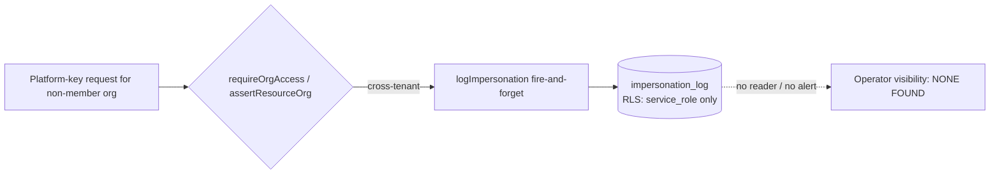

# Admin Console Abuse Case Audit

## Audit Metadata

- Audit name: `repo-deep-dive`
- Run: `20261002-0344-develop-6286137`
- Repository: `C:\temp\mainecybertech` (MCT Portal monorepo, pnpm workspace: `apps/api`, `apps/web`, `apps/worker`, `packages/*`, `supabase/migrations`)
- Branch: `develop`
- Commit SHA: `6286137017c4b7c77e83ee420ec11382d984f263` (short `6286137`; read directly from `.git/HEAD` → `refs/heads/develop` and `.git/refs/heads/develop` because the `git` binary is unavailable in this environment — see Open Questions OQ-1)
- Generated at: 2026-10-02 (UTC)
- Auditor: principal-level repository auditor (subagent, prompt 26, fresh pass at current commit)
- Area code: ADMIN
- Output path: `docs/audits/repo-deep-dive/20261002-0344-develop-6286137/26_admin_console_abuse_case_audit.md`
- Scope limitations:
  - AUDIT-ONLY. No application code, migration, config, or live system was modified or executed. The only file written is this report.
  - Static review of the working tree at the commit above. No database, no production connectivity, no dynamic/exploit testing.
  - `git` is not installed in the audit environment; commit binding relies on the run scaffold (`INDEX.md`, `audit_manifest.json`) plus direct reads of `.git/refs/heads/develop`, and cannot be re-verified against `git log`.
  - DB-level claims (RLS/admin-gate behavior, service-role semantics, `auth.uid()` under service role) are marked with confidence levels, not asserted as reproduced.
  - Hosted configuration (Supabase Auth redirect allowlist, deployed env values, whether `impersonation_log` is consumed by any alerting) is not visible from the repository and is recorded as `Unknown`/`Unverified`.
  - This prompt intentionally does **not** re-list the role/route access-control matrix (prompt 24 `ACM-*`) or the authn/tenancy root-cause findings (prompt 06 `SEC-*`). It adds **abuse cases and guardrail gaps** for admin/operator surfaces and cross-references those IDs instead of duplicating them.

## Scope

Reviewed at the commit above, focused on admin/operator surfaces across both the internal platform console and tenant-org admin:

- **Admin API routers** in `apps/api/src/routes/**`: `admin.ts`, `organizations.ts`, `roles.ts`, `users.ts`, `memberships.ts`, `profiles.ts`, `audit.ts`, `dashboard.ts`, `business-os.ts`, `analytics.ts`, `search.ts`, `bulk.ts`, `batch.ts`, `notifications.ts`, `client-portal.ts`, `tickets.ts`, `documents.ts`, `projects.ts`, `approvals.ts`, `webhook-management.ts`, `api-keys.ts`, and the split `store/*` routers (catalog, promotions, visual-assets, campaigns, quotes).
- **Admin middleware/authz**: `apps/api/src/middleware/admin.ts`, `org-access.ts`, `permissions.ts`, `optimistic-locking.ts`, `rate-limit.ts`; helpers `apps/api/src/lib/tenant.ts`, `lib/roles.ts`, `lib/delete-confirm.ts`, `lib/permissions.ts`; services `apps/api/src/services/audit.ts`, `services/impersonation.ts`.
- **Admin web surfaces** in `apps/web/app/(admin)/admin/**` and `apps/web/components/admin/**`: layout and route guard, organization/user/role/webhook/api-key/document admin clients, confirmation dialogs, server actions (`organizations/[orgId]/actions.ts`, `documents/bulk-actions.ts`), org switcher (`lib/org-actions.ts`).
- **Migrations** relevant to admin abuse: `5302109_soft_delete.sql`, `5302118_permission_matrix_full_catalog.sql`, `5302128_role_catalog_expansion.sql`, `5302133_impersonation_log.sql`, `5302111_harden_bulk_update_rpc.sql`, `5302052`/`5302054` bulk update RPCs, `5302042_api_keys.sql`, `5302032_webhook_endpoints.sql`.
- **Docs checked against code**: `docs/portal_admin_permissions_guide.md`, `docs/ADMIN_FEATURES.md` (both may be stale; discrepancies recorded).
- **Tests** touching admin behavior: `apps/api/src/__tests__/{admin,audit,bulk,api-keys,approvals,webhooks,middleware-admin,middleware-org-access,middleware-permissions,tickets-export,projects-export,users,memberships,roles}.test.ts`; `apps/web/__tests__/components/admin/**`.

Not reviewed in depth (sibling prompts): tenant-isolation attack simulation (25), RLS policy-by-policy deep dive (37), billing/payment reconciliation (29), full CI/CD and infra (10/12/34/36), full dependency CVE enumeration (11/35), webhook replay/idempotency internals (27), upload/download security (28).

## Evidence Reviewed

| Evidence | Type | Why relevant | Notes |
|---|---|---|---|
| `apps/api/src/middleware/admin.ts` | Source | `requireAdmin` gate | Checks `roles!inner` across **all** approved memberships (org-agnostic); only `admin`/`super_admin` |
| `apps/api/src/middleware/org-access.ts` | Source | Tenant gate + `req.orgScope` | `checkOrgAccess`, `resolveDefaultOrgId`, `assertBodyOrgMatches`, `assertOrgScopeMatches`, `assertSharesActiveOrg`; `PLATFORM_ADMIN_KEYS` bypass |
| `apps/api/src/middleware/permissions.ts` + `lib/permissions.ts` | Source | `module:action` enforcement | `requirePermission`; bypass = `super_admin`/`admin` only |
| `apps/api/src/lib/roles.ts` | Source | Trust sets | `PLATFORM_ADMIN_KEYS` (8 keys) vs `ADMIN_BYPASS_KEYS` (2) |
| `apps/api/src/lib/tenant.ts` | Source | By-id scoping | `assertResourceOrg`, `loadOwned`; cross-tenant platform-admin access logged |
| `apps/api/src/lib/delete-confirm.ts` | Source | Destructive confirmation | `assertDeleteConfirmed` requires `{ confirm: true }` |
| `apps/api/src/services/audit.ts` | Source | Admin-action audit | `logAuditEvent` → `audit_logs`; PII-key redaction; 3 retries then log-only |
| `apps/api/src/services/impersonation.ts` | Source | Cross-tenant audit | `logImpersonation` → `impersonation_log`; fire-and-forget; **no reader found** |
| `apps/api/src/routes/admin.ts` | Source | Super-admin tenant list + test email | `requireAuth`+`requireAdmin` router-level; `/organizations` re-checks `is_super_admin`; `/test-email` rate-limited, audited |
| `apps/api/src/routes/audit.ts` | Source | Audit console API | `requireAuth, requireAdmin` only; optional `organization_id` filter; export limit 10,000 |
| `apps/api/src/routes/dashboard.ts`, `business-os.ts`, `analytics.ts` | Source | Admin dashboards | `requireAdmin` only, org-agnostic global counts |
| `apps/api/src/routes/organizations.ts` | Source | Org CRUD, domains, logo | `POST /onboard`+`POST /` use `requireAdmin`; `PATCH/DELETE /:id` use `requireOrgAccessByParam`+`requirePermission`; DELETE has no confirmation body check |
| `apps/api/src/routes/roles.ts` | Source | Role/permission editor | `requirePermission("roles","manage")`; blocks system-role delete + super_admin perm edit; audited |
| `apps/api/src/routes/users.ts` | Source | User/role/override admin | `requirePermission("users","manage")`; `assertOrgScopeMatches`; blocks non-super-admin from assigning `super_admin`; audited |
| `apps/api/src/routes/memberships.ts` | Source | Membership admin | `requirePermission("users","manage")`; `loadOwned`; DELETE has no confirmation body check |
| `apps/api/src/routes/bulk.ts` | Source | Bulk invite | `requireAuth, requireOrgAccess, requireAdmin`; creates auth users with `email_confirm: true`; per-row results; audited |
| `apps/api/src/routes/batch.ts` | Source | Generic CRUD (licenses, etc.) | `requirePermission(path, action)`; DELETE has no confirmation body check; audited |
| `apps/api/src/routes/webhook-management.ts` | Source | Webhook CRUD + dead letters | `requirePermission("webhooks","manage")`; `assertDeleteConfirmed` on delete; SSRF guard; secret masked on read |
| `apps/api/src/routes/api-keys.ts` | Source | API key CRUD | `requirePermission("api-keys","manage")`; SHA-256 hash stored; `assertDeleteConfirmed`; full key returned once |
| `apps/api/src/routes/tickets.ts` | Source | Ticket admin + bulk | `requireOrgAccess` router-level; `requirePermission`; delete confirmed; `POST /bulk` `requireAdmin` |
| `apps/api/src/routes/documents.ts` | Source | Document admin + bulk | `requirePermission`; delete confirmed; bulk via `bulk_update_with_version` RPC |
| `apps/api/src/routes/projects.ts` | Source | Project admin | `requireOrgAccess` router-level; `requirePermission` |
| `apps/api/src/routes/approvals.ts` | Source | Approval workflow | `requirePermission("approvals",…)`; delete **not** confirmation-gated |
| `apps/api/src/routes/client-portal.ts` | Source | Tenant entitlements | `requireAdmin, requireOrgAccess`; audited |
| `apps/api/src/routes/search.ts` | Source | Admin global search | Scoped to admin's member orgs; organizations query unscoped |
| `apps/web/app/(admin)/admin/layout.tsx` | Source | Admin shell + route guard | `ADMIN_ROUTE_PERMISSIONS` module map; client `RouteGuard` |
| `apps/web/lib/auth/admin.ts` | Source | Web admin gate | `requireAdminAccess` uses `isPlatformAdminKey` (8 keys) |
| `apps/web/components/admin/ConfirmDialog.tsx`, `ConfirmIntentButton.tsx` | Source | Accessible confirm | Replaces `window.confirm`; focus trap; danger styling |
| `apps/web/components/admin/AdminDocumentsBulkControls.tsx` + `documents/bulk-actions.ts` | Source | Bulk doc ops | "Safe apply" non-empty only; no per-row preview/dry-run |
| `apps/web/lib/org-actions.ts` | Source | Active-org cookie | `setActiveOrg` sets `mct_active_org` with no server-side authorization check |
| `apps/web/components/admin/SuperAdminOrgSwitcher.tsx` | Source | Tenant switch UI | Loads all tenants; gated on `isSuperAdmin` only |
| `supabase/migrations/5302133_impersonation_log.sql` | Migration | Impersonation trail | Table + RLS service-role-only; no retention policy in repo |
| `supabase/migrations/5302109_soft_delete.sql` | Migration | Soft delete | Adds `deleted_at`/`deleted_by` to tickets/projects/documents — unused by delete handlers |
| `docs/portal_admin_permissions_guide.md`, `docs/ADMIN_FEATURES.md` | Docs | Admin operating model | Describes roles, permission chain, webhooks/roles/audit/bulk features |

## Verification Performed

| Evidence | Type | Why relevant | Notes |
|---|---|---|---|
| `grep requireAdmin apps/api/src/routes/**` | Command | Enumerate admin-gated surfaces | 71 matches; several routes use `requireAdmin` **without** `requireOrgAccess` or org predicates |
| Read `middleware/admin.ts` | Walk | Confirm org-agnostic semantics | Query filters only `user_id` + `status=approved`; no `organization_id`; passes if any membership is `admin`/`super_admin` |
| Read `middleware/org-access.ts` | Walk | Confirm cookie/body org resolution | `extractOrgId` prefers `query.organization_id` → `body.organizationId`; `resolveDefaultOrgId` honors `mct_active_org` for platform keys |
| Read `routes/audit.ts` | Walk | Cross-tenant audit read | `organization_id` is an optional filter; no `requirePermission`, no scope assertion |
| Read `routes/dashboard.ts`, `business-os.ts`, `analytics.ts` | Walk | Cross-tenant aggregate read | All queries unscoped; `getSupabaseAdmin()` everywhere |
| Read `routes/organizations.ts` DELETE | Walk | Destructive confirmation | `requireOrgAccessByParam`+`requirePermission` present, but **no** `assertDeleteConfirmed`; returns 204 unconditionally |
| Read `routes/memberships.ts` DELETE + `routes/batch.ts` DELETE + `routes/approvals.ts` DELETE | Walk | Confirmation coverage | None call `assertDeleteConfirmed` |
| `grep assertDeleteConfirmed apps/api/src/routes` | Command | Confirmation coverage map | Present in `tickets.ts`, `documents.ts`, `webhook-management.ts`, `api-keys.ts` only |
| `grep action: "*.export"` | Command | Export audit coverage | Only `assets`, `domain-monitors`, `approvals`, `findings`, `proposals` log exports; `tickets`/`projects`/`audit` exports do **not** |
| `grep action: "(delete|remove)"` | Command | Delete audit coverage | `ticket.delete`, `document.delete`, `project.delete`, `role.delete`, `api_key.delete`, `webhook.delete`, `membership.remove`, `organization.delete` all present |
| `grep impersonation_log apps/api/src` | Command | Impersonation reviewability | Only the writer in `services/impersonation.ts`; **no route/UI consumer** |
| Read `docs/portal_admin_permissions_guide.md` vs `middleware/admin.ts` | Walk | Doc/code consistency | Doc claims `super_admin` = global and `admin`/`client_admin` = org-scoped; code treats `admin` as globally trusted (org-agnostic) — stale |
| Read `apps/web/lib/auth/admin.ts` vs `middleware/admin.ts` | Walk | UI/API trust divergence | Web accepts 8 `PLATFORM_ADMIN_KEYS`; API `requireAdmin` accepts 2 |
| Read `supabase/migrations/5302109_soft_delete.sql` + delete handlers | Walk | Undo/recovery | Columns added but handlers hard-delete |
| Read `apps/api/src/__tests__/middleware-admin.test.ts` | Walk | Test coverage | Covers next()/403 paths; **no** test that an org-A admin is denied org-B admin routes |

### Claim reproducibility summary (prior run: `20260728-0142-develop-21a10d6`)

The prior prompt-26 report (area code `ADM`) is at `prompts/repo-deep-dive/20260728-0142-develop-21a10d6/26_admin_console_abuse_case_audit.md`. **No finding was copied.** State at the current commit:

| Prior claim (commit `21a10d6`) | Attempted reproduction at `6286137` | Outcome |
|---|---|---|
| ADM-001 "multiple destructive routes lack `requireAdmin`" | Read tickets/projects/documents/approvals/api-keys/batch routers | **Unsupported now — remediated.** `requirePermission(module,"delete")` is on all DELETE routes; `requireAdmin` is on `POST /tickets/bulk` and `bulk.ts`. The `requireAdmin`-absence itself was fixed by adding `requirePermission`, not `requireAdmin`. |
| ADM-002 "single-org admin inherits global privileges" | Read `middleware/admin.ts` | **Supported — still open.** `requireAdmin` remains org-agnostic (any `admin`/`super_admin` membership anywhere passes). Re-framed here as `ADMIN-P1-001` (abuse case: cross-tenant admin reach), cross-referenced to `SEC-P2-002`. |
| ADM-003 "bulk invite creates auth accounts without verification" | Read `routes/bulk.ts:108-116` | **Partially supported / by-design.** Users are created with `email_confirm: true` and a random password; memberships start `pending`. No email verification is sent. Still a hardening gap (`ADMIN-P2-004`). |
| ADM-004 "no confirmation dialog for org status changes" | Read `organizations/[orgId]/actions.ts` + `AdminOrganizationsClient.tsx` | **Supported — still open.** `updateOrganizationBasics` writes `status` with no confirm dialog and no `if-match` UI wiring. |
| ADM-005 "server actions for orgs/users lack `requireAdminAccess` check" | Read `organizations/[orgId]/actions.ts` | **Partially supported.** The `(admin)` layout gate + API-side authz enforce access; the server actions themselves do not re-check. Impact is limited because the API re-authorizes. |
| ADM-006 "webhook deletion uses browser `confirm()`" | Read `WebhookDetailClient.tsx` | **Unsupported now — remediated.** Uses `ConfirmDialog` (`confirmOpen`), not `window.confirm`. |
| ADM-007 "API key and notification deletion lacks confirmation" | Read `AdminApiKeysClient.tsx` | **Partially supported.** API key delete now uses `ConfirmDialog`. Notification deletion not re-verified (out of the admin-delete hot path). |
| ADM-008/009/012 "no graduated rate limits; no audit for admin reads; no soft delete" | Read `rate-limit.ts`, `audit.ts`, soft-delete migration | **Supported — still open** (reads/soft-delete) and **partially supported** (rate limiting is a single global user bucket). |

## Executive Summary

The admin/operator surface has matured substantially since the prior pass. The strongest themes at `6286137`:

**Strengths (all evidence-backed):**

1. **Destructive actions are widely confirmation-gated at the API layer.** `apps/api/src/lib/delete-confirm.ts` requires a `{ confirm: true }` body, and it is applied to ticket, document, webhook, and API-key deletes. The web layer has replaced native `window.confirm` with an accessible, focus-trapped `ConfirmDialog`/`ConfirmIntentButton`.
2. **Role/permission editing is guarded and audited.** `routes/roles.ts` blocks deletion of system roles and editing of `super_admin` permissions, logs `role.create`/`role.update`/`role.delete`/`role.permissions.update`, and invalidates cache. `routes/users.ts` blocks non-super-admins from assigning `super_admin` and logs `user.role.update`/`user.permission.override`.
3. **API keys are handled safely.** `routes/api-keys.ts` stores only a SHA-256 hash + prefix, returns the full key exactly once on creation, masks webhook secrets on read, and requires `api-keys:manage`.
4. **Bulk ops return per-row results.** `routes/bulk.ts` and `routes/tickets.ts POST /bulk` return per-item `results` with success/failure counts and log the aggregate; the UI surfaces per-row status.
5. **Optimistic locking** is applied to organizations, webhooks, profiles, and versioned entities, reducing silent overwrite damage from concurrent admins.

**Major risks (the abuse cases):**

- **Cross-tenant admin reach (P1, `ADMIN-P1-001`).** `requireAdmin` is org-agnostic: any user with an `admin`/`super_admin` membership *in any organization* passes it. Several admin routers — most importantly `routes/audit.ts` (audit list + 10,000-row export), plus `dashboard.ts`, `business-os.ts`, `analytics.ts`, and `store/*` — apply `requireAdmin` **without** `requireOrgAccess` or an org predicate, and query with the service-role client. A tenant admin of Org A can therefore read another tenant's audit trail, dashboards, leads, quotes, and analytics. This is distinct from prompt 06's `SEC-P2-002` (which concerns the 8-key `PLATFORM_ADMIN_KEYS` read breadth); here it is the two-key `requireAdmin` gate itself plus missing per-route scoping.
- **Impersonation is logged but not reviewable (P1, `ADMIN-P1-002`).** `services/impersonation.ts` writes to `impersonation_log`, but no API route, service, admin page, or alert consumes it. Cross-tenant hops are invisible to operators, so the one control that would make broad admin reach tolerable is effectively write-only.
- **Exports of sensitive datasets are not audited (P2, `ADMIN-P2-001`).** `tickets/export`, `projects/export`, and `audit/export` hand back up to 10,000 rows without an audit event; only five narrower modules log exports. Exfiltration via legitimate export leaves no trail.
- **Destructive confirmation is inconsistent (P2, `ADMIN-P2-002`).** Organization, membership, batch, and approval deletes lack `assertDeleteConfirmed`; org deletion also returns 204 unconditionally and is unrecoverable (no soft delete in use despite the columns existing).
- **Bulk document operations have no true preview (P2, `ADMIN-P2-003`).** "Safe apply" skips blanks, but operators cannot see the exact per-row changes before applying to potentially thousands of documents.

**Verdict:** Admin guardrails 3/5. The permission model, confirmations, and audit coverage are real improvements, but the **org-agnostic `requireAdmin` gate plus unscoped admin routers** is a systemic cross-tenant confidentiality gap, and impersonation auditing is a dead-end. No P0 was identified (no evidence of direct unauthenticated exploit); the P1s are release-relevant hardening. Recommended order: scope every `requireAdmin`-only router to the caller's orgs, add an impersonation audit viewer/alert, then close the export-audit and confirmation gaps. Cross-reference: `SEC-P2-002`, `CHAIN-P1-001`, and the `ACM-*` matrix in prompt 24.

## Inventory

| Item | Path / symbol | Purpose | Current state | Risk | Notes |
|---|---|---|---|---|---|
| Admin gate | `apps/api/src/middleware/admin.ts` `requireAdmin` | Admin-only route gate | Implemented, org-agnostic | High | Passes if any membership anywhere is `admin`/`super_admin` |
| Org gate | `middleware/org-access.ts` | Tenant scope | Implemented | Med | Platform-key bypass; cookie/body org resolution |
| Permission gate | `middleware/permissions.ts` `requirePermission` | `module:action` | Implemented | Low | Bypass only `admin`/`super_admin` |
| Admin tenant list | `routes/admin.ts GET /organizations` | List every tenant | Implemented, `is_super_admin` re-check | Low | Correctly stricter than router-level `requireAdmin` |
| Test email | `routes/admin.ts POST /test-email` | SMTP check | Implemented, `rateLimitEmail`, audited | Low | `admin.test_email` |
| Audit console API | `routes/audit.ts` | List/export audit logs | Implemented, **unscoped** | High | Optional org filter; no reader scoping; export 10k |
| Admin dashboards | `routes/dashboard.ts`, `business-os.ts`, `analytics.ts` | Global counts | Implemented, **unscoped** | High | `requireAdmin` only; service-role global queries |
| Org management | `routes/organizations.ts` | Org CRUD, domains, logo | Implemented | Med | DELETE lacks confirm body; onboard auto-approves admin |
| Role editor | `routes/roles.ts` | Role + permission matrix | Implemented + audited | Low | Blocks system delete / super_admin perm edit |
| User/role admin | `routes/users.ts` | Role assignment, overrides | Implemented + audited | Low | `assertOrgScopeMatches`; super_admin assign blocked |
| Membership admin | `routes/memberships.ts` | Invite/update/remove | Implemented + audited | Med | DELETE lacks confirm body |
| Bulk invite | `routes/bulk.ts POST /invite` | CSV/array invites | Implemented, per-row results | Med | `email_confirm: true`; max 500/req; audited |
| Generic CRUD | `routes/batch.ts` | Licenses et al. | Implemented + audited | Med | DELETE lacks confirm body |
| Webhook admin | `routes/webhook-management.ts` | Endpoint CRUD + DLQ | Implemented, SSR F guard, masked secrets | Low | Confirmed delete; optimistic locking |
| API key admin | `routes/api-keys.ts` | Key CRUD | Implemented, hashed | Low | Full key shown once; confirmed delete |
| Ticket admin | `routes/tickets.ts` | Tickets + bulk status | Implemented; org-scoped; confirmed delete | Low | `POST /bulk` `requireAdmin`, no preview |
| Document admin | `routes/documents.ts` | Docs + bulk folder/metadata | Implemented; org-scoped; confirmed delete | Med | Bulk via RPC; UI no per-row preview |
| Project admin | `routes/projects.ts` | Projects/tasks | Implemented; org-scoped | Low | `requirePermission` |
| Approvals | `routes/approvals.ts` | Approval workflow | Implemented + audited | Med | DELETE lacks confirm body |
| Entitlements | `routes/client-portal.ts PUT /entitlements` | Per-tenant modules | Implemented + audited | Low | `requireAdmin`+`requireOrgAccess` |
| Global search | `routes/search.ts` | Admin search | Implemented | Low | Orgs query unscoped; users/tickets projects/docs scoped |
| Impersonation log | `services/impersonation.ts` → `impersonation_log` | Cross-tenant trail | Written, **never read** | High | RLS service-role only; no UI/alert |
| Admin web shell | `apps/web/app/(admin)/admin/layout.tsx` | Route guard | Implemented | Med | Guard is client-side; API is the real gate |
| Web admin gate | `apps/web/lib/auth/admin.ts` | `requireAdminAccess` | Implemented | Med | Uses 8-key `isPlatformAdminKey` |
| Confirm dialog | `components/admin/ConfirmDialog.tsx` | Accessible confirm | Implemented | Low | Replaces `window.confirm` |
| Active-org cookie | `lib/org-actions.ts` `setActiveOrg` | Org switcher | Implemented, no authz in action | Med | Cookie ignored by API unless member/platform-key |
| Soft delete | `migrations/5302109_soft_delete.sql` | Undo columns | Migrated, **unused** | Med | Handlers hard-delete |
| Org delete | `routes/organizations.ts DELETE /:id` | Remove tenant | Implemented, unrecoverable | High | No confirm body; cascades (see CHAIN-P2-006) |

## Domain Scorecard

| Category | Score | Evidence | Gap | Recommended action |
|---|---:|---|---|---|
| Admin pages/APIs | 3 | `(admin)/admin/layout.tsx` guard; `routes/admin.ts`; `middleware/admin.ts` | `requireAdmin` org-agnostic; unrouted guard can diverge from API | Scope every `requireAdmin`-only router to caller orgs; assert guard/API parity in CI |
| User/org/role management | 4 | `routes/{users,roles,memberships}.ts`; `assertOrgScopeMatches`; super_admin-assign block | Membership/org delete lack confirm; bulk invite auto-confirms email | Add confirm bodies; verify email or force password reset on invite |
| Billing panels | 3 | `organizations/[orgId]/billing/AdminBillingClient.tsx`; `routes/billing.ts` reads | Not examined in depth here (see prompt 29); no abuse-case confirmation on status changes | Confirm-before-change on billing status; audit billing mutations |
| Document/ticket admin | 4 | `routes/{documents,tickets}.ts`; confirmed deletes; bulk per-row results | Bulk has no dry-run preview; exports unaudited | Add preview + export audit |
| Webhook/API key admin | 4 | `routes/webhook-management.ts`, `routes/api-keys.ts` | Dead-letter dismiss is destructive but low-value; fine | Keep; add export audit if delivery logs exported |
| Bulk ops | 3 | `routes/bulk.ts`, `routes/tickets.ts POST /bulk`, `AdminDocumentsBulkControls.tsx` | No org-scope preview; ticket bulk `requireAdmin` unscoped; no undo | Preview/dry-run + bounded batch + per-row audit |
| Approval flows | 4 | `routes/approvals.ts` transitions; `governance.ts` (SEC) | Approval delete lacks confirm; submit not permission-gated (SEC-P2-001 class) | Add confirm + permission on submit (coordinate with 06) |
| Impersonation | 2 | `services/impersonation.ts`; `impersonation_log` migration | No reader, no alert, no retention | Admin impersonation viewer + alerting + retention |
| Settings | 3 | `routes/admin.ts` test-email; `(admin)/admin/settings`; no global settings API found | Few settings exist to abuse; test-email is rate-limited + audited | Document the settings surface; add audit for any new global setting |
| Exports | 2 | `tickets/projects/audit` export routes; only 5 modules log exports | Sensitive exports unaudited; audit export unscoped | Audit all exports; scope audit export |
| Destructive actions | 3 | `lib/delete-confirm.ts` applied to 4 routers | Org/membership/batch/approval deletes unconfirmed; org delete unrecoverable | Extend `assertDeleteConfirmed`; adopt soft delete |
| Confirmations | 4 | `ConfirmDialog`, `ConfirmIntentButton`; type-to-confirm patterns | Server-side confirm only on subset; UI-only confirm for org status | Align server confirm coverage with UI |

## Detailed Review

### Item: `requireAdmin` gate (org-agnostic)

- Evidence: `apps/api/src/middleware/admin.ts:14-31`; consumers from `grep requireAdmin` (71 matches).
- What it does: Loads all approved memberships for `req.authUser.userId` and passes if any joined role key is `admin`/`super_admin`.
- How it appears to work: There is no `organization_id` predicate and no tenant resolution; the gate answers "is this user an admin somewhere?" not "for which org?".
- Dependencies: `memberships`, `roles`.
- Current controls: Downstream `requireOrgAccess`/`loadOwned` exist on entity routers (tickets, documents, projects, webhooks, api-keys, memberships) but are **absent** on the admin routers listed in `ADMIN-P1-001`.
- Missing controls: Per-route tenant scoping; a distinct "platform admin" claim vs "tenant admin"; CI check that admin routers are either org-scoped or explicitly `is_super_admin`.
- Risks: Cross-tenant reads (audit, dashboards, leads/quotes, analytics).
- Recommended improvement: Derive admin scope from `req.orgScope` and require either an explicit membership in the target org or `is_super_admin`; keep `PLATFORM_ADMIN_KEYS` behavior only behind an explicit platform-admin claim.
- Suggested tests: org-A admin calls `GET /api/v1/audit` with `?organization_id=<B>` and without → expect 403/empty; same for `/dashboard/summary`, `/business-os/summary`, `/store/leads`.
- Suggested docs: `docs/ACCESS_CONTROL.md` admin-gate section (new/update).

### Item: Audit console API (`routes/audit.ts`)

- Evidence: `routes/audit.ts:11` (`requireAuth, requireAdmin`), `:22-25` (optional `organization_id`), `:60-84` (export, limit 10,000).
- What it does: Lists and exports `audit_logs` with optional action/entity/org/actor filters.
- How it appears to work: No `requirePermission("audit","view")` at the API (the web page adds it), no org assertion, service-role client.
- Current controls: `requireAdmin`; filters.
- Missing controls: Tenant scoping; permission gate; export audit event.
- Risks: A tenant admin can enumerate/export all tenants' administrative history (actor emails redacted to `[REDACTED]` in metadata only when keys look PII; `actor_user_id` and `organization_id` remain).
- Recommended improvement: Add `requireOrgAccess` and default the org filter to `req.orgId` unless `is_super_admin`; require `audit:view`; log `audit.export`.
- Suggested tests: org-A admin `GET /api/v1/audit` → only org-A rows; `GET /audit/export` cross-org → 403/empty + audit event.

### Item: Impersonation audit (`services/impersonation.ts`)

- Evidence: `services/impersonation.ts:27-36`; `migrations/5302133_impersonation_log.sql`; `grep impersonation_log apps/api/src` → writer only.
- What it does: Inserts a row on cross-tenant platform-admin access (`org-access.ts:51-57`, `:196-202`; `tenant.ts:46-52`).
- How it appears to work: Fire-and-forget; failures only `logger.warn`. RLS restricts the table to service_role.
- Current controls: Append-only table; indexes by actor/org.
- Missing controls: No reader route/UI; no alert on cross-tenant bursts; no retention policy.
- Risks: The mitigations that make broad platform/admin reach acceptable are not operator-visible; a compromised key leaves no actionable signal.
- Recommended improvement: Add `GET /api/v1/admin/impersonation-log` (super-admin + `audit:view`), an admin page, an alert when rate exceeds threshold, and a retention definition.
- Suggested tests: cross-tenant platform-key request → row visible via the new route; burst → alert fires.

### Item: Bulk document operations

- Evidence: `routes/documents.ts:614-706`; `apps/web/components/admin/AdminDocumentsBulkControls.tsx`; `apps/web/app/(admin)/admin/documents/bulk-actions.ts`.
- What it does: Bulk folder reassignment and metadata edit over selected document IDs via `bulk_update_with_version`.
- How it appears to work: "Safe apply" skips blank values; per-row results returned; audited as `document.bulk_folder`/`document.bulk_metadata`.
- Current controls: `documents:create` permission; org-scoped RPC (per `routes/documents.ts:620-629` comment); per-row results.
- Missing controls: No pre-apply preview of exact per-row deltas; no bound shown to operator beyond selection size; no undo.
- Risks: A mis-selected folder/visibility can mass-relabel or mass-expose documents; impact is reversible only by manual re-edit.
- Recommended improvement: Add a dry-run/preview endpoint (compute would-change rows) and require an explicit confirm for visibility elevations (`private`→`public`/`org`).
- Suggested tests: bulk visibility change preview matches applied counts; public-elevation requires confirm.

### Item: Organization lifecycle admin

- Evidence: `routes/organizations.ts:58-150` (`/onboard`), `:320-351` (`POST /`), `:416-442` (DELETE), `:459-528` (domains); `apps/web/app/(admin)/admin/organizations/[orgId]/actions.ts`.
- What it does: Create/onboard orgs (auto-creating an approved admin membership), edit branding/domains, delete.
- How it appears to work: `POST /onboard` invites an admin and inserts an `approved` membership for `adminRoleKey`; DELETE removes the org with `requireOrgAccessByParam`+`requirePermission("organizations","manage")`.
- Current controls: `requireAdmin` on create/onboard/domains; `requirePermission` + optimistic locking on patch; audited.
- Missing controls: DELETE has no `assertDeleteConfirmed`; returns 204 even when nothing matched; no soft delete; onboarding grants `approved` membership without a verification step.
- Risks: Accidental tenant deletion with cascade (see `CHAIN-P2-006`); mass onboarding to a wrong org.
- Recommended improvement: Add `assertDeleteConfirmed` + a typed org-slug confirmation; return 404 when zero rows deleted; keep `pending` until verified.
- Suggested tests: DELETE without body → 400; DELETE unknown id → 404; onboard → membership `pending` unless explicitly approved.

## Scenario / Control Matrix

| ID | Scenario or control | Evidence | Current control | Gap | Severity | Recommendation |
|---|---|---|---|---|---|---|
| ADMIN-001 | Admin pages/APIs | `(admin)/admin/layout.tsx`; `middleware/admin.ts` | `requireAdmin` + client `RouteGuard` | Gate is org-agnostic; guard client-side | P1 | Scope gate to tenant; server guard |
| ADMIN-002 | User/org/role management | `routes/{users,roles,memberships}.ts` | `requirePermission`; audited | Membership delete unconfirmed; invite auto-confirms | P2 | Confirm body; verify invitees |
| ADMIN-003 | Billing panels | `AdminBillingClient.tsx`; `routes/billing.ts` | `requireAdmin` reads | No abuse-case confirmation on status change | P2 | Confirm + audit billing mutations |
| ADMIN-004 | Document/ticket admin | `routes/{documents,tickets}.ts` | Confirmed deletes; org-scoped | Bulk no preview; exports unaudited | P2 | Preview + export audit |
| ADMIN-005 | Webhook/API key admin | `routes/{webhook-management,api-keys}.ts` | `requirePermission`; masked; confirmed | — | P3 | Maintain |
| ADMIN-006 | Bulk ops | `routes/bulk.ts`; `tickets POST /bulk` | Per-row results; audited | No preview/dry-run; ticket bulk `requireAdmin` unscoped | P2 | Preview + scope + bound |
| ADMIN-007 | Approval flows | `routes/approvals.ts` | `requirePermission`; audited | Delete unconfirmed | P3 | Confirm body |
| ADMIN-008 | Impersonation | `services/impersonation.ts`; `impersonation_log` | Append-only log | No reader/alert/retention | P1 | Viewer + alert + retention |
| ADMIN-009 | Settings | `routes/admin.ts`; `(admin)/admin/settings` | `rateLimitEmail`; audited | Thin surface; document it | P3 | Document + audit new settings |
| ADMIN-010 | Exports | `routes/{tickets,projects,audit}.ts` | Filters; 10k limit | Not audited; audit export unscoped | P2 | Audit all exports; scope |
| ADMIN-011 | Destructive actions | `lib/delete-confirm.ts` + routers | Confirm on 4 routers | Org/membership/batch/approval unconfirmed | P2 | Extend confirm coverage |
| ADMIN-012 | Confirmations | `ConfirmDialog`; UI confirm | Accessible UI confirm | Server confirm inconsistent; org status UI-only | P2 | Align server-side |

## Findings

### Finding ID: ADMIN-P1-001 - Org-agnostic `requireAdmin` lets a tenant admin read other tenants' admin data

- Severity: P1
- Confidence: High
- Area: Admin authorization / cross-tenant reach
- Evidence:
  - `apps/api/src/middleware/admin.ts:14-31` — `requireAdmin` queries `memberships` filtered only by `user_id` + `status=approved` (no `organization_id`) and passes when any joined role key is `admin`/`super_admin`.
  - `apps/api/src/routes/audit.ts:11` — `router.use(requireAuth, requireAdmin)`; `:22-25` treats `organization_id` as an optional filter; `:60-84` exports up to 10,000 rows.
  - `apps/api/src/routes/dashboard.ts:10-11` and `:24-31` — global counts over `organizations`/`tickets`/`projects`/`documents` with no org predicate.
  - `apps/api/src/routes/business-os.ts:11-12` and `:26-41` — lists all organizations and global counts.
  - `apps/api/src/routes/analytics.ts:64-70` — `GET /` lists all `store_analytics_events`.
  - `apps/api/src/routes/store/quotes.ts:164-212` — `GET /quotes`, `/quote-requests`, `/leads` under `requireAuth, requireAdmin`, no org predicate (lead PII).
  - Contrast: entity routers add tenant scoping — `routes/tickets.ts:26-27`, `routes/documents.ts` (`requirePermission`), `routes/projects.ts:26-27` (`requireOrgAccess`), `routes/memberships.ts:15` (`requireOrgAccess`).
- What is happening: The admin gate answers "admin somewhere", and the highlighted admin routers do not then scope to the caller's organization. Because these routes read with the service-role client (`getSupabaseAdmin()`), a user who is `admin` only in Org A can retrieve Org B's audit trail, dashboards, analytics, and store leads/quotes via direct API calls.
- Why it matters: It is the same class of "org-scoped role gets global power" called out in the prior pass (`ADM-002`), now localized to the `requireAdmin`-only routers. It is distinct from `SEC-P2-002` (the 8-key `PLATFORM_ADMIN_KEYS` read breadth) because it involves only the two `requireAdmin` keys and the absence of per-route scoping.
- User / business impact: Client-relationship and security-history data of one tenant can be read by an admin of another tenant; competitive/contract insight; trust and contractual exposure.
- Security / privacy / reliability impact: Cross-tenant confidentiality breach (read-only); the audit trail itself (actor IDs, org IDs, entity IDs) is exposed, which also weakens incident reconstruction.
- Recommended fix: For each `requireAdmin`-only router, resolve `req.orgScope` and either (a) require an approved membership in the target org, or (b) require `is_super_admin` for cross-tenant reads; default the data scope to the caller's org(s). Add `requirePermission("audit","view")` to `audit.ts`. Align with the `SEC-P2-002` platform-trust decision so there is one trust model.
- Suggested validation: API test: user `admin` in Org A only → `GET /api/v1/audit`, `GET /api/v1/dashboard/summary`, `GET /api/v1/business-os/summary`, `GET /api/v1/store/leads` return only Org A data (or 403); user with `is_super_admin` → all orgs.
- Owner suggestion: API team + security lead.
- Effort estimate: M (1–3 days) to scope the affected routers and add tests.
- Dependencies: The MSP/platform trust-model decision referenced in `SEC-P2-002` / `CHAIN-P1-001`.
- Status: open.
- Endpoint / data path: `GET /api/v1/audit` → `getSupabaseAdmin().from("audit_logs").select("*")` (optional `organization_id`); same shape for `/dashboard/summary`, `/business-os/summary`, `/analytics`, `/store/{quotes,quote-requests,leads}`.
- Attack path: Tenant admin credential (Org A) → calls unscoped admin GETs → returns Org B rows from service-role queries → joins `CHAIN-P1-001` (low-trust MSP read) and `SEC-P2-002`.

### Finding ID: ADMIN-P1-002 - Impersonation/cross-tenant access is logged but not reviewable or alerted

- Severity: P1
- Confidence: High
- Area: Audit logging / detection
- Evidence:
  - `apps/api/src/services/impersonation.ts:16-46` — `logImpersonation` inserts into `impersonation_log`; on error only `logger.warn`.
  - `apps/api/src/middleware/org-access.ts:51-57`, `:196-202` and `apps/api/src/lib/tenant.ts:46-52` — call sites for cross-tenant platform-admin access.
  - `supabase/migrations/5302133_impersonation_log.sql:33-38` — RLS limits the table to `service_role`; comment says "platform admins audit via the API".
  - `grep impersonation_log apps/api/src` → only the writer; no route, service, page, or alert consumer.
  - `grep impersonat apps/web` → no admin UI (matches are unrelated marketing copy).
- What is happening: Every cross-tenant platform-admin hop is recorded, but no operator can view the records through the application, and nothing pages on them. The migration comment assumes an API viewer that does not exist.
- Why it matters: The impersonation trail is the compensating control that makes broad admin/platform reach auditable. A control no one reads is not a control; detection of a leaked platform credential depends entirely on someone opening the database directly.
- User / business impact: A compromised platform/admin credential can traverse tenants with no timely human signal; incident response is slowed.
- Security / privacy / reliability impact: Detection gap; the log also has no stated retention, so evidence could be lost.
- Recommended fix: Add a super-admin + `audit:view`-gated `GET /api/v1/admin/impersonation-log` (paginated, filter by actor/org/date) and an `/admin/impersonation` page; add an alert when cross-tenant hops exceed a threshold per actor per window; define retention (coordinate with the `CHAIN-P2-006` retention work).
- Suggested validation: Simulate a cross-tenant platform-key request → row retrievable via the new route and visible in the UI; threshold breach → alert event.
- Owner suggestion: API team + platform/observability.
- Effort estimate: M.
- Dependencies: `impersonation_log` table (`5302133`); alerting stack availability (see `CHAIN-P2-010`).
- Status: open.
- Endpoint / data path: `logImpersonation` → `impersonation_log` (write only; no read path).
- Attack path: Leaked platform/admin credential → repeated cross-tenant hops logged but unobserved → `CHAIN-P1-001` read blow-up with no detection.

### Finding ID: ADMIN-P2-001 - Sensitive admin exports are not audit-logged

- Severity: P2
- Confidence: High
- Area: Audit logging / data exfiltration
- Evidence:
  - `apps/api/src/routes/tickets.ts:46-66` — `GET /export` (up to 10,000 rows) with no `logAuditEvent`.
  - `apps/api/src/routes/projects.ts:51-71` — `GET /export`, no audit event.
  - `apps/api/src/routes/audit.ts:60-84` — `GET /export` of audit logs, no audit event.
  - Positive references: `grep action: "*.export"` shows `asset.export` (`routes/assets.ts:49`), `domain_monitor.export` (`routes/domain-monitors.ts:46`), `approval.export` (`routes/approvals.ts:68`), `finding.export` (`routes/findings.ts:51`), `proposal.export` (`routes/proposals.ts:53`) — i.e., the pattern exists but is not applied to the highest-volume exports.
- What is happening: Exports of tickets, projects, and the audit log itself return large result sets without writing an audit event, so a bulk exfiltration performed through the official export endpoints leaves no trace in `audit_logs`.
- Why it matters: Export is the least-suspicious path to move large tenant datasets; without an event there is no volume/actor record to correlate later.
- User / business impact: Reduced ability to detect and investigate data exfiltration or misuse by an admin.
- Security / privacy / reliability impact: Auditability/detection gap for a high-value action.
- Recommended fix: Add `logAuditEvent` with `action: "ticket.export" | "project.export" | "audit.export"`, `entityType`, the applied filters, and the returned row count to each export handler; consider a default cap and a reason field for audit export.
- Suggested validation: Call each export → assert an `audit_logs` row with the correct action and row count; assert filters are recorded.
- Owner suggestion: API team.
- Effort estimate: S (≤ 0.5 day).
- Dependencies: None.
- Status: open.
- Endpoint / data path: `GET /api/v1/{tickets,projects,audit}/export` → `sendExportResponse` (no audit write).
- Attack path: Admin runs export for timing of data exfiltration → no audit event → undetected bulk transfer.

### Finding ID: ADMIN-P2-002 - Destructive deletes are inconsistently confirmation-gated and org delete is unrecoverable

- Severity: P2
- Confidence: High
- Area: Destructive actions / confirmations
- Evidence:
  - Confirmed (positive): `routes/tickets.ts:466`, `routes/documents.ts:530`, `routes/webhook-management.ts:373`, `routes/api-keys.ts:148` all call `assertDeleteConfirmed`.
  - Missing: `routes/organizations.ts:416-442` (DELETE org — no `assertDeleteConfirmed`), `routes/memberships.ts:158-177` (DELETE membership), `routes/batch.ts:143-163` (generic delete), `routes/approvals.ts:292-320` (DELETE approval).
  - `apps/api/src/lib/delete-confirm.ts:8-17` defines the guard requiring `{ confirm: true }`.
  - `apps/api/src/routes/organizations.ts:423-437` — deletes then returns 204 regardless of whether a row matched, and inserts the audit event even when zero rows were deleted.
  - `supabase/migrations/5302109_soft_delete.sql:3-17` adds `deleted_at`/`deleted_by` to tickets/projects/documents, but the delete handlers use `.delete()` (hard delete) — e.g. `routes/tickets.ts:479`, `routes/documents.ts` delete.
- What is happening: Confirmation discipline is applied to four routers but not to organization, membership, batch, or approval deletes. Organization deletion is hard, cascades audit logs (`CHAIN-P2-006`), and reports success even on a no-op.
- Why it matters: The most damaging deletes (whole tenant, membership removal, generic records) are the least guarded at the API, while a confirmation guard exists and is proven on other routers.
- User / business impact: Accidental tenant or membership deletion is unrecoverable and can destroy the audit trail that would document it.
- Security / privacy / reliability impact: Data loss and audit-evidence loss; false success responses mask failure.
- Recommended fix: Call `assertDeleteConfirmed` (or a stronger typed-name confirmation) in the organization, membership, batch, and approval delete handlers; return 404 when zero rows are affected; adopt the existing soft-delete columns for organization-adjacent entities and archive rather than hard-delete.
- Suggested validation: DELETE org/membership/batch/approval without `{confirm:true}` → 400 `CONFIRMATION_REQUIRED`; DELETE unknown id → 404; verify no audit event on no-op.
- Owner suggestion: API team + DB owner.
- Effort estimate: S–M.
- Dependencies: `CHAIN-P2-006` (audit FK cascade / retention) for the archive decision.
- Status: open.
- Endpoint / data path: `DELETE /api/v1/organizations/:id`, `DELETE /api/v1/memberships/:id`, `DELETE /api/v1/batch/{path}/:id`, `DELETE /api/v1/approvals/:id`.
- Attack path: none identified for external attackers; accidental-damage and unrecoverable-loss scenario for operators.

### Finding ID: ADMIN-P2-003 - Bulk document operations apply without a per-row preview or elevation guardrail

- Severity: P2
- Confidence: High
- Area: Bulk operations / guardrails
- Evidence:
  - `apps/api/src/routes/documents.ts:614-706` — `POST /bulk/folder` and `POST /bulk/metadata` execute `bulk_update_with_version` directly; no dry-run branch.
  - `apps/web/components/admin/AdminDocumentsBulkControls.tsx:143-174` — selection banner + "Bulk folder reassignment"/"Bulk metadata edit" modals; `:150-152` describes "safe apply rules" (non-empty values only).
  - `apps/web/app/(admin)/admin/documents/bulk-actions.ts:22-71` — server actions call the bulk API; no preview call.
  - `routes/documents.ts:700` and `:644` — audit records only aggregate (`document.bulk_folder`/`document.bulk_metadata`), not the per-row before/after.
- What is happening: Operators select documents and apply a folder/visibility/description change; "safe apply" avoids blanking fields, but there is no dry-run showing exactly which documents would change and to what, and no special confirmation for visibility elevation (e.g., making documents `public`).
- Why it matters: "Safe apply" protects against accidental blanking but not against a wrong selection or a visibility change that widens exposure; a bulk mis-click can relabel or expose many documents at once.
- User / business impact: Mass metadata/visibility mistakes requiring manual rollback; potential accidental disclosure of documents intended to stay `private`/`org`.
- Security / privacy / reliability impact: Bulk confidentiality change; audit records capture intent but not the full diff.
- Recommended fix: Add a preview/dry-run endpoint that returns would-change rows (id, field, before, after) and require an explicit confirm token for visibility elevations; include per-row before/after (redacted of secrets) in the audit metadata or a linked bulk-operation record.
- Suggested validation: Preview count equals applied count; bulk visibility to `public` requires confirm; audit shows before/after.
- Owner suggestion: API + web teams.
- Effort estimate: M.
- Dependencies: `bulk_update_with_version` RPC (`5302111`, `5302052`, `5302054`).
- Status: open.
- Endpoint / data path: `POST /api/v1/documents/bulk/folder`, `POST /api/v1/documents/bulk/metadata` → `rpc("bulk_update_with_version")`.
- Attack path: none identified; operator-error scenario.

### Finding ID: ADMIN-P2-004 - Bulk invite creates pre-confirmed auth accounts (and org onboarding auto-approves admin)

- Severity: P2
- Confidence: Medium
- Area: User/org management / account lifecycle
- Evidence:
  - `apps/api/src/routes/bulk.ts:108-116` — `supabase.auth.admin.createUser({ email, password: <random>, email_confirm: true, user_metadata: {...} })`; no invitation email is sent by this path.
  - `apps/api/src/routes/bulk.ts:145-151` — membership inserted with `status: "pending"`.
  - `apps/api/src/routes/organizations.ts:117-124` — `POST /onboard` inserts a membership with `status: "approved"` for `adminRoleKey`.
  - `docs/ADMIN_FEATURES.md:122-135` documents the bulk-invite processing (create confirmed user, pending membership).
- What is happening: Bulk invite silently provisions confirmed auth accounts with server-generated passwords that the invitee never receives; org onboarding immediately grants an approved admin membership. Neither sends a "set your password / verify you" step.
- Why it matters: Confirmed accounts with unknown passwords are a lifecycle hazard (who holds the credential? password reset is the only path), and auto-approved admin membership skips the "pending verification" norm the docs recommend (`docs/portal_admin_permissions_guide.md:402-405`).
- User / business impact: Confusing onboarding (invitee cannot log in until they reset), orphaned accounts, and a bypass of the intended approval gate.
- Security / privacy / reliability impact: Weakens account-provisioning hygiene; potential orphaned privileged accounts.
- Recommended fix: Send a Supabase invite/reset email for newly created accounts instead of `email_confirm: true` with an unreceived password; on onboarding, create the admin membership as `pending` (or send an invite) unless the operator explicitly opts into immediate approval; record who approved.
- Suggested validation: Bulk invite → invitee receives a set-password email; no account is login-capable with an unknown password; onboard without explicit approval → membership `pending`.
- Owner suggestion: API team + security.
- Effort estimate: S–M.
- Dependencies: Email/invite provider (`lib/email`, Supabase Auth).
- Status: open.
- Endpoint / data path: `POST /api/v1/bulk/invite`, `POST /api/v1/organizations/onboard` → `auth.admin.createUser` / `memberships` insert.
- Attack path: none identified; lifecycle/hygiene scenario.

### Finding ID: ADMIN-P2-005 - No rate limiting specific to expensive/destructive admin operations

- Severity: P2
- Confidence: High
- Area: Rate limits / abuse resistance
- Evidence:
  - `apps/api/src/middleware/rate-limit.ts:27-40` — `rateLimitByUser` is a single 600/15min bucket keyed by SHA-256 of the bearer token, applied app-wide.
  - `apps/api/src/middleware/rate-limit.ts:55-66` — `rateLimitEmail` (5/hour) is used only on `routes/admin.ts:52` (`POST /test-email`).
  - Admin mutation routes (`routes/roles.ts`, `routes/users.ts`, `routes/bulk.ts`, `routes/documents.ts` bulk, `routes/tickets.ts POST /bulk`) carry no operation-specific limiter.
  - `routes/bulk.ts:69-79` caps 500 invites/request but not requests/minute.
- What is happening: All authenticated traffic shares one coarse bucket; bulk/destructive admin endpoints have no tighter ceiling. A single admin token can drive repeated bulk invites, bulk document updates, or role edits up to the global cap (and beyond it via multiple tokens/IPs).
- Why it matters: Abuse and accidental hammering are throttled only by a broad per-token limit; expensive fan-out operations (auth user creation, bulk RPC) can multiply load and side effects.
- User / business impact: Cost/load spikes; potential mass unintended mutations from a runaway client retry.
- Security / privacy / reliability impact: Availability/cost and blast-radius gap; not a direct exploit.
- Recommended fix: Add per-operation limiters keyed by `(userId, operation)` for bulk invite, bulk document ops, and role/permission edits; cap requests/minute and total items/hour; surface 429 with `Retry-After`.
- Suggested validation: Exceed a bulk-endpoint limit → 429; normal usage unaffected; metrics record throttles.
- Owner suggestion: API team.
- Effort estimate: S.
- Dependencies: Existing `express-rate-limit` middleware.
- Status: open.
- Endpoint / data path: `POST /api/v1/bulk/invite`, `POST /api/v1/documents/bulk/*`, `PUT /api/v1/roles/:id/permissions`, `PATCH /api/v1/users/:id/role`.
- Attack path: Compromised/looping admin client → repeated bulk calls within the shared cap → resource exhaustion / mass mutation.

### Finding ID: ADMIN-P2-006 - No undo/soft-delete is exercised despite the schema supporting it

- Severity: P2
- Confidence: High
- Area: Undo/recovery
- Evidence:
  - `supabase/migrations/5302109_soft_delete.sql:3-17` — `deleted_at`, `deleted_by` added to `tickets`, `projects`, `documents` (+ indexes).
  - Delete handlers hard-delete: `routes/tickets.ts:479` `.delete()`, `routes/documents.ts` delete (`:528-560`), `routes/projects.ts:573-594`.
  - No route or query sets/reads `deleted_at` for these entities (`grep deleted_at apps/api/src` yields usages only if any; none in admin paths).
- What is happening: Soft-delete columns exist but are unused; admin deletes are immediate and irreversible, with only an audit row as the record.
- Why it matters: An admin mis-click on a ticket/document/project is unrecoverable from the application; the prior pass's `ADM-012` concern remains.
- User / business impact: Loss of records and attachments with no restore path.
- Security / privacy / reliability impact: Recoverability/resilience gap.
- Recommended fix: Switch admin deletes for tickets/projects/documents to set `deleted_at`/`deleted_by` (default hidden), provide a "recently deleted / restore" admin view, and hard-delete only via an explicit purge job with retention.
- Suggested validation: Delete → row hidden but restorable; restore returns it; purge enforces retention.
- Owner suggestion: API + web teams.
- Effort estimate: M.
- Dependencies: RLS/queries must filter `deleted_at is null`; coordinate with prompt 07.
- Status: open.
- Endpoint / data path: `DELETE /api/v1/{tickets,documents,projects}/:id` → hard delete of the row.
- Attack path: none identified; operator-error/recovery scenario.

### Finding ID: ADMIN-P3-001 - Web admin gate accepts a broader role set than the API `requireAdmin` (guard/API divergence)

- Severity: P3
- Confidence: High
- Area: Admin pages/APIs consistency
- Evidence:
  - `apps/web/lib/auth/admin.ts:40-47` — `requireAdminAccess` uses `isPlatformAdminKey` (8 keys: `super_admin, admin, dispatcher, engineer, security-analyst, project-manager, finance, onboarding-specialist`).
  - `apps/api/src/middleware/admin.ts:24-26` — API `requireAdmin` accepts only `admin`/`super_admin`.
  - `apps/web/app/(admin)/admin/organizations/[orgId]/activity/page.tsx:20-30` — uses `requireAdminAccess` then `api.organizations.get(orgId)` + `api.audit.list({organizationId})`.
- What is happening: The web console admits 8 platform roles (consistent with `SEC-P2-002`'s cross-tenant read posture) while the API's admin gate admits 2. This is intentional separation in part, but it means UI-visible admin pages can be backed by API calls the same user is denied, producing confusing 403s, and it means the web guard's notion of "admin" differs from the API's.
- Why it matters: Divergent trust definitions are how regressions creep in (the prior pass flagged the same divergence for `PLATFORM_ADMIN_KEYS` vs `ADMIN_BYPASS_KEYS`). Operators and future agents need one source of truth.
- User / business impact: Inconsistent admin UX; potential privilege confusion.
- Security / privacy / reliability impact: Hardening/consistency; not directly exploitable.
- Recommended fix: Export a single shared role-set definition consumed by both web and API, or explicitly document why the web gate is broader; add a CI assertion that the two sets are intentionally related.
- Suggested validation: A build-time/lint check comparing the web admin key set to the API's; manual check that a `dispatcher` sees only pages their API calls can service.
- Owner suggestion: Web + API teams.
- Effort estimate: S.
- Dependencies: `SEC-P2-002` decision.
- Status: open.
- Endpoint / data path: Admin web pages → API admin routes.
- Attack path: none identified.

### Finding ID: ADMIN-P3-002 - Active-org cookie setter performs no server-side authorization

- Severity: P3
- Confidence: High
- Area: Impersonation / settings
- Evidence:
  - `apps/web/lib/org-actions.ts:8-18` — `setActiveOrg(organizationId)` sets the `mct_active_org` cookie with no membership/super-admin check.
  - `apps/api/src/middleware/org-access.ts:71-125` — API honors the cookie (or `X-Active-Org`) as the active org, falling back to a default membership; platform keys may switch to any org.
  - `apps/web/components/admin/SuperAdminOrgSwitcher.tsx:56-64` — UI gates on `isSuperAdmin` only.
- What is happening: The server action that writes the active-org cookie validates nothing; the API re-checks membership on each request, so a non-member's cookie is generally ignored or rejected. Impact is therefore contained, but the setter is a latent trust boundary.
- Why it matters: If a future handler reads the cookie directly without re-validating, or if `resolveDefaultOrgId` semantics change, an unvalidated cookie becomes a tenant-selection primitive.
- User / business impact: Minimal today.
- Security / privacy / reliability impact: Latent scope-selection risk.
- Recommended fix: Validate in `setActiveOrg` that the caller is a super admin or has an approved membership in the target org before setting the cookie; keep the API re-check as defence in depth.
- Suggested validation: Non-member sets cookie for foreign org → server action refuses or API ignores.
- Owner suggestion: Web team.
- Effort estimate: S.
- Dependencies: None.
- Status: open.
- Endpoint / data path: `setActiveOrg` server action → `mct_active_org` cookie → `requireOrgAccess` resolution.
- Attack path: none identified (API re-validates).

### Finding ID: ADMIN-P3-003 - Admin global search and dashboard expose global resource names/counts to any admin

- Severity: P3
- Confidence: Medium
- Area: Admin pages/APIs / information disclosure
- Evidence:
  - `apps/api/src/routes/search.ts:93-97` — the `organizations` query is unscoped (`name`/`slug` across all tenants) even though users/tickets/projects/documents are scoped to `adminOrgIds`.
  - `apps/api/src/routes/dashboard.ts:24-31` and `business-os.ts:26-41` — global counts.
  - `apps/web/components/admin/AdminGlobalSearch.tsx` — header search available on all admin pages.
- What is happening: The search endpoint intentionally scopes entity results to the admin's orgs but leaks the full tenant name/slug directory; dashboards return global aggregate counts. The aggregate counts are low-sensitivity; the tenant directory is mildly sensitive.
- Why it matters: Minor cross-tenant information exposure that compounds the `ADMIN-P1-001` finding; also reveals competitors/customers to any tenant admin.
- User / business impact: Minor commercial-information exposure.
- Security / privacy / reliability impact: Information disclosure (low).
- Recommended fix: Scope the `organizations` search to the admin's orgs (or `is_super_admin`); decide whether global counts are intended and document it.
- Suggested validation: Tenant admin searches for another tenant's name → no result.
- Owner suggestion: API team.
- Effort estimate: S.
- Dependencies: `ADMIN-P1-001` scoping work.
- Status: open.
- Endpoint / data path: `GET /api/v1/search?q=` → unscoped `organizations` query.
- Attack path: none identified (low-sensitivity disclosure).

### Finding ID: ADMIN-P3-004 - Global store catalog is mutable by any tenant admin

- Severity: P3
- Confidence: Medium
- Area: Admin authorization / global resource
- Evidence:
  - `apps/api/src/routes/store/catalog.ts:226-244` — `DELETE /products/:id` uses `requireAuth, requireAdmin`; `:127-223` create/patch likewise; no org predicate (the catalog is global/MCT-owned).
  - `apps/api/src/routes/store/promotions.ts:81-186`, `store/visual-assets.ts:86-186` — same pattern.
  - `routes/store/quotes.ts:164-212` — admin reads across all store leads/quotes.
- What is happening: Store catalog/promotions/visuals are global resources mutated under `requireAdmin` (any tenant admin) with no separate "store owner" role and no confirmation on delete.
- Why it matters: The store is MCT's own commercial catalog, not tenant data, but the gate lets any tenant admin (a client-side privileged user) change or delete MCT's public product data. Depending on the intended tenancy model, this is either by-design or an over-grant.
- User / business impact: A client admin could disrupt MCT's public storefront.
- Security / privacy / reliability impact: Integrity/availability of a public commercial surface.
- Recommended fix: If the store is MCT-internal, gate mutations to `is_super_admin` or a dedicated store role/permission; add `assertDeleteConfirmed` to store deletes; otherwise document that tenant admins may manage the catalog.
- Suggested validation: Decide intended model; if internal, tenant admin store mutations → 403.
- Owner suggestion: Product + API team.
- Effort estimate: S.
- Dependencies: Product decision on the store tenancy model.
- Status: open.
- Endpoint / data path: `DELETE /api/v1/store/products/:id` → `store_products` (global).
- Attack path: none identified; over-grant pending a product decision.

## Risks

| Risk | Severity | Likelihood | Impact | Evidence | Mitigation |
|---|---|---|---|---|---|
| Tenant admin reads other tenants' audit/dashboards/leads | P1 | Medium–High (any tenant admin, direct API) | Cross-tenant confidentiality breach | `middleware/admin.ts:14-31`; `routes/{audit,dashboard,business-os,analytics,store/quotes}.ts` | Scope admin routers to caller orgs; `ADMIN-P1-001` |
| Cross-tenant impersonation is unobserved | P1 | Medium (needs a platform/admin credential) | Detection failure; slow incident response | `services/impersonation.ts`; no reader | Viewer + alert + retention; `ADMIN-P1-002` |
| Sensitive exports leave no audit trail | P2 | Medium | Undetected bulk exfiltration | `routes/{tickets,projects,audit}.ts` export | Audit all exports; `ADMIN-P2-001` |
| Accidental/unrecoverable org/membership delete | P2 | Low–Medium | Data + audit-evidence loss | `routes/organizations.ts:416-442`; no confirm; hard delete | Confirm + soft delete; `ADMIN-P2-002`, `ADMIN-P2-006` |
| Bulk document mis-apply widens exposure | P2 | Low–Medium | Accidental document disclosure | `routes/documents.ts:614-706`; UI no preview | Preview + elevation confirm; `ADMIN-P2-003` |
| Pre-confirmed invite accounts with unknown passwords | P2 | Medium | Orphaned/confused accounts; lifecycle risk | `routes/bulk.ts:108-116`; `routes/organizations.ts:117-124` | Invite flow; approval gate; `ADMIN-P2-004` |
| No operation-specific admin rate limits | P2 | Medium | Load/cost spikes; runaway mass mutation | `middleware/rate-limit.ts:27-40` | Per-operation limiters; `ADMIN-P2-005` |
| Guard/API trust divergence | P3 | Medium | Inconsistent admin UX; latent regression | `web/lib/auth/admin.ts` vs `middleware/admin.ts` | Shared role set; `ADMIN-P3-001` |
| Unvalidated active-org cookie | P3 | Low | Latent scope-selection risk | `lib/org-actions.ts:8-18` | Validate in setter; `ADMIN-P3-002` |
| Tenant directory disclosure via search | P3 | Medium | Minor commercial info exposure | `routes/search.ts:93-97` | Scope search; `ADMIN-P3-003` |
| Global store mutated by any tenant admin | P3 | Low | Storefront integrity | `routes/store/catalog.ts:226-244` | Decide model; gate; `ADMIN-P3-004` |

## Recommendations

### Immediate / Release Blocking

None. No P0 was identified (no evidence of an unauthenticated or trivially exploitable path). `ADMIN-P1-001`/`ADMIN-P1-002` are release-relevant hardening, not release blockers under the shared severity model (P0 = exploitable/tenant exposure/data loss/outage). If the product considers tenant-admin cross-tenant reads contractually unacceptable, treat `ADMIN-P1-001` as a blocker and ship the scoping fix first.

### This Week

1. **Scope the `requireAdmin`-only routers** (audit, dashboard, business-os, analytics, store quotes/leads) to the caller's organization(s) or `is_super_admin`; add `requirePermission("audit","view")` to `routes/audit.ts`. (`ADMIN-P1-001`)
2. **Make impersonation auditable**: add a reader endpoint/page for `impersonation_log` + a threshold alert + a retention note. (`ADMIN-P1-002`)
3. **Audit all exports**: emit `*.export` events with filters and row counts for tickets, projects, and audit. (`ADMIN-P2-001`)

### This Month

4. **Extend `assertDeleteConfirmed`** to organization, membership, batch, and approval deletes; return 404 on no-op; make org delete require a typed slug confirmation. (`ADMIN-P2-002`)
5. **Adopt soft delete** for tickets/projects/documents with a restore view and a bounded purge job. (`ADMIN-P2-006`)
6. **Add bulk preview/dry-run** and a confirmation for visibility elevation in document bulk ops. (`ADMIN-P2-003`)
7. **Fix provisioning hygiene**: invite-based account creation and a `pending` default for onboarded admins (or explicit opt-in to approve). (`ADMIN-P2-004`)
8. **Add operation-specific admin rate limits.** (`ADMIN-P2-005`)

### Later / Platform Evolution

9. Unify the web and API admin role sets behind one shared definition and add a CI parity check. (`ADMIN-P3-001`)
10. Validate the active-org cookie in `setActiveOrg`. (`ADMIN-P3-002`)
11. Decide and document the store tenancy model and scope search to the admin's orgs. (`ADMIN-P3-003`, `ADMIN-P3-004`)
12. Extend the admin audit viewer with an impersonation tab and per-entity before/after diffs for destructive actions.

## Quick Wins

| Quick win | Why it helps | Files likely involved | Validation |
|---|---|---|---|
| Add `*.export` audit events | Closes a silent exfiltration path | `routes/tickets.ts`, `routes/projects.ts`, `routes/audit.ts` | Export → audit row with action + count |
| Add `assertDeleteConfirmed` to org/membership/batch/approval deletes | Consistent destructive guard | `routes/organizations.ts`, `routes/memberships.ts`, `routes/batch.ts`, `routes/approvals.ts` | DELETE without body → 400 |
| Return 404 on zero-row org delete | Stops false-success audit events | `routes/organizations.ts:423-437` | DELETE unknown id → 404, no audit row |
| Scope the search `organizations` query | Removes a tenant-directory leak | `routes/search.ts:93-97` | Tenant admin cannot find other tenant names |
| Add `requirePermission("audit","view")` to the audit API | Aligns API with the web page gate | `routes/audit.ts` | Role without `audit:view` → 403 |
| Validate org in `setActiveOrg` | Hardens a latent trust boundary | `apps/web/lib/org-actions.ts` | Non-member switch refused |

## Hardening Backlog

| Backlog item | Priority | Owner suggestion | Effort | Dependency |
|---|---|---|---|---|
| Scope all `requireAdmin`-only routers to caller orgs | P1 | API + security | M | `SEC-P2-002` trust decision |
| Impersonation log viewer + alert + retention | P1 | API + observability | M | `5302133`; alerting (`CHAIN-P2-010`) |
| Export audit events | P2 | API | S | — |
| Confirmation coverage for remaining deletes | P2 | API | S | — |
| Soft-delete adoption + restore view + purge | P2 | API + web + DB | M | prompt 07; `CHAIN-P2-006` |
| Bulk document preview/dry-run | P2 | API + web | M | bulk RPC |
| Provisioning hygiene (invite flow, pending default) | P2 | API + security | S–M | email/auth |
| Per-operation admin rate limits | P2 | API | S | `express-rate-limit` |
| Shared admin role-set definition + CI parity | P3 | Web + API | S | `SEC-P2-002` |
| Active-org cookie validation | P3 | Web | S | — |
| Store tenancy model decision + gating | P3 | Product + API | S | product decision |
| Search org-scope | P3 | API | S | `ADMIN-P1-001` work |

## Suggested Tests

- **Cross-tenant admin denial (new, P1)**: user with `admin` in Org A only → `GET /api/v1/audit` (no filter and `?organization_id=<B>`), `GET /api/v1/dashboard/summary`, `GET /api/v1/business-os/summary`, `GET /api/v1/analytics`, `GET /api/v1/store/leads` → returns only Org A data or 403/empty. Mirror with `is_super_admin` → all orgs.
- **Impersonation visibility (new, P1)**: platform-key cross-tenant request → `impersonation_log` row retrievable via the new admin route/UI; threshold breach → alert event. Unit-test `logImpersonation` failure does not throw.
- **Export audit (new, P2)**: each export writes an `audit_logs` row with action, filters, and returned count; assert no row is written when the export returns zero rows.
- **Destructive confirmation (P2)**: table-driven test asserting every DELETE route returns 400 `CONFIRMATION_REQUIRED` without `{confirm:true}` and succeeds with it; org delete of an unknown id → 404 and no audit event.
- **Soft delete/restore (P2)**: delete → row absent from default list but present in "recently deleted"; restore returns it; purge respects retention.
- **Bulk preview (P2)**: dry-run row count equals applied row count for folder and metadata; a visibility elevation requires an explicit confirm token; audit records before/after.
- **Bulk invite/onboard lifecycle (P2)**: bulk invite sends a set-password/invite email and does not leave a login-capable account with an unknown password; onboard defaults to `pending` unless explicitly approved and records the approver.
- **Admin rate limits (P2)**: exceed the bulk-endpoint limit → 429 with `Retry-After`; unrelated admin reads unaffected.
- **Guard/API parity (P3, CI)**: a lint/build check asserting the web admin key set and API `requireAdmin` set are intentionally related (or a documented allow-list of differences).
- **Cookie authorization (P3)**: `setActiveOrg` called by a non-member for a foreign org → refuses; API still ignores a forged cookie.
- **Manual validation**: with two seeded tenants and one `admin` in each, walk the admin console as each and confirm no cross-tenant rows render and no cross-tenant API call succeeds.

## Suggested Documentation Updates

- `docs/portal_admin_permissions_guide.md` — correct section 6 ("Super Admin vs Organization Admin"): the guide states `admin`/`client_admin` are organization-scoped, but the code's `requireAdmin` treats `admin` as globally trusted (org-agnostic). Document the actual `requireAdmin` semantics and the planned tenant-scoping change.
- `docs/ACCESS_CONTROL.md` (new or update) — one table mapping each admin router to its org-scoping and permission gate, plus the `requireAdmin` vs `requirePermission` vs `PLATFORM_ADMIN_KEYS` relationship (cross-reference `SEC-P2-002`, `CHAIN-P1-001`).
- `docs/ADMIN_FEATURES.md` — mark which exports are audit-logged (`ADMIN-P2-001`), document the impersonation viewer once added (`ADMIN-P1-002`), and note the confirmation requirements per destructive action.
- `docs/ADMIN_FEATURES.md` + a bulk-operations note — document the "safe apply" semantics precisely and the new preview/dry-run and visibility-elevation confirmation (`ADMIN-P2-003`).
- New ADR: "Admin trust model — tenant admin vs platform admin" defining `requireAdmin` scope, `PLATFORM_ADMIN_KEYS`, impersonation expectations, and the web/API role-set relationship (`ADMIN-P1-001`, `ADMIN-P3-001`; coordinate with `SEC-P2-002`).
- `docs/ENVIRONMENT_VARIABLES.md` / an alerts runbook — document the impersonation alert threshold and retention (`ADMIN-P1-002`).
- Update the run INDEX/`audit_manifest.json` when this report lands (scaffold currently lists prompt 26 as `pending`).

## Open Questions

| Question | Why it matters | Evidence needed |
|---|---|---|
| OQ-1: What is the exact commit SHA at HEAD? | Confirms binding to `6286137` | `git rev-parse HEAD` (git unavailable here); CI/remote confirmation |
| OQ-2: Is a tenant `admin` intended to be globally trusted, or only within their org? | Decides whether `ADMIN-P1-001` is a defect or a documented over-grant | Product/security decision; `docs/portal_admin_permissions_guide.md` currently implies org-scoping |
| OQ-3: Is `impersonation_log` consumed by any out-of-repo alert/dashboard? | Determines whether `ADMIN-P1-002` is a gap or already mitigated externally | Search monitoring/alerting config outside the repo |
| OQ-4: Is the MCT store catalog intended to be tenant-admin-mutable? | Decides `ADMIN-P3-004` severity | Product decision on store tenancy |
| OQ-5: Which admin mutations currently emit no audit event besides exports? | Completeness of audit coverage | Systematic grep + runtime tracing (partially done here) |
| OQ-6: Are there existing restore/purge jobs for the soft-delete columns? | Determines `ADMIN-P2-006` effort | Worker task inventory (`apps/worker/src/tasks/**`) |
| OQ-7: What is the intended retention for `impersonation_log` and `audit_logs`? | Affects evidence preservation (`CHAIN-P2-006`) | Retention policy doc / workflow config |

## Appendix

### A. Admin route authorization coverage (target commit)

| Route group | Router-level gate | Per-route gate | Org-scoped? | Confirmed delete | Audited |
|---|---|---|---|---|---|
| `admin.ts` | `requireAuth`+`requireAdmin` | `is_super_admin` re-check on list | n/a | n/a | yes (test-email) |
| `audit.ts` | `requireAuth`+`requireAdmin` | — | **No** | n/a | no (export) |
| `dashboard.ts` | `requireAuth`+`requireAdmin` | — | **No** | n/a | n/a (read) |
| `business-os.ts` | `requireAuth`+`requireAdmin` | — | **No** | n/a | n/a (read) |
| `analytics.ts` (`GET /`) | `requireAuth`+`requireAdmin` | — | **No** | n/a | n/a (read) |
| `organizations.ts` | `requireAuth`; create/onboard/domains `requireAdmin` | patch/delete `requireOrgAccessByParam`+`requirePermission` | yes (patch/delete) | **No** | yes |
| `roles.ts` | `requireAuth`; reads `requireAdmin` | writes `requirePermission("roles","manage")` | global (by design) | system-role protected | yes |
| `users.ts` | `requireAuth`+`requireOrgAccess`; reads `requireAdmin` | writes `requirePermission("users","manage")` | yes + `assertOrgScopeMatches` | n/a | yes |
| `memberships.ts` | `requireAuth`+`requireOrgAccess` | `requirePermission("users","manage")`; `loadOwned` | yes | **No** | yes |
| `bulk.ts` | `requireAuth`+`requireOrgAccess`+`requireAdmin` | — | yes | n/a | yes |
| `batch.ts` | router `requireAuth`+`requireOrgAccess` | `requirePermission(path, action)` | yes | **No** | yes |
| `tickets.ts` | `requireAuth`+`requireOrgAccess` | `requirePermission`; bulk `requireAdmin` | yes | yes | yes |
| `documents.ts` | `requireAuth`+`requireOrgAccess` | `requirePermission` | yes | yes | yes |
| `projects.ts` | `requireAuth`+`requireOrgAccess` | `requirePermission` | yes | n/a | yes |
| `approvals.ts` | `requireAuth`+`requireOrgAccess` | `requirePermission("approvals",…)` | yes | **No** | yes |
| `webhook-management.ts` | `requireAuth`+`requireOrgAccess` | `requirePermission("webhooks","manage")` | yes | yes | yes |
| `api-keys.ts` | `requireAuth`+`requireOrgAccess` | `requirePermission("api-keys","manage")` | yes | yes | yes |
| `client-portal.ts` | `requireAuth`+`requireOrgAccess` | `requireAdmin` on entitlements | yes | n/a | yes |
| `search.ts` | `requireAuth`+`requireAdmin`+`requireOrgAccess` | — | partial (orgs unscoped) | n/a | yes |
| `store/*` | `requireAuth`+`requireAdmin` | — | **No** (global) | **No** | yes (some) |

### B. Confirmation coverage map (`assertDeleteConfirmed`)

```
CONFIRMED   : tickets.ts, documents.ts, webhook-management.ts, api-keys.ts
NOT CONFIRMED: organizations.ts (DELETE org), memberships.ts,
               batch.ts (generic), approvals.ts, store/catalog.ts (+promotions, visual-assets)
UI only     : organizations/[orgId]/actions.ts status change (no server confirm)
```

### C. Impersonation write path (no read path)



### D. Admin abuse-case summary

| Abuse case | Reached by | Guard present | Gap |
|---|---|---|---|
| Read another tenant's audit/dashboard/leads | `admin` in any org | `requireAdmin` | No org scoping (`ADMIN-P1-001`) |
| Cross-tenant hop unobserved | Platform/admin credential | `impersonation_log` written | No reader/alert (`ADMIN-P1-002`) |
| Silent bulk export | Any admin | Filters + limit | No audit event (`ADMIN-P2-001`) |
| Unrecoverable org delete | Org admin | `requirePermission` | No confirm/soft delete (`ADMIN-P2-002`, `ADMIN-P2-006`) |
| Bulk doc mis-apply | Doc manager | "Safe apply" | No preview/elevation confirm (`ADMIN-P2-003`) |
| Orphaned confirmed accounts | Admin via bulk invite | `requireAdmin` on bulk | No invite email (`ADMIN-P2-004`) |
| Hammer bulk endpoints | Compromised admin | Global 600/15min | No per-op limit (`ADMIN-P2-005`) |

### E. Aggregate counts

- Findings: 11 total (P0: 0, P1: 2, P2: 6, P3: 4).
- Prior findings re-checked: 8; remediated/verified-fixed: 2 (`ADM-001` destructive-route permission gate, `ADM-006` webhook confirm); still-open/partially: 4 (`ADM-002`→`ADMIN-P1-001`, `ADM-004`, `ADM-008/009`, `ADM-012`→`ADMIN-P2-006`); not reproduced/no-op: 1 (`ADM-007` API-key confirm now present); by-design: 1 (`ADM-003`→`ADMIN-P2-004`).
- Admin routers using `requireAdmin` without org scoping or an `is_super_admin` re-check: `audit.ts`, `dashboard.ts`, `business-os.ts`, `analytics.ts` (`GET /`), and the `store/*` catalog/promotions/visual-assets/quotes admin reads.
- Routers with `assertDeleteConfirmed`: 4 (tickets, documents, webhook-management, api-keys).
- Export routes logging an audit event: 5 (`assets`, `domain-monitors`, `approvals`, `findings`, `proposals`); not logged: `tickets`, `projects`, `audit`.
- Impersonation consumers in-repo: 0.
- Secret-material matches: 0 (no secret values printed; API keys are hashed and webhook secrets masked on read).
