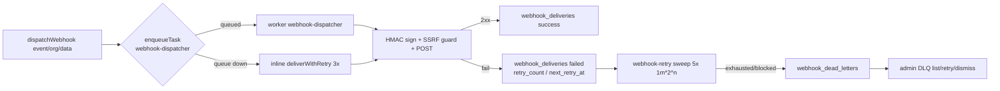

# Webhook Delivery, Replay, and Idempotency Audit

## Audit Metadata

- Audit name: repo-deep-dive
- Run: 20261002-0344-develop-6286137
- Repository: C:/temp/mainecybertech (Maine CyberTech portal monorepo)
- Branch: develop
- Commit SHA: 6286137017c4b7c77e83ee420ec11382d984f263 (short `62861370`)
- Generated at: 2026-10-02T03:44 (run timestamp; audit authored after reading the tree at the pinned commit)
- Auditor: Repo Deep-Dive audit agent (prompt 27, full hardening edition)
- Area code: WH
- Output path: docs/audits/repo-deep-dive/20261002-0344-develop-6286137/27_webhook_delivery_replay_idempotency_audit.md
- Scope limitations:
  - Static, read-only audit. No webhook was sent and no network request was made (per audit hard rules).
  - No production/staging systems were contacted; live droplet `.env`, GitHub secret values, and Stripe/Jira/M365 consoles were not inspected. Secret presence in any environment is `unverified`.
  - Secret **values** were never printed; only env var **names** are referenced.
  - `git` is not on `PATH` in this shell; commit/branch facts were captured via `C:\Program Files\Git\cmd\git.exe` against the working tree.
  - Timing/reliability behavior under real concurrency and real upstream retries was not executed; concurrency claims are code-inspection (`partially supported`) unless a test proves them.
  - Prompt 27's canonical output path is stated with literal `{name}`/`{run}` placeholders; the run variables above are the resolved values.

## Scope

**In scope (reviewed):**

- Inbound webhook endpoints: `apps/api/src/routes/webhooks.ts` (Stripe `POST /stripe`; Jira `POST /jira`; JSM `POST /jsm`; M365 `GET/POST /m365`).
- Raw-body capture / parse-before-verify posture: `apps/api/src/app.ts` `express.json({ verify })`.
- Signature + timestamp library: `apps/api/src/lib/webhook-signature.ts`.
- Idempotency/dedup: `apps/api/src/lib/idempotency.ts` (Redis `SET NX EX` + in-memory fallback).
- Outbound delivery: `apps/api/src/lib/webhook-dispatcher.ts` (inline fallback), `apps/worker/src/tasks/webhook-dispatcher.ts` (queued), `apps/worker/src/tasks/webhook-retry.ts` (retry + DLQ), `apps/api/src/routes/webhook-management.ts` (CRUD + test + dead-letter admin routes).
- SSRF guards: `apps/api/src/lib/ssrf-guard.ts`, `apps/worker/src/lib/ssrf-guard.ts`.
- Schema/migrations: `supabase/migrations/5302032_webhook_endpoints.sql`, `5302050_webhook_retry_dlq.sql`, `5302051_optimistic_locking_version_columns.sql`, `5302053_webhook_idempotency.sql`, `5302101_fix_missing_rls_policies.sql`, `5302129_supabase_rls_audit_fixes.sql`, `5302410_webhook_deliveries_nullable_webhook_id.sql`.
- Secrets/config: `apps/api/src/config/env.ts`, sibling report `38_env_secret_rotation.md`, `.github/workflows/deploy-do.yml` (referenced via sibling evidence, not re-read in full).
- Admin visibility: `apps/web/app/(admin)/admin/webhooks/**` + `apps/web/__tests__/.../dead-letters/page.test.tsx` + `apps/web/e2e/admin/webhooks.spec.ts`.
- Tests: `apps/api/src/__tests__/webhooks.test.ts`, `webhook-signature.test.ts`, `webhook-management.test.ts`, `webhook-dead-letters.test.ts`, `apps/worker/src/__tests__/webhook-retry.test.ts`.
- Metrics: `apps/api/src/lib/metrics.ts`.
- Worker wiring: `apps/worker/src/tasks/index.ts`, `apps/worker/src/main.ts`.

**Out of scope / not reviewed:**

- Stripe SDK internals (signature + timestamp tolerance delegated to the SDK).
- Live upstream webhook configuration in Stripe/Jira/JSM/M365 tenants.
- Actual runtime Redis availability/topology (whether Redis is reachable in prod is `unverified`).
- Webhook secret rotation execution (covered by sibling 38).
- Outbound notification email/push delivery (prompt 30) and public lead-form webhooks (`PUBLIC_*_WEBHOOK_URL`, addressed under `public.ts`).

**Cross-reference boundary (do not duplicate):**

- `08_api_contracts_realtime_integrations.md` `API-P2-005` (non-atomic outbound idempotency) and `API-P2-004` (SDK retries without `Idempotency-Key`).
- `38_env_secret_rotation.md` `SECRET-P1-001`/`SECRET-P1-002` (M365 dead key, deploy writer omissions).
- `37_supabase_rls_policy_deep_dive.md` `RLS-P2-002` (`webhook_dead_letters` DELETE policy).
- `13_resilience_recovery_failure_modes.md` `RES-P3-002` (worker queued dispatcher inserts without idempotency key).
- `45_exploit_chain_attack_path_audit.md` `CHAIN-P2-010` (silent worker failures) and `CHAIN-*` composition.

## Evidence Reviewed

| Evidence | Type | Why relevant | Notes |
|---|---|---|---|
| `apps/api/src/routes/webhooks.ts` | Code | All four inbound endpoints | 510 lines; signature, timestamp, dedup, audit, delivery log |
| `apps/api/src/app.ts:110-119` | Code | Raw-body capture for signature verification | `express.json({ verify })` sets `req.rawBody` from `buf.toString()` |
| `apps/api/src/app.ts:138-143` | Code | Rate-limit skip for webhooks | Limiter skips `/api/v1/webhooks/` |
| `apps/api/src/lib/webhook-signature.ts` | Code | HMAC-SHA256 verify + timestamp tolerance | `timingSafeEqual`; 5-min tolerance; optional timestamp |
| `apps/api/src/lib/idempotency.ts` | Code | Atomic claim / store / delete | Redis `SET NX EX`; in-memory map fallback; 24h TTL |
| `apps/api/src/lib/webhook-dispatcher.ts` | Code | Outbound inline dispatch + retry + DLQ | `MAX_ATTEMPTS=3`, SSRF guard, HMAC signing |
| `apps/worker/src/tasks/webhook-dispatcher.ts` | Code | Queued outbound dispatch | `retry_count:0`, `next_retry_at:+5m` on failure |
| `apps/worker/src/tasks/webhook-retry.ts` | Code | Retry + dead-letter worker | `MAX_RETRIES=5`, exponential 1m base, SSRF guard |
| `apps/api/src/routes/webhook-management.ts` | Code | CRUD, test, dead-letter admin routes | Tenant scoping via `getScopedClient` + `assertResourceOrg` |
| `apps/api/src/lib/ssrf-guard.ts` / `apps/worker/src/lib/ssrf-guard.ts` | Code | Outbound URL validation | API throws `AppError`; worker returns message string |
| `supabase/migrations/5302032_webhook_endpoints.sql` | Migration | Endpoint + delivery tables, RLS | `webhook_id not null` in base |
| `supabase/migrations/5302050_webhook_retry_dlq.sql` | Migration | Retry columns + `webhook_dead_letters` + RLS | DLQ select/insert/update policies; **no DELETE policy** |
| `supabase/migrations/5302053_webhook_idempotency.sql` | Migration | `idempotency_key` + unique index | Unique on non-null `idempotency_key` |
| `supabase/migrations/5302410_webhook_deliveries_nullable_webhook_id.sql` | Migration | Makes `webhook_id` nullable | For inbound log rows |
| `apps/api/src/config/env.ts:38-45` | Config | Webhook secret schema | `JIRA/JSM/M365_WEBHOOK_SECRET`, `M365_CLIENT_STATE` |
| `apps/api/src/__tests__/webhooks.test.ts` | Test | Inbound route behavior | Signature/timestamp modules are **mocked**; not real verification |
| `apps/api/src/__tests__/webhook-signature.test.ts` | Test | Timestamp tolerance | Real unit coverage of `validateWebhookTimestamp` |
| `apps/api/src/__tests__/webhook-dead-letters.test.ts` | Test | DLQ list/retry/delete + tenant 404 | 9 cases, org-scoped |
| `apps/worker/src/__tests__/webhook-retry.test.ts` | Test | Retry empty + DB error | Does **not** exercise retry/DLQ transitions |
| `apps/web/app/(admin)/admin/webhooks/dead-letters/page.tsx` | UI | Admin DLQ visibility | Lists endpoint, attempts, error, retry/dismiss actions |
| `apps/api/src/lib/metrics.ts:30-35,99-101` | Code | `portal_webhook_deliveries_total` counter | Recorded only on inbound success |
| `docs/audits/.../38_env_secret_rotation.md` | Sibling report | M365 secret discrepancy + deploy writer gap | `SECRET-P1-001`, `SECRET-P1-002` |

## Verification Performed

| Evidence | Type | Why relevant | Notes |
|---|---|---|---|
| `git.exe -C C:/temp/mainecybertech rev-parse HEAD` | Command | Bind report to commit | `6286137017c4b7c77e83ee420ec11382d984f263`; branch `develop`; head commit `docs: record the widened a11y default gate` (2026-10-01 23:25:45 -0400) — **supported** |
| `git.exe ... log -1` | Command | Commit date/subject | Matches run folder short SHA `6286137` — **supported** |
| Read `webhooks.ts` L1-510 | Read | Confirm raw-body + verify order | Stripe/Jira/JSM verify over `rawBody` **before** any side effects — **supported** |
| Read `app.ts` L110-120 | Read | Raw-body capture | `verify` callback populates `req.rawBody` for `application/json` — **supported** |
| Grep `rawBody|express.json` across `apps/api/src` | grep | Confirm no parse-before-verify | `verify` present; test helper also sets `rawBody` — **supported** |
| Read `webhook-signature.ts` | Read | Replay controls | 5-min tolerance; `requireTimestamp` opt-in; `timingSafeEqual` — **supported** |
| Trace M365 handler L429-508 | Read | M365 timestamp/replay | `validateWebhookTimestamp(event)` called **without** `requireTimestamp`; Graph payload has no top-level timestamp → check is a no-op — **partially supported** (code-proven; live Graph payload not captured) |
| Read `idempotency.ts` | Read | Atomicity of claim | Redis `SET ... NX EX` is atomic; in-memory fallback serialized by promise chain — **supported** for API inbound/outbound; **not reproducible** for multi-process worker concurrency |
| Read sibling 38 L66, L143, L243-291 | Read | Verify reported M365 discrepancy | `M365_WEBHOOK_SECRET` declared `env.ts:40` but no consumer; handler uses `M365_CLIENT_STATE` at `webhooks.ts:435` — **supported** |
| Grep `M365_WEBHOOK_SECRET` repo-wide | grep | Independent dead-key check | Only declarations (env/example/compose), no first-party `.ts` consumer — **supported** |
| Read `deploy-do.yml` claim via sibling 38/12 | Cross-report | Deploy writer omission | `envs:`/`printf` omit `JIRA/JSM/M365_WEBHOOK_SECRET`, `M365_CLIENT_STATE` — **supported** (as reported; not independently re-read in full in this pass) |
| Read `5302050_webhook_retry_dlq.sql` | Read | DLQ RLS | select/insert/update policies present, **no DELETE** — **supported** |
| Read `webhook-dead-letters.test.ts` | Read | Admin DLQ behavior | list/retry/delete + cross-org 404 covered — **supported** |
| Read `webhooks.test.ts` | Read | Inbound test fidelity | `verifyWebhookSignature`/`validateWebhookTimestamp` mocked true; `claimIdempotencyKey` mocked true → real crypto/dedup not exercised — **unsupported** as proof of signature correctness |
| Read `webhook-retry.test.ts` | Read | Retry test fidelity | Only empty-batch and DB-error paths — retry/backoff/DLQ transitions **not reproducible** from tests |
| Read `webhook-dispatcher.ts` L157-195 (inline) | Read | Retry/backoff/DLQ | Inline writes `retry_count: MAX_ATTEMPTS` (3) on every row; dead-letters immediately on 4xx/5xx — **supported** |
| Read `metrics.ts` | Read | Failure observability | `recordWebhookDelivery("success"|"failed", ...)` exists; inbound only calls it on success — **supported** |
| Grep web UI for `dead-letter` | grep | Admin visibility | `dead-letters/page.tsx` + `DeadLetterActions.tsx` + tests present — **supported** |
| Prior run `.../20260728-0142-develop-21a10d6/27_*` | Read | Continuity | Prior WH-01..WH-11 (outbound dispatcher missing, plaintext secret, etc.) are now mostly implemented; see Findings for deltas — **supported** |

## Executive Summary

**Overall webhook domain: 3/5 (functional but not fully hardened), up substantially from the prior run's ~0.8/5.**

Since the `21a10d6` run, the outbound webhook path has been built: a queued worker dispatcher, an inline API fallback, an exponential-backoff retry task with a `webhook_dead_letters` DLQ, SSRF guards on all outbound paths, HMAC-SHA256 signing (`sha256=` prefix) on outbound payloads, a genuine admin dead-letter console, and an atomic `SET NX EX` idempotency claim for inbound dedup. The prior run's headline defects — **no outbound dispatcher**, **raw `fetch()` in the test endpoint**, and **plaintext secret in the `X-Webhook-Signature` header** — are all remediated at this commit. Inbound signatures on Stripe, Jira, and JSM are computed over the **raw request body** captured by `express.json({ verify })`, so parse-before-verify is **not** a defect here.

However, the domain is not production-hardened, and the remaining gaps cluster in three places:

1. **Replay/replay-window correctness is uneven.** Jira and JSM require a timestamp within 5 minutes, but **M365 does not enforce any timestamp** (the call omits `requireTimestamp` and Graph payloads have no top-level `timestamp`), so an M365 notification with a valid `clientState` can be replayed indefinitely subject only to dedup. Stripe relies entirely on the SDK. There is **no dedicated replay-nonce store** for any provider; dedup is best-effort with a 24h TTL and is lost entirely on the in-memory fallback path.
2. **Idempotency keys for outbound delivery are missing at the worker layer**, and the API's inline path uses a **non-atomic** `check`-then-`store` (matching sibling `API-P2-005`), while recorded `retry_count` values are wrong. Retries can therefore re-deliver without a stable consumer-side key in some paths (matching sibling `RES-P3-002`).
3. **Failure observability is thin.** The `portal_webhook_deliveries_total` counter is only incremented on inbound success; outbound success/failure, DLQ growth, and retry exhaustion are not metered, and inbound endpoints return `501` when their secret is unset — meaning the Jira/JSM/M365 features are **dead in any environment the deploy pipeline does not populate** (sibling `SECRET-P1-002`).

**Strengths:** raw-body signature verification with `timingSafeEqual`; atomic Redis claim; deterministic body-digest dedup keys (Jira/JSM/M365) that no longer fall back to `"unknown"` collisions; SSRF guard with DNS rebinding defense and `redirect: "manual"`; optimistic locking on endpoint updates; tenant-scoped DLQ admin routes with cross-org `404`; secret masking in API responses.

**Top risks:** M365 replay window (WH-P2-001) plus dead-config/deploy gap (WH-P1-002); outbound idempotency non-atomic + worker race (WH-P1-001); retry-count corruption between inline and worker retry (WH-P2-002); thin outbound observability (WH-P2-003).

**Recommended next actions:** (1) enforce a validated replay window on M365 (or document that `clientState` + dedup is the accepted control); (2) make the API inline dispatcher and the worker dispatcher claim outbound idempotency atomically and record a truthful `retry_count`; (3) resolve the `M365_WEBHOOK_SECRET`/`M365_CLIENT_STATE` deploy gap jointly with the platform team.

## Inventory

| Item | Path / symbol | Purpose | Current state | Risk | Notes |
|---|---|---|---|---|---|
| Stripe inbound | `webhooks.ts` `router.post("/stripe")` L69-222 | Billing events | Implemented | Low | `stripe.webhooks.constructEvent(rawBody, sig, secret)`; dedup on `stripe-<event.id>`; claim released on failure |
| Jira inbound | `webhooks.ts` `router.post("/jira")` L224-317 | Issue status sync | Implemented | Medium | HMAC over raw body; `requireTimestamp: true`; dedup `jira-<event>-<issue>-<sha256(body)[:16]>` |
| JSM inbound | `webhooks.ts` `router.post("/jsm")` L319-417 | Ticket status sync | Implemented | Medium | Same shape as Jira; PKB `jsm-...` |
| M365 inbound (validation) | `webhooks.ts` `router.get("/m365")` L419-427 | Graph subscription validation | Implemented | Low | Echoes `validationToken`; no auth on GET (expected by Graph) |
| M365 inbound (notify) | `webhooks.ts` `router.post("/m365")` L429-508 | Change notifications | Implemented | High | `clientState` auth (fail-closed `501` when unset); **timestamp not required** |
| Raw-body capture | `app.ts:110-119` | Signature input | Implemented | Low | `rawBody = buf.toString()`; JSON content types only |
| Signature verify | `webhook-signature.ts` `verifyWebhookSignature` | HMAC-SHA256 | Implemented | Low | `timingSafeEqual`; strips `sha256=` prefix |
| Timestamp tolerance | `webhook-signature.ts` `validateWebhookTimestamp` | Replay bound | Partial | Medium | 5-min window; opt-in `requireTimestamp`; M365 does not opt in |
| Idempotency (atomic) | `idempotency.ts` `claimIdempotencyKey` | Dedup claim | Implemented | Low | Redis `SET NX EX`; in-memory fallback |
| Idempotency (non-atomic) | `webhook-dispatcher.ts` `checkIdempotencyKey`→`storeIdempotencyKey` L139-195 | Outbound dedup | Partial | Medium | Check-then-store; matches `API-P2-005` |
| Outbound inline dispatch | `webhook-dispatcher.ts` `dispatchWebhook` | Fallback delivery | Implemented | Medium | `retry_count: MAX_ATTEMPTS` always; 4xx → immediate DLQ |
| Outbound queued dispatch | `apps/worker/.../webhook-dispatcher.ts` | Primary delivery | Implemented | Medium | No `Idempotency-Key` header; no dedup |
| Outbound HMAC | dispatcher (API + worker) | Signed outbound | Implemented | Low | `X-Webhook-Signature: sha256=<hmac>`; omitted when no secret |
| Retry + backoff | `apps/worker/.../webhook-retry.ts` | Durable retries | Implemented | Medium | 5 attempts, 1m base × 2^n; SSRF re-check; re-signs HMAC |
| Dead-letter queue | `webhook_dead_letters` (5302050) | Permanent failures | Implemented | Low | RLS select/insert/update; **no DELETE** |
| DLQ admin list/retry/dismiss | `webhook-management.ts` L74-257 | Operator recovery | Implemented | Low | Org-scoped; retry re-queues a delivery row |
| Endpoint CRUD | `webhook-management.ts` L259-396 | Manage endpoints | Implemented | Low | `requirePermission("webhooks","manage")`; optimistic locking |
| Test delivery | `webhook-management.ts` L429-541 | Operator test | Implemented | Low | HMAC (not plaintext); SSRF guard; random idempotency key |
| SSRF guard (API) | `ssrf-guard.ts` `assertSafeWebhookUrl` | Block internal URLs | Implemented | Low | Sync + DNS; throws |
| SSRF guard (worker) | `apps/worker/.../ssrf-guard.ts` `assertSafeUrl` | Block internal URLs | Implemented | Low | Returns message string |
| Outbound rate/metrics | `metrics.ts` | Observability | Partial | Medium | Inbound success only; no outbound/DLQ metrics |
| Admin DLQ UI | `apps/web/.../webhooks/dead-letters/page.tsx` | Operator visibility | Implemented | Low | Lists + actions; unit-tested |

## Domain Scorecard

| Category | Score | Evidence | Gap | Recommended action |
|---|---:|---|---|---|
| Inbound endpoints | 4 | `webhooks.ts` four endpoints; validation via SDK/clientState; audit logging | M365 fails closed (dead if unset); no body-size cap per endpoint beyond global 10mb | Keep; wire secrets via deploy pipeline |
| Outbound delivery | 4 | `webhook-dispatcher.ts` (API + worker), queued + inline fallback | No `Idempotency-Key` at worker; inline non-atomic check | Unify idempotency at both layers |
| Event models | 3 | Ad-hoc `{event, timestamp, data}` envelopes; status maps `JIRA_STATUS_MAP`/`JSM_STATUS_MAP` | No versioned schema/contract artifact; unknown statuses lowercased | Publish event catalog + JSON schema |
| Signature verification | 5 | `verifyWebhookSignature` HMAC over raw body; `timingSafeEqual`; Stripe SDK | Jira/JSM signature semantics depend on provider header; no test with real crypto | Add real-crypto tests; document per-provider header |
| Timestamp tolerance | 3 | 5-min window in `validateWebhookTimestamp` | M365 does not require timestamp; Stripe delegated | Enforce/document M365 window |
| Replay nonce | 2 | Dedup keys only; no nonce store | TTL 24h; in-memory fallback loses all dedup; no per-provider nonce | Add durable replay store or document accepted control |
| Idempotency keys | 3 | Inbound atomic claim; outbound key exists on inline path | Outbound worker has no key header; inline non-atomic; test endpoint random key | Atomic outbound claim + worker header |
| Retry backoff | 4 | Worker `webhook-retry` 1m × 2^n, 5 attempts; inline 200ms × 2^n, 3 attempts | Duplicate systems; recorded `retry_count` wrong on inline | Single retry authority; correct counts |
| Dead-letter queues | 4 | `webhook_dead_letters` + admin routes + UI + tests | No DELETE RLS policy (sibling `RLS-P2-002`); no DLQ-age metric/alert | Add DELETE policy + alerting |
| Secrets | 2 | `env.ts` schema; sibling 38 | `M365_WEBHOOK_SECRET` dead; `M365_CLIENT_STATE`/`JIRA/JSM` not written by deploy | Resolve with platform (SECRET-P1-001/002) |
| Tenant scoping | 4 | `getScopedClient` + `assertResourceOrg`; DLQ scoped via endpoints; RLS policies | DLQ has no own `organization_id`; depends on endpoint lookup | Maintain; covered by sibling 37 |
| Payload schema/size | 2 | Global `express.json({ limit: "10mb" })` | No per-endpoint schema validation or size cap; 10mb is large for webhooks | Add per-provider schema + tighter limit |

## Detailed Review

### Item: Stripe inbound (`POST /api/v1/webhooks/stripe`)

- Evidence: `apps/api/src/routes/webhooks.ts:69-222`.
- What it does: Verifies `stripe-signature` via `stripe.webhooks.constructEvent((req).rawBody, signature, STRIPE_WEBHOOK_SECRET)`, dedups on `stripe-<event.id>`, upserts invoices/subscriptions/billing customers, writes audit + delivery log.
- How it appears to work: `constructEvent` validates signature **and** Stripe's own timestamp tolerance against the raw body. Dedup uses the atomic `claimIdempotencyKey`; on any thrown error the claim is released via `deleteIdempotencyKey` so Stripe's retry can reprocess.
- Dependencies: `stripe` SDK; `req.rawBody`; Redis (or in-memory fallback); `getSupabaseAdmin`.
- Current controls: HMAC over raw body (SDK), event-id dedup, audit log, failure claim release.
- Missing controls: Per-organization scoping of Stripe customer → org is inferred from `billing_customers`; a `checkout.session.completed` with attacker-controlled `client_reference_id` could map a customer to an arbitrary org **if** the Stripe signature+secret were compromised (defense-in-depth gap, not exploitable without the secret).
- Risks: Low-to-medium; relies on `STRIPE_WEBHOOK_SECRET` presence (returns `500 CONFIG_ERROR` if unset — fail-closed).
- Recommended improvement: Validate `client_reference_id` is an existing org before upsert; document reliance on Stripe's replay window.
- Suggested tests: invalid signature → 400; duplicate event id → single processing; missing secret → 500.
- Suggested docs: Document the Stripe event → DB mapping and the dedup TTL.

### Item: Jira / JSM inbound (`POST /jira`, `POST /jsm`)

- Evidence: `apps/api/src/routes/webhooks.ts:224-417`.
- What it does: Reads `x-hub-signature`, builds `rawBody` from `req.rawBody` (fallback `JSON.stringify(req.body)`), verifies HMAC, requires a timestamp within 5 min, dedups with a body-digest key, updates `project_tasks`/`tickets` status.
- How it appears to work: Signature check precedes timestamp check precedes dedup — correct ordering. Return codes: `501` unset secret, `401` missing/bad signature, `400` stale timestamp.
- Dependencies: `JIRA_WEBHOOK_SECRET` / `JSM_WEBHOOK_SECRET`.
- Current controls: HMAC over raw body; `requireTimestamp: true`; deterministic dedup key; audit log; claim release on failure.
- Missing controls: No test uses real crypto (module is mocked); fallback `JSON.stringify(req.body)` can subtly differ from raw bytes if `rawBody` were ever absent, weakening the signature basis.
- Risks: Feature-dead if the deploy pipeline does not set the secret (sibling `SECRET-P1-002`).
- Recommended improvement: Fail loudly (alert) instead of silent `501`; add a real-crypto integration test.
- Suggested tests: End-to-end HMAC with a known secret and body; stale timestamp → 400; replayed identical body → deduped.
- Suggested docs: Per-provider signature header + timestamp field mapping.

### Item: M365 inbound (`GET/POST /api/v1/webhooks/m365`)

- Evidence: `apps/api/src/routes/webhooks.ts:419-508`; sibling `38_env_secret_rotation.md:243-266`.
- What it does: Validates `changeType`/`resource`/`clientState`; **the only authentication is a shared `clientState`** compared per notification; dedups on `m365-<resource>-<changeType>-<expiry>-<sha256(notificationJSON)[:16]>`.
- How it appears to work: If `M365_CLIENT_STATE` is unset → `501`; missing/mismatched `clientState` → `401` (good: an omitted `clientState` no longer passes). `validateWebhookTimestamp(event)` is called **without** `requireTimestamp`, and Graph notification payloads carry no top-level `timestamp`, so the timestamp gate is a **no-op**.
- Dependencies: `M365_CLIENT_STATE` (real) and the unused `M365_WEBHOOK_SECRET` (dead config).
- Current controls: Shared-secret `clientState`; per-notification equality; deterministic dedup; audit log; SSRF not relevant (inbound).
- Missing controls: No timestamp/replay window; shared static secret with no rotation coverage; dead `M365_WEBHOOK_SECRET` misleads operators.
- Risks: High — replay of a captured valid notification is bounded only by the 24h dedup TTL (or not at all on the in-memory fallback).
- Recommended improvement: Introduce an explicit replay window (e.g., reject notifications whose `subscriptionExpirationDateTime`/ingest skew exceeds a bound, or enforce a monotonic nonce store); remove or implement `M365_WEBHOOK_SECRET`; add `M365_CLIENT_STATE` to the deploy writer + rotation inventory.
- Suggested tests: Missing/mismatched `clientState` → 401; replayed identical notification → deduped; notification outside an enforced window → 400.
- Suggested docs: State explicitly that M365 is authenticated by `clientState`, not an HMAC signature.

### Item: Outbound delivery (API inline + worker queued)

- Evidence: `apps/api/src/lib/webhook-dispatcher.ts`; `apps/worker/src/tasks/webhook-dispatcher.ts`; `apps/worker/src/tasks/webhook-retry.ts`.
- What it does: `dispatchWebhook` enqueues a `webhook-dispatcher` task; if the queue is unavailable it falls back to inline delivery with 3 attempts + 200ms×2^n backoff, HMAC signing, SSRF guard, delivery logging, and DLQ insert.
- How it appears to work: The worker path signs HMAC and sets `retry_count:0`/`next_retry_at:+5m` on failure; `webhook-retry` sweeps failed rows, re-checks SSRF, re-signs, and dead-letters after 5 attempts.
- Dependencies: `enqueueTask`, `webhook_endpoints`, `webhook_deliveries`, `webhook_dead_letters`.
- Current controls: SSRF guard + `redirect: "manual"`; HMAC outbound; exponential backoff; DLQ; endpoint `last_success_at`/`last_failure_at`.
- Missing controls: The worker dispatcher sends **no `Idempotency-Key`** header (sibling `RES-P3-002`); the inline path uses non-atomic `checkIdempotencyKey`→`storeIdempotencyKey` (sibling `API-P2-005`); the inline path records `retry_count: MAX_ATTEMPTS` (=3) on **every** row, so subsequent worker retries start from a wrong count; delivery rows lack `idempotency_key` when inserted by the worker dispatcher.
- Risks: Duplicate deliveries to consumers; incorrect retry accounting; consumers cannot dedup without the header.
- Recommended improvement: Use a single delivery authority; adopt the atomic `claimIdempotencyKey` for outbound; always send `Idempotency-Key`; record the true attempt count.
- Suggested tests: two concurrent dispatch calls → one delivery; worker dispatcher includes `Idempotency-Key`; `retry_count` monotonic across restarts.
- Suggested docs: Document the outbound envelope, headers, and retry semantics for consumers.

### Item: Dead-letter handling + admin visibility

- Evidence: `supabase/migrations/5302050_webhook_retry_dlq.sql`; `apps/api/src/routes/webhook-management.ts:74-257`; `apps/web/app/(admin)/admin/webhooks/dead-letters/page.tsx`.
- What it does: Failures insert into `webhook_dead_letters`; admins list, retry (re-queues a delivery), or dismiss them.
- How it appears to work: `loadDeadLetterOwned` joins to the endpoint and enforces `assertResourceOrg`, returning `404` for cross-org/missing (no existence leak). Retry recreates a due-now delivery and nudges the `webhook-retry` task.
- Dependencies: `webhooks`/`manage` permission; RLS policies.
- Current controls: Org-scoped list; audit on retry/dismiss; unit tests for cross-org 404.
- Missing controls: **No DELETE RLS policy** on `webhook_dead_letters` (sibling `RLS-P2-002`) while the API deletes through the RLS client; no metric/alert on DLQ growth (sibling `IR-P2-003`); retry re-inserts a delivery whose `request_body` may lack `data` (inline rows store a PII-safe summary), which the worker will then dead-letter again.
- Risks: Dismiss may silently fail under RLS for non-super-admin; DLQ can grow unbounded and unnoticed.
- Recommended improvement: Add the DELETE policy; emit a DLQ-depth gauge + alert; make retry detect summary-only rows and surface a clear error.
- Suggested tests: DELETE succeeds under RLS for an org admin; DLQ gauge increments on dead-letter; retry of a summary-only row is rejected with guidance.
- Suggested docs: DLQ operations runbook.

### Item: Secrets (`env.ts`, deploy pipeline)

- Evidence: `apps/api/src/config/env.ts:38-45`; sibling `38_env_secret_rotation.md:243-291`; `12_infra_deployment_environment_drift.md` `INFRA-P2-006`.
- What it does: Declares `JIRA_WEBHOOK_SECRET`, `JSM_WEBHOOK_SECRET`, `M365_WEBHOOK_SECRET`, `M365_CLIENT_STATE`.
- How it appears to work: Handlers read `getEnv().*`; absent → `501`.
- Current controls: Central schema; `.env.example` placeholders (sibling 38 verified fixed).
- Missing controls: `M365_WEBHOOK_SECRET` has **no consumer**; `M365_CLIENT_STATE` and the three `*_WEBHOOK_SECRET`s are **not written by `deploy-do.yml`** (sibling `SECRET-P1-002`); none are in the rotation inventory.
- Risks: Security-by-misleading-config; webhook auth effectively off where not manually set.
- Recommended improvement: Remove/implement the dead key; add the live keys to the deploy writer + matrix + rotation inventory.
- Suggested tests: Deploy-parity doc-lint; post-deploy non-501 check.
- Suggested docs: `ENVIRONMENT_VARIABLES.md`, `SECRETS_ROTATION.md`, `GITHUB_SECRETS_AND_VARIABLES_MATRIX.md`.

## Scenario / Control Matrix

| ID | Scenario or control | Evidence | Current control | Gap | Severity | Recommendation |
|---|---|---|---|---|---|---|
| WH-001 | Inbound endpoints | `webhooks.ts` L69-508 | Signature/`clientState`, dedup, audit | M365 has no timestamp; fail-closed `501` hides dead config | P2 | Enforce M365 window; alert on `501` |
| WH-002 | Outbound delivery | `webhook-dispatcher.ts` (API+worker) | Queued + inline fallback, HMAC, SSRF | Worker sends no `Idempotency-Key`; inline non-atomic | P1 | Atomic claim + `Idempotency-Key` everywhere |
| WH-003 | Event models | `{event,timestamp,data}`; status maps | Ad-hoc envelope, deterministic dedup key | No versioned schema/catalog | P3 | Publish event schema |
| WH-004 | Signature verification | `webhook-signature.ts`; `app.ts:116` | HMAC over raw body, `timingSafeEqual` | Jira/JSM fallback to `JSON.stringify` if `rawBody` missing; tests mock crypto | P2 | Real-crypto tests; reject when `rawBody` absent |
| WH-005 | Timestamp tolerance | `validateWebhookTimestamp` | 5-min window for Jira/JSM | M365 no-op; Stripe delegated | P2 | Require timestamp for M365 or document |
| WH-006 | Replay nonce | `idempotency.ts` dedup only | 24h TTL key store | No durable nonce; in-memory fallback loses dedup | P2 | Durable replay store or documented control |
| WH-007 | Idempotency keys | inbound `claimIdempotencyKey`; outbound both paths | Inbound atomic | Outbound worker none; inline non-atomic; test random | P1 | Unify atomic outbound idempotency |
| WH-008 | Retry backoff | `webhook-retry.ts`; inline dispatcher | 5×1m×2^n worker; 3×200ms×2^n inline | Duplicate retry systems; inline `retry_count` wrong | P2 | Single retry path; true counts |
| WH-009 | Dead-letter queues | `5302050`; `webhook-management.ts` | DLQ table + admin routes/UI | No DELETE RLS; no DLQ-depth alarm | P2 | DELETE policy + alerting (cites RLS-P2-002) |
| WH-010 | Secrets | `env.ts`; sibling 38 | Schema + fail-closed | `M365_WEBHOOK_SECRET` dead; live keys undeployed | P1 | Resolve SECRET-P1-001/002 |
| WH-011 | Tenant scoping | `getScopedClient`/`assertResourceOrg`; RLS | Org-scoped admin + RLS | DLQ has no own org column | P3 | Maintain; covered by sibling 37 |
| WH-012 | Payload schema/size | `app.ts:111` `limit: "10mb"` | Global JSON limit | No per-provider schema/size cap | P2 | Per-provider validation + tighter cap |

## Findings

### Finding ID: WH-P1-001 - Outbound webhook idempotency is non-atomic in the API and absent in the worker dispatcher

- Severity: P1 - High
- Confidence: High
- Area: Outbound delivery / idempotency
- Evidence:
  - `apps/api/src/lib/webhook-dispatcher.ts:139-141` - `const existing = await checkIdempotencyKey(idempotencyKey); if (existing) continue;` (non-atomic check)
  - `apps/api/src/lib/webhook-dispatcher.ts:193-195` - `storeIdempotencyKey(idempotencyKey, "done")` is only written **after** a successful send
  - `apps/worker/src/tasks/webhook-dispatcher.ts:51-127` - the primary queued path builds headers `{ "Content-Type", "X-Webhook-Event" }` only; **no `Idempotency-Key` header** and no dedup claim
  - `apps/worker/src/tasks/webhook-dispatcher.ts:114-127` - delivery insert has no `idempotency_key`
  - Cross-ref: sibling `08_api_contracts_realtime_integrations.md` `API-P2-005`; sibling `13_resilience_recovery_failure_modes.md` `RES-P3-002`
- What is happening: Two dispatch layers exist. The queued worker path (the normal production path) sends outbound webhooks with no `Idempotency-Key` and performs no deduplication. The inline fallback uses `checkIdempotencyKey` (a read) followed later by `storeIdempotencyKey` (a write), which is a check-then-store race: two concurrent dispatches of the same logical event can both read `null` and both deliver.
- Why it matters: Retried or concurrently-dispatched outbound events are delivered to consumers without a stable dedup key. Consumers that cannot deduplicate will double-process side effects.
- User / business impact: Duplicate tickets, duplicate notifications, or duplicate downstream actions at integrator endpoints; support burden and possible billing/CRM drift.
- Security / privacy / reliability impact: Reliability/correctness impact; not a direct confidentiality breach.
- Recommended fix: Use `claimIdempotencyKey(...)` (atomic `SET NX EX`) in both dispatchers before delivering, and always send `Idempotency-Key: <key>` plus persist `idempotency_key` on the delivery row. Release the claim on hard failure so retries can proceed (mirror the inbound pattern at `webhooks.ts:214-219`).
- Suggested validation: Unit test firing two concurrent `dispatchWebhook` calls for the same event asserts exactly one delivery row and one HTTP POST; worker dispatcher test asserts the `Idempotency-Key` header is present and equals the stored key.
- Owner suggestion: API + Worker platform team
- Effort estimate: M
- Dependencies: None (uses existing `idempotency.ts`); coordinate with sibling `API-P2-005`/`RES-P3-002` remediation to avoid duplicate work.
- Status: open
- Endpoint / data path: outbound `dispatchWebhook` → `webhook_endpoints` (matching org+event) → POST to `endpoint.url` → `webhook_deliveries`.
- Attack path: none identified for confidentiality; participates in duplicate-delivery reliability composition.

### Finding ID: WH-P1-002 - M365 webhook auth depends on `M365_CLIENT_STATE` which the deploy pipeline does not write, while `M365_WEBHOOK_SECRET` is dead config

- Severity: P1 - High
- Confidence: High
- Area: Secrets / inbound M365 auth
- Evidence:
  - `apps/api/src/routes/webhooks.ts:435` - `const clientState = getEnv().M365_CLIENT_STATE;` is the sole authentication for `POST /m365`
  - `apps/api/src/routes/webhooks.ts:454-461` - missing/mismatched `clientState` → `401`
  - `apps/api/src/routes/webhooks.ts:436-440` - unset `M365_CLIENT_STATE` → `501 NOT_IMPLEMENTED`
  - `apps/api/src/config/env.ts:40` - `M365_WEBHOOK_SECRET: z.string().optional()` declared
  - Repo-wide grep: `M365_WEBHOOK_SECRET` has **no first-party `.ts` consumer**; only declarations in `env.ts`, `apps/api/.env.example`, and `infra/digitalocean/docker-compose.yml`
  - Sibling `38_env_secret_rotation.md` `SECRET-P1-001` (verified at this commit) and `SECRET-P1-002`; sibling `12_infra_deployment_environment_drift.md` `INFRA-P2-006`
  - `.github/workflows/deploy-do.yml` `envs:`/`printf` writer omits `M365_CLIENT_STATE` and the three `*_WEBHOOK_SECRET` values (per sibling evidence)
- What is happening: The env var an operator sees for "M365 webhook secret" is never read, while the var that actually gates M365 auth is not deployed by the pipeline. M365 notifications therefore fail closed (`501`) unless someone manually edits the droplet `.env`.
- Why it matters: Security-by-misleading-config. The dead key creates false confidence that M365 webhook signature verification exists (Microsoft Graph does not sign payloads with an HMAC secret), and the real shared secret is not rotation-covered or deploy-managed.
- User / business impact: M365 calendar/change-notification processing silently does not work in pipeline-managed environments; operators believe the integration is configured.
- Security / privacy / reliability impact: No direct exploit (fail-closed), but a future contributor could wire `M365_WEBHOOK_SECRET` believing it verifies signatures; the only real auth is an unrotated shared value.
- Recommended fix: (1) Remove `M365_WEBHOOK_SECRET` from `env.ts`, `.env.example`, and `infra/digitalocean/docker-compose.yml`, or implement a real signature mechanism if Graph supports one; (2) add `M365_CLIENT_STATE` (and `JIRA_WEBHOOK_SECRET`/`JSM_WEBHOOK_SECRET` as applicable) to the `deploy-do.yml` `envs:` list and `printf` writer and to the GitHub matrix + rotation inventory.
- Suggested validation: `grep -rn "M365_WEBHOOK_SECRET" --include=*.ts apps/` returns no consumer; `grep -n "M365_CLIENT_STATE" .github/workflows/deploy-do.yml` shows it in both `envs:` and the writer; a pipeline deploy yields a non-`501` M365 webhook.
- Owner suggestion: Platform/CI + API team (joint with prompts 12/38 owners)
- Effort estimate: S-M
- Dependencies: Decision on Graph signing support; siblings `SECRET-P1-001`/`SECRET-P1-002`, `INFRA-P2-006`.
- Status: open
- Endpoint / data path: `POST /api/v1/webhooks/m365` → `getEnv().M365_CLIENT_STATE` (unset) → `501 NOT_IMPLEMENTED`.
- Attack path: If `M365_CLIENT_STATE` is manually set to a weak/shared value and never rotated, a leaked value allows forged notifications (bounded by dedup) — composition with sibling `SECRET-P2-001` (no rotation).

### Finding ID: WH-P2-001 - M365 inbound notifications have no enforced timestamp/replay window

- Severity: P2 - Medium
- Confidence: High
- Area: Replay protection / timestamp tolerance
- Evidence:
  - `apps/api/src/routes/webhooks.ts:464` - `if (!validateWebhookTimestamp(event)) { ... }` is called **without** `{ requireTimestamp: true }`
  - `apps/api/src/lib/webhook-signature.ts:54-58` - when no timestamp is found, returns `options.requireTimestamp ? false : true` (i.e. **true** by default)
  - `apps/api/src/lib/webhook-signature.ts:25-33` - looks for `timestamp | timestampMillis | created_at | occurred_at | event_date`; Microsoft Graph notification objects (`{ value: [ { resource, changeType, clientState, subscriptionExpirationDateTime, resourceData } ] }`) carry none of these at top level
  - Contrast: `webhooks.ts:255` and `webhooks.ts:350` pass `{ requireTimestamp: true }` for Jira/JSM
- What is happening: For M365, `validateWebhookTimestamp` always returns `true`, so the replay window is not enforced. Replay is bounded only by the 24h dedup key (`webhooks.ts:482-487`), which is itself lost if Redis is unavailable and the in-memory fallback is used.
- Why it matters: A captured, valid M365 notification (correct `clientState`) can be replayed within the dedup TTL; two app instances with separate in-memory fallbacks would each accept it (dedup is per-process when Redis is down).
- User / business impact: Potential duplicate calendar-sync/change processing; hard to detect because deliveries are logged as successes.
- Security / privacy / reliability impact: Replay/duplication reliability risk; no confidentiality breach.
- Recommended fix: Either (a) compute a replay bound from `subscriptionExpirationDateTime` / an ingress monotonic counter and reject stale/repeated notifications, or (b) explicitly document that `clientState` + body-digest dedup is the accepted control and ensure Redis is mandatory for dedup. Do not silently call a no-op timestamp check.
- Suggested validation: Test posting the identical M365 notification twice with a mocked non-deduped store → second attempt rejected when a window is enforced; if accepted-by-design, add a test asserting the documented behavior.
- Owner suggestion: API team
- Effort estimate: M
- Dependencies: Decision on accepted M365 replay control; Redis availability guarantees.
- Status: open
- Endpoint / data path: `POST /api/v1/webhooks/m365` → `validateWebhookTimestamp(event)` → always `true` → dedup claim → process.
- Attack path: Captured notification replay → duplicate M365 change processing (bounded by dedup TTL/instance).

### Finding ID: WH-P2-002 - Inline dispatcher records a fixed `retry_count` and duplicates the worker's retry logic

- Severity: P2 - Medium
- Confidence: High
- Area: Retry / accounting
- Evidence:
  - `apps/api/src/lib/webhook-dispatcher.ts:8-10` - `MAX_ATTEMPTS = 3; RETRY_BASE_MS = 200; RETRY_FACTOR = 2`
  - `apps/api/src/lib/webhook-dispatcher.ts:27-68` - `deliverWithRetry` loops up to 3 attempts without updating the delivery row per attempt
  - `apps/api/src/lib/webhook-dispatcher.ts:178` - the single delivery insert sets `retry_count: MAX_ATTEMPTS` unconditionally (always 3)
  - `apps/api/src/lib/webhook-dispatcher.ts:183-191` - any failure (network, 4xx, exhausted 5xx) inserts a dead letter immediately, with `attemptCount = MAX_ATTEMPTS`
  - `apps/worker/src/tasks/webhook-retry.ts:6,21` - the worker retry task uses `MAX_RETRIES = 5` and selects rows `retry_count < MAX_RETRIES`
- What is happening: The inline path performs its own 3-attempt retry and always stamps `retry_count = 3`, then dead-letters. The worker path stamps `retry_count = 0` and relies on `webhook-retry`. The two systems disagree on the retry model and the recorded attempt count; an inline row dead-lettered with `retry_count = 3` will never be retried by the worker (it is already `dead_letter: true`), and the recorded count does not reflect the actual number of attempts made.
- Why it matters: Retry behavior depends on which path ran; operators reading `retry_count` get misleading data; the same code path can both "retry 3× internally" and "dead-letter", making the DLQ semantics inconsistent.
- User / business impact: Confusing incident triage; unpredictable delivery attempts across environments.
- Security / privacy / reliability impact: Reliability/observability degradation.
- Recommended fix: Remove retry from the inline fallback (let `webhook-retry` own retries), or make the inline path record the true attempt count and a `next_retry_at` consistent with the worker's `MAX_RETRIES`. Document the single retry authority.
- Suggested validation: Test that a failed inline dispatch produces exactly one delivery row with a truthful `retry_count` and that the worker's selection predicate is consistent.
- Owner suggestion: API + Worker team
- Effort estimate: S
- Dependencies: WH-P1-001 (both touch the same files).
- Status: open
- Endpoint / data path: inline `dispatchWebhook` → `deliverWithRetry` → `webhook_deliveries` (`retry_count:3`) → `webhook_dead_letters`.

### Finding ID: WH-P2-003 - Outbound and DLQ delivery outcomes are not metered; only inbound success increments the counter

- Severity: P2 - Medium
- Confidence: High
- Area: Observability / admin visibility
- Evidence:
  - `apps/api/src/lib/metrics.ts:30-35` - `webhookDeliveriesTotal` counter (`status`, `event` labels) exists
  - `apps/api/src/lib/metrics.ts:99-101` - `recordWebhookDelivery(status, event)` helper
  - `apps/api/src/routes/webhooks.ts:211,305,405,497` - `recordWebhookDelivery("success", ...)` is called on inbound success only
  - `apps/api/src/lib/webhook-dispatcher.ts` and `apps/worker/src/tasks/webhook-dispatcher.ts` and `apps/worker/src/tasks/webhook-retry.ts` - no `recordWebhookDelivery` call at all
  - No gauge/exporter for `webhook_dead_letters` depth (grep: no DLQ metric)
  - Cross-ref: sibling `33_incident_tabletop_exercise.md` `IR-P2-003`; sibling `45_exploit_chain_attack_path_audit.md` `CHAIN-P2-010`
- What is happening: The only webhook metric records inbound successes. Outbound successes/failures, retry attempts, retry exhaustion, and DLQ depth are invisible to Prometheus.
- Why it matters: Operators cannot alert on webhook delivery failure or DLQ accumulation; the admin UI is the only surface, and it requires a human to look.
- User / business impact: Integrations can fail silently; MTTR increases.
- Security / privacy / reliability impact: Availability/operability gap.
- Recommended fix: Call `recordWebhookDelivery("success"|"failed", event)` in both dispatchers and in `webhook-retry`; add a `portal_webhook_dead_letters` gauge updated on insert/sweep; wire an alert rule on failure ratio and DLQ growth.
- Suggested validation: Unit tests asserting counter increments for outbound success/failure; a metrics-scrape test showing the DLQ gauge.
- Owner suggestion: Platform/Observability team
- Effort estimate: S
- Dependencies: Prometheus rules owner; sibling `IR-P2-003`.
- Status: open
- Endpoint / data path: outbound dispatch / retry → metrics registry `/metrics`.

### Finding ID: WH-P2-004 - Inbound Jira/JSM signature falls back to re-serialized JSON when `req.rawBody` is absent

- Severity: P2 - Medium
- Confidence: Medium
- Area: Signature verification correctness
- Evidence:
  - `apps/api/src/routes/webhooks.ts:248` - `const rawBody = Buffer.from((req as { rawBody?: Buffer }).rawBody || JSON.stringify(req.body));`
  - `apps/api/src/routes/webhooks.ts:343` - the same fallback for JSM
  - `apps/api/src/app.ts:111-118` - `express.json({ type: ["application/json", "application/csp-report", "application/reports+json"], verify: ... })` only populates `req.rawBody` for those content types
- What is happening: If a Jira/JSM webhook ever arrives with a content type outside the matched list (or `rawBody` is otherwise unset for that request), the handler verifies the HMAC against `JSON.stringify(req.body)` rather than the bytes the sender signed. Since `req.body` would also be empty/undefined for an unmatched content type, verification against a re-serialized `{}` is a robustness/consistency problem rather than a bypass, but the fallback is a latent hazard: any future change to body capture could make signatures verify against a transformed payload.
- Why it matters: The security guarantee "we verify the exact bytes the sender signed" is weakened by a silent fallback. Best practice is to reject when the raw body is unavailable rather than guess.
- User / business impact: Potential false 401s (or, under future refactors, false 200s) for Jira/JSM events.
- Security / privacy / reliability impact: Integrity/reliability of signature validation.
- Recommended improvement: Fail the request (`400`/`500`) when `req.rawBody` is not present for a signature-verified endpoint; never reconstruct the signed payload.
- Suggested validation: Test a Jira request with a content type not covered by the JSON parser → endpoint rejects rather than re-serializes.
- Owner suggestion: API team
- Effort estimate: S
- Dependencies: None.
- Status: open
- Endpoint / data path: `POST /api/v1/webhooks/jira|jsm` → `req.rawBody ?? JSON.stringify(req.body)` → HMAC.
- Attack path: none identified today; latent hazard only.

### Finding ID: WH-P2-005 - `webhook_dead_letters` has no DELETE policy while the API deletes via the RLS client

- Severity: P2 - Medium
- Confidence: High
- Area: RLS / DLQ admin
- Evidence:
  - `supabase/migrations/5302050_webhook_retry_dlq.sql:27-62` - select/insert/update policies only; **no DELETE policy**
  - `apps/api/src/routes/webhook-management.ts:222-257` - `router.delete("/dead-letters/:id", requirePermission("webhooks","manage"), ...)` deletes via `getScopedClient(req, ..., "write")`
  - Cross-ref: sibling `37_supabase_rls_policy_deep_dive.md` `RLS-P2-002`
- What is happening: The dismiss path issues a DELETE through the user-scoped (RLS) client, but the DLQ table has no DELETE policy, so the delete silently affects zero rows unless the caller is a super-admin / service-role path.
- Why it matters: Operators see "dismiss" appear to work (the route returns `{ ok: true }` when the select-then-delete matches) but under RLS the row may remain. This is the classic "action reported but not applied" false-success pattern.
- User / business impact: DLQ rows cannot be cleared by normal org admins; stale entries accumulate and mask real state.
- Security / privacy / reliability impact: Operability; minor data-retention confusion.
- Recommended improvement: Add a DELETE policy scoped to `webhooks`/`manage` (mirroring the insert/update policy) in a new migration; add a test asserting delete affects one row under the RLS client.
- Suggested validation: Integration test (RLS client, non-super-admin) deletes a DLQ row and asserts `count === 1`.
- Owner suggestion: DB/Platform team
- Effort estimate: S
- Dependencies: sibling `RLS-P2-002` (do not file a second fix for the same gap).
- Status: open
- Endpoint / data path: `DELETE /api/v1/webhook-endpoints/dead-letters/:id` → RLS client → `webhook_dead_letters`.

### Finding ID: WH-P2-006 - No per-provider payload schema or size cap on webhook ingress (global 10mb JSON limit)

- Severity: P2 - Medium
- Confidence: Medium
- Area: Payload schema/size
- Evidence:
  - `apps/api/src/app.ts:110-119` - `express.json({ limit: "10mb", type: ["application/json", "application/csp-report", "application/reports+json"], verify: ... })`
  - `apps/api/src/routes/webhooks.ts` - handlers consume `req.body` directly (e.g. `event.issue?.key`) with no Zod/JSON-schema validation
  - `apps/api/src/routes/webhook-management.ts:36-50` - CRUD uses Zod, but inbound webhook bodies do not
- What is happening: Every inbound webhook shares a single 10mb JSON limit and no shape validation; the server parses arbitrary attacker-supplied JSON (signature-gated for Jira/JSM/Stripe, `clientState`-gated for M365) and reads nested fields with optional chaining.
- Why it matters: A 10mb body parsed for every unauthenticated request (webhooks are exempted from the rate limiter at `app.ts:138-143`) is a memory/CPU amplification surface. Absent schema validation means malformed or oversized payloads are accepted into logging/processing.
- User / business impact: Potential CPU/memory pressure from large bodies; confusing silent no-ops on unexpected shapes.
- Security / privacy / reliability impact: Resource-exhaustion surface; low-likelihood but cheap to reduce.
- Recommended fix: Set a tighter per-route body limit for `/api/v1/webhooks/*` (e.g. 1mb) and add per-provider schema validation (`zod`) that rejects unknown/oversized payloads before side effects.
- Suggested validation: Test posting a >1mb body to `/webhooks/jira` → `413`; malformed Jira payload → `400` with a clear code.
- Owner suggestion: API team
- Effort estimate: S
- Dependencies: None.
- Status: open
- Endpoint / data path: inbound `/api/v1/webhooks/*` → `express.json` → handler.

### Finding ID: WH-P3-001 - Test endpoint generates a random idempotency key and never dedups

- Severity: P3 - Low
- Confidence: High
- Area: Admin test delivery
- Evidence:
  - `apps/api/src/routes/webhook-management.ts:483-484` - `const idempotencyKey = \`test-${webhook.id}-${Date.now()}-${Math.random().toString(36).substring(7)}\`;`
  - `apps/api/src/routes/webhook-management.ts:486-500` - inserts a delivery with that key; no `checkIdempotencyKey`/`claimIdempotencyKey`
- What is happening: Each test click produces a unique random key, so the test path cannot collide and cannot dedup. This is acceptable for a manual test but means the test path doesn't exercise the same idempotency semantics as real delivery.
- Why it matters: Low; the test button is a debug affordance. But it can mislead operators into believing deliveries are deduplicated uniformly.
- User / business impact: Minor confusion.
- Security / privacy / reliability impact: None material.
- Recommended fix: Use a deterministic test key or clearly label test deliveries in the UI; optionally route the test through the same dispatcher.
- Suggested validation: Unit test asserting the test path uses the shared dispatcher/idempotency helper.
- Owner suggestion: Web/API team
- Effort estimate: S
- Dependencies: WH-P1-001.
- Status: open
- Endpoint / data path: `POST /api/v1/webhook-endpoints/:id/test` → `fetch` → `webhook_deliveries` (`event: "ping"`).

### Finding ID: WH-P3-002 - No committed event catalog or webhook documentation for consumers

- Severity: P3 - Low
- Confidence: Medium
- Area: Event models / docs
- Evidence:
  - `apps/api/src/lib/webhook-dispatcher.ts:130` - outbound envelope `{ event, timestamp, data }` is defined inline
  - `apps/api/src/routes/webhooks.ts:51-67` - `JIRA_STATUS_MAP`/`JSM_STATUS_MAP` inline; unknown statuses lowercased at L278/L373
  - `docs/API_ENDPOINT_INVENTORY.md:138-143,212-221` - routes documented, but no event-type catalog or payload schema
  - `docs/ADMIN_FEATURES.md:7-47` - admin webhook UI documented; no event semantics
- What is happening: Event names, payload shapes, signature header, and retry semantics are implicit in code. There is no versioned event catalog for the consumers who must integrate.
- Why it matters: Integrators cannot reliably implement verification/dedup without reading source; schema drift is unchecked.
- User / business impact: Slower integrations, more support.
- Security / privacy / reliability impact: Low.
- Recommended fix: Publish `docs/WEBHOOKS.md` (or an OpenAPI-adjacent event catalog) with event list, envelope, `X-Webhook-Signature: sha256=<hmac>`, `Idempotency-Key`, retry schedule, and DLQ semantics.
- Suggested validation: Doc-lint that every `contains("events", [event])` literal appears in the catalog.
- Owner suggestion: Docs/API team
- Effort estimate: S
- Dependencies: WH-P1-001 (so the documented idempotency semantics are true).
- Status: open

## Risks

| Risk | Severity | Likelihood | Impact | Evidence | Mitigation |
|---|---|---|---|---|---|
| Duplicate outbound deliveries (no worker idempotency; non-atomic inline check) | P1 | Medium | High | `webhook-dispatcher.ts` L139-141,193; worker L51-127 | WH-P1-001 |
| M365 webhook dead/undeployed auth; misleading dead secret | P1 | High | Medium | `webhooks.ts:435`; `env.ts:40`; sibling 38 | WH-P1-002 |
| M365 notification replay within dedup TTL | P2 | Medium | Medium | `webhooks.ts:464`; `webhook-signature.ts:54-58` | WH-P2-001 |
| Retry model inconsistency / misleading `retry_count` | P2 | High | Low-Med | `webhook-dispatcher.ts:178`; `webhook-retry.ts:6,21` | WH-P2-002 |
| Silent webhook failures (no outbound/DLQ metrics/alerts) | P2 | High | Medium | `metrics.ts`; `CHAIN-P2-010`; `IR-P2-003` | WH-P2-003 |
| DLQ dismiss silently no-ops under RLS | P2 | Medium | Medium | `5302050`; `webhook-management.ts:222-257`; `RLS-P2-002` | WH-P2-005 |
| 10mb unauthenticated body on webhook routes (rate-limit exempt) | P2 | Low | Medium | `app.ts:110-143` | WH-P2-006 |
| Signature fallback to re-serialized JSON | P2 | Low | Medium | `webhooks.ts:248,343` | WH-P2-004 |
| Replay dedup lost when Redis unavailable (in-memory fallback) | P2 | Medium | Low-Med | `idempotency.ts:51-60` | WH-P2-001/006; make Redis mandatory |

## Recommendations

### Immediate / Release Blocking

1. **WH-P1-001** - Make outbound idempotency atomic and uniform: claim via `claimIdempotencyKey`, send `Idempotency-Key` from both dispatchers, persist `idempotency_key`, release on hard failure.
2. **WH-P1-002** - Resolve the M365 secret/deploy discrepancy: remove or implement `M365_WEBHOOK_SECRET`, and deploy-wire `M365_CLIENT_STATE` (+ Jira/JSM secrets) or explicitly document their manual-set procedure.

### This Week

3. **WH-P2-001** - Enforce or explicitly document the M365 replay control.
4. **WH-P2-002** - Collapse to a single retry authority and record truthful `retry_count`.
5. **WH-P2-003** - Meter outbound success/failure + DLQ depth and add alerts.
6. **WH-P2-005** - Add the `webhook_dead_letters` DELETE policy.

### This Month

7. **WH-P2-004** - Reject when `req.rawBody` is absent; never re-serialize signed payloads.
8. **WH-P2-006** - Per-route body limit + per-provider schema validation.
9. **WH-P3-002** - Publish the webhook/event catalog and consumer docs.
10. **WH-P3-001** - Route the admin test button through the shared dispatcher.

### Later / Platform Evolution

11. Introduce a durable replay-nonce store and per-provider nonce semantics; make Redis mandatory for dedup or degrade-safe.
12. Add a webhook delivery SLO dashboard (success ratio, p95 latency, DLQ age) and an operator runbook.

## Quick Wins

| Quick win | Why it helps | Files likely involved | Validation |
|---|---|---|---|
| Add `Idempotency-Key` header to the worker dispatcher | Enables consumer-side dedup immediately | `apps/worker/src/tasks/webhook-dispatcher.ts` | Unit test asserts header present |
| Record true `retry_count` in inline dispatcher | Accurate triage | `apps/api/src/lib/webhook-dispatcher.ts` | Test asserts row count |
| Call `recordWebhookDelivery` on outbound success/failure | First real outbound metric | both dispatchers + `webhook-retry.ts` | Counter increments in test |
| Reject when `req.rawBody` is missing | Removes fragile fallback | `apps/api/src/routes/webhooks.ts:248,343` | Test posts non-JSON content type |
| Add DLQ DELETE policy | Makes dismiss actually work | new `supabase/migrations/*` | RLS client delete count = 1 |
| Tighten webhook body limit | Cheap DoS reduction | `apps/api/src/app.ts:110-119` | Oversized body → 413 |

## Hardening Backlog

| Backlog item | Priority | Owner suggestion | Effort | Dependency |
|---|---|---|---|---|
| Atomic/uniform outbound idempotency (WH-P1-001) | P1 | API + Worker | M | none |
| M365 secret/deploy reconciliation (WH-P1-002) | P1 | Platform + API | S-M | Graph signing decision; siblings 12/38 |
| M365 replay window (WH-P2-001) | P2 | API | M | Redis guarantees |
| Retry authority consolidation (WH-P2-002) | P2 | API + Worker | S | WH-P1-001 |
| Outbound/DLQ metrics + alerts (WH-P2-003) | P2 | Observability | S | Prometheus owner |
| DLQ DELETE RLS policy (WH-P2-005) | P2 | DB/Platform | S | sibling RLS-P2-002 |
| Raw-body strictness (WH-P2-004) | P2 | API | S | none |
| Per-provider schema + size caps (WH-P2-006) | P2 | API | S | none |
| Webhook/event catalog docs (WH-P3-002) | P3 | Docs/API | S | WH-P1-001 |
| Test endpoint via shared dispatcher (WH-P3-001) | P3 | Web/API | S | WH-P1-001 |

## Suggested Tests

- **Unit (signature)**: `verifyWebhookSignature` accepts a correct `sha256=<hmac>` over the exact bytes and rejects a tampered body, a wrong secret, and mismatched lengths (real crypto, not mocked).
- **Unit (timestamp)**: `validateWebhookTimestamp` boundaries at ±5 min; `requireTimestamp: true` rejects absent; **new**: M365-shaped payload asserts the current no-op behavior is intentional or a window is enforced (WH-P2-001).
- **Integration (inbound history)**: `POST /webhooks/jira` twice with the identical raw body → second is deduped; a distinct body with the same event/issue is processed (guards the body-digest key).
- **Integration (M365)**: missing/mismatched `clientState` → 401; replayed notification → deduped; unset `M365_CLIENT_STATE` → 501.
- **Concurrency (outbound)**: two concurrent `dispatchWebhook` calls → exactly one delivery (WH-P1-001).
- **Integration (worker dispatcher)**: asserts `Idempotency-Key` header and persisted key (WH-P1-001).
- **Unit (retry)**: `webhook-retry` transitions failed → success, failed → retry-with-backoff, and failed → dead-letter after `MAX_RETRIES` (currently absent — `webhook-retry.test.ts` only covers empty/DB-error).
- **RLS (DLQ)**: non-super-admin org admin deletes a dead letter under the RLS client → one row removed (WH-P2-005).
- **Security (payload)**: oversized body → 413; malformed provider payload → 400 (WH-P2-006).
- **CI (deploy parity)**: script asserting `env.ts` secret keys ↔ `.env.example` ↔ `deploy-do.yml` writer ↔ rotation inventory agree, with an explicit exclusion list (WH-P1-002).
- **Manual**: end-to-end Jira/JSM/M365 webhook from a real provider against a staging deploy where the secret is pipeline-set.

## Suggested Documentation Updates

- `docs/WEBHOOKS.md` (new) - event catalog, `{event,timestamp,data}` envelope, `X-Webhook-Signature: sha256=<hmac>`, `Idempotency-Key`, retry schedule, DLQ semantics, per-provider inbound signature/timestamp fields, and the explicit statement that M365 is authenticated by `M365_CLIENT_STATE` (not an HMAC).
- `docs/ADMIN_FEATURES.md` - document DLQ list/retry/dismiss and the DLQ-depth alerting once added.
- `docs/ENVIRONMENT_VARIABLES.md` - annotate `M365_WEBHOOK_SECRET` as unused/removed and clarify `M365_CLIENT_STATE`.
- `docs/SECRETS_ROTATION.md` + `docs/GITHUB_SECRETS_AND_VARIABLES_MATRIX.md` - add the webhook/M365 keys (owned by sibling 38).
- `docs/API_ENDPOINT_INVENTORY.md` - add the DLQ routes (`/dead-letters`, retry, delete) which are currently absent from the inventory.
- Operator runbook for webhook failures and DLQ recovery.

## Open Questions

| Question | Why it matters | Evidence needed |
|---|---|---|
| Is `M365_CLIENT_STATE` set on live droplets? | Determines whether M365 processing works at all | Redacted key-presence read of `/opt/mct-portal/.env` |
| Are `JIRA_WEBHOOK_SECRET`/`JSM_WEBHOOK_SECRET` manually set? | Whether Jira/JSM webhooks are live despite the writer gap | Redacted droplet env key presence |
| Is Redis reachable in production for idempotency? | If not, inbound dedup degrades to per-process memory | Runtime config / Redis connectivity check |
| Does Microsoft Graph support any payload signing for change notifications? | Decides remove-vs-implement for `M365_WEBHOOK_SECRET` | Microsoft Graph docs / API owner |
| Is a 10mb JSON body acceptable for webhook routes? | DoS/resource sizing | Traffic profile / load test |
| Have any outbound webhooks actually been delivered end-to-end in prod? | "Configured" ≠ "exercised" | Delivery-log rows + integrator confirmation |

## Appendix

### A. Inbound endpoint matrix (current commit)

| Provider | Method + route | Auth | Timestamp required | Dedup key | Return on unset secret |
|---|---|---|---|---|---|
| Stripe | `POST /api/v1/webhooks/stripe` | SDK `constructEvent` over raw body | SDK-managed | `stripe-<event.id>` | `500 CONFIG_ERROR` |
| Jira | `POST /api/v1/webhooks/jira` | HMAC `x-hub-signature` over raw body | Yes (5 min) | `jira-<event>-<issue>-<sha256(body)>` | `501 NOT_IMPLEMENTED` |
| JSM | `POST /api/v1/webhooks/jsm` | HMAC `x-hub-signature` over raw body | Yes (5 min) | `jsm-<event>-<issue>-<sha256(body)>` | `501 NOT_IMPLEMENTED` |
| M365 | `GET /api/v1/webhooks/m365` | none (validation token echo) | n/a | n/a | — |
| M365 | `POST /api/v1/webhooks/m365` | per-notification `clientState` equality | **No (no-op)** | `m365-<resource>-<changeType>-<expiry>-<sha256(notification)>` | `501 NOT_IMPLEMENTED` |

### B. Outbound delivery flow

### C. Prior-run delta (21a10d6 → 6286137)

| Prior finding (21a10d6) | Current status | Evidence |
|---|---|---|
| WH-01 no outbound dispatcher | **verified-fixed** | `apps/api/src/lib/webhook-dispatcher.ts`, `apps/worker/src/tasks/webhook-dispatcher.ts` |
| WH-02 test endpoint raw `fetch` without HttpClient | **partially-fixed** | now uses `fetch` with `AbortController` timeout + SSRF guard (`webhook-management.ts:461-473`); still not the shared dispatcher |
| WH-03 test endpoint sends secret in plaintext | **verified-fixed** | now computes HMAC `sha256=` (`webhook-management.ts:448-454`) |
| WH-04 idempotency `"unknown"` collision | **verified-fixed** | body-digest keys (`webhooks.ts:264-268,359-363`) |
| WH-05 `recordWebhookDelivery` never called | **partially-fixed** | called on inbound success only (`webhooks.ts:211,305,405,497`) — see WH-P2-003 |
| WH-06 delivery log `webhook_id: null` | **partially-fixed** | inbound logs remain null by design (5302410 makes column nullable); outbound logs carry the endpoint id |
| WH-07 no retry logic | **verified-fixed** | `webhook-retry.ts`, `5302050` |
| WH-08 M365 non-deterministic key | **verified-fixed** | digest key (`webhooks.ts:477-482`) |
| WH-09 signature verification optional | **still-open / by design** | fail-closed `501` when secret unset (WH-P1-002) |
| WH-10 no retry/circuit breaker on outbound | **partially-fixed** | retry present; no circuit breaker |
| WH-11 test endpoint no existing-key check | **still-open** | random key (`webhook-management.ts:484`) — WH-P3-001 |

### D. Redacted secret references (names only)

`STRIPE_WEBHOOK_SECRET`, `JIRA_WEBHOOK_SECRET`, `JSM_WEBHOOK_SECRET`, `M365_CLIENT_STATE`, `M365_WEBHOOK_SECRET` (declared, unused), `REDIS_PASSWORD`, `REDIS_URL`. No values were printed.

### E. Commands run

- `& "C:\Program Files\Git\cmd\git.exe" -C C:/temp/mainecybertech rev-parse HEAD` → `6286137017c4b7c77e83ee420ec11382d984f263`
- `& "C:\Program Files\Git\cmd\git.exe" -C C:/temp/mainecybertech rev-parse --abbrev-ref HEAD` → `develop`
- `& "C:\Program Files\Git\cmd\git.exe" -C C:/temp/mainecybertech log -1 --format="%H|%ci|%s"` → `62861370...|2026-10-01 23:25:45 -0400|docs: record the widened a11y default gate`
- `grep`/`glob` over `apps/api/src`, `apps/worker/src`, `apps/web`, `supabase/migrations`, `docs` for `rawBody`, `verifyWebhookSignature`, `webhook`, `M365_*` tokens.
