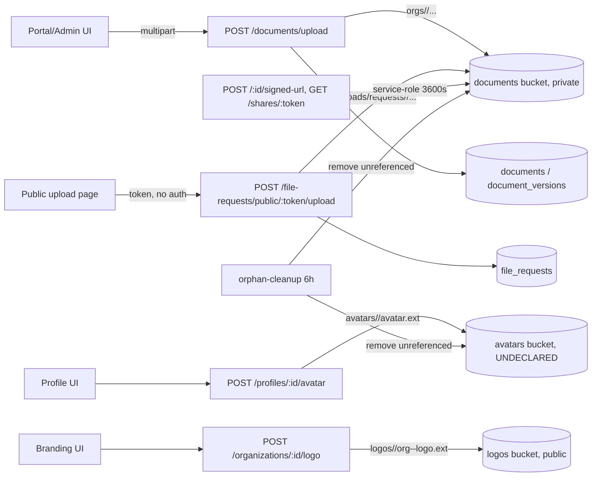

# File Upload and Download Security Audit

## Audit Metadata

- Audit name: repo-deep-dive
- Run: 20261002-0344-develop-6286137
- Repository: C:\temp\mainecybertech
- Branch: develop
- Commit SHA: 62861370
- Generated at: 2026-10-02T03:44:55Z (run scaffold); report authored 2026-10-02
- Auditor: OpenCode audit subagent (prompt 28, area code FILE)
- Area code: FILE
- Output path: docs/audits/repo-deep-dive/20261002-0344-develop-6286137/28_file_upload_download_security_audit.md
- Scope limitations:
  - Static, repository-only review. No API was started, no storage bucket was contacted, no file was uploaded or downloaded. RLS policy behavior, bucket `public` flags, and signed-URL enforcement are inferred from committed SQL/config only.
  - `git` is not installed on the audit host, so commit/branch identity is taken from the run metadata (`INDEX.md`, `audit_manifest.json`) rather than re-derived from `.git`. No file modification, checkout, or diff was performed.
  - Supabase project configuration (`storage`, bucket-level `file_size_limit`/`allowed_mime_types`, PITR plan) is not reachable from the repository and is marked `Unknown` where relevant.
  - The prior run at `prompts/repo-deep-dive/20260728-0142-develop-21a10d6/28_file_upload_download_security_audit.md` was read for continuity only. Every prior finding was re-checked at this commit; none was copied. The delta is large (multiple remediation cycles).
  - Cross-referenced but not duplicated: `06_security_authz_tenancy_audit.md` (SEC-*), `07_data_schema_migration_runtime_validation.md` (DATA-*), `32_backup_restore_drill.md` (DR-*), `37_supabase_rls_policy_deep_dive.md` (RLS-*), `45_exploit_chain_attack_path_audit.md` (CHAIN-*).

## Scope

Reviewed (repository evidence only):

- Upload paths: `apps/api/src/routes/documents.ts` (`POST /upload`), `apps/api/src/routes/file-requests.ts` (`POST /public/:token/upload`), `apps/api/src/routes/profiles.ts` (`POST /:id/avatar`), `apps/api/src/routes/organizations.ts` (`POST /:id/logo`).
- Shared upload content validation: `apps/api/src/lib/upload-validation.ts`.
- Download / signed URL paths: `POST /:id/signed-url`, `GET /shares/:token`, web consumers (`apps/web/app/(admin)/admin/documents/page.tsx`, `apps/web/app/(portal)/portal/documents/[documentId]/page.tsx`).
- Document versioning and deletion: `document_versions`, `DELETE /:id`, upload `documentId` replace branch.
- Storage buckets and policies: `supabase/migrations/5302026_...corrected.v3.sql`, `5302031_org_branding.sql`, `5302057_fix_bootstrap_rls_fk_indexes.sql`, `5302129_supabase_rls_audit_fixes.sql`; `supabase/config.toml.production.example`.
- Orphan/durability handling: `apps/worker/src/tasks/orphan-cleanup.ts`, `apps/worker/src/schedule-config.ts`.
- Exports: `apps/api/src/lib/csv.ts`, `apps/api/src/routes/{audit,projects,tickets,findings,...}.ts` export handlers.
- Tests: `apps/api/src/__tests__/documents.test.ts`, `file-requests.test.ts`, `profiles.test.ts`, `organizations.test.ts`, `tenant-scoping-guard.test.ts`, `apps/worker/src/__tests__/orphan-cleanup.test.ts`.
- Docs: `docs/ARCHITECTURAL_ANALYSIS.md`, `docs/CODE_REVIEW_2026-06-16.md`, `docs/ARCHITECTURAL_AUDIT_COMPLETE.md`, `SECURITY.md`, `supabase/config.toml.production.example`.

Not reviewed / out of scope:

- Runtime bucket state, CDN configuration, and any Supabase dashboard setting.
- Other modules' non-file exports beyond the shared CSV helper (owned by `06`/`07`).
- Billing/document retention product modules (owned by `07`/`32`).
- Any external object-storage replication (Spaces) — owned by `32` (DR-*).

## Evidence Reviewed

| Evidence | Type | Why relevant | Notes |
|---|---|---|---|
| `apps/api/src/routes/documents.ts` | Source | All document upload/download/share/version routes | Central file surface; bucket pinned; byte-sniffing wired |
| `apps/api/src/lib/upload-validation.ts` | Source | Content validation (markup reject, byte sniff) | Shared by documents + public file-request |
| `apps/api/src/routes/file-requests.ts` | Source | Public upload endpoint; token-scoped storage path | `requirePermission` on a public route; uploads to `documents` bucket under `uploads/requests/...` |
| `apps/api/src/routes/profiles.ts` / `organizations.ts` | Source | Avatar/logo upload to public buckets | `resolveImageUpload` allowlist; extension derived from MIME |
| `apps/api/src/validators/document.ts` | Source | Free-form `storageBucket`/`storagePath` accepted | No bucket allowlist |
| `apps/api/src/services/supabase.ts` | Source | `getScopedClient` default is service-role | RLS bypassed unless module allow-listed; signed URLs minted by service role |
| `apps/api/src/middleware/permissions.ts` | Source | `requirePermission` requires `req.authUser` | Explains public-upload 401 |
| `supabase/migrations/5302026_...v3.sql` (2297-2375) | Migration | `documents` bucket `public=false` + aligned RLS; `storage_path_org_id` (799-825) | Path expected `<org_uuid>/...` |
| `supabase/migrations/5302031_org_branding.sql`, `5302057` | Migration | `logos` bucket `public=true`, super-admin insert | Logo public by design |
| `supabase/migrations/5302129_...` (717-769) | Migration | Rewritten documents-bucket policies | Tighter than 5302026 |
| `supabase/config.toml.production.example` (64-66, 86) | Config | `[storage] file_size_limit="25MiB"`; private-bucket guidance | Bucket-level mime/size limits not present in migrations |
| `apps/worker/src/tasks/orphan-cleanup.ts` | Source | Deletes unreferenced objects in `documents`, `avatars` | Only checks `documents.storage_path`, not `document_versions.storage_path` |
| `apps/worker/src/schedule-config.ts` (48) | Source | `orphan-cleanup` runs every 6h | Amplifies version/object deletion |
| `apps/api/src/lib/csv.ts` | Source | Shared export serializer | No formula-injection neutralization; no per-tenant default |
| `packages/sdk/src/documents.ts` | Source | Client surface incl. `accessShare`, `createSignedUrl` | — |
| `apps/web/components/admin/OrgBrandingForm.tsx` (102) | Source | Client accepts `image/svg+xml` | Server now rejects SVG — client/server mismatch |
| `apps/worker/src/__tests__/orphan-cleanup.test.ts` | Test | Orphan behavior verification | Only current-path coverage; no version case |
| `apps/api/src/__tests__/file-requests.test.ts` | Test | `requirePermission` stubbed to pass | Masks the public-upload auth bug |
| `apps/api/src/__tests__/tenant-scoping-guard.test.ts` (110) | Test | Share endpoint allow-listed unscoped | Documents guard coverage boundaries |

## Verification Performed

| Evidence | Type | Why relevant | Notes |
|---|---|---|---|
| `grep storage\.|createSignedUrl|getPublicUrl|upload\(` across `apps/` and `packages/` | Walk | Enumerate file surface | 64 hits; primary surfaces are the 4 routes above |
| `grep insert into storage.buckets` across repo | Walk | Bucket inventory | Only `documents` and `logos` are declared; **no `avatars` bucket** anywhere in SQL |
| Read `5302026:2297-2375` + `5302129:717-769` | Walk | Private bucket + RLS | `documents` `public=false`; SELECT via `can_read_document`; write via `storage_path_org_id` |
| Read `5302026:799-825` (`storage_path_org_id`) | Walk | Tenant scoping of object paths | Regex requires leading UUID; `uploads/requests/...` returns `null` |
| Read `documents.ts:301-461` (upload) | Walk | Size/MIME/content controls | multer 2MB; MIME allowlist; `validateUploadContent`; bucket pinned |
| Read `documents.ts:566-592` (signed-url) | Walk | Signed URL lifetime | 3600s on `POST /:id/signed-url` and on share access |
| Read `documents.ts:145-203` (shares) | Walk | Revocation/expiry/max-access | Revocation, expiry, atomic max-access increment present |
| Read `documents.ts:353-401` (version replace) | Walk | Deletion/versioning | Removes prior object **before** DB update; removes new object on failure |
| Read `orphan-cleanup.ts:28-50` | Walk | Version object durability | Compares only `documents.storage_path`; version paths look orphaned |
| Read `profiles.ts:34-44`, `organizations.ts:35-52` | Walk | Public-bucket image hardening | MIME allowlist; extension derived from MIME; SVG rejected |
| Read `permissions.ts:54-93` | Walk | Public upload reachability | Returns 401 when `!req.authUser` |
| Grep `clamav|virus|malware|antivirus` | Walk | Content scanning hooks | No matches in app code; only unrelated module "scan" tasks |
| Grep `rate.?limit` + read `app.ts:125-146`, `rate-limit.ts` | Walk | Share/upload rate limits | Global IP 300/15m + per-user 600/15m; no per-token share limit |
| Read `csv.ts` | Walk | Export security | No CSV formula neutralization; export handlers default to all rows if `organization_id` omitted |
| Grep `document_versions` / version signed URL | Walk | Version download | No endpoint mints a signed URL for a version |
| Read `file-requests.ts:109-195` + `file-requests.test.ts` | Walk | Public upload correctness | Route is permission-gated; test stubs permission and never tests anonymous |
| Literal walk of the public upload flow (`UploadForm.tsx` → route) | Walk | End-to-end reachability | Anonymous POST has no Bearer token → 401 |

## Executive Summary

The document subsystem has clearly been through at least one hardening cycle and is now **materially stronger** than the prior (2026-07-28) run. Uploads to the private `documents` bucket are pinned server-side to `DOCUMENTS_BUCKET` (never read from the request), file extension and declared MIME are allowlisted, and the **bytes are sniffed** so HTML/SVG/script content is rejected and image/PDF magic bytes must match the declared type (`apps/api/src/lib/upload-validation.ts`). Public-bucket avatar/logo uploads now derive the stored extension from the validated MIME rather than from the attacker-controlled filename (`resolveImageUpload`). The `documents` bucket is private (`public=false`) with RLS aligned to `can_read_document` and `storage_path_org_id`; storage inserts/updates/deletes are gated by approved membership plus `documents:create/edit/delete`. Signed URLs use a 1-hour expiry, share links support revocation, expiry, and an atomic max-access increment, and document bulk/version-replace paths were made org-predicated. These are real, evidence-backed improvements and should be preserved.

However, the audit surfaces several **serious, concrete gaps** that are new or previously under-stated:

1. **The public file-request upload is broken and unsafe.** `POST /api/v1/file-requests/public/:token/upload` is gated by `requirePermission("file-requests","create")`, which returns 401 without an authenticated user — but the public upload form sends no token. Anonymous uploads therefore always fail (feature non-functional), and the test suite stubs the guard so CI cannot see it. Even if it worked, it writes into the private `documents` bucket under `uploads/requests/<token>/...`, a path `storage_path_org_id` cannot parse, with **no `documents` row created and no download endpoint** — so the file is both unreachable and eligible for orphan deletion (FILE-P1-001, FILE-P1-002).
2. **Document version history is destroyed rather than retained.** The upload replace branch deletes the previous storage object before the DB update; `orphan-cleanup` only compares against `documents.storage_path` (never `document_versions.storage_path`). Prior version bytes are therefore removed at replace time and again treated as orphans. `document_versions` becomes metadata-only and no version-download endpoint exists (FILE-P1-003).
3. **The `avatars` bucket is referenced by code but never created in any migration.** `profiles.ts` uploads to `avatars` and `orphan-cleanup` lists it, but no `insert into storage.buckets` declares it and no storage RLS policy targets it. Behavior depends entirely on out-of-band dashboard state; a fresh bootstrap would fail avatar uploads or, if the bucket defaults public, expose them without policy control (FILE-P2-001).
4. **`storageBucket`/`storagePath` are free-form on document create/update, and signed URLs are minted with the service-role client** (RLS bypassed by default because `RLS_WRITES_ENABLED` is empty). A caller with `documents:create` can point a document row at an arbitrary in-bucket path and obtain a signed URL for it, and the admin UI exposes a "provide a storage path" flow that normalizes arbitrary paths (FILE-P2-002; overlaps RLS-P3-003 and SEC findings — referenced, not duplicated).
5. **No content/AV scanning and no bucket-level size/MIME enforcement.** Only the API validates; the `documents` bucket is created with no `allowed_mime_types`/`file_size_limit`, so a direct-to-storage or future path would be unconstrained (FILE-P2-003).
6. **Durability for uploads is absent.** This corroborates sibling `32` (DR-P1-001): there is no backup/restore path for objects, and the only storage job *deletes*. A DB-only restore would leave `documents.storage_path` rows pointing at missing objects (FILE-P2-004; cross-ref DR-P1-001).

Strengths to keep: pinned bucket, byte-sniffing, MIME/extension allowlists for images, private documents bucket with aligned RLS, 1-hour signed URLs, share revocation/expiry/max-access, org-predicated bulk/version-replace, audit logging on create/update/delete/share, and a CI tenant-scoping guard. Recommended next actions, in order: fix or disable the public file-request upload (with a real download path + `documents` row); stop deleting version objects and reconcile `orphan-cleanup` against `document_versions`; declare the `avatars` bucket + policies in a migration; constrain `storageBucket`/`storagePath` to an allowlist and re-mint signed URLs with the user-scoped client for `documents`; add bucket-level MIME/size limits and an AV/content-scan hook; and add storage backup/versioning (jointly with prompt 32).

## Inventory

| Item | Path / symbol | Purpose | Current state | Risk | Notes |
|---|---|---|---|---|---|
| Document upload | `apps/api/src/routes/documents.ts` `POST /upload` | Store file + metadata | Implemented, hardened | Medium | multer 2MB; MIME allowlist; byte sniff; bucket pinned |
| Document create (metadata only) | `POST /` → `createDocumentSchema` | Metadata row w/ free-form bucket/path | Implemented, permissive | Medium-High | No bucket allowlist |
| Signed URL | `POST /:id/signed-url` | 1h download URL | Implemented | Medium | Service-role signing; RLS bypassed by default |
| Public share access | `GET /shares/:token` | Token download | Implemented | Medium | Revocation/expiry/max-access present; no per-token rate limit |
| Document delete | `DELETE /:id` | Remove row + object | Implemented | Medium | Hard delete; `deleted_at` column unused |
| Version replace | `POST /upload` (documentId branch) | New version, remove old | Implemented, lossy | High | Deletes prior object before DB commit |
| Version listing | `GET /:id/versions`, `/:id/versions/:versionId` | Metadata | Implemented | Medium | No version download/signed URL |
| Public file request | `apps/api/src/routes/file-requests.ts` `POST /public/:token/upload` | Anonymous intake | Implemented but broken | High | Permission-gated; uploads to `documents` under `uploads/requests/...` |
| File request create/list | `file-requests.ts` + `5302064_file_requests.sql` | Request lifecycle | Implemented | Medium | `max_file_size_mb` default 50 |
| Avatar upload | `apps/api/src/routes/profiles.ts` `POST /:id/avatar` | Public avatar | Implemented | Medium | `avatars` bucket not declared |
| Logo upload | `apps/api/src/routes/organizations.ts` `POST /:id/logo` | Public logo | Implemented | Low-Med | `logos` bucket public by design |
| Image MIME/extension | `resolveImageUpload` (profiles/organizations) | Public-bucket image hardening | Implemented | Low | Extension derived from MIME |
| Content validation | `apps/api/src/lib/upload-validation.ts` | Reject markup; sniff image/PDF | Implemented | Low | Partial type coverage (see FILE-P2-005) |
| Storage buckets | `5302026:2297-2299` (`documents`), `5302031` (`logos`) | Bucket declarations | Partial | High | `avatars` missing |
| Storage RLS (documents) | `5302129:717-769` | Tenant-scoped object access | Implemented | Low | `storage_path_org_id` regex-bound |
| Storage RLS (logos) | `5302031` + `5302057:56-65` | Public read, super-admin write | Implemented | Low | Public by design |
| Orphan cleanup | `apps/worker/src/tasks/orphan-cleanup.ts` | Delete unreferenced objects | Implemented, lossy | High | Ignores version paths |
| Exports | `apps/api/src/lib/csv.ts` + `/export` handlers | CSV/JSON download | Implemented | Medium | Formula injection; default all-rows |
| Client upload UI | `PortalDocumentsCenterClient.tsx`, `AdminDocumentsCenterClient.tsx`, `AdminDocUpload.tsx` | Upload forms | Implemented | Low-Med | No client size/type hints on most |
| SDK | `packages/sdk/src/documents.ts` | API client | Implemented | Low | Mirrors server surface |
| Tests | `documents.test.ts`, `file-requests.test.ts`, `profiles/organizations.test.ts`, `orphan-cleanup.test.ts` | Coverage | Partial | Medium | No share, byte-sniff, or anonymous-upload tests |

## Domain Scorecard

| Category | Score | Evidence | Gap | Recommended action |
|---|---:|---|---|---|
| Upload components | 4 | `documents.ts:117-132,301-461`; `upload-validation.ts`; `resolveImageUpload` | multer-only size; no AV; free-form bucket on create | Add bucket allowlist + AV hook; keep byte-sniff |
| Download endpoints | 3 | `POST /:id/signed-url` (3600s); `GET /shares/:token` | Service-role signing; no version download; admin path-injection flow | User-scoped signing; version signed URLs; validate paths |
| Document routes | 4 | `documents.ts` full router; org predicates at 355-363,532-547 | Versions metadata-only; hard delete w/ unused `deleted_at` | Reconcile versioning; soft-delete option |
| Attachments | 2 | No dedicated attachment model; shares + file-requests serve the role | File-request upload broken/unreachable | Fix intake path + download |
| Storage buckets | 3 | `5302026`, `5302031`; `config.toml.production.example:64-66` | `avatars` undeclared; no bucket mime/size limits | Migration for `avatars` + limits |
| Public/private files | 4 | `documents` private; `logos` public-by-design | `avatars` fate unknown (likely public) | Declare + document bucket visibility |
| Signed URLs | 3 | 3600s in both paths; revocation/expiry present | Service-role mint; no per-token throttle | User-scoped mint; throttle |
| Metadata | 3 | `documents.metadata` jsonb; `toJson` | `metadata` free-form; not validated | Add size/shape limits |
| MIME/extension/size validation | 4 | multer limits; MIME allowlist; `resolveImageUpload`; byte sniff | Office/zip sniffing absent; per-request limits API-only | Extend sniffing; bucket limits |
| Content scanning hooks | 1 | No `clamav`/`malware` refs | Entirely absent | Add scan-on-upload hook + quarantine |
| Image/PDF/document previews | 3 | `app/(admin)/admin/documents/page.tsx:95-105` preview-kind inference | Inline serving of public buckets | Ensure `Content-Disposition`/CSP for inline types |
| Exports | 3 | `csv.ts`; `/export` handlers | Formula injection; default all-rows; no per-tenant default | Sanitize cells; default to caller org |

## Detailed Review

### Item: Document upload (`POST /api/v1/documents/upload`)

- Evidence: `apps/api/src/routes/documents.ts:117-136,301-461`; `apps/api/src/lib/upload-validation.ts`.
- What it does: accepts a single multipart file, validates extension vs `BLOCKED_EXTENSIONS`, declared MIME vs `ALLOWED_MIME_TYPES`, and content via `validateUploadContent`; stores to `documents` bucket at `orgs/<organizationId>/<Date.now()>-<safeName>`; inserts a `documents` row and a `document_versions` row; logs `document.create`/`document.update`.
- How it appears to work: bucket is pinned (`DOCUMENTS_BUCKET`), `upsert:false`, safeName strips non-`[a-zA-Z0-9._-]`. Size ceiling is multer `2MB` (`documents.ts:119`).
- Dependencies: `requireAuth`, `requireOrgAccess`, `requirePermission("documents","create")`, Supabase Storage.
- Current controls: pinned bucket; extension + MIME allowlist; byte sniffing; unique path; audit log; org predicate on replace.
- Missing controls: no AV scan; no bucket-level MIME/size limit; size limit is 2MB in API but `config.toml.production.example` says 25MiB and docs claim 50MB.
- Risks: malware distribution via downloads; limit drift; large-file DoS bounded only at 2MB (good) but inconsistent with docs.
- Recommended improvement: add bucket `allowed_mime_types`/`file_size_limit`; add AV hook; align documented limits.
- Suggested tests: markup buffer rejected; mismatched image magic bytes rejected; >2MB rejected; cross-org replace 404.
- Suggested docs: `docs/modules/documents.md` with canonical limits and types.

### Item: Signed URL and share access

- Evidence: `documents.ts:145-203,566-592`; `packages/sdk/src/documents.ts:27-31,173-177`.
- What it does: `POST /:id/signed-url` mints a 3600s URL; `GET /shares/:token` validates revoked/expiry/max-access, mints a 3600s URL, and atomically increments `access_count` (`.lt("access_count", max_access)`).
- How it appears to work: both use `supabase.storage.from(bucket).createSignedUrl(path, 3600)`. The client from `getScopedClient` defaults to service-role (`services/supabase.ts:163-186`, allow-lists empty), so Storage RLS is not consulted at mint time for `documents`.
- Dependencies: `document_shares` (`5302043`), `documents` RLS, Storage.
- Current controls: 1h expiry; revocation; expiry; max-access; audit logs on share create/update/delete; atomic increment.
- Missing controls: no per-token/per-IP throttle specific to shares (only global limiter); no `download`/`disposition` control; no signed URL for versions; signing client is service-role.
- Risks: leaked share token usable at global-limit rate; signed URL for arbitrary path if `storage_path` is attacker-controlled.
- Recommended improvement: mint with user-scoped client for `documents`; add a dedicated share-endpoint limiter keyed by token hash; support `Content-Disposition`.
- Suggested tests: expired/revoked/max-access 403; concurrent max-access race yields exactly max_access; per-token limiter 429.
- Suggested docs: share token lifecycle and threat model.

### Item: Document versioning and deletion

- Evidence: `documents.ts:353-401,528-564,716-768`; `orphan-cleanup.ts:28-50`; `5302109_soft_delete.sql`.
- What it does: on version replace, fetches the target (org-predicated), removes the **current** object (`documents.ts:371-373`), updates the row, inserts a `document_versions` row. Delete removes the object then hard-deletes the row.
- How it appears to work: prior bytes are removed at replace; `document_versions` keeps only metadata; no endpoint signs version objects. `orphan-cleanup` compares `documents.storage_path` only.
- Dependencies: Storage; `document_versions` table.
- Current controls: org predicates; audit logs; version metadata retained.
- Missing controls: prior-version object retention; version download; soft-delete not used despite `deleted_at`.
- Risks: version history not restorable (false sense of retention); cleanup deletes version objects; approval/compliance evidence loss.
- Recommended improvement: keep version objects (or move to cold storage) and reconcile cleanup against the union of `documents.storage_path` and `document_versions.storage_path`; optionally honor `deleted_at`.
- Suggested tests: replace → old object still retrievable via a version signed URL; cleanup does not delete any `document_versions.storage_path`.
- Suggested docs: versioning retention policy.

### Item: Public file-request upload

- Evidence: `file-requests.ts:109-195`; `apps/web/app/(public)/upload/[token]/UploadForm.tsx:35`; `permissions.ts:54-93`; `5302064_file_requests.sql`; `storage_path_org_id` (`5302026:799-825`).
- What it does: intended anonymous intake to a token-scoped folder; validates request status/expiry/max_files/per-request size/allowed MIME, byte-sniffs, uploads to `documents` bucket at `uploads/requests/<token>/<ts>-<name>`, increments `upload_count`, notifies.
- How it appears to work: the route is gated by `requirePermission("file-requests","create")` (401 without auth) — the public form sends no Bearer token, so the flow cannot succeed for an anonymous uploader.
- Dependencies: `file_requests` RLS, Storage, notification.
- Current controls: per-request size/MIME, byte-sniff, token expiry/status/max_files, byte-sniff, audit log (actor = creator).
- Missing controls: auth model for the public route; storage path is not org-scoped (unparseable by `storage_path_org_id`); **no `documents` row and no download endpoint**; orphan-cleanup will delete these objects.
- Risks: broken feature; if the guard were relaxed naively, unscoped objects in the private bucket; uploaded data silently deleted within 6h.
- Recommended improvement: replace the guard with a token-only middleware; write to a dedicated bucket (e.g. `uploads`) with a token path policy, or insert a `documents`/`file_request_uploads` row; add an authenticated download endpoint; exclude this prefix from orphan cleanup.
- Suggested tests: anonymous upload succeeds with a valid token; fails with expired/revoked/full; upload is downloadable by the owning org; cleanup never deletes an active upload.
- Suggested docs: file-request data flow and retention.

### Item: Public-bucket image uploads (avatars/logos)

- Evidence: `profiles.ts:14-44,204-252`; `organizations.ts:22-52,550-596`; `5302031`; `5302057:56-65`; `OrgBrandingForm.tsx:102`.
- What it does: validates declared MIME against a 4-type image allowlist and derives stored extension from the MIME; uploads with `upsert:true`; returns `getPublicUrl`.
- How it appears to work: prevents `.svg`/`.html`/`.js` extension echo into a public bucket (stored-XSS/phishing); logos bucket is `public=true` with `is_super_admin` insert; avatar bucket is **not declared**.
- Dependencies: Storage; `profiles`/`organizations`.
- Current controls: MIME allowlist; MIME-derived extension; service-user client for upload; audit logs.
- Missing controls: `avatars` bucket declaration/policy; client still offers SVG for logos; no byte-sniff for these image paths.
- Risks: fresh-environment avatar failure; if `avatars` defaults public, unreviewed policy; inconsistent client affordance.
- Recommended improvement: migration declaring `avatars` (public/private decision) + policies; align `OrgBrandingForm` accept list with server; byte-sniff images.
- Suggested tests: SVG rejected server-side; `.php`-named image with `image/png` MIME stored as `.png`; avatar/logo policies present in bootstrap.
- Suggested docs: bucket visibility matrix.

### Item: Exports (CSV/JSON)

- Evidence: `apps/api/src/lib/csv.ts`; `apps/api/src/routes/{audit,projects,tickets,findings,approvals,assets,domain-monitors,proposals}.ts` `/export`; `client-onboarding-command-center.ts:98`, `satisfaction-pulse-widget.ts:103`.
- What it does: serializes rows to CSV (`rowsToCsv`) or JSON, sets `Content-Disposition: attachment`.
- How it appears to work: values are quoted/escaped for CSV syntax but **not** for spreadsheet formula injection; several handlers filter by optional `organization_id` and otherwise return all rows (bounded by `.limit(10000)`).
- Dependencies: scoped client (service-role by default).
- Current controls: attachment disposition; row caps; `requireAuth`/`requireAdmin` or `requireOrgAccess` per router.
- Missing controls: formula neutralization; mandatory tenant filter; export auditing for some modules.
- Risks: exported CSV opens a formula/injection vector for downstream users; an unscoped export under service-role could leak cross-tenant rows where RLS is bypassed.
- Recommended improvement: prefix-escape `= + - @` cells; require/default `organization_id` to caller org; log exports.
- Suggested tests: cell starting with `=` is escaped; export without `organization_id` returns only caller-org rows.
- Suggested docs: export safety guidance.

## Scenario / Control Matrix

| ID | Scenario or control | Evidence | Current control | Gap | Severity | Recommendation |
|---|---|---|---|---|---|---|
| FILE-001 | Upload components | `documents.ts:301-461` | Pinned bucket, allowlists, byte sniff | No AV; 2MB vs docs 50MB | P2 | AV hook; align limits |
| FILE-002 | Download endpoints | `documents.ts:566-592` | 1h signed URL | Service-role signing | P2 | User-scoped mint |
| FILE-003 | Document routes | `documents.ts` router | Org predicates, audit logs | Versions metadata-only | P1 | Retain version objects |
| FILE-004 | Attachments | `file-requests.ts:109-195` | Token/status/size/MIME checks | Public route unreachable; no download; cleanup deletes | P1 | Fix intake + download |
| FILE-005 | Storage buckets | `5302026`, `5302031` | documents private; logos public | `avatars` undeclared; no bucket limits | P2 | Declare `avatars` + limits |
| FILE-006 | Public/private files | `documents` private, `logos` public | Documented by design for logos | `avatars` visibility unknown | P2 | Migration + docs |
| FILE-007 | Signed URLs | `documents.ts:170-172,581-583` | 3600s expiry | No per-token throttle | P2 | Add limiter |
| FILE-008 | Metadata | `documents.metadata`, `toJson` | Stored as jsonb | Not validated | P3 | Add shape/size limits |
| FILE-009 | MIME/extension/size | `upload-validation.ts`, multer | Allowlist + sniff | Office/zip not sniffed | P2 | Extend sniffing |
| FILE-010 | Content scanning hooks | no refs | None | Entirely absent | P2 | Add scan hook |
| FILE-011 | Image/PDF previews | `admin/documents/page.tsx:95-105` | Preview-kind inference | Inline serving controls | P3 | Ensure disposition/CSP |
| FILE-012 | Exports | `csv.ts` | Escaping for CSV syntax | Formula injection; default all-rows | P2 | Sanitize + scope |

## Findings

### Finding ID: FILE-P1-001 - Public file-request upload is permission-gated and unreachable for anonymous uploaders

- Severity: P1
- Confidence: High
- Area: FILE
- Evidence:
  - `apps/api/src/routes/file-requests.ts:109-113` — `router.post("/public/:token/upload", requirePermission("file-requests", "create"), upload.single("file"), ...)`.
  - `apps/api/src/middleware/permissions.ts:59-61` — `if (!req.authUser) throw new AppError("UNAUTHORIZED", "Authentication required", 401)`.
  - `apps/web/app/(public)/upload/[token]/UploadForm.tsx:35-38` — the public form `fetch`es the endpoint with **no** `Authorization` header.
  - `apps/api/src/__tests__/file-requests.test.ts:68-73` — `requirePermission` is mocked to always call `next()`, and no test exercises the anonymous upload.
- What is happening: the intake endpoint requires an authenticated user with the `file-requests:create` permission, but the flow is designed for anonymous external uploaders (token-only). Anonymous requests are rejected with 401 before reaching the handler.
- Why it matters: the secure file-request feature cannot work in production for its intended users; the test suite masks it by stubbing the guard.
- User / business impact: clients cannot upload requested files; the feature silently fails, damaging trust and forcing insecure workarounds (email attachments).
- Security / privacy / reliability impact: if the guard is instead relaxed naively to "always next", the route becomes fully unauthenticated with only token checks and writes into the private `documents` bucket — a reflexive over-correction risk.
- Recommended fix: introduce a token-only middleware (validate `file_requests.token`, status, expiry, `max_files`) with no `req.authUser` requirement, and keep `requirePermission` only on the management routes. Add an explicit test for the anonymous path.
- Suggested validation: supertest `POST /api/v1/file-requests/public/:token/upload` with a valid token and no Authorization header returns 200 and writes an object; expired/revoked/full tokens return 410.
- Owner suggestion: API/platform team
- Effort estimate: S
- Dependencies: file-request download path (FILE-P1-002)
- Status: open
- Endpoint / data path: `POST /api/v1/file-requests/public/:token/upload` → `file-requests.ts` handler → Supabase Storage `documents` bucket
- Attack path: none identified (availability/correctness defect)

### Finding ID: FILE-P1-002 - File-request uploads have no tenant-scoped path and no download path; orphan cleanup will delete them

- Severity: P1
- Confidence: High
- Area: FILE
- Evidence:
  - `apps/api/src/routes/file-requests.ts:146-159` — uploads to `documents` bucket at `uploads/requests/<token>/<ts>-<name>`; no `documents`/`file_request_uploads` row is inserted.
  - `supabase/migrations/5302026_...v3.sql:799-825` — `storage_path_org_id` matches only a leading UUID; `uploads/...` returns `null`.
  - `apps/worker/src/tasks/orphan-cleanup.ts:28-49` — lists `documents`, selects `documents.storage_path`, removes any path not in that set.
  - `apps/worker/src/schedule-config.ts:48` — `orphan-cleanup` runs every 6 hours.
  - No handler in `file-requests.ts` lists or signs the uploaded objects (route inventory: GET `/`, GET `/:id`, POST `/`, PATCH `/:id`, DELETE `/:id`, public GET/upload).
- What is happening: uploaded content is written to the private `documents` bucket under a prefix that is neither org-parsable nor tracked by a DB row. Nothing can download it, and the recurring cleanup job treats it as an orphan and deletes it.
- Why it matters: user-supplied files are unreachable and silently destroyed, independent of any backup concern.
- User / business impact: uploaded evidence/documents vanish within ~6 hours with no notification; the requester and admin believe the upload succeeded.
- Security / privacy / reliability impact: silent data loss; inconsistent RLS/exclusion assumptions; if a download endpoint is later added against badly-scoped paths it could leak cross-tenant objects.
- Recommended fix: (a) write to a dedicated bucket (or `uploads/<org_uuid>/requests/<token>/...`) so `storage_path_org_id` resolves; (b) persist a row (`documents` or a new `file_request_uploads`) with `organization_id`, `storage_bucket`, `storage_path`, `mime_type`, `file_size`; (c) add an org-authorized list/signed-URL endpoint; (d) exclude the intake prefix from orphan cleanup until it is reconciled against the new table.
- Suggested validation: after an upload, an org member can list and download it via a signed URL; run `orphanCleanup({})` and assert the object survives.
- Owner suggestion: API/platform team + worker owner
- Effort estimate: M
- Dependencies: FILE-P1-001; RLS/migration owner (prompt 37)
- Status: open
- Endpoint / data path: `POST /api/v1/file-requests/public/:token/upload` → `documents` bucket; cleanup job `orphan-cleanup` → `.remove()`
- Attack path: none identified (data-loss path)

### Finding ID: FILE-P1-003 - Document version history objects are deleted at replace and by orphan cleanup

- Severity: P1
- Confidence: High
- Area: FILE
- Evidence:
  - `apps/api/src/routes/documents.ts:371-401` — on version replace, `remove([current.storage_path])` is called **before** the DB update; the new `document_versions` row stores only the new `storage_path`; prior object bytes are gone.
  - `apps/api/src/routes/documents.ts:391-394` — if the update fails, the **new** object is also removed, so both old and new objects are lost.
  - `apps/worker/src/tasks/orphan-cleanup.ts:28-35` — compares only `documents.storage_path`, never `document_versions.storage_path`; version-only objects are removed.
  - `apps/api/src/routes/documents.ts:716-768` — version listing/read endpoints return metadata only; no signed URL is minted for a version object.
- What is happening: replacing a document deletes the previous version's bytes, and the recurring cleanup independently deletes any object not referenced by the current `documents.storage_path`. `document_versions` therefore retains metadata for content that no longer exists.
- Why it matters: the system presents a version history that is not restorable — a false retention guarantee that is especially risky for compliance/evidence documents.
- User / business impact: users cannot recover a prior revision after an erroneous overwrite; audit/compliance expectations are unmet.
- Security / privacy / reliability impact: silent loss of previously reviewed content; potential regulatory exposure where version retention is promised.
- Recommended fix: retain prior-version objects (or migrate them to cold storage) on replace; reconcile `orphan-cleanup` against the union of `documents.storage_path` and `document_versions.storage_path`; add a version download/signed-URL endpoint gated by `can_read_document`; make replace atomic (write new → update DB → then best-effort delete old only if retention policy allows).
- Suggested validation: replace a document, then download version N via a signed URL and assert bytes match; run `orphanCleanup({})` and assert no `document_versions.storage_path` was removed.
- Owner suggestion: API/platform team + worker owner
- Effort estimate: M
- Dependencies: version download route; storage backup (prompt 32)
- Status: open
- Endpoint / data path: `POST /api/v1/documents/upload` (documentId branch) → `documents`/`document_versions`; `orphan-cleanup` task
- Attack path: none identified

### Finding ID: FILE-P2-001 - `avatars` bucket is used by code but declared nowhere with no storage RLS policy

- Severity: P2
- Confidence: High
- Area: FILE
- Evidence:
  - `apps/api/src/routes/profiles.ts:220-229` — uploads to bucket `"avatars"` and calls `getPublicUrl`.
  - `apps/worker/src/tasks/orphan-cleanup.ts:10,52-62` — lists and prunes `"avatars"`.
  - Repository-wide `insert into storage.buckets` search → only `5302026:2297` (`documents`) and `5302031:10` (`logos`); no `avatars` declaration.
  - Repository-wide storage policy search → no policy references `avatars`.
- What is happening: the `avatars` bucket exists only as an implicit assumption. It is not created, sized, MIME-constrained, or policy-governed by any migration, so its behavior depends entirely on out-of-band dashboard state.
- Why it matters: a fresh bootstrap/restore would produce failing avatar uploads (if the bucket is absent) or an ungoverned public bucket (if created ad hoc), and `orphan-cleanup` would error/log on every run.
- User / business impact: avatars may 500 on a new environment; unpredictable privacy exposure of user photos if the bucket defaults to public without a policy.
- Security / privacy / reliability impact: undocumented public exposure of user-uploaded images; non-reproducible infrastructure.
- Recommended fix: add a migration declaring `avatars` with an explicit `public` flag (expected `true`, matching `getPublicUrl`) and object policies (authenticated read; owner-scoped or super-admin write); optionally add `file_size_limit`/`allowed_mime_types`; document the visibility matrix.
- Suggested validation: bootstrap from migrations and confirm the bucket exists with the intended `public` flag and policies; avatar upload/read succeeds; direct unauthenticated write is denied.
- Owner suggestion: Supabase/DB owner (prompt 37)
- Effort estimate: S
- Dependencies: `5302129` policy conventions
- Status: open
- Endpoint / data path: `POST /api/v1/profiles/:id/avatar` → `avatars` bucket
- Attack path: ungoverned public bucket → user image exposure (bounded)

### Finding ID: FILE-P2-002 - Free-form `storageBucket`/`storagePath` on create/update allows signing arbitrary in-bucket objects

- Severity: P2
- Confidence: Medium
- Area: FILE
- Evidence:
  - `apps/api/src/validators/document.ts:9-10,24-25` — `storageBucket`/`storagePath` are plain optional strings (no allowlist).
  - `apps/api/src/routes/documents.ts:264-282` — `POST /` persists caller-supplied `storage_bucket`/`storage_path`.
  - `apps/api/src/routes/documents.ts:486-497` — `PATCH /:id` can rewrite `storage_bucket`/`storage_path`.
  - `apps/api/src/routes/documents.ts:566-592` — `POST /:id/signed-url` signs whatever `storage_bucket`/`storage_path` the row holds.
  - `apps/api/src/services/supabase.ts:163-186` — `getScopedClient` returns the service-role client unless a module is allow-listed (`RLS_WRITES_ENABLED`/`RLS_READS_ENABLED` empty by default), so Storage RLS is not consulted when minting the URL.
  - `apps/web/app/(admin)/admin/documents/page.tsx:199-217` — an admin "provide a storage path" flow creates a document row from an arbitrary path.
- What is happening: a user with `documents:create`/`edit` can point a document row at an arbitrary object path within a bucket and then request a signed URL for it. Because the API signs with the service role by default, the storage SELECT policy is bypassed at mint time.
- Why it matters: object paths are the only identifier; if a caller learns or guesses another object's path (paths embed org UUID + timestamp, and `GET /documents` returns `storage_path` for readable rows), they can sign it. It also breaks the invariant that `storage_path` is server-derived.
- User / business impact: potential unauthorized retrieval of another tenant's object; unreliable document URLs when rows are edited to bogus paths.
- Security / privacy / reliability impact: cross-tenant file disclosure; integrity loss of the storage mapping.
- Recommended fix: constrain `storageBucket` to an allowlist (`documents` only for this route) and `storagePath` to a validated shape (`^orgs/<orgId>/...`), or remove these fields from create/update entirely and derive them server-side; mint signed URLs with the user-scoped client for the `documents` module; drop/guard the admin arbitrary-path flow.
- Suggested validation: as org A, `PATCH` a doc to `storageBucket:"avatars"`/foreign path → 400/403; `POST /:id/signed-url` for a row whose path is outside the caller's org prefix → denied.
- Owner suggestion: API/platform team
- Effort estimate: S–M
- Dependencies: `getScopedClient` allow-list rollout (services/supabase.ts); overlaps RLS-P3-003 (referenced, not duplicated)
- Status: open
- Endpoint / data path: `POST /api/v1/documents` / `PATCH /:id` → `POST /:id/signed-url` → Supabase Storage signed URL
- Attack path: CHAIN-relevant — combine with knowledge of a foreign `storage_path` (e.g. returned by a list/search) to mint a service-role signed URL; see prompt 45

### Finding ID: FILE-P2-003 - No content/AV scanning and no bucket-level MIME/size limits on the documents bucket

- Severity: P2
- Confidence: High
- Area: FILE
- Evidence:
  - Repository-wide search for `clamav|virus|malware|antivirus|scanFile` in app code → no upload-scanning code (only unrelated module "scan" scheduler).
  - `supabase/migrations/5302026_...v3.sql:2297-2299` — `insert into storage.buckets (id, name, public) values ('documents','documents',false)` — no `allowed_mime_types`, no `file_size_limit`.
  - `supabase/config.toml.production.example:64-66` — `[storage] file_size_limit = "25MiB"` (global only).
  - `apps/api/src/routes/documents.ts:117-132` — the only MIME/size enforcement is in the API process.
- What is happening: all content validation lives in the Express handler. Anyone who can reach Storage by another route (or a future direct-upload path) bypasses it; nothing inspects file contents for malware.
- Why it matters: uploaded Office/PDF/archive files are redistributed to other users on download, so an infected upload propagates internally.
- User / business impact: malware delivery through the client portal; incident-response cost; reputational damage.
- Security / privacy / reliability impact: no detection/quarantine; defense-in-depth is single-layered.
- Recommended fix: set bucket `allowed_mime_types` and `file_size_limit` in a migration; add an asynchronous scan-on-upload hook (e.g. ClamAV sidecar or a scanning service) that quarantines/denies before the file is offered for download; record scan status in the document row.
- Suggested validation: an EICAR sample upload is rejected/quarantined; a direct-to-storage upload exceeding the bucket limit is rejected by Storage.
- Owner suggestion: API/platform + infra
- Effort estimate: L
- Dependencies: storage pipeline; container runtime (prompt 36) if a sidecar is added
- Status: open
- Endpoint / data path: `POST /api/v1/documents/upload` → `documents` bucket
- Attack path: none identified directly; enabler for client-side execution if downloads are ever opened in a trusted context

### Finding ID: FILE-P2-004 - No backup or restore path for uploaded objects (durability for files)

- Severity: P2
- Confidence: High
- Area: FILE
- Evidence:
  - `apps/worker/src/tasks/orphan-cleanup.ts` — the only storage-object job, and it **deletes**.
  - `apps/worker/src/tasks/index.ts:43` + `schedule-config.ts:48` — only `orphan-cleanup` touches buckets.
  - `scripts/backup-database.sh` / `db-backup.yml` (per prompt 32) dump Postgres only; no storage export.
  - `supabase/config.toml.production.example:86` — guidance says private buckets via signed URLs; no backup/versioning guidance.
- What is happening: uploaded documents/avatars/logos have no backup, no provider-native versioning configured in-repo, and no restore path. A DB-only restore leaves `documents.storage_path` rows pointing at missing objects.
- Why it matters: client-uploaded documents are often the least reproducible and most business-critical data, yet they are the least protected.
- User / business impact: permanent, unrecoverable loss of client documents/logos on a bucket-level incident.
- Security / privacy / reliability impact: business-continuity gap; no RPO/RTO for objects.
- Recommended fix: enable provider object versioning/retention for the buckets, or add a scheduled export of buckets to S3/Spaces with checksums; define RPO/RTO for objects; run a delete-and-recover drill. This is the file-domain contribution to the storage row already identified by prompt 32 (DR-P1-001).
- Suggested validation: delete a scratch object and recover it from versioning/backup; verify checksum after recovery.
- Owner suggestion: platform/DR owner (joint with prompt 32)
- Effort estimate: L
- Dependencies: prompt 32 (DR-P1-001), Supabase plan tier (`Unknown`)
- Status: open
- Endpoint / data path: Storage buckets `documents`/`avatars`/`logos`
- Attack path: none identified

### Finding ID: FILE-P2-005 - Content sniffing does not cover Office, archive, text/JSON, or polyglot payloads

- Severity: P2
- Confidence: Medium
- Area: FILE
- Evidence:
  - `apps/api/src/lib/upload-validation.ts:40-81` — `validateUploadContent` rejects markup and byte-sniffs only `image/*` and `application/pdf`.
  - `apps/api/src/routes/documents.ts:96-115` — `ALLOWED_MIME_TYPES` includes Office, zip/gzip, JSON, RTF, plain, CSV for which content is not inspected.
  - `docs/CODE_REVIEW_2026-06-16.md:897-904` — prior commitment to MIME + magic-byte validation; only partially delivered.
- What is happening: a file declared as an Office/zip/JSON/text type is stored without content verification; the only barrier for markup is the 512-byte head check, which a leading-padding polyglot can evade.
- Why it matters: an HTML/SVG payload padded past 512 bytes with a plausible Office/zip header could be stored and later served/downloaded; JSON/RTF can carry active content.
- User / business impact: users may open malicious office/archive content sourced through the portal.
- Security / privacy / reliability impact: stored-XSS/malware enabler, narrowed but not eliminated by existing checks.
- Recommended fix: extend sniffing to zip/OOXML container magic (`PK\x03\x04`), gzip (`\x1f\x8b`), and enforce declared-vs-detected agreement for all allowlisted families; scan full buffer for `<!doctype`/`<script`/`<svg` rather than the first 512 bytes; add AV scanning (FILE-P2-003).
- Suggested validation: a padded HTML file declared `application/vnd...wordprocessingml.document` is rejected; a true `.docx` passes; a `.zip` containing an SV G is flagged during scan.
- Owner suggestion: API/platform team
- Effort estimate: S–M
- Dependencies: FILE-P2-003
- Status: open
- Endpoint / data path: `POST /api/v1/documents/upload` → `validateUploadContent`
- Attack path: CHAIN-relevant — polyglot upload + a future inline-serving path

### Finding ID: FILE-P2-006 - CSV exports do not neutralize formula injection and default to all rows when `organization_id` is omitted

- Severity: P2
- Confidence: Medium
- Area: FILE
- Evidence:
  - `apps/api/src/lib/csv.ts:8-26` — `escapeCsvValue` handles quotes/newlines but does not prefix-escape `=`, `+`, `-`, `@`.
  - `apps/api/src/routes/projects.ts:51-67`, `apps/api/src/routes/audit.ts:60-84` — export queries filter by optional `organization_id`; when absent they return unscoped rows.
  - `apps/api/src/services/supabase.ts:163-186` — default client is service-role, so RLS does not constrain the unscoped query.
- What is happening: exported CSV cells beginning with spreadsheet formula characters are written verbatim, and exports that omit `organization_id` rely on `requireOrgAccess`/`requireAdmin` rather than a mandatory tenant predicate.
- Why it matters: a user opening an exported CSV in Excel/Sheets may execute injected formulas; unscoped exports under service role risk returning cross-tenant rows.
- User / business impact: data exfiltration via CSV formula or accidental cross-tenant data in an export.
- Security / privacy / reliability impact: export-integrity and tenant-isolation risk.
- Recommended fix: prefix `'` to any cell beginning with `= + - @ \t \r`; default `organization_id` to the caller's resolved org and reject cross-org values; log export actions.
- Suggested validation: export a row whose name is `=cmd|' /C calc'!A0` and assert it is quoted/escaped; export without `organization_id` returns only caller-org rows.
- Owner suggestion: API/platform team
- Effort estimate: S
- Dependencies: `req.orgScope` resolution
- Status: open
- Endpoint / data path: `GET /api/v1/{module}/export` → `sendExportResponse`
- Attack path: CHAIN-relevant — CSV injection delivered to an internal operator

### Finding ID: FILE-P3-001 - Share endpoint has no per-token rate limit

- Severity: P3
- Confidence: Medium
- Area: FILE
- Evidence:
  - `apps/api/src/routes/documents.ts:145-203` — `GET /shares/:token` is public and has no route-level limiter.
  - `apps/api/src/app.ts:125-146` — only the global IP limiter (300/15m) and `rateLimitByUser` (600/15m) apply.
  - `apps/api/src/middleware/rate-limit.ts` — no token-keyed limiter exists.
- What is happening: a leaked share token can be fetched at the global-limiter rate (300/15m per IP) and the access_count consumed rapidly, though expiry/max-access cap total uses.
- Why it matters: token consumption/traffic amplification and harder abuse attribution.
- Recommended fix: add a limiter keyed by `sha256(token)` (short window) on the share route.
- Suggested validation: exceeding the per-token limit returns 429 while other tokens continue.
- Owner suggestion: API/platform team
- Effort estimate: S
- Dependencies: none
- Status: open
- Endpoint / data path: `GET /api/v1/documents/shares/:token`

### Finding ID: FILE-P3-002 - Client logo accept list still advertises SVG that the server rejects

- Severity: P3
- Confidence: High
- Area: FILE
- Evidence:
  - `apps/web/components/admin/OrgBrandingForm.tsx:102` — `accept="image/png,image/jpeg,image/svg+xml"`.
  - `apps/api/src/routes/organizations.ts:35-52` — `resolveImageUpload` rejects SVG (only jpeg/png/webp/gif).
- What is happening: the file picker offers SVG for logos, but the server rejects it, producing a confusing failure.
- Why it matters: poor UX and a support-burden/consistency defect; also signals the old SVG risk has not been fully decommissioned in the UI.
- Recommended fix: update `accept` to `image/png,image/jpeg,image/webp,image/gif` and show the server-side error clearly.
- Suggested validation: selecting an SVG in the picker is blocked or immediately errors with the server message.
- Owner suggestion: Web/frontend team
- Effort estimate: S
- Dependencies: none
- Status: open

### Finding ID: FILE-P3-003 - Documentation drift on file types and size limits; no documents/upload runbook

- Severity: P3
- Confidence: Medium
- Area: FILE
- Evidence:
  - `docs/ARCHITECTURAL_ANALYSIS.md:268` — "Storage: documents (private, 50MB), avatars (public, 2MB)".
  - `apps/api/src/routes/documents.ts:119` — documents multer limit is `2 * 1024 * 1024` (2MB), not 50MB.
  - `supabase/config.toml.production.example:66` — `file_size_limit = "25MiB"`.
  - `apps/api/src/routes/file-requests.ts:60` — file-requests multer limit is 25MB; `5302064_file_requests.sql:11` default `max_file_size_mb` 50.
  - `SECURITY.md:34` mentions "storage policies" with no file-handling detail.
- What is happening: documented limits (50MB) contradict the enforced API limit (2MB) and the global storage limit (25MiB); the bucket inventory (avatars) does not match code.
- Why it matters: operators and future agents will mis-state capacity and behavior; incidents will be debugged against wrong assumptions.
- Recommended fix: publish a canonical File Handling doc: bucket matrix, per-route limits, allowed MIME, signed-URL lifetime, share semantics, retention, and orphan-cleanup scope; reconcile the doc and code limits in one change.
- Suggested validation: a doc test or checklist confirms each documented limit matches the corresponding constant.
- Owner suggestion: Documentation owner
- Effort estimate: S
- Dependencies: FILE-P2-001 decisions (bucket visibility)
- Status: open

## Risks

| Risk | Severity | Likelihood | Impact | Evidence | Mitigation |
|---|---|---|---|---|---|
| Public file-request upload broken (401 for anonymous) | P1 | High | Feature unusable | `file-requests.ts:111`, `permissions.ts:59-61`, `UploadForm.tsx:35` | Token-only middleware + tests (FILE-P1-001) |
| File-request uploads silently deleted as orphans | P1 | High | Data loss | `orphan-cleanup.ts:28-49`, `schedule-config.ts:48`, `file-requests.ts:147` | Persist a row, exclude prefix, add download (FILE-P1-002) |
| Version history bytes unrecoverable | P1 | High | Loss of prior revisions | `documents.ts:371-401`, `orphan-cleanup.ts:30-32` | Retain versions, reconcile cleanup (FILE-P1-003) |
| `avatars` bucket ungoverned/absent | P2 | Medium | Privacy/failure | `profiles.ts:220-229`; no bucket SQL | Declare bucket + policies (FILE-P2-001) |
| Arbitrary in-bucket signing via free-form path | P2 | Medium | Cross-tenant file disclosure | `document.ts:9-10,24-25`, `documents.ts:264-282,566-592` | Allowlist paths, user-scoped signing (FILE-P2-002) |
| Malware propagation via downloads | P2 | Medium | Client infection | No scan code; bucket has no limits | AV hook + bucket limits (FILE-P2-003) |
| No backup/restore for objects | P2 | Medium | Unrecoverable loss | `orphan-cleanup.ts` only; prompt 32 | Storage versioning/export + drill (FILE-P2-004) |
| Polyglot/padded markup bypasses head check | P2 | Low-Med | Stored XSS enabler | `upload-validation.ts:8-17` | Full-buffer + container sniffing (FILE-P2-005) |
| CSV formula injection in exports | P2 | Medium | Client-side execution | `csv.ts:8-26` | Cell sanitization (FILE-P2-006) |

## Recommendations

### Immediate / Release Blocking

- Fix the public file-request upload auth model (FILE-P1-001) or disable the feature until fixed; add an anonymous-path test.
- Prevent silent deletion of file-request uploads: persist a row and exclude/adjust cleanup (FILE-P1-002).

### This Week

- Stop deleting document version objects; reconcile `orphan-cleanup` against `document_versions` (FILE-P1-003).
- Declare the `avatars` bucket + policies in a migration (FILE-P2-001).
- Constrain `storageBucket`/`storagePath` and mint signed URLs with the user-scoped client (FILE-P2-002).
- Add CSV formula neutralization and a mandatory tenant filter for exports (FILE-P2-006).

### This Month

- Add bucket-level `allowed_mime_types`/`file_size_limit` and an AV/content-scan hook with quarantine (FILE-P2-003).
- Extend content sniffing to Office/archive/text and full-buffer markup detection (FILE-P2-005).
- Add a per-token share rate limiter (FILE-P3-001).
- Align client accept lists and documentation with server behavior (FILE-P3-002, FILE-P3-003).

### Later / Platform Evolution

- Storage backup/versioning + a delete-and-recover drill (FILE-P2-004), jointly with prompt 32.
- Move to a server-derived storage mapping (`storage_path` never caller-supplied) and flow-scoped signed URLs.

## Quick Wins

| Quick win | Why it helps | Files likely involved | Validation |
|---|---|---|---|
| Token-only middleware for public upload | Restores the feature and fixes the auth model | `apps/api/src/routes/file-requests.ts` | Anonymous valid-token upload returns 200 |
| Escape CSV formula cells | Blocks CSV injection | `apps/api/src/lib/csv.ts` | `=cmd` cell escaped |
| Fix logo `accept` list | Removes confusing SVG failures | `apps/web/components/admin/OrgBrandingForm.tsx` | SVG not offered |
| Reconcile cleanup with versions | Prevents version deletion | `apps/worker/src/tasks/orphan-cleanup.ts` | Version paths survive cleanup |
| Per-token share limiter | Throttles leaked tokens | `apps/api/src/routes/documents.ts`, `middleware/rate-limit.ts` | 429 on token flood |
| Bucket allowlist on create/update | Stops path injection | `apps/api/src/validators/document.ts` | Foreign bucket/path rejected |

## Hardening Backlog

| Backlog item | Priority | Owner suggestion | Effort | Dependency |
|---|---|---|---|---|
| Token-only public upload + anonymous test | P1 | API | S | — |
| Persist file-request uploads + download endpoint + cleanup exclusion | P1 | API + worker | M | schema/RLS |
| Retain version objects + version signed URL | P1 | API + worker | M | RLS `can_read_document` |
| Declare `avatars` bucket + policies | P2 | DB/RLS | S | 5302129 conventions |
| Allowlist `storageBucket`/`storagePath`; user-scoped signing | P2 | API | S–M | `getScopedClient` rollout |
| Bucket MIME/size limits | P2 | DB/RLS | S | — |
| AV/content scanning + quarantine | P2 | API + infra | L | storage pipeline |
| Extend content sniffing | P2 | API | S–M | — |
| CSV formula sanitization + tenant default | P2 | API | S | `req.orgScope` |
| Per-token share limiter | P3 | API | S | — |
| Documents/upload runbook + bucket matrix | P3 | Docs | S | FILE-P2-001 |

## Suggested Tests

Unit:
- `upload-validation.test.ts`: markup rejection (`<!doctype`, `<script`, `<svg`, `<?xml`) including padded prefixes beyond 512 bytes; image magic-byte mismatch; valid JPEG/PNG/GIF/WebP; valid `%pdf-`; declared Office/zip content handling.
- `resolveImageUpload`: SVG/HTML/JS rejected; MIME→extension mapping correct; `; charset` parameters stripped.
- `csv.ts`: formula-prefixed cells (`= + - @`, tab, CR) escaped; quote/comma/newline escaping preserved.

Integration:
- Anonymous `POST /file-requests/public/:token/upload` succeeds with a valid token and fails for expired/revoked/full tokens.
- After a file-request upload, an org member can list and download the object via a signed URL; `orphanCleanup({})` leaves it intact.
- Version replace: old version object remains retrievable; `orphanCleanup({})` does not remove any `document_versions.storage_path`.
- `POST /documents` / `PATCH /:id` reject a non-allowlisted `storageBucket` and a `storagePath` outside the caller's org prefix.
- `POST /:id/signed-url` for a foreign path is denied when signing with the user-scoped client.

E2E / manual:
- Portal upload of a `.docx`, a `.png`, and a rejected `.svg`; download via the portal detail page; confirm `Content-Disposition` and 1h expiry behavior.
- Admin "provide a storage path" flow cannot create a document pointing at another tenant's object.

CI / regression:
- Extend `tenant-scoping-guard.test.ts` with a storage-path assertion: every handler that mints signed URLs must scope by org.
- Re-run `tenant-scoping-guard.test.ts` after adding the file-request download route.

Security:
- EICAR upload rejected/quarantined (once scanning lands).
- Cross-tenant object probe: org A user attempts `POST /:id/signed-url` against an org B document id/path → 404/403 with no URL returned.
- Direct Storage write to `documents` and `avatars` as an authenticated user → RLS denial.

## Suggested Documentation Updates

- Create `docs/modules/file-handling.md`: bucket matrix (`documents` private, `logos` public, `avatars` TBD→declare), visibility rationale, per-route size/MIME limits, signed-URL lifetime, share lifecycle, retention, orphan-cleanup scope, and the version-retention policy.
- Update `SECURITY.md:34` ("storage policies") to link the file-handling doc and state the AV/scan posture.
- Reconcile `docs/ARCHITECTURAL_ANALYSIS.md:268` and `supabase/config.toml.production.example:64-66` size claims with enforced constants.
- Add `docs/RTO_RPO.md` storage row (joint with prompt 32) for object RPO/RTO.
- Document the SDK upload/signed-url/accessShare contract in `packages/sdk/README` if present.

## Open Questions

| Question | Why it matters | Evidence needed |
|---|---|---|
| Is the `avatars` bucket present in the live Supabase project, and is it public? | Determines avatar privacy exposure and whether recovery/bootstrap is reproducible | Supabase bucket listing + policy export |
| Was the file-request public upload ever exercised end-to-end? | Distinguishes "broken feature" from "intentionally retired" | Staging logs / run history / product decision |
| What are the real bucket `file_size_limit`/`allowed_mime_types` values in the deployed project? | API-only vs storage-enforced guarantees | Supabase storage config export |
| Is version retention contractually required for any tenant? | Drives the correct fix for FILE-P1-003 | Compliance/product requirements |
| Is `RLS_WRITES_ENABLED`/`RLS_READS_ENABLED` populated in any environment for `documents`? | Determines whether signed URLs currently bypass Storage RLS | Runtime env configuration (redacted) |
| Who consumes file-request uploads today, and where? | Confirms whether the missing download path is a real workflow gap | Product/ops confirmation |

## Appendix

### A. File surface inventory (streams)

### B. Prior-run continuity (delta vs `20260728-0142-develop-21a10d6`)

| Prior finding | Prior claim | Current status at 62861370 | Verification |
|---|---|---|---|
| FILE-P1-001 (no client-side file type validation) | No type validation anywhere | **Verified-fixed** for server: MIME allowlist + byte sniffing in `upload-validation.ts`; clients still lack size/type hints on most forms | supported |
| FILE-P1-002 (no malware/virus scanning) | None | **Still-open** → FILE-P2-003 | supported |
| FILE-P1-003 (size limit not enforced at upload action) | Not enforced server-side | **Verified-fixed**: multer `fileSize` 2MB (`documents.ts:119`); file-requests 25MB; but docs claim 50MB (doc drift, FILE-P3-003) | supported |
| FILE-P2-001 (share token not rate-limited) | No rate limiting | **Partially-fixed**: global IP limiter now applies; no per-token limiter → FILE-P3-001 | partially supported |
| FILE-P2-002 (no signed URL expiry) | Expiry uncertain | **Verified-fixed**: both paths use 3600s (`documents.ts:172,583`) | supported |

Prior-run findings not restated here were re-checked and are either fixed or superseded by the findings above.

### C. Raw bucket/policy inventory

- `documents` — `5302026:2297-2299`, `public=false`; SELECT via `can_read_document` (`2303-2316`); INSERT/UPDATE/DELETE via `storage_path_org_id` + `is_org_approved_member` + `documents:create|edit|delete` (`5302129:717-769`). `storage_path_org_id` at `5302026:799-825` requires a leading UUID.
- `logos` — `5302031:10-12`, `public=true`; SELECT to authenticated `using (bucket_id='logos')`; INSERT `logos_insert_admin_only` (`5302057:56-65`) restricted to `profiles.is_super_admin=true`.
- `avatars` — **no bucket row, no policy** found anywhere.
- Global storage config — `supabase/config.toml.production.example:64-66` `[storage] enabled=true`, `file_size_limit="25MiB"`.

### D. Verification command log (representative)

- `grep -ri "insert into storage.buckets"` → 3 hits (documents ×1, logos ×1, docs mirror ×1); no `avatars`.
- `grep -ri "avatars" supabase/**/*.sql` → no bucket/policy declaration.
- `grep -ri "clamav|virus|malware|antivirus"` in `apps/` → no upload scanning.
- `grep -n "createSignedUrl" apps/api/src/routes/documents.ts` → lines 172, 583 (both 3600).
- `grep -n "fileSize" apps/api/src/routes/*.ts` → documents 2MB, file-requests 25MB, profiles 2MB, organizations 5MB.
- Read `apps/worker/src/tasks/orphan-cleanup.ts` → compares `documents.storage_path` only.

### E. Verification discipline summary

- `supported`: byte sniffing present; 1h signed URLs; share revocation/expiry/max-access; pinned bucket; org-predicated bulk/version-replace; private documents bucket with aligned RLS; logos public by design.
- `partially supported`: share-endpoint rate limiting (global only); upload size enforcement (API-only, doc drift).
- `unsupported`: "no file type validation"; "no signed URL expiry"; "avatars bucket exists/policy-governed" (no SQL evidence).
- `not reproducible`: live bucket `public` flags, plan tier, and `RLS_*_ENABLED` runtime values — not reachable from the repository; recorded as `Unknown`.
