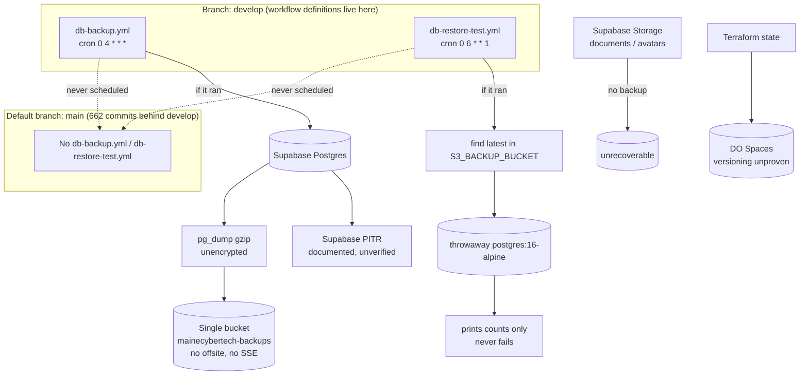

# Backup and Restore Drill Audit

## Audit Metadata

- Audit name: repo-deep-dive
- Run: 20261002-0344-develop-6286137
- Repository: C:/temp/mainecybertech
- Branch: develop
- Commit SHA: 62861370 (6286137017c4b7c77e83ee420ec11382d984f263)
- Generated at: 2026-10-02T03:44Z
- Auditor: principal-level repository auditor (fresh audit at HEAD; prior DR reports used only as a regression checklist, not as evidence)
- Area code: DR
- Output path: docs/audits/repo-deep-dive/20261002-0344-develop-6286137/32_backup_restore_drill.md
- Companion artifact: docs/audits/repo-deep-dive/20261002-0344-develop-6286137/backup_restore_drill_plan.md
- Scope limitations:
  - **AUDIT-ONLY.** No backup, restore, PITR, Terraform apply, or destructive command was run. No production or Supabase system was contacted. Only this report and its companion artifact were written.
  - Secret **values** were never read or printed; only secret/variable **names** and file paths are cited.
  - GitHub-hosted runner logs, live workflow run history, Supabase plan/PITR configuration, and DO Spaces bucket versioning/retention settings are **not reachable from the repository**. Statements about them are labelled `Unknown` with the artifact that must be checked.
  - No GitHub run artifact for either backup workflow was available in this environment, so "last real exercise" cannot be evidenced from the repo alone; every backup/restore path is therefore marked `not exercised`.
  - The prompt's documentation (`.github/workflows`, `scripts/`, `docs/`, `infra/`) was reviewed; runtime behaviour is inferred from committed content only.

## Scope

Reviewed at commit 62861370 (branch `develop`, default branch `main`):

- **Backup automation:** `.github/workflows/db-backup.yml`, `.github/workflows/db-restore-test.yml`, `scripts/backup-database.sh`, `scripts/backup-database.ps1`, `scripts/restore-database.sh`.
- **Supabase config / restore docs:** `supabase/config.toml`, `supabase/config.toml.example`, `supabase/config.toml.production.example`, `docs/ROLLBACK_PROCEDURES.md` (§3 Supabase rollback), `docs/technical-writing/migration-guide.md`, `docs/SUPABASE_MIGRATION_WORKFLOW.md`, `.github/workflows/supabase-migrations.yml`.
- **Infra / snapshots / storage:** `infra/terraform/digitalocean/{providers,droplet,dns,firewall,cloud-init}.tf`, `infra/terraform/digitalocean/env/backend.{dev,prod}.hcl`, `infra/digitalocean/{docker-compose.yml,prometheus.rules.yml}`, `.gitignore`.
- **Storage / uploaded files:** `apps/api/src/routes/documents.ts`, `apps/worker/src/tasks/orphan-cleanup.ts`, `apps/api/src/routes/{profiles,organizations}.ts` (buckets `documents`, `avatars`, `logos`).
- **Secrets backup:** `docs/SECRETS_ROTATION.md`, `docs/GITHUB_SECRETS_AND_VARIABLES_MATRIX.md`, `docs/ENVIRONMENT_VARIABLES.md`.
- **Retention / RPO/RTO / monitoring:** `docs/RTO_RPO.md`, `docs/runbooks/backup-disaster-recovery.md`, `docs/RELEASING.md`, `docs/CI.md`, `docs/MONITORING_AND_ALERTING.md`, `infra/digitalocean/prometheus.rules.yml`.
- **Platform backup/DR product module:** `supabase/migrations/5302075_backup_dr.sql`, `apps/worker/src/tasks/module-tasks.ts` (`backupDrCheck`), `apps/api/src/routes/final/{backups.ts,crud.ts}`, `docs/modules/backup-dr.md`, `docs/features/backup-disaster-recovery.md`, `docs/runbooks/backup-disaster-recovery.md`.
- **Seeds / exports:** `supabase/seeds/*`, `supabase/config.toml` `[db.seed]`.

Not reviewed in depth (owned by other prompts): RLS/tenancy correctness (06/37), full API contract surface (08), full observability stack (14), container hardening (36), supply chain (11/35), all migration contents (07), CI governance as a whole (10 — cross-referenced).

## Evidence Reviewed

| Evidence | Type | Why relevant | Notes |
|---|---|---|---|
| `.github/workflows/db-backup.yml` | CI config | Daily DB backup automation | 28 lines; cron `0 4 * * *`; runs `scripts/backup-database.sh`; Slack alert on failure |
| `.github/workflows/db-restore-test.yml` | CI config | Weekly restore verification | 64 lines; cron `0 6 * * 1`; restores to throwaway Postgres; prints counts only |
| `scripts/backup-database.sh` | Script | Backup implementation | 62 lines; pg_dump/gzip → `s3://${S3_BUCKET}/${S3_PREFIX}/`; STANDARD_IA; 30-day prune |
| `scripts/backup-database.ps1` | Script | Windows-equivalent backup | 130 lines; same logic; no encryption |
| `scripts/restore-database.sh` | Script | Manual restore path | 80 lines; `--dry-run`; restores to `SUPABASE_DB_URL` with no prod guardrail |
| `.github/workflows/supabase-migrations.yml` | CI config | Migration apply path | `supabase db push --include-all`; serialized; prod/dev environment |
| `supabase/migrations/5302075_backup_dr.sql` | Migration | `backup_status` schema | Tenant-scoped RPO/RTO/restore-test/offsite/encryption columns |
| `apps/worker/src/tasks/module-tasks.ts:277-332` | Source | `backupDrCheck` worker | Flags stale backups by 24h/48h against **demo** `backup_status` rows |
| `apps/api/src/routes/final/crud.ts:177` | Source | Product backup API | `backups → backup_status` generic CRUD, module `backup-dr` |
| `infra/terraform/digitalocean/providers.tf` | Infra config | TF state backend | Remote S3/Spaces backend, `encrypt = true`, `use_lockfile = true` |
| `infra/terraform/digitalocean/env/backend.{dev,prod}.hcl` | Infra config | Backend buckets | `portal-terraform-state-{development,production}` |
| `infra/terraform/digitalocean/droplet.tf` | Infra config | Droplet lifecycle | `prevent_destroy = true`; no snapshot resource |
| `.gitignore` | Config | State hygiene | `*.tfstate` / `*.tfstate.*` ignored (fixed since early audits) |
| `docs/ROLLBACK_PROCEDURES.md` | Doc | DB/infra rollback runbook | Supabase Options A/B/C; Terraform revert; verification |
| `docs/RTO_RPO.md` | Doc | Recovery targets | DB RTO 1 h / RPO 5 min; Redis RPO 24 h; backup strategy |
| `docs/runbooks/backup-disaster-recovery.md` | Doc | Product DR runbook | Monitors **client** `backup_status` rows, not the platform DB |
| `docs/SECRETS_ROTATION.md` | Doc | Secret lifecycle | Backup/restore secrets listed with rotation cadence |
| `docs/GITHUB_SECRETS_AND_VARIABLES_MATRIX.md` | Doc | Secret inventory | Backup secrets scoped `Prod only`; restore secret `S3_BACKUP_BUCKET` |
| `docs/RELEASING.md` | Doc | Release/backup claims | States scheduled runs "fire from the default branch" and "recent backup runs have failed" |
| `docs/CI.md` | Doc | CI behaviour claims | Describes both backup workflows as `Scheduled` |
| `apps/worker/src/tasks/orphan-cleanup.ts` | Source | Storage bucket handling | Buckets `documents`, `avatars`; deletes orphans; no backup |
| `docs/modules/backup-dr.md` / `docs/features/backup-disaster-recovery.md` | Doc | Product module contract | Describe routes (`/backup-dr/jobs`, `/dr-tests`, `/dashboard`, `/export`) that do not exist |

## Verification Performed

| Claim / item | Expected | Observed at 62861370 | Outcome |
|---|---|---|---|
| Default branch is `main` | Scheduled workflows run from default branch | `origin/HEAD -> origin/main`; local `main` exists | supported |
| `db-backup.yml` present on default branch | Scheduled backup actually runs | `git ls-tree main .github/workflows/` lists **no** `db-backup.yml` | **unsupported** — never scheduled |
| `db-restore-test.yml` present on default branch | Weekly restore actually runs | `git ls-tree main .github/workflows/` lists **no** `db-restore-test.yml` | **unsupported** — never scheduled |
| `main` currency | Default-branch definitions reflect develop | `git rev-list --count main..develop` = **662** | unsupported (main far behind) |
| `db-backup.yml` daily cadence | `0 4 * * *` | Present at `develop` | supported (config only) |
| `db-restore-test.yml` weekly cadence | `0 6 * * 1` | Present at `develop` | supported (config only) |
| Backup script default destination | `mainecybertech-backups` / `database-backups` | `backup-database.sh:8-9` | supported |
| Restore-test reads that destination | Same bucket/prefix | Uses `secrets.S3_BACKUP_BUCKET` as a full `s3://…/…` URI (`db-restore-test.yml:20,29`); no documented equality with the script default | **unverifiable/mismatch risk** |
| Restore integrity assertion | Fails on empty/corrupt dump | "Verify database integrity" only `SELECT count(*)` + echo; `_migrations` check ends `|| true` (`db-restore-test.yml:51-57`) | **unsupported** — never fails |
| Restore-test failure alert | Notify on failed restore | No `if: failure()`, no Slack/Sentry step in `db-restore-test.yml` | unsupported — silent |
| Backup failure alert | Notify on failed backup | `db-backup.yml:23-28` Slack on `failure()` with `|| true` | supported (but swallows delivery failure) |
| Backup encryption | Encrypt before upload | No `gpg`/`openssl`/SSE/KMS in either backup script; only `--storage-class STANDARD_IA` | unsupported |
| Offsite copy | Second region/provider | Single destination bucket; no replication; `docs/ARCHITECTURAL_AUDIT_COMPLETE.md:612` confirms | unsupported |
| Terraform state remote backend | Remote, locked, encrypted | `providers.tf:4-17` S3/Spaces + `use_lockfile` + `encrypt` | supported (fixed since prior audits) |
| TF state committed to git | Should be ignored | `check-ignore` confirms `.gitignore:49-50`; no `*.tfstate*` on disk | supported (fixed) |
| TF state bucket versioning | Versioning enabled (per `RTO_RPO.md`) | No `digitalocean_spaces_bucket` resource anywhere in `infra/terraform` | **unsupported** — claim unbacked |
| Storage/uploaded-file backup | Buckets backed up | `orphan-cleanup.ts` lists/removes `documents`/`avatars`; no backup task/workflow | unsupported — absent |
| Supabase PITR | Configured and exercised | `ROLLBACK_PROCEDURES.md:81-89` documents Option B; no artifact of a real PITR; plan tier `Unknown` | configured, `not exercised` |
| Restore exercised (any) | Recent run artifact | No GitHub run artifact available; workflows absent on default branch | `not exercised` |
| `backup_status` fed by platform backup | Real platform backup rows | Only demo seeds insert rows (`5302120`, `5302123`); no writer from `db-backup.yml` | unsupported — product/demo, not platform DR |
| Product DR routes exist | `docs/modules/backup-dr.md` paths | `crud.ts` mounts `/final/backups*`; `/backup-dr/*` routes absent (also flagged in `docs/audits/ui-ux-docs-completeness/2026-09-27/report.md:245-246`) | unsupported — doc drift |
| RPO/RTO documented | Targets exist | `docs/RTO_RPO.md` | supported |
| RPO/RTO *validated* by a drill | Evidence of achieved recovery | None | unsupported |
| Redis backup | Mechanism exists | `RTO_RPO.md:11` says "recreated from DB on loss"; no RDB/AOF backup task | partially supported (by design, unexercised) |

## Executive Summary

The platform has the *shape* of a backup program — a daily pg_dump workflow, a weekly restore-test workflow, a documented PITR path, a remote Terraform state backend, and RTO/RPO targets — but almost none of it is connected to reality at this commit. Three structural facts dominate:

1. **The scheduled backup workflows never run.** `db-backup.yml` and `db-restore-test.yml` exist **only on `develop`**. GitHub schedules `schedule:` workflows from the **default branch** (`main`), and `main` does not contain these files. `main` is **662 commits behind** `develop`. Therefore the daily backup and weekly restore test are dormant; the repo's own `docs/RELEASING.md:103-105` even hints at this ("scheduled `db-backup`/`db-restore-test`/`sbom` runs only fire from the default branch and recent backup runs have failed"). There is no evidence any scheduled backup has ever run from this repository.
2. **Restore is never verified.** Even when it runs, `db-restore-test.yml` restores into a throwaway Postgres and merely *prints* table counts; the `_migrations` check is suffixed `|| true`. A truncated, empty, or policy-stripped dump would report "completed successfully". "Configured" is not "exercised": the last real restore is `not exercised` with no artifact, and the only recovery-evidence path is incapable of failing.
3. **There is no backup for most of the data that matters besides the database.** Postgres content is the only thing with any backup path. User-uploaded documents, avatars, and logos in Supabase Storage buckets have **no** backup; Redis has none (accepted, rebuilt from DB); secrets have no escrow; and Terraform state, while now in a remote backend, has no proven versioning.

**Strengths:** remote TF state backend with locking (a genuine fix since the early audits); the manual `restore-database.sh` exists and supports `--dry-run`; RTO/RPO targets are documented; secret rotation is documented; Supabase PITR is documented as the short-RPO path; and `db-backup.yml` does alert Slack on failure.

**Top risks:** unrun backups (DR-P0-001); pseudo-verification that cannot fail (DR-P0-002); no storage/uploaded-file backup (DR-P1-001); restore secret/bucket contract mismatch that can make the restore test read the wrong location (DR-P1-002); no encryption or offsite copy for the database dumps (DR-P1-003); and no restore-failure alerting (DR-P1-004).

**Recommended next actions:** (1) make the backup/restore workflows reachable from the default branch (or add an equivalent scheduled trigger) and capture a green run; (2) make the restore test assert integrity (counts, `_migrations`, tenant isolation) and fail on a corrupt dump; (3) run and record a real restore drill using the companion `backup_restore_drill_plan.md`; (4) add a storage-bucket backup/versioning mechanism; (5) add encryption (SSE/KMS) and a second-region copy; (6) alert on restore-test failure.

## Inventory

| Item | Path / symbol | Purpose | Current state | Risk | Notes |
|---|---|---|---|---|---|
| Daily backup workflow | `.github/workflows/db-backup.yml` | Daily pg_dump → S3/Spaces | Present on `develop`; **absent on `main`** | **Critical** | Scheduled job never fires |
| Weekly restore test | `.github/workflows/db-restore-test.yml` | Restore newest dump to temp PG | Present on `develop`; **absent on `main`**; non-asserting | **Critical** | Prints counts only; `\|\| true` |
| Backup script (bash) | `scripts/backup-database.sh` | pg_dump/gzip/upload/prune | Implemented | High (unrun) | No encryption; single destination |
| Backup script (PowerShell) | `scripts/backup-database.ps1` | Windows equivalent | Implemented, **duplicate logic** | Medium | Drift risk vs bash |
| Manual restore script | `scripts/restore-database.sh` | Restore latest/specified dump | Implemented | High | No guardrail against prod URL; relies on operator care |
| Manual rollback script | `scripts/rollback.sh` | Redeploy previous image SHA | Implemented | Low | App-level; not DB data recovery |
| Migration apply | `.github/workflows/supabase-migrations.yml` | `supabase db push --include-all` | Implemented, pinned CLI, serialized | Medium | No `down` migration mechanism |
| RELEASE rollback | `docs/RELEASING.md` §Rollback | Redeploy prior SHA | Implemented | Low | App-only |
| Supabase rollback doc | `docs/ROLLBACK_PROCEDURES.md` §3 | Reverse migration / PITR / manual SQL | Documented | High (unexercised) | PITR plan tier `Unknown` |
| Product backup module | `supabase/migrations/5302075_backup_dr.sql`, `apps/api/src/routes/final/crud.ts:177` | Tenant backup/DR review UI | Implemented as CRUD | Medium | Tracked data is **client** backup jobs, not platform DR |
| Product DR worker | `apps/worker/src/tasks/module-tasks.ts:277` (`backupDrCheck`) | Flag stale `backup_status` rows | Implemented + scheduled | Medium | Operates on demo-seeded rows |
| Product DR doc | `docs/modules/backup-dr.md` | Module contract | **Stale/aspirational** | Medium | Routes/endpoints do not match code |
| TF state backend | `infra/terraform/digitalocean/providers.tf:4-17` | Remote state, lock, encrypt | Implemented | Low | Improved since prior audits |
| TF state buckets | `infra/terraform/digitalocean/env/backend.{dev,prod}.hcl` | `portal-terraform-state-*` | Configured | Medium | Versioning resource absent |
| TF state on disk / git | `.gitignore:49-50` | Keep state out of git | Ignored; not on disk | Low | Fixed |
| Droplet snapshot | `infra/terraform/digitalocean/droplet.tf` | Infra recreate | `prevent_destroy=true`; no snapshot resource | Medium | Recovery = recreate via Terraform |
| Storage buckets | `documents`, `avatars`, `logos` (routes + `orphan-cleanup.ts`) | User uploads / media | **No backup** | **High** | Only orphan deletion implemented |
| Redis volume | `infra/digitalocean/docker-compose.yml` | Queue/cache | No backup; rebuild from DB | Medium | Accepted per `RTO_RPO.md` |
| Secrets | `docs/SECRETS_ROTATION.md` | Secret lifecycle | Rotation documented, no escrow/backup | Medium | Restore = re-issue, not recover |
| RTO/RPO targets | `docs/RTO_RPO.md` | Recovery objectives | Documented | Medium | Never validated by drill |
| Alerting (backup) | `db-backup.yml:23-28` | Slack on backup failure | Present (`\|\| true`) | Medium | Can silently fail delivery; workflow may not run anyway |
| Alerting (restore) | `db-restore-test.yml` | Alert on restore failure | **Absent** | High | Silent |
| Metrics/alerts | `infra/digitalocean/prometheus.rules.yml` | Availability alerts | In-stack only; no Alertmanager | Medium | No backup/restore metric |
| Seeds | `supabase/seeds/*`, `supabase/config.toml` `[db.seed]` | Local/dev data | Present, dev-only | Low | Not a backup mechanism |

## Domain Scorecard

| Category | Score | Evidence | Gap | Recommended action |
|---|---:|---|---|---|
| Database backups | 2 | `db-backup.yml` + `scripts/backup-database.sh` (daily, 30-day retention); absent on `main` | Never scheduled/run; no encryption; single destination | Reach default branch or add runnable schedule; capture a green run |
| Supabase restore docs | 2 | `docs/ROLLBACK_PROCEDURES.md` §3 (A/B/C); `docs/technical-writing/migration-guide.md` | Documented but never exercised; PITR tier `Unknown` | Date the last PITR/restore; record artifact; confirm plan tier |
| Storage backups | 0 | No backup for `documents`/`avatars`/`logos` | Entirely absent | Add versioning or export job + drill |
| Uploaded docs/files | 0 | `apps/api/src/routes/documents.ts` stores to bucket; no copy | Entirely absent | Include in storage backup scope |
| Secrets backup | 2 | `docs/SECRETS_ROTATION.md`; no escrow | Recovery = rotation only; no break-glass copy | Document re-issue runbook; consider sealed escrow |
| Infra config | 3 | Remote TF backend + lock + `encrypt`; `prevent_destroy`; state ignored | No bucket-versioning resource; recreate unexercised | Add/verify Spaces versioning; record TF recovery drill |
| Migration rollback | 2 | `docs/ROLLBACK_PROCEDURES.md` Option A; `SUPABASE_MIGRATION_WORKFLOW.md` | No automated `down`; reverse migration manual; bad-migration drill absent | Script + test a reverse migration; run D4 drill |
| Export tools | 1 | Product doc claims `/backup-dr/export`; not implemented | Documented-but-absent export | Implement or remove the claim |
| Seeds | 3 | `supabase/seeds/*` wired via `config.toml` | Dev-only; not DR-relevant | Keep dev-only; document non-use for recovery |
| Restore scripts | 2 | `scripts/restore-database.sh` (+`--dry-run`) | No prod guardrail; unexercised; no assertions | Add target guardrail; wire assertions |
| DR runbooks | 2 | `docs/ROLLBACK_PROCEDURES.md`, `docs/runbooks/backup-disaster-recovery.md`, `docs/RTO_RPO.md`, plan artifact | Runbooks describe product module + platform; no drill schedule/evidence | Add drill cadence + evidence pointers; fix module doc drift |
| RPO/RTO | 2 | `docs/RTO_RPO.md` (DB 1 h / 5 min) | Not validated; conflicts with "daily dump" reality | Validate against a real restore; reconcile 5-min RPO (PITR-only) |

Overall domain score: **1.8 / 5** — foundations (scripts, docs, targets, remote state) exist, but the automated paths do not run and restore is never verified. This is a *configured, not exercised* domain.

## Detailed Review

### Item: Daily database backup workflow

- Evidence: `.github/workflows/db-backup.yml`; `scripts/backup-database.sh`; `scripts/backup-database.ps1`; `docs/CI.md:23`; `docs/RELEASING.md:88`.
- What it does: cron `0 4 * * *` and `workflow_dispatch`; runs `bash scripts/backup-database.sh` with `SUPABASE_DB_URL`, AWS keys; posts a Slack message on `failure()`.
- How it appears to work: On the `develop` branch it would dump the DB, gzip, upload to `s3://mainecybertech-backups/database-backups/…` (`STANDARD_IA`), delete the local file, and prune objects older than `RETENTION_DAYS` (default 30). **But the file does not exist on `main`**, so the schedule never fires.
- Dependencies: `SUPABASE_DB_URL`, `AWS_ACCESS_KEY_ID`/`AWS_SECRET_ACCESS_KEY` (matrix marks these **Prod only**), `aws` CLI, `jq` (used in the prune step), `pg_dump`.
- Current controls: gzip compression; 30-day retention prune; Slack failure alert; `set -euo pipefail`.
- Missing controls: reachable schedule; encryption; offsite/2nd region; checksum/size validation of the uploaded object; destination-contract documentation.
- Risks: **Backups may not exist at all**; if they do, they are unencrypted and single-region.
- Recommended improvement: ensure the workflow runs from the default branch (move/merge to `main`, or add a scheduled dispatch that targets `develop`); add `gpg`/SSE-KMS encryption; add a second destination; write the object's size/checksum to the run summary.
- Suggested tests: a scheduled run artifact exists; a `workflow_dispatch` run uploads an object; injecting a bad `SUPABASE_DB_URL` fails the job and fires the alert.
- Suggested docs: `docs/CI.md`, `docs/RELEASING.md` (correct the "fires from default branch" implication), `docs/RTO_RPO.md`.

### Item: Weekly restore test workflow

- Evidence: `.github/workflows/db-restore-test.yml`; `docs/CI.md:24`.
- What it does: cron `0 6 * * 1`; lists the newest object in `S3_BACKUP_BUCKET`, downloads it, starts `postgres:16-alpine`, `gunzip | psql`, prints table counts, cleans up.
- How it appears to work: restore is piped with `set -euo pipefail`, so a broken gzip/psql fails the step; the "Verify database integrity" step then runs two `SELECT count(*)` queries and an unconditional success echo. The `_migrations` query is `|| true`.
- Dependencies: `S3_BACKUP_BUCKET`, AWS keys, Docker, network.
- Current controls: `timeout-minutes: 30`; throwaway DB; `pipefail`; cleanup `if: always()`.
- Missing controls: **no assertion** (table count threshold, `_migrations` existence, row counts, tenant isolation); no failure alert; unpinned `postgres:16-alpine`; absent on default branch.
- Risks: false "restore verified" signal; a corrupt/empty dump passes.
- Recommended improvement: assert a baseline table count derived from `supabase/migrations/`, remove `|| true` from `_migrations`, assert ≥2 critical tables have rows, add a tenant-isolation spot check, pin the image digest, and add a `failure()` alert.
- Suggested tests: upload a truncated dump to a scratch bucket → the workflow must fail; restore a good dump → assertions pass.
- Suggested docs: `docs/CI.md` (describe assertions, not "verifies table counts").

### Item: Manual restore script and rollback

- Evidence: `scripts/restore-database.sh`; `scripts/rollback.sh`; `docs/ROLLBACK_PROCEDURES.md`.
- What it does: `restore-database.sh` downloads the latest (or `--backup-file`) dump and pipes it into `psql "$SUPABASE_DB_URL"`; `--dry-run` lists size without restoring. `rollback.sh` redeploys a prior image SHA.
- How it appears to work: The script prints a redacted target URL and a warning that it overwrites the target. It performs no post-restore verification and has no environment guardrail.
- Dependencies: AWS CLI, `psql`, `SUPABASE_DB_URL`.
- Current controls: presence checks; redacted URL echo; dry-run.
- Missing controls: prod-vs-staging guardrail; confirmation prompt; post-restore assertions; encryption of transient `/tmp/restore.sql.gz`.
- Risks: an operator can overwrite production; a "successful" run may still be an incomplete restore.
- Recommended improvement: refuse non-loopback/non-staging targets unless `ALLOW_PROD_RESTORE=yes`; add a checksum/size check before restore; run the verification checklist after.
- Suggested tests: run against a throwaway DB and assert the guardrail blocks a prod-looking URL.
- Suggested docs: `docs/ROLLBACK_PROCEDURES.md` — add a "restore verification" section referencing the drill plan.

### Item: Supabase restore / PITR documentation

- Evidence: `docs/ROLLBACK_PROCEDURES.md:64-100`; `docs/technical-writing/migration-guide.md:174-185`; `docs/RTO_RPO.md:10,17,22`.
- What it does: documents three Supabase rollback options — reverse migration, PITR (Pro plan, 7-day), manual SQL — and names PITR as the short-RPO path.
- How it appears to work: PITR creates a new instance; the operator updates `SUPABASE_URL` and restarts containers. No CLI/automation; wholly manual and dashboard-driven.
- Dependencies: Supabase plan tier (`Unknown`), dashboard access, `SUPABASE_PROJECT_REF`.
- Current controls: documented steps; 7-day retention stated.
- Missing controls: no evidence PITR is enabled or funded; no captured PITR drill; the RTO/RPO "RPO 5 minutes" for Postgres is only achievable via PITR, not the daily dump — the two are conflated.
- Risks: the documented short-RPO path may not exist on the current plan; recovery relies on an unexercised dashboard procedure.
- Recommended improvement: confirm the plan tier; record the last PITR drill with an artifact; split RPO by method (daily dump → 24 h; PITR → 5 min) in `docs/RTO_RPO.md`.
- Suggested tests: perform D2 in the drill plan against a throwaway fork and record it.
- Suggested docs: `docs/RTO_RPO.md`, `docs/ROLLBACK_PROCEDURES.md`.

### Item: Migration rollback

- Evidence: `.github/workflows/supabase-migrations.yml`; `docs/SUPABASE_MIGRATION_WORKFLOW.md`; `docs/ROLLBACK_PROCEDURES.md` §3 Option A.
- What it does: applies migrations forward with `supabase db push --include-all`; rollback is a hand-written reverse migration, re-applied via `db push`.
- How it appears to work: there is no `down`/`rollback` command; Supabase tracks applied migrations, so a reverse migration is the sanctioned undo. The bad-migration drill required by this prompt is absent.
- Dependencies: Supabase CLI 2.107.0, `SUPABASE_ACCESS_TOKEN`, project ref.
- Current controls: serialized per-branch (`concurrency`), prod/dev environment, pinned CLI, `db diff` dry-run (informational).
- Missing controls: automated reverse-migration tooling; a rehearsed bad-migration rollback; the `db diff` step is `|| true` (informational only).
- Risks: a destructive migration has no tested undo; recovery time is unknown.
- Recommended improvement: add a D4 bad-migration drill (see plan) and document the measured recovery time; consider generated reverse-DDL where feasible.
- Suggested tests: D4 drill; assert schema matches pre-migration after the undo.
- Suggested docs: `docs/SUPABASE_MIGRATION_WORKFLOW.md` — add a rollback/drill section.

### Item: Storage and uploaded-file backup

- Evidence: `apps/api/src/routes/documents.ts:367,392,435,543`; `apps/worker/src/tasks/orphan-cleanup.ts:10`; `apps/api/src/routes/{profiles,organizations}.ts`; `supabase/config.toml.production.example:64-66`.
- What it does: user documents upload to the `documents` bucket; avatars/logos to `avatars`/`logos`. `orphan-cleanup` *deletes* unreferenced objects. Nothing copies them elsewhere.
- How it appears to work: storage is entirely dependent on Supabase Storage durability; a restore of the DB alone would leave `documents.storage_path` rows pointing at missing objects, and a bucket-level loss is unrecoverable.
- Dependencies: Supabase Storage.
- Current controls: orphan cleanup (housekeeping, not backup); RLS/private buckets per prod config guidance.
- Missing controls: **any** backup, versioning, or export; no restore path for files.
- Risks: permanent loss of client-uploaded documents — often the most business-critical and least reproducible data.
- Recommended improvement: enable provider-native object versioning/retention, or add a scheduled export of the buckets to S3/Spaces; then run the D5 drill.
- Suggested tests: delete a scratch object and recover it; verify checksum after recovery.
- Suggested docs: `docs/RTO_RPO.md` — add a storage row; `docs/features/backup-disaster-recovery.md`.

### Item: Infrastructure config and Terraform state

- Evidence: `infra/terraform/digitalocean/providers.tf:4-17`; `env/backend.{dev,prod}.hcl`; `droplet.tf:17-20`; `firewall.tf`, `dns.tf`; `.gitignore:49-50`; `docs/ROLLBACK_PROCEDURES.md` §4.
- What it does: state lives in DO Spaces (S3-compatible) with `use_lockfile` and `encrypt`; the droplet uses `prevent_destroy`; rollback is `git revert` + workflow or `-target` apply.
- How it appears to work: a clean checkout can `terraform plan` against remote state. State files are no longer committed and no longer on disk.
- Dependencies: `DO_SPACES_*` keys, remote backend buckets, `DO_API_TOKEN`.
- Current controls: remote backend, state locking, encryption flag, `prevent_destroy`, PR-less terraform workflow (manual dispatch — see prompt 10).
- Missing controls: no `digitalocean_spaces_bucket` resource proving versioning (the `RTO_RPO.md` claim is unbacked); no state-restore drill; `prevent_destroy` makes droplet replacement a manual `-destroy` dance.
- Risks: if the state bucket/versioning is not what the docs claim, state loss would hamper infra management.
- Recommended improvement: add/verify Spaces versioning; run D6 state-recovery drill; document the measured recovery.
- Suggested tests: D6; confirm `terraform plan` is a no-op after state restore.
- Suggested docs: `docs/RTO_RPO.md` (correct the versioning claim or add the resource), `docs/ROLLBACK_PROCEDURES.md`.

### Item: Secrets backup

- Evidence: `docs/SECRETS_ROTATION.md`; `docs/GITHUB_SECRETS_AND_VARIABLES_MATRIX.md:63-71`; `docs/ENVIRONMENT_VARIABLES.md:133-140`.
- What it does: catalogs secrets (`SUPABASE_DB_URL`, AWS keys, `S3_BACKUP_BUCKET`, `SLACK_WEBHOOK_URL`, DO/CF/Supabase tokens) with rotation cadence and source-of-truth locations.
- How it appears to work: recovery model is **re-issue/rotate**, not backup. There is no escrow/break-glass vault.
- Dependencies: GitHub secrets, provider dashboards.
- Current controls: documented rotation; secrets flow through `env:` in workflows.
- Missing controls: no escrow for the small number of secrets that cannot be trivially re-issued; no documented "who can restore secrets during an incident".
- Risks: a lost secret that also blocks its own rotation (e.g. a sole admin token) becomes an unrecoverable outage.
- Recommended improvement: document a break-glass re-issue runbook and, for the critical set, a sealed escrow path.
- Suggested tests: table-top "all GitHub secrets lost" and record re-issue steps.
- Suggested docs: `docs/SECRETS_ROTATION.md` — add a recovery/escrow section.

### Item: Product backup/DR module (`backup_status`) vs platform DR

- Evidence: `supabase/migrations/5302075_backup_dr.sql`; `apps/worker/src/tasks/module-tasks.ts:277-332`; `apps/api/src/routes/final/crud.ts:177`; `docs/modules/backup-dr.md`; `docs/runbooks/backup-disaster-recovery.md`.
- What it does: a tenant-scoped table + worker that flags stale client backup jobs by 24h/48h thresholds and a portal/admin CRUD surface.
- How it appears to work: `backupDrCheck` reads `backup_status.last_backup_at` and sets `warning`/`critical`. Rows are only inserted by **demo seed migrations** (`5302120`, `5302123`); no platform backup writes to it.
- Dependencies: Supabase service role.
- Current controls: RLS; worker scheduled (`schedule-config.ts:39`); unit coverage.
- Missing controls: it does not monitor the **platform's own** database backups; `backup_status` is unused by the platform DR path; `docs/modules/backup-dr.md` documents routes (`/backup-dr/jobs`, `/dr-tests`, `/dashboard`, `/export`) that do not exist.
- Risks: the runbook reads as if it monitors the platform, when it monitors seeded client data — misleading during a real incident; module doc drift confuses operators.
- Recommended improvement: either wire platform backup health into a real record/alert, or clearly label the module as client-facing; correct `docs/modules/backup-dr.md` to the actual routes.
- Suggested tests: assert the module doc's routes resolve (or fail the audit); assert a real platform backup heartbeat surfaces somewhere.
- Suggested docs: `docs/modules/backup-dr.md`, `docs/features/backup-disaster-recovery.md`.

### Item: Retention, RPO/RTO, monitoring

- Evidence: `docs/RTO_RPO.md`; `scripts/backup-database.sh:7,50-59`; `docs/runbooks/backup-disaster-recovery.md:123-129`; `infra/digitalocean/prometheus.rules.yml`.
- What it does: 30-day dump retention; documented RTO/RPO table; a client-facing metric/alert list; in-stack Prometheus rules.
- How it appears to work: retention prune runs inside the backup script; targets are documentation only; Prometheus rules contain no backup/restore metric.
- Dependencies: backup workflow (must run), Slack, Prometheus (in-stack).
- Current controls: retention default 30 days; documented targets.
- Missing controls: retention only prunes `database-backups/`; no restore-test recency tracking; no coupling of RPO to the *actual* backup cadence; no alert for "no successful backup in N hours".
- Risks: undocumented recoverability windows; RPO target (5 min) unachievable from dumps; retention could silently delete the only copy if backups stop and then resume.
- Recommended improvement: add a "last successful backup age" alert; record last restore-test date in `docs/RTO_RPO.md`; document the retention window and its interaction with `main`-branch dormancy.
- Suggested tests: synthetic "no backup in 48h" alert fires.
- Suggested docs: `docs/RTO_RPO.md`, `docs/MONITORING_AND_ALERTING.md`.

## Scenario / Control Matrix

| ID | Scenario or control | Evidence | Current control | Gap | Severity | Recommendation |
|---|---|---|---|---|---|---|
| DR-001 | Database backups | `db-backup.yml`, `scripts/backup-database.sh` | pg_dump → Spaces; 30-day retention | Workflow absent on default branch → not scheduled/run | P0 | Make reachable from `main`; capture a run artifact |
| DR-002 | Supabase restore docs | `docs/ROLLBACK_PROCEDURES.md` §3 | 3 documented options incl. PITR | Never exercised; plan tier unverified | P1 | Confirm tier; record a PITR drill |
| DR-003 | Storage backups | `orphan-cleanup.ts`; upload routes | None | Entirely absent | P1 | Versioning or export job |
| DR-004 | Uploaded docs/files | `apps/api/src/routes/documents.ts` | None | No file restore path | P1 | Include in storage backup |
| DR-005 | Secrets backup | `docs/SECRETS_ROTATION.md` | Rotation documented | No escrow/break-glass | P2 | Add re-issue runbook + optional escrow |
| DR-006 | Infra config | `providers.tf`, `backend.*.hcl` | Remote TF state, lock, encrypt | No proven versioning; no drill | P2 | Verify versioning; run state drill |
| DR-007 | Migration rollback | `ROLLBACK_PROCEDURES.md` Option A | Manual reverse migration | No automated `down`; no bad-migration drill | P1 | Add + test reverse migration; D4 drill |
| DR-008 | Export tools | `docs/modules/backup-dr.md` | None implemented | Doc claims non-existent export | P3 | Implement or remove claim |
| DR-009 | Seeds | `supabase/seeds/*`, `config.toml` | Dev seed data | Not DR-relevant | P3 | Document non-use for recovery |
| DR-010 | Restore scripts | `scripts/restore-database.sh` | Manual restore + dry-run | No prod guardrail; no assertions | P1 | Guardrail + verification checklist |
| DR-011 | DR runbooks | `ROLLBACK_PROCEDURES.md`, runbooks, `RTO_RPO.md` | Documented procedures | No drill schedule/evidence; product-module drift | P2 | Add cadence + evidence; fix drift |
| DR-012 | RPO/RTO | `docs/RTO_RPO.md` | Targets documented | Unvalidated; 5-min RPO conflates PITR | P1 | Split by method; validate by drill |
| DR-013 | Backup encryption | `scripts/backup-database.*` | `STANDARD_IA` only | No encryption of dumps | P1 | SSE-KMS or gpg |
| DR-014 | Offsite copy | `scripts/backup-database.sh` | Single bucket | No second region/provider | P1 | Cross-region replication |
| DR-015 | Restore verification | `db-restore-test.yml:51-57` | Prints counts; `\|\| true` | Cannot fail | P0 | Assert counts/`_migrations`/tenant isolation |
| DR-016 | Restore/bucket contract | `db-restore-test.yml:20,29` vs `backup-database.sh:8-9` | Secret `S3_BACKUP_BUCKET` | Full-URI vs bucket+prefix mismatch | P1 | Document/align the contract |
| DR-017 | Restore failure alert | `db-restore-test.yml` | None | Silent restore failure | P1 | Add `failure()` alert |
| DR-018 | Backup failure alert delivery | `db-backup.yml:23-28` | Slack, but `\|\| true` | Alert can silently fail | P2 | Fail loudly / add fallback |
| DR-019 | Platform backup heartbeat | `backup_status`/`backupDrCheck` | Client-facing only | No monitoring of platform backups | P2 | Add a real heartbeat/alert |
| DR-020 | Terraform state versioning | `RTO_RPO.md:23` claim | None proven | Claim unbacked by resource | P2 | Add/verify Spaces versioning |

## Findings

### Finding ID: DR-P0-001 - Scheduled backup and restore-test workflows never run because they are absent from the default branch

- Severity: P0
- Confidence: High
- Area: Backup automation / CI scheduling
- Evidence:
  - `.github/workflows/db-backup.yml` and `.github/workflows/db-restore-test.yml` exist on branch `develop`.
  - `git ls-tree develop --name-only .github/workflows/` lists `db-backup.yml` and `db-restore-test.yml`.
  - `git ls-tree main --name-only .github/workflows/` lists **neither** file (default branch = `origin/main`).
  - `git rev-list --count main..develop` = **662** (default branch far behind).
  - `docs/CI.md:5` states "Cron workflows only run from the default branch."
  - `docs/RELEASING.md:103-105` states scheduled `db-backup`/`db-restore-test`/`sbom` runs "only fire from the default branch and recent backup runs have failed".
- What is happening: GitHub Actions `schedule:` triggers are evaluated from the repository's default branch only. The two backup workflows are defined solely on `develop`, and the default branch (`main`) does not contain them, so the daily backup and weekly restore test are never scheduled. There is no other scheduler (no Supabase scheduled job in-repo, no droplet cron referenced) that performs the pg_dump.
- Why it matters: The platform's only automated database backup path is dormant. Combined with DR-P0-002 (restore test cannot fail), the team has no automated, verified recovery capability even though the repo *looks* like it does — a textbook "configured is not exercised" gap.
- User / business impact: If a corruption/deletion incident occurred, recovery would depend on Supabase's own PITR (unverified tier) or on a manual backup nobody has run. Potential loss of tenant data across all organizations.
- Security / privacy / reliability impact: Availability and data-integrity control is non-functional; RPO is effectively unbounded for the platform's own data.
- Recommended fix: Make the backup/restore workflows reachable from the default branch. Options: (a) merge the workflow definitions (or the whole CI set) to `main`; (b) add a scheduled dispatcher on `main` that triggers the `develop` workflow via `workflow_dispatch`/`workflow_call`; or (c) run the backup from an external scheduler. Then capture a green scheduled run as evidence.
- Suggested validation: After the change, confirm `db-backup` appears under the repository's Scheduled workflows and a scheduled run completes, producing an S3/Spaces object; confirm `db-restore-test` runs on the next Monday and its artifact is attached.
- Owner suggestion: platform/operations
- Effort estimate: S–M
- Dependencies: `SUPABASE_DB_URL` and AWS secrets actually set for the target environment (matrix marks them Prod-only); default-branch policy decision.
- Status: open
- Endpoint / data path: GitHub schedule (default branch) → `.github/workflows/db-backup.yml` → `scripts/backup-database.sh` → `s3://mainecybertech-backups/database-backups/…`
- Attack path: none identified (availability/governance, not remote exploitation)

### Finding ID: DR-P0-002 - The restore test never asserts integrity and therefore cannot fail on a bad backup

- Severity: P0
- Confidence: High
- Area: Restore verification
- Evidence:
  - `.github/workflows/db-restore-test.yml:51-57` — "Verify database integrity" runs `SELECT count(*) FROM information_schema.tables …` and `SELECT count(*) … table_name = '_migrations'`, then unconditionally echoes "Restore test completed successfully".
  - `.github/workflows/db-restore-test.yml:56` — the `_migrations` query ends with `|| true`, so it can never fail the step.
  - `.github/workflows/db-restore-test.yml:44-49` — the restore step only fails if the `gunzip | psql` pipe itself errors.
  - Cross-referenced: `docs/audits/repo-deep-dive/20261002-0344-develop-6286137/10_github_actions_cicd_governance.md` (CI-P2-002) flags the same gap.
- What is happening: The sole recovery-exercise path performs no assertion. An empty, truncated, or policy-stripped dump that `psql` accepts restores "successfully"; the workflow prints numbers and exits zero.
- Why it matters: The weekly signal is the *only* automated evidence that backups are recoverable. As written it produces false confidence until a real incident. Per the prompt's rule, "backups are insufficient unless restore is tested" — and this test does not test.
- User / business impact: False assurance of disaster recovery; potential extended outage and greater data loss during a real restore.
- Security / privacy / reliability impact: Reliability/DR control is non-functional; a restore that drops RLS policies would go unnoticed, risking tenant data exposure after recovery.
- Recommended fix: Assert a baseline public-table count derived from `supabase/migrations/`; remove `|| true` from the `_migrations` check and assert its row count; assert ≥2 critical tables have rows; add a tenant-isolation check (e.g. re-run RLS-verification semantics); pin the Postgres image; fail the step on any mismatch.
- Suggested validation: Upload a deliberately truncated dump to a scratch bucket and confirm the workflow fails; restore a good dump and confirm all assertions pass.
- Owner suggestion: platform/backend
- Effort estimate: S
- Dependencies: A committed expected table/migration baseline.
- Status: open
- Endpoint / data path: `S3_BACKUP_BUCKET` latest object → `gunzip | psql` into `postgres:16-alpine` → (currently) printed counts only
- Attack path: none identified

### Finding ID: DR-P1-001 - No backup or restore path exists for uploaded files in Supabase Storage

- Severity: P1
- Confidence: High
- Area: Storage / uploaded documents
- Evidence:
  - `apps/api/src/routes/documents.ts:367,392,435,543` — documents are stored/removed in the `documents` bucket.
  - `apps/worker/src/tasks/orphan-cleanup.ts:10` — buckets `["documents", "avatars"]` are listed and **orphans are deleted**; no copy/export.
  - `apps/api/src/routes/profiles.ts:229`, `apps/api/src/routes/organizations.ts:576` — `avatars`/`logos` buckets.
  - No storage backup task in `apps/worker/src/tasks/index.ts` or `apps/worker/src/schedule-config.ts`; no storage step in any workflow.
  - `docs/RTO_RPO.md` "Backup Strategy" lists DB, TF state, and Docker images only — storage is omitted.
- What is happening: The only object-storage automation is destructive (orphan cleanup). There is no versioning resource, export job, or replication, so a bucket-level loss or accidental mass delete is unrecoverable. A DB-only restore would leave `documents.storage_path` rows pointing at missing objects.
- Why it matters: Client-uploaded documents are frequently the least reproducible and most business-critical tenant data. Losing them can breach client expectations and contractual/retention obligations.
- User / business impact: Permanent loss of client files; broken document links after any DB-only recovery.
- Security / privacy / reliability impact: Data-durability and integrity gap; retention/compliance exposure.
- Recommended fix: Enable provider-native object versioning/retention on the buckets, or add a scheduled export of `documents`/`avatars` (and `logos`) to S3/Spaces; then rehearse recovery (see drill plan D5).
- Suggested validation: Delete a known object in a scratch bucket and recover it via the chosen mechanism; verify a checksum; confirm a DB-only restore plus file recovery yields working links.
- Owner suggestion: platform/backend
- Effort estimate: M
- Dependencies: Supabase plan capabilities or S3/Spaces credentials; a scratch bucket for drills.
- Status: open
- Endpoint / data path: `POST /api/v1/documents` → Supabase Storage `documents` bucket (currently no downstream backup)
- Attack path: none identified

### Finding ID: DR-P1-002 - Restore-test backup location contract (`S3_BACKUP_BUCKET`) is undocumented and can silently mismatch the backup script

- Severity: P1
- Confidence: Medium
- Area: Backup/restore configuration
- Evidence:
  - `scripts/backup-database.sh:8-9` — writes to `s3://${S3_BUCKET}/${S3_PREFIX}/…` with defaults `S3_BUCKET=mainecybertech-backups`, `S3_PREFIX=database-backups`.
  - `.github/workflows/db-restore-test.yml:20,29` — reads `${{ secrets.S3_BACKUP_BUCKET }}/` as if it were a full `s3://bucket/prefix` URI.
  - `scripts/restore-database.sh:18,20` — documents/uses `S3_BACKUP_BUCKET` as a *full URI* defaulting to `s3://mainecybertech-backups/database-backups`.
  - `docs/GITHUB_SECRETS_AND_VARIABLES_MATRIX.md:70` — describes `S3_BACKUP_BUCKET` only as "Bucket/prefix holding backups".
- What is happening: The backup writes via `S3_BUCKET`+`S3_PREFIX`; the restore path takes a single `S3_BACKUP_BUCKET` secret whose **format is never specified**. If the secret is set to a bare bucket name (as its name implies) but the restore/test concatenates `/` and passes it to `aws s3 ls`, the path is malformed and the restore test either finds nothing or errors — a silent mismatch that undermines the (already weak) verification.
- Why it matters: Two independent variables/config surfaces describe the same destination with different shapes and no documented equality. This is a classic environment-drift trap that makes restore tooling unreliable precisely when it matters.
- User / business impact: Restore tooling may fail or read the wrong location during an incident.
- Security / privacy / reliability impact: Reliability of the recovery path; no direct security impact.
- Recommended fix: Define a single documented contract (e.g. `S3_BACKUP_BUCKET` = `s3://bucket/prefix`, and have the backup script consume the same variable) or split into `S3_BUCKET` + `S3_PREFIX` consistently in both workflows; validate the secret format in the workflow before use.
- Suggested validation: A workflow step that asserts the resolved location contains exactly one expected object; run the restore test end-to-end.
- Owner suggestion: platform
- Effort estimate: S
- Dependencies: A decision on the canonical variable name/shape.
- Status: open
- Endpoint / data path: `db-backup.yml` (write) vs `db-restore-test.yml`/`restore-database.sh` (read) — shared S3 prefix
- Attack path: none identified

### Finding ID: DR-P1-003 - Database backups are unencrypted and stored in a single location with no offsite copy

- Severity: P1
- Confidence: High
- Area: Backup security / resilience
- Evidence:
  - `scripts/backup-database.sh:43` — `aws s3 cp … --storage-class STANDARD_IA` (no `--sse`/KMS).
  - `scripts/backup-database.sh` / `scripts/backup-database.ps1` — no `gpg`/`openssl enc`/`age` step; grep for encryption returns no matches.
  - Single destination bucket `mainecybertech-backups` in both scripts; no second region/provider.
  - `docs/ARCHITECTURAL_AUDIT_COMPLETE.md:612` — "Db backup automation exists but only backs up to S3 — no cross-region replication".
- What is happening: The pg_dump (which contains full tenant data, potentially including PII) is uploaded unencrypted at the object layer beyond whatever default provider encryption exists, to one bucket. There is no second copy in another region or provider.
- Why it matters: An unencrypted-at-rest backup of the whole database is a high-value target, and a single-location copy shares the blast radius of the primary provider/region. Both are baseline DR/security expectations for tenant data.
- User / business impact: Potential mass tenant-data exposure if the bucket is compromised; loss of the only backup copy if the provider/region fails.
- Security / privacy / reliability impact: Confidentiality (unencrypted sensitive dump) and resilience (single point of failure).
- Recommended fix: Enable server-side encryption with a customer-managed KMS key (or encrypt client-side with `gpg`/`age` before upload); replicate backups to a second region/provider; restrict bucket access to the backup identity only.
- Suggested validation: Confirm objects show the expected SSE/KMS on upload; confirm a second-region object exists; attempt a restore of the encrypted copy (with the key available via the documented secret path).
- Owner suggestion: platform/security
- Effort estimate: M
- Dependencies: KMS/Spaces SSE support or a key-management decision; a second destination.
- Status: open
- Endpoint / data path: `pg_dump` → gzip → `s3://mainecybertech-backups/database-backups/…` (unencrypted, single region)
- Attack path: an attacker with read access to the backup bucket obtains a complete, unencrypted tenant database dump — none identified as reachable from the app, but note the confidentiality value of the object.

### Finding ID: DR-P1-004 - The restore test has no failure alert

- Severity: P1
- Confidence: High
- Area: Monitoring / restore verification
- Evidence:
  - `.github/workflows/db-restore-test.yml` — no `if: failure()` step and no Slack/Sentry/notification step (grep for `notify|failure|slack` returns only a code comment).
  - Contrast `.github/workflows/db-backup.yml:23-28`, which *does* post on failure.
  - `docs/runbooks/backup-disaster-recovery.md:123-129` lists intended alert metrics but no restore-test alert wiring.
- What is happening: Even the weak restore test, when it does run, has no notification path. A failing restore (or a workflow that never triggers) is invisible to operators.
- Why it matters: The detector for backup recoverability has no alarm. Combined with the workflow's dormancy (DR-P0-001), the platform has no signal at all about backup health.
- User / business impact: Failures discovered only during a real incident; MTTR increases.
- Security / privacy / reliability impact: Reliability/incident-readiness control gap.
- Recommended fix: Add an `if: failure()` notification step mirroring `db-backup.yml`, and add a "no successful restore test in N days" alert (external to the runner).
- Suggested validation: Force the restore step to fail (bad object) and confirm a notification is delivered.
- Owner suggestion: platform
- Effort estimate: S
- Dependencies: `SLACK_WEBHOOK_URL` (already used by the backup workflow).
- Status: open
- Endpoint / data path: workflow failure → notification channel
- Attack path: none identified

### Finding ID: DR-P1-005 - No automated migration reverse/rollback and no bad-migration drill

- Severity: P1
- Confidence: High
- Area: Migration rollback
- Evidence:
  - `.github/workflows/supabase-migrations.yml:62-65` — only `supabase db push --include-all`; no rollback job.
  - `docs/ROLLBACK_PROCEDURES.md:64-100` — rollback is a hand-written reverse migration, PITR, or manual SQL.
  - `docs/SUPABASE_MIGRATION_WORKFLOW.md:50-55` — "Common mistakes" warns against editing applied migrations, but provides no reverse path.
  - No drill artifact for a bad migration anywhere in `docs/`.
- What is happening: There is no tested undo for a destructive or incorrect migration. Recovery relies on a manually authored reverse migration (which can itself be wrong) or on PITR (unverified tier).
- Why it matters: A bad migration is a top-of-list cause of database incidents; without a rehearsed rollback the platform cannot bound recovery time against the documented RTO.
- User / business impact: A schema mistake could require a multi-hour manual recovery or partial data loss.
- Security / privacy / reliability impact: Reliability; a mis-authored reverse migration could widen RLS and expose tenant data.
- Recommended fix: Establish and rehearse a bad-migration drill (drill plan D4), documenting the chosen reverse path and measured recovery time; where feasible, generate reverse DDL for common operations.
- Suggested validation: D4 drill: apply a deliberately bad migration on a throwaway project, undo it, and assert the schema/RLS matches the pre-migration state.
- Owner suggestion: backend/platform
- Effort estimate: M
- Dependencies: A throwaway Supabase project; migration baseline.
- Status: open
- Endpoint / data path: `supabase db push` (forward) vs reverse migration / PITR (undo)
- Attack path: none identified

### Finding ID: DR-P1-006 - RPO/RTO targets are documented but unvalidated, and the Postgres RPO conflates PITR with the daily dump

- Severity: P1
- Confidence: High
- Area: RPO/RTO
- Evidence:
  - `docs/RTO_RPO.md:10` — Postgres RTO 1 hour, RPO 5 minutes.
  - `docs/RTO_RPO.md:22` — "Daily `pg_dump` to S3 (30-day retention…). Supabase PITR (7-day)."
  - `.github/workflows/db-backup.yml:4` — the dump is **daily** (a daily dump supports ~24 h RPO, not 5 min).
  - No artifact connecting a measured recovery to the targets.
- What is happening: The stated 5-minute RPO for Postgres is only achievable via PITR, while the only automated backup in CI is a daily full dump. The document does not distinguish the two, and neither path has a measured exercise.
- Why it matters: Operators plan around a 5-minute RPO that the dump path cannot meet, and RTO/RPO are meaningless without a measurement.
- User / business impact: Mis-set recovery expectations; potential surprise data loss far greater than planned.
- Security / privacy / reliability impact: Reliability/DR planning gap.
- Recommended fix: Split RPO by method (dump → ≤24 h; PITR → ≤5 min) and state which method is funded/enabled; validate both with drills and record the measured values in `docs/RTO_RPO.md`.
- Suggested validation: D1 and D2 drills with recorded durations/data-loss windows compared to targets.
- Owner suggestion: platform/operations
- Effort estimate: S
- Dependencies: Results of the drill plan.
- Status: open
- Endpoint / data path: n/a (planning)
- Attack path: none identified

### Finding ID: DR-P2-001 - Backup-failure alerting is present but cannot be trusted to deliver

- Severity: P2
- Confidence: High
- Area: Backup alerting
- Evidence:
  - `.github/workflows/db-backup.yml:23-28` — Slack `curl … "${{ secrets.SLACK_WEBHOOK_URL }}" 2>/dev/null || true`.
  - `.github/workflows/db-restore-test.yml` — no alert at all.
  - `docs/MONITORING_AND_ALERTING.md` — no backup-specific alert section.
- What is happening: The backup workflow's only alert is a best-effort Slack `curl` guarded by `|| true`, which swallows any delivery failure; and because the workflow is dormant (DR-P0-001) it would not run anyway. There is no independent "no recent backup" detector.
- Why it matters: Silent backup failure is the canonical DR trap; a dead-man's switch is required because the runner's own failure cannot report itself.
- User / business impact: Backup gaps go unnoticed until a restore is attempted during an incident.
- Security / privacy / reliability impact: Reliability/observability gap.
- Recommended fix: Keep the Slack alert but surface delivery failures, and add an **external** "no successful backup in 24/48 h" check (e.g. an off-runner uptime/heartbeat service) that does not depend on the backup job succeeding.
- Suggested validation: Delete the Slack webhook and confirm the failure is visible (not swallowed); simulate stale backups and confirm the external check fires.
- Owner suggestion: platform/operations
- Effort estimate: S
- Dependencies: An external monitor/heartbeat service.
- Status: open
- Endpoint / data path: backup job → Slack webhook (best-effort)
- Attack path: none identified

### Finding ID: DR-P2-002 - Terraform state bucket versioning is claimed but not backed by any resource

- Severity: P2
- Confidence: Medium
- Area: Infra config / Terraform state
- Evidence:
  - `docs/RTO_RPO.md:23` — "Terraform state: DO Spaces (S3-compatible) with versioning enabled."
  - `infra/terraform/digitalocean/providers.tf:4-17` — S3/Spaces backend with `encrypt = true` and `use_lockfile = true`, but no bucket resource.
  - No `digitalocean_spaces_bucket` (or equivalent) resource exists anywhere in `infra/terraform` (grep for `spaces_bucket|digitalocean_spaces|bucket` returns only the backend config comments).
  - `docs/ROLLBACK_PROCEDURES.md:131-140` — "Restore previous Terraform state (emergency)" instructs restoring "from DO Spaces backups" without a defined/verified versioning setting.
- What is happening: State recovery is documented as depending on Spaces versioning, but nothing in the repository creates or configures a versioned bucket. Whether versioning exists is a provider-side setting that is `Unknown` from the repo.
- Why it matters: If versioning is not enabled, state corruption/loss cannot be recovered, and the documented emergency path is fiction.
- Security / privacy / reliability impact: Reliability; potential loss of infrastructure-management capability.
- Recommended fix: Add a `digitalocean_spaces_bucket` resource with versioning enabled (if Spaces supports it via Terraform) or document that versioning is a manual console setting with a verification step; record the effective setting.
- Suggested validation: D6 state-recovery drill (drill plan §5); confirm an older state version can be restored.
- Owner suggestion: infrastructure
- Effort estimate: S–M
- Dependencies: Terraform provider support for Spaces versioning.
- Status: open
- Endpoint / data path: Terraform backend → DO Spaces bucket `portal-terraform-state-{development,production}`
- Attack path: none identified

### Finding ID: DR-P2-003 - The backup/DR runbook and module docs describe a client-facing product, not the platform's own recovery, and the module doc is stale

- Severity: P2
- Confidence: High
- Area: DR runbooks / documentation
- Evidence:
  - `apps/worker/src/tasks/module-tasks.ts:277-332` — `backupDrCheck` reads `backup_status` (tenant-scoped); rows are inserted only by demo seeds (`supabase/migrations/5302120_demo_module_data.sql:596`, `5302123_demo_expanded_test_data.sql:293`).
  - `apps/api/src/routes/final/crud.ts:177` — the product surface is `/final/backups*`, not `/backup-dr/*`.
  - `docs/modules/backup-dr.md:22-32` — documents `/api/v1/backup-dr/jobs`, `/dr-tests`, `/dashboard`, `/export` which do not exist (also flagged in `docs/audits/ui-ux-docs-completeness/2026-09-27/report.md:245-246`).
  - `docs/runbooks/backup-disaster-recovery.md:7-23` — titled generically and reads as if it monitors platform backups, but the queries operate on `backup_status` (client data).
- What is happening: The repository's "backup disaster recovery" runbook and module docs concern a product feature that tracks *clients'* backup jobs, and they drift from the implemented routes. A responder following them during a platform incident would find no guidance for the platform's own database restore.
- Why it matters: During an incident, an operator could follow a runbook that monitors the wrong data and references endpoints that 404 — wasting the most valuable minutes.
- User / business impact: Longer, confused recovery; wrong remediation.
- Security / privacy / reliability impact: Incident-readiness gap.
- Recommended fix: Rename/relabel the product runbook (e.g. `docs/runbooks/client-backup-dr-dashboard.md`) and add a distinct platform DR runbook that references `scripts/restore-database.sh`, `docs/ROLLBACK_PROCEDURES.md`, and the drill plan; correct `docs/modules/backup-dr.md` to the real `/final/backups*` routes.
- Suggested validation: A docs-links/route test that validates the module doc's endpoints resolve; a dry walkthrough of the platform DR runbook.
- Owner suggestion: platform/docs
- Effort estimate: S
- Dependencies: None.
- Status: open
- Endpoint / data path: `backup_status` (client) vs platform DB backup path
- Attack path: none identified

### Finding ID: DR-P2-004 - Manual restore has no environment guardrail and the transient dump is written unencrypted to `/tmp`

- Severity: P2
- Confidence: High
- Area: Restore script safety
- Evidence:
  - `scripts/restore-database.sh:32-40,66-80` — requires `SUPABASE_DB_URL` and restores with `gunzip | psql "$SUPABASE_DB_URL"` after only a printed warning; no staging/prod distinction, no confirmation.
  - `scripts/restore-database.sh:46,56,62,73` — the dump is downloaded to `/tmp/restore.sql.gz` and removed on exit, but exists unencrypted on the runner/operator host during the operation.
- What is happening: The restore script will overwrite whatever database `SUPABASE_DB_URL` points at. Nothing prevents an operator from pointing it at production, and the temporary dump is stored unencrypted.
- Why it matters: A mistyped environment could destroy production data during a routine drill; the transient plaintext dump broadens exposure.
- Security / privacy / reliability impact: Reliability/safety and confidentiality.
- Recommended fix: Require an explicit `ALLOW_PROD_RESTORE=yes` (or an `--env prod` flag) for non-staging targets, add a confirmation prompt, and prefer encrypted-at-rest temp storage with immediate secure deletion; consider restoring into a scratch DB name rather than the connection's default.
- Suggested validation: Attempt a restore with a prod-looking URL and confirm the guardrail blocks it.
- Owner suggestion: platform
- Effort estimate: S
- Dependencies: None.
- Status: open
- Endpoint / data path: `AWS S3 → /tmp/restore.sql.gz → psql "$SUPABASE_DB_URL"` (target unconstrained)
- Attack path: none identified

### Finding ID: DR-P2-005 - The product `backup_status` module is not wired to any real platform backup heartbeat

- Severity: P2
- Confidence: High
- Area: Observability of platform backups
- Evidence:
  - `supabase/migrations/5302075_backup_dr.sql:2-23` — `backup_status` schema with RPO/RTO/restore/offsite/encryption columns.
  - `apps/worker/src/tasks/module-tasks.ts:277-332` — `backupDrCheck` flags stale rows by age thresholds only (RPO/RTO columns unused).
  - Only demo seeds insert rows (`5302120:596`, `5302123:293`); no writer derives rows from `db-backup.yml`.
  - `docs/audits/repo-deep-dive/20261002-0344-develop-6286137/13_resilience_recovery_failure_modes.md` — notes the same "product module, not platform" separation.
- What is happening: The one backup-monitoring worker the platform has watches seeded client data, so it can never detect a failure of the platform's own daily backup.
- Why it matters: There is no repository mechanism that would notice the platform DB backup stopped running — which, given DR-P0-001, is currently the actual state.
- User / business impact: Backup outages undetected; compounds the dormant-workflow risk.
- Security / privacy / reliability impact: Observability/DR gap.
- Recommended fix: Add a lightweight platform backup heartbeat (e.g. record the last successful `pg_dump` timestamp in a small table or emit a metric) and alert on staleness; keep the client-facing module separate and clearly labelled.
- Suggested validation: Simulate a missed backup and confirm an alert/flag is raised.
- Owner suggestion: platform
- Effort estimate: S–M
- Dependencies: A place to record the heartbeat (table or external monitor).
- Status: open
- Endpoint / data path: `backup_status` (demo) vs platform backup outcome
- Attack path: none identified

### Finding ID: DR-P3-001 - Duplicate backup-script logic in bash and PowerShell risks drift

- Severity: P3
- Confidence: High
- Area: Maintainability
- Evidence:
  - `scripts/backup-database.sh` (62 lines) and `scripts/backup-database.ps1` (130 lines) implement the same pg_dump/gzip/S3/retention flow independently.
  - The bash prune uses `jq` (`backup-database.sh:56`); the PowerShell prune uses `ConvertFrom-Json` and a bulk `delete-objects` (`backup-database.ps1:111-126`).
- What is happening: Two scripts maintain the same backup contract; a change to one (e.g. adding encryption from DR-P1-003) will silently diverge from the other.
- Why it matters: Security/retention fixes could apply to only one entry point, leaving a weaker path.
- Recommended fix: Consolidate on one implementation (the bash script is what CI runs) and have the other delegate, or delete the unused one; add a note stating which is canonical.
- Suggested validation: A test that both entry points produce equivalent behavior (or that only one remains).
- Owner suggestion: platform
- Effort estimate: S
- Dependencies: Decide the canonical script.
- Status: open
- Endpoint / data path: n/a
- Attack path: none identified

### Finding ID: DR-P3-002 - Unpinned Postgres image in the restore test; no explicit jq/aws tool pinning in the backup job

- Severity: P3
- Confidence: High
- Area: Reproducibility
- Evidence:
  - `.github/workflows/db-restore-test.yml:37-41` — `docker run … postgres:16-alpine` (floating tag).
  - Also flagged independently as CI-P3-007 in `docs/audits/repo-deep-dive/20261002-0344-develop-6286137/10_github_actions_cicd_governance.md`.
  - `scripts/backup-database.sh:26` — branches on whether `pg_dump` exists on the runner; the runner-provided client version is not pinned to the server version.
- What is happening: The restore target and the dump client version can drift with external image/runner updates, so a pass/fail may reflect the environment rather than the backup.
- Why it matters: Non-reproducible DR results undermine confidence and complicate diagnosis.
- Recommended fix: Pin `postgres:16.x-alpine` by digest; document the required client version; optionally run the dump in a pinned `postgres:15` container (the script already supports the docker fallback).
- Suggested validation: Two runs at the same commit behave identically; record the digest.
- Owner suggestion: platform
- Effort estimate: Trivial
- Dependencies: None.
- Status: open
- Endpoint / data path: n/a
- Attack path: none identified

### Finding ID: DR-P3-003 - Documented backup/DR export endpoints do not exist

- Severity: P3
- Confidence: High
- Area: Documentation drift
- Evidence:
  - `docs/modules/backup-dr.md:22-32` — lists `GET /api/v1/backup-dr/jobs`, `/dr-tests`, `/dashboard`, `/export`.
  - `apps/api/src/routes/final/crud.ts:177` — the implemented surface is `/final/backups*` against `backup_status`.
  - Also noted in `docs/audits/ui-ux-docs-completeness/2026-09-27/report.md:245-246`.
- What is happening: The module documentation describes a richer API (including an export tool) than is implemented; an operator or integration relying on it would fail.
- Why it matters: The prompt asks about "export tools" for DR; the only documented export is not real. Misleading docs slow integration and recovery.
- Recommended fix: Update `docs/modules/backup-dr.md` to the actual `/final/backups*` routes and note the workspace-boundary where the export is `Not implemented`.
- Suggested validation: A docs/route consistency test.
- Owner suggestion: docs/backend
- Effort estimate: Trivial
- Dependencies: None.
- Status: open
- Endpoint / data path: documented `/backup-dr/*` vs implemented `/final/backups*`
- Attack path: none identified

## Risks

| Risk | Severity | Likelihood | Impact | Evidence | Mitigation |
|---|---|---|---|---|---|
| No automated database backup actually runs | P0 | High (certain at this commit) | Unbounded RPO / total data-loss exposure | `main` lacks `db-backup.yml`; `main..develop`=662 | DR-P0-001 |
| Corrupt/empty backup reported as verified | P0 | High | False DR confidence until incident | `db-restore-test.yml:51-57,56` | DR-P0-002 |
| Uploaded files unrecoverable | P1 | Medium | Permanent loss of client documents | No storage backup (`orphan-cleanup.ts`) | DR-P1-001 |
| Restore reads wrong location | P1 | Medium | Restore tooling fails during incident | `S3_BACKUP_BUCKET` contract gap | DR-P1-002 |
| Backup dump exposed / single-copy loss | P1 | Medium | Tenant-data exposure or total backup loss | No encryption/offsite | DR-P1-003 |
| Silent restore failure | P1 | High | Undetected recoverability loss | No alert in `db-restore-test.yml` | DR-P1-004 |
| Bad migration with no tested undo | P1 | Medium | Extended outage / data loss | Manual reverse only | DR-P1-005 |
| RPO promise not achievable | P1 | Medium | Data loss exceeds plan | Daily dump vs 5-min RPO claim | DR-P1-006 |
| Terraform state unrecoverable | P2 | Medium | Loss of infra management | Versioning claim unbacked | DR-P2-002 |
| Runbook points operators at the wrong system | P2 | Medium | Slower, confused recovery | Product module runbook | DR-P2-003 |
| Prod overwritten by a drill | P2 | Low | Catastrophic data loss | `restore-database.sh` guardrails | DR-P2-004 |
| Platform backup failure undiscovered | P2 | High | Compounds dormant backup | `backup_status` is demo-only | DR-P2-005, DR-P2-001 |

## Recommendations

### Immediate / Release Blocking

1. **DR-P0-001** — Make the backup and restore-test workflows reachable from the default branch and capture a green run artifact. Until this exists, there is no automated backup.
2. **DR-P0-002** — Replace print-only restore "verification" with real assertions (table count baseline, `_migrations`, critical-table rows, tenant isolation) that fail the job on a bad dump.
3. **DR-P2-004** — Add an environment guardrail to `scripts/restore-database.sh` before any drill is run, to prevent a drill from overwriting production.

### This Week

4. **DR-P1-004** — Add a `failure()` alert to `db-restore-test.yml`.
5. **DR-P1-002** — Define and document the canonical `S3_BACKUP_BUCKET` contract; align the backup script and restore paths.
6. **DR-P1-003** — Enable SSE-KMS (or client-side) encryption on backup uploads; add a second-region copy.
7. **DR-P1-006** — Split RPO by method in `docs/RTO_RPO.md` and reconcile it with the actual daily cadence.

### This Month

8. **DR-P1-001** — Add a storage backup/versioning mechanism for `documents`/`avatars`/`logos` and rehearse recovery.
9. **DR-P1-005** — Rehearse a bad-migration rollback and record measured recovery time.
10. **DR-P2-002** — Add/verify Terraform Spaces bucket versioning and run a state-recovery drill.
11. **DR-P2-003** — Split the client-facing runbook from a real platform DR runbook; fix `docs/modules/backup-dr.md`.
12. **DR-P2-005 / DR-P2-001** — Add a platform backup heartbeat and an external "no recent backup" alert.

### Later / Platform Evolution

13. **DR-P3-001 / DR-P3-002** — Consolidate the duplicate backup scripts and pin the restore Postgres image/client version.
14. **DR-P3-003** — Correct or implement the documented `/backup-dr/*` export surface.
15. Consider a periodic automated DR drill (scheduled restore + assertions + evidence artifact) so recoverability is continuously validated rather than assumed.

## Quick Wins

| Quick win | Why it helps | Files likely involved | Validation |
|---|---|---|---|
| Add `if: failure()` alert to restore test | Ends silent restore failure | `.github/workflows/db-restore-test.yml` | Simulated failure fires Slack |
| Assert `_migrations` exists (remove `\|\| true`) | Makes the existing step able to fail | `.github/workflows/db-restore-test.yml:56` | Truncated dump fails the job |
| Pin `postgres:16-alpine` to a digest | Reproducible restore test | `.github/workflows/db-restore-test.yml:41` | Two runs identical |
| Actually schedule backups from default branch | Restores the only automated backup | `.github/workflows/db-backup.yml` + `main` | Scheduled run appears and uploads an object |
| Document the `S3_BACKUP_BUCKET` shape | Prevents restore-location mismatch | `docs/GITHUB_SECRETS_AND_VARIABLES_MATRIX.md:70` | Restore test finds the object |
| Add prod guardrail to restore script | Prevents a drill from wiping prod | `scripts/restore-database.sh` | Prod-looking URL is refused |

## Hardening Backlog

| Backlog item | Priority | Owner suggestion | Effort | Dependency |
|---|---|---|---|---|
| Make backup/restore workflows reachable from default branch | P0 | Platform/ops | S–M | Default-branch policy; secrets set |
| Restore integrity + tenant-isolation assertions | P0 | Backend/platform | S | Baseline counts |
| Restore-script environment guardrail | P0 | Platform | S | None |
| Backup encryption (SSE-KMS / gpg) + offsite copy | P1 | Platform/security | M | KMS/2nd destination decision |
| Storage bucket backup/versioning + drill | P1 | Platform/backend | M | Supabase plan or Spaces creds |
| `S3_BACKUP_BUCKET` contract + validation | P1 | Platform | S | Variable decision |
| Restore-failure alert | P1 | Platform | S | Slack webhook |
| Bad-migration drill + reverse-migration tooling | P1 | Backend | M | Throwaway Supabase project |
| RPO/RTO split and measured baseline | P1 | Platform/ops | S | Drill results |
| TF Spaces versioning + state drill | P2 | Infra | S–M | Provider support |
| Platform backup heartbeat + external dead-man's switch | P2 | Platform/ops | S–M | External monitor |
| Platform vs client DR runbook separation; module-doc fix | P2 | Docs/platform | S | None |
| Consolidate backup scripts; pin images | P3 | Platform | S | Canonical-script decision |
| Implement/remove `/backup-dr/*` export doc | P3 | Docs/backend | S | None |

## Suggested Tests

- **CI (weekly restore):** restore newest dump into pinned Postgres; assert public table count ≥ committed baseline; assert `_migrations` row count ≥ migration count; assert ≥2 critical tables non-empty; fail on mismatch.
- **CI (integrity, negative):** upload a truncated/garbage dump to a scratch bucket; the restore workflow must fail (proves the assertion bites).
- **CI (tenant isolation):** after restore, run a tenant-scoped query as a restricted role and assert no cross-tenant rows; assert RLS is enabled on restored tables.
- **CI (backup schedule):** a check that a backup object exists with a modification time < 26 h; alert if not.
- **Integration (restore script):** restore into a throwaway DB, run the verification checklist, assert the prod guardrail blocks a prod-looking URL.
- **E2E / manual:** D1 (full restore), D2 (PITR), D4 (bad migration), D5 (storage recovery), D6 (state recovery) from `backup_restore_drill_plan.md`, each producing a committed evidence artifact.
- **Security:** confirm backup objects are encrypted (SSE-KMS/gpg) and the bucket is reachable only by the backup identity; confirm the transient `/tmp` dump is removed and, ideally, encrypted.
- **Regression:** after any change to the backup scripts/contract, a dispatched `db-backup` + `db-restore-test` pair must both pass and reference the same object prefix.
- **Unit:** `backupDrCheck` age-threshold logic (already covered) plus a new test that a missing platform heartbeat sets a stale state.

## Suggested Documentation Updates

1. `docs/RTO_RPO.md` — split RPO by method (dump vs PITR); add a "Last real restore exercise" line and pointer to the drill artifact; correct or make true the Spaces-versioning claim.
2. `docs/ROLLBACK_PROCEDURES.md` — add a "Restore verification" section referencing the drill plan and the assertion checklist; note the restore-script guardrail.
3. `docs/CI.md` — describe the restore test as asserting integrity (not "verifies table counts") and state the default-branch scheduling reality.
4. `docs/RELEASING.md` — correct the "scheduled runs fire from the default branch" passage to state explicitly that the workflows must be present on `main` to run.
5. `docs/GITHUB_SECRETS_AND_VARIABLES_MATRIX.md` / `docs/ENVIRONMENT_VARIABLES.md` — specify the exact `S3_BACKUP_BUCKET` format and its relationship to `S3_BUCKET`/`S3_PREFIX`.
6. `docs/modules/backup-dr.md` — correct routes to `/final/backups*`; mark the export endpoint `Not implemented`.
7. New `docs/runbooks/platform-dr.md` — a platform-specific DR runbook that points at `scripts/restore-database.sh`, `docs/ROLLBACK_PROCEDURES.md`, and the drill plan; rename/relabel the client-facing runbook.
8. `docs/MONITORING_AND_ALERTING.md` — add backup/restore alert definitions and the external dead-man's switch.

## Open Questions

| Question | Why it matters | Evidence needed |
|---|---|---|
| Is `SUPABASE_DB_URL` + AWS backup secrets actually set (and on which environment)? | Determines whether any backup can run even if scheduled | GitHub environment secret existence (settings, redacted) |
| Is the Supabase project on a plan with PITR? | Determines whether the 5-min RPO path exists | Supabase dashboard plan/backups page |
| Does `S3_BACKUP_BUCKET` equal the backup script's `s3://mainecybertech-backups/database-backups`? | Restore-test correctness | Secret value shape (redacted) / a workflow assertion |
| Do the `mainecybertech-backups` Spaces/S3 bucket and any state buckets have versioning/retention enabled? | Determines state/backup recoverability | Provider bucket configuration |
| Has any `db-backup`/`db-restore-test` run ever completed (from `main` or a manual dispatch)? | "Last real exercise" evidence | GitHub Actions run history |
| What is the expected public-table baseline for the assertion? | Needed to implement DR-P0-002 | Count derived from `supabase/migrations/` at the release tag |
| Are the storage buckets backed up by any provider-side mechanism outside the repo? | Storage DR feasibility | Supabase Storage settings |
| Who owns the platform DR runbook and the drill cadence? | Accountability for exercising recovery | Team ownership assignment |

## Appendix

### A. Backup coverage matrix (current, at 62861370)

| Data | Backup method | Frequency | Retention | Offsite | Encrypted | Restore path | Exercised? |
|---|---|---|---|---|---|---|---|
| Postgres (Supabase) | `pg_dump` via `db-backup.yml` + `scripts/backup-database.sh` | Daily (cron) — **not scheduled from default branch** | 30 days (`RETENTION_DAYS`) | No | No | `restore-database.sh` / `ROLLBACK_PROCEDURES.md` | **not exercised** |
| Postgres (Supabase native) | Supabase PITR (documented) | Continuous (7-day) | 7 days (claimed) | Provider | Provider | Dashboard restore | **not exercised**; tier `Unknown` |
| Schema | `supabase/migrations/` in git | Per commit | Unlimited (git) | GitHub | n/a | `supabase db push` / `db reset` | supported (schema-only) |
| Uploaded files | **None** | — | — | — | — | — | **no mechanism** |
| Redis | **None** (rebuilt from DB) | — | — | — | — | Recreate from DB | by design |
| Terraform state | DO Spaces backend (S3-compatible) | On apply | `Unknown` (versioning unproven) | Provider | `encrypt = true` on backend | `terraform` / restore from Spaces | **not exercised** |
| Docker images | GHCR SHA-tagged | Per deploy | GHCR policy | GHCR | Registry-managed | Redeploy prior SHA | supported (rollback) |
| Secrets | GitHub secrets (no escrow) | n/a | n/a | n/a | GitHub-managed | Rotate/re-issue | n/a |

### B. Evidence collection checklist (from the prompt)

- [x] Reviewed Database backups — `db-backup.yml`, `scripts/backup-database.{sh,ps1}`
- [x] Reviewed Supabase restore docs — `docs/ROLLBACK_PROCEDURES.md` §3, `docs/technical-writing/migration-guide.md`
- [x] Reviewed Storage backups — **absent** (`orphan-cleanup.ts` only deletes orphans)
- [x] Reviewed Uploaded docs/files — `apps/api/src/routes/documents.ts` (no backup)
- [x] Reviewed Secrets backup — `docs/SECRETS_ROTATION.md`, `docs/GITHUB_SECRETS_AND_VARIABLES_MATRIX.md`
- [x] Reviewed Infra config — `infra/terraform/digitalocean/*`, `infra/digitalocean/*`
- [x] Reviewed Migration rollback — `supabase-migrations.yml`, `docs/ROLLBACK_PROCEDURES.md` Option A
- [x] Reviewed Export tools — documented but **not implemented** (`docs/modules/backup-dr.md`)
- [x] Reviewed Seeds — `supabase/seeds/*`, `supabase/config.toml`
- [x] Reviewed Restore scripts — `scripts/restore-database.sh`, `scripts/rollback.sh`
- [x] Reviewed DR runbooks — `docs/runbooks/backup-disaster-recovery.md`, `docs/ROLLBACK_PROCEDURES.md`, `docs/RTO_RPO.md`
- [x] Reviewed RPO/RTO — `docs/RTO_RPO.md`
- [x] Reviewed Validation tests — `db-restore-test.yml` (non-asserting), `apps/web/e2e/portal/backup-dr.spec.ts`
- [x] Reviewed Backup access controls — secret matrix (Prod-only backup secrets); no bucket policy in repo
- [x] Reviewed Encryption — **absent** for dumps; backend `encrypt = true` for TF state
- [x] Reviewed Local/staging/prod restore guardrails — **absent** in `restore-database.sh`

### C. Mermaid — current backup/restore flow (with gaps)

### D. Relationship to prior runs (regression check, not evidence)

| Prior finding (2026-07-28 run `21a10d6`, area BKP) | State at 62861370 | Note |
|---|---|---|
| BKP-002: backup scripts orphaned, no CI scheduling | **still-open / regressed in effect** | A workflow now exists but only on `develop`; the default branch lacks it → **not scheduled** (DR-P0-001) |
| BKP-004: Terraform state committed to git | **fixed** | `.gitignore:49-50`; no `*.tfstate*` on disk; remote backend (`providers.tf`) |
| BKP-006: no backup monitoring/alerting | partially-fixed | `db-backup.yml` alerts Slack; restore test has none; heartbeat is demo-only (DR-P1-004, DR-P2-005) |
| BKP-008: no backup verification process | partially-fixed | A weekly restore test now exists but asserts nothing (DR-P0-002) |
| BKP-009: no RTO/RPO | fixed (documented) | `docs/RTO_RPO.md` exists; still unvalidated (DR-P1-006) |
| BKP-001: no Docker volume backup strategy | owner-accepted | `docs/RTO_RPO.md:11` recreates Redis from DB |
| BKP-003/010: no retention policy / access control doc | partially-fixed | 30-day retention in script; secret matrix documents access |

### E. Prior 2026-07-30 run (`62da92c`) regression check

| Prior finding | State at 62861370 |
|---|---|
| DR-P1-001: no RTO/RPO defined | **fixed** — `docs/RTO_RPO.md` (but unvalidated) |
| DR-P1-002: restore never tested | **partially fixed / still-open** — `db-restore-test.yml` exists but asserts nothing and does not run from default branch |
| DR-P1-003: Terraform state local only | **fixed** — remote S3/Spaces backend with locking |
| DR-P1-004: no backup alerting | **partially fixed** — Slack on backup failure; none on restore test |

### F. Commands used (no secrets printed)

- `git -C C:\temp\mainecybertech rev-parse HEAD` → `6286137017c4b7c77e83ee420ec11382d984f263`
- `git rev-parse --abbrev-ref HEAD` → `develop`; `git symbolic-ref refs/remotes/origin/HEAD` → `refs/remotes/origin/main`
- `git ls-tree main --name-only .github/workflows/` → 15 files, **no** `db-backup.yml`/`db-restore-test.yml`
- `git ls-tree develop --name-only .github/workflows/` → 16 files, **includes** both
- `git rev-list --count main..develop` → `662`
- `git check-ignore -v infra/terraform/digitalocean/terraform.tfstate*` → matched `.gitignore:49-50`
- `Get-ChildItem infra/terraform/digitalocean -Filter *.tfstate*` → empty (no state on disk)
