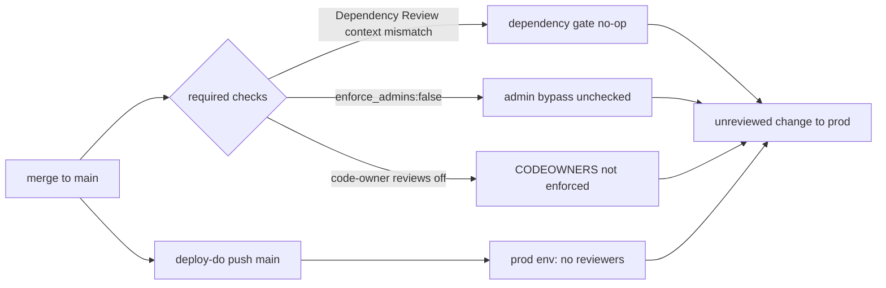

# Branch Protection and Required Checks Audit

## Audit Metadata

- Audit name: `repo-deep-dive`
- Run: `20261002-0344-develop-6286137`
- Repository: `MaineCyberTech/mainecybertech` (local export at `C:/temp/mainecybertech`)
- Branch: `develop`
- Commit SHA: `6286137` (short) — full SHA not independently resolvable in this environment (`git` is not installed on the audit host; see Verification Performed)
- Generated at: 2026-10-02
- Auditor: subagent (prompt 34)
- Area code: BP
- Output path: `docs/audits/repo-deep-dive/20261002-0344-develop-6286137/34_branch_protection_required_checks.md`
- Scope limitations:
  - **GitHub-side settings are not reproducible from the repository.** No live API access to `repos/MaineCyberTech/mainecybertech/branches/{main,develop}/protection`, environments, environment protection rules, required reviewers, or the audit log. Every statement about the *applied* state is `Unknown` / `not reproducible`; this audit reviews the **committed as-code configuration** and **what the workflows actually emit as check names**.
  - `git` is not installed on the audit host, so branch/commit ancestry (e.g. "`main` is far behind `develop`") and the full 40-char SHA could not be replayed. Statements about ancestry are sourced from committed docs and marked accordingly.
  - No modification of workflows, `CODEOWNERS`, `dependabot.yml`, or branch-protection JSON was performed (audit-only).
  - No secret values were printed or read.

## Scope

Reviewed, at commit `6286137` on `develop`:

- **Workflows / jobs** — all 16 files under `.github/workflows/` (names, triggers, job ids, `needs`, `environment`, `concurrency`, `permissions`, `workflow_call`, `workflow_dispatch`).
- **PR template** — `.github/PULL_REQUEST_TEMPLATE.md`.
- **CODEOWNERS** — `.github/CODEOWNERS` and how it is (or is not) enforced.
- **Dependabot** — `.github/dependabot.yml`.
- **Release / deploy / migration / security workflows** — `deploy-do.yml`, `terraform-do.yml`, `supabase-migrations.yml`, `validate.yml`, `test.yml`, `dependency-review.yml`, `codeql.yml`, `sbom.yml`.
- **Branch / release / hotfix docs** — `docs/RELEASING.md`, `docs/ROLLBACK_PROCEDURES.md`, `CONTRIBUTING.md`, `README.dev.md`, `docs/technical-writing/migration-guide.md` (hotfix), `AGENTS.md` (Known Debt), `docs/CI.md`.
- **Environment approvals** — `deploy-do.yml` (`prod`/`dev`), `terraform-do.yml` (`prod-approval`/`dev`), `supabase-migrations.yml` (`prod`/`dev`), and the docs that describe protection-rule state.
- **Manual dispatch** — every `workflow_dispatch` input and its blast radius.
- **Workflow risks** — privileged triggers, path-filter/required-check interaction, admin bypass, missing bypass audit.

**Not reviewed / out of scope:** the live GitHub branch-protection API response; environment reviewer lists; organization/team membership resolved behind `@mainecybertech/*` CODEOWNERS handles; the GitHub audit log; Rulesets (only classic branch protection JSON is committed). These are recorded as `Unknown` where they affect a finding.

## Evidence Reviewed

| Evidence | Type | Why relevant | Notes |
|---|---|---|---|
| `.github/branch-protection/main.json` | Config (as-code) | Declares required contexts, `enforce_admins`, review rules for `main` | 16 lines; reviewed line by line |
| `.github/branch-protection/develop.json` | Config (as-code) | Same for `develop` | 16 lines |
| `.github/branch-protection/README.md` | Docs | Declares intent and the apply command; asserts check names are job names | Contradicted by workflow job ids |
| `.github/workflows/dependency-review.yml` | Workflow | Source of truth for the `Dependency Review` check name | Job id is `review` |
| `.github/workflows/test.yml` | Workflow | Emits `test (20.x)`, `security-scan`, `secrets-scan` | Matrix job `test`, node-version `[20.x]` |
| `.github/workflows/lint.yml` | Workflow | Emits `lint (20.x)` | Matrix job `lint` |
| `.github/workflows/typecheck.yml` | Workflow | Emits `typecheck` | Non-matrix job |
| `.github/workflows/e2e.yml` | Workflow | Emits `e2e (20.x)`; also `workflow_call` prod gate | Path-filtered PR trigger |
| `.github/workflows/validate.yml` | Workflow | Deploy gate; `workflow_call` only; job ids `audit`,`test`,`secrets-scan`,`lint`,`typecheck`,`prompt-provenance` | Not a PR check |
| `.github/workflows/deploy-do.yml` | Workflow | Push-to-`main`/`develop` prod deploy; uses `prod`/`dev` environment | `environment: ${{ needs.setup.outputs.name }}` |
| `.github/workflows/terraform-do.yml` | Workflow | Uses `prod-approval` for prod apply; manual dispatch only | `environment: prod-approval` |
| `.github/workflows/supabase-migrations.yml` | Workflow | `prod`/`dev` environment; serialized | `concurrency` group |
| `.github/workflows/codeql.yml` | Workflow | Emits `Analyze (javascript-typescript)` | Not required |
| `.github/workflows/sbom.yml` | Workflow | Emits `sbom` | Not required |
| `.github/CODEOWNERS` | Config | Ownership map exists | `require_code_owner_reviews: false` |
| `.github/dependabot.yml` | Config | Update automation | npm/actions/docker/terraform |
| `.github/PULL_REQUEST_TEMPLATE.md` | Template | Manual checklist only | No machine enforcement |
| `docs/RELEASING.md` | Docs | Declares branch model + quality gates | Says `prod`/`prod-approval` have no protection rules |
| `docs/ROLLBACK_PROCEDURES.md` | Docs | Claims `prod-approval` "1+ required reviewers" on all prod deploys | Contradicted by AGENTS Known Debt |
| `docs/GITHUB_SECRETS_AND_VARIABLES_MATRIX.md` | Docs | States `dev`/`prod` "no protection rules", `prod-approval` "no required reviewers yet" | Current, matches code |
| `AGENTS.md` (Known Debt §, ~L59, L631-636) | Docs | Says JSON is committed **and applied** with `enforce_admins:false` | Only repo artifact claiming application |
| `docs/CI.md` | Docs | Workflow inventory/gate table | No required-check mapping to branch protection |
| `review.md` (mirror of AGENTS) | Docs | Same Known Debt text | Sync-checked by CI |

## Verification Performed

For each headline claim I attempted to reproduce it from the repository alone. `not reproducible` = requires live GitHub state not available in this audit role.

| Evidence | Type | Why relevant | Notes |
|---|---|---|---|
| `main.json:4` required context list | As-code config | Claim: `main` requires 5 checks | **Reproduced.** `["test (20.x)","lint (20.x)","typecheck","e2e (20.x)","Dependency Review"]` |
| `dependency-review.yml:11` job id | Workflow | Claim: emitted name ≠ `Dependency Review` | **Reproduced.** Job id literal is `review`; workflow `name:` is `Dependency Review` → check context `Dependency Review / review` |
| `main.json:4` vs workflow names | Cross-check | Claim: mismatch means a required check can never report | **Supported (by GitHub semantics).** Contexts match on exact string; `Dependency Review` (no `/ review`) is not a context any job emits |
| `main.json:6` `enforce_admins:false` | As-code config | Claim: admins can bypass | **Reproduced (config).** Applied state `not reproducible` |
| `main.json:9` `require_code_owner_reviews:false` + `CODEOWNERS` present | Cross-check | Claim: CODEOWNERS decorative | **Reproduced (config).** Applied state `not reproducible` |
| `develop.json:2-4` | As-code config | Claim: `develop` protected with 3 checks | **Reproduced.** `["test (20.x)","lint (20.x)","typecheck"]`; `e2e (20.x)` intentionally excluded (README.md:34-37) |
| `deploy-do.yml:278` | Workflow | Claim: prod deploy uses `prod`, not `prod-approval` | **Reproduced.** `environment: ${{ needs.setup.outputs.name }}` resolves to `prod`/`dev` |
| `GITHUB_SECRETS_AND_VARIABLES_MATRIX.md:6-7` | Docs | Claim: `prod`/`prod-approval` unguarded | **Supported (docs), applied state not reproducible** |
| `ROLLBACK_PROCEDURES.md:167` vs AGENTS L59 | Docs contradiction | Claim: docs disagree on approval gate | **Supported.** ROLLBACK says "1+ required reviewers"; AGENTS/matrix say none configured |
| No workflow references branch-protection files | Workflow grep | Claim: no drift-reconciliation job | **Reproduced.** `grep -r "branch-protection\|/protection"` over `*.yml` → no matches |
| `e2e.yml` path filter | Workflow | Claim: a required check is skipped on non-matching PRs | **Reproduced.** `pull_request.paths` limits runs; a skipped job reports "skipped", not "success", on some configurations → required-check deadlock risk |
| `AGENTS.md:631-636` "committed and applied" | Docs | Claim: rules are live | **Not reproducible.** No CI artifact/run proves application; treated as unverified self-attestation |
| Environment protection rules | Live settings | Claim: reviewers configured | **Not reproducible.** No live API access |
| `git` ancestry (`main` far behind `develop`) | Repo | Claim from RELEASING.md:103 | **Not reproducible** on this host (`git` absent) |

## Executive Summary

The repository does the right structural thing that most repos skip: it commits branch protection **as code** (`.github/branch-protection/{main,develop}.json` + `README.md`) and commits a real `CODEOWNERS`. That is a genuine strength — the *intended* policy is reviewable and versioned. Both `develop` and `main` are covered by the committed JSON, review count is 1, stale reviews are dismissed, force-pushes/deletions are disabled, and `required_conversation_resolution` is on.

However, the policy is weakened in five concrete, repo-verifiable ways, and one of them is likely to make a required check a no-op:

1. **Required-check name mismatch (the headline).** `main.json:4` requires a context literally named `Dependency Review`, but the workflow that produces it has workflow `name: Dependency Review` and **job id `review`** (`dependency-review.yml:1,11`). GitHub matches required contexts to the emitted check-run name, which for this workflow is `Dependency Review / review`. A context of `Dependency Review` matches no job. **Independently reproduced at `6286137`** — this confirms prompt 10's finding (CI-P1-002).
2. **`enforce_admins:false`** on both branches (`main.json:6`, `develop.json:6`) — administrators can merge without the required checks and reviews. This is asserted in `AGENTS.md:635` and no bypass-audit artifact exists.
3. **`require_code_owner_reviews:false`** while a detailed `CODEOWNERS` exists (`main.json:9`) — the ownership map is advisory only, so `/.github/`, `/infra/`, and `supabase/migrations/` changes need no domain-owner review.
4. **Environment protection is claimed but unconfigured.** `deploy-do.yml` deploys prod via the **`prod`** environment, while the only environment referenced for a documented approval is `prod-approval` (used by Terraform). `docs/GITHUB_SECRETS_AND_VARIABLES_MATRIX.md:6-7` says both `prod` and `prod-approval` have **no protection rules**, contradicting `docs/ROLLBACK_PROCEDURES.md:167`.
5. **No bypass / drift audit.** Nothing in the repo fetches live protection and diffs it against the committed JSON, and nothing records an admin bypass — so the "as code" file can silently drift from GitHub, and "who skipped checks" is unanswerable.

**Verdict:** Branch-protection-as-code is **partially implemented and not verifiably enforced**. Score: 2/5 overall for the branch-protection domain. The committed config is a strong foundation; the gaps are enforcement and verification, most of them small fixes.

**Counts:** 9 findings — **P0: 0, P1: 3, P2: 4, P3: 2**.

## Inventory

| Item | Path / symbol | Purpose | Current state | Risk | Notes |
|---|---|---|---|---|---|
| Branch protection as code (`main`) | `.github/branch-protection/main.json` | Required checks/reviews for `main` | Committed; 5 contexts, 1 review, `strict:true` | High | `Dependency Review` context likely never matches |
| Branch protection as code (`develop`) | `.github/branch-protection/develop.json` | Rules for `develop` | Committed; 3 contexts, 1 review | Medium | No `e2e`, by design |
| BP README / apply command | `.github/branch-protection/README.md` | Intent + `gh api PUT` apply | Committed | Medium | Asserts check names are job names (false) |
| Test job | `.github/workflows/test.yml` (`jobs.test`) | `test (20.x)` required check | Present | Low | Matrix yields `test (20.x)` |
| Lint job | `.github/workflows/lint.yml` (`jobs.lint`) | `lint (20.x)` | Present | Low | |
| Typecheck job | `.github/workflows/typecheck.yml` (`jobs.typecheck`) | `typecheck` | Present | Low | |
| E2E job | `.github/workflows/e2e.yml` (`jobs.e2e`) | `e2e (20.x)`; prod gate via `workflow_call` | Present | Medium | Path-filtered; flaky per docs |
| Dependency Review job | `.github/workflows/dependency-review.yml` (`jobs.review`) | `Dependency Review / review` | Present | High | Name mismatch vs required context |
| Validate workflow | `.github/workflows/validate.yml` | Shared deploy gate (`workflow_call`) | Present | Low | Not a PR check; job ids module-scoped |
| Deploy workflow | `.github/workflows/deploy-do.yml` | Push-deploy `main`/`develop` | Present | High | Uses `prod` env (unguarded) |
| Terraform workflow | `.github/workflows/terraform-do.yml` | Infra plan/apply | Manual dispatch only | Medium | `prod-approval` env unguarded |
| Migrations workflow | `.github/workflows/supabase-migrations.yml` | `supabase db push` | Present | Medium | `prod`/`dev` env unguarded |
| CodeQL | `.github/workflows/codeql.yml` | SAST | Present | Low | Emits `Analyze (javascript-typescript)`; not required |
| SBOM | `.github/workflows/sbom.yml` | CycloneDX artifact | Present | Low | Emits `sbom`; not required |
| CODEOWNERS | `.github/CODEOWNERS` | Ownership map | Present | Medium | Not enforced by reviews |
| Dependabot | `.github/dependabot.yml` | Automated updates | Present | Low | 4 ecosystems |
| PR template | `.github/PULL_REQUEST_TEMPLATE.md` | Manual checklist | Present | Low | No enforcement |
| Release docs | `docs/RELEASING.md` | Branch model + gates | Present | Medium | Notes unguarded envs |
| Rollback docs | `docs/ROLLBACK_PROCEDURES.md` | Rollback/approval | Present | Medium | Claims reviewers that aren't configured |
| Hotfix process | `docs/technical-writing/migration-guide.md:153-155` | Emergency hotfix branch | Stub only | Medium | No merge/approval/break-glass steps |
| Env matrix | `docs/GITHUB_SECRETS_AND_VARIABLES_MATRIX.md` | Environment inventory | Present | Low | Correctly says no protection rules |

## Domain Scorecard

| Category | Score | Evidence | Gap | Recommended action |
|---|---:|---|---|---|
| Workflows/jobs | 4 | 16 workflows; SHA-pinned actions; least-privilege `permissions` blocks; `concurrency` on deploy/migrations | Check names not mapped to required contexts; path filters can leave required checks unscheduled | Add a workflow→context mapping test; document path-filter semantics |
| PR templates | 3 | `.github/PULL_REQUEST_TEMPLATE.md` with 8-item checklist | Checklist is manual; no machine verification the boxes are true | Add a lightweight CI check or keep as-is and mark advisory |
| CODEOWNERS | 3 | `.github/CODEOWNERS` covers apps/packages/infra/ci/db/docs | `require_code_owner_reviews:false` — never enforced | Set `require_code_owner_reviews:true` on both branches |
| Dependabot | 4 | `.github/dependabot.yml`: npm, github-actions, docker, terraform, weekly groups | No auto-merge rules / no SLA; security updates not separated | Add a security-update group and document triage SLA |
| Release/deploy/migration/security workflows | 3 | `deploy-do` gates prod with `validate`+`e2e`+`migrate`; migrations serialized; CodeQL/SBOM present | Prod env unguarded; `terraform-do` manual-only (no PR plan); `main` behind `develop` | Add reviewers to `prod`; restore PR-plan-only trigger for Terraform |
| Branch/release/hotfix docs | 3 | `docs/RELEASING.md`, `docs/ROLLBACK_PROCEDURES.md`, `CONTRIBUTING.md` | Docs contradict each other on the approval gate; hotfix is a 2-line stub; no break-glass process | Reconcile env state across docs; add hotfix + break-glass runbook |
| Environment approvals | 1 | `docs/GITHUB_SECRETS_AND_VARIABLES_MATRIX.md:6-7` "no protection rules" | `prod` (Docker deploy) and `prod-approval` (Terraform) have no required reviewers; `deploy-do` uses plain `prod` | Configure `prod` reviewers OR repoint deploy to `prod-approval`; then fix docs |
| Manual dispatch | 3 | `deploy-do` (`deploy_target`,`rollback_sha` validated as hex), `terraform-do` (`apply` gate), E2E `a11y_full` | Dispatch-only paths bypass PR checks entirely; `terraform-do` apply reachable on `develop`→dev without review | Add environment gate to all destructive dispatch paths; document blast radius |
| Workflow risks | 2 | No `pull_request_target`/`workflow_run` (good); SHA-pinned actions (good) | Admin bypass unaudited; no drift detection; `Dependency Review` context dead; path-filter gaps | Add drift workflow + admin-bypass alerting; fix context |

## Detailed Review

### Item: `.github/branch-protection/main.json`

- Evidence: `.github/branch-protection/main.json:2-15`.
- What it does: Declares `strict:true`, contexts `["test (20.x)","lint (20.x)","typecheck","e2e (20.x)","Dependency Review"]`, `enforce_admins:false`, 1 approving review, stale-review dismissal on, `require_code_owner_reviews:false`, `restrictions:null`, conversation resolution on, force-push/delete off.
- How it appears to work: Applied via `gh api -X PUT .../branches/main/protection --input main.json` (README.md:13-14). GitHub matches each string in `contexts` to the exact name of a reported check-run.
- Dependencies: Repo admin + `administration: write` token; live application state (unverifiable here).
- Current controls: strict up-to-date requirement; 1 review; conversation resolution; no force-push/delete.
- Missing controls: exact-match validation of contexts; `enforce_admins:true`; code-owner reviews; a ruleset or drift-audit job.
- Risks: `Dependency Review` context likely never matches; admin bypass possible; CODEOWNERS unenforced.
- Recommended improvement: Replace `"Dependency Review"` with the emitted context (`Dependency Review / review`), or add `name:` to the job so the emitted name is stable, and then verify with `gh api .../commits/<sha>/check-runs`; set `enforce_admins:true` and `require_code_owner_reviews:true`.
- Suggested tests: see Suggested Tests.
- Suggested docs: update `README.md` check-name table + add a "verify contexts" step.

### Item: `.github/branch-protection/develop.json`

- Evidence: `.github/branch-protection/develop.json:2-15`.
- What it does: Same as `main` but contexts `["test (20.x)","lint (20.x)","typecheck"]`.
- How it appears to work: Same apply mechanism.
- Dependencies: Same as above.
- Current controls: `strict:true`, 1 review, conversation resolution, no force-push/delete.
- Missing controls: same three as `main`; additionally `e2e` is deliberately excluded (README.md:34-37, flakiness rationale in `AGENTS.md`).
- Risks: `develop` is protected but also admin-bypassable and code-owner-unenforced; deliberate `e2e` exclusion is a documented, defensible trade-off.
- Recommended improvement: Set `enforce_admins:true`; consider requiring `e2e` on a narrower path-filtered basis once flakiness is quarantined; document the exclusion rationale in the JSON (comments aren't possible in JSON — use README).
- Suggested tests/docs: as for `main`.

### Item: `.github/workflows/dependency-review.yml`

- Evidence: `dependency-review.yml:1` (`name: Dependency Review`), `:11` (`review:` job id), `:15-17` (`actions/dependency-review-action`, `fail-on-severity: high`).
- What it does: On PRs to `main`/`develop`, fails when a high+ vulnerability is introduced.
- How it appears to work: Check-run name is `<workflow name> / <job name>` = `Dependency Review / review`.
- Dependencies: `pull_request` trigger; `pull-requests: write`.
- Current controls: blocks on high+; runs on both protected branches.
- Missing controls: the required context string is `Dependency Review`, which this job never reports.
- Risks: The gate the team believes is required on `main` is very likely not enforced as a required check.
- Recommended improvement: Set the job `name:` to a fixed value and use that exact value in `main.json`, **or** put `Dependency Review / review` in `contexts`; then prove it.
- Suggested tests/docs: assert emitted contexts match `contexts` in both JSON files.

### Item: `.github/CODEOWNERS` vs `require_code_owner_reviews`

- Evidence: `.github/CODEOWNERS:1-44`; `main.json:9`; `develop.json:9`.
- What it does: Assigns `@mainecybertech/{leads,backend,frontend,platform,infrastructure}` to root, `apps/*`, `packages/*`, `infra/*`, `/.github/`, `supabase/migrations/`, Dockerfiles, docs.
- How it appears to work: It doesn't, for merge gating — with `require_code_owner_reviews:false`, GitHub requests but does not require owner review.
- Dependencies: Team handles must exist in the org (unverifiable here).
- Current controls: Advisory ownership; auto-requested reviewers.
- Missing controls: Enforcement; a fallback owner if a team is empty; syntax verification.
- Risks: Critical-path changes (`/.github/`, `/infra/`, `supabase/migrations/`) can merge without a domain owner.
- Recommended improvement: `require_code_owner_reviews:true` on both branches; verify team existence; add a CODEOWNERS lint step.
- Suggested tests/docs: PR touching `/apps/api/` requires a `@mainecybertech/backend` approval.

### Item: Environment approvals (`prod`, `prod-approval`, `dev`)

- Evidence: `deploy-do.yml:104,278` (`environment: ${{ needs.setup.outputs.name }}` → `prod`/`dev`); `terraform-do.yml:158` (`environment: prod-approval`), `:198` (`environment: dev`); `supabase-migrations.yml:24` (`prod`/`dev`); `GITHUB_SECRETS_AND_VARIABLES_MATRIX.md:6-7`; `ROLLBACK_PROCEDURES.md:165-167`; `AGENTS.md:59`.
- What it does: Names GitHub Environments to scope secrets and (intended) approvals.
- How it appears to work: Docker prod deploy uses **`prod`**; Terraform prod apply uses **`prod-approval`**; docs uniformly say neither has protection rules.
- Dependencies: Repo admin to set required reviewers.
- Current controls: Environment isolation of secrets; `concurrency` on deploy/migrations.
- Missing controls: Required reviewers on `prod` and `prod-approval`; a single standard environment name; branch restrictions on environments.
- Risks: Prod deploy can start without human approval; docs (`ROLLBACK_PROCEDURES.md`) misstate this.
- Recommended improvement: Configure 1+ required reviewers on `prod` (and `prod-approval`), or repoint `deploy-do`'s prod job to `prod-approval`; then reconcile all docs.
- Suggested tests/docs: dispatch `deploy-do` with `deploy_target: prod` → run must pause at "Waiting for approval".

### Item: Manual dispatch blast radius

- Evidence: `deploy-do.yml:4-15` (`deploy_target`, `rollback_sha` validated at `:57-63` regex `^[0-9a-f]{7,40}$`), `terraform-do.yml:9,156` (`apply` input gates apply; prod on `main`, dev on `develop`), `e2e.yml:4-9` (`a11y_full`).
- What it does: Lets an operator trigger deploys/infra changes/migrations outside the PR flow.
- How it appears to work: Dispatch runs do **not** pass through PR required checks; they rely on the in-workflow gates (`validate`, prod `e2e`/`migrate`) and environment approvals.
- Dependencies: Environment protection (missing) and admin trust.
- Current controls: `validate` gate always runs on deploy; prod gates skip on rollback; hex validation on `rollback_sha`; `terraform-do` `apply` input.
- Missing controls: Environment approval on dispatch paths; an audit of who dispatched what; `terraform-apply-dev` on `develop` runs with only `validate-gate`.
- Risks: A dispatch can mutate prod (or dev infra) without branch-protection involvement.
- Recommended improvement: route destructive dispatches through a protected environment; log dispatch actor (GitHub retains this but the repo keeps no artifact).
- Suggested tests: dispatch without approval must not start; confirm pause.

### Item: Workflow risks

- Evidence: `grep pull_request_target|workflow_run` over `.github/workflows/*.yml` → **no matches** (good). SHA pinning across workflows (e.g. `test.yml:36`, `e2e.yml:44`, `deploy-do.yml:55`). Path filters (`test.yml:13-20`, `e2e.yml:12-22`).
- What it does: No privileged untrusted-code triggers exist; actions are pinned.
- How it appears to work: Standard `pull_request` semantics; secrets are forwarded via `envs:` blocks, not inlined (`deploy-do.yml:319-333`).
- Dependencies: None.
- Current controls: SHA pinning; least-privilege `permissions`; no PR-target.
- Missing controls: Drift/audit job; admin-bypass alerting; required-check/context parity test.
- Risks: Silent drift of the "as code" file from reality; path-filter gaps where a required check is not scheduled.
- Recommended improvement: Add drift detection (below).

## Scenario / Control Matrix

| ID | Scenario or control | Evidence | Current control | Gap | Severity | Recommendation |
|---|---|---|---|---|---|---|
| BP-001 | Workflows/jobs | 16 files; SHA-pinned | PR checks + deploy gates | Check names not verified against required contexts | P1 | Add context-parity test |
| BP-002 | PR templates | `.github/PULL_REQUEST_TEMPLATE.md` | Manual checklist | No enforcement | P3 | Keep advisory / document |
| BP-003 | CODEOWNERS | `.github/CODEOWNERS`; `main.json:9` | Ownership map exists | `require_code_owner_reviews:false` | P1 | Enable code-owner reviews |
| BP-004 | Dependabot | `.github/dependabot.yml` | 4 ecosystems, weekly | No security-update separation | P3 | Add security group + SLA |
| BP-005 | Release/deploy/migration/security workflows | `deploy-do`, `terraform-do`, `supabase-migrations` | Prod gates e2e/migrate | `prod` env unguarded; Terraform manual-only | P1/P2 | Add env reviewers; restore PR plan |
| BP-006 | Branch/release/hotfix docs | `RELEASING.md`, `ROLLBACK_PROCEDURES.md`, migration-guide | Branch model documented | Docs contradict; hotfix stub; no break-glass | P2 | Reconcile + add runbooks |
| BP-007 | Environment approvals | `GITHUB_SECRETS_AND_VARIABLES_MATRIX.md:6-7` | Env-scoped secrets | No required reviewers on `prod`/`prod-approval` | P1 | Configure reviewers |
| BP-008 | Manual dispatch | `deploy-do.yml:4-15`, `terraform-do.yml:9,156` | `validate` gate; hex validation | No approval on dispatch; dev infra apply on `develop` | P2 | Gate dispatch via environment |
| BP-009 | Workflow risks | no `pull_request_target`; pinned actions | Least-privilege, pinned | No drift/audit job; admin bypass unaudited | P2 | Add drift + bypass audit |

## Findings

### Finding ID: BP-P1-001 - `main` requires a context (`Dependency Review`) that no job emits

- Severity: P1 (High)
- Confidence: High (repo config + workflow reproduced at `6286137`) / Medium (live enforcement not verifiable)
- Area: Branch protection / required checks
- Evidence:
  - `.github/branch-protection/main.json:4` — `"contexts": ["test (20.x)", "lint (20.x)", "typecheck", "e2e (20.x)", "Dependency Review"]`.
  - `.github/workflows/dependency-review.yml:1` — `name: Dependency Review`.
  - `.github/workflows/dependency-review.yml:11` — the job id is `review:`.
  - `.github/branch-protection/README.md:25-28` — repeats the list and asserts the names are "the **job/check-run names** produced by ... `dependency-review.yml`".
  - Cross-check: prompt 10 report `docs/audits/repo-deep-dive/20261002-0344-develop-6286137/10_github_actions_cicd_governance.md:276-277,281` (CI-P1-002) — independently re-verified here.
- What is happening: GitHub required status checks match on the **exact** reported context string. This workflow emits `<workflow name> / <job name>` = `Dependency Review / review`. The committed required context is `Dependency Review` (no `/ review`), which does not correspond to any check-run this repo produces. A required context with no matching check-run cannot gate merges (it is either perpetually pending or treated as absent depending on configuration), so the dependency-review gate the team believes is required on `main` is very likely a no-op.
- Why it matters: A control the team counts on is silently ineffective; vulnerable dependencies can reach the production branch without the intended block.
- User / business impact: Weakened supply-chain review on `main`; the "required checks" table in `README.md` is only partially real.
- Security / privacy / reliability impact: A high-severity dependency vulnerability could be merged to `main` without the dependency-review gate firing as required.
- Recommended fix: Give the job a fixed `name:` (e.g. `name: dependency-review`) in `dependency-review.yml` and set `main.json` `contexts` to that exact string, **or** set the context to `Dependency Review / review`. Verify the true emitted name first: `gh api repos/MaineCyberTech/mainecybertech/commits/<sha>/check-runs --jq '.check_runs[].name'`. Apply the corrected JSON with the documented `gh api -X PUT` command.
- Suggested validation: Open a PR that adds a high-severity vulnerable dependency; confirm `Dependency Review / review` runs and that the Merge button is blocked for a non-admin and an admin.
- Owner suggestion: platform/operations
- Effort estimate: S
- Dependencies: Repo admin + `administration: write` token; one successful CI run to capture the emitted context.
- Status: open
- Endpoint / data path: PR to `main` → `dependency-review.yml` check-run `Dependency Review / review` → branch-protection `contexts` match.
- Attack path: composes with BP-P1-002 (admin bypass) and BP-P1-003 (prod env unguarded) into "unreviewed vulnerable dependency reaches prod".

### Finding ID: BP-P1-002 - `enforce_admins:false` lets administrators bypass all required checks and reviews

- Severity: P1 (High)
- Confidence: High (config) / Medium (applied state not reproducible)
- Area: Branch protection / bypass
- Evidence:
  - `.github/branch-protection/main.json:6` — `"enforce_admins": false`.
  - `.github/branch-protection/develop.json:6` — `"enforce_admins": false`.
  - `AGENTS.md:635` — "...`enforce_admins:false`, so admins can still bypass" (acknowledged debt).
  - `docs/audits/.../10_github_actions_cicd_governance.md:278` (CI-P1-002) — same control gap.
- What is happening: With `enforce_admins:false`, repository administrators can push/merge to `main` and `develop` without satisfying the required checks or the 1-review requirement. No repository artifact records or alerts on such a bypass (there is no audit workflow and no log capture).
- Why it matters: The strongest actors in the repo are exempt from the merge gates, and there is no evidence trail — a bypass is invisible to review.
- User / business impact: The stated review/CI gate can be skipped without notice; incident forensics ("who bypassed, when") has no source in the repo.
- Security / privacy / reliability impact: Untested or unreviewed code can reach `main`; governance control is advisory for admins.
- Recommended fix: Set `"enforce_admins": true` in both JSON files and re-apply. Where a documented break-glass path is needed (see BP-P2-002), allow a time-boxed ruleset exception with an incident ticket rather than a standing bypass. Add a scheduled workflow that alerts when a branch-protection bypass is used (GitHub audit-log/`gh api` based).
- Suggested validation: With `enforce_admins:true`, attempt (as an admin) to merge a PR with a failing required check; the merge must be blocked.
- Owner suggestion: platform/operations (repo admin)
- Effort estimate: S
- Dependencies: Repo admin; decision on break-glass policy.
- Status: open
- Attack path: composes with BP-P1-001 and BP-P1-003.

### Finding ID: BP-P1-003 - Production deploy path uses the unguarded `prod` environment, not `prod-approval`

- Severity: P1 (High)
- Confidence: High (repo evidence) / Medium (live environment state not reproducible)
- Area: Environment protection / release governance
- Evidence:
  - `.github/workflows/deploy-do.yml:278` — `environment: ${{ needs.setup.outputs.name }}`; `:71` sets `ENV_NAME=prod` for `main` pushes or `deploy_target: prod`; `:77` sets `dev` otherwise.
  - `.github/workflows/terraform-do.yml:158` — the only job that uses `environment: prod-approval`.
  - `docs/GITHUB_SECRETS_AND_VARIABLES_MATRIX.md:6-7` — "`prod` — ... (no protection rules)"; "`prod-approval` — ... no required reviewers are configured yet".
  - `docs/ROLLBACK_PROCEDURES.md:167` — claims "All production deployments (Docker and Terraform) require approval through the `prod-approval` GitHub environment with 1+ required reviewers" — contradicted by the matrix and `AGENTS.md:59`.
  - `AGENTS.md:59` — "`prod`/`prod-approval` environments have no protection rules".
- What is happening: The Docker prod deploy job runs under the plain `prod` environment, while the documented approval gate lives on `prod-approval` (used only by Terraform). Because environments are opt-in protection containers, a `main` push (or `deploy_target: prod` dispatch) starts the prod deploy job with no approval step. The rollback runbook asserts the opposite.
- Why it matters: Production change control is weaker than documented; a merge/push to `main` can deploy to production without human approval, and operators consulting `ROLLBACK_PROCEDURES.md` will believe an approval gate exists.
- User / business impact: Unapproved production changes can ship; incident response assumes a reviewer who was never in the loop.
- Security / privacy / reliability impact: Reduced change-control on the most sensitive path; docs/behavior mismatch undermines incident response.
- Recommended fix: Configure Required reviewers (≥1) on the `prod` environment (the one `deploy-do` actually uses), **or** repoint the prod deploy job to `prod-approval`. Then update `ROLLBACK_PROCEDURES.md`, `FINAL_DEPLOYMENT_OPERATIONS_HANDBOOK.md`, and the matrix to a single source of truth.
- Suggested validation: Dispatch `deploy-do` with `deploy_target: prod`; the run must pause at "Waiting for approval" before the `deploy` job starts.
- Owner suggestion: platform/operations (repo admin for environment settings)
- Effort estimate: S (settings) + S (docs)
- Dependencies: Repo admin; decision on standard environment name.
- Status: open
- Endpoint / data path: push `main` → `deploy-do.deploy` → SSH `root@droplet` → `docker compose up` (writes `/opt/mct-portal/.env`).
- Attack path: composes with BP-P1-002 into "unattended production change".

### Finding ID: BP-P2-001 - `require_code_owner_reviews:false` makes the committed CODEOWNERS advisory only

- Severity: P2 (Medium)
- Confidence: High (config) / Medium (applied state not reproducible)
- Area: Branch protection / review ownership
- Evidence:
  - `.github/CODEOWNERS:1-44` — root `* @mainecybertech/leads`; `/apps/api/`, `/apps/web/`, `/apps/worker/`, `packages/*`, `/infra/`, `/.github/workflows/`, `/.github/`, `/supabase/migrations/`, Dockerfiles, `/docs/`.
  - `.github/branch-protection/main.json:9` — `"require_code_owner_reviews": false`.
  - `.github/branch-protection/develop.json:9` — `"require_code_owner_reviews": false`.
- What is happening: CODEOWNERS designates domain owners, but branch protection does not require their review. Any single approver (or, with BP-P1-002, an admin) can merge a change to critical paths.
- Why it matters: The ownership model — which exists precisely to require backend/infra/db review — is decorative; high-risk paths can merge without their owners.
- User / business impact: Changes to CI workflows, Terraform, and migrations can bypass domain-expert review, raising the chance of an outage or unsafe schema/infra change.
- Security / privacy / reliability impact: Weakened review on the most privileged paths (`/.github/`, `/infra/`, `supabase/migrations/`).
- Recommended fix: Set `"require_code_owner_reviews": true` on both branches; confirm each `@mainecybertech/*` team exists and has members; add a fallback owner for empty teams; add a CODEOWNERS syntax check to CI.
- Suggested validation: Open a PR touching `/.github/workflows/`; confirm it requires `@mainecybertech/infrastructure` approval and cannot merge without it.
- Owner suggestion: platform/operations
- Effort estimate: S
- Dependencies: Repo admin; org team membership.
- Status: open

### Finding ID: BP-P2-002 - No break-glass / bypass process for branch protection, and no bypass audit trail

- Severity: P2 (Medium)
- Confidence: High (absence of evidence)
- Area: Governance / break-glass
- Evidence:
  - `grep -ri "break.?glass|emergency merge|bypass"` over docs returns only a *product feature* (`docs/features/break-glass-register.md`, an account register module) — not a CI/merge break-glass process.
  - No workflow references `branch-protection` or `/protection` (grep over `.github/workflows/*.yml` → no matches); nothing records or reconciles bypasses.
  - `AGENTS.md:635` acknowledges admin bypass exists but prescribes no process.
  - `docs/technical-writing/migration-guide.md:153-155` — the only "Emergency Deployment (Hotfix)" path is a two-line stub ("Create hotfix branch from `main`") with no merge/approval/exception steps.
- What is happening: There is no documented, time-boxed emergency-merge procedure and no audit artifact for it. The nearest thing — the hotfix section — does not describe how the hotfix merges past protection or who approves it.
- Why it matters: Without a defined break-glass path and an audit trail, emergency changes either (a) rely on the standing admin bypass that is already on, or (b) get improvised under incident pressure.
- User / business impact: Slower, riskier incident response; no record to review after the fact.
- Security / privacy / reliability impact: Governance gap; bypasses cannot be reviewed or trended.
- Recommended fix: Document a break-glass process in `docs/RELEASING.md`/a new `docs/RUNBOOK_EMERGENCY_MERGE.md`: require an incident ticket, a named approver, a time-box, and a post-incident review; prefer a ruleset exception over the standing `enforce_admins:false`. Add a scheduled job that reads the GitHub audit log for protection bypasses and posts them.
- Suggested validation: Simulate the documented break-glass procedure on a scratch branch; confirm each step is executable and the bypass is logged.
- Owner suggestion: platform/operations + security
- Effort estimate: S (docs) + M (bypass-audit job)
- Dependencies: GitHub audit-log read access; decision on `enforce_admins`.
- Status: open

### Finding ID: BP-P2-003 - No drift detection between committed branch-protection JSON and live GitHub settings

- Severity: P2 (Medium)
- Confidence: High (absence of evidence)
- Area: Branch protection / verification
- Evidence:
  - `grep -r "branch-protection\|/protection" .github/workflows/*.yml` → **no matches** (no reconcile/verify workflow).
  - `.github/branch-protection/README.md:17-21` documents a *manual* inspect command (`gh api .../protection`) with no automation.
  - `AGENTS.md:634` asserts the JSON is "committed **and applied**", but no CI artifact or run demonstrates application — a self-attestation (recorded `unverified`).
- What is happening: The "as code" file is authoritative only by convention. Nothing fails when GitHub protection diverges from the JSON (e.g. someone edits settings in the UI, or a branch is recreated).
- Why it matters: The reproducibility benefit of as-code config is lost without a check; the committed policy can silently stop matching reality.
- User / business impact: A reviewer reading `main.json` may be reading a stale policy; audit conclusions become unreliable.
- Security / privacy / reliability impact: Enforcement can lapse without any signal.
- Recommended fix: Add a scheduled `workflow_dispatch`+`schedule` job that fetches `repos/{owner}/{repo}/branches/{main,develop}/protection`, normalizes it, and fails when it differs from the committed JSON (which should be fetched live and written back by a bot on change). Store the live response as a build artifact for evidence.
- Suggested validation: Change protection in the UI and confirm the drift job fails; restore it and confirm green.
- Owner suggestion: platform
- Effort estimate: M
- Dependencies: `administration: read` token; a PAT/App token since the default `GITHUB_TOKEN` cannot read branch protection.
- Status: open

### Finding ID: BP-P2-004 - Path-filtered required checks can leave `main`/`develop` protected by checks that never run

- Severity: P2 (Medium)
- Confidence: Medium (GitHub scheduling semantics; repo config reproduced)
- Area: Branch protection / required checks
- Evidence:
  - `.github/workflows/test.yml:13-20` — `pull_request.paths` limited to `apps/**`, `packages/**`, `pnpm-lock.yaml`, `package.json`, `test.yml`.
  - `.github/workflows/lint.yml:13-20`, `.github/workflows/typecheck.yml:13-20` — same path filters.
  - `.github/workflows/e2e.yml:12-22` — narrower path filter (`apps/web/e2e/**`, `playwright.config.ts`, `apps/web/app/**`, `apps/web/components/**`, `packages/**`, `supabase/seeds/**`, `supabase/migrations/**`, `e2e.yml`).
  - `.github/branch-protection/main.json:4` requires `test (20.x)`, `lint (20.x)`, `typecheck`, `e2e (20.x)`.
- What is happening: When a PR touches files outside a workflow's `paths`, that workflow does not run, so its required check-run is never created. Depending on configuration and GitHub's handling of skipped vs. missing checks, a PR that changes, for example, only `docs/**` or `CHANGELOG.md` may be unable to satisfy the required contexts (deadlock) — or the required check is simply absent and the branch-protection rule provides no coverage for those PRs. Either way, required checks are not firing for a meaningful fraction of PRs.
- Why it matters: The required-check set does not match the set of PRs it is supposed to gate; behavior is surprising to contributors and undermines the "green PR" contract.
- User / business impact: Contributors hit confusing merge blocks (or, worse, unguarded merges) for docs/config-only PRs.
- Security / privacy / reliability impact: Coverage gap; unpredictable gating.
- Recommended fix: Either remove the `paths` filters from `test`/`lint`/`typecheck` (run on every PR to protected branches — the workflows are cheap and cached), or pair each required check with an always-run companion job that reports success when the real job is intentionally skipped. Document the resulting behavior. Note `e2e` is intentionally excluded from `develop` (README.md:34-37) and only path-filtered on `main`; keep that trade-off explicit.
- Suggested validation: Open a docs-only PR to `main`; confirm the required checks either run or are replaced by always-run companions, and that the PR is mergeable without ambiguity.
- Owner suggestion: platform
- Effort estimate: S (adjust filters) to M (companion jobs)
- Dependencies: Decision on cost vs. coverage; awareness of E2E flakiness.
- Status: open

### Finding ID: BP-P3-001 - Hotfix and emergency-deploy documentation is a stub and partially stale

- Severity: P3 (Low)
- Confidence: High
- Area: Branch/release/hotfix docs
- Evidence:
  - `docs/technical-writing/migration-guide.md:153-155` — "### Emergency Deployment (Hotfix)" is two lines: "Create hotfix branch from `main`" with no further steps.
  - `docs/ROLLBACK_PROCEDURES.md:116-120` — Terraform rollback says "Push to trigger terraform-do workflow" and "will run a plan on the PR/push and apply automatically (dev) or require prod-approval (main)", but `terraform-do.yml:3-14` is `workflow_dispatch` only (2026-09-29).
  - `docs/ROLLBACK_PROCEDURES.md:167` — claims `prod-approval` reviewers exist (see BP-P1-003).
- What is happening: The hotfix path is undocumented beyond a single line, and the rollback doc describes a Terraform flow that no longer runs on push/PR.
- Why it matters: During an incident, operators follow stale/fragmentary docs and may take wrong actions (e.g. wait for a push-triggered Terraform plan that never runs).
- User / business impact: Slower, error-prone incident response.
- Security / privacy / reliability impact: Reliability/response gap; doc-vs-behavior mismatch.
- Recommended fix: Expand the hotfix section (branch, review requirements, CI gates, merge path, back-merge to `develop`, changelog) and update the Terraform rollback section to the dispatch procedure (`gh workflow run terraform-do.yml -f apply=true --ref <branch>`) plus the `prod-approval` state.
- Suggested validation: Walk the procedure on a scratch repo/branch and time it; correct any step that fails.
- Owner suggestion: platform/operations
- Effort estimate: S
- Dependencies: Agreement on the break-glass process (BP-P2-002).
- Status: still-open (documentation drift partially carried from prompt 12's findings)

### Finding ID: BP-P3-002 - Dependabot has no security-update separation or triage SLA, and PR template has no enforced link to required checks

- Severity: P3 (Low)
- Confidence: High
- Area: Governance polish
- Evidence:
  - `.github/dependabot.yml:1-55` — four ecosystems (npm, github-actions, docker, terraform), weekly cadence, grouping, labels; no `security` group and no auto-merge/priority policy.
  - `.github/PULL_REQUEST_TEMPLATE.md:9-18` — checklist includes "Lint and typecheck pass" and test boxes, but nothing ties the checklist to the branch-protection required contexts.
- What is happening: Dependency PRs are batched weekly with no fast lane for security advisories, and the PR checklist is fully manual with no machine cross-reference to the required checks.
- Why it matters: Security fixes can wait until Monday's batch; contributors rely on memory rather than the gate.
- User / business impact: Slower security patching; minor contributor friction.
- Security / privacy / reliability impact: Low; process hygiene.
- Recommended fix: Add a `security` group (or enable Dependabot security updates) and document a triage SLA in `CONTRIBUTING.md`/`docs/RELEASING.md`; add a line to the PR template pointing at the required checks table in `.github/branch-protection/README.md`.
- Suggested validation: Confirm a security advisory generates a PR outside the weekly batch after the change.
- Owner suggestion: platform
- Effort estimate: S
- Dependencies: None.
- Status: open

## Risks

| Risk | Severity | Likelihood | Impact | Evidence | Mitigation |
|---|---|---|---|---|---|
| Dependency-review gate is a no-op on `main` | P1 | High | High | `main.json:4`; `dependency-review.yml:1,11` | Fix context string; verify emitted check-run |
| Admin bypass of all required checks/reviews | P1 | Medium | High | `main.json:6`, `develop.json:6`; `AGENTS.md:635` | `enforce_admins:true`; break-glass policy |
| Prod deploy runs without human approval | P1 | Medium | High | `deploy-do.yml:71,278`; matrix `:6-7` | Reviewers on `prod` env |
| CODEOWNERS never required | P2 | High | Medium | `main.json:9`; `.github/CODEOWNERS` | `require_code_owner_reviews:true` |
| As-code config drifts from live settings | P2 | Medium | Medium | No reconcile workflow | Drift-detection job |
| Required checks don't run on path-filtered PRs | P2 | Medium | Medium | `test.yml:13-20` etc. | Remove filters / companion jobs |
| No bypass audit trail | P2 | High | Medium | No audit workflow | Audit-log alerting |
| Stale hotfix/rollback docs | P3 | High | Low | migration-guide `:153-155`; ROLLBACK `:116-120` | Update docs |

## Recommendations

### Immediate / Release Blocking

1. **Fix the `Dependency Review` required context** (BP-P1-001): capture the emitted check-run name and set `main.json`'s context to that exact string; re-apply and prove with a failing PR.
2. **Set `enforce_admins:true`** on `main` and `develop` (BP-P1-002), and define the break-glass exception path before doing so.
3. **Add required reviewers to the `prod` environment** (BP-P1-003) — the environment `deploy-do` actually uses — or repoint prod deploy to `prod-approval`.

### This Week

4. **Set `require_code_owner_reviews:true`** (BP-P2-001) and confirm the `@mainecybertech/*` teams resolve.
5. **Add the drift-detection workflow** (BP-P2-003) diffing live protection against the committed JSON.
6. **Reconcile the environment docs** (`ROLLBACK_PROCEDURES.md`, handbook, matrix) to the true state (BP-P1-003, BP-P3-001).

### This Month

7. **Resolve the path-filter / required-check mismatch** (BP-P2-004).
8. **Add bypass audit logging** (BP-P2-002) from the GitHub audit log.
9. **Expand hotfix + break-glass runbooks** (BP-P3-001, BP-P2-002).

### Later / Platform Evolution

10. Evaluate the more capable mechanism: GitHub **Rulesets** (or **merge queue**) for `main`/`develop`, which support bypass-actor lists, required workflows, and status-check requirements with clearer semantics than classic contexts; migrate the JSON to Rulesets when comfortable. (BP-P3-002, follow-on.)

## Quick Wins

| Quick win | Why it helps | Files likely involved | Validation |
|---|---|---|---|
| Fix the `Dependency Review` context | Makes a believed-required gate real | `.github/branch-protection/main.json`, `.github/workflows/dependency-review.yml`, `README.md` | Failing-dep PR blocks merge |
| Flip `enforce_admins` to `true` | Removes standing admin bypass | both `.json` | Admin cannot merge red PR |
| Flip `require_code_owner_reviews` to `true` | Activates CODEOWNERS | both `.json` | Path owner review required |
| Add `prod` env reviewers | Adds human approval to prod deploy | GitHub settings (docs update: `GITHUB_SECRETS_AND_VARIABLES_MATRIX.md`) | Dispatch pauses for approval |
| Correct `ROLLBACK_PROCEDURES.md:167` | Removes a false safety claim | `docs/ROLLBACK_PROCEDURES.md` | Doc matches matrix/AGENTS |
| Add Dependabot `security` group | Faster security patching | `.github/dependabot.yml` | Advisory PR opens out-of-band |

## Hardening Backlog

| Backlog item | Priority | Owner suggestion | Effort | Dependency |
|---|---|---|---|---|
| Correct required-check contexts + verify emitted names | P1 | platform | S | Admin token; one CI run |
| `enforce_admins:true` + break-glass policy | P1 | platform/ops | S | Policy decision |
| `prod` environment required reviewers | P1 | ops | S | Admin access |
| `require_code_owner_reviews:true` + CODEOWNERS lint | P2 | platform | S | Team membership |
| Branch-protection drift-detection workflow | P2 | platform | M | App/PAT with `administration: read` |
| Path-filter vs required-check reconciliation | P2 | platform | S–M | Cost/coverage decision |
| Bypass audit-log alerting | P2 | security | M | Audit-log read access |
| Hotfix/break-glass/rollback doc updates | P3 | ops | S | BP-P2-002 decision |
| Migrate to GitHub Rulesets / merge queue | P3 | platform | L | Team familiarity |

## Suggested Tests

- **CI config test (unit-like):** a script that parses each `.github/workflows/*.yml`, derives `name/job-name` contexts, and asserts that every string in `main.json`/`develop.json` `contexts` is producible by some job; fail on mismatch (catches BP-P1-001).
- **Drift integration test (scheduled):** fetch `gh api repos/{owner}/{repo}/branches/{main,develop}/protection`, normalize, and fail when it differs from the committed JSON (BP-P2-003).
- **Branch-protection enforcement E2E (manual/CI on scratch repo):** open a PR with a failing required check; assert merge is blocked for both a non-admin and an admin (after `enforce_admins:true`) (BP-P1-002).
- **Environment approval test:** dispatch `deploy-do` with `deploy_target: prod`; assert the run waits at "Waiting for approval" (BP-P1-003).
- **CODEOWNERS validation:** a CI step that lints `.github/CODEOWNERS` syntax and confirms each `@team` resolves (BP-P2-001).
- **Path-filter regression:** for each required check, open a docs-only PR and a code PR to each protected branch; record whether the context is present/absent and assert documented behavior (BP-P2-004).
- **Security/regression:** commit a dummy high-severity vulnerable dependency in a scratch branch and confirm the dependency-review check blocks the merge (BP-P1-001).
- **Manual validation:** execute the documented hotfix and break-glass procedures end-to-end on a scratch branch and record step-level results (BP-P2-002, BP-P3-001).

## Suggested Documentation Updates

- `.github/branch-protection/README.md` — correct the check-name table to the actual emitted contexts; add the "verify emitted contexts" command; state the applied-vs-committed caveat.
- `docs/RELEASING.md` — link the branch-protection files as the source of truth for required checks; state the true environment-protection state.
- `docs/ROLLBACK_PROCEDURES.md` — fix the `prod-approval` claim (`:167`) and the Terraform push-trigger description (`:116-120`).
- `docs/GITHUB_SECRETS_AND_VARIABLES_MATRIX.md` — keep as the canonical environment-protection state; update when reviewers are added.
- `docs/CI.md` — add a "required checks by branch" section referencing the JSON, and note path-filter semantics.
- `docs/technical-writing/migration-guide.md` — expand the Emergency Deployment (Hotfix) section.
- **New** `docs/RUNBOOK_EMERGENCY_MERGE.md` (or a section in `RELEASING.md`) — the break-glass process, approval, and audit expectations.
- `CONTRIBUTING.md` — point contributors at the required checks table and Dependabot triage SLA.

## Open Questions

| Question | Why it matters | Evidence needed |
|---|---|---|
| Is `main.json`/`develop.json` actually applied to GitHub, and does it match the committed files today? | Determines whether any finding is live | `gh api repos/.../branches/{main,develop}/protection` output at the audit commit |
| What context string does the dependency-review job actually emit (`Dependency Review / review`)? | Confirms the exact fix for BP-P1-001 | `gh api repos/.../commits/<sha>/check-runs` |
| Do the `@mainecybertech/{leads,backend,frontend,platform,infrastructure}` teams exist with members? | `require_code_owner_reviews:true` depends on it | Org team listing |
| Do `prod`, `prod-approval`, `dev` have required reviewers / branch restrictions today? | BP-P1-003 disposition | Environment settings API/UI |
| Was the "applied" claim in `AGENTS.md:634` ever verified, and by what artifact? | Review/attestation discipline | A run URL or check-run proving application |
| Does the team intend Rulesets/merge queue in place of classic protection? | Determines long-term recommendation | Team decision |
| Are branch-protection bypasses currently monitored anywhere (audit log, alerts)? | BP-P2-002 | Audit-log configuration |

## Appendix

### Appendix A — Workflow → check-context map (as emitted by job ids)

| Workflow file | Workflow `name:` | Job id | Emitted check-run context (`name / job`) | Required on `develop` | Required on `main` |
|---|---|---|---|---|---|
| `test.yml` | Test | `test` (matrix 20.x) | `Test / test (20.x)` | yes (`test (20.x)`) | yes (`test (20.x)`) |
| `test.yml` | Test | `security-scan` | `Test / security-scan` | no | no |
| `test.yml` | Test | `secrets-scan` | `Test / secrets-scan` | no | no |
| `lint.yml` | Lint | `lint` (matrix 20.x) | `Lint / lint (20.x)` | yes (`lint (20.x)`) | yes (`lint (20.x)`) |
| `typecheck.yml` | TypeCheck | `typecheck` | `TypeCheck / typecheck` | yes (`typecheck`) | yes (`typecheck`) |
| `e2e.yml` | E2E | `e2e` (matrix 20.x) | `E2E / e2e (20.x)` | no (by design) | yes (`e2e (20.x)`) |
| `dependency-review.yml` | Dependency Review | `review` | `Dependency Review / review` | no | **declared `Dependency Review` → mismatch** |
| `validate.yml` | Validate | `audit`,`test`,`secrets-scan`,`lint`,`typecheck`,`prompt-provenance` | `Validate / <job>` | (deploy gate, not PR check) | (deploy gate) |
| `codeql.yml` | CodeQL | `analyze` | `CodeQL / Analyze (javascript-typescript)` | no | no |
| `sbom.yml` | SBOM | `sbom` | `SBOM / sbom` | no | no |

Note: GitHub's required-context matching is on the full check-run name (`<workflow name> / <job name>`), but branch protection also accepts the bare job name in many configurations. The committed contexts use the bare form (`test (20.x)`) except for `Dependency Review`, which is neither the bare job name (`review`) nor the full context. This is the crux of BP-P1-001 and must be confirmed against a real check-run.

### Appendix B — Invocation/tooling notes

- `git` is not available on the audit host (`git : The term 'git' is not recognized`), so `git rev-parse HEAD`, `git log`, and ancestry checks could not be run. Commit identity is taken from the run INDEX (`62861370`) and task input (`6286137`).
- All workflow/config reads were performed with the read/grep tools against the local export at `C:/temp/mainecybertech`.
- No secret values were read or printed; the deploy workflow's secret handling was reviewed only for shape (`envs:` forwarding), not content.

### Appendix C — Prior-run continuity

- Prior prompt-34 artifact: `prompts/repo-deep-dive/20260728-0142-develop-21a10d6/34_branch_protection_required_checks.md`. That run (prefix `BRANCH`) reported **"no CODEOWNERS"** and **"no required status checks"** as P0s. At the current commit both are **resolved**: `.github/CODEOWNERS` exists and `.github/branch-protection/{main,develop}.json` are committed. Those old P0s are therefore `verified-fixed` by the presence of the artifacts; the remaining risk has shifted from "absent" to "enforcement/verification" (this report's BP findings).
- Continuity caveat: the prior run used a different finding prefix (`BRANCH`) and is a short summary, not a structured report; it was used only for direction, not copied.

### Appendix D — Mermaid summary of the gap chain

