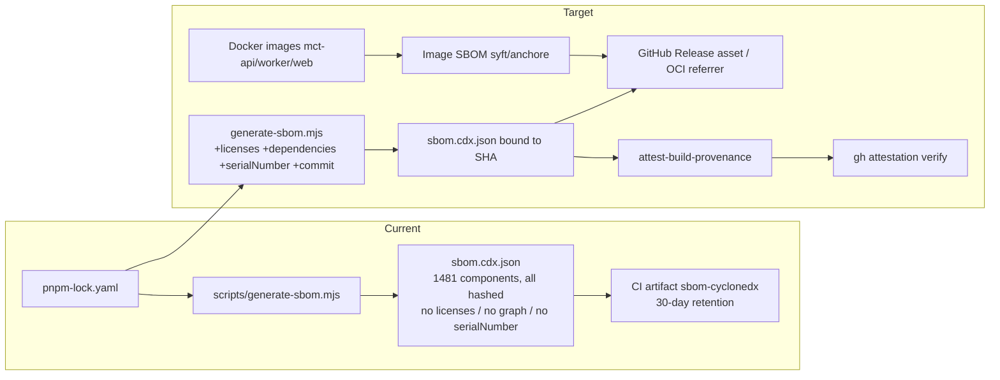

# SBOM and License Policy Audit

## Audit Metadata

- Audit name: repo-deep-dive
- Run: 20261002-0344-develop-6286137
- Repository: mainecybertech/mainecybertech (pnpm monorepo / Turbo)
- Branch: develop
- Commit SHA: 6286137017c4b7c77e83ee420ec11382d984f263 (short: 62861370)
- Generated at: 2026-10-02T00:00:22-04:00
- Auditor: Principal Repository Auditor (AI subagent)
- Area code: SBOM
- Output path: docs/audits/repo-deep-dive/20261002-0344-develop-6286137/35_sbom_license_policy.md
- Scope limitations:
  - Read-only audit. No installs, no repository modifications. The SBOM generator was executed against the working tree (writes only to `%TEMP%`), not committed.
  - `sbom.cdx.json` is not tracked in git (`.gitignore:59-61`) and was not present in the working tree at audit start; it was generated locally for verification. CI runs are not observable from the repository, so "attested/uploaded in CI" is annotated from workflow definitions, not from a captured CI run artifact.
  - License inventory was produced with `pnpm licenses list` against the installed `node_modules` at this commit; the SBOM itself carries no license data, so license conclusions come from pnpm, not from the SBOM.
  - Docker image layers and GitHub-hosted attestations could not be inspected (no registry/API credentials authorized).
  - The previous run (`20260730-0650-develop-62da92c`) is used only for continuity/diff; every claim below was re-checked at 62861370.

## Scope

Reviewed, at commit 62861370 on branch `develop`:

- **Package manifests:** root `package.json`, `apps/{api,web,worker}/package.json`, `packages/{sdk,ui,config}/package.json`, `pnpm-workspace.yaml`.
- **Lockfiles:** `pnpm-lock.yaml` (lockfileVersion `9.0`).
- **SBOM tooling and workflow:** `scripts/generate-sbom.mjs`, `.github/workflows/sbom.yml`, `package.json` `sbom` script, `.gitignore` SBOM entries.
- **Docker images:** `apps/{api,web,worker}/Dockerfile`, `.github/workflows/build-push.yml`, `.github/workflows/deploy-do.yml`.
- **GitHub Actions:** all 16 workflows in `.github/workflows/` (pin posture, permissions, gates).
- **Dependency updates:** `.github/dependabot.yml`.
- **License fields and license risk:** manifest `license` fields, root `LICENSE` file, and `pnpm licenses list` distribution over the resolved tree.
- **SBOM workflows / container SBOM / dependency review / vulnerability alerts / release provenance / signing / attestation / license policy / exception process:** as evidenced in workflows, scripts, and docs.

Not reviewed / out of scope:

- Live GHCR image contents, registry signatures, and any GitHub-hosted attestation store (no credentials).
- Runtime behaviour of third-party services or downstream consumers.
- Legal sufficiency of the ISC license choice for specific customer contracts (business input, not repository evidence).

## Evidence Reviewed

| Evidence | Type | Why relevant | Notes |
|---|---|---|---|
| `scripts/generate-sbom.mjs` | Generator | The SBOM producer; parsed line-by-line against the lockfile | 116 lines; dependency-free line parser |
| `.github/workflows/sbom.yml` | Workflow | Runs the generator in CI and uploads an artifact | push/PR `main`,`develop`; weekly Mon 05:00; dispatch |
| `pnpm-lock.yaml` (`packages:` section) | Lockfile | Source of truth the SBOM is derived from | lockfileVersion `9.0`; 1481 package entries |
| `package.json:27` | Script | `"sbom": "node scripts/generate-sbom.mjs sbom.cdx.json"` | Local entry point |
| `package.json:4` | Manifest field | Root license `"ISC"` | Same value across all workspaces |
| `apps/{api,web,worker}/package.json` | Manifest field | Workspace license `"ISC"` | `private: true` |
| `packages/{sdk,ui,config}/package.json` | Manifest field | Workspace license `"ISC"` | `private: true` |
| `LICENSE` | Legal file | Root ISC license text ("Maine CyberTech", 2026) | Real license file present |
| `.github/workflows/dependency-review.yml` | Workflow | PR dependency gate | `fail-on-severity: high`; SHA-pinned action |
| `.github/dependabot.yml` | Config | Dependency update automation | npm, github-actions, docker, terraform |
| `.github/workflows/validate.yml` | Workflow | Deploy gate | `pnpm audit --audit-level=high --prod` (hard fail) |
| `.github/workflows/test.yml` | Workflow | PR gate | Trivy fs SARIF + `pnpm audit` |
| `.github/workflows/build-push.yml` | Workflow | Image build | No SBOM/provenance/attestation flags |
| `.github/workflows/deploy-do.yml` | Workflow | Prod/dev deploy | `id-token: write`; builds images; no attestation |
| `apps/{api,web,worker}/Dockerfile` | Container build | Base images, users | `node:20-alpine@sha256:fb4cd...` digest-pinned |
| `pnpm licenses list --json` | Tool output | License distribution over resolved tree | 1226 entries; 19 distinct license strings |
| `pnpm audit --audit-level=high --prod` | Tool output | Current vulnerable-dep state | "No known vulnerabilities found" at this commit |
| `docs/CI.md:25` | Docs | Claims SBOM workflow is "Blocking" | Contradicts workflow definition |
| `docs/RELEASING.md:86-87` | Docs | Describes SBOM as 30-day artifact | Consistent with workflow |
| `AGENTS.md:250,632-633` | Docs | States SBOM artifact exists | Consistent |
| Prior run `prompts/repo-deep-dive/20260730-0650-develop-62da92c/35_sbom_license_policy.md` | Prior report | Continuity/diff only | Superseded by this report |

## Verification Performed

| Evidence | Type | Why relevant | Notes |
|---|---|---|---|
| `node scripts/generate-sbom.mjs <temp>/sbom-verify.cdx.json` | Executed | Reproduce the documented generation procedure | `supported` — "Wrote 1481 components"; ran at 62861370 |
| Parse `sbom-verify.cdx.json` | Executed | Check SBOM completeness & fields | 1481 components, all with hashes; **no `serialNumber`, no `dependencies` graph, no `licenses`, no author** |
| Re-parse `pnpm-lock.yaml` `packages:` with generator regex | Executed | Verify SBOM vs lockfile parity | 1481 lockfile entries = 1481 SBOM components; `supported` |
| Integrity coverage check | Executed | Verify hashes present for every entry | 0 entries without integrity; `supported` |
| Empty-version / duplicate bom-ref check | Executed | Detect dropped or collapsed components | 0 empty-version keys, 0 duplicate `bom-ref`s; `supported` |
| `pnpm licenses list --json` | Executed | License distribution & copyleft detection | 1226 entries; findings below |
| `pnpm audit --audit-level=high --prod` | Executed | Current vuln state | "No known vulnerabilities found"; `supported` |
| `git ls-files` / `git check-ignore` | Executed | Determine whether `sbom.cdx.json` is tracked or stale | Ignored by `.gitignore:60`; not committed; no stale committed SBOM |
| `Select-String` over `.github/workflows/*.yml` for `attest|cosign|syft|trivy|slsa|provenance|license|sbom` | Executed | Attestation/license/container-SBOM detection | Only `sbom.yml` (generate+upload), `test.yml` (Trivy fs), `validate.yml` (prompt provenance) hit |
| `Select-String` for `provenance:|sbom:|attestations:` in workflows | Executed | Check build-push provenance flags | None found; `deploy-do.yml:29` has `id-token: write` but no attest step |
| `pnpm licenses list` (installed tree) | Executed | Compare SBOM count vs resolved tree | pnpm lists 1226 (dedup by package name), SBOM lists 1481 (per lockfile key) — different denominators, see Inventory note |
| `docs/CI.md` and `docs/RELEASING.md` cross-read | Read | Check doc claims vs workflow | `docs/CI.md:25` "Blocking" is unsupported by `sbom.yml` |

### Reproduction outcomes per headline claim

| Claim (source) | Outcome | Evidence |
|---|---|---|
| "SBOM workflow emits a CycloneDX artifact" (`AGENTS.md:250,632-633`; `docs/RELEASING.md:86`) | `supported` | `sbom.yml:26-34`; executed generator produces valid CycloneDX 1.5 |
| "SBOM workflow is Blocking" (`docs/CI.md:25`) | `unsupported` | `sbom.yml` has no `exit 1`, no `continue-on-error:false` gate semantics beyond step failure; it only generates+uploads; not referenced by `validate.yml` |
| SBOM is complete for npm lockfile (`generate-sbom.mjs` intent) | `supported` (npm packages) / `partially supported` (overall) | 1481/1481 lockfile entries, but excludes workspace/importers, Docker base images, and carries no license data |
| Actions are SHA-pinned (`docs/CI.md:3`) | `supported` | `sbom.yml:20,22,30`, `dependency-review.yml:14-15`, `build-push.yml:21...` all use 40-hex SHAs |
| "No known vulnerabilities" at commit | `supported` | `pnpm audit --audit-level=high --prod` ran clean |
| License policy enforced in CI | `unsupported` | No `allow-licenses`/`deny-licenses` anywhere in `.github/` |
| Release provenance/attestation | `unsupported` | No `attest-build-provenance`, no `cosign`, no `provenance: true` in build-push/deploy-do |

## Executive Summary

Since the previous run (20260730, commit 62da92c), the repository materially improved: a working CycloneDX SBOM generator and workflow now exist (`scripts/generate-sbom.mjs`, `.github/workflows/sbom.yml`), GitHub Actions are now SHA-pinned across the workflows, a real root `LICENSE` (ISC) file is present, Dependabot covers npm/actions/docker/terraform, the dependency-review action is SHA-pinned, and `pnpm audit --audit-level=high --prod` is a hard deploy gate (currently green). The SBOM generator is *correct and complete against the pnpm lockfile*: at this commit it emits 1481 components — exactly matching the 1481 `packages:` entries — with an integrity hash on every single component, no dropped entries, and no duplicate `bom-ref`s. That is a genuine, reproducible strength.

However, the SBOM is **generated and stored as a 30-day CI artifact only**. It is not committed, not published to GitHub Releases, not bound to the deploying commit SHA, not attested (`attest-build-provenance`/cosign absent), and not attached to the container images. The generator embeds no commit/version binding (no `serialNumber`, no git SHA; `metadata.component` even lacks a `version` because the root `package.json` has none). The SBOM also carries **no license data at all** (`licenses` absent on every component) and **no dependency graph** (`dependencies` array absent), so it cannot answer "which license?" or "who depends on the vulnerable package?" without a separate `pnpm licenses list` run. The container base images (`node:20-alpine@sha256:fb4cd…`) are not represented in any SBOM, and there is no container SBOM step.

The largest unaddressed risk is **license policy**: there is no allowlist/denylist anywhere in CI, no `docs/LICENSE_POLICY` document, and no exception process. `pnpm licenses list` shows the resolved tree already contains a copyleft-adjacent dependency — `@img/sharp-win32-x64@0.35.4` under `Apache-2.0 AND LGPL-3.0-or-later` (pulled in via the `sharp` override at `package.json:69`), plus two `MPL-2.0` packages (`axe-core`, `@axe-core/playwright`) and two `FSL-1.1-MIT` packages. None of these is a foregone legal problem, but none is detected or gated, and the `dependency-review-action` runs with vulnerability-only severity and no license policy, so a future GPL/AGPL/SSPL dependency would merge undetected. A second concrete defect is documentation drift: `docs/CI.md:25` labels the SBOM workflow "Blocking" when it gates nothing, which will mislead operators and future agents.

Recommended next actions, in order: (1) add `allow-licenses`/`deny-licenses` to `dependency-review.yml` plus a `docs/LICENSE_POLICY.md`; (2) emit license data into the SBOM and add a `serialNumber`/commit field so the SBOM is bound to the commit it was built from; (3) publish the SBOM as a release asset and enable build provenance on the Docker builds; (4) fix the `docs/CI.md` "Blocking" claim.

### Strengths

- Working, dependency-free SBOM generator that exactly matches the lockfile (1481/1481, all hashed) — reproduced.
- `sbom.yml` runs on push/PR to `main`/`develop`, weekly, and manual dispatch; uploads a CycloneDX artifact (`.github/workflows/sbom.yml:29-34`).
- All GitHub Actions SHA-pinned (e.g. `actions/checkout@11bd7191…`, `actions/dependency-review-action@2031cfc0…`).
- Real root `LICENSE` (ISC) file present and tracked; all workspaces declare `"license": "ISC"`.
- Dependabot configured for npm, github-actions, docker, and terraform (`.github/dependabot.yml`).
- `pnpm audit --audit-level=high --prod` is a **hard** deploy gate (`validate.yml:32-38`), currently passing; Trivy fs scan added to `test.yml:117-130`.
- Docker base images digest-pinned and containers run as non-root (all three Dockerfiles).

### Major Risks

- No license policy enforcement in CI at all (vuln-only review); copyleft/FSL licenses already present and undetected by any gate.
- SBOM is artifact-only: not attested, not release-bound, not commit-bound, not on the images.
- SBOM contains no license data and no dependency graph → limited usefulness for vuln triage and license review.
- No container/image SBOM (base OS packages invisible).
- No SLSA/provenance/signing on released GHCR images despite `id-token: write` being available.
- `docs/CI.md:25` incorrectly calls the SBOM workflow "Blocking".

## Inventory

| Item | Path / symbol | Purpose | Current state | Risk | Notes |
|---|---|---|---|---|---|
| SBOM generator | `scripts/generate-sbom.mjs` | Produce CycloneDX 1.5 from lockfile | Implemented, works | Medium | Dependency-free line parser; no license/graph/serialNumber |
| SBOM workflow | `.github/workflows/sbom.yml` | Run generator + upload artifact | Implemented | Medium | No gating, no release binding, no attestation |
| SBOM script | `package.json:27` (`sbom`) | Local invocation | Implemented | Low | `node scripts/generate-sbom.mjs sbom.cdx.json` |
| SBOM artifact path | `.gitignore:59-61` (`sbom.cdx.json`, `sbom.spdx.json`) | Ignore generated SBOM | Implemented | Low | Not committed → no stale committed SBOM (positive) |
| SPDX path | `.gitignore:61` (`sbom.spdx.json`) | Anticipated SPDX output | Absent | Low | No generator emits SPDX |
| Root license | `package.json:4` | Root license declaration | `"ISC"` | Low | Matches `LICENSE` |
| Workspace licenses | `apps/*/package.json`, `packages/*/package.json` | Workspace license | `"ISC"` (all) | Low | `private: true` |
| Legal file | `LICENSE` | ISC text | Present, tracked | Low | "Copyright (c) 2026 Maine CyberTech" |
| Dependency review | `.github/workflows/dependency-review.yml` | PR vuln gate | Implemented | High | `fail-on-severity: high`; no license policy |
| Dependabot | `.github/dependabot.yml` | Auto-update deps | Implemented | Low | npm/actions/docker/terraform; groups |
| Vuln audit gate | `validate.yml:32-38` | Hard fail on high/critical prod deps | Implemented | Low | Currently green |
| Trivy fs scan | `test.yml:117-130` | FS/config vuln scan | Implemented | Low | SARIF; skips lockfile |
| Image build | `build-push.yml`, `deploy-do.yml` (build jobs) | Build/push GHCR images | Implemented | High | No SBOM/provenance/attest flags |
| Dockerfiles | `apps/{api,web,worker}/Dockerfile` | Image build | Digest-pinned, non-root | Low | Base not in any SBOM |
| License inventory | `pnpm licenses list` | Resolved-tree licenses | Available ad hoc | High | 1226 entries / 19 license strings; not gated |
| License policy doc | `docs/LICENSE_POLICY.md` | Approved/denied licenses | Absent | High | Not found anywhere |
| SBOM process doc | `docs/SBOM_PROCESS.md` | How SBOMs are produced/stored | Absent | Medium | Only `docs/CI.md`/`RELEASING.md` mention SBOM |
| CI doc claim | `docs/CI.md:25` | SBOM gate status | "Blocking" (wrong) | Medium | Contradicts `sbom.yml` |
| Release doc | `docs/RELEASING.md:86-87` | SBOM as 30-day artifact | Accurate | Low | — |
| Exception process | (none) | License/security exceptions | Absent | High | No documented process |

**Note on denominators:** `pnpm licenses list` reports **1226** entries (deduplicated by package identity across the store) while `generate-sbom.mjs` reports **1481** components (one per `packages:` key, i.e. per resolved instance). The two are not directly comparable; both are consistent with the installed/locked tree at this commit. The SBOM count equals the lockfile count exactly.

## Domain Scorecard

| Category | Score | Evidence | Gap | Recommended action |
|---|---:|---|---|---|
| Package manifests | 4 | Root + 6 workspaces all declare `license: ISC`; `private: true`; root has `sbom` script | ISC choice undocumented; no `version` field on root | Document license decision; consider adding version or accept absence |
| Lockfiles | 5 | Single committed `pnpm-lock.yaml` (v9.0), frozen install everywhere | None | — |
| Docker images | 3 | Digest-pinned `node:20-alpine@sha256:…`, non-root user in all 3 Dockerfiles | No image SBOM; base OS packages untracked | Add `anchore/sbom-action`/syft per image |
| GitHub Actions | 4 | All actions SHA-pinned; least-privilege `permissions:` blocks | SBOM/images not gated; no provenance | Add attestation/provenance steps |
| Dependency updates | 4 | Dependabot npm/actions/docker/terraform, grouped | No versioning strategy for actions/docker | Add `versioning-strategy` and auto-merge policy if desired |
| License fields | 3 | `license: ISC` on all manifests; real `LICENSE` | No LICENSE_POLICY; ISC choice unratified | Add `docs/LICENSE_POLICY.md` |
| Third-party/transitive deps | 3 | SBOM enumerates all 1481 locked instances with hashes | No license data, no graph, no policy gate | Add license+graph to SBOM; add allowlist gate |
| SBOM workflows | 3 | `sbom.yml` functional; runs push/PR/weekly/dispatch | Artifact-only; no gating/release binding/attestation | Publish to release, bind to SHA, make presence-gated |
| Container SBOM | 1 | None | Base images unrepresented | Add per-image SBOM generation |
| Dependency review | 3 | PR gate fails on high severity | No license policy (`allow/deny-licenses` absent) | Add allow/deny lists |
| Vulnerability alerts | 4 | `pnpm audit --prod` hard gate (green) + Trivy + Dependabot | Trivy skips lockfile; no SBOM-based re-scan | Add periodic SBOM re-scan against advisories |
| Release provenance | 2 | `id-token: write` present in deploy workflows | No attestation/signing on images or SBOM | Add `attest-build-provenance` / cosign |

## Detailed Review

### Item: SBOM generator (`scripts/generate-sbom.mjs`)

- Evidence: `scripts/generate-sbom.mjs:1-116`; executed at 62861370 → 1481 components.
- What it does: Parses the `packages:` section of `pnpm-lock.yaml` with a dependency-free line parser (`ENTRY`/`INTEGRITY` regexes, lines 18-19), splits name/version (`splitNameVersion`, 56-61), builds npm PURLs (`toPurl`, 63-66), attaches the lockfile integrity hash per component (83-90), sorts, and writes CycloneDX 1.5 JSON (98-115).
- How it appears to work: Correctly handles scoped names (via PURL `%40` encoding), peer-suffix parenthesisation (`replace(/\(.*\)$/,"")`), and all three YAML key quoting forms. Verified: 1481/1481 entries parsed, 0 without integrity, 0 dropped for empty version, 0 duplicate `bom-ref`s.
- Dependencies: Node built-ins only (`node:fs`, `node:path`, `node:url`).
- Current controls: Integrity hashes on every component; deterministic sort.
- Missing controls: No `serialNumber`; no `dependencies` graph; no `licenses` per component; no git commit/version binding; `metadata.component.version` omitted because root `package.json` has no `version` (line 109); no `importers:`/workspace components; no validation step that the output is well-formed before upload.
- Risks: SBOM cannot support license review or transitive-dependency triage; cannot be tied to the exact commit.
- Recommended improvement: Add `serialNumber` (UUID), a `metadata.component.version` fallback (e.g. commit SHA), per-component `licenses` sourced from `pnpm licenses list --json`, and a top-level `dependencies` graph derived from `importers:`/`snapshots:`.
- Suggested tests: Snapshot test asserting component count equals lockfile entry count; schema validation against the CycloneDX 1.5 JSON schema; unit tests for scoped/peer/quoting fixtures.
- Suggested docs: `docs/SBOM_PROCESS.md` describing scope (npm lockfile only), generation, storage, and known exclusions.

### Item: SBOM workflow (`.github/workflows/sbom.yml`)

- Evidence: `.github/workflows/sbom.yml:1-34`.
- What it does: On push/PR to `main`/`develop`, weekly (Mon 05:00), and manual dispatch, checks out (`actions/checkout@11bd7191…`, line 20), sets up Node 20 (line 22), runs `node scripts/generate-sbom.mjs sbom.cdx.json` (line 27), and uploads `sbom.cdx.json` as artifact `sbom-cyclonedx` with 30-day retention (lines 29-34). `permissions: contents: read` (line 12-13).
- How it appears to work: Straightforward generate-and-upload; no artifact consumption elsewhere (`download-artifact` hits are only in `terraform-do.yml:174,214`, unrelated).
- Dependencies: `scripts/generate-sbom.mjs`; `actions/checkout`, `actions/setup-node`, `actions/upload-artifact` (all SHA-pinned).
- Current controls: Least-privilege permissions; SHA-pinned actions; 10-min timeout.
- Missing controls: No gate (does not block anything); no release upload; no attestation; no comparison against a baseline to flag removed components; no `if: always()` needed but also no failure semantics tied to a required check.
- Risks: Operators reading `docs/CI.md:25` believe SBOM blocks merges; it does not. Artifact expires in 30 days and is per-run, so there is no durable release-bound SBOM.
- Recommended improvement: Emit `serialNumber`+commit; attach to the GitHub Release or to the GHCR image via `actions/attest`; optionally fail the job if component count drops unexpectedly.
- Suggested tests: CI test that a known-removed dependency produces a component-count delta; assertion that the artifact name/commit are recorded.
- Suggested docs: Update `docs/CI.md:25` from "Blocking" to "Artifact-only (no gate)".

### Item: Dependency review + license policy (`.github/workflows/dependency-review.yml`)

- Evidence: `.github/workflows/dependency-review.yml:1-17`.
- What it does: On PRs to `main`/`develop`, runs `actions/dependency-review-action@2031cfc0…` with only `fail-on-severity: high` (line 17).
- How it appears to work: Vulnerability-only PR gate; no license parameters.
- Dependencies: GitHub dependency graph.
- Current controls: High-severity vuln fail; `pull-requests: write` for the summary comment.
- Missing controls: `allow-licenses`/`deny-licenses`; no `docs/LICENSE_POLICY.md`; no exception process.
- Risks: A GPL/AGPL/SSPL or non-compliant dependency merges undetected (see Findings SBOM-P1-001).
- Recommended improvement: Add allow/deny lists (see Recommendations), and document the exception process.
- Suggested tests: A PR adding a deny-listed license fails the check.
- Suggested docs: `docs/LICENSE_POLICY.md`.

### Item: Docker / container SBOM & provenance (`build-push.yml`, `deploy-do.yml`, Dockerfiles)

- Evidence: `build-push.yml:36-44,64-72,97-111`; `deploy-do.yml:192-199,214-221,236-250`; Dockerfiles digest-pinned `node:20-alpine@sha256:fb4cd12c85ee03686f6af5362a0b0d56d50c58a04632e6c0fb8363f609372293`, non-root `USER appuser`/`nextjs`.
- What it does: Builds and pushes `mct-api`/`mct-worker`/`mct-web` to GHCR tagged by commit SHA (`env.IMAGE_TAG`).
- How it appears to work: Standard `docker/build-push-action` (SHA-pinned) with GHA cache; no `provenance:`, `sbom:`, or `attestations:` inputs; no post-build `cosign`/`attest`.
- Dependencies: Docker Hub images; GHCR.
- Current controls: Digest-pinned base; non-root; health gates; auto-rollback.
- Missing controls: No image SBOM; no provenance attestation; no signing; no SBOM attached to the image/release.
- Risks: Base-OS vulnerabilities (alpine packages, npm-in-image) invisible; consumers cannot verify image origin.
- Recommended improvement: Add `provenance: true` + `sbom: true` to `build-push-action` (or `anchore/sbom-action`), and `actions/attest-build-provenance` for the released images.
- Suggested tests: `gh attestation verify` on a built image; compare image SBOM OS packages to the advisory DB.
- Suggested docs: Add container-SBOM section to `docs/SBOM_PROCESS.md`.

## Scenario / Control Matrix

| ID | Scenario or control | Evidence | Current control | Gap | Severity | Recommendation |
|---|---|---|---|---|---|---|
| SBOM-001 | Package manifests | All `package.json` `license: ISC` | Declared license | No ratification doc | P3 | Document ISC decision; keep `private: true` |
| SBOM-002 | Lockfiles | `pnpm-lock.yaml` v9.0 committed; frozen install in all jobs | Fully locked | None | — | Maintain |
| SBOM-003 | Docker images | 3 Dockerfiles digest-pinned, non-root | Pinned base, non-root | No image SBOM | P2 | Add per-image SBOM |
| SBOM-004 | GitHub Actions | All workflows SHA-pinned | Source pinning | SBOM/images ungated | P2 | Add provenance/attestation |
| SBOM-005 | Dependency updates | `.github/dependabot.yml` (npm/actions/docker/tf) | Weekly PRs | No versioning for actions/docker | P3 | Add `versioning-strategy` |
| SBOM-006 | License fields | `license: ISC` everywhere; `LICENSE` present | Declaration | No policy/allowlist | P1 | Add `docs/LICENSE_POLICY.md` |
| SBOM-007 | Third-party/transitive deps | 1481 SBOM components, all hashed | Enumeration | No license/graph in SBOM | P1 | Add licenses + `dependencies` graph |
| SBOM-008 | SBOM workflows | `sbom.yml` generate+upload | Artifact | No gate/release binding | P2 | Publish to release; bind to SHA |
| SBOM-009 | Container SBOM | None found | `pnpm audit`+Trivy fs only | No image/OS SBOM | P2 | Add syft/anchore per image |
| SBOM-010 | Dependency review | `dependency-review.yml:17` | Fail on high vuln | No license policy | P1 | Add `allow/deny-licenses` |
| SBOM-011 | Vulnerability alerts | `validate.yml:38`, `test.yml:115`, Dependabot | Hard gate (green) + Trivy | No SBOM-based re-scan | P2 | Periodic SBOM re-scan |
| SBOM-012 | Release provenance | `deploy-do.yml:29` `id-token: write` | OIDC token available | No attestation/signing | P2 | `attest-build-provenance` |

## Findings

### Finding ID: SBOM-P1-001 - No license allow/deny policy in dependency review or any CI gate

- Severity: P1 - High
- Confidence: High
- Area: SBOM / License Compliance
- Evidence:
  - `.github/workflows/dependency-review.yml:15-17` — `actions/dependency-review-action@2031cfc0…` with only `fail-on-severity: high`; no `allow-licenses`/`deny-licenses`.
  - `grep` over `.github/workflows/*.yml` for `allow-licenses|deny-licenses|license` returned no policy matches.
  - `pnpm licenses list` at this commit shows copyleft-adjacent licenses already present: `@img/sharp-win32-x64@0.35.4` = `Apache-2.0 AND LGPL-3.0-or-later`; `axe-core@4.12.1` and `@axe-core/playwright@4.12.1` = `MPL-2.0`; 2 packages = `FSL-1.1-MIT`.
  - No `docs/LICENSE_POLICY.md` exists (searched `docs/**`).
- What is happening: The only automated dependency gate checks vulnerability severity. No allowlist/denylist of licenses is configured anywhere, so license compliance is entirely manual and undocumented.
- Why it matters: For a commercial SaaS platform, introducing a GPL/AGPL/SSPL dependency can create real legal/redistribution obligations. Copyleft and Functional Source License (FSL) components are already present and nothing in CI surfaces or approves them.
- User / business impact: Potential licensing/IP exposure and customer-contract friction; no auditable approval trail for restricted licenses.
- Security / privacy / reliability impact: Indirect — supply-chain governance gap; FSL/copyleft terms could affect redistribution rights of the product.
- Recommended fix:
  1. Add to `.github/workflows/dependency-review.yml`:
     ```yaml
     - uses: actions/dependency-review-action@2031cfc080254a8a887f58cffee85186f0e49e48
       with:
         fail-on-severity: high
         allow-licenses: MIT, ISC, Apache-2.0, BSD-2-Clause, BSD-3-Clause, 0BSD, Unlicense, CC0-1.0, BlueOak-1.0.0, MIT-0, Artistic-2.0, Python-2.0, CC-BY-4.0, WTFPL
         deny-licenses: GPL-1.0-or-later, GPL-2.0-or-later, GPL-3.0-or-later, AGPL-1.0-or-later, AGPL-3.0-or-later, SSPL-1.0, BUSL-1.1
     ```
  2. Reconcile the currently-present MPL-2.0 (`axe-core`) and LGPL-3.0-or-later (`@img/sharp-win32-x64`) and FSL-1.1-MIT components against the policy (allow with exception, or replace).
  3. Create `docs/LICENSE_POLICY.md` documenting approved licenses, denied licenses, and the exception/approval process.
- Suggested validation: Open a throwaway PR adding a GPL-3.0 package; `dependency-review` must fail with a license violation. Add an exception-process test.
- Owner suggestion: Founder/Legal with Platform Engineering implementation.
- Effort estimate: S (≤ half day)
- Dependencies: Legal sign-off on approved/denied lists; agreement on handling the already-present MPL-2.0/LGPL/FSL components.
- Status: open
- Endpoint / data path: CI PR gate → `.github/workflows/dependency-review.yml` → GitHub dependency graph → PR check result.
- Attack path: none identified (compliance risk, not an exploit chain).

### Finding ID: SBOM-P1-002 - SBOM carries no license data and no dependency graph, limiting triage and license review

- Severity: P1 - High
- Confidence: High
- Area: SBOM completeness
- Evidence:
  - Executed `node scripts/generate-sbom.mjs` at 62861370 → parsed output: `has licenses field on any component: false`, `has dependencies graph: false`.
  - `scripts/generate-sbom.mjs:71-96,98-113` — component objects contain only `type`, `bom-ref`, `name`, `version`, `purl`, `scope`, and optional `hashes`; the BOM object contains only `bomFormat`, `specVersion`, `version`, `metadata`, `components`.
  - License data is available but unused: `pnpm licenses list --json` returns per-package `license` fields (1226 entries, 19 distinct strings).
- What is happening: The generated CycloneDX document enumerates components and hashes but omits per-component `licenses` and the `dependencies` relationship graph that CycloneDX supports. It is effectively a flat package list.
- Why it matters: The two highest-value SBOM use cases — "which license does this package use?" and "which of my packages pull in vulnerable component X?" — cannot be answered from the SBOM. License review must be done with a separate, non-versioned `pnpm licenses list`; blast-radius analysis requires manual lockfile walking.
- User / business impact: Slower incident response and compliance review; the SBOM artifact does not meet the spirit of SBOM requirements (EO 14028 / PCI DSS 4.0 expect component + relationship + license data).
- Security / privacy / reliability impact: Reduced supply-chain transparency; slower vulnerability impact assessment.
- Recommended fix:
  1. Populate `component.licenses` from `pnpm licenses list --json` (or per-package `package.json`), handling SPDX expressions like `Apache-2.0 AND LGPL-3.0-or-later`.
  2. Emit a top-level `dependencies` array (root `bom-ref` → direct deps, and `dependsOn` edges for transitives) derived from `importers:`/`snapshots:` in the lockfile.
  3. Add `serialNumber` and bind `metadata.component.version` to the commit SHA.
- Suggested tests: Assert every non-workspace component has a `licenses` entry; assert the `dependencies` graph references only existing `bom-ref`s; validate against the CycloneDX 1.5 schema.
- Owner suggestion: Platform Engineering.
- Effort estimate: M (1–3 days)
- Dependencies: None; `pnpm licenses list` is already reliable.
- Status: open
- Endpoint / data path: `scripts/generate-sbom.mjs` reads `pnpm-lock.yaml` → writes `sbom.cdx.json` → `sbom.yml` uploads artifact.
- Attack path: none identified.

### Finding ID: SBOM-P2-001 - SBOM is artifact-only: not release-bound, not commit-bound, not attested

- Severity: P2 - Medium
- Confidence: High
- Area: Release provenance / SBOM workflow
- Evidence:
  - `.github/workflows/sbom.yml:29-34` — uploads `sbom-cyclonedx` as a 30-day artifact; no `softprops/action-gh-release`, no `gh release upload`, no `actions/attest`.
  - `Select-String` over workflows for `attest|cosign|slsa|provenance` returned only `validate.yml:185` (prompt-pack provenance) and `sbom.yml` name matches.
  - Parsed SBOM: `has serialNumber: false`; `contains sha-like 40hex: false`; `metadata.component.version` absent (root `package.json` has no `version`).
  - No release workflow exists (`.github/workflows` has no `release*` file); `docs/RELEASING.md:50-52` defines a "release" as GHCR images tagged by commit SHA.
- What is happening: Each CI run generates a fresh SBOM, stores it for 30 days, and discards the binding. The SBOM is not attached to the GHCR images it describes, nor to any release, nor signed, nor tagged with the commit it was generated from (beyond run metadata not embedded in the file).
- Why it matters: Downstream consumers and incident responders cannot obtain the SBOM for a specific shipped image/SHA after 30 days, and cannot cryptographically verify the SBOM matches the artifact. An attacker who could substitute an artifact could not be detected via provenance.
- User / business impact: Weak release provenance posture; audit evidence expires; failed "artifact added after signing" style checks (an in-toto/SLSA control) because there is no signed release set.
- Security / privacy / reliability impact: No verifiable link between source, SBOM, and released image; supply-chain integrity claims are unbacked.
- Recommended fix:
  1. Embed the commit SHA as `metadata.component.version` (or a property) in the SBOM.
  2. On tagged/prod builds, upload `sbom.cdx.json` as a GitHub Release asset and/or attach it to the image (OCI referrer) via `anchore/sbom-action`.
  3. Add `uses: actions/attest-build-provenance@<sha>` for the SBOM and images (OIDC `id-token: write` is already present in `deploy-do.yml:29`).
  4. Ensure the release set is signed before any post-signing additions, or re-sign if additional artifacts are added.
- Suggested validation: `gh attestation verify sbom.cdx.json --repo <owner>/<repo>` succeeds for a released image SHA; the SBOM retrieved from a release matches the artifact set.
- Owner suggestion: Platform Engineering.
- Effort estimate: M (1–3 days)
- Dependencies: A release/tag process (currently images are SHA-tagged with no GitHub Release).
- Status: open
- Endpoint / data path: CI push → `sbom.yml` generate → artifact store (30d); desired: → GitHub Release / OCI attestation.
- Attack path: none identified.

### Finding ID: SBOM-P2-002 - No container/image SBOM; base-image OS packages untracked

- Severity: P2 - Medium
- Confidence: High
- Area: Container SBOM
- Evidence:
  - `.github/workflows/build-push.yml:36-44,64-72,97-111` and `.github/workflows/deploy-do.yml:192-199,214-221,236-250` — `docker/build-push-action` with `context`, `file`, `push`, `tags`, `cache-from/to`; no `sbom: true`, no `provenance: true`, no syft/anchore step.
  - `Select-String` over workflows for `syft|anchore|container sbom` returned none (only `trivy` fs scan in `test.yml`).
  - Dockerfiles pin `node:20-alpine@sha256:fb4cd12c…` — base OS packages (apk), npm-in-image, and native binaries are not enumerated anywhere.
  - `pnpm audit` covers npm prod deps only; Trivy fs scan (`test.yml:127`) explicitly `skip-files: pnpm-lock.yaml` and skips `node_modules`.
- What is happening: The SBOM covers npm lockfile packages only. The three GHCR images are built from a digest-pinned Alpine base whose OS packages and image-level contents are not captured in any SBOM or scanned artifact.
- Why it matters: Base-OS CVEs (openssl, musl, etc.) are a common breach vector and are invisible to the npm-scoped SBOM and to the lockfile-skipping Trivy fs scan.
- User / business impact: Cannot answer "is image mct-api:<sha> affected by CVE-X in an OS package?" quickly.
- Security / privacy / reliability impact: Reduced container supply-chain visibility; slower patch prioritisation.
- Recommended improvement: Add per-image SBOM generation (`anchore/sbom-action@…` or `docker buildx build --sbom=true`) for `mct-api`, `mct-worker`, `mct-web`, and upload/attach them alongside the images.
- Suggested tests: Build an image locally and run `syft image:…` → assert OS packages present; periodically scan the image SBOM against advisories.
- Owner suggestion: Platform Engineering.
- Effort estimate: M (1–3 days)
- Dependencies: Registry/CI access for buildx attestation; may need `packages: write` (already present).
- Status: open
- Endpoint / data path: `build-push.yml` / `deploy-do.yml` build jobs → GHCR → desired: image SBOM artifact.
- Attack path: none identified.

### Finding ID: SBOM-P2-003 - `docs/CI.md` documents the SBOM workflow as "Blocking" but it gates nothing

- Severity: P2 - Medium
- Confidence: High
- Area: Documentation / verification (self-consistency)
- Evidence:
  - `docs/CI.md:25` — row "SBOM | `sbom.yml` | push + PR … | … | Gate: **Blocking**".
  - `.github/workflows/sbom.yml:26-34` — only `Generate CycloneDX SBOM` and `Upload SBOM artifact`; no failure condition, no `continue-on-error: false` gate, and the workflow is not referenced by `validate.yml` or branch protection as a required check.
  - `docs/RELEASING.md:86-87` correctly describes it as a 30-day artifact.
- What is happening: Two docs disagree; the operator-facing CI table asserts a blocking gate that does not exist.
- Why it matters: Per the shared rules, machine-readable/summary artifacts must be verified against their source of truth. An operator or future agent relying on `docs/CI.md:25` would assume license/dependency SBOM regressions block merges, which they do not.
- User / business impact: Misplaced trust in a non-existent control; wasted incident time.
- Security / privacy / reliability impact: Documentation integrity; the SBOM cannot be a required check until it actually validates something.
- Recommended fix: Change `docs/CI.md:25` gate to "Artifact-only (not a gate)" until the workflow validates and is added to required checks; or make the workflow validate the SBOM (schema + component-count regression) and register it as a required status check.
- Suggested validation: `docs/CI.md` claims match workflow definitions; run the doc/consistency check if one exists.
- Owner suggestion: Documentation owner / Platform Engineering.
- Effort estimate: S (≤ half day)
- Dependencies: Decision on whether to make SBOM a real gate.
- Status: open
- Endpoint / data path: n/a (documentation).
- Attack path: none identified.

### Finding ID: SBOM-P3-001 - Root license is ISC with no documented rationale

- Severity: P3 - Low
- Confidence: High
- Area: Licensing
- Evidence:
  - `package.json:4` — `"license": "ISC"`; `apps/*/package.json`, `packages/*/package.json` all `"ISC"`.
  - `LICENSE` — ISC text, "Copyright (c) 2026 Maine CyberTech".
  - No `docs/LICENSE_POLICY.md` or rationale document found.
- What is happening: The monorepo uses ISC (functionally MIT-equivalent) consistently, with a real LICENSE file, but the choice is undocumented.
- Why it matters: ISC is legally fine but less commonly seen for commercial platforms; documenting the choice gives downstream consumers and auditors a clear reference. (Note: previous run suggested switching to MIT; no repository evidence shows a business requirement to do so, so this is recorded as a documentation gap rather than a license change mandate.)
- User / business impact: Negligible; minor clarity improvement.
- Security / privacy / reliability impact: None.
- Recommended fix: Document the ISC decision in `docs/LICENSE_POLICY.md`; keep manifests and `LICENSE` in sync.
- Suggested validation: `package.json` license field matches `LICENSE` text.
- Owner suggestion: Founder.
- Effort estimate: S (≤ half day)
- Dependencies: Legal confirmation ISC is intended.
- Status: open
- Endpoint / data path: n/a.
- Attack path: none identified.

### Finding ID: SBOM-P3-002 - SBOM format/count not validated before upload; no regression guard

- Severity: P3 - Low
- Confidence: Medium
- Area: SBOM workflow hardening
- Evidence:
  - `.github/workflows/sbom.yml:26-34` — no step validates `sbom.cdx.json` against the CycloneDX schema, and no baseline comparison exists.
  - `scripts/generate-sbom.mjs` always exits 0 on success of writing; a malformed or unexpectedly small SBOM would still upload.
- What is happening: The uploaded artifact is never validated for well-formedness or for an unexpected drop in component count (e.g., a lockfile change that removes dependencies, or a parser regression).
- Why it matters: A silently broken/empty SBOM could be uploaded and relied upon.
- User / business impact: Low; affects trust in the artifact.
- Security / privacy / reliability impact: Supply-chain evidence quality.
- Recommended fix: Add a validation step (e.g., `npx --yes ajv-cli validate` against the CycloneDX 1.5 schema, or a small Node check) and an assertion that `components.length >= <baseline>` with a clear failure message.
- Suggested validation: Intentionally corrupt the generator in a branch and confirm the workflow fails.
- Owner suggestion: Platform Engineering.
- Effort estimate: S (≤ half day)
- Dependencies: None.
- Status: open
- Endpoint / data path: `sbom.yml` step.
- Attack path: none identified.

## Risks

| Risk | Severity | Likelihood | Impact | Evidence | Mitigation |
|---|---|---|---|---|---|
| Restricted/copyleft license merges undetected | P1 | Medium | High | No `allow-licenses` in `dependency-review.yml`; MPL/LGPL/FSL already present | Add allow/deny lists + `docs/LICENSE_POLICY.md` (SBOM-P1-001) |
| SBOM cannot answer license or dependency-blast-radius questions | P1 | High | Medium | No `licenses`/`dependencies` in generated SBOM | Enrich generator (SBOM-P1-002) |
| Shipped image has no verifiable SBOM/provenance | P2 | Medium | High | Artifact-only `sbom.yml`; no attest/sign | Release-bound attestation (SBOM-P2-001) |
| Base-OS CVE invisible | P2 | Medium | Medium | No image SBOM; Trivy fs skips lockfile/node_modules | Image SBOM (SBOM-P2-002) |
| Operators trust a non-existent gate | P2 | Medium | Medium | `docs/CI.md:25` "Blocking" | Correct docs / make gate real (SBOM-P2-003) |
| SBOM artifact expires (30d) before incident use | P2 | Medium | Medium | `sbom.yml:34` `retention-days: 30` | Persist per release (SBOM-P2-001) |

## Recommendations

### Immediate / Release Blocking

1. **SBOM-P1-001** — Add `allow-licenses`/`deny-licenses` to `.github/workflows/dependency-review.yml` and create `docs/LICENSE_POLICY.md` with an exception process. Reconcile the already-present MPL-2.0 (`axe-core`), LGPL-3.0-or-later (`@img/sharp-win32-x64`), and FSL-1.1-MIT components.
2. **SBOM-P1-002** — Emit per-component `licenses` and a top-level `dependencies` graph from `scripts/generate-sbom.mjs`, plus a `serialNumber` and commit binding.

### This Week

3. **SBOM-P2-003** — Fix `docs/CI.md:25` "Blocking" claim (or make the SBOM a real required check).
4. **SBOM-P2-002** — Add container/image SBOM generation to `build-push.yml`/`deploy-do.yml` for the three images.

### This Month

5. **SBOM-P2-001** — Publish the SBOM as a release asset / OCI attestation and add `actions/attest-build-provenance` to the image builds; verify with `gh attestation verify`.
6. **SBOM-P3-002** — Add SBOM schema validation + component-count regression guard to `sbom.yml`.
7. **SBOM-P3-001** — Document the ISC license rationale.

### Later / Platform Evolution

8. Adopt SLSA Build Level 2+ for GHCR images (signed provenance + pinned builder).
9. Add a scheduled SBOM re-scan that diffs the latest SBOM against the advisory database and opens issues.
10. Add `versioning-strategy` for the Dependabot github-actions/docker ecosystems.

## Quick Wins

| Quick win | Why it helps | Files likely involved | Validation |
|---|---|---|---|
| Add `allow/deny-licenses` to dependency review | Closes the license-gate gap immediately | `.github/workflows/dependency-review.yml` | PR with GPL dep fails |
| Correct `docs/CI.md:25` "Blocking" | Removes false assurance | `docs/CI.md` | Doc matches workflow |
| Add `serialNumber` + commit to SBOM | Binds SBOM to commit | `scripts/generate-sbom.mjs` | SBOM contains 40-hex SHA |
| Add CycloneDX schema validation step | Catches broken SBOMs | `.github/workflows/sbom.yml` | Corrupt generator fails CI |

## Hardening Backlog

| Backlog item | Priority | Owner suggestion | Effort | Dependency |
|---|---|---|---|---|
| License allow/deny policy + doc | P1 | Founder/Legal + Platform | S | Legal sign-off |
| SBOM licenses + dependency graph | P1 | Platform | M | None |
| Release-bound SBOM + attestation | P2 | Platform | M | Release/tag process |
| Container/image SBOM | P2 | Platform | M | buildx/syft |
| Fix CI.md gate claim | P2 | Docs owner | S | None |
| SBOM validation/regression guard | P3 | Platform | S | None |
| ISC license rationale doc | P3 | Founder | S | Legal confirmation |
| SLSA L2+ provenance | Later | Platform | L | Release process |

## Suggested Tests

- **Unit:** `generate-sbom.mjs` test fixtures for scoped names, peer-suffix keys, and each YAML quoting form; assert `splitNameVersion` correctness.
- **Snapshot/CI:** Assert SBOM `components.length` equals the number of `packages:` entries in `pnpm-lock.yaml`; fail loudly on divergence.
- **Schema validation:** Validate `sbom.cdx.json` against the CycloneDX 1.5 JSON schema in `sbom.yml`.
- **Security/CI:** A PR adding a deny-listed (e.g. GPL-3.0) dependency must fail `dependency-review`.
- **Integration:** Build one image and run `syft`/`trivy image`; assert an image SBOM exists and OS packages are enumerated.
- **Provenance:** `gh attestation verify sbom.cdx.json --repo <owner>/<repo>` and `gh attestation verify oci://<image> --repo <owner>/<repo>` succeed for a released build.
- **Regression:** Assert every non-workspace component has a `licenses` entry and every `dependencies.dependsOn` reference resolves to an existing `bom-ref`.
- **Manual validation:** Confirm the SBOM retrieved for a specific released image SHA matches a locally regenerated SBOM for that same SHA.

## Suggested Documentation Updates

- **Create `docs/LICENSE_POLICY.md`** — approved licenses, denied licenses, exception/approval process, and the disposition of already-present MPL-2.0/LGPL-3.0-or-later/FSL-1.1-MIT components.
- **Create `docs/SBOM_PROCESS.md`** — scope (npm lockfile only; explicit exclusions: workspace/importers, Docker base OS, GHA runner), generation command, storage/retention, how to retrieve a release SBOM, and verification steps.
- **Update `docs/CI.md:25`** — change the SBOM gate description from "Blocking" to its true state.
- **Update `docs/RELEASING.md:86-87`** — once SBOM is release-bound, document where to find it and how to verify.
- **Update `SECURITY.md` / `CONTRIBUTING.md`** — add supply-chain/SBOM expectations and the license-exception path (currently no mention).

## Open Questions

| Question | Why it matters | Evidence needed |
|---|---|---|
| Is ISC the intended license for a commercial product, or should it be MIT/Apache-2.0? | Determines whether manifest/LICENSE changes are needed | Founder/Legal decision; prior run recommended MIT |
| Are MPL-2.0 (`axe-core`), LGPL-3.0-or-later (`@img/sharp-win32-x64`), and FSL-1.1-MIT acceptable, or must they be replaced/attributed? | These are already in the tree and ungated | Legal review + dependency provenance |
| Should the SBOM be a required (blocking) status check, or remain observational? | Determines branch-protection config and whether `sbom.yml` must validate | Branch-protection config + team decision |
| Where should release SBOMs live (GitHub Releases, OCI referrer, both)? | Determines implementation | Release-process decision |
| Are any downstream customers contractually requiring SBOMs (format/cadence)? | Prioritises release-binding work | Customer/stakeholder input |
| Is there an existing exception process for security/license findings outside this domain? | Avoids duplicating a process | Search org docs/runbooks |

## Appendix

### A. Executed commands and observed results (at commit 62861370)

```
$ node scripts/generate-sbom.mjs <TEMP>/sbom-verify.cdx.json
Wrote 1481 components to .../sbom-verify.cdx.json

# Parsed SBOM:
bomFormat CycloneDX ; specVersion 1.5 ; components 1481 ; withHashes 1481
metadata = {"timestamp":"...","tools":[{"vendor":"mainecybertech","name":"scripts/generate-sbom.mjs","version":"1.0.0"}],
            "component":{"type":"application","bom-ref":"pkg:npm/mct-portal","name":"mct-portal"}}
has serialNumber: false ; has dependencies graph: false
has licenses field on any component: false ; has author: false
contains sha-like 40hex: false

# Lockfile parity (re-applied generator regexes to pnpm-lock.yaml):
parsed entries: 1481 ; sbom components: 1481
entries WITHOUT integrity: 0
keys resolving to EMPTY version: 0
duplicate purl/bom-refs: 0

$ pnpm audit --audit-level=high --prod
No known vulnerabilities found

$ git check-ignore -v sbom.cdx.json
.gitignore:60:sbom.cdx.json	sbom.cdx.json
```

### B. License distribution (`pnpm licenses list --json`, resolved tree at this commit)

| Count | License |
|---:|---|
| 1040 | MIT |
| 76 | Apache-2.0 |
| 47 | ISC |
| 21 | BSD-3-Clause |
| 21 | BSD-2-Clause |
| 5 | BlueOak-1.0.0 |
| 2 | MPL-2.0 |
| 2 | FSL-1.1-MIT |
| 2 | Unlicense |
| 1 | Apache-2.0 AND LGPL-3.0-or-later |
| 1 | Python-2.0 |
| 1 | CC-BY-4.0 |
| 1 | Artistic-2.0 |
| 1 | MIT-0 |
| 1 | (WTFPL OR MIT) |
| 1 | (MIT AND Zlib) |
| 1 | (MIT AND BSD-3-Clause) |
| 1 | 0BSD |
| 1 | (MIT OR CC0-1.0) |

Total entries: 1226 (19 distinct license strings).

Flagged (copyleft/restrictive) packages:
- `@axe-core/playwright@4.12.1`, `axe-core@4.12.1` — MPL-2.0
- `@img/sharp-win32-x64@0.35.4` — `Apache-2.0 AND LGPL-3.0-or-later` (via `sharp` override, `package.json:69`)
- 2 packages — FSL-1.1-MIT

### C. Workflow control summary (SBOM-relevant)

| Workflow | Trigger | SBOM-relevant behaviour | Gate? |
|---|---|---|---|
| `sbom.yml` | push/PR `main`,`develop`; weekly Mon 05:00; dispatch | Generate + upload `sbom-cyclonedx` (30d) | No (artifact only) |
| `dependency-review.yml` | PR `main`,`develop` | `fail-on-severity: high` (vuln only) | PR gate |
| `validate.yml` | workflow_call (deploy gate) | `pnpm audit --audit-level=high --prod` (hard) | Deploy gate |
| `test.yml` | push/PR (paths: apps/packages/lockfile/package.json) | `pnpm audit` + Trivy fs SARIF (skips lockfile/node_modules) | PR gate |
| `build-push.yml` | dispatch | Build/push 3 GHCR images (SHA-pinned actions) | Manual |
| `deploy-do.yml` | push `main`/`develop`; dispatch | Build/push images; `id-token: write`; no attestation | Blocking deploy |

### D. Mermaid — current vs target SBOM/provenance flow



### E. Continuity vs prior run (20260730-0650-develop-62da92c)

| Prior claim/finding (62da92c) | Status at 62861370 | Evidence |
|---|---|---|
| SBOM-P1-001 No SBOM generation in CI/releases | **Partially fixed** — generator + workflow exist; still not release-bound/attested | `sbom.yml`, `generate-sbom.mjs`; SBOM-P2-001 remains |
| SBOM-P2-001 No license policy/compliance check | **Still open (regressed in relevance)** — copyleft deps now present | `dependency-review.yml:17`; `pnpm licenses list` |
| SBOM-P2-002 dependency-review-action not pinned to SHA | **Verified-fixed** | `dependency-review.yml:15` uses `2031cfc0…` |
| SBOM-P3-001 Root license ISC not standard | **Still open** (now with a real LICENSE file) | `package.json:4`, `LICENSE` |
| SBOM-P3-002 No release provenance or signing | **Still open** | No attest/cosign/provenance in workflows |
| Prior: "no LICENSE file at root" | **Verified-fixed** | `LICENSE` tracked at root |
| Prior: SBOM score 0 | **Improved to 3** | Functional generator; gaps in license/graph/binding |

### F. Files referenced in this report

- `scripts/generate-sbom.mjs`
- `.github/workflows/sbom.yml`
- `.github/workflows/dependency-review.yml`
- `.github/workflows/validate.yml`
- `.github/workflows/test.yml`
- `.github/workflows/build-push.yml`
- `.github/workflows/deploy-do.yml`
- `.github/dependabot.yml`
- `package.json`, `pnpm-lock.yaml`, `pnpm-workspace.yaml`, `.gitignore`, `.npmrc`
- `apps/api/Dockerfile`, `apps/web/Dockerfile`, `apps/worker/Dockerfile`
- `apps/{api,web,worker}/package.json`, `packages/{sdk,ui,config}/package.json`
- `LICENSE`, `docs/CI.md`, `docs/RELEASING.md`, `AGENTS.md`
