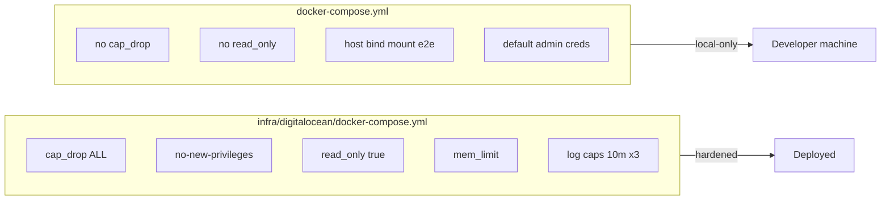

# Container Runtime Security Audit

## Audit Metadata

- Audit name: `repo-deep-dive`
- Run: `20261002-0344-develop-6286137`
- Repository: `C:\temp\mainecybertech`
- Branch: `develop`
- Commit SHA: `62861370` (short; full SHA not resolvable — `git` is not installed in the audit environment)
- Generated at: `2026-10-02 03:44`
- Auditor: automated deep-dive subagent (prompt 36)
- Area code: CTR
- Output path: `docs/audits/repo-deep-dive/20261002-0344-develop-6286137/36_container_runtime_security.md`
- Scope limitations:
  - Static review only. `docker` is **not** installed, so no image is built, run, inspected, or scanned. All runtime-behavior claims are `not reproducible`.
  - `git` is not installed, so branch/SHA were taken from the delegated task metadata, not independently verified.
  - No access to the live droplet, GHCR tags, registry manifests, or CI run logs. Digest existence/validity of pinned base images was **not** verified against a registry.
  - Prior run `20260728-0142-develop-21a10d6` was read for continuity only; every finding below was re-derived from the current tree.

## Scope

Reviewed at commit `62861370` (branch `develop`):

- `apps/api/Dockerfile`, `apps/web/Dockerfile`, `apps/worker/Dockerfile`
- `docker-compose.yml` (repo-root local stack)
- `infra/digitalocean/docker-compose.yml` (production stack)
- `.dockerignore`
- `infra/digitalocean/.env.example`, `infra/digitalocean/README.md`, `infra/digitalocean/Caddyfile`
- `infra/terraform/digitalocean/cloud-init.yml`
- `.github/workflows/build-push.yml`, `.github/workflows/deploy-do.yml`, `.github/workflows/test.yml`, `.github/workflows/sbom.yml`
- `scripts/generate-sbom.mjs`
- Entrypoint/shutdown sources: `apps/api/src/main.ts`, `apps/worker/src/main.ts`, `apps/worker/src/health-server.ts`, `apps/worker/src/shutdown.ts`

Not reviewed: container image layers themselves, registry SBOM/attestations, Kubernetes (not used), any `.env.local` values (not present / redacted), droplet runtime state, GitHub environment protection rules.

## Evidence Reviewed

| Evidence | Type | Why relevant | Notes |
|---|---|---|---|
| `apps/api/Dockerfile` | Dockerfile | API build/runtime | 2 stages, digest-pinned base, `USER appuser`, `--prod --ignore-scripts`, HEALTHCHECK, EXPOSE 4000 |
| `apps/web/Dockerfile` | Dockerfile | Web build/runtime | 3 stages, digest-pinned base, `USER nextjs`, standalone output, HEALTHCHECK, EXPOSE 3000 |
| `apps/worker/Dockerfile` | Dockerfile | Worker build/runtime | 2 stages, digest-pinned base, `USER appuser`, `--prod --ignore-scripts`, HEALTHCHECK, EXPOSE 3001 |
| `docker-compose.yml` | Compose (local) | Dev stack | No security profile; e2e mounts repo and takes default creds |
| `infra/digitalocean/docker-compose.yml` | Compose (prod) | Production stack | `x-security` anchor (`cap_drop: ALL`, `no-new-privileges`), `read_only: true`, `mem_limit`, log caps, digest-pinned third-party images |
| `.dockerignore` | Ignore file | Build context hygiene | Excludes `.env*`, `node_modules`, `docs/`, tests |
| `infra/digitalocean/Caddyfile` | Reverse proxy | Headers/TLS | HSTS, X-Frame-Options, etc. present |
| `.github/workflows/test.yml` | CI | Scanning | Trivy `scan-type: fs`, `exit-code: 1`, HIGH/CRITICAL |
| `.github/workflows/sbom.yml` + `scripts/generate-sbom.mjs` | CI | SBOM | CycloneDX from `pnpm-lock.yaml` |
| `.github/workflows/build-push.yml`, `deploy-do.yml` | CI | Image build/push/deploy | SHA-pinned actions, GHA cache, health-gated deploy with rollback |
| `apps/api/src/main.ts`, `apps/worker/src/{main,health-server,shutdown}.ts` | Source | Graceful shutdown / health | SIGTERM/SIGINT handlers, `/health` |

## Verification Performed

| Evidence | Type | Why relevant | Notes |
|---|---|---|---|
| `grep -ri "trivy\|image-ref\|scan-type: image\|cosign\|attest" .github/workflows` | static check | Image vs filesystem scanning | Only `scan-type: fs` present; **no image scan** — image-layer CVEs never gated |
| `grep -n "FROM " apps/*/Dockerfile` | static check | Base image pinning | All four `FROM` lines use `node:20-alpine@sha256:fb4cd12c…` — digest-pinned (prior-run finding `CTNR-001` **verified-fixed**) |
| `grep -n "USER \|adduser\|addgroup" apps/*/Dockerfile` | static check | Non-root runtime | api/worker `USER appuser`; web `USER nextjs` — all non-root (supported) |
| `grep -n "cap_drop\|no-new-privileges\|read_only\|mem_limit" infra/digitalocean/docker-compose.yml` | static check | Runtime hardening | `cap_drop: ALL`, `no-new-privileges`, `read_only: true`, `mem_limit` on app/obs services (prior findings `CTNR-006`/`CTNR-008` **verified-fixed**) |
| `grep -n "Strict-Transport-Security" infra/digitalocean/Caddyfile` | static check | HSTS | Present on all four server blocks (prior `CTNR-012` **verified-fixed**) |
| `grep -n "healthcheck" docker-compose.yml` | static check | Local health checks | api, web, worker all define healthchecks (prior `CTNR-007` **verified-fixed** for local) |
| `read apps/*/Dockerfile` | static check | Secrets in build | No `ARG`/`ENV`/`COPY` of secret material; only `NEXT_PUBLIC_*` (public by design) |
| `read infra/digitalocean/docker-compose.yml` | static check | Secret injection | Secrets via `${VAR:?}`, never baked into images |
| `read scripts/generate-sbom.mjs` | static check | SBOM fidelity | Parses lockfile only; not image-content SBOM |
| Attempted `docker build`/`docker inspect` | runtime check | Verify behavior | **not reproducible** — docker not installed |
| Attempted `git rev-parse HEAD` | runtime check | Bind to commit | **not reproducible** — git not installed; SHA from task metadata |

**Claim verdicts (headline claims in this area):**

| Claim | Source | Verdict |
|---|---|---|
| "All 3 Dockerfiles use digest-pinned base images" | Dockerfiles | `supported` |
| "All app containers run non-root" | Dockerfiles | `supported` |
| "Prod containers drop all capabilities and use no-new-privileges" | `infra/digitalocean/docker-compose.yml` | `supported` |
| "Prod app containers have read-only root filesystems" | same | `supported` (api/worker/web/prometheus) |
| "Images are vulnerability-scanned in CI" | `test.yml` | `partially supported` — filesystem scan only; no image scan |
| "SBOM covers deployed images" | `sbom.yml` | `partially supported` — lockfile SBOM, not image SBOM |
| "Containers restart-safe / graceful shutdown" | `main.ts`, `shutdown.ts` | `supported` (static); runtime `not reproducible` |

## Executive Summary

The container posture is **substantially hardened and materially improved** since the prior run (`20260728-0142-develop-21a10d6`). Every prior finding I could re-check is now **verified-fixed**: base images are digest-pinned, all images run non-root, prod compose drops all capabilities with `no-new-privileges`, app containers use read-only root filesystems with tmpfs, memory limits and log rotation are set, HSTS and security headers exist, and the worker gained both an `EXPOSE`/`HEALTHCHECK` and a real `/health` server. Graceful shutdown is implemented for API and worker. Build/deploy workflows pin every third-party action to a full commit SHA, build in CI with GHA cache, and deploy is health-gated with automatic rollback to the previous tag.

The remaining gaps are **not** the classic root/`latest`/secret-in-image issues; they are **image-level supply-chain and runtime-drift** gaps:

1. **No container image vulnerability scan.** Trivy runs `scan-type: fs` only. Vulnerable OS packages inside the built `node:20-alpine` images (the actual runtime artifact) are never gated — only repo files/Go/Rust binaries. This is the single most impactful remaining control gap.
2. **SBOM is lockfile-only, not image SBOM.** `generate-sbom.mjs` parses `pnpm-lock.yaml`; it does not describe the digest-pinned base image contents or the final image layers, so it cannot serve as an image-level attestation.
3. **No signed images / provenance / attestation.** No cosign, no `--provenance`, no SLSA attestation in the build workflows; consumers cannot verify the image they deploy came from this pipeline.
4. **Local dev compose has no security profile and ships default credentials + a repo-wide bind mount.** `e2e` mounts `.:/app` and defaults `E2E_ADMIN_PASSWORD=1`; acceptable for local dev but must never be reachable in a shared/CI-strength environment.
5. **Pinned digests are unmanaged drift.** Digests are hardcoded in Dockerfiles and compose with no Dependabot/Renovate rule to refresh them, so security patches to `node:20-alpine`/`redis`/`caddy`/`prometheus` will not land until someone manually edits.

Strengths: non-root + read-only + capability-dropped prod runtime, digest pinning across all images, health-gated deploy with rollback, log rotation, memory limits, secret injection via env not image layers, `.dockerignore` that excludes `.env*`, and a Trivy/dependency/secret-scan CI trio.

Recommended next actions: add a post-build **image** Trivy scan gated before push; attach an image SBOM (syft/Trivy) and (optionally) cosign signature + provenance; add a Renovate/Dependabot rule for base-image digests; and document a runtime security profile baseline for the local compose.

**Overall Domain Score: 3.9 / 5** (functional, well-hardened; missing image-level scanning, image SBOM/attestation, and digest-refresh automation).

## Inventory

| Item | Path / symbol | Purpose | Current state | Risk | Notes |
|---|---|---|---|---|---|
| API image | `apps/api/Dockerfile` | Express API | 2-stage, digest-pinned, non-root, HEALTHCHECK, EXPOSE 4000 | Low | `--prod --ignore-scripts`, chown appuser |
| Web image | `apps/web/Dockerfile` | Next.js standalone | 3-stage, digest-pinned, non-root, HEALTHCHECK, EXPOSE 3000 | Low | `NEXT_PUBLIC_*` only build args |
| Worker image | `apps/worker/Dockerfile` | BullMQ consumer | 2-stage, digest-pinned, non-root, HEALTHCHECK, EXPOSE 3001 | Low | health server on 3001 |
| Prod compose | `infra/digitalocean/docker-compose.yml` | Droplet stack | `x-security` + read_only + mem_limit + logging | Low-Med | redis `read_only:false` (needs write) |
| Local compose | `docker-compose.yml` | Dev/e2e | Builds from source; no hardening | Medium | e2e bind-mounts repo, default creds |
| Redis | `infra/.../docker-compose.yml` | Queue | digest-pinned, `--requirepass ${REDIS_PASSWORD:?}`, cap_add SETUID/SETGID | Low-Med | password still on argv |
| Caddy | `infra/.../Caddyfile` + compose | TLS proxy | digest-pinned, NET_BIND_SERVICE only, `caddy validate` healthcheck | Low | |
| Prometheus | `infra/.../docker-compose.yml` | Metrics | digest-pinned, read_only, internal only | Low | |
| Build context | `.dockerignore` | Context hygiene | Excludes `.env*`, node_modules, docs, tests | Low | `.env` patterns covered |
| Image scan | `.github/workflows/test.yml` | Vulnerability gate | Trivy `scan-type: fs` | High | no image-layer scan |
| SBOM | `.github/workflows/sbom.yml`, `scripts/generate-sbom.mjs` | Dependency SBOM | CycloneDX from lockfile | Med | not image SBOM |
| Build/push | `.github/workflows/build-push.yml`, `deploy-do.yml` | CI images | SHA-pinned actions, GHA cache | Low-Med | no signing/provenance |
| Deploy | `deploy-do.yml` deploy job | Rollout | health-gated, rollback to PREV_TAG | Low | worker health non-fatal |

## Domain Scorecard

| Category | Score | Evidence | Gap | Recommended action |
|---|---:|---|---|---|
| Dockerfiles | 4 | 3 multi-stage, non-root, digest-pinned Dockerfiles | No `--mount=type=secret`, no explicit `HEALTHCHECK` start-period parity | Add `--start-period` to api/worker healthchecks |
| Compose | 4 | `infra/digitalocean/docker-compose.yml` anchors | Local compose unhardened; redis `read_only:false` | Document local-vs-prod profile; accept redis exception explicitly |
| Build stages | 4 | api/web/worker multi-stage (`base`/`deps`/`builder`/`runner`) | web `deps` installs full deps | Consider prod-only prune for web |
| Base images/tags | 4 | All `FROM` digest-pinned | No automated digest refresh | Add Dependabot/Renovate docker ecosystem rule |
| Package installs | 4 | `--frozen-lockfile`, `--ignore-scripts`, store cleanup | corepack activation retry is cryptic | Keep; document pnpm@10 pin |
| Non-root users | 5 | `USER appuser`/`USER nextjs`; matching adduser uid 1001 | none observed | maintain |
| File permissions | 4 | `chown -R appuser /app`, web uses `--chown` | none major | maintain |
| Entrypoints | 4 | `CMD node dist/main.js`, `apps/web/server.js` | `dotenv.config(".env.local")` in prod container | Confirm `.env.local` absent in image |
| Health checks | 4 | Dockerfile + compose healthchecks; worker `/health` | api/worker healthchecks lack `start-period` | Add `--start-period` |
| Ports | 5 | EXPOSE 4000/3000/3001; prod publishes only caddy 80/443 | none | maintain |
| Build args | 4 | Only `NEXT_PUBLIC_*` public args | No secret ARGs (good) | maintain |
| Runtime env | 4 | Secrets via `${VAR:?}`, env not image | Local compose defaults in e2e | Set non-default e2e creds in CI |

## Detailed Review

### Item: API Dockerfile

- Evidence: `apps/api/Dockerfile`.
- What it does: Copies root workspace files + `apps/api` + `packages`, installs with `pnpm install --frozen-lockfile --filter=./apps/api`, builds, then a runtime stage re-copies only `dist` + `package.json` and installs `--prod --ignore-scripts`.
- How it appears to work: Two stages (`base`, final runtime); base digest `node:20-alpine@sha256:fb4cd12c…`; runtime creates `appuser` (uid 1001), `chown -R appuser`, `USER appuser`, `NODE_ENV=production`, `EXPOSE 4000`, HEALTHCHECK via `wget --spider http://localhost:4000/health`.
- Dependencies: `apps/api`, `packages/*`, `pnpm-lock.yaml`.
- Current controls: digest pin, non-root, prod-only deps, `--ignore-scripts`, HEALTHCHECK, `rm -rf` pnpm store/cache.
- Missing controls: HEALTHCHECK has no `--start-period`; no secret mount support; no image-level scan.
- Risks: app may be considered unhealthy during slow boot; runtime OS-package CVEs unmonitored.
- Recommended improvement: add `--start-period=20s`; keep as is otherwise.
- Suggested tests: CI `docker build` + `trivy image`.
- Suggested docs: note in `infra/digitalocean/README.md`.

### Item: Web Dockerfile

- Evidence: `apps/web/Dockerfile`.
- What it does: `base` (corepack) → `deps` (`pnpm install --frozen-lockfile`) → `builder` (Next build with `NEXT_PUBLIC_*` args) → `runner` (standalone `.next/standalone`, static, public, `nextjs` user).
- How it appears to work: Multi-stage with `--chown=nextjs:nodejs`; `USER nextjs`; `EXPOSE 3000`; HEALTHCHECK `wget --spider http://127.0.0.1:3000` with `start-period=40s`.
- Dependencies: `apps/web`, `packages/`, `turbo.json`.
- Current controls: digest pin, non-root, standalone output, public-only build args, telemetry disabled.
- Missing controls: `deps` installs all (incl. dev) deps then discards; acceptable but larger cache. No image scan/SBOM.
- Risks: build-arg inlining writes `NEXT_PUBLIC_*` into the image (by design, public); ensure no secret is ever passed as `NEXT_PUBLIC_*`.
- Recommended improvement: none critical; add provenance.
- Suggested tests: build + image scan + smoke request.
- Suggested docs: document that only public values may be `NEXT_PUBLIC_*`.

### Item: Worker Dockerfile

- Evidence: `apps/worker/Dockerfile`; health via `apps/worker/src/health-server.ts`.
- What it does: same two-stage pattern as API; `NODE_ENV=production`, `HEALTH_PORT=3001`, `EXPOSE 3001`, HEALTHCHECK `/health`.
- How it appears to work: `/health` returns 200 unless shutting down (`isShuttingDown()`), with queue status in the body.
- Dependencies: `apps/worker`, `packages/*`.
- Current controls: digest pin, non-root, prod-only deps, HEALTHCHECK, `EXPOSE`.
- Missing controls: HEALTHCHECK no `--start-period`; deploy treats worker health as **non-fatal**.
- Risks: worker crash-loop not gated by deploy health check.
- Recommended improvement: add `--start-period`; consider making worker health fatal after N retries in `deploy-do.yml`.
- Suggested tests: kill worker, assert compose reports unhealthy.
- Suggested docs: update deploy runbook.

### Item: Production compose (`infra/digitalocean/docker-compose.yml`)

- Evidence: file lines 1–219.
- What it does: `x-security` anchor (`cap_drop: ALL`, `no-new-privileges`), `x-logging` (10m×3), `x-app-env` (required `${VAR:?}`). `api`/`worker`/`web`/`prometheus` set `read_only: true` + `tmpfs`; all app services `mem_limit`; caddy adds only `NET_BIND_SERVICE`.
- How it appears to work: images referenced by `${IMAGE_TAG:?}` from GHCR; redis digest-pinned with `--requirepass`; observability has **no published ports**.
- Dependencies: `.env` written by `deploy-do.yml`.
- Current controls: capability drop, no-new-privileges, read-only FS, tmpfs, memory limits, log bounds, internal-only metrics, digest-pinned third-party images.
- Missing controls: `redis` uses `read_only: false` (documented need); redis password on argv; no `pids_limit`/`ulimits`; no `logging` on… (all have it).
- Risks: `--requirepass` visible via `docker inspect`/`ps` to anyone with host access; container resource exhaustion (pids) not bounded.
- Recommended improvement: move redis auth to a `redis.conf` via secret mount (reduces argv exposure); add `pids_limit`.
- Suggested tests: `docker compose config` diff; assert no published service ports except caddy.
- Suggested docs: document the redis `read_only:false` exception.

### Item: Local compose (`docker-compose.yml`)

- Evidence: file lines 1–74.
- What it does: builds api/web/worker from source with `.env.local`, exposes 4000/3000, and an `e2e` Playwright service mounting `.:/app`.
- How it appears to work: dev-only; `NODE_ENV=development` for api/worker.
- Dependencies: `apps/*/.env.local` (not present in repo).
- Current controls: healthchecks for api/web/worker; `depends_on` conditions.
- Missing controls: no `cap_drop`/`no-new-privileges`/`read_only`; `e2e` bind-mounts the whole repo; default `E2E_ADMIN_PASSWORD=1`.
- Risks: if run on a shared host or CI with real data, weak default creds + repo mount expand blast radius.
- Recommended improvement: document that this stack is local-only; require e2e creds from env (no `:-` default) in CI.
- Suggested tests: `docker compose config` on CI with unset defaults should fail closed.
- Suggested docs: `README.dev.md` caveat.

### Item: CI build/push and deploy

- Evidence: `.github/workflows/build-push.yml`, `.github/workflows/deploy-do.yml`.
- What it does: SHA-pinned checkout/login/buildx/build-push; GHA cache; web build args; deploy over SSH with secrets forwarded as env (not interpolated into script text); health gate + rollback.
- How it appears to work: `IMAGE_TAG=${github.sha}`; `validate` always runs; prod adds e2e + migrations gates.
- Dependencies: GHCR, droplet, Terraform state.
- Current controls: action SHA pinning, least-privilege `permissions`, concurrency (`cancel-in-progress:false` prod), rollback, secret-as-env.
- Missing controls: no image signing/provenance/attestation; no image scan step.
- Risks: an image pushed is trusted solely by registry access; no verifiable provenance at deploy.
- Recommended improvement: add `trivy image` gate + `cosign sign` + `--provenance`.
- Suggested tests: verify `cosign verify` in deploy.
- Suggested docs: supply-chain doc.

### Item: Scanning & SBOM

- Evidence: `.github/workflows/test.yml` (Trivy `fs`), `.github/workflows/sbom.yml`, `scripts/generate-sbom.mjs`.
- What it does: Trivy filesystem scan (HIGH/CRITICAL, `exit-code:1`) + `pnpm audit --prod`; CycloneDX SBOM from lockfile on push/PR/weekly.
- How it appears to work: gates source, not the image artifact.
- Dependencies: `pnpm-lock.yaml`.
- Current controls: dependency + secret + fs scanning.
- Missing controls: no `scan-type: image`; SBOM not derived from image; no dependency-update bot for base digests.
- Risks: base-image OS CVEs reach production unmonitored.
- Recommended improvement: post-build `trivy image --exit-code 1` before push; emit image SBOM + attach.
- Suggested tests: seed a known-vuln base in a scratch branch and assert the gate fails.
- Suggested docs: `SECURITY.md` supply-chain section.

### Item: Graceful shutdown & logging

- Evidence: `apps/api/src/main.ts:50-67`, `apps/worker/src/{main,shutdown,health-server}.ts`.
- What it does: API drains on SIGTERM/SIGINT with 10s force-exit; worker marks shutting down, health returns 503, drains in-flight.
- How it appears to work: standard Node signal handling; `unhandledRejection` logs and continues (documented rationale).
- Dependencies: process manager restart policy (`unless-stopped`).
- Current controls: signal handlers, liveness flip on drain.
- Missing controls: `deploy-do.yml` health gate ignores worker health (non-fatal).
- Risks: silent worker restart-loops.
- Recommended improvement: make worker health fatal after retries; assert `/health` returns 503 during drain.
- Suggested tests: SIGTERM test asserting 503 then exit.
- Suggested docs: runbook note.

## Scenario / Control Matrix

| ID | Scenario or control | Evidence | Current control | Gap | Severity | Recommendation |
|---|---|---|---|---|---|---|
| CTR-001 | Dockerfiles | 3 Dockerfiles | Multi-stage, non-root, digest-pinned | healthcheck `start-period` missing on api/worker | P3 | Add `--start-period` |
| CTR-002 | Compose | 2 compose files | Prod anchors hardened; local hard | Local unhardened, default e2e creds | P2 | Document local-only; fail closed |
| CTR-003 | Build stages | Dockerfiles | Multi-stage, prod-only deps | Web deps stage installs all | P3 | Optional prune |
| CTR-004 | Base images/tags | Dockerfiles/compose | Digest-pinned (no `latest`) | No digest refresh automation | P2 | Dependabot/Renovate |
| CTR-005 | Package installs | Dockerfiles | `--frozen-lockfile`, `--ignore-scripts` | none major | P3 | maintain |
| CTR-006 | Non-root users | Dockerfiles | all non-root | none | — | maintain |
| CTR-007 | File permissions | Dockerfiles | chown / `--chown` | none major | P3 | maintain |
| CTR-008 | Entrypoints | Dockerfiles/main.ts | `CMD node …`; SIGTERM | `dotenv .env.local` in prod path | P3 | confirm no `.env.local` in image |
| CTR-009 | Health checks | Dockerfiles/compose | all services | worker health non-fatal in deploy | P2 | make fatal |
| CTR-010 | Ports | Dockerfiles/compose | only caddy publishes | none | — | maintain |
| CTR-011 | Build args | web Dockerfile | public-only | none | — | maintain |
| CTR-012 | Runtime env | prod compose | `${VAR:?}` no fallback | redis pwd on argv | P2 | redis.conf secret |

## Findings

### Finding ID: CTR-P1-001 - No Container Image Vulnerability Scan in CI

- Severity: P1
- Confidence: High
- Area: Scanning / supply chain
- Evidence:
  - `.github/workflows/test.yml:117-130` — `aquasecurity/trivy-action` with `scan-type: fs`, `scan-ref: .`
  - `.github/workflows/test.yml:129-130` — comment: "trivy focuses on source/config findings and Go/Rust binaries"
  - `.github/workflows/build-push.yml:36-44` and `deploy-do.yml:192-199` — `docker/build-push-action` with no scan step
- What is happening: Vulnerability gating runs against the **repository filesystem**, not the built OCI images. The Alpine OS packages inside `node:20-alpine`, `redis:7-alpine`, `caddy:2-alpine`, `prom/prometheus` at their pinned digests are never scanned. `pnpm audit --prod` covers Node deps only.
- Why it matters: The deployed artifact is the image. OS-level CVEs in the base layers can be exploitable in the running container and are the most common runtime CVEs, yet nothing gates them.
- User / business impact: A future base-image CVE could ship to production unnoticed; incident response loses lead time.
- Security / privacy / reliability impact: Unmonitored exploitable packages in production; no measurable image CVE baseline.
- Recommended fix: Add a job after build (or use `docker/build-push-action` `load: true` + `trivy image`) with `severity: CRITICAL,HIGH`, `exit-code: 1`, before push to GHCR. Optionally add `--ignore-unfixed` to match the fs policy.
- Suggested validation: On a scratch branch, pin a base digest known to contain a HIGH CVE and confirm the pipeline fails; then re-pin to a patched digest and confirm pass.
- Owner suggestion: Platform/DevOps engineer.
- Effort estimate: S (≤0.5 day)
- Dependencies: `docker` in CI (already used by build jobs); GHCR push order.
- Status: open

### Finding ID: CTR-P1-002 - SBOM Is Lockfile-Only, Not an Image SBOM or Attestation

- Severity: P1
- Confidence: High
- Area: SBOM / provenance
- Evidence:
  - `scripts/generate-sbom.mjs:1-16` — "Generate a CycloneDX 1.5 SBOM from pnpm-lock.yaml"; `LOCKFILE = pnpm-lock.yaml`
  - `.github/workflows/sbom.yml:26-33` — generates and uploads `sbom.cdx.json` artifact
  - `build-push.yml` / `deploy-do.yml` — no `sbom:`/`provenance:`/`attest` on `build-push-action`
- What is happening: The SBOM describes Node dependencies parsed from the lockfile. It does not enumerate the digest-pinned base image contents or the final image layers, and it is not attached to (or bound to) the pushed image digest.
- Why it matters: An SBOM that cannot be matched to the deployed image digest is not usable for incident response or for verifying what actually shipped.
- User / business impact: Cannot answer "was package X in the image we deployed?" from an authoritative artifact.
- Security / privacy / reliability impact: Weakened supply-chain traceability and compliance posture.
- Recommended fix: Generate an image SBOM with syft/Trivy (`trivy image --format cyclonedx` or `syft`) keyed to the pushed digest, attach as an attestation (`actions/attest-sbom`) or push to the registry alongside the image; keep the lockfile SBOM as a secondary artifact.
- Suggested validation: Deploy an image and confirm `cosign verify-attestation` / registry SBOM references the exact `@sha256:` digest deployed.
- Owner suggestion: Platform/DevOps engineer.
- Effort estimate: M (1-3 days)
- Dependencies: CTR-P1-001 (image tooling in CI); registry attestation support.
- Status: open

### Finding ID: CTR-P1-003 - Unsigned Images With No Provenance/Attestation

- Severity: P1
- Confidence: High
- Area: Supply chain / image provenance
- Evidence:
  - `.github/workflows/build-push.yml:36-44`, `deploy-do.yml:192-250` — push to GHCR with no `provenance:`, `sbom:`, or cosign step
  - `deploy-do.yml:394-486` — deploy trusts the pulled image by tag with no signature verification
- What is happening: Images are identified only by mutable-by-convention tags (`${github.sha}`, rollback SHA). Nothing cryptographically binds the deployed image to this pipeline, and there is no signature check at deploy.
- Why it matters: If registry credentials or a token are compromised, an attacker can push an image under a known-good tag and the deploy path will accept it.
- User / business impact: Elevated risk of a supply-chain substitution reaching production.
- Security / privacy / reliability impact: No verifiable chain of custody from source commit to running container.
- Recommended fix: Enable buildx `provenance: true` (or SLSA generator), sign with `cosign sign` keyless (OIDC), and add a `cosign verify` gate in the deploy job before `docker compose up`.
- Suggested validation: In CI, tamper an image and assert `cosign verify` fails and deploy aborts.
- Owner suggestion: Platform/DevOps engineer.
- Effort estimate: M (1-3 days)
- Dependencies: CTR-P1-002; registry/CI OIDC permissions (`id-token: write` already present at `deploy-do.yml:29`).
- Status: open

### Finding ID: CTR-P2-001 - Pinned Base-Image Digests Have No Automated Refresh

- Severity: P2
- Confidence: High
- Area: Base images / dependency lifecycle
- Evidence:
  - `apps/api/Dockerfile:1,26`, `apps/web/Dockerfile:1,37`, `apps/worker/Dockerfile:1,25` — `node:20-alpine@sha256:fb4cd12c85ee03686f6af5362a0b0d56d50c58a04632e6c0fb8363f609372293`
  - `infra/digitalocean/docker-compose.yml:28,165,188` — digest-pinned redis/prometheus/caddy
  - No `.github/dependabot.yml` and no Renovate config found in tree
- What is happening: Digests are hardcoded. This is excellent for reproducibility but there is no bot to propose updated digests when `node:20-alpine` or the third-party images receive security patches.
- Why it matters: Pinned images silently age; a patched base will not reach production until a human edits four files, which rarely happens on schedule.
- User / business impact: Longer exposure windows to known base-image CVEs.
- Security / privacy / reliability impact: Patch latency grows; SBOM/digest drift from upstream.
- Recommended fix: Add `.github/dependabot.yml` with `package-ecosystem: docker` (and `docker-compose`) plus a GitHub Actions ecosystem entry, or a Renovate config covering Dockerfiles and compose.
- Suggested validation: Confirm Dependabot opens a digest-bump PR within one cycle; assert CI (with CTR-P1-001) passes on the bump.
- Owner suggestion: Platform/DevOps engineer.
- Effort estimate: S
- Dependencies: CTR-P1-001 (so bumps are validated against real CVEs).
- Status: open

### Finding ID: CTR-P2-002 - Local Compose Ships Default Credentials and Repo-Wide Bind Mount

- Severity: P2
- Confidence: High
- Area: Compose / dev ergonomics
- Evidence:
  - `docker-compose.yml:56-74` — `e2e` service `volumes: - .:/app`, `E2E_ADMIN_EMAIL=${E2E_ADMIN_EMAIL:-superadmin.real@mainecybertech.local}`, `E2E_ADMIN_PASSWORD=${E2E_ADMIN_PASSWORD:-1}`
  - `docker-compose.yml` — no `cap_drop`/`no-new-privileges`/`read_only` on any service
- What is happening: The local stack uses weak default admin credentials and mounts the entire repository into the Playwright container. The prod stack (`infra/digitalocean`) does not; the two are not visually emitted as different risk classes.
- Why it matters: If this compose file is ever run against a non-local environment or in shared CI, default creds and the host repo mount expand blast radius and can leak the working tree into a container.
- User / business impact: Potential unauthorized access in a mis-targeted run; accidental exposure of local files/secrets.
- Security / privacy / reliability impact: Weak-auth + host-mount combination.
- Recommended fix: Remove the credential defaults (require env, fail closed), and document clearly (compose comment + `README.dev.md`) that `docker-compose.yml` is local-only. Consider read-only-bind (`:ro`) or narrower mounts for e2e.
- Suggested validation: `docker compose config` with `E2E_ADMIN_PASSWORD` unset should error rather than default to `1`.
- Owner suggestion: Dev-experience owner.
- Effort estimate: S
- Dependencies: none.
- Status: open

### Finding ID: CTR-P2-003 - Redis Password Exposed on Process Argument Vector

- Severity: P2
- Confidence: Medium
- Area: Runtime secrets / compose
- Evidence:
  - `infra/digitalocean/docker-compose.yml:36` — `command: redis-server --requirepass ${REDIS_PASSWORD:?REDIS_PASSWORD must be set}`
  - `infra/digitalocean/docker-compose.yml:44` — healthcheck also passes `-a ${REDIS_PASSWORD:?…}`
- What is happening: The Redis password is passed on the command line, so it appears in `docker inspect`, `docker ps --no-trunc`, and host process listings for anyone with host access.
- Why it matters: Defense-in-depth failure — anyone with shell/inspect access on the droplet learns the queue password, enabling direct data manipulation.
- User / business impact: Queue tampering / data exfiltration if host is accessed.
- Security / privacy / reliability impact: Secret exposed at rest in container metadata.
- Recommended fix: Supply the password via a mounted `redis.conf` (`requirepass` line) from a file the deploy writes with `chmod 600`, and use `redis-cli` healthcheck without `-a` on argv (or `REDISCLI_AUTH` env).
- Suggested validation: `docker inspect` output should not contain the password string; healthcheck still returns PONG.
- Owner suggestion: Platform engineer.
- Effort estimate: S
- Dependencies: deploy `.env` write path in `deploy-do.yml:355-390`.
- Status: open
- Note: Prior run flagged a hardcoded fallback (`mct-redis-dev`); that is **verified-fixed** — the `${VAR:?}` now has no fallback. The residual issue is argv exposure only.

### Finding ID: CTR-P2-004 - Deploy Health Gate Ignores Worker Health

- Severity: P2
- Confidence: High
- Area: Health checks / deploy reliability
- Evidence:
  - `deploy-do.yml:454-466` — `container_health` gate checks only `api` and `web`; `healthy` set on those two
  - `deploy-do.yml:515-522` — worker check explicitly "non-fatal — worker is restart-loop tolerant"
  - `apps/worker/src/health-server.ts:10-31` — worker exposes a real `/health`
- What is happening: A deploy succeeds even if the worker never becomes healthy; worker health is treated as informational.
- Why it matters: Background processing (notifications, webhooks, scans) can be silently dead after a deploy while the release is reported green.
- User / business impact: Silent background-job outage; delayed/failed customer notifications.
- Security / privacy / reliability impact: False-success deploys; delayed detection of a broken consumer.
- Recommended fix: Include `worker` in the health gate (allow a longer timeout), or fail the deploy after N consecutive worker-health failures. Keep the rollback path.
- Suggested validation: Break the worker start command in a scratch branch and assert the deploy fails/rolls back.
- Owner suggestion: Platform/DevOps engineer.
- Effort estimate: S
- Dependencies: none.
- Status: open

### Finding ID: CTR-P2-005 - No Container Resource/PID Limits Beyond Memory

- Severity: P2
- Confidence: Medium
- Area: Runtime hardening
- Evidence:
  - `infra/digitalocean/docker-compose.yml:42,97,139,157,183,213` — `mem_limit` set per service
  - No `pids_limit`, `cpus`, or `ulimits` keys in `infra/digitalocean/docker-compose.yml` or `docker-compose.yml`
- What is happening: Memory is bounded, but PID count and CPU are not. A fork-bomb or runaway child-process loop inside api/worker can exhaust the host PID table or CPU.
- Why it matters: Single-droplet topology means one noisy container can degrade or take down all services.
- User / business impact: Host-wide outage from a single container.
- Security / privacy / reliability impact: DoS blast radius beyond the container.
- Recommended fix: Add `pids_limit` (e.g. 256) and `cpus` to each service; consider `ulimits: nofile`.
- Suggested validation: `docker compose config` shows the limits; a fork stress test in a scratch env is contained.
- Owner suggestion: Platform engineer.
- Effort estimate: S
- Dependencies: none.
- Status: open

### Finding ID: CTR-P3-001 - Missing `--start-period` on API and Worker Healthchecks

- Severity: P3
- Confidence: High
- Area: Health checks / Dockerfiles
- Evidence:
  - `apps/api/Dockerfile:47-48` — `HEALTHCHECK --interval=30s --timeout=5s --retries=3` (no `--start-period`)
  - `apps/worker/Dockerfile:46-47` — same, no `--start-period`
  - `apps/web/Dockerfile:57` — has `--start-period=40s` (inconsistent)
- What is happening: API and worker healthchecks count retries during boot; web already sets a start period.
- Why it matters: Slow cold starts can mark containers unhealthy early, causing restarts or a failed health gate.
- User / business impact: Occasional false-unhealthy at deploy on a loaded droplet.
- Security / privacy / reliability impact: Flaky deploys.
- Recommended fix: Add `--start-period=20s` (api) and `--start-period=15s` (worker) to match the web convention.
- Suggested validation: On a cold start, assert container reaches `healthy` on first evaluation.
- Owner suggestion: Any maintainer.
- Effort estimate: S
- Dependencies: none.
- Status: open

### Finding ID: CTR-P3-002 - Broad `.dockerignore` `*.md`/`*.txt`/`*.log` Could Mask Needed Build Files

- Severity: P3
- Confidence: Low
- Area: Build context / `.dockerignore`
- Evidence:
  - `.dockerignore:50-53` — `*.md`, `*.txt`, `*.log`, `pnpm-debug.log*`
  - `.dockerignore:19-22` — `.env`, `.env.local`, `.env.*.local` (good)
- What is happening: Globally excluding `*.md`/`*.txt` is broad; it is currently harmless because builds copy explicit paths, but if a future build step needs a `.txt`/config file it will fail confusingly.
- Why it matters: Low-severity maintainability/foot-gun; the security-relevant part (`.env*`) is correctly excluded.
- User / business impact: Minimal.
- Security / privacy / reliability impact: Minimal.
- Recommended fix: Scope the excludes (e.g. `docs/**`, `**/*.md`) and add a comment; keep `.env*` exclusions.
- Suggested validation: `docker build` succeeds with a scratch file added.
- Owner suggestion: Any maintainer.
- Effort estimate: S
- Dependencies: none.
- Status: open

## Risks

| Risk | Severity | Likelihood | Impact | Evidence | Mitigation |
|---|---|---|---|---|---|
| Base-image OS CVE ships unnoticed | P1 | Medium | High | `test.yml:117-130` (fs-only scan) | CTR-P1-001 |
| Image substitution via compromised registry creds | P1 | Low | High | `build-push.yml`/`deploy-do.yml` (no signing) | CTR-P1-003 |
| Untraceable deployed artifact | P1 | Medium | Medium | `generate-sbom.mjs` (lockfile-only) | CTR-P1-002 |
| Base images age without patch | P2 | High | Medium | hardcoded digests, no bot | CTR-P2-001 |
| Local compose used in non-local context | P2 | Low | Medium | `docker-compose.yml:56-74` | CTR-P2-002 |
| Queue password disclosed via inspect/ps | P2 | Medium | Medium | `infra/.../docker-compose.yml:36,44` | CTR-P2-003 |
| Silent worker outage reported green | P2 | Medium | High | `deploy-do.yml:515-522` | CTR-P2-004 |
| Fork-bomb/CPU exhaustion on droplet | P2 | Low | High | no `pids_limit`/`cpus` | CTR-P2-005 |

## Recommendations

### Immediate / Release Blocking

- None identified as release-blocking. All prior P0/P1 container issues are verified-fixed; the new P1s are supply-chain hardening, not active exploits.

### This Week

- CTR-P1-001: add post-build `trivy image` gate before GHCR push.
- CTR-P2-004: include worker health in the deploy gate.
- CTR-P2-002: remove default e2e credentials; add local-only warning.

### This Month

- CTR-P1-002: image SBOM (syft/Trivy) keyed to pushed digest; attach to registry.
- CTR-P1-003: `provenance: true` + keyless cosign sign + `cosign verify` deploy gate.
- CTR-P2-001: Dependabot/Renovate for docker + docker-compose + actions.
- CTR-P2-003: redis password via `redis.conf` secret mount.
- CTR-P2-005: `pids_limit`/`cpus` on all services.

### Later / Platform Evolution

- Runtime security-profile baseline document (seccomp/AppArmor) for compose services.
- Nightly image scan + alerting on newly published CVEs for the currently deployed digest.
- Evaluate multi-droplet / orchestration if single-host blast radius remains a concern.

## Quick Wins

| Quick win | Why it helps | Files likely involved | Validation |
|---|---|---|---|
| Add `--start-period` to api/worker healthchecks | fewer false-unhealthy at cold start | `apps/api/Dockerfile`, `apps/worker/Dockerfile` | cold-start test |
| Make worker health fatal in deploy | catch silent worker outages | `.github/workflows/deploy-do.yml` | break worker → deploy fails |
| Remove e2e default creds | fail-closed local stack | `docker-compose.yml` | `docker compose config` errors when unset |
| Add `pids_limit` | bound fork bombs | `infra/digitalocean/docker-compose.yml` | `docker compose config` |
| Add Dependabot docker ecosystem | surface base-image updates | `.github/dependabot.yml` | PR appears |

## Hardening Backlog

| Backlog item | Priority | Owner suggestion | Effort | Dependency |
|---|---|---|---|---|
| Image Trivy scan gate pre-push | P1 | Platform | S | — |
| Image SBOM + attestation | P1 | Platform | M | image scan |
| cosign sign + verify | P1 | Platform | M | image SBOM |
| Digest-refresh bot | P2 | Platform | S | image scan |
| Worker health in deploy gate | P2 | Platform | S | — |
| Redis secret via config mount | P2 | Platform | S | — |
| pids/cpu limits | P2 | Platform | S | — |
| Local compose hardening docs | P2 | DX | S | — |
| Runtime security profile (seccomp) | P3 | Platform | M | — |
| Nightly deployed-digest scan | P3 | Platform | M | image scan |

## Suggested Tests

- **CI/security:** Post-build `trivy image --severity CRITICAL,HIGH --exit-code 1` on api/web/worker; add a negative test branch with a known-vuln digest.
- **CI/supply chain:** `cosign verify` (and `verify-attestation`) step in `deploy-do.yml` before `docker compose up`; fail closed.
- **Integration:** `docker compose config` assertions — no service other than caddy publishes ports; every app service has `read_only: true`, `cap_drop: [ALL]`, `no-new-privileges`; `pids_limit` present.
- **Integration:** Assert `docker inspect` on redis does not contain the password value (post CTR-P2-003).
- **E2E/regression:** Cold-start test asserting api/worker reach `healthy` within one `start-period`.
- **Regression:** SIGTERM test asserting worker `/health` returns 503 while draining, then process exits.
- **Deploy gate:** Scratch branch with worker start command removed → deploy must fail and roll back.
- **Manual validation:** After adding signing, confirm the digest deployed equals the signed digest.

## Suggested Documentation Updates

- `infra/digitalocean/README.md` — add a "Runtime security profile" section (capability drop, read-only, limits) and the redis `read_only:false` exception.
- `README.dev.md` — state explicitly that the repo-root `docker-compose.yml` is local-only and unhardened by design; document e2e credential requirements.
- `SECURITY.md` — add a supply-chain section: image scanning, SBOM, signatures, base-image refresh cadence.
- `CONTRIBUTING.md` — note the digest-pin convention and how to bump base-image digests.
- New: `docs/CONTAINER_SECURITY.md` — canonical baseline (scan/sign/SBOM/limits) referenced by CI and reviewers.

## Open Questions

| Question | Why it matters | Evidence needed |
|---|---|---|
| Are the pinned digests still the latest patched `node:20-alpine`? | determines current CVE exposure | registry digest comparison (needs docker/registry access) |
| Does GHCR retain image SBOM/attestations today? | whether CTR-P1-002 partially exists outside repo | GHCR package metadata (needs access) |
| Is `apps/*/.env.local` ever present inside images? | `.dockerignore` excludes it, but confirm | image inspection (needs docker) |
| Are GitHub environment protection rules required for prod deploy? | deploy security posture | repo settings (not in tree) |
| Is the droplet running exactly the declared compose? | runtime drift (extended check) | `docker inspect` on host (out of scope/unauthorized) |
| What is `CF_ORIGIN_*` cert rotation cadence? | TLS reliability | ops docs (not in tree) |

## Appendix

### A. Base image pins at this commit

| File | Line | Image |
|---|---|---|
| `apps/api/Dockerfile` | 1, 26 | `node:20-alpine@sha256:fb4cd12c…` |
| `apps/web/Dockerfile` | 1, 37 | `node:20-alpine@sha256:fb4cd12c…` |
| `apps/worker/Dockerfile` | 1, 25 | `node:20-alpine@sha256:fb4cd12c…` |
| `infra/digitalocean/docker-compose.yml` | 28 | `redis:7-alpine@sha256:e7723ff7…` |
| `infra/digitalocean/docker-compose.yml` | 165 | `prom/prometheus:v3.5.1@sha256:4b05278a…` |
| `infra/digitalocean/docker-compose.yml` | 188 | `caddy:2-alpine@sha256:5f5c8640…` |

No `latest` tag used; no unpinned `FROM`.

### B. Prior-run continuity

| Prior finding (20260728-0142-develop-21a10d6) | Current status | Evidence |
|---|---|---|
| CTNR-001 No SHA-pinned base images | verified-fixed | all `FROM` digest-pinned |
| CTNR-006 No security hardening on containers | verified-fixed (prod) | `infra/...:3-7` `x-security` |
| CTNR-007 Missing compose healthchecks (worker/web/caddy) | verified-fixed | `docker-compose.yml:32,50`; `infra/...:101,204` |
| CTNR-008 Redis password hardcoded fallback | verified-fixed | `infra/...:36` `${REDIS_PASSWORD:?}` |
| CTNR-012 Missing HSTS header | verified-fixed | `Caddyfile:14,37,52,75` |
| Quick win "EXPOSE 3001 in worker" | verified-fixed | `apps/worker/Dockerfile:44` |

New findings this run are supply-chain/runtime-drift (CTR-P1-001…003) plus P2/P3 reinforcement gaps.

### C. Compose security comparison



### D. Verification commands run (static)

```
glob **/Dockerfile*        -> 3 Dockerfiles
glob **/docker-compose*.yml -> 2 compose files
glob **/.dockerignore      -> none (only repo-root .dockerignore)
grep trivy|scan-type: image .github/workflows -> fs scan only, no image scan
grep FROM apps/*/Dockerfile -> all digest-pinned
grep cap_drop|read_only|mem_limit infra/.../docker-compose.yml -> present on app services
grep Strict-Transport-Security infra/digitalocean/Caddyfile -> present x4
docker build / docker inspect -> not reproducible (docker not installed)
git rev-parse HEAD -> not reproducible (git not installed)
```

### E. Severity summary

| Severity | Count |
|---|---:|
| P0 | 0 |
| P1 | 3 |
| P2 | 5 |
| P3 | 2 |
| **Total** | **10** |
