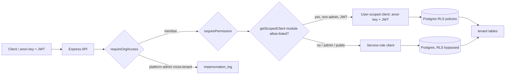

# Supabase RLS Policy Deep-Dive Audit

## Audit Metadata

- Audit name: repo-deep-dive
- Run: `20261002-0344-develop-6286137`
- Repository: `C:\temp\mainecybertech`
- Branch: develop
- Commit SHA: `6286137017c4b7c77e83ee420ec11382d984f263` (`6286137`)
- Generated at: 2026-10-02
- Auditor: principal-level repository auditor (fresh pass at current commit)
- Area code: RLS
- Output path: `docs/audits/repo-deep-dive/20261002-0344-develop-6286137/37_supabase_rls_policy_deep_dive.md`
- Scope limitations:
  - Static analysis of `supabase/migrations/*.sql` (127 files) + application code + CI scripts. No connection to any hosted/production Postgres, so no live `pg_policies`/`pg_proc` query. Policy inventory is derived from migration text.
  - `RLS_READS_ENABLED` / `RLS_WRITES_ENABLED` module lists live in GitHub **secrets** (`RLS-rollout.md`, ADR-008); their exact values are not in the repo, so which modules are currently RLS-enforced is recorded as `Unknown` where it depends on secret contents.
  - The task brief said "141 migration files"; the audited tree has **127** `.sql` files under `supabase/migrations/`. A repo-wide `*.sql` count is 141 (127 migrations + 9 seeds + 5 under `prompts/mct-full-webstore-product-catalog-pack/repo_patch/supabase/migrations/`). This report covers the 127 applied migrations.
  - `node` is not installed in the audit environment, so `scripts/verify-rls.mjs` and `scripts/check-docs-counts.mjs` were **re-implemented** from their source (deterministic) rather than executed; outcomes are labelled accordingly.

## Scope

Reviewed:

- All 127 migrations in `supabase/migrations/` (versions 5302026–5302428) for RLS enablement, policy definitions, `WITH CHECK` clauses, grants, sequences, default privileges, storage policies, functions/triggers, and `SECURITY DEFINER` attributes.
- The 5302129 "RLS / security audit fixes" migration (the forward-fix for the prior 2026-08-06 RLS audit) and everything after it (5302130–5302428).
- Application-level Supabase usage: `apps/api/src/services/supabase.ts` (admin vs user-scoped clients, `getScopedClient`), `apps/api/src/middleware/{auth,admin,org-access,permissions}.ts`, `apps/api/src/lib/roles.ts`, RPC call sites in `apps/api/src/routes/{projects,documents,tickets,edu-automation,analytics}.ts`.
- Worker service-role usage: `apps/worker/src/{env.ts,services/supabase.ts,tasks/*}`.
- Web app: confirmed it does not embed a Supabase client or service-role key.
- Docs and CI: `docs/RLS-coverage-matrix.md`, `docs/RLS-rollout.md`, `docs/adr/README.md` (ADR-008), `docs/MT-P0-001-RLS-remediation-design.md`, `scripts/verify-rls.mjs`, `scripts/check-docs-counts.mjs`, `.github/workflows/{test,validate,supabase-migrations,deploy-do}.yml`, `AGENTS.md`.
- Generated types: `packages/sdk/src/database.types.ts`.

Not reviewed (recorded as absent or out of scope):

- No SQL-level RLS test harness in `supabase/` (no `supabase/tests/`; no `pgTAP` specs). RLS is exercised only indirectly through the API E2E path.
- `supabase/policies/` and `supabase/functions/` contain only `.gitkeep` (no edge functions, no policy fragments).
- Live hosted DB state (whether migrations 5302129+ are actually applied in prod) — `Unknown`; `supabase-migrations.yml` applies on push to develop when `supabase/**` changes, and `deploy-do.yml` gates prod migrations.

## Evidence Reviewed

| Evidence | Type | Why relevant | Notes |
|---|---|---|---|
| `supabase/migrations/5302026_..._v3.sql` | SQL bootstrap | Core tables, RLS enables, helper functions, storage policies | 8 helper functions; documents bucket + aligned storage policies; role/permission lookup policies |
| `supabase/migrations/5302038_disable_rls_public_interactions.sql` | SQL | Historical P0 | `DISABLE ROW LEVEL SECURITY` — **still the only disable statement in the repo** |
| `supabase/migrations/5302098_article_feedback_fields.sql` | SQL | Historical P1 | `increment_article_count` originally PUBLIC + unpinned |
| `supabase/migrations/5302110_restore_document_permissions.sql` | SQL | Forward-fix | `can_read_document` + document_permissions restore |
| `supabase/migrations/5302112_fix_rls_approved_membership.sql` | SQL | Helper hardening | Pins `is_org_member` search_path; rewrites 24 tables; drops 44 orphans |
| `supabase/migrations/5302116_grant_table_privileges.sql` | SQL | Grant sweep | Grants `select,insert,update,delete` to **anon + authenticated on every table**; default privileges |
| `supabase/migrations/5302129_supabase_rls_audit_fixes.sql` | SQL | Prior-audit forward-fix | 1947 lines, 125 policies: public_interactions re-enable, RPC lockdown, catalog vocab, MSP role gates |
| `supabase/migrations/5302130_project_task_rpc_user_id.sql` | SQL | SECURITY DEFINER RPCs | `approve_project_task` / `add_project_task_comment` take caller-supplied `p_user_id` |
| `supabase/migrations/5302133_impersonation_log.sql` | SQL | Audit sink | RLS on; service_role-only policy |
| `supabase/migrations/5302134_store_catalog_tables.sql` | SQL | Store catalog | DB-backed products/categories; public read, service write |
| `supabase/migrations/5302402–5302407` | SQL | GAP tables | Re-introduced raw membership predicates without `status='approved'` |
| `supabase/migrations/5302412/5302418_rls_approved_status_gap*.sql` | SQL | Gap fixes | Rewrite GAP tables to `is_org_member`; fix entitlements + phishing targets |
| `supabase/migrations/5302414/5302417` | SQL | New tables | `client_portal_entitlements`, `phishing_targets` raw predicates (later fixed) |
| `supabase/migrations/5302408/5302422/5302423` | SQL | Store scoping | Tenant-scoped store catalog + campaigns + portal read scopes |
| `supabase/migrations/5302420/5302428` | SQL | Entitlements RLS | Org-admin then platform-admin-only write gates |
| `supabase/migrations/5302424/5302426` | SQL | Permission catalog | Add `manage`/`status` action keys + grants |
| `supabase/migrations/5302427_mfa_recovery_codes.sql` | SQL | Deny-all table | RLS on, no policy, `-- rls: deny-all` marker |
| `apps/api/src/services/supabase.ts` | TS | Client selection | `getSupabaseAdmin` (service role), `getSupabaseUser` (anon+JWT), `getScopedClient` allow-list switch |
| `apps/api/src/middleware/org-access.ts` | TS | Tenant isolation | `requireOrgAccess`, platform-admin/impersonation detection + logging, `assertBodyOrgMatches` |
| `apps/api/src/middleware/permissions.ts` | TS | Authz | `requirePermission`; admin-bypass keys only admin/super_admin |
| `apps/api/src/lib/roles.ts` | TS | Role constants | 8 `PLATFORM_ADMIN_KEYS` |
| `apps/api/src/routes/{projects,documents,tickets,edu-automation}.ts` | TS | RPC call sites | Pass `req.authUser.userId` as `p_user_id` |
| `apps/worker/src/env.ts` + `tasks/*` | TS | Service-role usage | Requires service key; several tasks use `SERVICE_ROLE ?? ANON ?? ""` |
| `docs/RLS-coverage-matrix.md` | Doc | Coverage snapshot | 140 tables, 139 RLS, 4 service-role-only, 6 open-policy tables (stale snapshot) |
| `docs/RLS-rollout.md` | Doc | Rollout runbook | Allow-list semantics, preconditions, validation checklist |
| `docs/adr/README.md` (ADR-008) | Doc | Decision record | RLS rollout decision; ~44 read / ~17 write modules enabled |
| `scripts/verify-rls.mjs` | CI script | RLS gate | 3 rules; wired into `test.yml` + `validate.yml` |
| `scripts/check-docs-counts.mjs` | CI script | Docs guard | Guards the "N policies" claim against `collectRlsStats()` |
| `.github/workflows/{test,validate,supabase-migrations,deploy-do}.yml` | CI | Enforcement | Runs RLS+migration hygiene; injects `RLS_*_ENABLED` secrets |
| `packages/sdk/src/database.types.ts` | Generated | Type drift | Includes recent tables |

## Verification Performed

| Evidence | Type | Why relevant | Notes |
|---|---|---|---|
| `git rev-parse HEAD` / branch | Command | Bind evidence to commit | `6286137017c4b7c77e83ee420ec11382d984f263`, branch `develop`, 2026-10-01 23:25:45 -0400 |
| Re-implemented `verify-rls.mjs` rule 1+2 over 127 migrations | Reproduction (PowerShell) | Headline RLS coverage claim | **Supported**: 134 live tables, 134 RLS-enabled, 0 live tables without RLS |
| Re-implemented `verify-rls.mjs` rule 3 (5302427+ policy/drop pairing) | Reproduction | "New migrations must pair create/drop policy" | **Supported**: 0 unpaired policies |
| Policy count reproduction | Reproduction | AGENTS.md "1011 policies" claim (CI-guarded) | **Supported**: 1011 `create policy` statements counted |
| `grep -c 'disable row level security'` | Command | P0 recurrence check | 1 occurrence, historical (`5302038`); re-enabled by `5302129` |
| `grep 'security definer'` | Command | Definer inventory | 31 matches; all current RPC helpers pin `search_path = public` |
| `grep 'organization_id in (select organization_id from memberships where user_id = auth.uid())'` | Command | Approved-status gap | Many historical hits; fixes in 5302100/5302112/5302412/5302418; **no post-5302418 table uses this raw predicate** |
| `grep "r.key in ("` in migrations ≥5302129 | Command | MSP role-gate consistency | **Regression found**: 5302402/5302405/5302406/5302412 admin-delete gates use only `admin/super_admin` (RLS-P2-001) |
| Inspect `webhook_dead_letters` policies | Review | Known open issue | Confirmed: SELECT/INSERT/UPDATE policies; **no DELETE policy** (RLS-P2-002) |
| Inspect `packages/sdk/src/database.types.ts` for recent tables | Command | Type drift | **Supported**: `store_campaigns`, `mfa_recovery_codes`, `business_os_snapshots`, `knowledge_base_articles`, `phishing_targets`, `client_portal_entitlements`, `compliance_frameworks` all present |
| `grep 'get_analytics_summary'` across migrations/seeds/scripts | Command | Function review | **Not found** — app calls `supabase.rpc("get_analytics_summary")` (`routes/analytics.ts:84`) but no definition in the repo (see Open Questions) |
| Inspect `apps/web` for Supabase client / service-role key | Command | Client/server separation | **Supported**: no `createClient`/`service_role` in `apps/web` |

### Claim verification summary

| Claim (source) | Outcome | Evidence |
|---|---|---|
| "all RLS-enabled" (AGENTS.md; `verify-rls.mjs` rule 1) | supported | 134/134 live tables enable RLS; 1 disable is historical |
| "1011 policies" (AGENTS.md; CI-guarded by `check-docs-counts.mjs`) | supported | 1011 matched |
| "136 tables" (AGENTS.md) | partially supported | My re-implementation counts 134 live tables; difference is parser accounting (drops/unqualified names), not a security gap |
| Docs matrix "140 tables, 139 RLS, 0 policy-less" (`RLS-coverage-matrix.md`) | partially supported / stale | Self-declared snapshot ("predate migrations after ~5302201"); live source is `verify-rls.mjs` |
| Prior RLS-P0-001 (public_interactions RLS off + anon DML) | verified-fixed | `5302129:41-79` re-enables RLS, revokes anon/authenticated SELECT/UPDATE/DELETE, grants INSERT-only |
| Prior RLS-P1-001 (increment_article_count) | verified-fixed | `5302129:88-127` revokes PUBLIC/anon, grants authenticated/service_role, pins search_path, allowlists `field_name`, adds approved-org check |
| Prior RLS-P2-001 (mark_task_read identity) | verified-fixed | `5302129:325-371` revokes PUBLIC/anon, adds caller-identity + task/org + membership checks |
| Prior RLS-P2-002 (bulk_update_with_version column allowlist) | verified-fixed | `5302129:140-315` adds per-table allowlist (tickets: status/priority; documents: folder_path/description/visibility) |
| Prior RLS-P2-003 (policy↔catalog vocab) | verified-fixed | `5302129:386-653` rewrites tickets/projects/documents policies to catalog keys; adds `retention`/`training-modules` |
| Prior RLS-P2-004 (5302128 roles absent from RLS gates) | partially-fixed / regressed | 5302129 patched 89 live gates, but 5302402/5302405/5302406/5302412 re-introduced `admin/super_admin`-only gates |
| Prior RLS-P3-002 (anon DML sweep) | still-open | `5302116` still grants anon DML on all tables except the `public_interactions` carve-out in 5302129 |
| Prior RLS-P3-003 (no RLS-matrix CI test) | partially-fixed | `scripts/verify-rls.mjs` (static) is wired into CI; no behavioral RLS allow/deny matrix test exists |

## Executive Summary

RLS is in materially better shape than at the last RLS audit (2026-08-06, commit `75d3926`): every prior finding from that report is either fixed or substantially mitigated, with migration `5302129_supabase_rls_audit_fixes.sql` acting as a direct forward-fix and citing the prior report by path. The previously critical **RLS-P0-001** (`public_interactions` RLS disabled + `anon` full DML on a PII lead table) is closed: RLS is re-enabled, `anon`/`authenticated` have INSERT-only, and SELECT/UPDATE/DELETE are revoked. The two weakly-guarded definer RPCs (`increment_article_count`, `mark_task_read`) and the unbounded `bulk_update_with_version` write-set are all hardened in the same migration. A static RLS/migration hygiene gate (`scripts/verify-rls.mjs`) now runs in `test.yml` and `validate.yml`, a docs-count guard keeps the policy count honest, and `docs/RLS-coverage-matrix.md` / `docs/RLS-rollout.md` / ADR-008 document the model.

The single biggest **posture change** since the last audit is that RLS is no longer merely defense-in-depth. ADR-008 and `docs/RLS-rollout.md` confirm `getScopedClient(req, moduleKey, kind)` switches the API to a user-scoped (RLS-enforced) client for modules listed in the `RLS_READS_ENABLED`/`RLS_WRITES_ENABLED` GitHub secrets, currently "~44 read and ~17 write modules." That means RLS policy gaps now translate into **real user-facing 0-row/403 outcomes for regular members**, and correctness of the approved-aware policies matters far more than it did in August.

Two classes of issues remain, both in that context:

1. **The MSP platform-role gate regression (RLS-P2-001).** `5302129` deliberately appended six platform-admin role keys to 89 admin-gate policies, but four later migrations (`5302402`, `5302405`, `5302406`, `5302412`) re-introduced admin-delete policies gated only on `('admin','super_admin')`. A dispatcher/engineer/security-analyst acting as a platform admin will be denied at the RLS layer where the API would allow it. There is no drift lint tying RLS role-key lists to `PLATFORM_ADMIN_KEYS`.

2. **The `webhook_dead_letters` missing DELETE policy (RLS-P2-002).** The table has RLS with SELECT/INSERT/UPDATE policies but no DELETE policy, yet `routes/webhook-management.ts` issues `.delete()` through `getScopedClient(req, "webhook-management", "write")`. This is already documented as an open issue in `AGENTS.md`, and it will silently 0-row/deny dead-letter deletes if the module is in `RLS_WRITES_ENABLED`.

Also still open from the prior audit: the blanket `anon` DML grant sweep in `5302116` (RLS-P3-001) — a single future `DISABLE RLS` mistake is instantly exploitable, and no CI check forbids "RLS off + anon write grant" together. And there is still no **behavioral** RLS allow/deny matrix test (RLS-P3-002); `verify-rls.mjs` is static text analysis only.

Positives worth stating: approved-membership awareness is now near-universal via `public.is_org_member`/`is_org_approved_member`; `SECURITY DEFINER` helpers all pin `search_path = public`; storage `documents`-bucket policies are aligned to `can_read_document` with `storage_path_org_id`; generated types track recent tables; the web app never touches Supabase directly; and platform-admin cross-tenant access is logged to `impersonation_log`.

Recommended next actions: (1) re-append the six MSP keys to the four regressed admin gates and add a role-gate drift lint; (2) add the `webhook_dead_letters` DELETE policy (or keep its API path on the service-role client explicitly); (3) narrow the `anon` grant sweep and add an "RLS-off × anon-write" lint; (4) add a behavioral RLS matrix test to complement the static gate.

## Inventory

| Item | Path / symbol | Purpose | Current state | Risk | Notes |
|---|---|---|---|---|---|
| RLS enablement | 127 migrations | Tenant isolation | 134/134 live tables RLS-enabled | Low | Only historical disable (`5302038`), re-enabled by `5302129` |
| Policy inventory | 1011 `create policy` statements | Read/write gates | Comprehensive; approved-aware helpers | Med | Newest tables mostly use `is_org_member`; historical raw predicates remain but are masked by later rewrites |
| Helper functions | `is_super_admin`, `is_org_member`, `is_org_approved_member`, `user_has_role`, `user_has_permission`, `can_read_document`, `storage_path_org_id` | Policy building blocks | SECURITY DEFINER + pinned search_path | Low | `is_org_member` pinned by `5302112` |
| Grants | `5302116` | PostgREST roles | anon+authenticated DML on all tables; `public_interactions` carved out | Med | `anon` UPDATE/DELETE on every table is unnecessary (RLS-P3-001) |
| Storage | `storage.objects` (documents bucket) + `logos` bucket | Document/logo gating | documents aligned w/ `can_read_document`; logos public-read, super-admin write | Low-Med | `logos` bucket is `public=true` (anon URL read by design) |
| SECURITY DEFINER RPCs | `bulk_update_with_version`, `mark_task_read`, `increment_article_count`, `approve_project_task`, `add_project_task_comment`, `bootstrap_portal_access` | App/utility writes | search_path pinned; PUBLIC/anon revoked | Med | Project-task RPCs trust caller-supplied `p_user_id` (RLS-P2-003) |
| Role gates | `r.key in (...)` inline + `user_has_role` | Admin delete/write policies | Inconsistent post-5302129 | Med | 4 migrations dropped the 6 MSP keys (RLS-P2-001) |
| App queries | `apps/api/src/services/supabase.ts` | Client selection | service-role default; user-scoped via allow-list | Med | RLS now genuinely enforced for allow-listed modules |
| RLS rollout | `getScopedClient`, `RLS_*_ENABLED`, ADR-008, `RLS-rollout.md` | Incremental RLS adoption | Live for ~44 read / ~17 write modules | Med | Secret values not in repo (`Unknown`) |
| RLS tests | `scripts/verify-rls.mjs` (static); no SQL matrix | Regression protection | Static gate in CI; no behavioral matrix | Med | Static only (RLS-P3-002) |
| Generated types | `packages/sdk/src/database.types.ts` | Type drift | Present; recent tables included | Low | Generated by `scripts/generate-db-types.js` |
| Tenant/user matching | `requireOrgAccess`, `assertBodyOrgMatches`, `assertSharesActiveOrg` | API tenant isolation | Strong; platform-admin audited | Low | Defense-in-depth with RLS |
| Admin bypass | `middleware/admin.ts`, `isPlatformAdminKey`, `ADMIN_BYPASS_KEYS` | Cross-tenant admin | 8 platform keys; impersonation logged | Med | API bypasses RLS by design (service-role escape hatch) |

## Domain Scorecard

| Category | Score | Evidence | Gap | Recommended action |
|---|---:|---|---|---|
| Supabase migrations | 4 | 127 files; forward-fix migrations cite prior audits; CI applies via `supabase-migrations.yml` | Version gaps; docs snapshot stale | Keep; refresh `RLS-coverage-matrix.md` snapshot |
| SQL schema | 4 | Enums, tenant cols, version cols, `encrypted_pii` | Historical raw-predicate debt masked by later rewrites | Optional consolidation migration |
| RLS enablement | 4 | 134/134 live tables RLS-enabled; `verify-rls.mjs` rule 1 in CI | 1 historical disable (fixed) | None |
| Policies | 4 | 1011 policies; approved-aware helpers; 5302129 vocab rewrite | MSP-role gate regression; INSERT/UPDATE often bare-membership | RLS-P2-001; tighten where writes use RLS client |
| Grants/roles | 3 | `5302116` sweep + default privileges | anon has UPDATE/DELETE on all tables | RLS-P3-001: grant anon SELECT(+INSERT) only |
| Storage bucket policies | 4 | documents bucket aligned; logos super-admin write | `logos` public bucket by design | Document; no change |
| Functions/triggers | 4 | Definers pinned; `set_updated_at` triggers; `handle_new_user` | Project-task RPCs trust `p_user_id` | RLS-P2-003 |
| Security definer | 3 | All current helpers pinned + revoked | `approve_project_task`/`add_project_task_comment` authorization trusts caller id | RLS-P2-003 |
| Generated types | 4 | `database.types.ts` includes recent tables | Manual regeneration step | Add CI staleness check |
| App queries | 3 | `getScopedClient` allow-list now live | No behavioral RLS matrix; `webhook_dead_letters` latent break | RLS-P2-002; RLS-P3-002 |
| Tenant/user matching | 4 | approved-aware helpers universal; app middleware strong | MSP-role RLS divergence | RLS-P2-001 |
| Admin bypass | 4 | 8 platform keys; impersonation audited | RLS-level divergence for MSP roles | RLS-P2-001 |

## Detailed Review

### Item: RLS coverage and the 5302129 forward-fix

- Evidence: `supabase/migrations/5302129_supabase_rls_audit_fixes.sql` (header cites `prompts/repo-deep-dive/20260806-1722-develop-75d3926/37_supabase_rls_policy_deep_dive.md`); `supabase/migrations/5302038_disable_rls_public_interactions.sql`.
- What it does: Closes the prior P0/P1/P2 RLS findings in one idempotent migration: re-enables RLS on `public_interactions` with INSERT-only grants, locks down `increment_article_count`, adds a column allowlist to `bulk_update_with_version`, adds identity checks to `mark_task_read`, rewrites ticket/project/document policy vocabulary to catalog keys, adds `retention`/`training-modules` catalog rows, and appends the six MSP platform-admin keys to 89 admin-gate policies.
- How it appears to work: Idempotent (`DROP POLICY IF EXISTS` before `CREATE POLICY`, `CREATE OR REPLACE FUNCTION`, `ON CONFLICT DO NOTHING`). REVOKE/GRANT no-op when already applied.
- Dependencies: helper functions from `5302026`/`5302110`/`5302112`; the 5302118 permission catalog; the 5302128 role catalog.
- Current controls: strong; verified by reproduction (see Verification Performed).
- Missing controls: the policy-vocabulary rewrite only covers bootstrap tables; later tables still use bare `is_org_member` on INSERT/UPDATE (documented in `RLS-coverage-matrix.md` §2 as an accepted design).
- Risks: none material from this migration itself; the regression risk is that new migrations do not follow its patterns (RLS-P2-001).
- Recommended improvement: add a lint that every `r.key in (...)` admin gate contains all `PLATFORM_ADMIN_KEYS`, and that every new policy uses `is_org_member`/`is_org_approved_member`.
- Suggested tests: see Suggested Tests.
- Suggested docs: keep `RLS-coverage-matrix.md` in sync with `verify-rls.mjs`.

### Item: Grant sweep and the anon DML surface

- Evidence: `supabase/migrations/5302116_grant_table_privileges.sql:33-70` (grants `select, insert, update, delete` to `service_role`, `authenticated`, **and `anon`** on every public table, plus matching `alter default privileges`); `5302129:43-47` revokes SELECT/UPDATE/DELETE from `anon`/`authenticated` on `public_interactions` only.
- What it does: Restores PostgREST table privileges (fixed a 42501 blocker) by granting full DML to all three roles; RLS is expected to be the actual gate.
- How it appears to work: `anon` can issue `UPDATE`/`DELETE` against any table; only RLS policies stop it. On every table except `public_interactions`, the anon privilege set is broader than any anon-facing feature needs.
- Dependencies: none.
- Current controls: RLS on all tables.
- Missing controls: no CI check that a table with RLS disabled has no anon write grant; no narrowing of anon to SELECT/INSERT.
- Risks: RLS-P3-001 — blast radius of any future `DISABLE RLS` mistake equals the prior P0.
- Recommended improvement: grant `anon` only `select` (and `insert` where public forms need it); keep full DML for `authenticated`/`service_role`; add the RLS-off × anon-write lint.
- Suggested tests: assert `has_table_privilege('anon', 'public.<table>', 'UPDATE')` is false for tables with no anon-write feature.
- Suggested docs: extend `docs/RLS-rollout.md` with the grant model.

### Item: SECURITY DEFINER functions

- Evidence: `5302026:246-825` (helpers, all `set search_path = public`); `5302129:94-371` (RPCs); `5302130:18-136` (project-task RPCs); `5302035`/`5302057` (`bootstrap_portal_access`, pinned).
- What it does: Provides policy helper functions and app RPCs. `storage_path_org_id` parses `<org_uuid>/...` from object names.
- How it appears to work: All current definers pin `search_path = public`. `bulk_update_with_version`, `mark_task_read`, `increment_article_count` were revoked from PUBLIC/anon in 5302129. `approve_project_task`/`add_project_task_comment` (5302130) verify the supplied `p_user_id` is an **approved member of the task's org** but do **not** compare it to `auth.uid()`, and are granted to `authenticated`.
- Dependencies: `auth.uid()`, `request.jwt.claims`.
- Current controls: search_path pinned everywhere; PUBLIC/anon revoked on the RPCs; identity checks on `mark_task_read`.
- Missing controls: caller-identity check on `approve_project_task`/`add_project_task_comment`; `storage_path_org_id` trusts the client-controlled object name (bounded by the insert policy's membership check).
- Risks: RLS-P2-003 (identity spoofing via direct RPC), RLS-P3-003 (storage path trust).
- Recommended improvement: add `if auth.uid() is not null and p_user_id <> auth.uid() then raise exception ...` to both project-task RPCs (mirroring `mark_task_read`), or revoke EXECUTE from `authenticated` and keep them service-role-only.
- Suggested tests: authenticated RPC call with a foreign `p_user_id` → denied.
- Suggested docs: `docs/DB_FUNCTIONS.md` inventory with the authz contract per function.

### Item: Storage bucket policies

- Evidence: `5302026:2297-2375` (documents bucket + aligned policies); `5302129:717-769` (rewritten documents policies); `5302031` + `5302057:56-65` (logos bucket); `5302026:799-825` (`storage_path_org_id`).
- What it does: documents bucket is private; SELECT aligned to `can_read_document`; INSERT/UPDATE/DELETE gated by `storage_path_org_id(name)` + approved membership + `documents:create/edit/delete`. logos bucket is public-read, super-admin write.
- How it appears to work: Object name must start with `<org_uuid>/`; the caller must be an approved member of that org with documents permissions.
- Dependencies: `can_read_document`, `storage_path_org_id`, `is_org_approved_member`, `user_has_permission`.
- Current controls: strong for documents.
- Missing controls: object name is client-controlled, so a member can place files under any path inside their own org (expected); no MIME/size policy at the DB layer.
- Risks: low; storage-path spoofing requires membership (RLS-P3-003).
- Recommended improvement: none structural; consider documenting the `<org_uuid>/` naming contract in the storage runbook.
- Suggested tests: as approved member of org A, upload to `orgB/...` → denied.
- Suggested docs: `docs/RLS-rollout.md` storage section.

### Item: RLS rollout (getScopedClient) and app consistency

- Evidence: `apps/api/src/services/supabase.ts:163-186`; `docs/adr/README.md` ADR-008; `docs/RLS-rollout.md`; `apps/api/src/__tests__/{get-scoped-client,supabase-scoped-client}.test.ts`; `apps/api/src/routes/webhook-management.ts`; `apps/api/src/middleware/{org-access,permissions}.ts`.
- What it does: For allow-listed modules with a user JWT and a non-platform-admin scope, routes get a user-scoped client and RLS is enforced. Platform admins acting cross-tenant keep the service-role client (audited).
- How it appears to work: Flag-driven, reversible per module; empty/unset falls back to the repo secret (not off). Public (no-JWT) routes always use service-role.
- Dependencies: `req.userJwt`, `req.orgScope.platformAdmin`; the enabled-module secrets.
- Current controls: allow-list gating; platform-admin carve-out; unit tests for the selection logic.
- Missing controls: no behavioral RLS test; one module (`webhook-management`) has an RLS gap (RLS-P2-002); two duplicate tests cover the same selection logic.
- Risks: silent 0-row regressions when a module is enabled without complete policies; MSP-role divergence matters more now (RLS-P2-001).
- Recommended improvement: add a behavioral RLS matrix test; add the drift lint; reconcile the duplicate scoped-client tests.
- Suggested tests: see Suggested Tests.
- Suggested docs: record the enabled module set in-repo (a non-secret manifest) so audits can see which modules are RLS-enforced.

## Scenario / Control Matrix

| ID | Scenario or control | Evidence | Current control | Gap | Severity | Recommendation |
|---|---|---|---|---|---|---|
| RLS-001 | Supabase migrations | 127 files; CI apply | Idempotent forward-fixes | Docs snapshot stale | P3 | Refresh snapshot |
| RLS-002 | SQL schema | Bootstrap + modules | Enums/tenant/version cols | Historical raw predicates | P3 | Consolidate optionally |
| RLS-003 | RLS enablement | 134/134 enabled | `verify-rls.mjs` rule 1 | None material | P3 | None |
| RLS-004 | Policies | 1011 policies | approved-aware helpers | Bare-membership writes; MSP gate regression | P2 | RLS-P2-001 |
| RLS-005 | Grants/roles | `5302116` | RLS gates anon | anon UPDATE/DELETE everywhere | P3 | RLS-P3-001 |
| RLS-006 | Storage bucket policies | documents + logos | `can_read_document` aligned | logos public (by design) | P3 | Document |
| RLS-007 | Functions/triggers | definers + `set_updated_at` | Pinned search_path | Project-task RPC identity | P2 | RLS-P2-003 |
| RLS-008 | Security definer | 31 matches | PUBLIC/anon revoked on RPCs | `p_user_id` trust | P2 | RLS-P2-003 |
| RLS-009 | Generated types | `database.types.ts` | Includes recent tables | Manual regen | P3 | Add staleness CI |
| RLS-010 | App queries | `getScopedClient` | Allow-list switch | No behavioral test | P2 | RLS-P3-002 |
| RLS-011 | Tenant/user matching | approved helpers | Universal | MSP-role RLS divergence | P2 | RLS-P2-001 |
| RLS-012 | Admin bypass | 8 platform keys | Impersonation logged | RLS-layer divergence | P2 | RLS-P2-001 |

## Findings

### Finding ID: RLS-P2-001 - MSP platform-admin role keys missing from post-5302129 admin-gate RLS policies

- Severity: P2
- Confidence: High
- Area: Policies / tenant-user matching / admin bypass
- Evidence:
  - `supabase/migrations/5302129_supabase_rls_audit_fixes.sql:827-834` — comment: "89 live admin-gate policies: append the 6 MSP platform-admin role keys (5302128) to the `r.key in (...)` list"; subsequent policies use `r.key in ('admin','super_admin','engineer','dispatcher','security-analyst','project-manager','finance','onboarding-specialist')`.
  - `supabase/migrations/5302402_knowledge_base.sql:46` — `and r.key in ('admin', 'super_admin')` (delete gate).
  - `supabase/migrations/5302405_hardware_staging.sql:54` — `and r.key in ('super_admin', 'admin')` (delete gate; also omits `m.status = 'approved'`, fixed later by 5302412).
  - `supabase/migrations/5302406_device_profiles.sql:50` — `r.key in ('super_admin', 'admin')` (delete gate).
  - `supabase/migrations/5302412_rls_approved_status_gap.sql:59` — `r.key in ('super_admin', 'admin')` (hardware_staging_checks delete gate).
  - `apps/api/src/lib/roles.ts:9-18` — `PLATFORM_ADMIN_KEYS` includes all six MSP keys.
- What is happening: Four migrations written after the 5302129 fix re-introduced admin-delete policies gated only on `admin`/`super_admin`. The six MSP platform-admin roles (`engineer`, `dispatcher`, `security-analyst`, `project-manager`, `finance`, `onboarding-specialist`) are treated as ordinary members at the RLS layer even though the API treats them as platform admins (`isPlatformAdminKey`).
- Why it matters: With `getScopedClient` now enforcing RLS for allow-listed modules (ADR-008, ~44 read / ~17 write), the divergence can produce real denials for platform admins; it also re-establishes the exact drift 5302129 was written to remove. There is no lint tying RLS role-key lists to `PLATFORM_ADMIN_KEYS`.
- User / business impact: An MSP platform admin (e.g. an engineer, dispatcher, or security-analyst) performing a delete on knowledge-base/hardware-staging/device-profile rows would be denied at the DB layer where the API expects success; inconsistent admin UX depending on role.
- Security / privacy / reliability impact: Over-restrictive rather than over-permissive (fails closed), so not an exposure; it is an authz-consistency and reliability gap. The underlying risk is that RLS role lists and the API role model can drift undetected.
- Recommended fix: In a new migration, `DROP POLICY IF EXISTS` + re-create each affected gate with the full platform-admin key list (reuse the 5302129 list). Better: introduce a helper `public.is_platform_admin_for_org(org_id uuid)` returning `exists(... r.key = any(array['super_admin','admin','engineer','dispatcher','security-analyst','project-manager','finance','onboarding-specialist'] ...))` and reference it from policies. Add a CI lint (extend `scripts/verify-rls.mjs` or a new script) that every `r.key in (...)` admin gate contains all `PLATFORM_ADMIN_KEYS`.
- Suggested validation: (a) lint fails if a `r.key in (...)` list omits a platform key; (b) as a user with role `engineer` (platform admin) and an allow-listed module, delete a row → succeeds; (c) as a `client_user`, the same delete → denied.
- Owner suggestion: Platform lead (backend).
- Effort estimate: S (new migration + lint; ~0.5 day).
- Dependencies: 5302128 role catalog; `PLATFORM_ADMIN_KEYS`.
- Status: open
- Endpoint / data path: e.g. `DELETE /api/v1/knowledge-base/articles/:id` → `requirePermission('knowledge-base','delete')` → `getScopedClient(req,'knowledge-base','write')` → PostgREST `DELETE public.knowledge_base_articles` → RLS delete policy `r.key in ('admin','super_admin')` denies an `engineer`.
- Attack path: none identified (fails closed; availability/consistency rather than exposure).

### Finding ID: RLS-P2-002 - webhook_dead_letters has no user-scoped DELETE policy while the API deletes via the RLS client

- Severity: P2
- Confidence: High (code) / Medium (impact depends on an unverifiable secret)
- Area: Policies / app consistency
- Evidence:
  - `supabase/migrations/5302050_webhook_retry_dlq.sql:27-62` — SELECT/INSERT/UPDATE policies on `public.webhook_dead_letters`; **no DELETE policy**.
  - `apps/api/src/routes/webhook-management.ts:4,172,197-203,227,234-241,371-387` — dead-letter delete paths call `getScopedClient(req, "webhook-management", "write")` then `.from("webhook_dead_letters").delete()`.
  - `apps/api/src/services/supabase.ts:163-186` — `getScopedClient` returns the user-scoped (RLS) client when `webhook-management` is in `RLS_WRITES_ENABLED`.
  - `AGENTS.md:56` and `docs/RLS-coverage-matrix.md` — this is a known open issue, documented as safe "today" because the API otherwise uses the service-role client.
- What is happening: The dead-letter API issues DELETE through the module-scoped client. If `webhook-management` is present in `RLS_WRITES_ENABLED` (value is a GitHub secret, not in the repo → `Unknown`), RLS denies DELETE for regular members because no DELETE policy exists; the delete silently affects 0 rows and the route returns `NOT_FOUND` (404) or reports success depending on path.
- Why it matters: The code and the RLS policy set disagree. The safety argument ("API uses service-role") is exactly what `getScopedClient` was built to switch away from, and the module is not explicitly excluded.
- User / business impact: Admins may be unable to purge dead-letter records, or may see a misleading 404, when the module is RLS-enforced.
- Security / privacy / reliability impact: Reliability/correctness gap; also a data-retention gap (dead letters should be purgable). Not an exposure.
- Recommended fix: Add a DELETE policy for `webhook_dead_letters` scoped through the owning endpoint (`exists(select 1 from webhook_endpoints we where we.id = webhook_id and (is_super_admin() or user_has_permission(we.organization_id,'webhooks','manage')))`), mirroring the INSERT/UPDATE policies, in a `DROP POLICY IF EXISTS`-guarded migration. Alternatively, keep the delete code path on `getSupabaseAdmin()` and annotate why.
- Suggested validation: with `webhook-management` in `RLS_WRITES_ENABLED`, delete a dead letter as an org admin → row removed; as a non-admin member → denied; confirm the audit log entry.
- Owner suggestion: Backend lead.
- Effort estimate: S (one policy + test).
- Dependencies: `getScopedClient`; `RLS_WRITES_ENABLED` value.
- Status: open (documented in `AGENTS.md`; not yet fixed)
- Endpoint / data path: `DELETE /api/v1/webhooks/dead-letters/:id` (and bulk) → `requirePermission('webhooks','manage')` → `getScopedClient(req,'webhook-management','write')` → `DELETE public.webhook_dead_letters` → RLS: no DELETE policy → 0 rows.
- Attack path: none identified.

### Finding ID: RLS-P2-003 - approve_project_task / add_project_task_comment trust a caller-supplied user id and are granted to authenticated

- Severity: P2
- Confidence: High
- Area: Security definer / functions
- Evidence:
  - `supabase/migrations/5302130_project_task_rpc_user_id.sql:18-68` — `approve_project_task(p_task_id, p_organization_id, p_user_id)` verifies only that `p_user_id` is an **approved member** of `p_organization_id`; it never compares `p_user_id` to `auth.uid()`. `revoke all ... from public, anon; grant execute ... to authenticated, service_role;`.
  - `supabase/migrations/5302130:70-136` — `add_project_task_comment(p_task_id, p_organization_id, p_body, p_user_id)` has the same shape; sets `author_id = p_user_id` and `approved_by = p_user_id`.
  - `apps/api/src/routes/projects.ts:1140-1236` — the API passes `req.authUser!.userId` and is gated by `assertProjectInOrg`, but the RPC is independently callable via PostgREST with the anon key + a JWT.
  - Contrast: `5302129:328-371` hardened `mark_task_read` with an explicit `p_user_id is distinct from auth.uid()` check — the same class of fix was not applied here.
- What is happening: Any authenticated user who is an approved member of org X can call `approve_project_task(task, X, <any other approved member of X>)` or `add_project_task_comment(..., <another member>)` directly, writing `approved_by`/`author_id` as that other member.
- Why it matters: Identity spoofing in a definer write primitive that bypasses RLS — exactly the pattern the prior audit flagged on `mark_task_read` and that 5302129 fixed there but not here.
- User / business impact: Forged approvals and comments attributed to other users; audit-trail integrity loss.
- Security / privacy / reliability impact: RLS-bypassing write primitive with weak identity binding; blast radius is limited to `project_tasks`/`project_task_comments` within an org the attacker already belongs to.
- Recommended fix: Add to both functions, before writing: `if auth.uid() is not null and p_user_id is distinct from auth.uid() then raise exception 'not allowed'; end if;`. Alternatively, revoke EXECUTE from `authenticated` and keep these RPCs service-role-only (the API already calls them with a client that may be service-role or user-scoped depending on `projects` allow-listing — verify the row-level behavior under the user-scoped path).
- Suggested validation: as an authenticated approved member, call the RPC with another member's `p_user_id` → raises exception; with own id → succeeds.
- Owner suggestion: Backend lead.
- Effort estimate: S (one migration).
- Dependencies: none.
- Status: open
- Endpoint / data path: direct PostgREST `POST /rest/v1/rpc/approve_project_task` (anon key + JWT) → SECURITY DEFINER write to `project_tasks.approved_by`.
- Attack path: authenticated member → RPC with a colleague's `p_user_id` → forged approval record attributed to the colleague.

### Finding ID: RLS-P3-001 - 5302116 grants anon UPDATE/DELETE on every table, amplified by no RLS-off × anon-write lint

- Severity: P3
- Confidence: High
- Area: Grants/roles
- Evidence:
  - `supabase/migrations/5302116_grant_table_privileges.sql:33-35` — `grant select, insert, update, delete on table public.%I to anon` (and `authenticated`) for every table; lines 59-70 set matching `alter default privileges`.
  - `supabase/migrations/5302129:43-47` — the only anon carve-out (public_interactions).
  - `scripts/verify-rls.mjs` — checks RLS enablement/policy pairing but **not** grants.
- What is happening: `anon` (public anon key, discoverable from any client) holds UPDATE/DELETE privileges on every table. RLS policies are the only barrier. Any future `DISABLE ROW LEVEL SECURITY` (as happened in 5302038) is instantly exploitable, as it was for `public_interactions`.
- Why it matters: This is the exact pre-condition that turned a policy mistake into the prior P0. Narrowing anon privileges removes the class of failure rather than relying on review.
- User / business impact: None directly today (RLS gates), but a single misconfiguration becomes a data-exposure/tamper incident.
- Security / privacy / reliability impact: Defense-in-depth reduction; blast-radius control.
- Recommended fix: In a migration, `revoke update, delete on all tables in schema public from anon;` (retain `select`; retain `insert` only where public forms exist — e.g. `public_interactions`, `store_quotes`, `store_analytics_events`). Update `alter default privileges` to match. Extend `scripts/verify-rls.mjs` (or add a sibling) to fail when a table has RLS disabled and an anon write grant.
- Suggested validation: lint passes; contact-form/store-quote public submissions still work; anon `UPDATE`/`DELETE` on a normal table → 42501.
- Owner suggestion: Platform lead.
- Effort estimate: S (one migration + lint).
- Dependencies: none.
- Status: still-open (carried from prior audit RLS-P3-002)
- Endpoint / data path: direct PostgREST from the anon key against any table.
- Attack path: future `DISABLE RLS` migration + retained anon DML grant → anon read/tamper (chain that produced prior RLS-P0-001).

### Finding ID: RLS-P3-002 - No behavioral RLS allow/deny matrix test (static gate only)

- Severity: P3
- Confidence: High
- Area: RLS tests / migration CI
- Evidence:
  - `scripts/verify-rls.mjs` — static SQL text analysis (RLS enablement, policy presence, drop/create pairing); runs in `test.yml:80-81` and `validate.yml:94-95`.
  - No `supabase/tests/`, no pgTAP specs, no `set role anon/authenticated` assertions anywhere.
  - `docs/RLS-coverage-matrix.md:215-216` explicitly notes policies are classified by keyword matching and must be "manually verify[ied] before acting".
- What is happening: RLS correctness is validated by text heuristics plus API-level E2E (which runs as the app, mostly service-role). The static gate cannot catch a policy that is syntactically present but semantically wrong (e.g. `USING (true)`, wrong role key, missing approved filter).
- Why it matters: Now that RLS is enforced for ~44 read / ~17 write modules (ADR-008), a semantic policy error is a user-facing 0-row/403 bug, and there is no regression net for it.
- User / business impact: Regressions that only appear as empty lists/403s for members, detected late.
- Security / privacy / reliability impact: Tenant-isolation backstop is unverified behaviorally.
- Recommended fix: Add a DB-level test suite (e.g. a psql/pgTAP script or a Node script that runs against `supabase db reset` local stack) that sets `role`/`request.jwt.claims` and asserts the allow/deny matrix for the highest-value tables (`public_interactions`, `tickets`, `documents`, `memberships`, `client_portal_entitlements`, `phishing_targets`, `webhook_dead_letters`, `knowledge_base_articles`) across anon / approved member / pending member / other-org member / platform admin / service_role. Wire it into `test.yml`.
- Suggested validation: CI job green; deliberately break one policy and confirm the matrix fails.
- Owner suggestion: Platform lead.
- Effort estimate: M (2–3 days).
- Dependencies: local Supabase / `db reset` infrastructure used by E2E.
- Status: still-open (carried from prior audit RLS-P3-003; partially addressed by the static gate)
- Endpoint / data path: n/a (test harness).
- Attack path: none identified.

### Finding ID: RLS-P3-003 - storage_path_org_id trusts a client-controlled object name

- Severity: P3
- Confidence: Medium
- Area: Storage bucket policies / security definer
- Evidence:
  - `supabase/migrations/5302026:799-825` — `storage_path_org_id(p_name)` extracts the first path segment via regex and returns it as a UUID; `set search_path = public`; no lookup against `documents` or membership.
  - `supabase/migrations/5302129:718-769` — insert/update/delete policies require `is_org_approved_member(storage_path_org_id(name))` + `user_has_permission(...,'documents','create'|'edit'|'delete')`.
- What is happening: The org id is derived solely from the storage object path, which the uploader controls. The policy then checks membership/permissions for that same derived org, so a caller can only write under an org they belong to — but within their own org, the path segment is attacker-chosen, and the helper itself performs no cross-check against the `documents` row (`storage_bucket`/`storage_path`).
- Why it matters: Path-based scoping is not bound to the `documents` record; a caller can create objects at arbitrary paths inside their own org (and if a user-scoped SELECT ever uses a different derivation, mismatches could surface). Bounded by the membership check.
- User / business impact: Low; no cross-tenant exposure demonstrated (writing into another org requires being an approved member of it).
- Security / privacy / reliability impact: Object placement integrity within a tenant; potential orphan/mislabeled objects.
- Recommended fix: Where feasible, validate the derived org against the `documents` row that references `(bucket_id, name)` (or require the object to be registered before/alongside upload). Document the `<org_uuid>/` naming contract and the fact that the helper is name-derived.
- Suggested validation: as approved member of org A, upload to `orgB/...` → denied; upload to `A/...` → allowed; direct object with a non-UUID prefix → denied (`storage_path_org_id is null`).
- Owner suggestion: Backend lead.
- Effort estimate: S–M.
- Dependencies: documents upload flow.
- Status: open (informational hardening)
- Endpoint / data path: `POST /storage/v1/object/documents/<path>` → policy derives org from `<path>`.
- Attack path: none identified beyond intra-tenant path control.

### Finding ID: RLS-P3-004 - Duplicate scoped-client tests and stale coverage-matrix snapshot

- Severity: P3
- Confidence: High
- Area: RLS tests / docs
- Evidence:
  - `apps/api/src/__tests__/supabase-scoped-client.test.ts` and `apps/api/src/__tests__/get-scoped-client.test.ts` both assert `getScopedClient` selection semantics (different mocking approaches).
  - `docs/RLS-coverage-matrix.md:6-9` — self-declared snapshot ("counts below predate migrations after ~5302201"); AGENTS.md claims 136 tables while a faithful re-implementation counts 134 live tables (policy count 1011 matches).
- What is happening: Two tests cover the same behavior; the coverage matrix carries stale table/policy counts that conflict slightly with the CI-guarded policy count and the live scan.
- Why it matters: Duplicate tests drift; stale docs mislead auditors and future contributors about coverage.
- User / business impact: None directly.
- Security / privacy / reliability impact: Maintainability/documentation accuracy.
- Recommended fix: Consolidate the two scoped-client tests into one, or clearly split unit vs integration concerns. Refresh `RLS-coverage-matrix.md` counts from `verify-rls.mjs` and state the snapshot commit; optionally extend `check-docs-counts.mjs` to guard the table count too.
- Suggested validation: CI green; docs guard covers the table count.
- Owner suggestion: Platform lead.
- Effort estimate: S.
- Dependencies: `verify-rls.mjs`.
- Status: open
- Endpoint / data path: n/a.
- Attack path: none identified.

## Risks

| Risk | Severity | Likelihood | Impact | Evidence | Mitigation |
|---|---|---|---|---|---|
| MSP platform-admin roles denied at RLS layer (gates omit the 6 keys) | P2 | Medium | Admin operations fail under RLS-enabled modules; authz inconsistency | 5302402/5302405/5302406/5302412 vs 5302129 + `roles.ts` | RLS-P2-001: re-append keys + drift lint |
| webhook dead-letter deletes silently blocked when module is RLS-write-enabled | P2 | Medium (secret-dependent) | Retention/ops failure; misleading 404 | `5302050` (no DELETE policy) + `webhook-management.ts` | RLS-P2-002: add DELETE policy |
| Project-task RPC identity spoofing | P2 | Low-Medium | Forged approvals/comments | `5302130` | RLS-P2-003: bind `p_user_id` to `auth.uid()` |
| Future `DISABLE RLS` mistake instantly exploitable via anon DML | P3 | Low | Repeat of prior P0 | `5302116` grants | RLS-P3-001: narrow anon grants + lint |
| Semantic RLS policy regression undetected | P3 | Medium | Member-facing 0-row/403s; isolation backstop unverified | static-only gate | RLS-P3-002: behavioral matrix test |
| Storage path trust within tenant | P3 | Low | Orphan/mislabeled objects | `storage_path_org_id` | RLS-P3-003: validate against `documents` |
| Docs drift on RLS counts | P3 | Certain | Auditor confusion | `RLS-coverage-matrix.md` snapshot | RLS-P3-004: refresh + guard |

## Recommendations

### Immediate / Release Blocking

None. No P0/P1 findings remain at this commit. The prior P0 (public_interactions) and P1 (increment_article_count) are verified fixed.

### This Week

1. **RLS-P2-001** — Re-append the six MSP platform-admin keys to the four regressed admin-delete gates (knowledge_base_articles, hardware_staging_checks, device_profiles, and confirm no others), and add a role-gate drift lint against `PLATFORM_ADMIN_KEYS`.
2. **RLS-P2-002** — Add the missing `webhook_dead_letters` DELETE policy (or pin its API path to the service-role client explicitly).
3. **RLS-P2-003** — Bind `p_user_id` to `auth.uid()` in `approve_project_task`/`add_project_task_comment` (mirror `mark_task_read`).

### This Month

4. **RLS-P3-001** — Narrow `anon` privileges (`revoke update, delete ... from anon`, keep SELECT + public-form INSERTs) and add the RLS-off × anon-write lint.
5. **RLS-P3-002** — Stand up a behavioral RLS allow/deny matrix test in CI for the high-value tables.
6. **RLS-P3-004** — Consolidate duplicate scoped-client tests; refresh `RLS-coverage-matrix.md` and record the enabled-module manifest (non-secret) so audits can see which modules are RLS-enforced.

### Later / Platform Evolution

7. **RLS-P3-003** — Harden storage path scoping (bind derived org to the `documents` row).
8. Consider a `public.is_platform_admin_for_org(org_id)` helper to centralize the platform-role list and eliminate inline `r.key in (...)` duplication.
9. Generate `docs/DB_FUNCTIONS.md` (SECURITY DEFINER inventory + authz contract per function) and keep it CI-checked.

## Quick Wins

| Quick win | Why it helps | Files likely involved | Validation |
|---|---|---|---|
| Re-append the 6 MSP keys to the 4 admin-delete gates | Restores RLS↔API role consistency; removes regression | New migration; 5302402/5302405/5302406/5302412 | `engineer` role delete succeeds; `client_user` denied |
| Add `webhook_dead_letters` DELETE policy | Removes silent 0-row deletes under RLS writes | New migration | Dead-letter delete works as org admin |
| Add `p_user_id <> auth.uid()` guard in the two project-task RPCs | Closes identity spoofing | New migration | Foreign-id RPC call → exception |
| `revoke update, delete on all tables in schema public from anon;` | Removes the P0 blast-radius pre-condition | New migration | anon UPDATE/DELETE → 42501 |
| Extend `verify-rls.mjs` with a role-gate lint | Prevents recurrence of RLS-P2-001 | `scripts/verify-rls.mjs` | Lint fails on a reduced key list |
| Delete one of the two duplicate scoped-client tests | Reduces test drift | `apps/api/src/__tests__/` | CI green |

## Hardening Backlog

| Backlog item | Priority | Owner suggestion | Effort | Dependency |
|---|---|---|---|---|
| MSP role keys in regressed admin gates + drift lint | P2 | Backend/Platform lead | S | 5302128 catalog |
| webhook_dead_letters DELETE policy | P2 | Backend lead | S | `RLS_WRITES_ENABLED` value |
| Project-task RPC caller-identity binding | P2 | Backend lead | S | None |
| Narrow anon grants + RLS-off × anon-write lint | P3 | Platform lead | S | None |
| Behavioral RLS matrix test in CI | P3 | Platform lead | M | local Supabase infra |
| `is_platform_admin_for_org` helper + policy refactor | P3 | Platform lead | M | None |
| Refresh coverage matrix + enabled-module manifest | P3 | Platform lead | S | `verify-rls.mjs` |
| Storage path binding to `documents` row | P3 | Backend lead | S–M | upload flow |
| `docs/DB_FUNCTIONS.md` inventory | P3 | Platform lead | S | None |
| Generated-types staleness CI check | P3 | Platform lead | S | `generate-db-types.js` |

## Suggested Tests

- **Behavioral RLS matrix (new, highest value):** after `supabase db reset`, for each role {anon, approved member org A, pending member org A, approved member org B, platform admin (engineer) via org switcher, service_role} × table {`public_interactions`, `tickets`, `documents`, `memberships`, `client_portal_entitlements`, `phishing_targets`, `webhook_dead_letters`, `knowledge_base_articles`, `business_os_snapshots`, `mfa_recovery_codes`} × {SELECT, INSERT, UPDATE, DELETE}, assert the expected allow/deny. This is the regression net the static gate cannot provide.
- **RPC abuse tests:** `increment_article_count` as anon → denied; `mark_task_read` with a foreign `p_user_id` → denied; `bulk_update_with_version` with `organization_id`/`version` in `data` → rejected per-row; `approve_project_task`/`add_project_task_comment` with a foreign `p_user_id` → denied (post-fix).
- **Grant tests:** `has_table_privilege('anon','public.<table>','UPDATE'|'DELETE')` is false after RLS-P3-001.
- **Static lints (CI):** (a) `disable row level security` count == 0; (b) every `r.key in (...)` admin gate ⊇ `PLATFORM_ADMIN_KEYS`; (c) no table has RLS disabled and an anon write grant; (d) every `user_has_permission(org,'module','action')` pair in a policy exists in the catalog.
- **Storage tests:** as approved member of org A, upload to `orgB/<file>` → denied; upload to `A/<file>` → allowed; non-UUID prefix → denied.
- **E2E retention:** with a module in `RLS_WRITES_ENABLED` (e.g. `webhook-management`), perform the module's delete flow as an org admin → succeeds and is audited.
- **Regression guard:** a deliberate policy break (e.g. change a `USING` to `true`) must fail the matrix CI.
- **Manual:** platform-admin cross-tenant access via org switcher still succeeds and is written to `impersonation_log`.

## Suggested Documentation Updates

- `docs/RLS-coverage-matrix.md`: refresh table/policy counts from `verify-rls.mjs`, stamp the commit, and add a "post-5302129 drift checklist" section.
- `docs/RLS-rollout.md`: add a "known incomplete tables" list (`webhook_dead_letters` DELETE, service-role-only tables) and the storage `<org_uuid>/` naming contract.
- `docs/DB_FUNCTIONS.md` (new): every SECURITY DEFINER function with its authz contract, `search_path` state, EXECUTE grants, and caller-identity expectations.
- `docs/adr/README.md`: add an ADR (or amend 008) recording the *enabled-module manifest* concept (non-secret, in-repo) so audits can determine which modules are RLS-enforced without reading secrets.
- `AGENTS.md` / `review.md`: update the RLS section with RLS-P2-001/P2-002/P2-003 and the new lint/test references.
- `docs/ENVIRONMENT_VARIABLES.md`: describe `RLS_READS_ENABLED`/`RLS_WRITES_ENABLED` semantics and the "empty → falls back to repo secret" behavior.

## Open Questions

| Question | Why it matters | Evidence needed |
|---|---|---|
| Which modules are currently in `RLS_READS_ENABLED`/`RLS_WRITES_ENABLED`? | Determines whether RLS-P2-001/P2-002/P2-003 have live user impact | GitHub secret values (not in repo) or a non-secret manifest |
| Is `webhook-management` in `RLS_WRITES_ENABLED`? | Decides if dead-letter deletes are currently broken | Secret value |
| Where is `get_analytics_summary` defined? | `routes/analytics.ts:84` calls it via RPC but no definition exists in migrations/seeds/scripts | Hosted function catalog / a missing migration |
| Should MSP platform roles exercise RLS-level admin writes at all, or stay service-role-only by design? | Drives whether RLS-P2-001 is a fix or a documentation change | Product decision / ADR |
| Are all migrations through 5302428 actually applied to hosted prod? | An unfixed gap only matters once applied; 5302129+ are the fixes | `supabase migration list` against hosted (read-only) |
| Why do the docs matrix counts (140/139) and AGENTS.md (136) differ from a live scan (134)? | Docs accuracy | Run `node scripts/verify-rls.mjs` in a Node-enabled environment |
| Is `storage.objects` name-derived org the final design, or should objects be bound to `documents` rows? | Drives RLS-P3-003 scope | Product/architecture decision |

## Appendix

### A. Coverage scan reproduction (PowerShell re-implementation of `verify-rls.mjs`)

Command summary: mask comments, then match `create table` / `drop table` / `enable row level security` / `disable row level security` / `create policy` / `drop policy` with the same identifier grammar as `scripts/verify-rls.mjs`.

Observed (current commit):

- Live tables: **134**
- RLS-enabled live tables: **134**
- Live tables without RLS: **0**
- RLS-enabled tables with no `create policy`: **1** (`mfa_recovery_codes`), suppressed by the in-file `-- rls: deny-all` marker on the enable line
- `create policy` statements: **1011** (matches AGENTS.md/CI)
- Rule 3 (policy/drop pairing for prefix ≥ 5302427): **0 unpaired**
- `disable row level security` statements: **1** (historical, `5302038`; re-enabled by `5302129`)

### B. SECURITY DEFINER function inventory (current state)

| Function | Source | search_path pinned | PUBLIC/anon EXECUTE revoked | Caller-identity check |
|---|---|---|---|---|
| `handle_new_user` (trigger) | 5302026:246 | yes | n/a | n/a |
| `is_super_admin`, `is_org_member`, `is_org_approved_member`, `user_has_role`, `user_has_permission`, `can_read_document`, `storage_path_org_id` | 5302026 / 5302110 / 5302112 | yes | n/a (helpers) | uses `auth.uid()` |
| `bootstrap_portal_access` | 5302035 / 5302057 | yes | n/a | uses `auth.uid()` |
| `bulk_update_with_version` | 5302111 / 5302129 | yes | yes | per-row `is_org_member`; column allowlist |
| `mark_task_read` | 5302122 / 5302129 | yes | yes | `p_user_id` must equal `auth.uid()` for JWT callers |
| `increment_article_count` | 5302098 / 5302129 | yes | yes | approved-member check + field allowlist |
| `approve_project_task` | 5302130 | yes | yes | **only** checks `p_user_id` is an approved member (RLS-P2-003) |
| `add_project_task_comment` | 5302130 | yes | yes | **only** checks `p_user_id` is an approved member (RLS-P2-003) |

### C. Storage bucket policies (from migrations)

- `documents` bucket (`public=false`): SELECT via `can_read_document`; INSERT/UPDATE/DELETE via `storage_path_org_id(name)` + `is_org_approved_member` + `documents:create|edit|delete` (5302026; rewritten by 5302129).
- `logos` bucket (`public=true`): SELECT to authenticated `using (bucket_id='logos')`; INSERT restricted to `profiles.is_super_admin = true` (5302031 + 5302057). Public bucket means anon can read via URL by design.

### D. Residual raw membership predicates (no `status='approved'`)

Present in historical migrations (e.g. 5302062–5302074) but **rewritten** by 5302100/5302112 for the tables that existed then, and by 5302412/5302418 for GAP/entitlements/phishing tables. No post-5302418 table uses the raw predicate. The design intent is recorded in `docs/RLS-rollout.md:32-38`.

### E. Mermaid — RLS request path and controls

### F. Prior-audit finding disposition (at current commit)

| Prior ID | Title | Disposition |
|---|---|---|
| RLS-P0-001 | RLS disabled + anon full DML on PII table | verified-fixed (`5302129`) |
| RLS-P1-001 | `increment_article_count` PUBLIC definer | verified-fixed (`5302129`) |
| RLS-P2-001 | `mark_task_read` trusts caller identity | verified-fixed (`5302129`) |
| RLS-P2-002 | `bulk_update_with_version` no column allowlist | verified-fixed (`5302129`) |
| RLS-P2-003 | Policy↔catalog vocabulary drift | verified-fixed (`5302129`) |
| RLS-P2-004 | 5302128 roles absent from RLS gates | partially-fixed / regressed → RLS-P2-001 (new) |
| RLS-P3-001 | Permissive member INSERT policies | still-open (design; documented in matrix) |
| RLS-P3-002 | anon grant sweep | still-open → RLS-P3-001 (new) |
| RLS-P3-003 | No RLS-matrix regression tests | still-open → RLS-P3-002 (new); static gate added |
