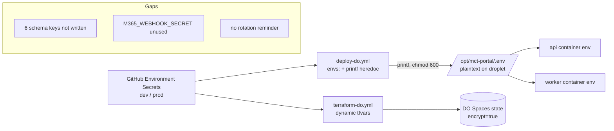

# Environment and Secret Rotation Audit

## Audit Metadata

- Audit name: repo-deep-dive
- Run: 20261002-0344-develop-6286137
- Repository: mainecybertech/mainecybertech (monorepo)
- Branch: develop
- Commit SHA: 62861370 (`6286137017c4b7c77e83ee420ec11382d984f263`, `docs: record the widened a11y default gate`, 2026-10-01 23:25:45 -0400)
- Generated at: 2026-10-02
- Auditor: Principal Repository Auditor (AI subagent)
- Area code: SECRET
- Output path: docs/audits/repo-deep-dive/20261002-0344-develop-6286137/38_env_secret_rotation.md
- Scope limitations: No access to the actual GitHub Environment Secrets, Supabase/Stripe/Cloudflare/DO dashboards, or the production droplet `/opt/mct-portal/.env`. Analysis is based on `.env.example` files, Zod env schemas, CI workflow secret references, rotation documentation, IaC, and application code at the audited commit. No secret values were printed; values observed are reported as path + type only.

## Scope

Reviewed at commit `62861370` (branch `develop`):

- All `.env.example` templates: `apps/api/.env.example`, `apps/web/.env.example`, `apps/worker/.env.example`, `infra/digitalocean/.env.example`.
- Runtime validators: `apps/api/src/config/env.ts` (Zod, lazy `getEnv()`), `apps/worker/src/env.ts` (Zod, eager `parseEnv`), `apps/web/lib/env.ts` (Zod, soft `safeParse` with defaults).
- Env documentation: `docs/ENVIRONMENT_VARIABLES.md`, `docs/SECRETS_ROTATION.md`, `docs/JWT_ROTATION.md`, `docs/GITHUB_SECRETS_AND_VARIABLES_MATRIX.md`.
- Secret scanning: `scripts/scan-secrets.sh`, `scripts/scan-secrets.ps1`, `.github/workflows/validate.yml` (`secrets-scan`), `.github/workflows/test.yml` (`secrets-scan`).
- CI/deploy secret injection: `.github/workflows/deploy-do.yml`, `.github/workflows/terraform-do.yml`, `.github/workflows/db-backup.yml`, `.github/workflows/db-restore-test.yml`, `.github/workflows/supabase-migrations.yml`, `.github/workflows/e2e.yml`.
- IaC: `infra/terraform/digitalocean/variables.tf`, `infra/terraform/digitalocean/env/*`, `infra/digitalocean/docker-compose.yml`, `docker-compose.yml`.
- Code consumers of secrets: `apps/api/src/routes/webhooks.ts`, `apps/api/src/lib/field-encryption.ts`, `apps/api/src/middleware/auth.ts` (JWT multi-secret), `.gitignore`.

Not reviewed / not possible in this role:

- Live values of GitHub Secrets, droplet `.env`, Supabase/Stripe/DO/Cloudflare/Azure consoles.
- Whether any secret was actually rotated on schedule (no rotation log entries beyond the initial row).
- Historical git history secret scan (the in-repo scanners scan diffs only; no historical scan artifact was found).

## Evidence Reviewed

| Evidence | Type | Why relevant | Notes |
|---|---|---|---|
| `apps/api/.env.example` | Config | API template | 41 keys; all placeholders; covers all 39 schema keys plus `APP_DOMAIN`/`API_DOMAIN` |
| `apps/web/.env.example` | Config | Web template | 21 keys, `NEXT_PUBLIC_*` + build/server Sentry |
| `apps/worker/.env.example` | Config | Worker template | 32 keys; missing `APP_BASE_URL` vs 33 real schema keys |
| `infra/digitalocean/.env.example` | Config | DO production template | 60 keys; placeholder values |
| `apps/api/src/config/env.ts` | Schema | API runtime validation | Zod; 39 keys; lazy singleton `getEnv()` |
| `apps/worker/src/env.ts` | Schema | Worker runtime validation | Zod; eager parse at import; `superRefine` for `REDIS_URL` |
| `apps/web/lib/env.ts` | Schema | Web client validation | Zod `safeParse`; warns + falls back to defaults |
| `docs/ENVIRONMENT_VARIABLES.md` | Doc | Central env reference | 255 lines; API/Worker/Web/E2E/CI sections |
| `docs/SECRETS_ROTATION.md` | Doc | Rotation policy | 40-secret inventory; procedures; emergency plan; rotation log |
| `docs/JWT_ROTATION.md` | Doc | JWT rotation | Zero-downtime multi-secret procedure |
| `docs/GITHUB_SECRETS_AND_VARIABLES_MATRIX.md` | Doc | GitHub scope matrix | Per-env secret matrices + setup steps |
| `.github/workflows/deploy-do.yml` | CI | Secret injection | `envs:` + `printf` heredoc → `/opt/mct-portal/.env`; `chmod 600` |
| `.github/workflows/validate.yml` | CI | Secret scan gate | `secrets-scan` job, diff-scoped |
| `scripts/scan-secrets.sh` / `.ps1` | Tooling | Pre-commit scanner | bash + PowerShell variants |
| `infra/terraform/digitalocean/variables.tf` | IaC | Terraform secret vars | `sensitive = true` on `do_token`, `cloudflare_api_token` |
| `infra/terraform/digitalocean/env/prod.tfvars` | IaC | Committed tfvars | Tracked despite `.gitignore`; placeholder values only |
| `apps/api/src/routes/webhooks.ts` | Code | Webhook secret consumers | `JIRA_WEBHOOK_SECRET`, `JSM_WEBHOOK_SECRET`, `M365_CLIENT_STATE` |
| `apps/api/src/lib/field-encryption.ts` | Code | PII key consumer | `FIELD_ENCRYPTION_KEY`; `plain:` dev fallback |
| `.gitignore` | Config | Tracked-file hygiene | `.env*` ignored, `!.env.example`; `**/env/*.tfvars` ignored |

## Verification Performed

| Evidence / claim | Type | Why relevant | Result | Notes |
|---|---|---|---|---|
| `.env.example` files contain real secrets? | Grep/read | Placeholder hygiene | supported | All 4 templates use placeholders/empty; no real values found |
| API `.env.example` covers schema keys | Scripted diff | Template accuracy | supported | 39/39 schema keys present (2 extra: `APP_DOMAIN`, `API_DOMAIN`) |
| Worker `.env.example` covers schema keys | Scripted diff | Template accuracy | partially supported | `APP_BASE_URL` (env.ts:35) absent from example |
| Web `.env.example` covers client schema | Read | Template accuracy | supported | All 13 `clientEnvSchema` keys present |
| `M365_WEBHOOK_SECRET` consumed anywhere | Grep | Dead-config check | supported (dead) | Declared env.ts:40, in `.env.example`/compose/manifest; no code/`getEnv()` reader |
| Webhook secrets written by deploy-do | Read `deploy-do.yml` | Deploy/rotation reality | unsupported (gap) | `envs:`/`printf` block omits `JIRA/JSM/M365_WEBHOOK_SECRET`, `M365_CLIENT_STATE`, `TURNSTILE` set? — see Finding |
| `JIRA_WEBHOOK_SECRET` rotation-documented | Grep `SECRETS_ROTATION.md` | Doc accuracy | unsupported | No entry in inventory or matrix |
| `JSM_WEBHOOK_SECRET` rotation-documented | Grep | Doc accuracy | unsupported | No entry |
| Rotation reminder workflow exists | Glob | Automation reality | unsupported | No `.github/workflows/*rotation*` / `*reminder*`; YAML is embedded in doc only |
| Scan scripts mirror each other | Read both | Consistency | partially supported | `.sh` has richer patterns; `.ps1` scans for key NAMES, not values |
| Produced `prod.tfvars` ignored | `git check-ignore` | Hygiene | unsupported (tracked) | exit 1; file tracked since `cde4835e` |
| JWT multi-secret implemented | Read auth.ts/env | Doc vs code | supported | `getEnv().JWT_SECRET.split(",")` in `apps/api/src/middleware/auth.ts` |
| `secrets-scan` scans full history | Read workflows | Coverage | unsupported | diff-vs-base only (`git diff -U0 "$BASE" HEAD`) |
| Prior-run findings status | Re-check | Continuity | mixed | See Verification of prior findings below |

### Verification of prior-run findings (20260801/20260806 runs) against current commit

| Prior finding | Current status | Evidence |
|---|---|---|
| 5 API env vars missing from `ENVIRONMENT_VARIABLES.md` | **verified-fixed** | `docs/ENVIRONMENT_VARIABLES.md` now lists `API_PORT` (L40), `TURNSTILE_SECRET_KEY` (L69), `JIRA_WEBHOOK_SECRET` (L73), `JSM_WEBHOOK_SECRET` (L74), `M365_WEBHOOK_SECRET` (L75) |
| Web app has no runtime env validation | **verified-fixed** | `apps/web/lib/env.ts` `clientEnvSchema` + `getClientEnv()` exists |
| API `.env.example` missing 4 schema keys | **verified-fixed** | Scripted diff: 39/39 schema keys present |
| 3 webhook secrets not in rotation doc | **still-open** | Grep `SECRETS_ROTATION.md`: no `JIRA/JSM/M365_WEBHOOK_SECRET` |
| Rotation reminder workflow absent | **still-open** | No matching workflow file |
| `prod.tfvars` tracked despite gitignore | **still-open** | `git ls-files` includes it; `git check-ignore` exit 1 |

## Executive Summary

The env/secret foundation is **strongly documented and mostly correct at this commit**, with several prior findings genuinely fixed (API `.env.example` now complete; web app now has soft runtime validation; the API reference doc now lists webhook/Turnstile/port vars). All four `.env.example` templates contain only placeholders and are tracked intentionally; `.env*` is broadly gitignored with `!.env.example`.

However, three structural gaps remain and they compound:

1. **Documentation is more complete than the deploy pipeline.** `docs/SECRETS_ROTATION.md` and `docs/ENVIRONMENT_VARIABLES.md` describe webhook/M365/Turnstile/metrics/MFA secrets, but gaps persist between what the docs describe, what the deploy workflow writes, and what the code actually consumes. The clearest example: `M365_WEBHOOK_SECRET` is declared in the schema, the example, the compose file, and the manifest — but **no code reads it**, while the actual M365 webhook auth uses `M365_CLIENT_STATE` (which the deploy pipeline does not appear to write). This is documented-but-not-real config.

2. **Secret scanning is diff-scoped, not history-scoped.** Both CI `secrets-scan` jobs and the pre-commit hooks only inspect the current diff against a base. A secret committed before the scanner existed, or merged through a path where the base computation resolves to `HEAD~1`, would never be caught. There is no committed full-history scan artifact.

3. **Rotation is documentation-only for the webhook/key classes that changed most recently.** `JIRA_WEBHOOK_SECRET`, `JSM_WEBHOOK_SECRET`, `M365_WEBHOOK_SECRET`, `M365_CLIENT_STATE`, `METRICS_TOKEN`, `TURNSTILE_SECRET_KEY`, and `FIELD_ENCRYPTION_KEY` are absent from the rotation inventory, and there is no reminder workflow; the rotation log contains only the "(Initial deployment) All" row. There is no artifact proving any rotation actually happened.

The emergency revocation path is prose-complete (revoke in source, rotate, deploy, optional force-logout) but has never been exercised (no drill artifact), and there is no IT-level break-glass runbook distinct from the in-app "Break Glass Register" module.

### Strengths

- All four `.env.example` files contain only placeholders/empty values; no real secret material was found in tracked templates.
- API Zod schema is complete and matches its example 1:1 (39 keys); the web app gained soft validation with actionable warnings this cycle.
- `FIELD_ENCRYPTION_KEY` is documented as AES-256-GCM with an explicit `plain:` dev fallback (`apps/api/src/lib/field-encryption.ts`); compose comments flag that it must be set in production.
- JWT multi-secret zero-downtime rotation is real code (`getJwtSecrets()` in `apps/api/src/middleware/auth.ts`), not just prose.
- Terraform marks `do_token` and `cloudflare_api_token` `sensitive = true`; produced `.tfvars` are gitignored by pattern.
- Deploy writes `/opt/mct-portal/.env` with `chmod 600`, and secret values are forwarded as environment variables (`envs:`) rather than interpolated into the remote script, avoiding shell-injection of metacharacters.
- Pre-commit + CI `secrets-scan` exist and block commits on common provider patterns.

### Key gaps

- `M365_WEBHOOK_SECRET` is dead config; `M365_CLIENT_STATE` (the real M365 auth value) is missing from the deploy writer and the rotation inventory.
- Webhook secrets (`JIRA/JSM`), `TURNSTILE_SECRET_KEY`, `METRICS_TOKEN`, and MFA toggle are not reconciled between docs, deploy writer, and matrix.
- No rotation reminder workflow; rotation log shows no real rotation event.
- Secret scanning is diff-only; no full-history evidence.
- `infra/terraform/digitalocean/env/prod.tfvars` is tracked despite a `.gitignore` rule that intends to exclude it.
- Worker `.env.example` omits `APP_BASE_URL`.
- No IT break-glass / emergency secret revocation runbook distinct from the app module; no drill evidence.

## Inventory

| Item | Path / symbol | Purpose | Current state | Risk | Notes |
|---|---|---|---|---|---|
| API env template | `apps/api/.env.example` | API starter config | Complete (41 keys) | Low | All placeholders; matches schema |
| Web env template | `apps/web/.env.example` | Web starter config | Complete (21 keys) | Low | `NEXT_PUBLIC_*` only for client |
| Worker env template | `apps/worker/.env.example` | Worker starter config | Missing `APP_BASE_URL` | Low | `env.ts:35`, consumed by `scheduled-notifications.ts:91` |
| DO env template | `infra/digitalocean/.env.example` | Production compose config | Placeholders | Low | `REDIS_PASSWORD=change-me-...` placeholder |
| API validator | `apps/api/src/config/env.ts` | Runtime validation | Lazy `getEnv()`, fail-fast | Low | `JWT_SECRET` min 32; required Supabase keys |
| Worker validator | `apps/worker/src/env.ts` | Runtime validation | Eager parse at import | Low | `superRefine` requires `REDIS_URL` for bullmq |
| Web validator | `apps/web/lib/env.ts` | Client validation | Soft (warn + defaults) | Low | `NEXT_PUBLIC_API_URL` optional w/ default |
| Env reference doc | `docs/ENVIRONMENT_VARIABLES.md` | Central reference | Current | Low | Now includes webhook/Turnstile/MFA/port |
| Rotation policy | `docs/SECRETS_ROTATION.md` | Rotation schedule/procedures | Partial | Medium | Missing 7 newer keys; no reminder workflow |
| JWT rotation | `docs/JWT_ROTATION.md` | Zero-downtime JWT procedure | Current, code-backed | Low | Matches `middleware/auth.ts` |
| GitHub matrix | `docs/GITHUB_SECRETS_AND_VARIABLES_MATRIX.md` | Per-env secret scopes | Partial | Medium | Missing webhook/M365_CLIENT_STATE/METRICS_TOKEN rows |
| Deploy secret writer | `.github/workflows/deploy-do.yml` | Writes droplet `.env` | Partial | High | Omits several schema keys (see Finding SECRET-P1-002) |
| Secret scanner (sh) | `scripts/scan-secrets.sh` | Pre-commit scan | Diff-only | Medium | Rich provider patterns |
| Secret scanner (ps1) | `scripts/scan-secrets.ps1` | Pre-commit scan (Win) | Divergent | Medium | Scans key NAMES; misses values `sh` catches |
| CI secret scan | `.github/workflows/{validate,test}.yml` | Gate scan | Diff-only | Medium | No history scan |
| Terraform tfvars | `infra/terraform/digitalocean/env/prod.tfvars` | Provider creds var file | Tracked (placeholders) | Medium | Intended-ignored but committed |
| PII key consumer | `apps/api/src/lib/field-encryption.ts` | AES-256-GCM | Working w/ dev fallback | Medium | `plain:` fallback if key absent/short |
| M365 webhook auth | `apps/api/src/routes/webhooks.ts:435` | clientState validation | Working | Medium | Uses `M365_CLIENT_STATE`, not `M365_WEBHOOK_SECRET` |
| Break-glass (app) | `docs/runbooks/break-glass-register.md` | Emergency account module | Feature-level | Low | Not an IT credential break-glass runbook |

## Domain Scorecard

| Category | Score | Evidence | Gap | Recommended action |
|---|:---:|---|---|---|
| .env.example | 4 | 4 templates, placeholders only; API 39/39, web 13/13 | Worker missing `APP_BASE_URL` | Add `APP_BASE_URL` to worker example |
| Env docs | 4 | `ENVIRONMENT_VARIABLES.md` 255 lines, current | Rotation doc + matrix lag schema/compose | Reconcile 7 keys across rotation/matrix docs |
| Runtime validators | 4 | API + Worker fail-fast; Web soft-validate | Web uses defaults not hard fail (intentional) | Document web soft-validation policy |
| CI/deploy/local secrets | 3 | `envs:`+`printf` heredoc, `chmod 600` | Deploy writer omits 5-6 schema keys | Align writer with schema or document exclusions |
| API/JWT/DB/Supabase/webhook/OAuth/email/push/Sentry/payment/cloud/GitHub keys | 3 | Rotation doc covers 40 keys; JWT real | Webhook/M365/METRICS/TURNSTILE/FIELD not rotation-covered | Add entries + owners + frequencies |
| Naming consistency | 4 | Consistent `UPPER_CASE`; `NEXT_PUBLIC_` boundary respected | One dead key (`M365_WEBHOOK_SECRET`) | Remove or implement dead key |
| Client-exposed vars | 5 | Only `NEXT_PUBLIC_*` client-side; `getClientEnv` allowlist | None material | Keep as-is |
| Rotation/revocation docs | 4 | Policy + JWT runbook + emergency section | No reminder workflow; no rotation evidence; no drill | Add workflow + log entries + drill |
| Break-glass | 2 | Prose emergency section; app "Break Glass Register" | No IT credential break-glass runbook; not exercised | Create `docs/BREAK_GLASS_RUNBOOK.md` |

## Detailed Review

### Item: `.env.example` placeholder hygiene

- Evidence: `apps/api/.env.example`, `apps/web/.env.example`, `apps/worker/.env.example`, `infra/digitalocean/.env.example`.
- What it does: Provides starter templates. Secret-like keys use placeholders (`<your-jwt-secret>`, `<your-local-anon-key>`, `change-me-to-a-long-random-value`) or empty values.
- How it appears to work: `.gitignore` ignores `.env*` but un-ignores `!.env.example` and `!.env.*.example`; scripted diff confirms API covers 39/39 schema keys.
- Dependencies: Zod schemas in each app.
- Current controls: Placeholder-only; API 1:1 with schema; web client allowlist.
- Missing controls: Worker example omits `APP_BASE_URL`; no CI check asserts example↔schema parity.
- Risks: Low; new devs may not know worker needs `APP_BASE_URL`.
- Recommended improvement: Add `APP_BASE_URL=` to worker example; add a CI parity check.
- Suggested tests: `scripts/check-env-docs.mjs` comparing schema keys to `.env.example` and `ENVIRONMENT_VARIABLES.md`.
- Suggested docs: Note in `ENVIRONMENT_VARIABLES.md` that examples are the minimal starter set.

### Item: Runtime env validation

- Evidence: `apps/api/src/config/env.ts` (`getEnv`, `safeParse`), `apps/worker/src/env.ts` (`parseEnv`, eager), `apps/web/lib/env.ts` (`getClientEnv`, soft).
- What it does: API defers validation to first `getEnv()` and throws a flattened error; Worker parses at import and throws before serving; Web warns and falls back to defaults.
- How it appears to work: API requires `SUPABASE_URL/ANON/SERVICE_ROLE/JWT_SECRET`; Worker requires Supabase trio and conditionally `REDIS_URL`; Web never hard fails.
- Dependencies: `zod`, `dotenv` (worker `.env.local`).
- Current controls: Fail-fast for API/Worker; typed `Env` export.
- Missing controls: Web soft-fail can silently run on localhost defaults in prod if `NEXT_PUBLIC_API_URL` unset (mitigated by build-arg injection in `deploy-do.yml`).
- Risks: Medium for web; Low for API/Worker.
- Recommended improvement: Log a build-time error when `NEXT_PUBLIC_API_URL` resolves to a localhost default under `NODE_ENV=production`.
- Suggested tests: Unit test that `getClientEnv()` warns on invalid URL; API test that `getEnv()` throws with missing `JWT_SECRET`.
- Suggested docs: Document web soft-validation behavior and rationale.

### Item: Secret rotation documentation accuracy

- Evidence: `docs/SECRETS_ROTATION.md` (40 keys), `docs/JWT_ROTATION.md`, `docs/GITHUB_SECRETS_AND_VARIABLES_MATRIX.md`.
- What it does: Specifies frequencies, sources, procedures (JWT, Supabase, Stripe, SMTP, SSH), a standard procedure, emergency rotation, rollback, reminder YAML, and a rotation log.
- How it appears to work: Strengths: JWT procedure matches code; SSH rotation includes remove-old-key step. Gaps: newer keys absent; reminder workflow referenced but absent; log has only the initial row.
- Dependencies: GitHub Environments `dev`/`prod`/`prod-approval`.
- Current controls: Prose procedures; source-of-truth pointers.
- Missing controls: Automated reminder; rotation evidence; entries for `JIRA_WEBHOOK_SECRET`, `JSM_WEBHOOK_SECRET`, `M365_WEBHOOK_SECRET`, `M365_CLIENT_STATE`, `METRICS_TOKEN`, `TURNSTILE_SECRET_KEY`, `FIELD_ENCRYPTION_KEY`.
- Risks: High-value keys can go unrotated unnoticed.
- Recommended improvement: Add missing entries + create the reminder workflow; add a `last_rotated` column populated on each rotation.
- Suggested tests: Doc-lint that every schema secret key appears in the rotation inventory.
- Suggested docs: See "Suggested Documentation Updates".

### Item: Secret scanning tooling

- Evidence: `scripts/scan-secrets.sh` (35 lines, rich patterns), `scripts/scan-secrets.ps1` (33 lines, key-name patterns), `.github/workflows/validate.yml:100-125`, `.github/workflows/test.yml:140-166`.
- What it does: Blocks commits/PRs when staged/diff added lines match provider token patterns.
- How it appears to work: `sh` filters `^+` added lines against `AKIA/ghp_/sk_live_/xox/PRIVATE KEY/JWT-like`; `ps1` scans raw diff for key NAMES such as `JWT_SECRET` (different semantics).
- Dependencies: `git`, `grep`.
- Current controls: Diff-scoped blocking in pre-commit + CI.
- Missing controls: Full-history scan; entropy heuristics; `.ps1` does not mirror `.sh` semantics; no artifact proving a clean history.
- Risks: Medium — pre-existing leaks undetected.
- Recommended improvement: Add a manual `--full-history` mode run in CI on schedule, or commit a `gitleaks`/trufflehog config; align `.ps1` patterns with `.sh`.
- Suggested tests: Regression test with a known fake token in a temp diff.
- Suggested docs: Document scanner scope and known limits.

### Item: Break-glass and emergency revocation

- Evidence: `docs/SECRETS_ROTATION.md` §Emergency Rotation (L136-162), `docs/JWT_ROTATION.md` §Emergency Rotation (L74-79), `docs/runbooks/break-glass-register.md`.
- What it does: Prose emergency steps (revoke in source, generate, set secret, deploy, optional force-logout, notify, document). The runbook file is about the in-app "Break Glass Register" module, not IT credential recovery.
- How it appears to work: Docs-only; no drill evidence; no separate IT runbook.
- Dependencies: GitHub Environments; source-system dashboards.
- Current controls: Written emergency procedure.
- Missing controls: IT break-glass runbook; last-exercised date; named approver/owner; force-logout implementation (`clear Supabase auth sessions`) is not shown as a script.
- Risks: Medium.
- Recommended improvement: Create `docs/BREAK_GLASS_RUNBOOK.md` and a `secret_rotation_runbook.md` (see Appendix C); record a tabletop/drill date.
- Suggested tests: Tabletop exercise; verify `gh secret set` `--env` targeting works.
- Suggested docs: See "Suggested Documentation Updates".

## Scenario / Control Matrix

| ID | Scenario or control | Evidence | Current control | Gap | Severity | Recommendation |
|---|---|---|---|---|---|---|
| SECRET-001 | `.env.example` hygiene | 4 templates; placeholders only | Placeholders; gitignore allow-list | Worker missing `APP_BASE_URL` | P3 | Add key; CI parity check |
| SECRET-002 | Env docs accuracy | `ENVIRONMENT_VARIABLES.md` current | Central reference | Rotation doc/matrix lag schema | P2 | Reconcile docs |
| SECRET-003 | Runtime validators | API/Worker/Web Zod | Fail-fast API/Worker; soft Web | Web silent default in prod edge | P3 | Prod guard for localhost default |
| SECRET-004 | CI/deploy/local secrets | `deploy-do.yml` writer | `envs:`+`printf`, `chmod 600` | Writer omits schema keys | P1 | Align writer with schema |
| SECRET-005 | Provider keys (API/JWT/DB/etc.) | `SECRETS_ROTATION.md` 40 keys | Inventory + procedures | Newer keys uncovered; dead key | P2 | Add keys; remove/implement dead key |
| SECRET-006 | Naming consistency | `UPPER_CASE`, `NEXT_PUBLIC_` | Consistent | One dead/unused key | P3 | Remove or wire `M365_WEBHOOK_SECRET` |
| SECRET-007 | Client-exposed vars | `apps/web/lib/env.ts` allowlist | Only `NEXT_PUBLIC_*` | None material | P3 | Maintain boundary tests |
| SECRET-008 | Rotation/revocation docs | `SECRETS_ROTATION.md` | Policy + emergency prose | No reminder; no evidence; no drill | P2 | Workflow + log + drill |
| SECRET-009 | Break-glass | Emergency sections | Prose procedure | No IT runbook; not exercised | P2 | Create runbook + drill |

## Findings

### Finding ID: SECRET-P1-001 - M365 webhook secret is dead config while the real M365 auth value is undocumented and undeployed

- Severity: P1 - High
- Confidence: High
- Area: Runtime config / secret correctness
- Evidence:
  - `apps/api/src/config/env.ts:40` — `M365_WEBHOOK_SECRET: z.string().optional()`
  - `apps/api/.env.example:32` — `M365_WEBHOOK_SECRET=`
  - `infra/digitalocean/docker-compose.yml:75` — `M365_WEBHOOK_SECRET: ${M365_WEBHOOK_SECRET:-}`
  - `apps/api/src/routes/webhooks.ts:435` — M365 webhook auth reads `getEnv().M365_CLIENT_STATE` (not `M365_WEBHOOK_SECRET`); lines 449-461 reject missing/mismatched clientState
  - Repo-wide grep: `M365_WEBHOOK_SECRET` has no code consumer; `M365_CLIENT_STATE` is consumed at `webhooks.ts:435`
  - `.github/workflows/deploy-do.yml:355-390` — the droplet `.env` writer does not emit `M365_CLIENT_STATE` (nor the three `*_WEBHOOK_SECRET` values)
- What is happening: The schema, example, and compose declare an M365 *webhook secret* that nothing reads, while the value that actually authenticates inbound M365 change notifications (`M365_CLIENT_STATE`) is not written by the deploy pipeline. Operators who see `M365_WEBHOOK_SECRET` in the template/compose may believe M365 webhook auth is configured when it is not.
- Why it matters: This is security-by-misleading-config. The M365 endpoint fails closed (`501 NOT_IMPLEMENTED`) when `M365_CLIENT_STATE` is absent, so the feature is dead rather than exploitable — but the misleading dead key hides that fact and defeats rotation planning.
- User / business impact: M365 calendar-sync change notifications silently do not process in any environment where the deploy writer does not emit `M365_CLIENT_STATE`.
- Security / privacy / reliability impact: No direct exploit; however, a future contributor could wire `M365_WEBHOOK_SECRET` believing it already verifies signatures, and the endpoint's only real auth is a shared `clientState` value that is not in the rotation inventory or matrix.
- Recommended fix: (1) Either remove `M365_WEBHOOK_SECRET` from `env.ts`, `.env.example`, and `infra/digitalocean/docker-compose.yml`, or implement real signature verification for M365 if the platform supports it. (2) Add `M365_CLIENT_STATE` to the `deploy-do.yml` `envs:` list and `printf` writer and to `docs/GITHUB_SECRETS_AND_VARIABLES_MATRIX.md` and `docs/SECRETS_ROTATION.md`.
- Suggested validation: `grep -rn "M365_WEBHOOK_SECRET" --include=*.ts apps/` returns no consumers; `grep -n "M365_CLIENT_STATE" .github/workflows/deploy-do.yml` shows it is written; M365 webhook returns non-501 after deploy.
- Owner suggestion: API + Platform teams
- Effort estimate: M
- Dependencies: Decision on whether M365 supports HMAC signatures; coordination with `12_infra_deployment_environment_drift.md`.
- Status: open
- Endpoint / data path: `POST /api/v1/webhooks/m365` → `getEnv().M365_CLIENT_STATE` (unset) → `501 NOT_IMPLEMENTED`.
- Attack path: none identified (fail-closed), but see SECRET-P1-002 for the sibling "config present but not deployed" pattern.

### Finding ID: SECRET-P1-002 - Deploy pipeline does not write several secret-class env vars the API schema and compose reference

- Severity: P1 - High
- Confidence: High
- Area: CI/deploy secrets
- Evidence:
  - `.github/workflows/deploy-do.yml:355-390` — `printf` block writes 34 names
  - `apps/api/src/config/env.ts:38-55` — schema includes `JIRA_WEBHOOK_SECRET`, `JSM_WEBHOOK_SECRET`, `M365_WEBHOOK_SECRET`, `M365_CLIENT_STATE`, `METRICS_TOKEN`, `MFA_ENFORCEMENT_ENABLED` (all optional)
  - `infra/digitalocean/docker-compose.yml:68-75` — interpolates `TURNSTILE_SECRET_KEY`, `METRICS_TOKEN`, `MFA_ENFORCEMENT_ENABLED`, `M365_CLIENT_STATE`, `JIRA_WEBHOOK_SECRET`, `JSM_WEBHOOK_SECRET`, `M365_WEBHOOK_SECRET` with `:-` defaults
  - `.github/workflows/deploy-do.yml:333` — `envs:` list does not include the six names above
  - `apps/api/src/routes/webhooks.ts:236,331` — Jira/JSM webhook signature verification reads those secrets; absent → `501`
  - `docs/GITHUB_SECRETS_AND_VARIABLES_MATRIX.md` — no rows for `JIRA_WEBHOOK_SECRET`, `JSM_WEBHOOK_SECRET`, `M365_WEBHOOK_SECRET`, `M365_CLIENT_STATE`, `METRICS_TOKEN`
- What is happening: The deploy workflow writes the droplet `.env` from a fixed `printf` list that omits secret-class keys present in the schema, the DO `.env.example`, and compose. Those features are therefore not configured by the pipeline.
- Why it matters: Webhook signature verification (Jira/JSM), the `/metrics` bearer gate, MFA enforcement, and M365 `clientState` auth cannot be turned on through the documented deploy path; enabling them requires manual droplet edits, which are undocumented and unrotated.
- User / business impact: Security controls operators believe are on may be off; features (Jira/JSM webhooks) are dead until manually configured.
- Security / privacy / reliability impact: `/metrics` may be ungated (404 only if `METRICS_TOKEN` logic relies on it — see `apps/api/src/config/env.ts:43-45`) and inbound webhook auth stays disabled; MFA enforcement toggle undeployable.
- Recommended fix: Add the omitted names to `deploy-do.yml` `envs:` and the `printf` writer (empty defaults are acceptable for optional ones), wire corresponding GitHub Environment secrets, and add matching rows to the matrix. Alternatively, explicitly document these as excluded with rationale and a manual-set procedure.
- Suggested validation: `grep -E "JIRA_WEBHOOK_SECRET|JSM_WEBHOOK_SECRET|M365_CLIENT_STATE|METRICS_TOKEN|MFA_ENFORCEMENT_ENABLED" .github/workflows/deploy-do.yml` shows presence in both `envs:` and writer; a test deploy yields a non-501 Jira/JSM webhook.
- Owner suggestion: Platform / CI team
- Effort estimate: S
- Dependencies: MATRIX + rotation doc updates (SECRET-P2-003); coordination with `12_infra_deployment_environment_drift.md`.
- Status: open
- Endpoint / data path: `POST /api/v1/webhooks/jira|jsm` → `getEnv().*_WEBHOOK_SECRET` (unset) → `501`; `GET /metrics` → `METRICS_TOKEN` gate.
- Attack path: If operators manually set `METRICS_TOKEN` but it is absent from rotation, the gate token becomes unrotated operational debt.

### Finding ID: SECRET-P2-001 - Secret rotation inventory and GitHub matrix lag the schema/compose; seven keys uncovered

- Severity: P2 - Medium
- Confidence: High
- Area: Documentation accuracy
- Evidence:
  - `apps/api/src/config/env.ts:38-42,45` — `JIRA_WEBHOOK_SECRET`, `JSM_WEBHOOK_SECRET`, `M365_WEBHOOK_SECRET`, `M365_CLIENT_STATE`, `TURNSTILE_SECRET_KEY`, `METRICS_TOKEN`
  - `apps/api/src/config/env.ts:27` — `FIELD_ENCRYPTION_KEY`
  - `docs/SECRETS_ROTATION.md` — grep for these names returns no inventory entries (only `STRIPE_WEBHOOK_SECRET` present)
  - `docs/GITHUB_SECRETS_AND_VARIABLES_MATRIX.md` — same omissions
- What is happening: Keys added since the rotation doc was written are not in the inventory or per-env matrix, so there is no rotation frequency, source, or procedure for them.
- Why it matters: Uncovered secrets are effectively "rotate never" — the precise failure mode rotation policy exists to prevent.
- User / business impact: Elevated credential-leak exposure window for webhook/captcha/metrics/PII keys.
- Security / privacy / reliability impact: `FIELD_ENCRYPTION_KEY` protects PII at rest (`apps/api/src/lib/field-encryption.ts`); a leaked, unrotatable PII key is a data-confidentiality risk with no documented response.
- Recommended fix: Add the seven keys to `SECRETS_ROTATION.md` inventory (with frequency/source/procedure) and to the appropriate sections of `docs/GITHUB_SECRETS_AND_VARIABLES_MATRIX.md`.
- Suggested validation: Doc-lint script that every `z.string()` secret-like key in `env.ts` appears in both docs.
- Owner suggestion: Platform + Security
- Effort estimate: S
- Dependencies: SECRET-P1-001/P1-002 (several keys may be removed or wired first).
- Status: open
- Endpoint / data path: n/a (documentation).

### Finding ID: SECRET-P2-002 - Rotation reminder workflow referenced in docs does not exist; rotation log shows no real rotation

- Severity: P2 - Medium
- Confidence: High
- Area: Automation / rotation reality
- Evidence:
  - `docs/SECRETS_ROTATION.md:166-191` — embeds a YAML `secret-rotation-reminder.yml` example and states "A GitHub Actions scheduled workflow creates an issue quarterly"
  - Glob for `.github/workflows/*rotation*` and `*reminder*` — no files
  - `docs/SECRETS_ROTATION.md:195-199` — Rotation Log contains only `(Initial deployment) | All | — | No | dev, prod`
- What is happening: The policy document's automation is aspirational; the workflow does not exist and no rotation has been recorded since initial deployment.
- Why it matters: Without a reminder or a populated log, 90/180-day rotations are calendar-dependent and unverifiable.
- User / business impact: Stale credentials remain live longer than policy allows.
- Security / privacy / reliability impact: Increased exposure window after any undetected leak.
- Recommended fix: Create `.github/workflows/secret-rotation-reminder.yml` from the doc example; add a `last_rotated` column and populate it on each rotation; add a verification step.
- Suggested validation: Manual `workflow_dispatch` creates a labeled issue; log rows appear after a rotation.
- Owner suggestion: Platform team
- Effort estimate: S
- Dependencies: None.
- Status: still-open (carried from prior run; unchanged)

### Finding ID: SECRET-P2-003 - Secret scanning is diff-scoped only; no full-history scan artifact

- Severity: P2 - Medium
- Confidence: High
- Area: Security tooling
- Evidence:
  - `.github/workflows/validate.yml:109-125` — scans `git diff -U0 "$BASE" HEAD`
  - `.github/workflows/test.yml:150-166` — same diff-scoped logic
  - `scripts/scan-secrets.sh:6-8,15,21` — pre-commit scans staged diff; full-history commands are commented as "run manually"
  - `scripts/scan-secrets.ps1:13-25` — scans diff lines for key NAMES (semantics differ from `.sh`)
  - No committed scan artifact (e.g. gitleaks report) found
- What is happening: A credential committed before the scanner existed, or on a branch/base where the diff resolves to `HEAD~1`, is never evaluated. The PowerShell hook checks for key *names* (e.g. `JWT_SECRET`), not values, so it can both miss real values and block benign mentions.
- Why it matters: Historical leaks are the highest-impact class and are precisely what diff-only scanning misses.
- User / business impact: A leaked credential could remain in history undetected.
- Security / privacy / reliability impact: Undetected long-lived credential exposure.
- Recommended fix: Add a scheduled/optional full-history scan (gitleaks/trufflehog) run and commit its report; align `.ps1` patterns with `.sh`.
- Suggested validation: Run the history scan; assert zero high-confidence hits or triage each.
- Owner suggestion: Security / Platform
- Effort estimate: M
- Dependencies: Scanner tool choice and CI minutes.
- Status: open

### Finding ID: SECRET-P2-004 - Produced Terraform `prod.tfvars` is tracked despite `.gitignore` intending to exclude it

- Severity: P2 - Medium
- Confidence: High
- Area: IaC / repo hygiene
- Evidence:
  - `.gitignore:57` — `**/env/*.tfvars`
  - `git ls-files "infra/terraform/digitalocean/env/"` → includes `prod.tfvars`
  - `git check-ignore -v infra/terraform/digitalocean/env/prod.tfvars` → exit 1 (not ignored, because tracked)
  - `infra/terraform/digitalocean/env/prod.tfvars:5-8` — values are placeholders (`your-do-api-token`, `your-cloudflare-api-token`)
  - Added in `cde4835e` ("Add missing terraform configs for DO deployment")
- What is happening: A file matching the ignore pattern is tracked. Today it holds only placeholders (no real secret printed), but the file is the exact location where real provider tokens would be written, and because it is tracked, a future `terraform` run that populates it would produce a committable real-secret change.
- Why it matters: The intent of `.gitignore` is defeated for this path; the guard against committing provider credentials is silently absent.
- User / business impact: Low today; high latent risk of a committed DO/Cloudflare token.
- Security / privacy / reliability impact: Potential credential exposure via git history if populated and committed.
- Recommended fix: `git rm --cached infra/terraform/digitalocean/env/prod.tfvars` and keep it gitignored; rely on `prod.tfvars.example` / CI-generated tfvars (as `terraform-do.yml` does).
- Suggested validation: `git check-ignore infra/terraform/digitalocean/env/prod.tfvars` returns the path (exit 0); `git status` no longer lists the file.
- Owner suggestion: Platform / IaC
- Effort estimate: S
- Dependencies: Confirm CI generates tfvars dynamically (as `terraform-do.yml` suggests).
- Status: still-open (carried from prior run; unchanged)

### Finding ID: SECRET-P3-001 - Worker `.env.example` omits `APP_BASE_URL`

- Severity: P3 - Low
- Confidence: High
- Area: `.env.example` completeness
- Evidence:
  - `apps/worker/src/env.ts:35` — `APP_BASE_URL: z.string().url().optional()`
  - `apps/worker/src/tasks/scheduled-notifications.ts:91` — `env.APP_BASE_URL ?? env.API_BASE_URL ?? ""`
  - `apps/worker/.env.example` — no `APP_BASE_URL` line
  - Scripted schema-vs-example diff flags `APP_BASE_URL` as the only missing real key
- What is happening: The worker template is incomplete by one optional key used for notification links.
- Why it matters: Notification links may silently degrade to `""` (or `API_BASE_URL`) for developers who copy the template.
- User / business impact: Minor; possibly broken links in local notification emails.
- Security / privacy / reliability impact: Negligible.
- Recommended fix: Add `APP_BASE_URL=http://localhost:3000` under the worker "Runtime" section.
- Suggested validation: Rerun the schema-vs-example diff → zero missing keys.
- Owner suggestion: Worker team
- Effort estimate: S
- Dependencies: None.
- Status: open

### Finding ID: SECRET-P3-002 - Web runtime validator can silently fall back to a localhost API URL

- Severity: P3 - Low
- Confidence: Medium
- Area: Runtime validation
- Evidence:
  - `apps/web/lib/env.ts:4,38,86` — `NEXT_PUBLIC_API_URL` is `.optional()` and falls back to `http://localhost:4000`
  - `.github/workflows/deploy-do.yml:242` — web image build injects `NEXT_PUBLIC_API_URL=https://<api_domain>` (mitigates in normal deploys)
- What is happening: If a production build is produced without the build arg (e.g. a manual build), the client silently targets localhost and only logs a console warning.
- Why it matters: A mis-built image fails at runtime rather than at build time, producing hard-to-diagnose client errors.
- User / business impact: Broken web app for a bad build; delayed diagnosis.
- Security / privacy / reliability impact: Low; potential misrouting of client calls.
- Recommended fix: During build, if `NODE_ENV=production` and `NEXT_PUBLIC_API_URL` is unset or localhost, fail the build (`process.env.NEXT_PHASE`-aware check in `apps/web/lib/env.ts` or a build script).
- Suggested validation: A production build without the arg fails CI.
- Owner suggestion: Frontend team
- Effort estimate: S
- Dependencies: Confirm Next.js build phase detection approach.
- Status: open

### Finding ID: SECRET-P3-003 - No IT-level break-glass / emergency credential revocation runbook, and no revocation drill evidence

- Severity: P3 - Low
- Confidence: High
- Area: Break-glass / incident readiness
- Evidence:
  - `docs/SECRETS_ROTATION.md:136-162` — emergency rotation prose (no separate runbook, no owner, no last-exercised date)
  - `docs/JWT_ROTATION.md:74-79` — emergency JWT steps (force-logout described as "optional: clear all sessions in Supabase")
  - `docs/runbooks/break-glass-register.md` — describes the in-app "Break Glass Register" module, not IT credential recovery
  - No `docs/BREAK_GLASS_RUNBOOK.md` or `docs/secret_rotation_runbook.md` (glob)
- What is happening: Emergency revocation exists as embedded prose in two docs, with the break-glass runbook path occupied by a product feature. There is no standalone operator artifact and no evidence any drill occurred.
- Why it matters: Under incident pressure, operators need a single, tested page naming owners, commands, and verification; and the "force logout" step has no concrete mechanism shown.
- User / business impact: Slower, error-prone incident response.
- Security / privacy / reliability impact: Extended exposure window during compromise.
- Recommended fix: Create `docs/BREAK_GLASS_RUNBOOK.md` (or `docs/secret_rotation_runbook.md`) with named owner, `gh secret set --env` commands, deploy trigger, source-system revocation links, force-logout mechanism, and a drill log; run a tabletop and record the date.
- Suggested validation: Tabletop exercise with a recorded date and a rehearsal of `gh workflow run deploy-do.yml` targeting `dev`.
- Owner suggestion: Security Operations Lead
- Effort estimate: S
- Dependencies: Confirmation of the concrete Supabase session-revocation mechanism.
- Status: open

## Risks

| Risk | Severity | Likelihood | Impact | Evidence | Mitigation |
|---|---|---|---|---|---|
| Security controls documented but not deployed (webhook sigs, metrics gate, MFA, M365 clientState) | P1 | High | High | `deploy-do.yml:355-390` vs `env.ts:38-55` | Align writer with schema (SECRET-P1-002) |
| Dead M365 webhook secret misleading operators | P1 | Medium | Medium | `env.ts:40` unused; `webhooks.ts:435` uses `M365_CLIENT_STATE` | Remove or implement (SECRET-P1-001) |
| Unrotated PII/webhook keys with no procedure | P2 | Medium | High | `SECRETS_ROTATION.md` omissions | Add inventory entries (SECRET-P2-001) |
| No rotation reminder / no rotation evidence | P2 | High | Medium | No workflow; log has 1 row | Workflow + log discipline (SECRET-P2-002) |
| Historical secret leak undetected | P2 | Low | High | Diff-only scans | Full-history scan (SECRET-P2-003) |
| Provider tokens committable via tracked tfvars | P2 | Low | High | `git ls-files` includes `prod.tfvars` | `git rm --cached` (SECRET-P2-004) |
| Plaintext droplet `.env` is a single point of exposure | P2 | Low | High | `deploy-do.yml:352-391`, `chmod 600` | Evaluate secrets manager (documented, not yet done) |
| Web app silently targets localhost on bad build | P3 | Low | Medium | `apps/web/lib/env.ts:86` | Build-time guard (SECRET-P3-002) |

## Recommendations

### Immediate / Release Blocking

1. Resolve `M365_WEBHOOK_SECRET` dead config and deploy-wire `M365_CLIENT_STATE` (SECRET-P1-001).
2. Reconcile `deploy-do.yml` `envs:`/writer with the schema/compose for the six omitted keys (SECRET-P1-002) or explicitly document exclusions.

### This Week

3. Add the seven uncovered keys to `SECRETS_ROTATION.md` and `GITHUB_SECRETS_AND_VARIABLES_MATRIX.md` (SECRET-P2-001).
4. Create the rotation reminder workflow and add a `last_rotated` column (SECRET-P2-002).
5. `git rm --cached` the tracked `prod.tfvars` (SECRET-P2-004).

### This Month

6. Add a full-history secret scan and commit its report; align `.ps1` patterns with `.sh` (SECRET-P2-003).
7. Add worker `APP_BASE_URL` and a CI schema↔example↔doc parity check (SECRET-P3-001).
8. Add a production build-time guard for `NEXT_PUBLIC_API_URL` (SECRET-P3-002).
9. Create `docs/BREAK_GLASS_RUNBOOK.md` and run a tabletop drill (SECRET-P3-003).
10. Evaluate a secrets manager to replace the plaintext droplet `.env`.

### Later / Platform Evolution

11. Automate provider key rotation via APIs (Supabase/Stripe/Cloudflare) where supported.
12. Add secret-access auditing and least-privilege review of GitHub Environment scopes and required reviewers for `prod-approval`.

## Quick Wins

| Quick win | Why it helps | Files likely involved | Validation |
|---|---|---|---|
| Remove or wire `M365_WEBHOOK_SECRET` | Eliminates misleading dead config | `apps/api/src/config/env.ts`, `apps/api/.env.example`, `infra/digitalocean/docker-compose.yml` | `grep` shows no unused secret |
| Add omitted keys to `deploy-do.yml` writer | Makes documented controls deployable | `.github/workflows/deploy-do.yml` | Deploy yields non-501 webhooks |
| Add `APP_BASE_URL` to worker example | Template completeness | `apps/worker/.env.example` | Schema-example diff empty |
| Add 7 keys to rotation inventory | Closes "rotate never" gap | `docs/SECRETS_ROTATION.md` | Doc-lint passes |
| `git rm --cached prod.tfvars` | Restores gitignore intent | `.gitignore`, tfvars path | `git check-ignore` exit 0 |
| Create reminder workflow | Automation of rotation | `.github/workflows/secret-rotation-reminder.yml` | Manual dispatch creates issue |

## Hardening Backlog

| Backlog item | Priority | Owner suggestion | Effort | Dependency |
|---|---|---|---|---|
| Remove/implement `M365_WEBHOOK_SECRET` | P1 | API team | M | Platform decision |
| Reconcile deploy writer with schema | P1 | Platform/CI | S | Matrix update |
| Rotation inventory + matrix updates | P2 | Platform/Security | S | P1 items |
| Reminder workflow + rotation log | P2 | Platform | S | None |
| Full-history secret scan | P2 | Security | M | Tool choice |
| `git rm --cached` produced tfvars | P2 | IaC | S | Confirm CI generates tfvars |
| Worker example `APP_BASE_URL` | P3 | Worker team | S | None |
| Web prod build URL guard | P3 | Frontend | S | Next.js phase handling |
| IT break-glass runbook + drill | P3 | SecOps Lead | S | Session-revocation mechanism |
| Secrets manager evaluation | P2 | Infrastructure | L | Budget/ops |
| Schema↔example↔docs parity CI check | P2 | Platform | M | Script ownership |

## Suggested Tests

- **Unit (API)**: `getEnv()` throws a flattened error when `JWT_SECRET` is missing/short and when Supabase keys are absent.
- **Unit (worker)**: `parseEnv` fails when `QUEUE_BACKEND=bullmq` and `REDIS_URL` is unset; passes with both.
- **Unit (web)**: `getClientEnv()` warns once per invalid key and returns defaults; production build with unset `NEXT_PUBLIC_API_URL` fails (new guard).
- **Integration (webhooks)**: `POST /api/v1/webhooks/jira|jsm` returns `501` when secret unset and `401` on bad signature; `POST /api/v1/webhooks/m365` returns `501` when `M365_CLIENT_STATE` unset and `401` on mismatch.
- **CI parity test**: a script asserting `env.ts` schema keys ↔ `.env.example` ↔ `ENVIRONMENT_VARIABLES.md` ↔ rotation inventory all agree (allowing an explicit exclusion list).
- **CI security test**: run the secret scanner against a synthetic diff containing a fake `AKIA...` token and assert non-zero exit (regression for both `.sh` and workflow).
- **E2E/manual**: rotation drill — rotate a non-production secret via `gh secret set --env dev`, run `deploy-do.yml` to `dev`, verify health checks and feature behavior.
- **Manual validation**: `git check-ignore infra/terraform/digitalocean/env/prod.tfvars` returns exit 0 after remediation.

## Suggested Documentation Updates

- `docs/SECRETS_ROTATION.md` — add `JIRA_WEBHOOK_SECRET`, `JSM_WEBHOOK_SECRET`, `M365_WEBHOOK_SECRET` (or its removal), `M365_CLIENT_STATE`, `METRICS_TOKEN`, `TURNSTILE_SECRET_KEY`, `FIELD_ENCRYPTION_KEY`; add `last_rotated` column; reference the created reminder workflow file (not an inline example).
- `docs/GITHUB_SECRETS_AND_VARIABLES_MATRIX.md` — add the same keys to the deploy section and setup steps; clarify which are written by `deploy-do.yml`.
- `docs/ENVIRONMENT_VARIABLES.md` — annotate which optional vars are deliberately excluded from the deploy writer; note M365 auth uses `M365_CLIENT_STATE`.
- `apps/worker/.env.example` — add `APP_BASE_URL`.
- `docs/BREAK_GLASS_RUNBOOK.md` (new) — IT credential emergency revocation runbook (owner, commands, force-logout mechanism, drill log).
- `docs/secret_rotation_runbook.md` (new, companion artifact) — step-by-step per-secret rotation including verification and rollback (content proposed in Appendix C).

## Open Questions

| Question | Why it matters | Evidence needed |
|---|---|---|
| Is `M365_CLIENT_STATE` set on the live droplets? | Determines whether M365 webhook processing works at all | Redacted read of `/opt/mct-portal/.env` keys |
| Were `JIRA_WEBHOOK_SECRET`/`JSM_WEBHOOK_SECRET` manually set? | Whether Jira/JSM webhooks are live despite the writer gap | Droplet env key presence (redacted) |
| Does M365/Graph support HMAC payload signing? | Whether `M365_WEBHOOK_SECRET` should be removed or implemented | Microsoft Graph docs / API owner |
| Has any rotation occurred since initial deploy? | Rotation discipline reality | Rotation log entries + GitHub Actions run URLs |
| Has the full git history ever been secret-scanned? | Historical exposure risk | gitleaks/trufflehog report artifact |
| Is `prod-approval` gated by required reviewers? | Who can trigger prod Terraform applies | GitHub Environment settings (matrix says none configured) |
| What is the concrete "force logout all users" mechanism? | Emergency JWT compromise response | Supabase admin API usage in code or runbook |

## Appendix

### A. Environment variable cross-reference (at commit 62861370)

| Var | API env.ts | API example | Worker env.ts | Worker example | Web schema | ENV_VARS.md | ROTATION.md | MATRIX.md |
|---|:--:|:--:|:--:|:--:|:--:|:--:|:--:|:--:|
| NODE_ENV | ✅ | ✅ | ✅ | ✅ | ❌ | ✅ | ❌ | ❌ |
| API_PORT | ✅ | ✅ | ❌ | ❌ | ❌ | ✅ | ❌ | ❌ |
| SUPABASE_URL | ✅ | ✅ | ✅ | ✅ | ❌ | ✅ | ✅ | ✅ |
| SUPABASE_ANON_KEY | ✅ | ✅ | ✅ | ✅ | ❌ | ✅ | ✅ | ✅ |
| SUPABASE_SERVICE_ROLE_KEY | ✅ | ✅ | ✅ | ✅ | ❌ | ✅ | ✅ | ✅ |
| JWT_SECRET | ✅ | ✅ | ❌ | ❌ | ❌ | ✅ | ✅ | ✅ |
| APP_BASE_URL | ✅ | ✅ | ✅ | ❌ | ❌ | ✅ (API) | ❌ | ❌ |
| APP_DOMAIN / API_DOMAIN | ❌ (doc-only) | ✅ | ❌ | ❌ | ❌ | ✅ | ❌ | ❌ |
| FIELD_ENCRYPTION_KEY | ✅ | ✅ | ❌ | ❌ | ❌ | ✅ | ❌ | ✅ |
| METRICS_TOKEN | ✅ | ✅ | ❌ | ❌ | ❌ | ✅ | ❌ | ❌ |
| MFA_ENFORCEMENT_ENABLED | ✅ | ✅ | ❌ | ❌ | ❌ | ✅ | ❌ | ❌ |
| M365_CLIENT_STATE | ✅ | ✅ | ❌ | ❌ | ❌ | ✅ | ❌ | ❌ |
| M365_WEBHOOK_SECRET | ✅ (unused) | ✅ | ❌ | ❌ | ❌ | ✅ | ❌ | ❌ |
| JIRA_WEBHOOK_SECRET | ✅ | ✅ | ❌ | ❌ | ❌ | ✅ | ❌ | ❌ |
| JSM_WEBHOOK_SECRET | ✅ | ✅ | ❌ | ❌ | ❌ | ✅ | ❌ | ❌ |
| TURNSTILE_SECRET_KEY | ✅ | ✅ | ❌ | ❌ | ❌ | ✅ | ❌ | ✅ |
| RLS_READS/WRITES_ENABLED | ✅ | ✅ | ❌ | ❌ | ❌ | ✅ | ❌ | ✅ |
| NEXT_PUBLIC_* (client) | ❌ | ❌ | ❌ | ❌ | ✅ | ✅ | ❌ | partial |

Legend: ✅ present / ❌ absent. `APP_DOMAIN`/`API_DOMAIN` are consumed in compose/deploy, not in the Zod schema (documented for discoverability).

### B. Secret exposure surface (deploy path)

### C. Proposed companion artifact content — `docs/secret_rotation_runbook.md`

> Per hard rules, only this report file was written. The following runbook content is proposed for a future PR.

- **Owner:** Platform Lead (primary), SecOps Lead (security review).
- **Scope:** `SUPABASE_*`, `JWT_SECRET`, `STRIPE_*`, `SMTP_*`, `JIRA_*`, `JSM_*`, `M365_*`, `*_WEBHOOK_SECRET`, `TURNSTILE_SECRET_KEY`, `METRICS_TOKEN`, `FIELD_ENCRYPTION_KEY`, `REDIS_PASSWORD`, `CI_SSH_PRIVATE_KEY`, `CF_ORIGIN_*`, `DO_*`, `CLOUDFLARE_*`, `AWS_*`, `SUPABASE_ACCESS_TOKEN`.
- **Preconditions:** Access to source dashboards; `gh` authenticated with env-admin; a non-production window for `dev` first.
- **Standard procedure:** (1) generate in source → (2) `gh secret set NAME --env dev --body "<value>"` → (3) run `deploy-do.yml` to `dev` → (4) verify health + feature → (5) repeat for `prod` → (6) revoke old value in source → (7) log date/actor/run URL in `SECRETS_ROTATION.md`.
- **JWT procedure:** prepend new secret, deploy, wait ≥ 24h (`JWT_EXPIRY`), remove old, redeploy (see `docs/JWT_ROTATION.md`).
- **Emergency revocation:** revoke in source first; rotate; deploy; if JWT compromised, force logout (mechanism TBD — Open Question); capture logs; notify; document.
- **Verification:** `GET https://<api_domain>/health` = 200; `POST /api/v1/webhooks/<source>` returns non-501; login works; `/metrics` behavior matches `METRICS_TOKEN` presence.
- **Rollback:** restore prior secret in source and GitHub, redeploy; if unrecoverable, accept outage and notify.
- **Drill log:** record date, participants, scope, outcome.

### D. Emergency revocation plan (as evidenced)

| Step | Evidence | Concrete command/action | Verified? |
|---|---|---|---|
| Revoke in source system | `SECRETS_ROTATION.md:140` | Stripe/Supabase/Atlassian/Azure/DigitalOcean dashboards | not exercised |
| Generate replacement | `SECRETS_ROTATION.md:141`, `JWT_ROTATION.md:26-28` | `openssl rand -base64 32` | not exercised |
| Update GitHub Environment Secret | `SECRETS_ROTATION.md:142-145` | `gh secret set <NAME> --env prod --body "<new>"` | not exercised |
| Deploy | `SECRETS_ROTATION.md:146-149` | `gh workflow run deploy-do.yml --ref main -f deploy_target=prod` | not exercised |
| Force logout (JWT compromise) | `SECRETS_ROTATION.md:151` | "clear Supabase auth sessions" — mechanism undefined | **Unknown** |
| Notify + document | `SECRETS_ROTATION.md:152-154` | Slack/email + Rotation Log | not exercised |

### E. Secret classification (as inventoried)

- **Critical (rotate/revoke first):** `JWT_SECRET`, `SUPABASE_SERVICE_ROLE_KEY`, `CI_SSH_PRIVATE_KEY`, `FIELD_ENCRYPTION_KEY`, `SUPABASE_DB_URL`.
- **High:** `SUPABASE_ANON_KEY`, `STRIPE_SECRET_KEY`, `STRIPE_WEBHOOK_SECRET`, `SUPABASE_ACCESS_TOKEN`, `JIRA_API_TOKEN`, `JSM_API_TOKEN`, `REDIS_PASSWORD`, `JIRA_WEBHOOK_SECRET`, `JSM_WEBHOOK_SECRET`, `M365_CLIENT_STATE`, `METRICS_TOKEN`, `TURNSTILE_SECRET_KEY`.
- **Medium (infra, slower cadence):** `SMTP_PASS`, `M365_CLIENT_SECRET`, `DO_API_TOKEN`, `CLOUDFLARE_API_TOKEN`, `CF_ORIGIN_CERT/KEY`, `DO_SPACES_*`, `AWS_*`, `CHROMATIC_PROJECT_TOKEN`, `SLACK_WEBHOOK_URL`.
- **Non-secret / static:** `SUPABASE_URL`, `APP_DOMAIN`, `API_DOMAIN`, `CORS_ORIGIN`, `EMAIL_FROM`, `JIRA_BASE_URL`, `JSM_BASE_URL`, `*_SERVICEDESK_ID`, `*_REQUEST_TYPE_ID`, zone IDs, `DROPLET_IP`, `NEXT_PUBLIC_TURNSTILE_SITE_KEY`.
- **Not real:** `M365_WEBHOOK_SECRET` (declared, unused — SECRET-P1-001).

### F. Commands executed (evidence)

- `git -C C:\temp\mainecybertech log -1 --format="%H|%ci|%s"` → `6286137017c4b7c77e83ee420ec11382d984f263|2026-10-01 23:25:45 -0400|docs: record the widened a11y default gate`
- `git ls-files "*.env*" "*.tfvars" "*.example"` → four `.env.example`, `prod.tfvars`, `prod.tfvars.example`, `dev.tfvars.example`, Supabase config examples
- `git check-ignore -v infra/terraform/digitalocean/env/prod.tfvars` → exit 1 (not ignored; tracked)
- Schema-vs-example diff (API): 39 schema keys / 41 example keys / 0 missing
- Schema-vs-example diff (Worker): `APP_BASE_URL` missing
- Repo-wide grep: `M365_WEBHOOK_SECRET` → declared in env/example/compose only, no consumer
- Grep `SECRETS_ROTATION.md` and `GITHUB_SECRETS_AND_VARIABLES_MATRIX.md` for webhook/Turnstile/metrics keys → absent
- Glob `.github/workflows/*rotation*`, `*reminder*` → none
