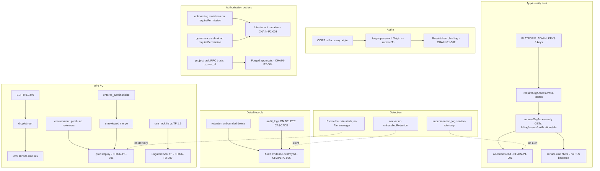

# Exploit Chain and Attack Path Audit

## Audit Metadata

- Audit name: `repo-deep-dive`
- Run: `20261002-0344-develop-6286137`
- Repository: `C:\temp\mainecybertech` (MCT Portal monorepo, origin `MaineCyberTech/mainecybertech`)
- Branch: `develop`
- Commit SHA: `62861370` (`6286137017c4b7c77e83ee420ec11382d984f263`; taken from `INDEX.md` / `audit_manifest.json` and the sibling reports — the `git` binary is not on `PATH` in this environment, so the SHA cannot be independently re-derived here; see Open Questions OQ-1)
- Generated at: 2026-10-02 (UTC)
- Auditor: principal-level repository auditor (subagent, prompt 45 — composition layer)
- Area code: CHAIN
- Output path: `docs/audits/repo-deep-dive/20261002-0344-develop-6286137/45_exploit_chain_attack_path_audit.md`
- Scope limitations:
  - **AUDIT-ONLY.** Exactly one file was written — this report. No attack, exploit, network action, destructive command, or state mutation was executed. All reasoning is static and read-only.
  - This prompt is the **composition layer**. It does **not** re-report single-domain findings. Every chain cross-references the domain finding IDs it composes (SEC, RLS, DATA, API, CI, INFRA, RES, TEST) and adds only the *composition*: prerequisites, ordered steps with per-step evidence, blast radius, and detection.
  - `git`, `node`, and `pnpm` are unavailable on the audit host, so CI scripts (`verify-rls.mjs`, `openapi-audit.js`, `check-docs-counts.mjs`) and any test/attack reproduction could not be executed. No live database, GHCR, DigitalOcean droplet, Supabase project, or GitHub environment was contacted.
  - GitHub-side effective state (environment protection rules, live branch protection, secret *values*, `RLS_*_ENABLED` contents) is not visible from the repository and is recorded as `Unknown`. Secret **values** were never read or printed; only key names/paths are cited.
  - Confidence is set by the **weakest step** in each chain; no chain is upgraded by assertion. Speculative steps are labelled `assumed`, with the evidence that would confirm them.

## Scope

Reviewed for composition at the run commit:

- **Sibling domain reports in this run** (read in full for their finding IDs and evidence paths): `06_security_authz_tenancy_audit.md`, `07_data_schema_migration_runtime_validation.md`, `37_supabase_rls_policy_deep_dive.md`, `08_api_contracts_realtime_integrations.md`, `10_github_actions_cicd_governance.md`, `12_infra_deployment_environment_drift.md`, `13_resilience_recovery_failure_modes.md`, `09_testing_quality_release_confidence.md`, and the run scaffold (`INDEX.md`, `audit_manifest.json`, `inventory.json`).
- **Primary evidence re-verified in the working tree** (not merely quoted from siblings): `apps/api/src/lib/roles.ts`, `apps/api/src/lib/permissions.ts`, `apps/api/src/middleware/org-access.ts`, `apps/api/src/lib/tenant.ts`, `apps/api/src/middleware/permissions.ts`, `apps/api/src/services/supabase.ts`, `apps/api/src/routes/auth.ts`, `apps/api/src/routes/client-onboarding-command-center.ts`, `apps/api/src/routes/governance.ts`, `apps/api/src/routes/sla.ts`, `apps/api/src/routes/search-portal.ts`, `apps/api/src/app.ts`; `apps/worker/src/tasks/retention.ts`; `supabase/migrations/5302130_project_task_rpc_user_id.sql`, `5302402`, `5302405`, `5302406`, `5302412`, `5302108`, `5302133`; `infra/terraform/digitalocean/{variables,firewall,providers}.tf`; `.github/workflows/deploy-do.yml`, `.github/workflows/terraform-do.yml`, `.github/branch-protection/main.json`, `AGENTS.md`.
- **Cross-file enumerations**: every route file containing `router.use(requireOrgAccess)` (42 files) and every `router.get(` on selected routers.

Not reviewed in depth: the full 127-migration text (owned by `07`/`37`), the full API contract surface (owned by `08`), supply-chain/licence depth (prompts 11/35, not in this run folder), container runtime internals (prompt 36), and the `24`/`25`/`26` access-control and tenant-simulation reports, which are listed as `pending` in `INDEX.md` and therefore unavailable to compose against.

## Evidence Reviewed

| Evidence | Type | Why relevant | Notes |
|---|---|---|---|
| `apps/api/src/lib/roles.ts:9-22` | Source | `PLATFORM_ADMIN_KEYS` = 8 keys incl. 6 MSP roles | Basis for the cross-tenant read-breadth chain |
| `apps/api/src/lib/permissions.ts:26` | Source | `ADMIN_BYPASS_KEYS = ["super_admin","admin"]` only | Divergence from `PLATFORM_ADMIN_KEYS` |
| `apps/api/src/middleware/org-access.ts:20-63,110-152,176-254` | Source | `requireOrgAccess` grants any `PLATFORM_ADMIN_KEYS` role access to every org; logs impersonation | Entry gate for cross-tenant chains |
| `apps/api/src/lib/tenant.ts:32-97` | Source | `assertResourceOrg`/`loadOwned` fail-closed unless platform-admin is org-agnostic | Bounds by-id IDOR; does not bound list reads |
| `apps/api/src/middleware/permissions.ts` | Source | `requirePermission` admin bypass = `admin/super_admin` only | So MSP roles still need real perms for writes |
| `apps/api/src/services/supabase.ts:163-186` | Source | `getScopedClient` empty allow-lists → service-role default | RLS bypassed by default; broken Terraform filesystem is deeper |
| `apps/api/src/routes/auth.ts:281-304` | Source | forgot-password `redirectTo` from `req.headers.origin ?? APP_BASE_URL` | Caller-controlled redirect |
| `apps/api/src/app.ts:90-108` | Source | CORS reflects any origin when `CORS_ORIGIN="*"`, `credentials: true` | Makes `Origin` attacker-settable cross-site |
| `apps/api/src/routes/client-onboarding-command-center.ts:29-30,129-241` | Source | 5 mutations; only `requireAuth`+`requireOrgAccess`; no `requirePermission` | Intra-tenant escalation composition |
| `apps/api/src/routes/governance.ts:180-206` | Source | `POST /change-requests/:id/submit` has no `requirePermission` | State transition bypass |
| `apps/api/src/routes/sla.ts:10`; `apps/api/src/routes/search-portal.ts` | Source | `requireOrgAccess`-only routers | Concrete cross-tenant read surfaces |
| `supabase/migrations/5302130_project_task_rpc_user_id.sql:18-136` | SQL | `approve_project_task`/`add_project_task_comment` trust `p_user_id`; no `auth.uid()` check; granted to `authenticated` | RLS-bypassing identity-spoof write primitive |
| `supabase/migrations/5302402:46`, `5302405:54`, `5302406:50`, `5302412:59` | SQL | Admin-delete gates use only `('admin','super_admin')` | RLS admin-gate regression (fails closed) |
| `supabase/migrations/5302108_fix_audit_logs_cascade.sql` | SQL | `audit_logs.organization_id` FK `ON DELETE CASCADE` | Audit-history destruction on org delete |
| `supabase/migrations/5302133_impersonation_log.sql` | SQL | `impersonation_log` RLS on, service_role-only policy | The one control that records cross-tenant access |
| `apps/worker/src/tasks/retention.ts:41-64` | Source | Unbounded `.delete()` on `audit_logs` (365d) / `notifications` (90d); returns `{ok:true}` on partial failure | Evidence/availability destruction |
| `infra/terraform/digitalocean/variables.tf:76-89` + `firewall.tf:19-23` | Terraform | `admin_ip_ranges` defaults to `0.0.0.0/0`+`::/0`; SSH rule uses it | Internet-wide SSH |
| `infra/terraform/digitalocean/providers.tf:2,16` | Terraform | `required_version >= 1.5` yet backend `use_lockfile = true` | Incompatible with pinned TF 1.9 |
| `.github/workflows/deploy-do.yml:272-278` | CI | Prod deploy uses `environment: prod` | No required reviewers per repo's own docs |
| `.github/workflows/terraform-do.yml:43,158,171,211` | CI | Pins `terraform_version: 1.9`; `prod-approval` env; never sets `admin_ip_ranges` | Gate + version pin |
| `.github/branch-protection/main.json:4,6,9` | Config | `Dependency Review` context; `enforce_admins:false`; `require_code_owner_reviews:false` | Merge-governance bypass |
| `AGENTS.md:59` | Doc | Repo's own statement that `prod`/`prod-approval` have no protection rules | Self-attestation of the missing gate |
| `apps/worker/src/main.ts` (grep `unhandledRejection`) | Source | Zero matches in worker | Silent worker-rejection chain |
| 42 route files with `router.use(requireOrgAccess)` | Enumeration | Broad cross-tenant entry surface for platform-admin roles | See Inventory |

## Verification Performed

| Check | Command / read | Result | Notes |
|---|---|---|---|
| Re-verify `PLATFORM_ADMIN_KEYS` vs `ADMIN_BYPASS_KEYS` divergence | Read `lib/roles.ts`, `lib/permissions.ts` | **supported** | 8 keys vs 2 keys; divergence real |
| Re-verify `requireOrgAccess` cross-tenant bypass | Read `middleware/org-access.ts` | **supported** | `isPlatformAdminKey` on any approved membership ⇒ access to any org, `logImpersonation` called |
| Re-verify onboarding router has no `requirePermission` | Read `routes/client-onboarding-command-center.ts`; grep `requirePermission` in file | **supported** | Zero `requirePermission` in the file; 5 mutations present |
| Re-verify governance `submit` unguarded | `Select-String requirePermission governance.ts` | **supported** | `:180` submit has none; `:206/239/268/297` do |
| Re-verify forgot-password `Origin` use | Read `routes/auth.ts:281-304` | **supported** | `req.headers.origin ?? APP_BASE_URL` still present |
| Re-verify CORS wildcard reflection | grep `CORS_ORIGIN` in `app.ts` | **supported** | `if (env.CORS_ORIGIN === "*") return cb(null, true);` with `credentials: true` |
| Re-verify project-task RPC identity trust | Read `5302130_...sql` | **supported** | Verifies `p_user_id` is an approved member only; no `auth.uid()` comparison; granted to `authenticated` |
| Re-verify RLS admin-gate regression | `Select-String "r.key in"` across 4 migrations | **supported** | 4 migrations gate on `('admin','super_admin')` only |
| Re-verify audit-log cascade | Read `5302108_...sql` | **supported** | `on delete cascade` |
| Re-verify retention unbounded delete | Read `tasks/retention.ts` | **supported** | No `.limit()`/batch; `return { ok: true }` regardless of errors |
| Re-verify SSH default open | Read `variables.tf:76-89`, `firewall.tf:19-23` | **supported** | Default `["0.0.0.0/0","::/0"]`; rule uses it |
| Re-verify terraform version/lockfile conflict | Read `providers.tf`; grep `terraform_version` in `terraform-do.yml` | **supported** | `use_lockfile = true` vs pin `1.9` (feature needs ≥1.10) |
| Re-verify prod deploy approval gate | Read `deploy-do.yml:272-278`; `AGENTS.md:59` | **partially supported** | Code attaches `environment: prod`; repo states it has no protection rules — live settings `Unknown` |
| Re-verify branch-protection gaps | Read `main.json` | **supported** | `enforce_admins:false`, `require_code_owner_reviews:false`, `Dependency Review` context |
| Enumerate `requireOrgAccess`-only routers | grep `router.use(requireOrgAccess)` | **42 files** | Concrete cross-tenant read-breadth surface |
| Probe selected read routers for unguarded GETs | `Select-String router.get` on billing/assets/notifications/memberships | **supported** | billing has 6 GETs vs 2 `requirePermission`; notifications has 0 `requirePermission` |
| Worker `unhandledRejection` handler | grep worker `src` | **not found** | Asymmetry with API confirmed |
| Execute any repo script / attack | n/a — not attempted | **not reproducible** | No `node`/`pnpm`; audit-only rule |

### Chain reproducibility summary

| Chain | Outcome at `62861370` | Weakest-step confidence | Basis |
|---|---|---|---|
| CHAIN-P1-001 low-trust MSP cross-tenant read | **supported** | High | `roles.ts` + `org-access.ts` + 42 routers enumerated |
| CHAIN-P1-002 forgotten-password redirect ATO assist | **partially supported** | Medium | Code confirmed; exploitability depends on Supabase redirect allowlist (`Unknown`) |
| CHAIN-P2-003 onboarding/governance intra-tenant capability escalation | **supported** | High | Router files read directly |
| CHAIN-P2-004 RPC identity spoofing | **supported (code)** / **partially supported (impact)** | High (code) / Medium (runtime) | SQL read; live `auth.uid()` behavior not exercisable |
| CHAIN-P2-005 RLS admin-gate regression ↔ API divergence | **supported** | High | 4 migrations + `roles.ts` |
| CHAIN-P2-006 evidence destruction (retention + cascade) | **supported** | High | `retention.ts` + `5302108` |
| CHAIN-P2-007 internet SSH → droplet takeover → service-role | **supported (config)** / **not reproducible (runtime)** | High (config) / Medium (runtime) | Terraform + compose + deploy workflow read |
| CHAIN-P1-008 unattended production change (CI-to-prod) | **partially supported** | Medium | Code confirmed; live protection state `Unknown` |
| CHAIN-P2-009 terraform pipeline broken → ungated infra change | **supported** | Medium | File evidence + external version docs; not executed |
| CHAIN-P2-010 silenced detection (worker + in-stack monitoring) | **supported** | High | grep + config read |

## Executive Summary

**Composition changes the risk picture.** Individually the current run's findings are dominated by P2s and a set of carried P1s, and the sibling reports correctly conclude there is **no single P0/P1 release blocker in any one domain**. But when the domain findings are stacked along real trust boundaries, they compose into **two P1 end-to-end paths and eight P2 paths** that are more consequential than any constituent finding:

1. **A low-trust MSP credential is a cross-tenant read pivot.** `PLATFORM_ADMIN_KEYS` (8 keys) grants org-agnostic traversal at the `requireOrgAccess` layer (`SEC-P2-002`), while `ADMIN_BYPASS_KEYS` (2 keys) constrains writes. Because **42 routers** call `router.use(requireOrgAccess)` and several expose `requireOrgAccess`-only GETs (billing invoices/payments, asset export, SLA, notifications), a leaked `dispatcher`/`onboarding-specialist` credential reads every tenant's financial and operational data. This is `SEC-P1-003` from the prior audit, **partially fixed on the write side only**.
2. **A CI-to-prod chain exists but is gated by a control that the repository says is not configured.** Prod deploys attach `environment: prod` (`deploy-do.yml:278`) which `AGENTS.md:59` says has no protection rules (`CI-P1-001`), and `enforce_admins:false` (`CI-P1-002`) means required checks can be bypassed. A merged-but-unreviewed change can therefore reach production and is deployed over internet-open SSH (`INFRA-P1-001`). The chain is *config-supported* but *runtime-unverified*; if the environment gate is unconfigured as the repo claims, it is a P1.
3. **Detection is the quietest failure.** Cross-tenant traversal *is* logged (`impersonation_log`), but that table is service-role-only (`5302133`) and its consumers/alerts are not established in-repo; worker rejections are unlogged (`RES-P2-001`); and Prometheus lives inside the domain it monitors with no Alertmanager (`INFRA-P2-003`, `RES-P2-005`). Several chains are effectively silent.

**Strengths worth stating:** the by-id IDOR family is genuinely closed (`loadOwned`/`assertResourceOrg` fail closed, `SEC-P1-002` marked partially-fixed); `requirePermission` is applied at 240 sites (`SEC-P1-001` verified-fixed); SSRF is guarded end-to-end (`SEC-P1-004`); webhook signature/dedup and idempotency are strong (`08`, `13`); RLS is enabled on 134/134 live tables (`37`); and the deploy path has a real health gate and auto-rollback (`12`). The composition risk is concentrated in **role-trust breadth, human gates, and detection**, not in missing core mechanics.

**Recommended next actions (hardening order — the single fixes that break the most chains):**
1. Split `PLATFORM_ADMIN_KEYS` into a full-bypass set (`admin`/`super_admin`) and a **distinct cross-tenant-read set requiring an explicit flag/membership**, or require per-tenant membership for MSP reads. This single change breaks CHAIN-P1-001 and de-fangs the chain's read blow-up. (`SEC-P2-002`)
2. Configure **required reviewers on the `prod` environment** (or repoint the deploy to a protected `prod-approval`) and set `enforce_admins: true`. This breaks CHAIN-P1-008. (`CI-P1-001`, `CI-P1-002`)
3. Restrict **`admin_ip_ranges`** to office/VPN CIDRs and make the variable required. This removes the internet-wide SSH precondition from CHAIN-P2-007. (`INFRA-P1-001`)

Then, in order: bind `p_user_id` to `auth.uid()` in the project-task RPCs (`RLS-P2-003`), add `requirePermission` to onboarding + governance submit (`SEC-P2-001`/`API-P2-001`), batch/bound the retention deletes and make them fail loudly (`DATA-P1-002`), and reconcile the RLS admin gates (`RLS-P2-001`).

**Verdict:** This is a well-built platform whose *individual* domains are largely production-ready (mostly 3.4–4/5) with a **composition score of 3/5 on entry-point control, 2/5 on CI-to-production and detection**. No chain is a *proven* live P0. Two chains reach P1 on their end goal — cross-tenant read via a low-trust internal role, and an unattended production change — and both hinge on trust-model/configuration decisions rather than bugs.

## Inventory

| Item | Path / symbol | Purpose | Current state | Risk | Notes |
|---|---|---|---|---|---|
| Platform role set | `apps/api/src/lib/roles.ts` `PLATFORM_ADMIN_KEYS` | Cross-tenant trust | 8 keys | High | Composed in CHAIN-P1-001 |
| Permission bypass set | `apps/api/src/lib/permissions.ts` `ADMIN_BYPASS_KEYS` | Write bypass | 2 keys | Med | Divergence is the composition risk |
| Cross-tenant gate | `middleware/org-access.ts` `requireOrgAccess` | Tenant entry | Grants platform keys any org; logs | High | Entry step for CHAIN-P1-001 |
| Resource scope helper | `lib/tenant.ts` `assertResourceOrg`/`loadOwned` | By-id scoping | Fail-closed | Low | Does not bound list reads |
| Scoped client | `services/supabase.ts` `getScopedClient` | RLS swap | Empty allow-lists → service-role | Med | RLS bypassed by default (`SEC-P2-005`) |
| Forgot-password | `routes/auth.ts:287` | Reset redirect | Uses `Origin` | Med | CHAIN-P1-002 |
| CORS | `app.ts:90-108` | Origin policy | Reflects `*` w/ credentials | Med | Amplifies chain 002 |
| Onboarding router | `routes/client-onboarding-command-center.ts` | 5 mutations | No `requirePermission` | Med | CHAIN-P2-003 |
| Governance submit | `routes/governance.ts:180` | State transition | No `requirePermission` | Med | CHAIN-P2-003 |
| Project-task RPCs | `5302130` | Approve/comment | Trust `p_user_id` | Med | CHAIN-P2-004 |
| RLS admin gates | `5302402/5302405/5302406/5302412` | Admin delete | Omit 6 MSP keys | Med | CHAIN-P2-005 (fails closed) |
| Retention task | `worker/src/tasks/retention.ts` | Purge | Unbounded; false `ok` | High | CHAIN-P2-006 |
| Audit FK | `5302108` | Org teardown | Cascade delete | High | CHAIN-P2-006 |
| Impersonation log | `5302133` | Cross-tenant audit | Service-role-only | Low | The single detection control |
| SSH firewall | `infra/.../variables.tf`+`firewall.tf` | Droplet ingress | `0.0.0.0/0` default | High | CHAIN-P2-007 |
| Prod deploy env | `deploy-do.yml:278` | Deploy gate | `environment: prod` | High | CHAIN-P1-008 |
| Branch protection | `.github/branch-protection/main.json` | Merge gate | `enforce_admins:false` | High | CHAIN-P1-008 |
| Terraform provider | `infra/.../providers.tf` | Backend/lock | `use_lockfile` vs TF 1.9 | High | CHAIN-P2-009 |
| Worker lifecycle | `worker/src/main.ts` | Rejections | No handler | Med | CHAIN-P2-010 |
| Monitoring | `infra/.../prometheus.rules.yml` | Alerts | No Alertmanager | Med | CHAIN-P2-010 |

## Domain Scorecard

| Category | Score | Evidence | Gap | Recommended action |
|---|---:|---|---|---|
| Entry points | 3 | 42 `requireOrgAccess` routers; public store/analytics surfaces on global IP limiter only | Platform-key breadth; unguarded onboarding/governance | Narrow platform trust; add guards |
| Authentication bypass chains | 4 | `middleware/auth.ts` HS256-pinned, bounded fallback; MFA opt-in | No full ATO chain found; forgot-password redirect is phishing-assist only | Fix `Origin` redirect |
| Privilege escalation chains | 2 | CHAIN-P1-001 cross-tenant read + CHAIN-P2-003 intra-tenant mutations | Low-trust role = cross-tenant read; unguarded mutations | Split role sets; wire `requirePermission` |
| Lateral movement paths | 3 | Compose caps, non-root, network internal; SSH world-open | Internet SSH; Redis caps/read-write rootfs | Restrict `admin_ip_ranges` |
| Data access and exfiltration paths | 3 | By-id IDOR fixed; service-role default; broad list reads | RLS bypassed by default; read breadth | RLS rollout; narrow reads |
| Supply-chain injection paths | 3 | All actions SHA-pinned; Trivy/audit/CodeQL; SBOM | Secret scanner misses DO/CF/Supabase tokens | Extend scanner (CI-P3-005) |
| CI-to-production paths | 2 | `validate` hard-fails; health gate + rollback | No working prod approval; admin bypass; broken TF pipeline | Configure reviewers; `enforce_admins:true` |
| Secret exposure chains | 3 | Secrets via `env:`, `printf`, `chmod 600`; no real values in tree | Redis password in args; 6 vars not delivered | Patch Redis/auth; deliver vars |
| Availability chains | 3 | Rate limits, timeout, breaker, health gate | No external dead-man's switch; unbounded retention delete | Off-droplet probe; batch deletes |
| Detection coverage | 2 | `impersonation_log`; Prometheus rules; audit events | No Alertmanager; worker rejections silent; service-role-only log | Route alerts; add worker handler |

## Detailed Review

### Item: Cross-tenant trust breadth (`PLATFORM_ADMIN_KEYS`)

- Evidence: `apps/api/src/lib/roles.ts:9-18`; `apps/api/src/middleware/org-access.ts:20-63,110-152`; 42 route files using `router.use(requireOrgAccess)`.
- What it does: Treats any of 8 role keys as cross-tenant at the org-access gate, independent of membership in the target org, and logs `platform_admin_cross_tenant_access` to `impersonation_log`.
- How it appears to work: A user with e.g. `dispatcher` approved in *any* org passes `checkOrgAccess` for *every* `organization_id`; `req.orgScope.platformAdmin = true`.
- Dependencies: memberships + roles tables; `impersonation_log` (service-role-only).
- Current controls: impersonation audit; write-side `requirePermission` (2-key bypass).
- Missing controls: read-side breadth; no `can_traverse_tenants` flag; no per-tenant read scoping.
- Risks: Mass cross-tenant read (CHAIN-P1-001).
- Recommended improvement: Split the constant; require membership or an explicit flag for MSP traversal.
- Suggested tests: As `dispatcher` (no org-B membership), call `GET /api/v1/billing/invoices?organization_id=<B>` → assert intended posture; assert `impersonation_log` row.
- Suggested docs: ADR for the MSP operating model.

### Item: CI-to-production change path

- Evidence: `.github/workflows/deploy-do.yml:272-278`; `.github/workflows/terraform-do.yml:158`; `.github/branch-protection/main.json:4,6,9`; `AGENTS.md:59`.
- What it does: On `main` push, builds images and SSH-deploys behind `validate` (hard) + `e2e-gate`/`migrate-gate` (prod only), attaching `environment: prod`.
- How it appears to work: The environment *could* pause for review, but the repo states `prod`/`prod-approval` have no protection rules; `enforce_admins:false` lets admins merge without checks.
- Dependencies: GHCR, droplet SSH, GitHub environment settings (invisible in repo).
- Current controls: `validate` hard-fail; health gate + auto-rollback; SHA-pinned images.
- Missing controls: working approval gate; admin-bypass audit.
- Risks: Unreviewed/unattended production change (CHAIN-P1-008).
- Recommended improvement: Configure required reviewers on `prod`; `enforce_admins:true`.
- Suggested tests: A prod deploy must pause at "Waiting for approval".
- Suggested docs: Correct `RELEASING.md`/`ROLLBACK_PROCEDURES.md` to match reality.

### Item: Detection surface

- Evidence: `5302133` (service-role-only log); `worker/src/main.ts` (no `unhandledRejection`); `infra/.../prometheus.rules.yml` (no Alertmanager); `AGENTS.md` known debt.
- What it does: Records cross-tenant access server-side; evaluates Prometheus rules in-stack.
- How it appears to work: `impersonation_log` is written by the API; nothing in-repo routes it to an alert, and the api-keys/routes for reviewing it were not established here.
- Dependencies: Alertmanager (absent), external probe (absent), log consumer (unknown).
- Current controls: audit writes; rule evaluation.
- Missing controls: delivery, external detector, worker rejection capture.
- Risks: Silent chains (CHAIN-P2-010).
- Recommended improvement: Deploy Alertmanager + external `/health` probe; add worker rejection handler.
- Suggested tests: Stop the worker; confirm an alert is delivered.
- Suggested docs: `docs/MONITORING_AND_ALERTING.md`.

## Chain Matrix

| ID | Entry | Steps (with evidence) | Prerequisites | Blast radius | Detection | Severity | Breaks with |
|---|---|---|---|---|---|---|---|
| CHAIN-P1-001 | Leaked low-trust MSP credential | 1) obtain JWT for `dispatcher`/`onboarding-specialist` (**assumed**: phishing/leak) → 2) any `requireOrgAccess` route with `?organization_id=<victim>` → 3) `checkOrgAccess` finds a platform key in *any* approved membership and grants access (`org-access.ts:43-59`) → 4) `requireOrgAccess`-only GETs return victim rows (billing `billing.ts:47-180`, assets `assets.ts:39`, notifications `notifications.ts:167`, sla `sla.ts:10`) via service-role client (`supabase.ts:163-186`) | Approved platform-key membership in ≥1 org; valid session; `RLS_READS_ENABLED` empty (default) | All tenants' financial + operational reads; single credential | `impersonation_log` row per cross-tenant hop (`org-access.ts:51-57`), service-role-only; **no in-repo alert** | P1 | Split `PLATFORM_ADMIN_KEYS`; require membership/flag for MSP traversal |
| CHAIN-P1-002 | Unauthenticated attacker + victim | 1) attacker sets `Origin: https://evil.example` and triggers `POST /auth/forgot-password` for victim (rate-limited per email/IP) → 2) `redirectTo = ${origin}/password-reset` (`auth.ts:287`) → 3) Supabase emails reset link → 4) token lands on attacker host → 5) ATO (**assumed**, gated by Supabase redirect allowlist) | Supabase redirect allowlist permissive/prefix-matching; victim clicks email | Single victim account (MSP or client) | `auth.forgot-password` audit event (`auth.ts:294-298`); no redirect-value alert | P1 | `redirectTo = APP_BASE_URL` only; validate `Origin` against CORS allowlist |
| CHAIN-P2-003 | Any approved tenant member (incl. read-only role) | 1) login → 2) `POST /governance/change-requests/:id/submit` (no `requirePermission`, `governance.ts:180`) → 3) status→`pending_review`; or `POST/PATCH/DELETE /client-onboarding*` (no `requirePermission`, `client-onboarding-command-center.ts:129-241`) | Membership in the tenant; UI hides action for low roles | Intra-tenant unauthorized mutation/approval-flow manipulation | `logAuditEvent` for governance submit; onboarding mutations audit weakly | P2 | Add `requirePermission` guards |
| CHAIN-P2-004 | Any approved member of org X | 1) direct PostgREST `POST /rest/v1/rpc/approve_project_task` with anon key + own JWT → 2) RPC verifies only that `p_user_id` is an approved member of X (`5302130:35-43`) → 3) writes `approved_by=<other member>` (RLS bypass via definer) | Approved membership in target org; RPC granted to `authenticated` | Forged approvals/comments; audit-trail integrity in one org | None in-repo for direct RPC; only project-task UI audit | P2 | Add `p_user_id <> auth.uid()` check or revoke `authenticated` |
| CHAIN-P2-005 | Platform admin (MSP role) | 1) API allows the write (`requirePermission` for admin/super_admin) → 2) RLS delete gate denies because gate lists only `admin/super_admin` (`5302402/5302405/5302406/5302412`) → 3) operation fails for MSP roles | `RLS_WRITES_ENABLED` includes affected module; user is MSP platform key | Availability/consistency for MSP admins; fails closed (no exposure) | 403/0-row only; no drift lint | P2 | Re-append 6 keys + drift lint |
| CHAIN-P2-006 | Attacker with tenant-delete or the daily job | (a) `retention` unbounded delete of `audit_logs`>365d / `notifications`>90d (`retention.ts:41-64`) returns `{ok:true}` on error; (b) org delete cascades `audit_logs` (`5302108`) | Service-role worker runs daily; or an org-delete path | Compliance/audit evidence destroyed; large DELETE can stall DB; false success masks failure | `logger.info` line only; no alert; no row-count assertion | P2 | Batch/bound + fail loudly; change FK to `SET NULL`/archive |
| CHAIN-P2-007 | Internet attacker on TCP 22 | 1) SSH reachable from anywhere (`variables.tf:88`, `firewall.tf:22`, CI never sets it) → 2) key theft/brute-force → 3) root shell → 4) read `/opt/mct-portal/.env` (`deploy-do.yml` writes it) incl. Supabase service-role key → 5) all-tenant DB access | Key-only auth; leaked/reused `CI_SSH_PRIVATE_KEY` (**assumed** vector) | Full platform + all tenant data; infra takeover | UFW/DO firewall (config); sshd logs on droplet; **no in-repo alert** | P2 (P1 if key leaked) | Restrict `admin_ip_ranges`; make variable required |
| CHAIN-P1-008 | Merged change (no review) | 1) admin merges to `main` with `enforce_admins:false` (`main.json:6`) bypassing checks → 2) `deploy-do` prod path attaches unprotected `prod` env (`deploy-do.yml:278`; `AGENTS.md:59`) → 3) SSH deploy over world-open SSH → 4) `.env` rewritten + compose up | Repo admin merge; env gate unconfigured | Unreviewed code + secrets path to production | Deploy logs; **no approval-prompt control**; no admin-bypass audit | P1 | Required reviewers on `prod`; `enforce_admins:true` |
| CHAIN-P2-009 | Infra change author / operator | 1) Terraform pinned to 1.9 (`terraform-do.yml:43,171,211`) vs `use_lockfile = true` (`providers.tf:16`) → 2) `terraform init` fails ("Unsupported argument") → 3) operators bypass CI with local unpinned TF → 4) un-gated firewall/DNS change | `use_lockfile` needs TF ≥1.10 (external doc) | IaC pipeline unusable; un-gated infra change; no effective state lock | CI job failure (if run manually); local runs unlogged | P2 | Bump TF to ≥1.10 or drop `use_lockfile` |
| CHAIN-P2-010 | Any actor causing a failure | 1) worker promise rejects → 2) no `unhandledRejection` handler (`worker/src/main.ts`) → 3) scheduled work silently dropped; and/or 4) service down → 5) Prometheus fires but no Alertmanager (`prometheus.rules.yml`) → 6) nobody is paged | Worker runs; monitoring is in-stack | Missed scans/notifications/webhook retries; longer MTTR | **Silent end-to-end** | P2 | Worker handler + external dead-man's switch + Alertmanager |

## Scenario / Control Matrix

| ID | Scenario or control | Evidence | Current control | Gap | Severity | Recommendation |
|---|---|---|---|---|---|---|
| CHAIN-001 | Entry points | 42 `requireOrgAccess` routers; public store/analytics | Auth + org gate | Platform-key breadth; unguarded mutations | P2 | Narrow trust; guard mutations |
| CHAIN-002 | Authentication bypass chains | `middleware/auth.ts` pinned; no bypass found | HS256 pin + bounded fallback | Forgot-password redirect is phishing, not bypass | P3 | Fix `Origin` redirect |
| CHAIN-003 | Privilege escalation chains | CHAIN-P1-001, CHAIN-P2-003 | `requirePermission` ×240 | MSP read breadth; onboarding/governance unguarded | P1 | Split roles; add guards |
| CHAIN-004 | Lateral movement paths | compose caps, non-root; SSH world-open | Container hardening | Internet SSH; Redis caps | P2 | Restrict `admin_ip_ranges` |
| CHAIN-005 | Data access and exfiltration paths | `getScopedClient`; `loadOwned` | By-id scoping fixed | Service-role default; broad list reads | P2 | RLS rollout; narrow reads |
| CHAIN-006 | Supply-chain injection paths | SHA-pinned actions; Trivy/audit/CodeQL | Strong pins + scans | Secret scanner token gaps | P3 | Extend scanner |
| CHAIN-007 | CI-to-production paths | `deploy-do.yml:278`; `main.json`; `terraform-do.yml` | `validate` hard-fail | No working prod approval; admin bypass; TF broken | P1 | Reviewers; `enforce_admins`; fix TF |
| CHAIN-008 | Secret exposure chains | `env:`+`printf`+`chmod 600` | Forwarded safely | Redis pw in args; 6 vars undelivered | P2 | Patch Redis; deliver vars |
| CHAIN-009 | Availability chains | rate-limit/timeout/breaker | Multi-layer | No external switch; unbounded delete | P2 | Off-droplet probe; batch deletes |
| CHAIN-010 | Detection coverage | `impersonation_log`; Prometheus | Audit + rules | No delivery; worker silent | P2 | Alertmanager; worker handler |

## Findings

### Finding ID: CHAIN-P1-001 - Low-trust MSP role key composes into a cross-tenant read pivot

- Severity: P1
- Confidence: High (code); Medium (exploitability requires a leaked credential — `assumed`)
- Area: Composition — privilege/tenant trust
- Evidence:
  - `apps/api/src/lib/roles.ts:9-18` — `PLATFORM_ADMIN_KEYS` = `super_admin, admin, dispatcher, engineer, security-analyst, project-manager, finance, onboarding-specialist`
  - `apps/api/src/lib/permissions.ts:26` — `ADMIN_BYPASS_KEYS = ["super_admin","admin"]` (writes constrained to 2 keys)
  - `apps/api/src/middleware/org-access.ts:43-59` — any approved membership whose role is a platform key grants `hasAccess` for every org and logs impersonation
  - `apps/api/src/middleware/org-access.ts:110-124,143-145` — an MSP role can set/keep any active org even without membership
  - 42 route files contain `router.use(requireOrgAccess)`; e.g. `routes/billing.ts:47-180` (6 GETs, 2 `requirePermission`), `routes/assets.ts:39` (`/export`), `routes/notifications.ts:167`, `routes/sla.ts:10`
  - `apps/api/src/services/supabase.ts:163-186` — with empty `RLS_READS_ENABLED` the read uses the service-role client, so no RLS backstop
- Composes: `SEC-P2-002` (inconsistent trust model), `SEC-P2-005` (RLS bypassed by default), `RLS-P3-001` (blanket anon DML baseline)
- What is happening: The composition turns a single low-trust internal role into an all-tenant read capability. The write blow-up from the prior audit (`SEC-P1-003`) is fixed; the **read** blow-up is not, and it is amplified by the default service-role client (RLS does not contain it).
- Why it matters: The chain's end goal is mass cross-tenant confidentiality loss from a credential that is not admin-grade.
- User / business impact: Any leaked `dispatcher`/`finance`/`onboarding-specialist` credential reads every client's billing, assets, notifications, and SLA data.
- Security / privacy / reliability impact: Multi-tenant data exposure via a shared internal role; incident scale is "all tenants".
- Recommended fix: Introduce an explicit `can_traverse_tenants` flag (or require membership) for MSP roles; keep full bypass for `admin`/`super_admin` only; document the model.
- Suggested validation: As `dispatcher` for org A with no org-B membership, call a `requireOrgAccess`-only GET for org B and assert the intended posture; assert `impersonation_log` entry.
- Owner suggestion: CTO/security lead (policy) + API team.
- Effort estimate: M (policy + code + tests).
- Dependencies: `SEC-P2-002` decision; `impersonation_log`.
- Status: open (by-design breadth; write side constrained).
- Endpoint / data path: `GET /api/v1/billing/invoices?organization_id=<victim>` → `requireOrgAccess` (platform key) → service-role query → all rows.
- Attack path: This is the CHAIN finding — see Chain Matrix row CHAIN-P1-001.

### Finding ID: CHAIN-P1-002 - Caller-controlled reset redirect composes into an account-takeover assist

- Severity: P1 (end goal) / P2 (likelihood)
- Confidence: Medium (depends on the Supabase redirect allowlist, `Unknown`)
- Area: Composition — authn/phishing
- Evidence:
  - `apps/api/src/routes/auth.ts:287` — `redirectTo: \`${req.headers.origin ?? getEnv().APP_BASE_URL}/password-reset\``
  - `apps/api/src/app.ts:101-107` — CORS `origin` callback reflects any origin when `CORS_ORIGIN="*"` with `credentials: true`, i.e. `Origin` is fully caller-controlled
  - `apps/api/src/routes/auth.ts:281-283` — reset is rate-limited per email/IP but requires no authentication
- Composes: `SEC-P2-003` (forgot-password `Origin`), `SEC-P3-002` (CORS wildcard)
- What is happening: The reset email's callback base is attacker-supplied. If the Supabase redirect allowlist is permissive, the emailed link points at an attacker host carrying a valid recovery token.
- Why it matters: Phishing with a *legitimate* email and a *valid* token → account takeover of MSP or client staff.
- User / business impact: Individual account takeover; MSP staff takeover escalates into CHAIN-P1-001.
- Security / privacy / reliability impact: ATO vector; the final step is `assumed` pending confirmation of the allowlist.
- Recommended fix: Use `APP_BASE_URL` only; if multi-domain is required, validate `Origin` against an explicit allowlist.
- Suggested validation: `Origin: https://evil.example` ⇒ generated `redirectTo` starts with `APP_BASE_URL`.
- Owner suggestion: API team.
- Effort estimate: S.
- Dependencies: Confirm Supabase redirect URLs (OQ-2).
- Status: still-open (carried).
- Endpoint / data path: `POST /api/v1/auth/forgot-password` → `supabase.auth.resetPasswordForEmail`.
- Attack path: CHAIN-P1-002 composed; the token-exfiltration→ATO step is `assumed` and would be confirmed by reading the Supabase Auth redirect configuration and issuing a test reset for an owned mailbox.

### Finding ID: CHAIN-P2-003 - Intra-tenant capability escalation via unguarded mutations

- Severity: P2
- Confidence: High
- Area: Composition — authorization outlier + state-machine bypass
- Evidence:
  - `apps/api/src/routes/client-onboarding-command-center.ts:29-30,129-241` — `requireAuth`+`requireOrgAccess` only; 5 mutations; the catalog module exists (`5302118`)
  - `apps/api/src/routes/governance.ts:180-206` — `POST /change-requests/:id/submit` has no `requirePermission` (approve/reject/implement/verify do)
  - Contrast: 240 `requirePermission` sites across 40 route files
- Composes: `SEC-P2-001`, `API-P2-001`
- What is happening: A read-only role that is an approved member can mutate onboarding records and submit change requests directly against the API, bypassing the UI gate.
- Why it matters: The composition is not cross-tenant, but it is the exact "UI-only RBAC" class the platform set out to eliminate, now isolated to these routers.
- User / business impact: Unauthorized record mutation and approval-flow manipulation inside a tenant; audit records the action as legitimate.
- Security / privacy / reliability impact: Intra-tenant privilege escalation; compliance-model inconsistency.
- Recommended fix: Add `requirePermission("client-onboarding-command-center", ...)` and `requirePermission("change-requests","edit")` on submit.
- Suggested validation: A role lacking the module permission receives 403 on these routes.
- Owner suggestion: API team.
- Effort estimate: S.
- Dependencies: Catalog keys exist.
- Status: open.
- Endpoint / data path: `POST /api/v1/governance/change-requests/:id/submit` → `change_requests.update`; onboarding mutations → `client_onboarding_command_center_records`.
- Attack path: CHAIN-P2-003 composed.

### Finding ID: CHAIN-P2-004 - Definer RPC identity trust composes into forged approvals/comments

- Severity: P2
- Confidence: High (code) / Medium (runtime impact)
- Area: Composition — security definer + identity spoofing
- Evidence:
  - `supabase/migrations/5302130_project_task_rpc_user_id.sql:18-68,70-136` — both RPCs verify only that `p_user_id` is an approved member of `p_organization_id`; no `p_user_id <> auth.uid()`; `grant execute ... to authenticated`
  - `5302129` hardened `mark_task_read` with exactly that caller-identity check — the fix was not applied here
  - `apps/api/src/routes/projects.ts` calls the RPC with `req.authUser.userId`, but the RPC is independently callable via PostgREST
- Composes: `RLS-P2-003`, `SEC-P1-006` (prior)
- What is happening: An approved member of org X can attribute an approval/comment to any other approved member of X through a definer write primitive that bypasses RLS.
- Why it matters: Audit-trail integrity breaks in an RLS-bypassing write path; the pattern is identical to one already fixed elsewhere.
- User / business impact: Forged approvals on project tasks; comments attributed to colleagues.
- Security / privacy / reliability impact: Bounded to orgs the attacker already belongs to; the impact is integrity/attribution, not confidentiality.
- Recommended fix: Add the `p_user_id is distinct from auth.uid()` guard to both functions (mirror `mark_task_read`), or revoke `authenticated`.
- Suggested validation: Authenticated RPC call with a foreign `p_user_id` → raises; with own id → succeeds.
- Owner suggestion: Backend/DB lead.
- Effort estimate: S.
- Dependencies: None.
- Status: open.
- Endpoint / data path: direct PostgREST `POST /rest/v1/rpc/approve_project_task`.
- Attack path: CHAIN-P2-004 composed (runtime behavior of `auth.uid()` under the service-role path is `assumed` until a live DB test).

### Finding ID: CHAIN-P2-005 - RLS admin-gate regression composes with the API trust model into MSP admin denials

- Severity: P2
- Confidence: High
- Area: Composition — API/RLS role-model divergence
- Evidence:
  - `supabase/migrations/5302402_knowledge_base.sql:46`, `5302405_hardware_staging.sql:54`, `5302406_device_profiles.sql:50`, `5302412_rls_approved_status_gap.sql:59` — delete gates list only `('admin','super_admin')`
  - `apps/api/src/lib/roles.ts:9-18` — 6 MSP keys are platform admins
  - `5302129` comment documents appending all 6 keys to 89 gates — the later migrations undid that
  - `apps/api/src/services/supabase.ts:163-186` — RLS enforced for allow-listed modules only
- Composes: `RLS-P2-001`
- What is happening: The API treats MSP roles as admins; RLS treats them as ordinary members on four tables' delete gates. The chain fails closed (denial), so it is not an exposure, but it is a silent consistency break that a drift could later flip.
- Why it matters: It shows the RLS role list and `PLATFORM_ADMIN_KEYS` can diverge undetected — the same divergence that drives CHAIN-P1-001 on the read side.
- User / business impact: MSP admins cannot delete affected rows (knowledge base/hardware/device) when the module is RLS-write-enabled.
- Security / privacy / reliability impact: Availability/consistency; no exposure.
- Recommended fix: Re-append the 6 keys via a `public.is_platform_admin_for_org(org_id)` helper; add a drift lint.
- Suggested validation: `engineer` delete succeeds; `client_user` denied; lint fails on an incomplete key list.
- Owner suggestion: Platform lead.
- Effort estimate: S.
- Dependencies: `PLATFORM_ADMIN_KEYS`; `verify-rls.mjs`.
- Status: open.
- Endpoint / data path: `DELETE /api/v1/knowledge-base/articles/:id` → RLS delete gate.
- Attack path: fails closed; the composition is a role-model drift counterpart to CHAIN-P1-001.

### Finding ID: CHAIN-P2-006 - Retention + cascade compose into silent destruction of audit evidence

- Severity: P2
- Confidence: High
- Area: Composition — data lifecycle + detection
- Evidence:
  - `apps/worker/src/tasks/retention.ts:41-64` — unbounded `.delete().lt("created_at", …)` on `audit_logs` (365d) and `notifications` (90d); errors are pushed to a string but the task still `return { ok: true }`
  - `supabase/migrations/5302108_fix_audit_logs_cascade.sql` — `audit_logs.organization_id` FK `ON DELETE CASCADE`
  - `supabase/migrations/5302416`/`5302133` — `impersonation_log` has no retention policy (`DATA-P2-006`)
- Composes: `DATA-P1-002`, `DATA-P2-005`, `DATA-P2-006`
- What is happening: Two independent paths erase audit history — a daily unbounded purge and an org-delete cascade — and the purge reports success even when it errored. The cross-tenant detection trail (`impersonation_log`) sits in the same class with no policy.
- Why it matters: The chain weakens the *detection* control that other chains depend on, and an unbounded DELETE can stall the primary DB.
- User / business impact: Compliance evidence older than a year and offboarding evidence disappear with no archive; nightly job can cause latency spikes.
- Security / privacy / reliability impact: Auditability loss + availability risk.
- Recommended fix: Batch/bound the deletes, return `{ok:false}` on error, add a count assertion; change the FK to `SET NULL` or archive; define retention for `impersonation_log`.
- Suggested validation: Fresh-vs-expired fixtures; error fixture → `ok:false`; org-delete test retains audit rows with `organization_id = null`.
- Owner suggestion: Backend/worker lead + data governance.
- Effort estimate: M.
- Dependencies: `DATA-P1-002`; governance decision.
- Status: open.
- Endpoint / data path: worker `retention` task → Supabase `audit_logs`/`notifications`.
- Attack path: CHAIN-P2-006 composed.

### Finding ID: CHAIN-P2-007 - Internet-open SSH composes into service-role exfiltration and tenant takeover

- Severity: P2 (escalates to P1 if a deploy key is leaked)
- Confidence: High (config) / Medium (runtime)
- Area: Composition — network exposure + secret concentration
- Evidence:
  - `infra/terraform/digitalocean/variables.tf:76-89` — `admin_ip_ranges` default `["0.0.0.0/0","::/0"]`
  - `infra/terraform/digitalocean/firewall.tf:19-23` — SSH inbound rule uses `var.admin_ip_ranges`
  - `.github/workflows/terraform-do.yml` tfvars step — never sets `admin_ip_ranges`
  - `.github/workflows/deploy-do.yml:282-289+` — the deploy writes `/opt/mct-portal/.env` (incl. `SUPABASE_SERVICE_ROLE_KEY`) over SSH
- Composes: `INFRA-P1-001`, `INFRA-P2-007` (Redis password in args on the same host), `SEC-P2-005` (service-role default)
- What is happening: The production host that holds the Supabase service-role key, integration secrets, and the Redis password is reachable on 22 from the whole internet; key-only auth is the sole barrier. The key-theft step is `assumed`.
- Why it matters: Reaching the droplet yields the service-role key → RLS bypass → all tenants.
- User / business impact: Full platform compromise and mass tenant-data exfiltration.
- Security / privacy / reliability impact: Single-factor control point over the highest-value secret store.
- Recommended fix: Set `admin_ip_ranges` from a GitHub secret; make the variable required with no default; verify the DO firewall source set after apply.
- Suggested validation: SSH from a non-allowed IP times out; from an allowed IP succeeds.
- Owner suggestion: platform/infrastructure.
- Effort estimate: S.
- Dependencies: `admin_ip_ranges` secret; avoid locking CI out mid-deploy.
- Status: still-open.
- Endpoint / data path: TCP 22 → sshd → root → `/opt/mct-portal/.env` → Supabase service role.
- Attack path: CHAIN-P2-007 composed; the key-theft step is `assumed` (no evidence of a leaked key in-repo).

### Finding ID: CHAIN-P1-008 - Branch-protection bypass + missing prod gate compose into unattended production change

- Severity: P1
- Confidence: Medium (repo evidence High; live GitHub protection state `Unknown`)
- Area: Composition — CI/CD governance
- Evidence:
  - `.github/branch-protection/main.json:6` — `enforce_admins: false`
  - `.github/branch-protection/main.json:9` — `require_code_owner_reviews: false`
  - `.github/branch-protection/main.json:4` — required context `Dependency Review` likely ≠ emitted `Dependency Review / review`
  - `.github/workflows/deploy-do.yml:272-278` — prod deploy attaches `environment: prod`
  - `AGENTS.md:59` — the repo states `prod`/`prod-approval` have no protection rules
  - `.github/workflows/terraform-do.yml:158` — the only approval concept (`prod-approval`) is used by Terraform, not the app deploy
- Composes: `CI-P1-001`, `CI-P1-002`, `CI-P2-003`
- What is happening: A repository admin can merge to `main` past required checks, and the app deploy has no human approval gate because the environment it uses is documented as unprotected. An unreviewed dependency or app change then deploys to production.
- Why it matters: This removes change control on the production branch — the composition of two "governance" findings into an operational path.
- User / business impact: An unreviewed or mistaken change (or a newly introduced vulnerability) reaches the whole production portal automatically.
- Security / privacy / reliability impact: Loss of a security control; combined with CHAIN-P2-007 it is a path to production code/infra change with no review.
- Recommended fix: Configure Required reviewers on `prod` (or repoint the deploy to a protected `prod-approval`); set `enforce_admins: true`; fix the dependency-review context; correct the three docs that claim the gate exists.
- Suggested validation: Dispatch prod deploy → pauses for approval; failing required check blocks both an admin and a non-admin.
- Owner suggestion: platform/operations (repo admin).
- Effort estimate: S (settings) + S (docs).
- Dependencies: Repository admin; decision on environment name.
- Status: open.
- Endpoint / data path: `main` push → `deploy-do.deploy` → SSH → `docker compose up`.
- Attack path: CHAIN-P1-008 composed; `assumed` that the live environment gate is indeed unconfigured (would be confirmed via GitHub environment settings).

### Finding ID: CHAIN-P2-009 - Terraform version/lockfile conflict composes into un-gated infrastructure change

- Severity: P2
- Confidence: Medium
- Area: Composition — IaC governance
- Evidence:
  - `infra/terraform/digitalocean/providers.tf:2,16` — `required_version = ">= 1.5"` with `use_lockfile = true`
  - `.github/workflows/terraform-do.yml:43,171,211` — `terraform_version: 1.9`
  - `scripts/install-terraform.ps1` — pins 1.9.8
  - External: `use_lockfile` requires Terraform ≥ 1.10
- Composes: `INFRA-P1-002`, `CI-P2-003`
- What is happening: The CI Terraform pipeline cannot initialize under the pinned version, so infra changes either fail or are run locally without the gates (`validate`/`e2e`/`migrate`) and without the intended locking. That reopens the path for an un-reviewed firewall/DNS change (e.g. modifying `admin_ip_ranges` behaviour) outside CI.
- Why it matters: The mechanism intended to make infra changes safe is inoperative, which weakens CHAIN-P2-007's remediation path.
- User / business impact: Infra changes require manual, un-gated runs; higher chance of outage from an unvalidated `.tf` edit.
- Security / privacy / reliability impact: Loss of CI safety net for the most privileged changes.
- Recommended fix: Bump `terraform_version` to ≥ 1.10 (and the lock/install script) or drop `use_lockfile`; restore a plan-only PR trigger.
- Suggested validation: CI `terraform init -backend=false` + `validate` passes at the pinned version.
- Owner suggestion: platform/infrastructure.
- Effort estimate: S.
- Dependencies: DO Spaces conditional-write support; `DO_API_TOKEN` rotation.
- Status: regressed.
- Endpoint / data path: `terraform-do.yml` → `terraform init` → DO Spaces backend.
- Attack path: none direct; the composition is the loss of the infra gate.

### Finding ID: CHAIN-P2-010 - Silent worker failures + in-stack monitoring compose into undetected degradation

- Severity: P2
- Confidence: High
- Area: Composition — detection/resilience
- Evidence:
  - `apps/worker/src/main.ts` — no `unhandledRejection` listener (grep `unhandledRejection` under `apps/worker/src` → 0)
  - `apps/api/src/main.ts:73-75` — the API has the log-and-continue handler the worker lacks
  - `infra/digitalocean/prometheus.rules.yml` + `docker-compose.yml` — rules (`MCTServiceDown`, `MCTHighRequestErrorRate`, `Watchdog`) evaluated in-stack with no Alertmanager/receiver
  - `apps/worker/src/health-server.ts` — worker `/health` returns 200 even when the queue is degraded
- Composes: `RES-P2-001`, `RES-P2-005`, `INFRA-P2-003`, `RES-P2-003` (queue-backend divergence)
- What is happening: Worker rejections are not captured, and even the alerts that *do* fire cannot reach a human because delivery is not deployed and the detector is inside the failed domain. A worker silently processing nothing looks healthy.
- Why it matters: This chain is the **detection backstop for every other chain** — if it is silent, CHAIN-P1-001 (impersonation hops), CHAIN-P2-006 (purge anomalies), and CHAIN-P2-007 (droplet events) lose their fastest signal.
- User / business impact: Missed scans, notifications and webhook retries; outages detected only by users.
- Security / privacy / reliability impact: Reliability + observability; detection-gap amplifier.
- Recommended fix: Add the worker `unhandledRejection` handler; deploy a digest-pinned Alertmanager with a real receiver; add an off-droplet `/health` probe; surface the active queue backend in health.
- Suggested validation: Rejected promise is logged/captured and the process continues; a synthetic service-down delivers an alert.
- Owner suggestion: implementation agent (worker) + platform (monitoring).
- Effort estimate: M.
- Dependencies: notification channel/secret.
- Status: open.
- Endpoint / data path: worker process lifecycle; Prometheus → (missing) Alertmanager.
- Attack path: none direct; the composition is loss of detection.

## Risks

| Risk | Severity | Likelihood | Impact | Evidence | Mitigation |
|---|---|---|---|---|---|
| Low-trust MSP credential reads all tenants | P1 | Medium (needs leak) | Mass confidentiality loss | `roles.ts`, `org-access.ts`, 42 routers | Split role sets (CHAIN-P1-001) |
| Reset-email redirect → ATO | P1 | Low–Medium (allowlist-dependent) | Account takeover | `auth.ts:287` | Use `APP_BASE_URL` (CHAIN-P1-002) |
| Unreviewed prod change | P1 | Medium | Whole-portal change without review | `deploy-do.yml:278`, `main.json:6`, `AGENTS.md:59` | Required reviewers; `enforce_admins` (CHAIN-P1-008) |
| Onboarding/governance unguarded mutations | P2 | Medium | Intra-tenant unauthorized writes | router files | Add `requirePermission` (CHAIN-P2-003) |
| Project-task RPC spoofing | P2 | Low–Medium | Forged approvals | `5302130` | Bind `p_user_id` to `auth.uid()` (CHAIN-P2-004) |
| Evidence destruction (purge + cascade) | P2 | Medium | Compliance loss; DB stall | `retention.ts`, `5302108` | Batch/fail-loud; archive (CHAIN-P2-006) |
| Internet SSH → droplet takeover | P2→P1 | Low (needs key) | All-tenant takeover | `variables.tf:88`, `firewall.tf:22` | Restrict CIDRs (CHAIN-P2-007) |
| Terraform pipeline broken → un-gated infra | P2 | High | Unvalidated infra change | `providers.tf:16`, `terraform-do.yml:43` | Bump TF / drop lockfile (CHAIN-P2-009) |
| Detection silent | P2 | High | Longer MTTR; chains unnoticed | worker main, prometheus config | Alertmanager + handler (CHAIN-P2-010) |
| RLS/API role-model drift | P2 | Medium | MSP admin denials; future exposure | 4 migrations vs `roles.ts` | Drift lint (CHAIN-P2-005) |

## Recommendations

### Immediate / Release Blocking

1. **CHAIN-P1-001** — Decide the MSP trust model and split `PLATFORM_ADMIN_KEYS` so low-trust MSP roles cannot traverse tenants on reads (require membership or a `can_traverse_tenants` flag). This is the single highest-leverage change.
2. **CHAIN-P1-008** — Configure Required reviewers on the `prod` environment (or repoint the deploy to a protected `prod-approval`) and set `enforce_admins: true`; correct the three docs that assert the gate exists.

### This Week

3. **CHAIN-P1-002** — Use `APP_BASE_URL` for the reset `redirectTo`; validate `Origin` against the CORS allowlist.
4. **CHAIN-P2-003** — Add `requirePermission` to the onboarding mutations and governance `submit`.
5. **CHAIN-P2-004** — Bind `p_user_id` to `auth.uid()` in the project-task RPCs.
6. **CHAIN-P2-005** — Re-append the 6 MSP keys to the four regressed RLS admin gates and add a drift lint.

### This Month

7. **CHAIN-P2-006** — Batch/bound retention deletes, return `{ok:false}` on error, add a count assertion, and change the `audit_logs` FK to `SET NULL`/archive; define retention for `impersonation_log`.
8. **CHAIN-P2-007** — Restrict `admin_ip_ranges` and make the variable required.
9. **CHAIN-P2-009** — Bump Terraform to ≥ 1.10 (or drop `use_lockfile`); restore a plan-only PR trigger.
10. **CHAIN-P2-010** — Add the worker `unhandledRejection` handler; deploy Alertmanager + an off-droplet health probe.

### Later / Platform Evolution

11. Execute the incremental RLS rollout so the service-role default (`SEC-P2-005`) stops being the composition amplifier for read chains.
12. Add a route-guard coverage test (mutating routes must carry a recognized guard).
13. Bind `docs/openapi.yaml` to commit and gate `EXTRA` spec entries (`API-P3-002`).

## Quick Wins

| Quick win | Why it helps | Files likely involved | Validation |
|---|---|---|---|
| Fix reset `redirectTo` to `APP_BASE_URL` | Breaks CHAIN-P1-002 | `routes/auth.ts` | Unit test with evil `Origin` |
| Guard onboarding + governance submit | Breaks CHAIN-P2-003 | `routes/client-onboarding-command-center.ts`, `routes/governance.ts` | Permission test → 403 |
| Add `p_user_id` identity check | Breaks CHAIN-P2-004 | new migration | RPC test with foreign id raises |
| Re-append the 6 MSP keys to 4 gates | Removes drift (CHAIN-P2-005) | new migration | `engineer` delete succeeds |
| Add worker `unhandledRejection` handler | Removes silent failures (CHAIN-P2-010) | `worker/src/main.ts` | Rejection test |
| Make retention return `ok:false` on error | Surfaces purge failure (CHAIN-P2-006) | `worker/src/tasks/retention.ts` | Error-fixture test |

## Hardening Backlog

| Backlog item | Priority | Owner suggestion | Effort | Dependency |
|---|---|---|---|---|
| Split `PLATFORM_ADMIN_KEYS` / add traversal flag | P1 | Security lead + API | M | Product/security decision |
| Configure `prod` reviewers; `enforce_admins:true` | P1 | Repo admin | S | Repo admin access |
| Bind `p_user_id` to `auth.uid()` in RPCs | P2 | Backend/DB | S | — |
| Guard onboarding + governance mutations | P2 | API | S | Catalog keys |
| Batch/bound retention + archive audit | P2 | Backend/worker + governance | M | Retention decision |
| Restrict `admin_ip_ranges` | P2 | Platform | S | CIDR secret |
| Bump Terraform / drop `use_lockfile` | P2 | Platform | S | DO Spaces support |
| Alertmanager + external probe + worker handler | P2 | Platform + worker | M | Channel secret |
| RLS rollout (per-module allow-lists) | P2 | Platform + DB | L | Policy completeness |
| RLS role-gate drift lint | P2 | Platform | S | `verify-rls.mjs` |

## Suggested Tests

- **Authz (unit):** a role lacking `client-onboarding-command-center:*` gets 403 on all five onboarding mutations; a role lacking `change-requests:edit` gets 403 on `submit`.
- **Cross-tenant (integration):** as `dispatcher` with no membership in org B, request a `requireOrgAccess`-only GET for org B and assert the intended posture (currently allow+log; target: deny unless flagged); assert `impersonation_log` entry.
- **RPC (DB):** authenticated `approve_project_task` with another member's `p_user_id` raises; with own id succeeds.
- **Reset redirect (unit):** `Origin: https://evil.example` ⇒ `redirectTo` starts with `APP_BASE_URL`.
- **Retention (unit):** fresh-vs-expired fixtures purge only expired rows; error fixture ⇒ `{ok:false}`; assert row counts returned.
- **RLS matrix (DB):** anon / approved / pending / other-org / MSP admin / service_role allow/deny matrix for `project_tasks`, `knowledge_base_articles`, `hardware_staging_checks`, `device_profiles` (and the CHAIN-P1-001 read tables).
- **RLS lint (CI):** fail any `r.key in (...)` admin gate that omits a `PLATFORM_ADMIN_KEYS` member; fail any raw `memberships` subquery without `status='approved'`.
- **Terraform (CI):** `terraform init -backend=false` + `validate` at the pinned version must pass (currently expected to fail).
- **Approval gate (manual):** dispatch a prod deploy and confirm it pauses at "Waiting for approval"; confirm a failing required check blocks an admin merge.
- **Detection (manual):** stop the worker and confirm an alert is delivered; fire a synthetic rejected promise in the worker and confirm it is captured.
- **Deploy (manual):** `curl` prod `/health` from outside the droplet; assert it detects a whole-droplet outage.

## Suggested Documentation Updates

- **New** `docs/adr/ADR-0xx-msp-tenant-traversal.md` — the decided trust model for `PLATFORM_ADMIN_KEYS`, the `can_traverse_tenants` flag, and which routes are cross-tenant-readable.
- `docs/RLS-rollout.md` — add "always use `is_org_member`"; document the enabled-module manifest (non-secret) and the platform-admin role list.
- `docs/RELEASING.md`, `docs/ROLLBACK_PROCEDURES.md`, `README.dev.md` — correct the production approval claim to the actual state.
- `docs/API_PERMISSION_MODEL.md` (new) — describe `requirePermission`, per-org resolution, the admin/super_admin bypass, and the modules that intentionally do not use it.
- `docs/MONITORING_AND_ALERTING.md` — state that Prometheus rules are evaluated but not delivered; add the external-probe plan.
- `docs/DB_FUNCTIONS.md` (new) — SECURITY DEFINER inventory with the authz contract per function (`approve_project_task`, `add_project_task_comment`, `mark_task_read`, `bulk_update_with_version`).
- `docs/MIGRATIONS.md` — destructive-migration policy and the Terraform version floor.
- `docs/ENVIRONMENT_VARIABLES.md` — the six deploy-undelivered vars and the Redis password-in-args caveat.

## Open Questions

| Question | Why it matters | Evidence needed |
|---|---|---|
| Is the full commit SHA `6286137017c4b7c77e83ee420ec11382d984f263`? | Binds every chain to a revision | `git rev-parse HEAD` on a host with git |
| What is the Supabase Auth redirect allowlist? | Decides whether CHAIN-P1-002 is exploitable | Supabase dashboard / project config |
| Are GitHub `prod`/`prod-approval` environments actually unprotected? | Decides whether CHAIN-P1-008 is P1 or already mitigated | GitHub environment settings |
| Are `prod` environment secrets (`SUPABASE_*`, `JWT_SECRET`) present? | The repo states the prod deploy cannot succeed without them | GitHub environment secrets list |
| What is in `RLS_READS_ENABLED`/`RLS_WRITES_ENABLED`? | Determines whether RLS contains any read chain | GitHub secrets (names only in repo) |
| Is `impersonation_log` consumed by any alert/dashboard? | Determines whether CHAIN-P1-001 is detected | Search for consumers of `impersonation_log` / monitoring config |
| Is `CORS_ORIGIN` set to `*` in production? | Amplifies CHAIN-P1-002 | Deployed env value |
| Are worker task `{ok:false}`/`ok:true` results wired to alerting? | Determines CHAIN-P2-006/010 detection | `apps/worker/src/consumer-*.ts`, monitoring |
| Where do the pending `24`/`25`/`26` reports land? | They own access-control and tenant-simulation depth | Sibling reports when generated |

## Appendix

### A. Chain → domain finding cross-reference

| Chain | Composes (domain finding IDs) |
|---|---|
| CHAIN-P1-001 | SEC-P2-002, SEC-P2-005, RLS-P3-001, (prior SEC-P1-003) |
| CHAIN-P1-002 | SEC-P2-003, SEC-P3-002 |
| CHAIN-P2-003 | SEC-P2-001, API-P2-001 |
| CHAIN-P2-004 | RLS-P2-003, (prior SEC-P1-006) |
| CHAIN-P2-005 | RLS-P2-001 |
| CHAIN-P2-006 | DATA-P1-002, DATA-P2-005, DATA-P2-006, (prior DATA-P1-003) |
| CHAIN-P2-007 | INFRA-P1-001, INFRA-P2-007, SEC-P2-005 |
| CHAIN-P1-008 | CI-P1-001, CI-P1-002, CI-P2-003 |
| CHAIN-P2-009 | INFRA-P1-002, CI-P2-003 |
| CHAIN-P2-010 | RES-P2-001, RES-P2-003, RES-P2-005, INFRA-P2-003 |

### B. Attack-path inventory (entry → end goal)

| Entry point | Reachable end goal | Chain |
|---|---|---|
| Leaked MSP credential | Cross-tenant read of all tenants | CHAIN-P1-001 |
| `POST /auth/forgot-password` (unauthenticated) | Account takeover (allowlist-dependent) | CHAIN-P1-002 |
| Approved tenant member (read-only role) | Intra-tenant unauthorized mutation | CHAIN-P2-003 |
| Approved member of an org | Forged approvals/comments | CHAIN-P2-004 |
| MSP platform admin | (Denied) admin operation under RLS | CHAIN-P2-005 |
| Daily worker job / org delete | Audit-evidence destruction | CHAIN-P2-006 |
| Internet TCP 22 | Full platform takeover via service-role key | CHAIN-P2-007 |
| Merged change (admin) | Unattended production deploy | CHAIN-P1-008 |
| Infra author (local TF) | Un-gated infra change | CHAIN-P2-009 |
| Any failure event | Undetected degradation | CHAIN-P2-010 |

### C. Mermaid — composed attack-path overview

### D. Destructive / state-mutating tooling encountered (never run)

Per the shared safety rules, the following state-mutating paths were inventoried along the attack paths and were **not executed**:

- `apps/worker/src/tasks/retention.ts` — deletes rows from `audit_logs`/`notifications` (CHAIN-P2-006).
- `apps/worker/src/tasks/orphan-cleanup.ts` — deletes storage objects (`DATA-P2-003`).
- `supabase/migrations/5302406`, `5302407` — `drop table ... cascade` not transaction-wrapped (`DATA-P2-002`).
- `.github/workflows/deploy-do.yml` — SSH deploy that rewrites `/opt/mct-portal/.env` and restarts compose (CHAIN-P1-008).
- `.github/workflows/terraform-do.yml` — firewall/DNS/changes; currently broken (`INFRA-P1-002`).
- `infra/terraform/digitalocean/firewall.tf` — controls network exposure (CHAIN-P2-007).

### E. Hardening order (single fixes that break the most chains)

1. **Split `PLATFORM_ADMIN_KEYS`** → breaks CHAIN-P1-001 and removes the read amplifier shared with CHAIN-P2-007.
2. **Configure `prod` reviewers + `enforce_admins:true`** → breaks CHAIN-P1-008 and de-fangs CHAIN-P2-009's un-gated path.
3. **Restrict `admin_ip_ranges`** → removes CHAIN-P2-007's precondition.
4. **Bind `p_user_id` to `auth.uid()`** → breaks CHAIN-P2-004.
5. **Batch/fail-loud retention + archive audit** → breaks CHAIN-P2-006 and restores the detection substrate CHAIN-P1-001 relies on.
