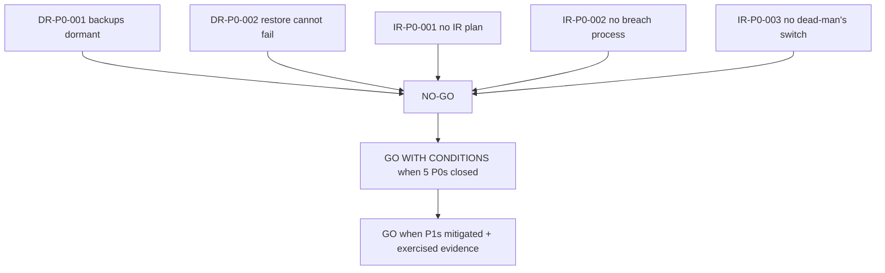

# Executive Summary and Release Gate

## Audit Metadata

- Audit name: `repo-deep-dive`
- Run: `20261002-0344-develop-6286137`
- Repository: `C:\temp\mainecybertech`
- Branch: `develop`
- Commit SHA: `62861370` (full: `6286137017c4b7c77e83ee420ec11382d984f263`)
- Default branch: `main` (`origin/HEAD -> origin/main`, `main..develop` = **662** commits)
- Generated at: 2026-10-02
- Auditor: principal-level repository auditor — prompt 23 synthesis over 25 sibling domain reports
- Area code: `EXEC`
- Output path: `docs/audits/{name}/{run}/23_executive_summary_release_gate.md`
- Companion artifacts: `EXECUTIVE_SUMMARY.md`, `RELEASE_GATE.md` (this file)
- Scope limitations:
  - This is a **synthesis pass**. It does not re-audit domains; it aggregates the 25 sibling reports at `6286137` and re-verifies the two headline P0s directly (see § Verification Performed).
  - `22_final_risk_register_roadmap.md` and a consolidated `risk_register.md` were **not present** at synthesis time. Counts here are aggregated from domain reports, not from the register; the register may refine them.
  - No live system, GitHub settings, Supabase plan tier, or secret store was accessed. Several reconciliation questions are owner-held (see § Open Questions).
  - Prior-run reports were used only as a reconciliation baseline; no prior finding was copied.

---

## Scope

**Reviewed.** All 25 domain reports in this run folder (`06`–`45`), plus the two companion artifacts `backup_restore_drill_plan.md` and `incident_tabletop_scenarios.md`, the run `INDEX.md`/`audit_manifest.json`/`inventory.json`, and — for reconciliation — the repo's own program documents (`AGENTS.md`, `docs/RELEASING.md`, `docs/audits/comprehensive-audit/2026-08-26/report.md`, and historical `docs/*AUDIT*`, `docs/*REVIEW*`).

**Re-verified directly at the audited commit** (not merely transcribed):
- `.github/workflows/db-backup.yml` and `db-restore-test.yml` exist on `develop`.
- `git ls-tree main --name-only .github/workflows/` does **not** list either file → they are absent from the default branch.
- `git rev-list --count main..develop` = **662**.
- `.github/workflows/db-restore-test.yml:51-57` prints counts and echoes success; line 56 ends in `|| true`.
- `docs/RELEASING.md:103-105` and `AGENTS.md:59` acknowledge scheduled runs "only fire from the default branch and recent backup runs have failed."

**Not reviewed.** Source line-by-line re-audit of every domain (delegated to siblings); live host/service state; GitHub repository settings, environment protection rules, Actions run history; Supabase plan tier; actual secret values (never printed).

---

## Evidence Reviewed

| Evidence | Type | Why relevant | Notes |
|---|---|---|---|
| 25 sibling domain reports in this run folder | Reports | Aggregate risk counts, strengths, blockers | Read in full for summaries, scorecards, findings, statuses |
| `32_backup_restore_drill.md` + `backup_restore_drill_plan.md` | Report + plan | Source of `DR-P0-001/002` | Both re-verified against workflows |
| `33_incident_tabletop_exercise.md` + `incident_tabletop_scenarios.md` | Report + scenarios | Source of `IR-P0-001/002/003` | Confirmed absence of platform IR/breach docs |
| `45_exploit_chain_attack_path_audit.md` | Report | Composition risk | Two P1 chains, eight P2 chains; no proven live P0 |
| `06/24/25/26/31/37` | Reports | Tenant-isolation / access control | `SEC-P1-003` partially fixed; trust-model inconsistency |
| `10/34` | Reports | CI/CD + branch protection | Human-gate axis weakest; `CHAIN-P1-008` |
| `12` | Report | Infra drift | `INFRA-P1-002` regressed (Terraform version) |
| `11/35/36/38` | Reports | Supply chain / secrets / container | Materially improved; provenance + license gaps |
| `09/13/27/29/30` | Reports | Testing / resilience / webhooks / billing / notifications | Strong code-side remediation |
| `AGENTS.md:52,59`, `docs/RELEASING.md:98-105` | Program docs | Reconciliation | Program already tracks dormant backups + prod-env gaps |
| `docs/audits/comprehensive-audit/2026-08-26/report.md` | Prior audit | Reconciliation | Verdict: "NOT production-ready as documented" |
| `docs/ARCHITECTURAL_AUDIT_COMPLETE.md`, `docs/MEGA_AUDIT_2026-06-18.md`, `docs/FULL_SYSTEM_AUDIT_2026-06-09.md`, `docs/CODE_REVIEW_2026-06-16.md` | Historical reviews | Reconciliation | "Near/ready" verdicts from a superseded architecture era |
| `prompts/repo-deep-dive/20260806-1722-develop-75d3926/*` | Prior run | Continuity | No release-gate file existed in that run |

---

## Verification Performed

| Evidence | Type | Why relevant | Notes |
|---|---|---|---|
| `git ls-tree main .github/workflows/` | Command output | Whether scheduled workflows run | `db-backup.yml`/`db-restore-test.yml` **absent** → `supported` (P0) |
| `git rev-list --count main..develop` | Command output | Divergence magnitude | `662` → `supported` |
| `db-restore-test.yml:51-57` | Source read | Whether restore can fail | No assertion; `\|\| true`; unconditional success echo → `supported` (P0) |
| Sibling report claims (headline verdicts) | Report self-consistency | Trustworthiness of synthesis inputs | Treated as domain evidence; spot-checked against repo where cited |
| Program docs vs audit findings | Reconciliation | Contradiction check | Audit **confirms** program-declared debt; no contradiction |
| Severity-count aggregation | Aggregate check | Risk counts | **Derived by manual tally from finding headers; not re-derived from the register** (register absent). Marked as approximate. |

**Verification-discipline notes.**
- The two headline P0s are `supported` at the audited commit by direct repository evidence.
- The remaining P0s (`IR-P0-001/002/003`) are **absences**; per shared rules these are `supported` by directory/file inventory (no `INCIDENT_RESPONSE`/`BREACH` doc; no Alertmanager service; `Watchdog` rule with no receiver).
- Per-domain scorecards and statuses are the siblings' verified claims; this synthesis did not reproduce each. Where a sibling states `verified-fixed`, that claim is **unverified by this pass** and should be read with the sibling's own evidence.
- No review/approval/sign-off artifact in this run is a first-party produced artifact; the gate below is an **audit opinion**, not a program verdict (§ Reconciliation).

---

## Executive Summary

MaineCyberTech Portal is a strong, actively-remediated multi-tenant MSP operations platform. The code-side domains are largely production-ready (mostly 3.4–4/5), and this run records a **large, genuine remediation delta** since the 2026-08-06 audit. However, this run surfaces **five P0 findings, all in operations/preparedness**, and they share one root cause: **controls exist on paper or on a non-default branch but have never been exercised end-to-end.**

The decisive facts (`supported` at `6286137`):
1. **Backups are dormant.** `db-backup.yml`/`db-restore-test.yml` exist only on `develop`; GitHub schedules fire from `main`; `main` lacks both files and is 662 commits behind. No other scheduler performs the dump.
2. **The restore test cannot fail.** It prints counts and echoes success; `_migrations` ends in `|| true`.
3. **No platform IR plan, no breach-notification process, and no independent dead-man's switch** (Prometheus is in-domain; `Watchdog` has no receiver).

Because unresolved P0s exist, the required special check mandates **NO-GO** as the audit opinion. This is a *hardening gate*, not a claim that the product is broken: the platform's code and CI are among the strongest reviewed, and the blockers are closeable quickly.

**Strengths:** RLS on 134/134 live tables; API-enforced RBAC at ~240 sites; fail-closed by-id helpers; SSRF/webhook/idempotency/circuit-breaker controls with tests; 397 suites + coverage gates + contract tests + a11y gate; SHA-pinned supply chain with a hard prod dependency gate; health-gated deploy with auto-rollback; and honest internal documentation of its own debt.

**Biggest risks:** dormant/unverified disaster recovery; absent incident/breach process; in-domain-only detection; trust-model inconsistency across platform-admin key sets; unenforced human/governance gates; and a regressed Terraform version contradiction that will break CI.

**Recommended next actions:** (1) make backups run from `main` and capture a green artifact; (2) make the restore test assert and fail; (3) write platform IR + breach docs; (4) stand up an off-box dead-man's switch; (5) close trust-model, branch-protection, SSH, and Terraform gaps.

---

## Inventory

| Item | Path / symbol | Purpose | Current state | Risk | Notes |
|---|---|---|---|---|---|
| Daily backup workflow | `.github/workflows/db-backup.yml` | pg_dump → S3/Spaces | On `develop` only; **absent on `main`** | **P0** | Never scheduled |
| Weekly restore test | `.github/workflows/db-restore-test.yml` | Restore newest dump | On `develop` only; **cannot fail** | **P0** | `\|\| true`; no assertions |
| Platform IR plan | (none) | Roles/severity/comms/postmortem | **Absent** | **P0** | IR-P0-001 |
| Breach response doc | (none) | Detect→contain→assess→notify | **Absent** | **P0** | IR-P0-002 |
| External dead-man's switch | `prometheus.rules.yml` `Watchdog` | Off-box liveness | Rule exists, **no receiver** | **P0** | IR-P0-003 |
| RLS | migrations + `verify-rls.mjs` | Tenant isolation | Enabled 134/134; admin-gate regression | P1/P2 | `37` |
| RBAC | `middleware/permissions.ts` | API permission enforcement | ~240 sites | P1 | `06/24` |
| Platform-admin keys | `lib/roles.ts` `PLATFORM_ADMIN_KEYS` | Cross-tenant trust | 8 keys vs 2 bypass keys | P1 | `CHAIN-P1-001` |
| Branch protection | `.github/branch-protection/*.json` | Required checks/reviews | `enforce_admins:false`; phantom context | P1 | `34/BP-P1-001..003` |
| Prod env gate | `deploy-do.yml` `environment: prod` | Manual approval | No protection rules (per repo) | P1 | `CHAIN-P1-008` |
| Terraform locking | `providers.tf` `use_lockfile` | State lock | Requires ≥1.10; workflows pin 1.9 | P1 (regressed) | `INFRA-P1-002` |
| SSH exposure | `admin_ip_ranges` | Admin access | Defaults `0.0.0.0/0` | P1 | `INFRA-P1-001` |
| Backup encryption/offsite | `scripts/backup-database.sh` | Data at rest | No SSE/KMS; single region | P1 | `DR-P1-003` |
| Storage backup | `documents`/`avatars`/`logos` | Client uploads | **No backup** | P1 | `DR-P1-001` |
| Notification preferences | `notification_preferences` | Consent | Stored, never enforced | P1 | `NOTIF-P1-001` |
| Entitlement gating | `client-portal.ts` | Plan enforcement | Advisory only | P1 | `BILL-P1-001` |
| SBOM provenance | `generate-sbom.mjs` | Supply chain | 30-day artifact; unsigned | P1 | `36/SBOM-P1-002` |

---

## Domain Scorecard

Scores for the top-level synthesis categories (0–5 per shared rules). Domain scores are the siblings' own; the synthesis-level rows reflect the executive/gate view.

| Category | Score | Evidence | Gap | Recommended action |
|---|---:|---|---|---|
| Current state | 3 | 25 reports; code domains 3.4–4/5; ops domains 1.8–3/5 | Code strong, ops weak | Ship code; gate on ops |
| Strengths | 4 | RLS 134/134; RBAC ~240 sites; tests/CI/supply chain; auto-rollback | None material | Preserve; avoid churn |
| Biggest risks | 2 | 5 P0s (2 DR, 3 IR); trust-model; unattended-prod chain | DR, IR, detection, human gates | Immediate ops sprint |
| Release blockers | 1 | Unresolved P0s → NO-GO | Backups dormant; no IR/breach/dead-man's switch | Close before broad rollout |
| Business/security/ops/UX impact | 2 | Data-loss exposure; breach-notification gap; silent outages | Customer/insurer/regulatory exposure | Fund ops hardening |
| Investment recommendation | 4 | High remediation velocity; fixable, non-architectural P0s | 2-week ops sprint needed | Continue investing |
| Next actions | 4 | Sibling reports list file-level fixes with owners/effort | Sequencing across 18 domains | Execute per RELEASE_GATE conditions |
| Risk counts/themes | 3 | ~5 P0 / ~45–50 P1 / ~90+ P2 / ~40+ P3 (approximate) | Register not yet published | Reconcile against prompt-22 register |

---

## Detailed Review

### Item: Backup automation (`db-backup.yml`, `scripts/backup-database.sh`)

- Evidence: `.github/workflows/db-backup.yml`; `scripts/backup-database.{sh,ps1}`; `docs/CI.md:5`; `docs/RELEASING.md:103-105`.
- What it does: Daily `pg_dump` → gzip → `s3://mainecybertech-backups/database-backups/`, 30-day retention.
- How it appears to work: `schedule:` cron `0 4 * * *` on the workflow.
- Dependencies: `SUPABASE_DB_URL`, AWS secrets (matrix marks Prod-only); presence on the default branch.
- Current controls: Script implemented; Slack-on-failure step (best-effort, `|| true`).
- Missing controls: Reachability from `main`; encryption; offsite copy; independent "no recent backup" detector.
- Risks: `DR-P0-001` (dormant), `DR-P1-003` (unencrypted/single-region), `DR-P2-001` (alert can't be trusted).
- Recommended improvement: Put workflows on `main` (or add a `main` dispatcher, or an external scheduler); add SSE/KMS + second region; add external staleness check.
- Suggested tests: Scheduled run produces an S3 object; a deleted Slack webhook surfaces the failure; a stale-backup simulation fires the external check.
- Suggested docs: `docs/CI.md`, `docs/RELEASING.md` (state the default-branch requirement), `docs/RTO_RPO.md`.

### Item: Restore verification (`db-restore-test.yml`)

- Evidence: `.github/workflows/db-restore-test.yml:44-57`.
- What it does: Downloads newest backup, restores into temp `postgres:16-alpine`, prints counts.
- How it appears to work: Would prove recoverability weekly.
- Dependencies: `S3_BACKUP_BUCKET` (format undocumented — `DR-P1-002`); default-branch presence.
- Current controls: `set -euo pipefail` on the restore step (catches a broken pipe only).
- Missing controls: Any assertion; failure alert; tenant-isolation re-check; pinned image.
- Risks: `DR-P0-002` (cannot fail), `DR-P1-002`, `DR-P1-004` (no alert), `IR-P1-004`.
- Recommended improvement: Assert a committed table/migration baseline; assert critical-table row counts; re-run RLS semantics; remove `|| true`; fail on mismatch; add `if: failure()`.
- Suggested tests: A truncated dump must fail the workflow; a good dump must pass all assertions.
- Suggested docs: `docs/RTO_RPO.md`, `docs/runbooks/backup-disaster-recovery.md`.

### Item: Incident response (`IR-P0-001/002`)

- Evidence: no `docs/INCIDENT_RESPONSE.md`/`POSTMORTEM`/`ONCALL`/`BREACH` file; `docs/MONITORING_AND_ALERTING.md` §7–8; product-feature IR docs under `docs/modules|features|runbooks/…incident-response.md`.
- What it does: Nothing platform-level; the nearest seed is a 16-step monitoring-doc checklist.
- Missing controls: Severity taxonomy, incident-commander/comms/scribe roles, comms templates, postmortem requirement, breach detect→contain→assess→notify process, evidence preservation.
- Risks: `IR-P0-001`, `IR-P0-002`.
- Recommended improvement: `docs/INCIDENT_RESPONSE.md` + `docs/templates/POSTMORTEM.md` + `docs/DATA_BREACH_RESPONSE.md`; link from `docs/INDEX.md` and `SECURITY.md`; cross-link `SECRETS_ROTATION.md` emergency rotation.
- Suggested tests: Timed tabletop using only the new docs; breach tabletop "service-role key read across tenants".
- Suggested docs: As above.

### Item: Detection & dead-man's switch (`IR-P0-003`)

- Evidence: `infra/digitalocean/prometheus.rules.yml` header (Alertmanager required); no `alertmanager` service in `docker-compose.yml`; `Watchdog` `expr: vector(1)` with no receiver; `docs/MONITORING_AND_ALERTING.md` §7.
- What it does: Prometheus scrapes the API internally; rules exist; delivery does not.
- Missing controls: Off-box receiver; off-droplet uptime monitor; backup/restore/worker/RLS alerts.
- Risks: `IR-P0-003`; and silent failures across several chains (`45`).
- Recommended improvement: Deploy Alertmanager with an external receiver; route `Watchdog`; add an off-droplet synthetic endpoint; add alerts for worker health, RLS regressions, audit gaps, dead-letters, backup staleness.
- Suggested tests: Stop Prometheus/Alertmanager; confirm the external receiver fires within N minutes.
- Suggested docs: `docs/MONITORING_AND_ALERTING.md`.

### Item: Trust model & governance gates (`CHAIN-P1-001/008`, `BP-P1-*`, `INFRA-P1-*`)

- Evidence: `lib/roles.ts` `PLATFORM_ADMIN_KEYS` (8) vs `lib/permissions.ts` `ADMIN_BYPASS_KEYS` (2); `deploy-do.yml:278` `environment: prod`; `.github/branch-protection/main.json` `enforce_admins:false` + `Dependency Review` context with no emitting job; `admin_ip_ranges` default; `providers.tf` `use_lockfile` vs Terraform 1.9 pins.
- Risks: cross-tenant read pivot; unattended production change; internet-wide SSH; CI breakage.
- Recommended improvement: Split the key sets (or require per-tenant membership for MSP reads); require reviewers on `prod` + `enforce_admins:true`; fix the phantom required check; restrict `admin_ip_ranges`; align Terraform version with `use_lockfile`.
- Suggested tests: org-B probe cannot read org-A rows; an unreviewed merge is blocked from prod; `terraform init` succeeds in CI.
- Suggested docs: `docs/ROLLBACK_PROCEDURES.md`, deployment handbook (reconcile contradiction, `IR-P1-001`).

---

## Scenario / Control Matrix

| ID | Scenario or control | Evidence | Current control | Gap | Severity | Recommendation |
|---|---|---|---|---|---|---|
| EXEC-001 | Current state | 25 sibling reports; `INDEX.md` | Broad, improving code estate | Ops/preparedness half weak | — | Gate on ops, not code |
| EXEC-002 | Strengths | `06/09/11/12/36/37` | Real, tested, CI-enforced controls | Avoid churn | — | Preserve |
| EXEC-003 | Biggest risks | `32/33/45` | Individual domains production-ready | Composition + ops gaps | P0/P1 | Fix top 5 |
| EXEC-004 | Release blockers | `32/33` P0s | None exercised | Backups dormant; no IR/breach/dead-man's switch | P0 | NO-GO until closed |
| EXEC-005 | Business/security/ops/UX impact | `32/33/37/45` | Strong code security | Data-loss + breach-notification exposure | P0/P1 | Fund ops sprint |
| EXEC-006 | Investment recommendation | This run vs `75d3926` | High remediation velocity | Non-architectural P0s | — | Continue investing |
| EXEC-007 | Next actions | Sibling reports | File-level fixes with owners | Cross-domain sequencing | P0/P1 | Follow § Recommendations |
| EXEC-008 | Risk counts/themes | Finding headers | ~5 P0 / ~45–50 P1 / ~90+ P2 / ~40+ P3 | Register not published | — | Reconcile with prompt 22 |

---

## Findings

This synthesis raises **consolidation findings** only. Domain findings (`DR-*`, `IR-*`, `SEC-*`, etc.) live in their sibling reports and are the authoritative records; the IDs below are executive-level roll-ups and must not be used to close a domain finding.

### Finding ID: EXEC-P0-001 - Unresolved P0s block a broad release: disaster recovery is dormant, incident/breach process is absent, and monitoring has no independent receiver

- Severity: P0
- Confidence: High
- Area: Executive / release gate
- Evidence:
  - `32_backup_restore_drill.md` — `DR-P0-001`, `DR-P0-002` (re-verified in § Verification Performed).
  - `33_incident_tabletop_exercise.md` — `IR-P0-001`, `IR-P0-002`, `IR-P0-003`.
  - Direct re-verification: `git ls-tree main .github/workflows/`; `git rev-list --count main..develop` = 662; `db-restore-test.yml:51-57`.
- What is happening: Five unresolved P0 findings, all requiring exercised evidence to close, exist at the audited commit.
- Why it matters: The required special check is "NO-GO if unresolved P0." A gate cannot be granted on assurances; per shared rules, assertions and intentions do not close findings.
- User / business impact: Potential tenant-data loss; delayed/undefined breach notification; prolonged undetected outages.
- Security / privacy / reliability impact: Availability, integrity, and confidentiality controls are non-functional or undetected.
- Recommended fix: Close `DR-P0-001/002` and `IR-P0-001/002/003` per their reports; attach artifacts (green scheduled run, failing-on-bad-dump proof, IR/breach docs, receiver test).
- Suggested validation: See each finding's validation and `backup_restore_drill_plan.md` / `incident_tabletop_scenarios.md`.
- Owner suggestion: Platform/ops lead + security reviewer
- Effort estimate: M (aggregate, ~2 weeks focused)
- Dependencies: Default-branch policy; Supabase plan confirmation; choice of external receiver.
- Status: open
- Attack path: none identified as a single exploit; composition chains are `CHAIN-P1-001/008` (`45`).

### Finding ID: EXEC-P1-001 - Domain reports agree there is no single-domain P0/P1 *code* blocker, but composition and governance axes remain P1

- Severity: P1
- Confidence: High
- Area: Executive / composition
- Evidence: `45_exploit_chain_attack_path_audit.md` (two P1 chains, eight P2); `06` verdict "next release can ship" for its domain; sibling verdicts 3.4–4/5.
- What is happening: Individually the code domains are sound; composition (role-trust breadth, human gates, detection) is the residual P1 band.
- Why it matters: Stakeholders may read per-domain "no P0" as "safe to ship everywhere," missing composition risk.
- User / business impact: Cross-tenant read of financial/operational data via a leaked low-trust credential; unattended production change.
- Security / privacy / reliability impact: Confidentiality and change-control risk.
- Recommended fix: Apply the three highest-leverage single fixes in `45` (split platform-admin keys; protect `prod` env + `enforce_admins:true`; restrict `admin_ip_ranges`).
- Suggested validation: Multi-tenant probe; blocked unreviewed prod merge; SSH reachability test.
- Owner suggestion: Platform lead + security
- Effort estimate: M
- Dependencies: Owner decisions on trust model and GitHub environments.
- Status: open
- Attack path: `CHAIN-P1-001`, `CHAIN-P1-008`, `CHAIN-P2-007`.

### Finding ID: EXEC-P1-002 - Progress is real but "configured ≠ exercised" recurs across DR, IR, secrets, and drills

- Severity: P1
- Confidence: High
- Area: Executive / verification discipline
- Evidence: `32` (drills unexercised), `33` (rotation/drill unexercised), `38` (rotation log single row), `13` (detector-in-domain).
- What is happening: Controls exist as documents/scripts with no artifact proving a real exercise.
- Why it matters: Un-exercised controls produce false assurance until an incident.
- Recommended fix: Institutionalize a drill cadence with recorded artifacts (see `backup_restore_drill_plan.md`, `incident_tabletop_scenarios.md`).
- Suggested validation: Dated drill artifacts in the run folder / ledgers.
- Owner suggestion: Ops lead
- Effort estimate: M
- Status: open

### Finding ID: EXEC-P2-001 - Remediation introduced two regressions and CI/documentation drift

- Severity: P2
- Confidence: High
- Area: Executive / change hygiene
- Evidence: `12` (`INFRA-P1-002` regressed, `INFRA-P3-009` regressed), `09`/`20` (doc drift: a11y 19 vs 25, stale repo path), `35` (`docs/CI.md` "Blocking" mislabel).
- What is happening: Fixes landed without a guard against regressing or drifting the surrounding docs/pipeline.
- Recommended fix: Add guards (`check-docs-counts.mjs` coverage; a Terraform-version/feature lint) and a regression check to the PR gate.
- Suggested validation: CI fails when the version/feature pair is incompatible; a11y count guard trips on drift.
- Owner suggestion: Platform eng
- Effort estimate: S
- Status: open

### Finding ID: EXEC-P3-001 - Synthesis-level count reconciliation pending the prompt-22 register

- Severity: P3
- Confidence: Medium
- Area: Executive / counts
- Evidence: `22_final_risk_register_roadmap.md`/`risk_register.md` absent at synthesis time.
- What is happening: Counts here are manually tallied from finding headers.
- Recommended fix: Reconcile EXEC counts with the published register; state N/A/exclusions.
- Owner suggestion: Audit operator
- Effort estimate: S
- Status: open

---

## Risks

| Risk | Severity | Likelihood | Impact | Evidence | Mitigation |
|---|---|---|---|---|---|
| Dormant automated backups | P0 | High (already true) | Total tenant-data loss on incident | `DR-P0-001`; git verification | Reach `main`; capture green run |
| Restore test cannot fail | P0 | High | False DR assurance | `DR-P0-002`; `db-restore-test.yml:56` | Assert + fail on bad dump |
| No platform IR plan | P0 | High | Inconsistent, slow response | `IR-P0-001` | Write `INCIDENT_RESPONSE.md` |
| No breach-notification process | P0 | Medium | Regulatory/contractual exposure | `IR-P0-002` | Write `DATA_BREACH_RESPONSE.md` |
| No off-box dead-man's switch | P0 | Medium | Silent total outage | `IR-P0-003` | Alertmanager + external receiver |
| Cross-tenant read pivot | P1 | Medium | Confidentiality loss | `CHAIN-P1-001` | Split key sets |
| Unattended production change | P1 | Medium | Unreviewed prod change | `CHAIN-P1-008` | Protect `prod`; `enforce_admins:true` |
| SSH open to internet | P1 | Medium | Host compromise | `INFRA-P1-001` | Restrict `admin_ip_ranges` |
| Terraform lock/version break | P1 | High | CI failure on any TF run | `INFRA-P1-002` | Align version or feature |
| No storage backup | P1 | Medium | Permanent loss of client files | `DR-P1-001` | Versioning/export |
| Unencrypted single-region dumps | P1 | Medium | Mass exposure / provider-risk | `DR-P1-003` | SSE/KMS + second region |
| Preferences not enforced | P1 | High | Privacy/consent breach | `NOTIF-P1-001` | Enforce in send paths |
| Entitlement not enforced | P1 | High | Revenue/feature leakage | `BILL-P1-001` | Server-side guard |

---

## Recommendations

### Immediate / Release Blocking

1. **Make backups reachable from `main` and capture a green scheduled run** (`DR-P0-001`). Options: merge the two workflows to `main`; add a `main` dispatcher via `workflow_dispatch`/`workflow_call`; or run from an external scheduler.
2. **Make the restore test assert and fail** (`DR-P0-002`): committed table/migration baseline, critical-table rows, tenant-isolation re-check; remove `|| true`; prove failure on a truncated dump.
3. **Write `docs/INCIDENT_RESPONSE.md`** (severity SEV1–5, roles, containment, comms templates) **+ `docs/templates/POSTMORTEM.md`** (`IR-P0-001`).
4. **Write `docs/DATA_BREACH_RESPONSE.md`** (`IR-P0-002`): detection sources, containment (rotate/revoke/disable), assessment, notification, breach register.
5. **Deploy Alertmanager + an off-box receiver** and route the `Watchdog` rule; add an off-droplet uptime check (`IR-P0-003`).

### This Week

6. Split `PLATFORM_ADMIN_KEYS` / require per-tenant membership for MSP reads (`SEC-P2-002`, `CHAIN-P1-001`).
7. Require reviewers on the `prod` environment (or repoint to `prod-approval`) and set `enforce_admins:true`; fix the phantom `Dependency Review` required check (`CI-P1-001/002`, `BP-P1-001/002`, `CHAIN-P1-008`).
8. Restrict `admin_ip_ranges` to office/VPN CIDRs and make the variable required (`INFRA-P1-001`).
9. Fix the Terraform `use_lockfile`/version contradiction (`INFRA-P1-002`).
10. Restore-backup hardening: SSE/KMS + second-region copy (`DR-P1-003`); add restore-failure alert (`DR-P1-004`); document the `S3_BACKUP_BUCKET` contract (`DR-P1-002`).
11. Enforce notification preferences and add delivery observability (`NOTIF-P1-001/003`).
12. Add a server-side entitlement guard (`BILL-P1-001`).

### This Month

13. Storage backup/versioning for `documents`/`avatars`/`logos` (`DR-P1-001`).
14. Bad-migration reverse path + rehearsal (`DR-P1-005`, `IR-P1-002`); split RPO by method and validate (`DR-P1-006`).
15. Runtime RLS-regression detection + a behavioral RLS allow/deny matrix test (`IR-P1-006`, `RLS-P3-002`).
16. Image-level Trivy scan, image SBOM/attestation, and base-image digest refresh automation (`36`).
17. License allow/deny gate + `docs/LICENSE_POLICY.md` (`SBOM-P1-001`).
18. Worker `unhandledRejection` handler; task DLQ; `QUEUE_BACKEND` default fix (`13`).
19. Secret history scan; wire `M365_CLIENT_STATE` and remove dead `M365_WEBHOOK_SECRET` config (`SECRET-P1-001/002`, `WH-P1-002`).
20. Reconcile rollback docs and the deployment handbook (`IR-P1-001`).

### Later / Platform Evolution

21. Establish a recurring drill cadence with recorded artifacts (DR + IR + secret rotation + RLS).
22. Re-sync or clearly mark vendored audit prompt packs; add machine-checkable agent guardrails (`AI-P1-001/002`).
23. Publish the all-report risk register/roadmap (prompt 22) and reconcile EXEC counts against it.

---

## Quick Wins

| Quick win | Why it helps | Files likely involved | Validation |
|---|---|---|---|
| Remove `\|\| true` and add baseline assertions | Converts a no-op into a real test | `.github/workflows/db-restore-test.yml` | Workflow fails on truncated dump |
| Add `if: failure()` Slack/Sentry to restore test | Makes failure visible | `.github/workflows/db-restore-test.yml` | Forced failure notifies |
| Add `INCIDENT_RESPONSE.md` skeleton + postmortem template | Gives responders a single doc | `docs/INCIDENT_RESPONSE.md`, `docs/templates/POSTMORTEM.md` | Tabletop using only the doc |
| Set `enforce_admins:true` | Removes admin bypass of checks | `.github/branch-protection/main.json` | Unreviewed admin merge blocked |
| Restrict `admin_ip_ranges` default | Narrows SSH exposure | `infra/terraform/.../variables.tf`, `terraform-do.yml` | Firewall shows CIDR only |
| Add `S3_BACKUP_BUCKET` format validation step | Kills the silent-mismatch trap | `.github/workflows/db-restore-test.yml` | Malformed secret fails early |
| Guard the a11y count | Stops silent doc drift | `scripts/check-docs-counts.mjs` | Guard trips on 19-vs-25 drift |

---

## Hardening Backlog

| Backlog item | Priority | Owner suggestion | Effort | Dependency |
|---|---|---|---|---|
| Backups on default branch + green run | P0 | Platform/ops | S–M | Default-branch policy; secrets |
| Restore-test assertions + alert | P0 | Platform/backend | S | Table baseline |
| Platform IR plan + postmortem template | P0 | Platform lead | M | Severity/comms agreement |
| Breach-response process | P0 | Security/legal | M | IR-P0-001 |
| External dead-man's switch | P0 | Platform eng | M | Receiver choice |
| Platform-admin trust-model split | P1 | Security/platform | M | Membership model |
| Prod environment protection + admin enforcement | P1 | Platform eng | S | GitHub settings access |
| `admin_ip_ranges` restriction | P1 | Platform eng | S | Office/VPN CIDRs |
| Terraform version/locking fix | P1 | Platform eng | S | Version decision |
| Backup encryption + second region | P1 | Platform/security | M | KMS/second destination |
| Storage backup/versioning | P1 | Platform/backend | M | Supabase plan |
| Notification preference enforcement | P1 | Backend | M | Preferences model |
| Entitlement enforcement | P1 | Backend | M | Plan mapping |
| Image scan/SBOM/attestation | P1 | Supply-chain | M | Registry access |
| License policy gate | P1 | Legal/eng | S | Policy decision |
| Migration reverse + drill | P1 | Backend/platform | M | Throwaway project |
| Worker resilience (rejection/DLQ) | P1 | Backend | S–M | Queue config |
| Secret history scan + M365 wiring | P1 | Security/platform | S–M | Secret access |
| RLS regression detection + matrix test | P1 | Security/platform | M | Multi-tenant seeds |
| Drill cadence + evidence | P2 | Ops | M | Drill plan |

---

## Suggested Tests

- **Unit:** assertion helpers for restore baselines; entitlement guard middleware; notification-preference enforcement; key-set trust-model unit tests.
- **Integration:** restore test against a deliberately truncated dump (must fail) and a good dump (must pass); backup→restore round-trip in staging asserting the restore reads the object the backup just wrote.
- **E2E:** multi-tenant org-B probe cannot read org-A rows on every RLS-enabled module; unreviewed prod deploy is blocked.
- **CI:** Terraform version/feature compatibility; a11y-count guard; license allow/deny; image Trivy gate; required-check context resolution.
- **Security:** firewall reachability (SSH not internet-exposed); secret history scan; break-glass/rotation drill.
- **Regression:** `CHAIN-P1-001` key-split regression; `INFRA-P1-002` version regression.
- **Manual validation:** DR drill (D1/D2 per `backup_restore_drill_plan.md`); IR tabletop (power loss, disk full, feed corruption, key compromise); stop-Prometheus dead-man's-switch test.

---

## Suggested Documentation Updates

Create:
- `docs/INCIDENT_RESPONSE.md`
- `docs/templates/POSTMORTEM.md`
- `docs/DATA_BREACH_RESPONSE.md`
- `docs/LICENSE_POLICY.md`

Update:
- `docs/CI.md` (default-branch scheduling requirement; remove "Blocking" mislabel)
- `docs/RELEASING.md` (correct the scheduling implication; reconcile rollback steps)
- `docs/RTO_RPO.md` (split RPO by method; record measured drill values)
- `docs/ROLLBACK_PROCEDURES.md` / `FINAL_DEPLOYMENT_OPERATIONS_HANDBOOK.md` (remove contradiction)
- `docs/MONITORING_AND_ALERTING.md` (Alertmanager/receiver; new alerts)
- `docs/SECRETS_ROTATION.md` (add webhook/M365/Turnstile/metrics/encryption keys; drill artifact)
- `AGENTS.md` / `review.md` (stale path; a11y count — keep mirrored and CI-guarded)
- `docs/INDEX.md`, `SECURITY.md` (link the new IR/breach docs)

---

## Open Questions

| Question | Why it matters | Evidence needed |
|---|---|---|
| Have scheduled backups ever run from this repo? | "Dormant now" vs "never worked" | Actions run history for `db-backup` |
| Is PITR enabled on the prod Supabase plan? | 5-min RPO depends on it | Plan/feature confirmation |
| Are `prod`/`prod-approval` protection rules set? | `CHAIN-P1-008` severity hinges on it | GitHub environment settings |
| Are `RLS_READS/WRITES_ENABLED` non-empty in prod? | If empty, tenant findings read under service-role default | GitHub secrets/state (redacted) |
| What is the canonical backup bucket variable shape? | `DR-P1-002` silent mismatch | Secret format / owner decision |
| Which external receiver will be adopted? | `IR-P0-003` closure path | Owner decision |

---

## Reconciliation With Existing Verdicts

**This section discharges the prompt-23 extended check and profile §9. The gate in this document is an audit opinion. It does not grant, revoke, or replace any program verdict, gate, review, adoption, or sign-off. Reconciliation is a recommendation to the program's own review/adoption flow.**

### Prior audit-run verdicts

| Source | Verdict / position | Basis | Audit-run delta |
|---|---|---|---|
| `docs/audits/repo-deep-dive/20260806-1722-develop-75d3926/*` (9 reports) | **No release-gate file exists** in that run; per-domain verdicts were improving (e.g. `06` "next release can ship"; `12` improved materially) | Domain reports only | This run is the **first** to publish an `EXEC` release-gate opinion. The prior run's domain-level "can ship" views are **not contradicted** for their own domains; this run adds the cross-domain operations view that produces NO-GO. |
| `docs/audits/comprehensive-audit/2026-08-26/report.md` | **"NOT production-ready as documented"** (7 P0 / 11 P1 / 14 P2 / 9 P3; security + doc-staleness focused) | Independent codebase audit | **Consistent in tone** (not production-ready), **different in cause**. That audit's P0s were code/security/doc issues (stored XSS, test-mode authz bypass, weak JWT, phantom workflows); this run's P0s are operations/preparedness (DR/IR). Several of its code P0s are **not visible in this run as P0s**, implying remediation — a positive delta. |

### Program documents with standing positions

| Source | Standing position | Audit-run delta | Recommended reconciliation |
|---|---|---|---|
| `docs/ARCHITECTURAL_AUDIT_COMPLETE.md:14` | "well-engineered, production-oriented"; findings "all resolved" | Predates the current architecture (AWS/ECS references); this run agrees on engineering quality but finds unresolved P0s of a different class | Treat as **historical**; not a current release verdict. Do not revoke. |
| `docs/MEGA_AUDIT_2026-06-18.md:13,86,1003` | "near-production-ready" | Superseded; predates current deploy/RLS state | Historical context only. |
| `docs/FULL_SYSTEM_AUDIT_2026-06-09.md:35,902` and `docs/CODE_REVIEW_2026-06-16.md:15,1131-1152` | "near production-ready" / "ready to deploy once two issues fixed" | Superseded; different architecture era | Historical context only. |
| `README.md:41-54` ("Production-ready now") | Claims production-ready components | Contradicted by this run's P0s if read as a blanket release statement | **Recommend** README scope the claim to *code/components* and link the current audit; do not act on the README as a verdict. |

### The delta, stated plainly

- **Direction of travel is positive.** Every domain that had a prior finding reports a large remediation delta; six of six prior supply-chain findings are resolved/partial; the prior RLS-critical hole is closed; RBAC enforcement is now API-layer.
- **This gate does not contradict the prior per-domain "can ship" views — it adds the missing whole-system operations view.** A domain being shippable is not the same as the *program* being releasable; backups, IR, and detection are cross-cutting and were not owned by any single domain's "no P0" verdict.
- **Two items genuinely regressed** since the last run (`INFRA-P1-002`, `INFRA-P3-009`) and one chain regressed (`CHAIN-P1-008`).
- **The program's own docs already agree.** `AGENTS.md:59` and `docs/RELEASING.md:103-105` independently state that scheduled backups fire only from the default branch and recent backup runs failed. This run **confirms** the program's declared debt with direct evidence; there is **no contradiction to reconcile**, only a recommendation to close the debt.

### Recommended reconciliation actions (for the program's flow, not the audit)

1. **Register the five P0s** in the program's risk register/follow-up flow with the artifacts required to close them.
2. **Do not treat this NO-GO as superseding any historical "ready" verdict**; instead, record it alongside them as the current cross-domain operations gate, noting the changed architecture era and the exercised-evidence requirement.
3. **When `22_final_risk_register_roadmap.md` publishes**, reconcile its counts and top risks against `EXEC-P0-001`/`EXEC-P1-001` and update the count table here (currently approximate).
4. **Have the owner/reviewer flow decide** whether to accept, defer, or reject the conditions; the audit records the opinion and the evidence only.

---

## Appendix

### A. Gate rationale (verbatim mapping to the required special checks)

- "NO-GO if unresolved P0" → **5 unresolved P0s** (`DR-P0-001/002`, `IR-P0-001/002/003`) → **NO-GO**.
- "GO WITH CONDITIONS if P1 mitigated" → not reached, because P0s are unresolved.
- "GO only with no P0/P1 blockers and validation evidence" → not met.

### B. P0 index (this run)

| ID | Report | Short title | Status |
|---|---|---|---|
| `DR-P0-001` | `32_backup_restore_drill.md` | Scheduled backups dormant (not on default branch) | open |
| `DR-P0-002` | `32_backup_restore_drill.md` | Restore test cannot fail | open |
| `IR-P0-001` | `33_incident_tabletop_exercise.md` | No platform IR plan/roles/postmortem | open |
| `IR-P0-002` | `33_incident_tabletop_exercise.md` | No breach-response/notification process | open |
| `IR-P0-003` | `33_incident_tabletop_exercise.md` | No independent dead-man's switch | open |

### C. Mermaid — gate dependencies



### D. Command outputs captured

```
$ git -C C:\temp\mainecybertech rev-parse --abbrev-ref HEAD   -> develop
$ git -C C:\temp\mainecybertech rev-parse --short HEAD        -> 62861370
$ git -C C:\temp\mainecybertech rev-list --count main..develop -> 662
$ git -C C:\temp\mainecybertech ls-tree main --name-only .github/workflows/
    (lists neither db-backup.yml nor db-restore-test.yml)
```

### E. Sibling reports consulted

`06, 07, 08, 09, 10, 11, 12, 13, 20, 24, 25, 26, 27, 28, 29, 30, 31, 32, 33, 34, 35, 36, 37, 38, 45`, plus `access_control_matrix.md`, `backup_restore_drill_plan.md`, `incident_tabletop_scenarios.md`, `INDEX.md`, `audit_manifest.json`, `inventory.json`.

### F. Safety statement

Audit-only. No application code, config, ledger, gate, review, or live system was modified. No secret values were printed. This synthesis wrote only `EXECUTIVE_SUMMARY.md` and `RELEASE_GATE.md` under the run folder.
