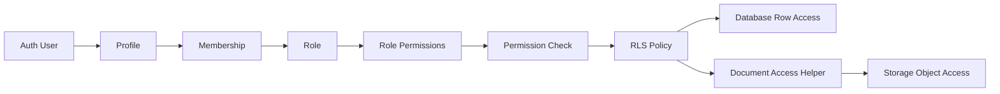
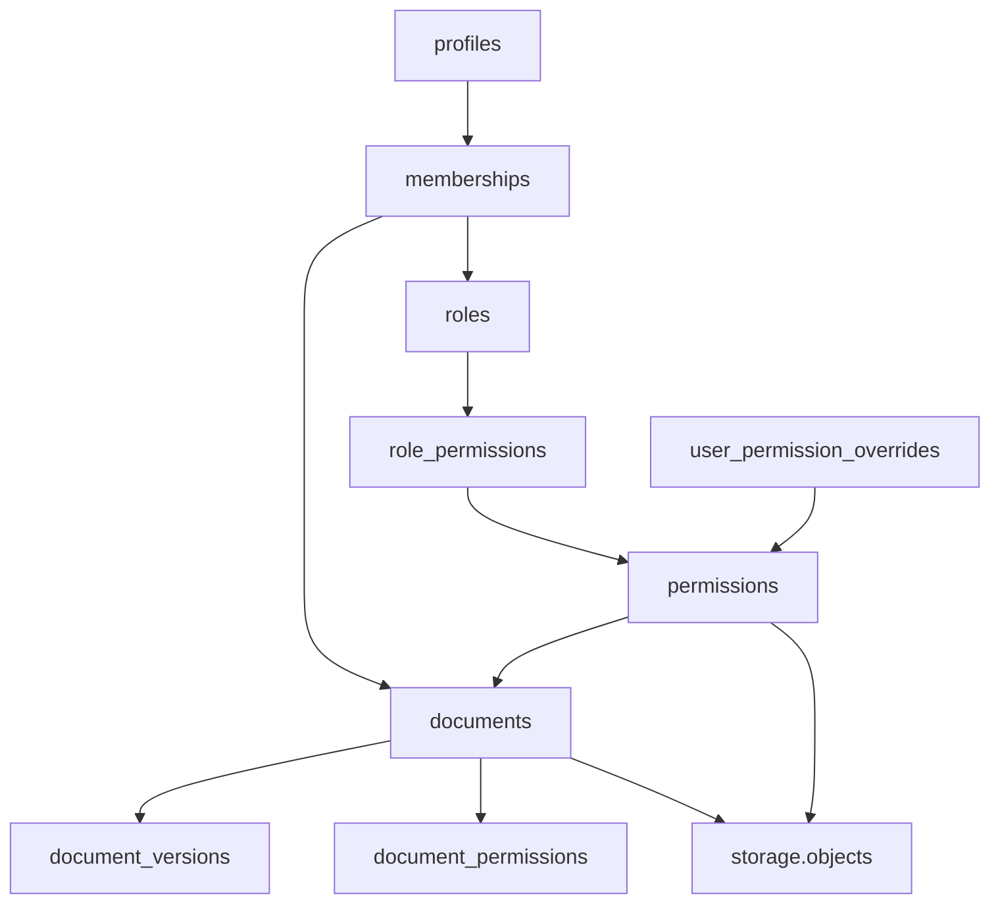
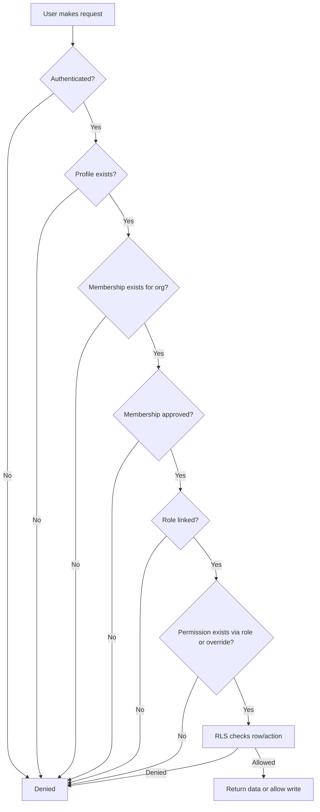
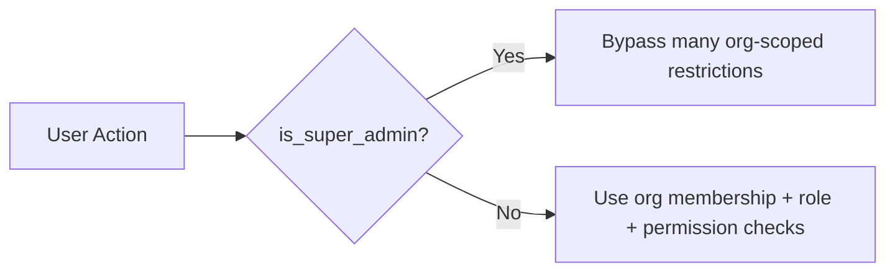
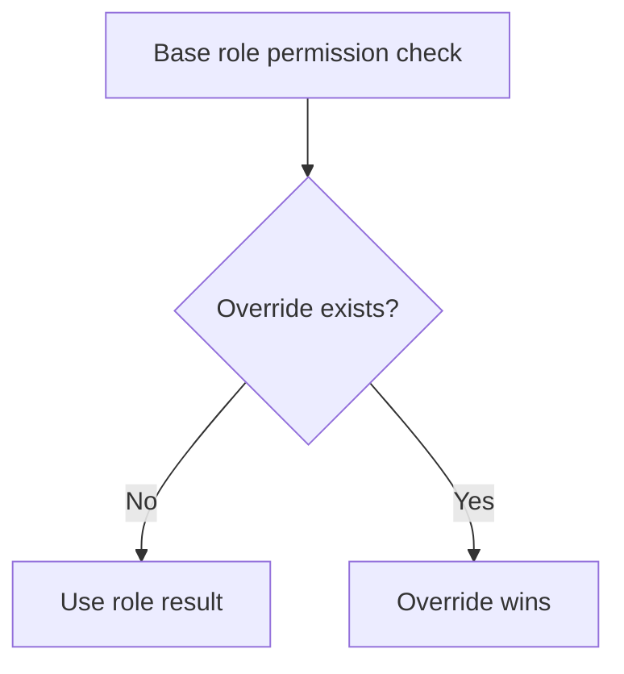
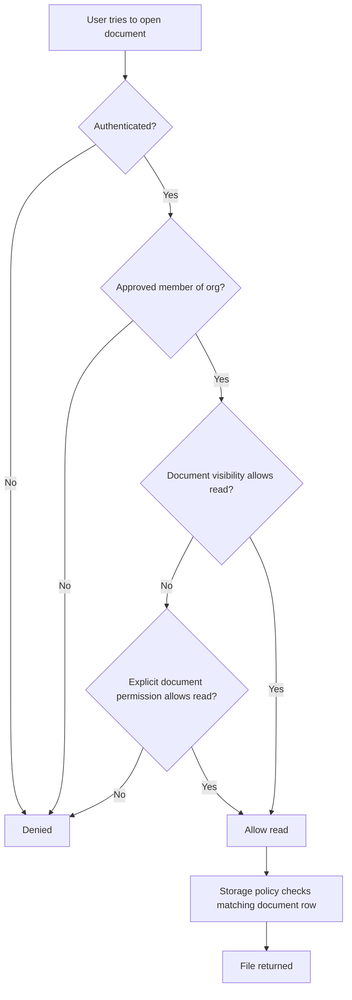
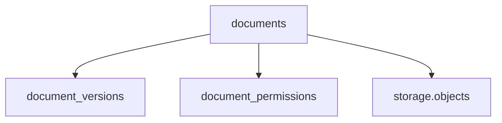
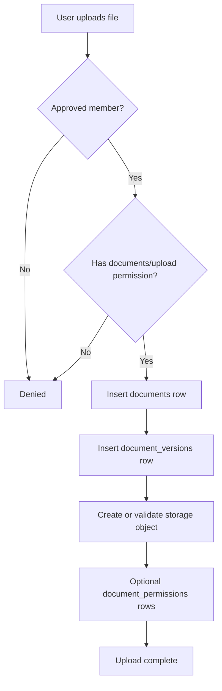
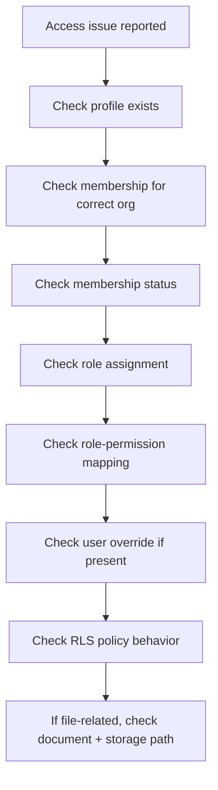

# Portal Team Admin Guide: Permissions, Access, and Security Flow

## Purpose
This guide explains, in plain English, how the portal decides **who can see what**, **who can do what**, and **how those checks are enforced**.

It covers the full path:

**Profiles -> Memberships -> Roles -> Permissions -> RLS -> Storage**

---

## 1) Plain-English Overview

Think of the system as a chain of checks:

1. **Profile** = who the person is
2. **Membership** = which organization they belong to
3. **Role** = their job or access tier in that organization
4. **Permission** = the exact actions their role can perform
5. **RLS (Row Level Security)** = the database rule that allows or blocks the action
6. **Storage** = the actual file access rule for uploaded documents

If any required step fails, access is denied.

---

## 2) The Main Components

### Profiles
Profiles are the portal-facing identity records tied to auth users.

A profile stores things like:
- full name
- email
- title
- super admin flag
- default organization
- metadata

**What admins should know:**
- A user can exist in auth and automatically get a profile.
- A profile alone does **not** grant tenant access.
- Access starts to matter when the user has an organization membership.

### Memberships
Memberships connect a user to an organization.

A membership stores:
- organization
- user
- role
- status (`pending`, `approved`, `rejected`, `suspended`)
- approval details
- contact flags

**What admins should know:**
- Membership status matters.
- A user with `pending` membership should not be treated like a full active user.
- `approved` is the key state for normal access.

### Roles
Roles describe the user's broad access tier.

Current system roles include:
- `super_admin`
- `admin`
- `client_admin`
- `technician`
- `client_user`

**What admins should know:**
- Roles are not the final permission checks by themselves.
- Roles become useful only after they are connected to permissions.

### Permissions
Permissions are the fine-grained actions a user can perform.

Permissions are structured like:
- `module_key`
- `action_key`

Examples:
- `documents / upload`
- `documents / manage`
- `tickets / create`
- `projects / manage`
- `billing / manage`

**What admins should know:**
- Roles group permissions.
- Permissions are what the database policies actually check.

### RLS (Row Level Security)
RLS is the enforcement engine inside PostgreSQL.

This is where the real allow/deny decision happens.

**What admins should know:**
- Even if the UI shows a button, the database can still deny the action.
- RLS protects the data even if a frontend or API bug occurs.

### Storage
Storage holds uploaded files.

The storage rules are connected back to document records in the database.

**What admins should know:**
- A file is not just protected by bucket access.
- File access is tied back to the matching document record and its permission logic.

---

## 3) Architecture Map



### What this means
- A person signs in as an auth user.
- Their profile identifies them in the portal.
- Their membership ties them to an organization.
- Their role defines their general access tier.
- Their role permissions define exact actions.
- RLS checks those permissions before any row is returned or changed.
- For files, the decision continues into storage policies.

---

## 4) How the Structure Is Organized



### Admin takeaway
- **Profiles** identify the person.
- **Memberships** connect them to an org.
- **Roles** describe the access tier.
- **Role permissions** translate the role into allowed actions.
- **User permission overrides** let you make exceptions.
- **Documents** have their own access layer for viewing/editing/sharing.
- **Storage** follows the document rules instead of acting independently.

---

## 5) Decision Flow for Normal Access



### In plain English
The system asks:
1. Is this a signed-in user?
2. Do they have a profile?
3. Are they attached to this organization?
4. Is that membership approved?
5. Do they have a role?
6. Does that role allow this action?
7. Does the database agree this row/action is allowed?

Only if all required checks pass does the action succeed.

---

## 6) Super Admin vs Organization Admin



### Practical difference
- **Super Admin** = global platform-level power
- **Admin / Client Admin / Technician / Client User** = organization-scoped power

### Admin takeaway
If someone should manage only one client organization, they should usually **not** be a global super admin.

---

## 7) How Role-Based Permissions Work

```mermaid
flowchart LR
    A[Membership] --> B[role_id]
    B --> C[roles]
    C --> D[role_permissions]
    D --> E[permissions]
    E --> F[user_has_permission(org, module, action)]
```

### Example
A technician in Acme may have permissions like:
- view tickets
- comment on tickets
- upload documents
- manage project tasks

But they may **not** have:
- billing management
- organization-wide admin settings
- user permission override management

That depends on what permission rows are mapped to the `technician` role.

---

## 8) How User Permission Overrides Work

Sometimes a role is not enough.

Example:
- A normal client user needs temporary document management access.
- Instead of creating a brand-new custom role, an admin can use an override.



### Admin takeaway
Overrides are for exceptions.
Use them carefully so the portal stays predictable.

---

## 9) Document Access Workflow

Documents have extra logic because file access is more sensitive than normal row access.



### What affects document access
- organization membership
- membership approval
- document visibility (`private`, `org`, `internal`, `public`)
- role-based document permissions
- user-specific document permissions
- final storage policy check

### Admin takeaway
A file is only accessible if:
1. the document row allows it, and
2. the storage object policy also allows it.

---

## 10) Document Management Structure



### Meaning of each table
- **documents** = the main document record
- **document_versions** = historical or versioned file entries
- **document_permissions** = explicit sharing rules
- **storage.objects** = the physical stored file

### Admin takeaway
If a preview/download problem occurs, you usually want to check:
1. the document row
2. the version row
3. document permissions
4. the storage object path

---

## 11) Upload Workflow



### Admin takeaway
A successful upload usually involves:
- permission to upload
- a valid document row
- a valid version row
- the file landing in the correct storage bucket/path

---

## 12) Common Admin Questions

### Why can a user sign in but still not see client data?
Usually because one of these is true:
- no membership exists
- membership is not approved
- wrong organization selected
- role lacks permission
- RLS denies the row

### Why can a user see the portal but not upload documents?
Most likely:
- they are an approved member
- but they do **not** have `documents/upload`

### Why can an admin see a document row but not open the file?
Usually the database document rule and the storage rule are out of sync from a data issue, such as:
- bad `storage_path`
- missing storage object
- incorrect org path
- document permission mismatch

### Why should we prefer roles over overrides?
Because roles are predictable and easier to audit.
Overrides are best for temporary or exceptional cases.

---

## 13) Recommended Admin Operating Model

### For internal MSP team
- Use `admin` for broad org management
- Use `technician` for operational work
- Reserve `super_admin` for a very small number of platform operators

### For client-side users
- Use `client_admin` for client-side management
- Use `client_user` for standard day-to-day portal access

### For approvals
- Keep new memberships in `pending` until validated
- Move to `approved` only when the user should be active
- Use `suspended` instead of deleting access records when you need auditability

### For documents
- Default to least privilege
- Use role-based document permissions first
- Add user-specific document permissions only when really necessary

---

## 14) Troubleshooting Workflow



### Best practice
Troubleshoot in this order:
1. identity
2. org membership
3. approval state
4. role
5. permission
6. RLS
7. storage

That order usually finds the problem fastest.

---

## 15) One-Sentence Summary for the Team

**A user gets access only when they are a valid portal user, attached to the correct organization, approved, assigned the right role, granted the needed permission, and allowed by database and storage security rules.**
