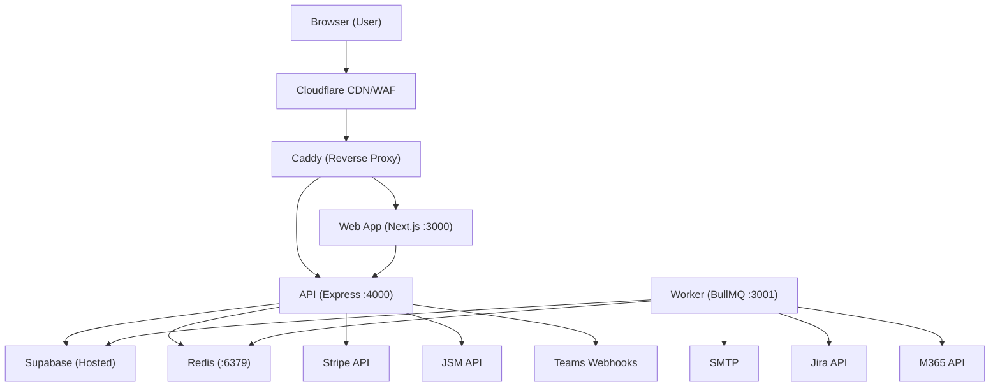
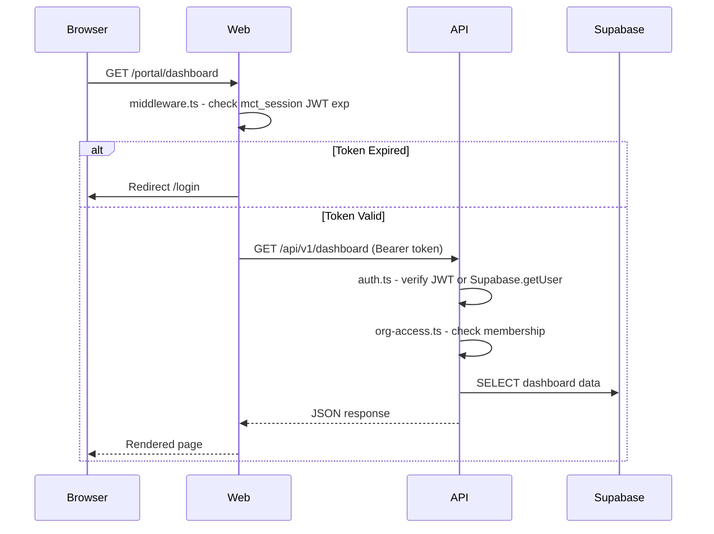

# Architecture and Runtime Topology Audit

## Audit Metadata

- **Audit name:** repo-deep-dive
- **Run:** 20260730-0650-develop-62da92c
- **Repository:** C:\temp\mainecybertech-portal
- **Branch:** develop
- **Commit SHA:** 62da92cd90af4537e97a4118f1a831e1b9f84f9d
- **Generated at:** 2026-07-30T06:50:00-04:00
- **Auditor:** principal-level automated auditor (repo-deep-dive prompt pack)
- **Area code:** ARCH
- **Output path:** prompts/repo-deep-dive/20260730-0650-develop-62da92c/02_architecture_runtime_topology.md
- **Scope limitations:** Architecture analysis is based on source code, configuration, and documentation. No runtime trace, production system access, or deployment observation.

## Scope

Complete analysis of: monorepo structure, frontend/backend/worker boundaries, auth/session flow, authorization/tenant isolation, request lifecycle, data flow, background jobs/queues, webhooks, realtime, notifications, external integrations, deployment topology, environment parity, error handling.

## Evidence Reviewed

| Evidence | Type | Why relevant | Notes |
| -------- | ---- | ------------ | ----- |
| `apps/api/src/app.ts` | Route wiring | All 52 route registrations | 191 lines |
| `apps/api/src/middleware/auth.ts` | Auth | JWT + Supabase session verification | 99 lines |
| `apps/api/src/middleware/org-access.ts` | Tenant isolation | Organization access middleware | 105 lines |
| `apps/api/src/middleware/admin.ts` | Admin check | Admin role verification | 39 lines |
| `apps/web/middleware.ts` | Web middleware | Auth routing + CSP + domain routing | 115 lines |
| `apps/api/src/main.ts` | API entry | Graceful shutdown | 35 lines |
| `apps/worker/src/main.ts` | Worker entry | Task bootstrap + health | 31 lines |
| `apps/api/src/services/supabase.ts` | Supabase client | Admin + user client factories | 62 lines |
| `apps/api/src/lib/http-client.ts` | HTTP client | Timeout + retry + circuit breaker | 152 lines |
| `apps/api/src/lib/circuit-breaker.ts` | Circuit breaker | Resilience for external calls | 128 lines |
| `apps/api/src/lib/idempotency.ts` | Idempotency | Redis + in-memory dedup | 139 lines |
| `apps/api/src/lib/webhook-dispatcher.ts` | Webhooks | Outbound webhook delivery | 112 lines |
| `infra/digitalocean/docker-compose.yml` | Deploy topology | Production stack | 122 lines |
| `apps/api/src/config/env.ts` | Env config | Zod env schema (33 vars) | 50 lines |
| `apps/worker/src/env.ts` | Worker env | Zod env schema (34 vars) | 53 lines |
| `apps/web/lib/api.ts` | Server SDK client | Server-side API client creation | 15 lines |
| `apps/web/lib/client-api.ts` | Client SDK client | Client-side API client creation | Inferred |
| `apps/worker/src/tasks/` (9 files) | Task handlers | Background job implementations | 9 task files |

## Executive Summary

The MCT Portal is a **modular monolith** architecture running on a single DigitalOcean droplet behind Caddy reverse proxy. It consists of 3 Node.js services (API on port 4000, Web on port 3000, Worker on port 3001) plus Redis for queuing and cache.

**Auth flow:** Cookie-based JWT (`mct_session`) with local verification (jsonwebtoken) + Supabase fallback. Server-side validation in `auth.ts`, client-side expiry check in `middleware.ts`.

**Tenant isolation:** `requireOrgAccess()` middleware gating all entity routes. Checks membership + admin status. Test mode bypass (no org check in test env).

**Request flow:** Browser → Web middleware (auth check, CSP, domain route) → Next.js server component → SDK client → API (auth + org + validation) → Supabase → response.

**Key strengths:** Clean layered architecture, graceful shutdown, circuit breakers on external calls, structured logging with secret redaction, comprehensive metrics (Prometheus), optimistic locking, idempotency enforcement.

**Key risks:** Single droplet = single point of failure, no service mesh, test env bypasses org-access checks, 66+ env vars with complex dependencies, no SSE/WebSocket for real-time (30s polling instead), Supabase service role key used for all admin operations.

## Inventory

| Item | Path / symbol | Purpose | Current state | Risk | Notes |
| ---- | ------------- | ------- | ------------- | ---- | ----- |
| Monorepo structure | Root + `apps/` + `packages/` | 3 apps + 3 packages | Implemented | Low | Turborepo |
| API Express app | `apps/api/src/app.ts` | HTTP server port 4000 | Implemented | Low | 52 routes |
| Web Next.js app | `apps/web/` | UI server port 3000 | Implemented | Low | SSR + client |
| Worker process | `apps/worker/src/main.ts` | Background processor | Implemented | Low | BullMQ |
| JWT auth | `apps/api/src/middleware/auth.ts` | Token verification | Implemented | Low | JWT + Supabase |
| Org access control | `apps/api/src/middleware/org-access.ts` | Tenant isolation | Implemented | **Critical** | Test bypass |
| Domain routing | `apps/web/middleware.ts` | app.* vs www.* | Implemented | Low | |
| Graceful shutdown | `apps/api/src/main.ts:14-27` | SIGTERM drain | Implemented | Low | 10s timeout |
| Circuit breaker | `apps/api/src/lib/circuit-breaker.ts` | Supabase/HTTP resilience | Implemented | Low | |
| Optimistic locking | `apps/api/src/middleware/optimistic-locking.ts` | If-Match versioning | Implemented | Low | |
| Idempotency | `apps/api/src/lib/idempotency.ts` | Redis + in-memory | Implemented | Low | |
| Structured logging | `apps/api/src/lib/logger.ts` | Pino with secret redaction | Implemented | Low | |
| Prometheus metrics | `apps/api/src/lib/metrics.ts` | Request/DB/webhook metrics | Implemented | Low | `/metrics` endpoint |
| Docker Compose | `infra/digitalocean/docker-compose.yml` | Prod stack | Implemented | Medium | Single droplet |
| Caddy reverse proxy | `infra/digitalocean/Caddyfile` | TLS termination | Implemented | Low | Let's Encrypt |

## Domain Scorecard

| Category | Score | Evidence | Gap | Recommended action |
| -------- | ----: | -------- | --- | ------------------ |
| Monorepo structure | 5 | `pnpm-workspace.yaml`, `turbo.json` | None | None |
| Frontend/backend/worker boundaries | 4 | 3 separate apps with distinct responsibilities | Worker has tight coupling to API env vars | Reduce env var overlap |
| Auth/session flow | 5 | JWT + Supabase fallback, cookie-based | None | None |
| Authorization and tenant boundaries | 4 | `requireOrgAccess()` on all entity routes | Test bypass (NODE_ENV=test skips checks) | Remove test bypass |
| Request lifecycle | 4 | Middleware chain: auth → org → rate → route | No end-to-end tracing | Consider OpenTelemetry |
| Data flow | 4 | Request → middleware → route → Supabase | No data validation after Supabase returns | None significant |
| Background jobs | 4 | BullMQ default, SQS dormant | SQS path unverified | Verify or remove SQS |
| Queues | 4 | Redis-backed BullMQ | Single Redis instance = risk | Consider Redis Sentinel |
| Webhooks | 4 | Inbound (Stripe/Jira/JSM/M365) + outbound | Key management for webhook secrets | Document webhook security |
| Realtime | 2 | 30s polling for notifications | No SSE/WebSocket for push | Consider SSE evolution |
| Notifications | 4 | In-app + email (SMTP) | Email async via worker | None |
| External integrations | 4 | Stripe, Jira, JSM, M365, Teams, SMTP | All have circuit breaker + timeout | Document all integration points |

## Detailed Review

### Item: Auth/Session Flow

- **Evidence:** `apps/api/src/middleware/auth.ts:28-99`, `apps/web/middleware.ts:47-111`
- **What it does:** Two-layer authentication:
  1. **Web middleware** (`middleware.ts`): Base64url-decodes `mct_session` JWT to check `exp`. If expired or absent, redirects to `/login`. Also sets nonce-based CSP headers.
  2. **API middleware** (`auth.ts`): Full verification. Tries local `jsonwebtoken.verify()` against `JWT_SECRET` (supports multi-secret rotation via comma-separated). Falls back to `supabase.auth.getUser(token)` if all JWT secrets fail.
- **How it appears to work:** Browser stores `mct_session` cookie set by API after PKCE exchange. Web passes cookie to API via SDK's `getToken` callback. API verifies JWT locally (fast path) or via Supabase (slow path).
- **Dependencies:** `jsonwebtoken`, `@supabase/supabase-js`, `cookie-parser`
- **Current controls:** Multi-secret support for rotation, fast local verification, Supabase fallback, expiry check in middleware, HTTP-only/Secure/SameSite cookie flags enforced
- **Missing controls:** No refresh token rotation, no token revocation list
- **Risks:** Low — well-implemented
- **Recommended improvement:** Add refresh token rotation
- **Suggested tests:** Already covered by `middleware-auth.test.ts`
- **Suggested docs:** Documented in `portal_admin_permissions_guide.md`

### Item: Tenant Isolation (Authorization)

- **Evidence:** `apps/api/src/middleware/org-access.ts:43-81`, `apps/api/src/middleware/org-access.ts:83-105`
- **What it does:** `requireOrgAccess()` and `requireOrgAccessByParam()` restrict data access to approved organization memberships.
- **How it appears to work:** Extracts `organization_id` from query, body, or URL params. Checks `memberships` table for approved membership with matching org. Also checks if user has admin/super_admin role in any org (grants cross-org access). **In test mode (NODE_ENV=test), all checks are skipped.**
- **Dependencies:** `supabase.from("memberships").select(...)`
- **Current controls:** Two middleware functions, admin override for cross-org access, checks `status = "approved"`
- **Missing controls:** **Test mode bypass is dangerous.** `isTest` flag at line 6 means ALL tests run without org access checks.
- **Risks:** **HIGH** — Test environments have no tenant isolation. If test env connects to a real or shared Supabase instance, data cross-contamination is possible.
- **Recommended improvement:** Remove the `if (isTest) return next()` bypass. Use a mock or test-specific Supabase instance instead.
- **Suggested tests:** Org access middleware tests exist but bypass in test mode means they're testing in a special context
- **Suggested docs:** Document in AGENTS.md and security docs

### Item: Request Lifecycle

- **Evidence:** `apps/api/src/app.ts:70-191`, all middleware files in `apps/api/src/middleware/`
- **What it does:** Request flows through a middleware chain before reaching route handlers.
- **How it appears to work:**
  1. `helmet()` — security headers
  2. `cors()` — CORS with allowed origins
  3. `express.json()` — body parsing (10mb limit, raw body capture for webhooks)
  4. `cookieParser()` — cookie parsing
  5. `securityHeaders` — custom CSP/security headers
  6. `inputSanitizer` — XSS pattern detection (non-destructive)
  7. `rateLimit` — global IP rate limit (300/15min)
  8. `rateLimitByUser` — per-user rate limit
  9. `requestId` — X-Request-ID generation
  10. `requestLogger` — structured request logging
  11. `idempotencyMiddleware` — Idempotency-Key processing
  12. `csrfProtection` — CSRF token validation
  13. Route-specific middleware (auth, admin, org-access, cache, etc.)
  14. Route handler
  15. `notFoundHandler` — 404 catch-all
  16. `errorHandler` — global error handler with Sentry
- **Dependencies:** Express middleware stack
- **Current controls:** 12+ middleware layers, Sentry error tracking, structured logging
- **Missing controls:** No request timeout middleware (Express default is no timeout)
- **Risks:** Medium — long-running requests could exhaust connections
- **Recommended improvement:** Add `connect-timeout` middleware
- **Suggested tests:** Covered by middleware-specific test files
- **Suggested docs:** Implicit in middleware files

### Item: Data Flow

- **Evidence:** `apps/api/src/services/supabase.ts`, `apps/api/src/lib/circuit-breaker.ts`, `apps/web/lib/api.ts`
- **What it does:** All service data flows through the Supabase client (admin service role for all backend operations, user JWT for user-scoped queries).
- **How it appears to work:** API uses `getSupabaseAdmin()` for all DB operations (service role key bypasses RLS). `getSupabaseUser(jwt)` creates a user-scoped client (respects RLS). Worker also uses Supabase admin client.
- **Dependencies:** Supabase JS SDK, WebSocket (for realtime), circuit breaker wrapper
- **Current controls:** Service role key for admin operations (mitigated by `requireOrgAccess` middleware), circuit breaker on Supabase calls (5 failures → open, 30s timeout)
- **Missing controls:** Supabase admin client has no row-level security enforcement (bypasses RLS). Tenant isolation relies entirely on application-level `requireOrgAccess()` middleware.
- **Risks:** Medium-high — if `requireOrgAccess()` is ever removed or bypassed, the admin client provides unfiltered access to all rows
- **Recommended improvement:** Consider using user-scoped Supabase client instead of admin client whenever possible
- **Suggested tests:** Edge case tests for org access
- **Suggested docs:** Documented in portal_admin_permissions_guide.md

### Item: Background Jobs & Queues

- **Evidence:** `apps/worker/src/main.ts`, `apps/worker/src/consumer-bullmq.ts`, `apps/worker/src/consumer-sqs.ts`, `apps/worker/src/tasks/`
- **What it does:** Background job processing with dual queue backends (BullMQ default, SQS dormant). 9 task handlers for various integrations and maintenance.
- **How it appears to work:** Worker starts health server, then polls BullMQ (or SQS) for jobs. Tasks: stripe-reconcile, jira-sync, jsm-sync, m365-calendar-sync, scheduled-notifications, webhook-dispatcher, retention, module-tasks. Tracks in-flight tasks for graceful shutdown.
- **Dependencies:** BullMQ, ioredis, @aws-sdk/client-sqs, Supabase, nodemailer
- **Current controls:** Graceful shutdown with in-flight tracking, Sentry error capture, health check endpoint
- **Missing controls:** SQS path is unverified, no dead-letter queue visibility in code, no task retry policy documentation
- **Risks:** Medium — single Redis instance is a single point of failure for the default BullMQ backend
- **Recommended improvement:** Consider Redis Sentinel or Elasticache for production
- **Suggested tests:** Task handler unit tests exist (1 file)
- **Suggested docs:** JIRA_JSM_INTEGRATION.md covers related integration tasks

### Item: Webhooks

- **Evidence:** `apps/api/src/routes/webhooks.ts`, `apps/api/src/lib/webhook-dispatcher.ts`, `apps/api/src/lib/webhook-signature.ts`, `apps/api/src/middleware/idempotency.ts`
- **What it does:** Both inbound webhook receipt (Stripe, Jira, JSM, M365) and outbound webhook dispatch to user-configured endpoints.
- **How it appears to work:**
  - **Inbound:** Route handlers at `/api/v1/webhooks/stripe`, `/api/v1/webhooks/jira`, etc. verify HMAC signatures (or Stripe webhook secret). Process events and trigger side effects.
  - **Outbound:** `dispatchWebhook()` in `webhook-dispatcher.ts` queries active endpoints, signs payloads, delivers via POST with idempotency key, records delivery logs.
- **Dependencies:** Stripe SDK, HMAC with webhook secrets, Supabase for delivery logs
- **Current controls:** Idempotency keys (Redis + in-memory), HMAC signing, delivery logging, failure tracking on endpoints
- **Missing controls:** No automatic retry for failed outbound deliveries (DLQ exists in migrations but not wired)
- **Risks:** Low-medium — well-implemented but no retry for transient failures
- **Recommended improvement:** Wire up the DLQ table from migration 5302050 for automatic retry
- **Suggested tests:** Webhook management tests exist
- **Suggested docs:** Documented in ADMIN_FEATURES.md

### Item: Deployment Topology

- **Evidence:** `infra/digitalocean/docker-compose.yml`, `infra/terraform/digitalocean/`
- **What it does:** Single DigitalOcean droplet running Docker Compose with 5 containers: Redis, API, Worker, Web, and Caddy.
- **How it appears to work:** Caddy terminates TLS (Let's Encrypt), routes `api.` → API:4000, `app.` and `www.` → Web:3000. All services connect to hosted Supabase. Redis for BullMQ and idempotency.
- **Dependencies:** DO droplet (s-1vcpu-512mb-10gb dev, s-2vcpu-2gb prod), hosted Supabase, GitHub Container Registry
- **Current controls:** Cloudflare DNS proxied, DO firewall (22/80/443/2376), Caddy TLS, health checks on all containers, resource limits (256m per container)
- **Missing controls:** No multi-region, no read replicas, no automated failover
- **Risks:** **HIGH** — Single droplet is a single point of failure. If the droplet goes down, the entire platform is unavailable.
- **Recommended improvement:** Document as "single-server architecture" with recovery SLAs. Consider DO Kubernetes or multi-droplet for HA.
- **Suggested tests:** Chaos engineering tests for single-node recovery
- **Suggested docs:** Documented in FINAL_DEPLOYMENT_OPERATIONS_HANDBOOK.md

## Scenario / Control Matrix

| ID | Scenario or control | Evidence | Current control | Gap | Severity | Recommendation |
| -- | ------------------- | -------- | --------------- | --- | -------- | -------------- |
| ARCH-001 | Monorepo structure | `pnpm-workspace.yaml`, `turbo.json` | Workspace globs + pipeline | None | P3 | None |
| ARCH-002 | Frontend/backend/worker boundaries | 3 apps in `apps/` | Docker Compose separation | Worker env overlap with API | P2 | Reduce cross-env deps |
| ARCH-003 | Auth/session flow | `auth.ts:28-99`, `middleware.ts:47-111` | JWT + Supabase + multi-secret | No refresh token rotation | P2 | Add refresh rotation |
| ARCH-004 | Authorization and tenant boundaries | `org-access.ts:43-81` | Membership + admin check | **Test mode bypass** | **P1** | Remove `isTest` bypass |
| ARCH-005 | Request lifecycle | `app.ts:70-191`, 13 middleware | Full middleware chain | No request timeout middleware | P2 | Add connect-timeout |
| ARCH-006 | Data flow | `supabase.ts` | Admin client + circuit breaker | RLS bypass by design | P2 | Consider user-scoped client |
| ARCH-007 | Background jobs | 9 task handlers | BullMQ default + SQS dormant | SQS path unverified | P2 | Verify or archive SQS |
| ARCH-008 | Queues | Redis-backed BullMQ | Single Redis instance | SPOF for worker | P2 | Consider Sentinel |
| ARCH-009 | Webhooks | `webhooks.ts`, `webhook-dispatcher.ts` | Idempotency + HMAC + logging | No retry for outbound failures | P2 | Wire DLQ retry |
| ARCH-010 | Realtime | 30s polling in NotificationBell | No SSE/WebSocket | Stale notifications | P3 | Add SSE |
| ARCH-011 | Notifications | In-app + email | Notification bell + SMTP | None | P3 | None |
| ARCH-012 | External integrations | Stripe, Jira, JSM, M365, Teams, SMTP | Circuit breaker + timeout | Key management docs | P2 | Document integration security |

## Findings

### Finding ID: ARCH-P1-001 - Tenant isolation bypassed in test mode

- **Severity:** P1
- **Confidence:** High
- **Area:** Architecture
- **Evidence:**
  - `apps/api/src/middleware/org-access.ts:6` — `const isTest = getEnv().NODE_ENV === "test";`
  - `apps/api/src/middleware/org-access.ts:44` — `if (isTest) return next();`
- **What is happening:** When `NODE_ENV=test`, `requireOrgAccess()` immediately returns `next()` without performing any org access check. This applies to ALL entity routes using this middleware.
- **Why it matters:** Test environments have zero tenant isolation. If test code connects to a shared Supabase instance, or if a test inadvertently makes cross-org requests, data exposure occurs.
- **User / business impact:** Production data exposure if test env connects to real DB. False security confidence from passing tests.
- **Security / privacy / reliability impact:** HIGH — complete bypass of the primary tenant isolation control.
- **Recommended fix:** Remove the `isTest` bypass. Use a mock Supabase client or dedicated test database that has no real data.
- **Suggested validation:** Run tests with `NODE_ENV=development` to verify org-access checks pass.
- **Owner suggestion:** Backend team
- **Effort estimate:** 2-4 hours (remove bypass + fix tests that depend on bypass)
- **Dependencies:** Tests may need refactoring to pass valid org IDs
- **Status:** Open

### Finding ID: ARCH-P1-002 - Single DO droplet is a single point of failure

- **Severity:** P1
- **Confidence:** High
- **Area:** Architecture
- **Evidence:**
  - `infra/terraform/digitalocean/droplet.tf` — single droplet resource
  - `infra/digitalocean/docker-compose.yml` — all services on one host
- **What is happening:** All services (API, Web, Worker, Redis, Caddy) run on a single DigitalOcean droplet. There is no load balancer, no failover, and no multi-region deployment.
- **Why it matters:** If the droplet experiences hardware failure, network issues, or resource exhaustion, the entire platform is unavailable.
- **User / business impact:** Complete platform outage during droplet downtime.
- **Security / privacy / reliability impact:** HIGH — total loss of availability.
- **Recommended fix:** Document as "single-server architecture" with clear RTO/RPO. For production HA, consider DO App Platform, DO Kubernetes, or multi-droplet with load balancer.
- **Suggested validation:** Document recovery procedures and measure recovery time.
- **Owner suggestion:** Infrastructure team
- **Effort estimate:** 2-5 days for multi-node design
- **Dependencies:** Budget approval for additional infrastructure
- **Status:** Open

### Finding ID: ARCH-P2-003 - No request timeout middleware

- **Severity:** P2
- **Confidence:** High
- **Area:** Architecture
- **Evidence:**
  - `apps/api/src/app.ts:70-191` — Express middleware chain does NOT include request timeout
  - Express defaults: no request timeout
- **What is happening:** Express does not have a built-in request timeout. A slow or hanging external request (e.g., Supabase, Stripe, JSM) could hold connections indefinitely.
- **Why it matters:** Without a global request timeout, long-running requests can exhaust the connection pool, leading to denial of service.
- **User / business impact:** Platform unavailability under slow external dependency conditions.
- **Security / privacy / reliability impact:** Medium — resource exhaustion risk.
- **Recommended fix:** Add `connect-timeout` or `express-timeout-handler` middleware to the global middleware chain.
- **Suggested validation:** Test with artificially delayed responses.
- **Owner suggestion:** Backend team
- **Effort estimate:** 2-4 hours
- **Dependencies:** None
- **Status:** Open

### Finding ID: ARCH-P2-004 - SQS consumer path is dormant and unverified

- **Severity:** P2
- **Confidence:** Medium
- **Area:** Architecture
- **Evidence:**
  - `apps/worker/src/consumer-sqs.ts` — SQS consumer implementation
  - `infra/digitalocean/docker-compose.yml` — `QUEUE_BACKEND: bullmq` (default)
  - No SQS infrastructure in Terraform
- **What is happening:** The worker has dual queue support (BullMQ + SQS), but only BullMQ is configured in production. The SQS path has no infrastructure defined and is likely untested.
- **Why it matters:** Dead code paths create maintenance burden and false documentation. If the SQS path is broken, it may give false confidence.
- **User / business impact:** Low — only affects if someone tries to switch to SQS.
- **Security / privacy / reliability impact:** Low — dormant code.
- **Recommended fix:** Either verify SQS works with integration tests, or remove the SQS consumer.
- **Suggested validation:** Deployment test with SQS backend.
- **Owner suggestion:** Backend team
- **Effort estimate:** 2-4 hours
- **Dependencies:** None
- **Status:** Open

## Risks

| Risk | Severity | Likelihood | Impact | Evidence | Mitigation |
| ---- | -------- | ---------- | ------ | -------- | ---------- |
| Test bypass of tenant isolation | P1 | Medium | High | `org-access.ts:6`, `:44` | Remove bypass |
| Single droplet SPOF | P1 | Low | Critical | Single droplet tf + docker-compose | Multi-node HA |
| No request timeout | P2 | Medium | Medium | No timeout middleware in app.ts | Add connect-timeout |
| SQS dead code | P2 | Low | Low | SQS consumer not used in prod | Verify or remove |
| Supabase admin client bypasses RLS | P2 | High | Medium | All services use admin client | User-scoped client where possible |
| 30s polling for notifications | P3 | Low | Low | NotificationBell uses polling | Consider SSE |

## Recommendations

### Immediate / Release Blocking

1. **Fix test-mode tenant isolation bypass** — remove `if (isTest) return next()` from `org-access.ts`

### This Week

2. **Add request timeout middleware** to Express app chain
3. **Document single-server architecture** with recovery SLAs in `docs/ARCHITECTURE.md`

### This Month

4. **Verify or remove SQS consumer** code path
5. **Wire up DLQ retry** for failed outbound webhook deliveries
6. **Add refresh token rotation** for JWT sessions

### Later / Platform Evolution

7. **Design multi-node HA** for production (DO App Platform or DO Kubernetes)
8. **Implement SSE** for real-time notification push
9. **Migrate to user-scoped Supabase client** where possible to leverage RLS

## Quick Wins

| Quick win | Why it helps | Files likely involved | Validation |
| --------- | ------------ | --------------------- | ---------- |
| Add request timeout middleware | Prevents resource exhaustion | `apps/api/src/app.ts` | Test with delayed response |
| Remove test mode bypass | Fixes critical tenant isolation gap | `apps/api/src/middleware/org-access.ts` | Run tests in dev mode |
| Document single-server SPOF | Sets expectations for availability | `docs/ARCHITECTURE.md` | Review |

## Hardening Backlog

| Backlog item | Priority | Owner suggestion | Effort | Dependency |
| ------------ | -------- | ---------------- | ------ | ---------- |
| Fix test mode tenant isolation | P1 | Backend | 2-4 hrs | Test refactoring |
| Add request timeout middleware | P2 | Backend | 2-4 hrs | None |
| Document single-server architecture | P2 | Infrastructure | 1 hr | None |
| Verify SQS consumer | P2 | Backend | 2-4 hrs | AWS account |
| Wire DLQ retry for webhooks | P2 | Backend | 1 day | Migration 5302050 |
| Add refresh token rotation | P2 | Backend | 1 day | Auth flow |

## Suggested Tests

- **Org access tests:** Test with `NODE_ENV=development` to verify real checks pass
- **Request timeout tests:** Verify middleware rejects requests beyond timeout
- **SQS consumer tests:** Integration test with local SQS emulator
- **DLQ retry tests:** Verify webhook retry after transient failure
- **Chaos tests:** Verify graceful shutdown + recovery on single node

## Suggested Documentation Updates

- `docs/ARCHITECTURE.md`: Add single-server SPOF documentation with RTO/RPO
- `AGENTS.md`: Add "test mode bypass" as known risk
- `docs/ROLLBACK_PROCEDURES.md`: Add single droplet recovery procedures
- `docs/API_ERROR_HANDLING.md`: Document request timeout behavior

## Open Questions

| Question | Why it matters | Evidence needed |
| -------- | -------------- | --------------- |
| Why does test mode bypass org access? | Legacy testing convenience? | Git blame on bypass |
| Is the SQS path ever used in any environment? | Dead code removal decision | Check all env configs |
| What is the actual RTO/RPO for the platform? | Sets expectations for SPOF risk | Stakeholder input |
| Are there any plans to move to multi-node? | Future architecture direction | Product roadmap |

## Appendix

### System Context Diagram



### Auth Flow Sequence



### Tenant Boundary Map

```
                    ┌───────────────────┐
                    │  JWT Verification  │
                    │  (auth.ts)         │
                    └────────┬──────────┘
                             │
                    ┌────────▼──────────┐
                    │  Org Access Check  │
                    │  (org-access.ts)   │
                    │  ┌──────────────┐ │
                    │  │ NODE_ENV=test │─┼──→ BYPASS (ISSUE)
                    │  │ ? return     │ │
                    │  └──────────────┘ │
                    │  ┌──────────────┐ │
                    │  │ membership   │ │
                    │  │ status=      │ │
                    │  │ "approved"   │─┼──→ ALLOW
                    │  └──────────────┘ │
                    │  ┌──────────────┐ │
                    │  │ admin/       │ │
                    │  │ super_admin  │─┼──→ ALLOW (cross-org)
                    │  └──────────────┘ │
                    └────────┬──────────┘
                             │
                    ┌────────▼──────────┐
                    │  Route Handler    │
                    │  (with Supabase   │
                    │   admin client)   │
                    │  RLS BYPASSED     │
                    └───────────────────┘
```
