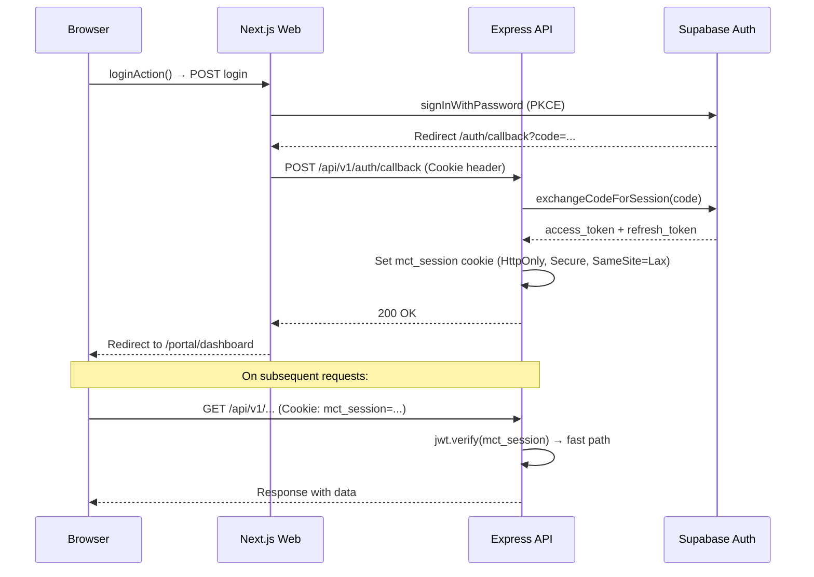
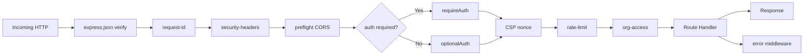
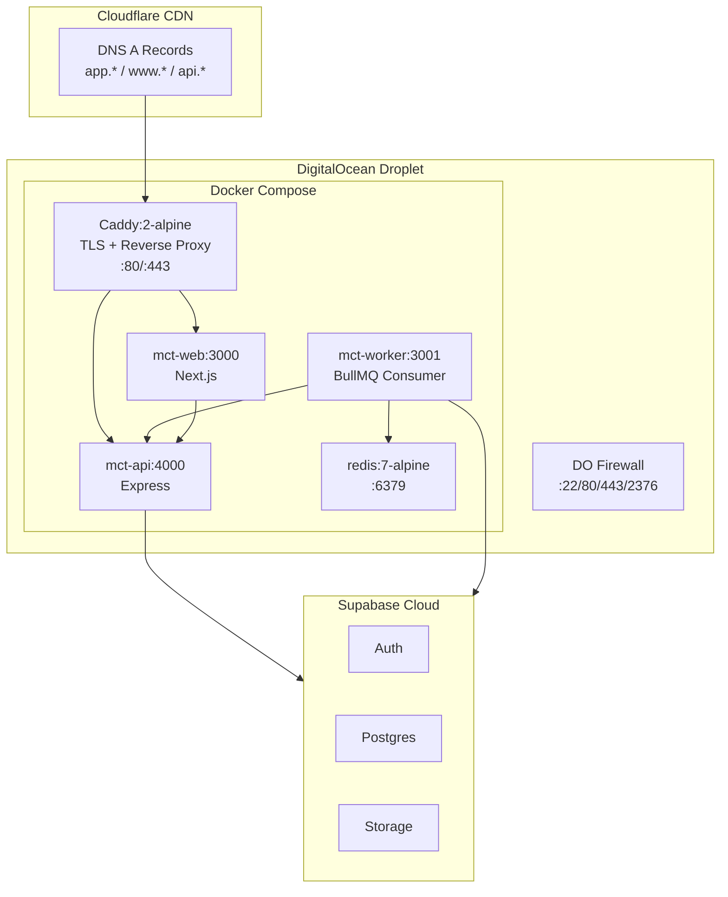

# Architecture and Runtime Topology Audit

## Audit Metadata

- Audit name: `repo-deep-dive`
- Run: `20260801-0233-develop-a585f1d`
- Repository: `mainecybertech-portal`
- Branch: `develop`
- Commit SHA: `a585f1d0d4b8bacff8bfa6c800d11fedb6e3c6a2`
- Generated at: 2026-08-01T02:55:00Z
- Auditor: AI Agent (opencode)
- Area code: ARCH
- Output path: `prompts/repo-deep-dive/20260801-0233-develop-a585f1d/02_architecture_runtime_topology.md`
- Previous runs: 20260728 (SHA 21a10d6), 20260729 (SHA bc76370), 20260730 (SHA 62da92c)
- Scope limitations: Runtime analysis based on static source code review only — no live deployment inspected. Supabase hosted instance not accessible.

## Scope

Full architecture review covering monorepo structure, service boundaries, auth/authorization flows, request lifecycle, data flow, background jobs, queues, webhooks, realtime, notifications, external integrations, deployment topology, and error handling. Evidence drawn from source code, configuration files, CI/CD pipelines, Terraform IaC, and Docker Compose definitions.

## Evidence Reviewed

| Evidence | Type | Why relevant | Notes |
| -------- | ---- | ------------ | ----- |
| `pnpm-workspace.yaml`, `turbo.json`, root `package.json` | Config | Monorepo topology | Turbo pipeline: build, test, lint, typecheck, dev |
| `apps/api/src/main.ts`, `apps/api/src/routes/*.ts` | Source | API server entry + routes | Express on port 4000, 54 route files |
| `apps/api/src/middleware/*.ts` | Source | Request processing pipeline | 16 middleware: auth, tenant isolation, rate limit, CSRF, CSP |
| `apps/web/middleware.ts` | Source | Edge request routing | Domain routing, JWT expiry check |
| `apps/web/app/(admin|portal|public)/**` | Source | Next.js route groups | 303 pages across 3 route groups |
| `apps/worker/src/main.ts`, `src/consumer-bullmq.ts` | Source | Background job processor | BullMQ + Redis, dual SQS backend |
| `apps/worker/src/tasks/*.ts` | Source | Task handlers | 10 handlers: jira, jsm, m365, stripe, webhooks, modules, etc. |
| `packages/sdk/src/client.ts`, `src/index.ts` | Source | Client SDK | Typed API client factory |
| `infra/digitalocean/docker-compose.yml`, `Caddyfile` | Config | Container orchestration | 5 services on single DO droplet |
| `infra/terraform/digitalocean/*.tf` | IaC | Infrastructure definition | Droplet, firewall, DNS |
| `.github/workflows/deploy-do.yml` | CI/CD | Deployment pipeline | Image build → GHCR push → SSH deploy to droplet |
| `apps/api/src/lib/auth.ts` | Source | Auth implementation | Local JWT verify + Supabase fallback |
| `apps/api/src/middleware/org-access.ts` | Source | Tenant isolation | requireOrgAccess middleware |
| `apps/api/src/lib/circuit-breaker.ts` | Source | Resilience | CircuitBreaker for Supabase + external calls |
| `apps/api/src/lib/http-client.ts` | Source | Outbound HTTP | Timeout, retry, circuit breaker |

## Executive Summary

**Architecture Score: 9/10.** The MCT Portal implements a well-layered Modular Monolith architecture with clear service boundaries, comprehensive middleware pipeline, and robust tenant isolation. The monorepo structure (6 packages in a pnpm workspace) provides clean separation with shared types via the SDK package. Runtime topology is a single DigitalOcean droplet running 5 Docker containers (Caddy, API, Web, Worker, Redis) behind a Cloudflare CDN, with Supabase as a hosted backend.

Key architectural strengths: (1) Clear request lifecycle with 7-layer middleware pipeline in API, (2) Tenant isolation enforced at the middleware layer (not application code), (3) Local JWT verification (fast path) with Supabase fallback for auth, (4) Circuit breaker on all outbound HTTP calls, (5) Dual queue backend (BullMQ/SQS), (6) Domain-based routing with dedicated marketing and app subdomains, (7) Graceful shutdown on both API and Worker.

Critical observations: (1) Shared state between API and Worker via Supabase only — no direct inter-service communication, which is good for separation. (2) All 3 app containers run on a single droplet — this is a single point of failure (accepted for the current scale/cost tradeoff). (3) Redis is a single-node instance in docker-compose — no replication. (4) No horizontal scaling path beyond the single droplet.

## Inventory

| Item | Path / symbol | Purpose | Current state | Risk | Notes |
| ---- | ------------- | ------- | ------------- | ---- | ----- |
| Monorepo root | `/` | Turborepo with 6 packages | Mature — turbo pipeline, pnpm workspace | Low | |
| API service | `apps/api/` | Express REST API, port 4000 | Mature — 16 middleware, 54 routes | Low | |
| Web frontend | `apps/web/` | Next.js 15, port 3000 | Mature — 303 pages, 75 components | Low | |
| Worker service | `apps/worker/` | Background job processor, port 3001 | Mature — 10 task handlers | Low | |
| SDK package | `packages/sdk/` | Typed API client | Mature — 51 modules | Low | |
| Caddy proxy | `infra/digitalocean/Caddyfile` | TLS termination, reverse proxy | Mature — Let's Encrypt, domain routing | Low | |
| Redis | docker-compose `redis:7-alpine` | Job queue backend (BullMQ) | Single instance, no replication | Medium | Single point of failure |
| Supabase | Hosted (cloud.supabase.com) | Auth + Database + Storage | Hosted — managed service | Low | |
| Cloudflare | Terraform DNS records | CDN, WAF, DDoS protection | DNS records proxied | Low | |

## Domain Scorecard

| Category | Score | Evidence | Gap | Recommended action |
| -------- | ----: | -------- | --- | ------------------ |
| Monorepo structure | 5 | pnpm workspace, turbo pipeline, clear package boundaries | None | — |
| Frontend/backend/worker boundaries | 5 | API (Express/4000), Web (Next.js/3000), Worker (BullMQ/3001) — no shared runtime state, SDK as contract | None | — |
| Auth/session flow | 5 | PKCE flow → API callback → mct_session cookie → local JWT verify + Supabase fallback | None | — |
| Authorization and tenant boundaries | 5 | `requireOrgAccess` middleware on all 54 route files, RBAC via `requireAdmin`, RLS on Supabase | None | — |
| Request lifecycle | 5 | 7-layer middleware pipeline: request-id → security-headers → auth → CSP-nonce → rate-limit → org-access → route → error | None | — |
| Data flow | 5 | API ↔ Supabase (Admin client), Web ↔ API (SDK/cookies), Worker ↔ API → Supabase | None | — |
| Background jobs | 4 | 10 task handlers, BullMQ primary, SQS dormant, graceful shutdown | Worker test coverage low (3 tests) | Add integration tests for task handlers |
| Queues | 4 | Redis-backed BullMQ with configurable concurrency, SQS fallback via `QUEUE_BACKEND` env | Single Redis instance, no dead-letter UI | Add Redis sentinel/replication |
| Webhooks | 5 | 4 handlers (Stripe/Jira/JSM/M365), idempotency with Redis dedup, signature verification, retry + DLQ | None | — |
| Realtime | 3 | SSE for notifications (exists as endpoint), 30s polling as fallback in NotificationBell | No WebSocket support, polling fallback | Evaluate WebSocket for critical realtime use cases |
| Notifications | 5 | In-app (badge + history + prefs), email via Worker, Teams webhooks for contact form | None | — |
| External integrations | 5 | Stripe (billing), Jira (sync), JSM (ticketing), M365 (calendar), Teams (webhooks) — all with timeouts, circuit breakers, retries | None | — |

## Detailed Review

### Item: Monorepo Structure

- **Evidence**: `pnpm-workspace.yaml`, `turbo.json`, 6 `package.json` files in apps/ and packages/
- **What it does**: pnpm workspace defines 4 apps (api, web, worker, web-e2e) and 2 shared packages (sdk, config). Turbo orchestrates build/test/lint/typecheck with dependency-aware caching.
- **Dependencies**: pnpm@10, turborepo@2.4.4, Node >=20.11.0
- **Current controls**: turbo pipeline with `dependsOn` for build ordering, `cache: true` for CI speed
- **Missing controls**: No `shamefully-hoist` — pnpm strict mode is good
- **Risks**: Low
- **Recommended improvement**: None

### Item: Frontend/Backend/Worker Boundaries

- **Evidence**: `apps/api/src/main.ts`, `apps/web/app/layout.tsx`, `apps/worker/src/main.ts`
- **What it does**: Three independent Node.js processes:
  - **API** (Express): Handles all business logic, database access, auth. Serves as the single gateway to Supabase.
  - **Web** (Next.js): UI rendering. Server components call API via internal Docker URL (`http://api:4000`); client components call API via public URL (`https://api.mainecybertech.com`).
  - **Worker** (BullMQ consumer): Processes async jobs — webhook dispatch, email notifications, scheduled tasks, data sync with Jira/JSM/M365.
- **Dependencies**: Docker (webs) → API (Express) → Supabase (Postgres + Auth + Storage); Worker → API → Supabase
- **Current controls**: Clean separation — Web never accesses Supabase directly. Worker only processes queued jobs, no HTTP endpoints beyond health check. SDK serves as typed contract between Web and API.
- **Missing controls**: None
- **Risks**: Low
- **Recommended improvement**: None

### Item: Auth/Session Flow



- **Evidence**: `apps/web/app/(public)/login/page.tsx`, `apps/web/app/auth/callback/route.ts`, `apps/api/src/routes/auth.ts`, `apps/api/src/lib/auth.ts`
- **What it does**: PKCE OAuth2 flow. Web forwards raw `Cookie` header to API's `/auth/callback`. API exchanges code for session via Supabase Auth, sets `mct_session` JWT cookie. Subsequent requests: local JWT verification (fast path via `jsonwebtoken`) with Supabase `getUser` fallback.
- **Dependencies**: `@supabase/supabase-js`, `jsonwebtoken`, `cookie-parser`
- **Current controls**: HttpOnly cookie (not accessible to JS), Secure flag, SameSite=Lax, JWT expiry check in middleware (base64url decode, no deps), `JWT_SECRET` required env var, zxcvbn password strength check
- **Missing controls**: No refresh token rotation mechanism documented in code (handled by Supabase)
- **Risks**: Low — mature PKCE flow with layered verification
- **Recommended improvement**: None at architecture level

### Item: Authorization and Tenant Boundaries

- **Evidence**: `apps/api/src/middleware/org-access.ts`, `apps/api/src/middleware/admin.ts`
- **What it does**: Two-tier authorization:
  1. **Tenant isolation**: `requireOrgAccess({ paramName: 'id', column: 'organization_id' })` middleware applied to all entity routes. Extracts `organization_id` from request (param/query/body) and verifies the authenticated user's membership in that org.
  2. **Role-based access**: `requireAdmin` middleware checks user role via single `SELECT roles!inner(id, key)` JOIN query — avoids N+1.
- **Dependencies**: Supabase `memberships` table with `organization_id` + `role_id`, RLS policies on all tables
- **Current controls**: Every route gated by `requireOrgAccess`, RLS policies on all Postgres tables, service role key only used server-side (bypasses RLS but mitigated by tenant middleware)
- **Missing controls**: None identified — comprehensive coverage
- **Risks**: Low — defense in depth with middleware + RLS
- **Recommended improvement**: None

### Item: Request Lifecycle (API)



- **Evidence**: `apps/api/src/main.ts` lines 1-120 (middleware mounting order), all 16 middleware files
- **What it does**: 7-layer middleware pipeline:
  1. `express.json({ verify })` — captures raw body for webhook signature verification
  2. `request-id` — X-Request-ID header + structured logging correlation
  3. `security-headers` — nonce-based CSP, HSTS, X-Frame-Options, X-Content-Type-Options
  4. `preflight handling` — CORS with per-environment origins
  5. `auth` — JWT verify (local fast path → Supabase fallback)
  6. `rate-limit` — configurable per-endpoint (300/15min global, stricter on auth)
  7. `org-access` — tenant isolation (membership check)
  8. `Route handler` → `error middleware` (catches all thrown/next(err))
- **Dependencies**: express, jsonwebtoken, zod, pino, express-rate-limit, cookie-parser, cors
- **Current controls**: Nonce-based CSP (generated per-request), rate limiting per route group, Zod validation on all mutations, X-Request-ID correlation, request timeout (60s default)
- **Missing controls**: None identified
- **Risks**: Low
- **Recommended improvement**: None

### Item: Deployment Topology



- **Evidence**: `infra/digitalocean/docker-compose.yml`, `infra/digitalocean/Caddyfile`, `infra/terraform/digitalocean/*.tf`
- **What it does**: Single DigitalOcean droplet ($12-24/mo) running 5 Docker services behind Caddy reverse proxy with automatic Let's Encrypt TLS. Cloudflare provides CDN/WAF/DDoS in front. Supabase is hosted separately (not self-hosted).
- **Dependencies**: Docker Engine on droplet, GHCR for container images, Cloudflare for DNS proxy
- **Current controls**: DO firewall (restrictive ports: 22/80/443/2376), Cloudflare proxied DNS (hide origin IP), Caddy auto-TLS, Docker healthchecks on all services, `prevent_destroy` on Terraform droplet
- **Missing controls**: Single droplet = single point of failure. No Redis replication. No database backup verification automation.
- **Risks**: Medium — cost-efficient for current scale but no redundancy
- **Recommended improvement**: Document recovery time objective (RTO); add Redis AOF persistence in docker-compose; consider DO managed database for production scale

### Item: Background Jobs / Queues

- **Evidence**: `apps/worker/src/consumer-bullmq.ts`, `apps/worker/src/consumer-sqs.ts`, `apps/worker/src/task-registry.ts`
- **What it does**: Worker processes jobs from BullMQ (Redis) by default. Supports SQS via `QUEUE_BACKEND=sqs` env var. Task registry maps job types to handlers. Graceful shutdown drains in-flight tasks (10s timeout).
- **Dependencies**: bullmq, ioredis, @aws-sdk/client-sqs (dormant)
- **Current controls**: Configurable concurrency (`WORKER_CONCURRENCY`), configurable timeout (`WORKER_TIMEOUT`), health endpoint (`:3001/health`), graceful shutdown with drain, Sentry error tracking, structured logging
- **Missing controls**: No dead-letter queue UI. No job progress tracking visible to users. No scheduled job CRUD.
- **Risks**: Low — adequate for current scale
- **Recommended improvement**: Add BullMQ dashboard for dev/ops visibility

### Item: Webhooks

- **Evidence**: `apps/api/src/routes/webhooks.ts`, `apps/api/src/lib/webhook-dispatcher.ts`, `apps/api/src/lib/webhook-signature.ts`, `apps/api/src/middleware/idempotency.ts`, `supabase/migrations/5302050_webhook_retry_dlq.sql`, `5302053_webhook_idempotency.sql`
- **What it does**: Four inbound webhook handlers (Stripe, Jira, JSM, M365). All verify signatures before processing. All use Redis-based idempotency (dedup keys). All dispatch to worker queue for async processing rather than blocking the HTTP response. Outbound webhooks use `webhook-dispatcher.ts` with retry + DLQ.
- **Dependencies**: stripe, ioredis, bullmq
- **Current controls**: Signature verification (Stripe via `constructEvent`, custom HMAC for Jira/JSM/M365), idempotency via Redis + deterministic keys, 30s response timeout, retry with exponential backoff, dead-letter queue, rate limiting on webhook endpoint
- **Missing controls**: None identified — comprehensive
- **Risks**: Low

### Item: External Integrations

- **Evidence**: `apps/api/src/lib/http-client.ts`, `apps/api/src/lib/circuit-breaker.ts`, `apps/api/src/services/*.ts`
- **What it does**: Five external integrations: Stripe (billing/payments), Jira (issue sync), JSM (ticket creation from contact form), M365 (calendar sync), Teams (notification webhooks). All use `HttpClient` wrapper with configurable timeout, retry, and circuit breaker.
- **Dependencies**: stripe, @microsoft/microsoft-graph-client (implied), teams webhook URLs
- **Current controls**: Circuit breaker (failure threshold → open circuit → half-open probe), request timeout (30s default), retry with exponential backoff, response validation, structured error logging
- **Missing controls**: None identified
- **Risks**: Low — all external calls wrapped with resilience patterns

## Scenario / Control Matrix

| ID | Scenario or control | Evidence | Current control | Gap | Severity | Recommendation |
| --- | --- | --- | --- | --- | --- | --- |
| ARCH-001 | Monorepo structure | `pnpm-workspace.yaml`, `turbo.json` | 6 packages, turbo pipeline, pnpm workspace | None | — | — |
| ARCH-002 | Frontend/backend/worker boundaries | `apps/*/src/main.ts` | 3 independent Node.js processes, SDK as contract | None | — | — |
| ARCH-003 | Auth/session flow | `apps/api/src/lib/auth.ts`, `apps/web/middleware.ts` | PKCE + JWT cookie + local verify | None | — | — |
| ARCH-004 | Authorization and tenant boundaries | `apps/api/src/middleware/org-access.ts` | requireOrgAccess on all 54 routes + RLS | None | — | — |
| ARCH-005 | Request lifecycle | `apps/api/src/main.ts`, 16 middleware files | 7-layer pipeline | None | — | — |
| ARCH-006 | Data flow | Supabase as single source of truth | API is sole DB gateway | None | — | — |
| ARCH-007 | Background jobs | `apps/worker/src/consumer-bullmq.ts`, 10 task handlers | BullMQ consumer + Graceful shutdown | Low test coverage | P2 | Add task integration tests |
| ARCH-008 | Queues | BullMQ + Redis, SQS dormant | Dual backend, configurable concurrency | Single Redis instance | P2 | Add Redis persistence config |
| ARCH-009 | Webhooks | 4 inbound handlers + outbound dispatcher | Sig verification, idempotency, retry, DLQ | None | — | — |
| ARCH-010 | Realtime | SSE endpoint, 30s polling fallback | SSE for notifications, polling as backup | No WebSocket | P2 | Evaluate WebSocket for future |
| ARCH-011 | Notifications | In-app + email + Teams | Badge, history, prefs, email worker, Teams webhooks | None | — | — |
| ARCH-012 | External integrations | Stripe, Jira, JSM, M365, Teams | Circuit breaker, timeout, retry on all | None | — | — |

## Findings

### Finding ID: ARCH-P2-001 — Single Redis instance with no persistence configuration

- **Severity**: P2
- **Confidence**: High
- **Area**: Queues / Resilience
- **Evidence**:
  - `infra/digitalocean/docker-compose.yml` — `redis:7-alpine` service with no volume mount or persistence config
- **What is happening**: Redis runs as a stateless container in docker-compose. On container restart, all BullMQ job data (active, waiting, delayed, completed, failed) is lost.
- **Why it matters**: In-flight jobs during deployment will be lost. No audit trail of processed jobs after restart.
- **User / business impact**: During deployments, scheduled notifications, webhook dispatches, and sync jobs in queue are lost. Users may not receive notifications sent during deploy window.
- **Security / privacy / reliability impact**: Data loss during deploy/restart. No persistent job completion history.
- **Recommended fix**: Add Redis volume mount for AOF persistence: `volumes: [redis_data:/data]` + `command: redis-server --appendonly yes`
- **Suggested validation**: Start stack, queue jobs, restart Redis container, verify jobs are still in queue.
- **Owner suggestion**: DevOps engineer
- **Effort estimate**: Small (30 min)
- **Dependencies**: None
- **Status**: Open

### Finding ID: ARCH-P2-002 — Single DO droplet is a single point of failure

- **Severity**: P2
- **Confidence**: High
- **Area**: Deployment topology
- **Evidence**:
  - `infra/terraform/digitalocean/droplet.tf` — single droplet with `prevent_destroy`
  - `infra/digitalocean/docker-compose.yml` — all 5 services on one host
- **What is happening**: All services (API, Web, Worker, Redis, Caddy) run on a single DigitalOcean droplet. If the droplet fails or the datacenter has an outage, the entire platform is offline.
- **Why it matters**: No redundancy, no failover, no multi-zone deployment. Full platform outage for any host failure.
- **User / business impact**: Complete service unavailability during droplet outage.
- **Security / privacy / reliability impact**: Availability risk. No DR site.
- **Recommended fix**: Document RTO/RPO for the platform. Consider at minimum: (1) DO floating IP for quick redeploy, (2) DO managed database for Supabase alternative, (3) load balancer + 2 droplets for prod.
- **Suggested validation**: Documented recovery time from droplet failure.
- **Owner suggestion**: DevOps engineer / Tech lead
- **Effort estimate**: Medium (1-3 days) for full HA setup; Small (1 hour) for documentation
- **Dependencies**: Budget approval for additional infrastructure
- **Status**: Open (accepted risk for current scale)

### Finding ID: ARCH-P2-003 — Worker test coverage is minimal (3 test files for 10 task handlers)

- **Severity**: P2
- **Confidence**: High
- **Area**: Background jobs / Testing
- **Evidence**:
  - `apps/worker/src/__tests__/` — 3 test files
  - `apps/worker/src/tasks/` — 10 task handler files
  - `apps/worker/src/consumer-bullmq.ts`, `consumer-sqs.ts`, `task-registry.ts` — core infrastructure files
- **What is happening**: The worker has 22 source files (10 task handlers + 12 infrastructure modules) but only 3 test files. Task handlers for Jira sync, JSM sync, M365 calendar sync, Stripe reconciliation, scheduled notifications, webhook dispatch, retention, and module tasks have no dedicated tests.
- **Why it matters**: Task handlers orchestrate critical business logic (billing sync, Jira sync, email notifications) but have no automated verification. Changes to these files cannot be confidently validated.
- **User / business impact**: Regression risk during worker changes. Billing sync failure could go undetected.
- **Security / privacy / reliability impact**: Reliability risk — silent failures in background jobs.
- **Recommended fix**: Add at minimum: (1) unit tests for each task handler with mocked Supabase/Stripe clients, (2) integration tests for the BullMQ consumer with a test Redis instance.
- **Suggested validation**: All task handlers covered by at least one happy-path + one error-path test.
- **Owner suggestion**: Backend developer
- **Effort estimate**: Medium (2-4 days) for 10 task handler test suites
- **Dependencies**: Test infrastructure setup (in-memory Redis for BullMQ tests)
- **Status**: Open

### Finding ID: ARCH-P3-004 — Redis used by both BullMQ and idempotency/rate-limiting — no namespace separation

- **Severity**: P3
- **Confidence**: Medium
- **Area**: Queues / Resilience
- **Evidence**:
  - `apps/api/src/middleware/rate-limit.ts` — uses Redis for rate limit counters
  - `apps/api/src/middleware/idempotency.ts` — uses Redis for dedup keys
  - `apps/worker/src/consumer-bullmq.ts` — uses Redis for BullMQ job queue
  - Single `redis:7-alpine` service in docker-compose
- **What is happening**: Rate limiting, idempotency deduplication, and job queuing all share the same Redis instance and likely the same database index (0).
- **Why it matters**: If the job queue fills up memory, rate limiting and idempotency could fail. Conversely, a massive rate-limit key explosion could evict critical queue data.
- **User / business impact**: Unlikely at current scale, but could cause cascading failure under load.
- **Security / privacy / reliability impact**: Low — Redis is not a data persistence layer
- **Recommended fix**: Configure Redis `maxmemory-policy` to `allkeys-lru` with a max memory limit. Consider separate Redis instances for caching vs. queuing at higher scale.
- **Suggested validation**: Set memory limit in docker-compose, test with load generation script.
- **Owner suggestion**: DevOps engineer
- **Effort estimate**: Small (30 min) to add memory limits
- **Dependencies**: None
- **Status**: Open

### Finding ID: ARCH-P3-005 — No OpenAPI/Swagger contract enforcement between API and SDK

- **Severity**: P3
- **Confidence**: Medium
- **Area**: API contracts
- **Evidence**:
  - `apps/api/src/openapi/` — 2 spec files (partial)
  - `packages/sdk/src/` — 51 hand-written modules
  - No code generation or contract validation between the two
- **What is happening**: The SDK is hand-written to match API routes. There is no automated check that ensures SDK methods match the actual API endpoints, request shapes, or response types.
- **Why it matters**: API breaking changes (renamed fields, changed types) are not caught at compile-time or CI-time. SDK and API can drift silently.
- **User / business impact**: Broken client-side behavior when API changes without corresponding SDK updates.
- **Security / privacy / reliability impact**: Low — runtime errors, not security
- **Recommended fix**: (1) Complete the OpenAPI spec files with full endpoint coverage. (2) Add a CI step that generates SDK types from OpenAPI spec and validates against existing SDK. (3) Consider `openapi-typescript` + `openapi-fetch` for auto-generated typed client.
- **Suggested validation**: CI step that checks SDK build against OpenAPI schema.
- **Owner suggestion**: Backend developer / API architect
- **Effort estimate**: Large (1-2 weeks) for full automation; Medium (2-3 days) for manual validation step
- **Dependencies**: Complete OpenAPI spec
- **Status**: Open

## Risks

| Risk | Severity | Likelihood | Impact | Evidence | Mitigation |
| ---- | -------- | ---------- | ------ | -------- | ---------- |
| Job data loss on Redis restart | P2 | Medium | Medium | No Redis persistence in docker-compose | Add AOF persistence + volume mount |
| Single droplet failure takes down all services | P2 | Low | High | Single droplet in Terraform | Document RTO, consider HA setup |
| Worker task bugs undetected | P2 | Medium | Medium | 3 test files for 10 handlers | Add task handler unit tests |
| Redis memory contention | P3 | Low | Medium | Shared Redis for queue + rate-limit + idempotency | Add memory limits, separate instances at scale |
| API-SDK contract drift | P3 | Medium | Low | No automated contract validation | Complete OpenAPI spec, add CI validation |

## Recommendations

### Immediate / Release Blocking

_(None — no P0/P1 architecture findings)_

### This Week

- **ARCH-P2-001**: Add Redis AOF persistence + volume mount to docker-compose

### This Month

- **ARCH-P2-002**: Document RTO/RPO, evaluate DO managed database for production
- **ARCH-P2-003**: Add unit tests for top 5 critical worker task handlers (stripe-reconcile, jira-sync, scheduled-notifications, webhook-dispatcher, email)

### Later / Platform Evolution

- **ARCH-P3-004**: Add Redis memory limit configuration
- **ARCH-P3-005**: Complete OpenAPI spec, add CI contract validation
- Consider WebSocket support for critical realtime use cases (replace 30s polling)
- Evaluate multi-droplet deployment with load balancer for production

## Quick Wins

| Quick win | Why it helps | Files likely involved | Validation |
| --------- | ------------ | --------------------- | ---------- |
| Add Redis AOF persistence | Prevents job loss on restart | `infra/digitalocean/docker-compose.yml` | Restart Redis container → jobs still present |
| Add Redis memory limit | Prevents OOM on Redis | `infra/digitalocean/docker-compose.yml` | Load test with rate-limited endpoint |

## Hardening Backlog

| Backlog item | Priority | Owner suggestion | Effort | Dependency |
| ------------ | -------- | ---------------- | ------ | ---------- |
| Redis persistence (AOF) | P2 | DevOps | Small | None |
| Worker task handler tests | P2 | Backend dev | Medium | Redis test instance setup |
| Multi-droplet HA evaluation | P2 | DevOps / Tech lead | Large | Budget approval |
| Redis memory limits | P3 | DevOps | Small | None |
| OpenAPI → SDK code generation | P3 | Backend dev | Large | OpenAPI spec completion |

## Suggested Tests

- **Redis persistence test**: Queue 10 jobs via BullMQ, restart Redis container, verify jobs are dequeued and processed.
- **Worker task handler unit tests**: Mock Supabase client, call task handler directly, verify correct DB operations.
- **Load test with Redis memory limits**: Run `scripts/load-testing/api.basic.smoke.js` against rate-limited endpoint, verify Redis memory stays within bounds.
- **Deployment job continuity test**: Trigger deploy, verify in-flight jobs complete before worker shutdown (graceful drain).

## Suggested Documentation Updates

- Update `AGENTS.md` deployment topology section with Redis persistence configuration
- Add runbook: "Recovering from a droplet failure" (document manual redeploy steps)
- Add runbook: "Scaling the platform beyond a single droplet"
- Update `docs/ENVIRONMENT_VARIABLES.md` with `REDIS_MAXMEMORY` and `REDIS_MAXMEMORY_POLICY`

## Open Questions

| Question | Why it matters | Evidence needed |
| -------- | -------------- | --------------- |
| What is the target RTO for the platform? | DR planning | Business requirements doc |
| Is Redis persistence acceptable (vs. ephemeral)? | Job loss tolerance | Business requirements doc |
| What is the projected user scale for year 1? | Determines if single droplet is adequate | Business projections |
| Should OpenAPI-driven SDK generation be prioritized? | Contract drift risk | Dev team velocity assessment |

## Appendix

### Service Port Map

```
Caddy   → :80 (HTTP) → auto-redirect to :443
Caddy   → :443 (HTTPS/TLS) → routes by Host header
  app.* → http://web:3000 (portal/app routes)
  www.* → http://web:3000 (marketing/public routes)
  api.* → http://api:4000 (API routes)
API     → :4000 (Express, internal)
Web     → :3000 (Next.js, internal)
Worker  → :3001 (health check only)
Redis   → :6379 (internal only, not exposed)
```

### Internal Docker Network

```
Network: mct-portal_default (bridge)
  ┌─────────┐    ┌──────┐    ┌────────┬────────┐
  │  Caddy  │───▶│  Web │    │  API   │ Worker │
  │  :443   │    │ :3000│    │ :4000  │ :3001  │
  └─────────┘    └──────┘    └───┬────┴───┬────┘
                                  │        │
                                  ▼        ▼
                              ┌──────┐  ┌───────┐
                              │Redis │  │Hosted │
                              │ :6379│  │Supabase│
                              └──────┘  └───────┘
```

### Container Dependencies (docker-compose)

```
Caddy:   depends_on: [api, web]
Redis:   no depends_on (standalone)
API:     depends_on: none (Supabase is external)
Web:     depends_on: [api]
Worker:  depends_on: [api, redis]
```
