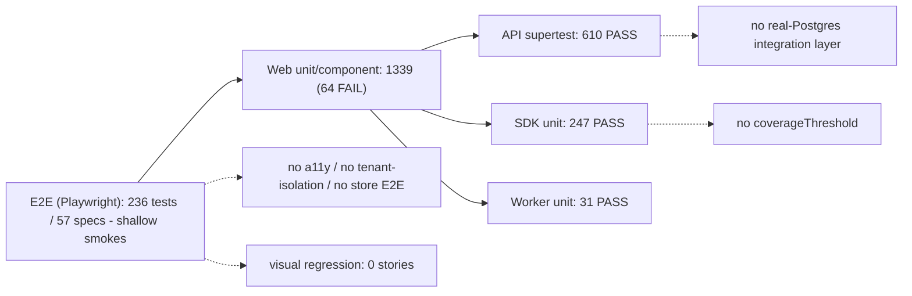

# Testing, Quality, and Release Confidence Audit

## Audit Metadata

- Audit name: repo-deep-dive
- Run: 20260801-0233-develop-a585f1d
- Repository: MaineCyberTech/mainecybertech
- Branch: develop
- Commit SHA: a585f1d0d4b8bacff8bfa6c800d11fedb6e3c6a2
- Generated at: 2026-08-01
- Auditor: principal-level repository auditor (fresh pass; no reliance on prior reports)
- Area code: TEST
- Output path: prompts/repo-deep-dive/20260801-0233-develop-a585f1d/09_testing_quality_release_confidence.md
- Scope limitations:
  - Test execution was run locally with `pnpm --filter=* test` against the current working tree (no CI runner). E2E was NOT executed (requires a live Supabase stack + seeded DB); E2E analysis is static against spec files and `playwright.config.ts`.
  - Coverage percentages were not generated (`--coverage` runs can take several minutes); the analysis relies on `coverageThreshold` config, test-file inventory, and code review of critical paths. A `--coverage` run is recommended as a validation step (see Suggested Tests).
  - CI run status (green/red) is inferred from workflow files (`test.yml` runs `pnpm test`) and the reproducible local failure, not from GitHub Actions UI.

## Scope

Reviewed the current code at `a585f1d`:
- `apps/api/src/__tests__/*.test.ts` — 72 test files, 610 tests (executed, all pass), plus `helpers.ts` mock builder.
- `apps/web/__tests__/**/*.test.ts(x)` — 193 files, 1339 tests (executed: **1275 pass, 64 fail across 60 suites**).
- `apps/web/e2e/*.spec.ts` — 57 spec files, 236 Playwright tests (static review; not executed).
- `packages/sdk/src/__tests__/*.test.ts` — 2 files, 247 tests (executed, all pass).
- `apps/worker/src/__tests__/*.test.ts` — 4 files, 31 tests (executed, all pass).
- `jest.config.{mjs}` for api/web/worker/sdk, `playwright.config.ts`, `.husky/pre-commit`, `.github/workflows/test.yml` and `e2e.yml`, `.storybook/main.ts`.
- Critical-path coverage: auth flows, tenant isolation (`requireOrgAccess`), RLS, webhook signature verification, optimistic locking, bulk ops, billing.

Not reviewed: coverage percentages, E2E live runs, test reports from CI.

## Evidence Reviewed

| Evidence | Type | Why relevant | Notes |
| -------- | ---- | ------------ | ----- |
| `pnpm --filter=api test` output | Executed run | API test status | 72 suites, **610 passed**, 0 failed; worker-force-exit leak warning |
| `pnpm --filter=web test` output | Executed run | Web test status | **60 failed / 133 passed suites; 64 failed / 1275 passed tests; exit 1** |
| `pnpm --filter=worker test` output | Executed run | Worker test status | 5 suites, 31 passed; `--forceExit` |
| `pnpm --filter=sdk test` output | Executed run | SDK test status | 2 suites, 247 passed; `--forceExit` + leak warning |
| `apps/api/src/__tests__/helpers.ts` | Source | Mock builder pattern | `createMockBuilder` chain + `then()`; `createTestApp` with rawBody capture |
| `apps/api/src/__tests__/edge-cases.test.ts` | Source | DB failure/RLS/timeout cases | 6 tests: DB error→500, null data→500, timeout→500, RLS→404, authz→403, bad UUID→404 |
| `apps/api/src/__tests__/middleware-org-access.test.ts` | Source | Tenant isolation tests | 13 tests covering query/body/param org sources, admin/super_admin fallback, 401/403 |
| `apps/api/src/__tests__/webhooks.test.ts` | Source | Webhook verification tests | Stripe/Jira/JSM/M365 signature + clientState + idempotency mocks |
| `apps/api/src/__tests__/auth.test.ts` | Source | Auth flow tests | 14 tests: sign-in/up, forgot/reset password, me, validation, 401s |
| `apps/api/src/__tests__/{billing,optimistic-locking,csrf,idempotency,circuit-breaker}.test.ts` | Source | Additional API coverage | Billing(5), optimistic-locking(12), csrf(7), idempotency(8), circuit-breaker(9) |
| `apps/api/src/routes/*.ts` (54 files) | Source | Route/test mapping | `analytics.ts` is the only route with no test file |
| `apps/web/components/admin/AdminSubnav.tsx` | Source | Nav component | **Returns `null`** (stub) |
| `apps/web/components/admin/AdminPageShell.tsx` | Source | Shell component | **`subnav: _subnav` — prop destructured but never rendered** |
| `apps/web/components/portal/PortalSubnav.tsx` | Source | Nav component | **Returns `null`** (stub) |
| `apps/web/__tests__/components/admin/{AdminSubnav,AdminPageShell}.test.tsx` | Source | Failing tests | Assert subnav renders; fail on `getByTestId("subnav")` |
| `apps/web/middleware.ts` (94 lines) | Source | Domain routing + JWT exp check | **No test file exists** |
| `apps/web/playwright.config.ts` | Config | E2E harness | chromium only; `fullyParallel`; 2 retries in CI; storageState setup |
| `apps/web/e2e/global.setup.ts` | Source | E2E auth | Logs in with hardcoded seed admin; writes storage state |
| `apps/web/e2e/*.spec.ts` | Source | E2E scope | 236 tests; most are 3-per-page heading smoke tests |
| `apps/web/jest.config.mjs` | Config | Coverage | `coverageThreshold` global 50/50/50/50; CI does not pass `--coverage` |
| `apps/api/jest.config.mjs` | Config | Coverage | Same 50/50/50/50 threshold; CI does not pass `--coverage` |
| `apps/worker/jest.config.mjs` | Config | Coverage | Same 50/50/50/50; `--forceExit` in package script |
| `packages/sdk/jest.config.mjs` | Config | Coverage | **No `coverageThreshold`** |
| `.github/workflows/test.yml` | Workflow | CI test gate | `pnpm test` (no coverage); thus coverageThreshold never enforced in CI |
| `.github/workflows/e2e.yml` | Workflow | CI E2E gate | Runs supabase reset + build + Playwright; `workflow_call` only, not wired to deploy |
| `.storybook/main.ts` + `chromatic.yml` | Config | Visual regression | Storybook glob targets `packages/ui/**/*.stories.*`; **0 story files exist** |
| `.husky/pre-commit` | Config | Pre-commit | `scan-secrets.sh` + `lint-staged` |
| `AGENTS.md`, READMEs | Docs | Claimed test counts | Claims 774 and 1,530; actual executed totals differ materially |

## Executive Summary

The repository has **strong API-level testing and a genuinely good test *culture*** — a shared mock builder, edge-case tests for DB failure/RLS/timeout, tenant-isolation middleware tests, webhook signature tests, and an E2E harness with seeded Supabase. When run individually, **API (610), SDK (247), and Worker (31) suites are green**.

However, **the Web suite is currently RED and `pnpm test` (the repo's single test command and CI gate) fails**. 60 of 193 web suites (64 tests) fail because the `AdminSubnav` and `PortalSubnav` components were deliberately nulled out (commit `86d9ff4`) and the `subnav` prop is ignored by `AdminPageShell` (`subnav: _subnav`), while tests still assert subnav renders. This is the single most important release blocker: **`test.yml` runs `pnpm test`, so every PR/push touching `apps/**` is red on CI.**

Secondary but material gaps:
- **Coverage thresholds are not enforced in CI.** All jest configs define a 50% `coverageThreshold`, but `test.yml` runs `pnpm test` (no `--coverage`), and the SDK config has no threshold at all.
- **E2E is broad but shallow** — 236 tests across 57 spec files, most are "page renders a heading" smoke tests; critical flows (invalid login, logout, cross-org tenant isolation, webhook delivery, billing checkout, bulk ops, the 8-page store catalog) have no E2E coverage.
- **Critical security controls are untested**: `apps/web/middleware.ts` (domain routing + JWT `exp` validation) has no unit test; no E2E asserts tenant-boundary behavior.
- **Visual regression is effectively absent** — a Chromatic workflow and Storybook config exist, but **0 story files** exist in the repo, so the build would be empty.
- **Documented test counts are stale** and contradict the executed runs (docs say 774 or 1,530; actual executed totals are 610 API + 1339 web + 247 SDK + 31 worker = 2,227, of which 64 fail).
- Test-run hygiene issues: API run emits a "worker process has failed to exit gracefully" leak warning; worker and SDK run under `--forceExit`, masking open-handle leaks.

Recommended next actions (in order): (1) fix or delete the failing subnav assertions so `pnpm test` is green; (2) enforce `--coverage` (or a coverage job) in CI and raise thresholds; (3) add unit tests for `apps/web/middleware.ts`; (4) deepen E2E for the flows listed above; (5) update AGENTS.md test counts; (6) decide whether the empty Storybook/Chromatic pipeline is desired or should be removed.

## Inventory

| Item | Path / symbol | Purpose | Current state | Risk | Notes |
| ---- | ------------- | ------- | ------------- | ---- | ----- |
| API tests | `apps/api/src/__tests__/*.test.ts` | Route/middleware tests | **610 passed** (72 files) | Low | Edge cases + tenant isolation + webhooks |
| API mock builder | `apps/api/src/__tests__/helpers.ts` | `createMockBuilder` | Implemented | Low | Chain + `then()` resolves preset result |
| Web tests | `apps/web/__tests__/**` | Page/component tests | **64 failed / 1275 passed** | **High** | Subnav stub drift; CI red |
| AdminSubnav | `apps/web/components/admin/AdminSubnav.tsx` | Admin sub-navigation | **Stub returns `null`** | High | Tests assert it renders |
| PortalSubnav | `apps/web/components/portal/PortalSubnav.tsx` | Portal sub-navigation | **Stub returns `null`** | High | Tests assert it renders |
| AdminPageShell | `apps/web/components/admin/AdminPageShell.tsx` | Admin page shell | `subnav` prop ignored | High | `subnav: _subnav` (line 14) |
| Web middleware | `apps/web/middleware.ts` | Domain routing + JWT exp | Implemented, **untested** | High | Security control, no test file |
| E2E | `apps/web/e2e/**` (57 specs) | Playwright | 236 tests, shallow | Medium | Heading smoke tests; flows missing |
| E2E auth setup | `apps/web/e2e/global.setup.ts` | Login + storage state | Implemented | Low | Hardcoded seed creds |
| SDK tests | `packages/sdk/src/__tests__/` | SDK unit tests | **247 passed** | Low | Mocked fetch |
| Worker tests | `apps/worker/src/__tests__/` | Env + task registry | **31 passed** | Low | `--forceExit` masks leaks |
| Coverage config | `apps/{api,web,worker}/jest.config.mjs` | 50% thresholds | Defined, not CI-enforced | Medium | `test.yml` runs `pnpm test` |
| SDK coverage | `packages/sdk/jest.config.mjs` | Threshold | **Absent** | Medium | No threshold at all |
| Chromatic | `.storybook/main.ts` + `chromatic.yml` | Visual regression | **0 story files** | Medium | Empty build / misleading pipeline |
| Load scripts | `scripts/load-testing/*.js` | K6-style load tests | Present, no CI wiring | Low | Not integrated; no baseline |
| Pre-commit | `.husky/pre-commit` | Secret scan + lint-staged | Implemented | Low | — |
| Docs | `AGENTS.md` | Test counts | **Stale** | Medium | 774/1,530 claims vs 2,227 actual |

## Domain Scorecard

| Category | Score | Evidence | Gap | Recommended action |
| -------- | ----: | -------- | --- | ------------------ |
| Unit tests | 4 | API 610, SDK 247, Worker 31 all pass with real edge cases (`edge-cases.test.ts`, `middleware-org-access.test.ts`) | Web unit suite red (64 failures); web `middleware.ts` untested | Fix subnav drift; add middleware tests |
| Integration tests | 2 | No real-DB integration suite; all Supabase interaction mocked via `createMockBuilder`; E2E exercises a seeded local Supabase but only shallowly | No repository-level integration tests against Postgres | Add `supertest` + local Postgres/Supabase integration layer or superset API tests |
| API tests | 4 | 610 supertest tests; DB/RLS/timeout edge cases; webhook signatures; optimistic locking; idempotency | `analytics.ts` route untested; some routes shallow (billing 5 tests) | Add analytics tests; deepen billing/webhook delivery tests |
| E2E | 2 | 236 tests / 57 specs but most are 3-per-page heading asserts | No store E2E, no tenant-isolation, no webhook, no billing checkout, no bulk-op E2E; `login.spec` lacks negative paths | Add flow-level E2E for critical paths |
| Component tests | 3 | 1212 web component/page tests | 60 suites fail on subnav; coverage uneven (store pages 1/8 tested) | Fix failures; add store page tests |
| Visual regression | 1 | Chromatic workflow + Storybook config exist | **0 `*.stories.*` files** in repo | Add stories or remove the pipeline |
| Accessibility | 1 | `@storybook/addon-a11y` in `.storybook/main.ts` deps | No axe runs in E2E, no a11y unit tests | Add `@axe-core/playwright` a11y checks to E2E |
| Contract tests | 0 | No contract test framework (Pact/OpenAPI test) | OpenAPI validator script exists (`validate-openapi.ts`) but no consumer contract tests | Consider OpenAPI-based contract tests |
| Migration tests | 0 | No migration test suite | `supabase db reset` in E2E applies migrations but nothing asserts schema invariants | Add migration smoke tests in E2E/CI |
| Security tests | 3 | API: csrf(7), security(9), webhook-signature, org-access(13), optimistic-locking(12) | No full-stack security E2E; web middleware untested | Add middleware unit tests + security E2E |
| Load/failure tests | 2 | `scripts/load-testing/` k6 scripts (auth, tickets, sse, health, api smoke) | Not run in CI, no baselines, `scripts/load-testing/.gitkeep` suggests placeholder legacy | Wire into CI as optional job |
| Smoke tests | 3 | API `/health` test + E2E page-render smoke tests | No deploy-time smoke/probe gate (see report 10 re: 526-as-healthy) | Add post-deploy smoke assertions |

## Detailed Review

### Item: API test infrastructure and mock builder

- Evidence: `apps/api/src/__tests__/helpers.ts:10-41` (`createMockBuilder`), `apps/api/src/__tests__/helpers.ts:43-52` (`createTestApp`).
- What it does: Provides a chainable Supabase query-builder mock (`select/insert/update/delete/eq/in/range/single/rpc/upsert/...`) whose `.then()` resolves a preset `{ data, error, count }`. `createTestApp` mounts `express.json({ verify })` to preserve `req.rawBody` for Stripe-style webhook payloads.
- How it appears to work: Route tests mock `../services/supabase` and `../services/audit`, mount the real router on a bare app, and drive it with `supertest`. The builder resolves the same result for every chained call, which is sufficient for single-query handlers but requires bespoke per-call mocks for multi-query handlers (e.g., `middleware-org-access.test.ts:56-89` hand-rolls a call-count-based mock).
- Dependencies: `ts-jest`, `supertest`, `express`.
- Current controls: 610 passing tests, edge-case coverage, tenant-isolation coverage, webhook signature coverage.
- Missing controls: no conditional-result builder (per-query sequencing), no RLS-policy fixture simulation beyond string-matched errors, no real Postgres integration.
- Risks: mock fidelity — a handler could pass with the mock while mis-ordering real query chains; the `createMockBuilder` returns the same result for all chains, so ordering bugs are invisible.
- Recommended improvement: add a sequenced/`mockResolvedValueOnce`-style builder variant; add a thin integration layer against a local Postgres for the 6-8 most critical routes.
- Suggested tests: a test that asserts query *order* (e.g., membership check before data fetch) using call-order assertions.
- Suggested docs: document the mock-builder contract in `apps/api/README.md`.

### Item: Web test suite (currently failing)

- Evidence: `pnpm --filter=web test` → `Test Suites: 60 failed, 133 passed, 193 total; Tests: 64 failed, 1275 passed, 1339 total`; `apps/web/components/admin/AdminSubnav.tsx:3-4` returns `null`; `apps/web/components/admin/AdminPageShell.tsx:14` (`subnav: _subnav`); `apps/web/components/portal/PortalSubnav.tsx:3-4` returns `null`.
- What it does: 193 suites covering pages and components across public/portal/admin/store.
- How it appears to work: Fails because tests assert `getByTestId("subnav")` renders, but the components were deliberately stubbed to `null` (commit `86d9ff4 fix: null out AdminSubnav and PortalSubnav (sidebars now handle all nav)` and `3c8c65b fix: remove old pill subnav from AdminPageShell`). The sidebar (`AdminSidebarLayout`/`PortalSidebarLayout`) now owns navigation, so production is not broken, but the tests were not updated.
- Dependencies: `@testing-library/react`, `ts-jest`, custom environment `./jest-custom-environment.js`.
- Current controls: 1275 passing tests including deep suites for roles, tickets, documents, auth libs.
- Missing controls: tests that reflect the actual (sidebar-based) navigation; a CI gate that fails on red suites (it does fail, but the repo is shipped red).
- Risks: **release-blocking** — `pnpm test` fails; `test.yml` runs `pnpm test`; every push/PR touching `apps/**` is red; teams can no longer distinguish a genuinely broken build from a known-red one.
- Recommended improvement: Either (a) restore/rewrite `AdminSubnav`/`PortalSubnav` to render real nav (deprecate sidebar), or (b) update the ~60 test files to assert on the sidebar navigation instead of the removed `subnav` prop. Option (b) is lower risk. Fix `AdminPageShell` to either render `subnav` or drop the prop from its type.
- Suggested tests: after the fix, run `pnpm --filter=web test` and require 0 failures; add a regression test that renders an admin page and asserts the sidebar nav is present.
- Suggested docs: AGENTS.md test counts (see finding TEST-P1-005).

### Item: E2E harness

- Evidence: `apps/web/playwright.config.ts` (chromium-only, 2 retries CI, storageState setup), `apps/web/e2e/global.setup.ts` (login + `.playwright-auth.json`), 57 spec files.
- What it does: Authenticates as the seeded admin once, then runs page-level specs for admin/portal/marketing/auth.
- How it appears to work: Most specs are 3-test smoke suites asserting a heading/empty-state/breadcrumb (e.g., `apps/web/e2e/portal/m365-hardening.spec.ts:4-16`). `flows.spec.ts` (16 tests) is the deepest, but uses `if (await link.isVisible())` guards that can silently skip navigation steps when seed data is absent (`flows.spec.ts:9,26,53`).
- Dependencies: `@playwright/test`, local Supabase (CI: `supabase start` + `db reset`), built API + web.
- Current controls: seeded DB; `E2E_BASE_URL`; global auth.
- Missing controls: negative auth (wrong password, expired session), cross-org/tenant-isolation, webhook delivery UI, billing checkout, bulk ticket operations, store catalog (8 public pages, 0 E2E), domain routing (`www` vs `app`), a11y (axe), and post-deploy smoke.
- Risks: E2E gives false confidence; tenant-boundary regressions in the UI would not be caught; the conditional `if (isVisible())` pattern means a broken page can "pass".
- Recommended improvement: add an explicit data-seeded E2E for the critical flows; replace conditional skip guards with `expect(...).toBeVisible()` before interacting; add a `test.skip` on missing seed rows rather than silently passing.
- Suggested tests: invalid-login shows error; user in org A cannot see org B documents; webhook deliveries list renders; store product page renders product from seeded catalog; forgot-password flow.
- Suggested docs: E2E README describing seed requirements and how to run against local Supabase.

### Item: Web middleware (domain routing + JWT expiry)

- Evidence: `apps/web/middleware.ts` (94 lines); no file matches `apps/web/__tests__/**/middleware*.test.ts`.
- What it does: Enforces `mct_session` JWT `exp` (base64url decode, no deps) and routes `app.*` vs `www.*` domains.
- How it appears to work: Untested. This is a security boundary: it prevents the redirect loop and gates domain routing.
- Missing controls: unit tests for expired/invalid/missing cookie; tests for domain routing decisions; E2E asserting the redirect loop is broken.
- Risks: High — a regression here causes login redirect loops (production outage) or domain-routing errors; there is no automated guard.
- Recommended improvement: extract the pure logic (JWT exp check, host classification) into a testable module and add unit tests; add E2E for the `www`→marketing / `app`→portal routing.
- Suggested tests: expired token → redirect to `/login`; valid token on `app.*` → portal; `www.*` host → marketing; no cookie → login.
- Suggested docs: `docs/ENVIRONMENT_VARIABLES.md` already describes domain routing; add a test note.

### Item: Coverage gates

- Evidence: `apps/api/jest.config.mjs:14-21`, `apps/web/jest.config.mjs:34-41`, `apps/worker/jest.config.mjs:14-21` all set 50% global `coverageThreshold`; `packages/sdk/jest.config.mjs` has none; `.github/workflows/test.yml:50-51` runs `pnpm test` (no `--coverage`).
- What it does: Thresholds only bite when a developer/CI runs `pnpm test:coverage`.
- Missing controls: CI coverage job; per-package thresholds; branch/line thresholds appropriate to security-critical paths.
- Risks: coverage silently degrades; the 50% bar is already low for a security platform.
- Recommended improvement: add a `coverage` job to `test.yml` (or a separate `coverage.yml`) that runs `--coverage` and fails under threshold; raise thresholds for `apps/api` to ~70% statements/lines and ~60% branches; add thresholds for SDK.
- Suggested tests: CI gate validates thresholds.
- Suggested docs: document coverage policy in `docs/GAP_ANALYSIS.md` or AGENTS.md.

### Item: Visual regression / Storybook

- Evidence: `.storybook/main.ts` (stories glob `../packages/ui/src/**/*.stories.@(ts|tsx)`), `chromatic.yml`, root `package.json` `storybook` scripts; **0 `*.stories.*` files** in the repo.
- What it does: Chromatic is configured but builds an empty Storybook.
- Risks: The pipeline can pass while covering nothing, giving false confidence in "visual tests"; `pnpm storybook:build` may fail or produce an empty shell.
- Recommended improvement: Either add stories for `@mct/ui` components (currently only `cn()` exists — see report 21) and the marketing components, or delete the Chromatic workflow until real stories exist.
- Suggested tests: n/a until stories exist.
- Suggested docs: note in AGENTS.md that visual regression is not yet active.

### Item: Test hygiene (leaks / forceExit)

- Evidence: API run printed `A worker process has failed to exit gracefully and has been force exited`; `apps/worker/package.json` test script = `jest --passWithNoTests --forceExit`; `packages/sdk/package.json` = `jest --forceExit`.
- What it does: `--forceExit` hides open handles (timers/connections) rather than fixing them.
- Risks: latent leaks (e.g., un-closed Supabase clients, Redis connections, SSE/timer handles) can cause flaky CI, resource exhaustion in watch mode, and mask real teardown bugs.
- Recommended improvement: run `--detectOpenHandles` to find and fix the leaks, then remove `--forceExit`.
- Suggested tests: CI job that runs the suite without `--forceExit` to assert clean exit.
- Suggested docs: none required beyond a note.

## Scenario / Control Matrix

| ID | Scenario or control | Evidence | Current control | Gap | Severity | Recommendation |
| ---- | ------------------- | -------- | --------------- | --- | -------- | -------------- |
| TEST-001 | Unit tests | API 610/SDK 247/Worker 31 pass | Good per-package unit coverage | Web unit suite red | P0 | Fix subnav drift |
| TEST-002 | Integration tests | No real-DB integration suite | Mocked only | No Postgres-backed tests | P2 | Add integration layer |
| TEST-003 | API tests | `edge-cases.test.ts`, `middleware-org-access.test.ts` | 610 tests incl. RLS/timeout/tenant-isolation | `analytics.ts` untested | P2 | Add analytics tests |
| TEST-004 | E2E | 236 tests / 57 specs | Broad page smoke coverage | Critical flows not covered; conditional skips | P1 | Deepen E2E; fix skip guards |
| TEST-005 | Component tests | 1,212 web component/page tests | Extensive | 60 suites fail on subnav | P0 | Update/remove subnav assertions |
| TEST-006 | Visual regression | Chromatic workflow + `.storybook/main.ts` | Pipeline exists | 0 stories | P2 | Add stories or delete pipeline |
| TEST-007 | Accessibility | `@storybook/addon-a11y` dependency | Tool installed | No axe runs | P2 | Add a11y E2E |
| TEST-008 | Contract tests | `validate-openapi.ts` script | Spec validation script | No consumer contract tests | P3 | Evaluate Pact/OpenAPI contracts |
| TEST-009 | Migration tests | `supabase db reset` in E2E | Migrations applied in CI | No schema invariant assertions | P2 | Add migration smoke assertions |
| TEST-010 | Security tests | API csrf/security/webhook/org-access suites | Strong API-level security tests | `apps/web/middleware.ts` untested | P1 | Add middleware unit tests |
| TEST-011 | Load/failure tests | `scripts/load-testing/*.js` | Scripts exist | Not CI-integrated, no baselines | P3 | Wire optional CI load job |
| TEST-012 | Smoke tests | API `/health` + E2E page smokes | Present | No deploy-time probe gate | P3 | Add post-deploy smoke |

## Findings

### Finding ID: TEST-P0-001 - Web test suite is RED (60 suites / 64 tests failing); `pnpm test` and CI are broken

- Severity: P0
- Confidence: High
- Area: Testing / Release confidence
- Evidence:
  - `apps/web/components/admin/AdminSubnav.tsx` (returns `null`)
  - `apps/web/components/portal/PortalSubnav.tsx` (returns `null`)
  - `apps/web/components/admin/AdminPageShell.tsx:14` (`subnav: _subnav` — prop ignored)
  - `apps/web/__tests__/components/admin/AdminPageShell.test.tsx:63-73` (asserts `getByTestId("subnav")`)
  - `apps/web/__tests__/components/admin/AdminSubnav.test.tsx:11-57` (asserts nav items render)
  - Executed run: `pnpm --filter=web test` → `Test Suites: 60 failed, 133 passed, 193 total; Tests: 64 failed, 1275 passed, 1339 total`
  - `git log`: commit `86d9ff4 fix: null out AdminSubnav and PortalSubnav (sidebars now handle all nav)`; commit `3c8c65b fix: remove old pill subnav from AdminPageShell`
  - `.github/workflows/test.yml:50-51` runs `pnpm test`
- What is happening: `AdminSubnav`/`PortalSubnav` were intentionally nulled (navigation moved to `AdminSidebarLayout`/`PortalSidebarLayout`), and `AdminPageShell` stopped rendering its `subnav` prop, but the ~60 test suites that assert subnav rendering were not updated.
- Why it matters: The repo's primary validation command and CI test gate fail on the current `develop` head. Every push/PR touching `apps/**` runs red, so real regressions are indistinguishable from the known-red state and the gate provides no protection.
- User / business impact: Release confidence is zero for Web; teams must "fix the tests first" before any change can be trusted; the red suite may be shipped to production unchanged.
- Security / privacy / reliability impact: No direct security impact, but a broken validation gate increases the probability of shipping security or tenant-isolation regressions undetected.
- Recommended fix: Option A (recommended): update the failing tests to assert the real sidebar navigation (`AdminSidebarLayout`/`AdminSidebarContent`) instead of the removed `subnav` prop, and remove `subnav` from `AdminPageShell`'s props type or render it when provided. Option B: re-implement `AdminSubnav`/`PortalSubnav` as real components and keep the sidebar.
- Suggested validation: `pnpm --filter=web test` exits 0; `pnpm test` (turbo) exits 0; re-run `pnpm --filter=web test -- --testPathPattern="admin/organizations/page.test.tsx"` passes.
- Owner suggestion: Web/platform lead.
- Effort estimate: Option A: 2-4 hours (mechanical test updates + one component type change).
- Dependencies: None.
- Status: Open.

### Finding ID: TEST-P1-001 - Coverage thresholds are configured but never enforced in CI; SDK has no threshold

- Severity: P1
- Confidence: High
- Area: Testing / CI
- Evidence:
  - `apps/api/jest.config.mjs:14-21`, `apps/web/jest.config.mjs:34-41`, `apps/worker/jest.config.mjs:14-21` (global 50% branches/functions/lines/statements)
  - `packages/sdk/jest.config.mjs` (no `coverageThreshold`)
  - `.github/workflows/test.yml:50-51` (`pnpm test`, no `--coverage`)
- What is happening: Thresholds only trigger on manual `pnpm test:coverage`; CI never collects coverage, and the SDK package has no threshold at all.
- Why it matters: Coverage can silently degrade; the 50% bar is already low for a security platform, and the platform's most security-sensitive package (SDK, API) is unguarded at the SDK layer.
- User / business impact: Untested code paths ship with the appearance of a tested codebase.
- Security / privacy / reliability impact: Security-critical helpers (signature verification, tenant checks, token handling) could lose coverage unnoticed.
- Recommended fix: Add a `coverage` job (or `--coverage` flag) to `test.yml`; add a threshold block to `packages/sdk/jest.config.mjs`; raise API/web thresholds in stages (70% statements, 60% branches).
- Suggested validation: A deliberately removed test/line fails the CI coverage job.
- Owner suggestion: CI/platform engineer.
- Effort estimate: 2-4 hours.
- Dependencies: TEST-P0-001 (must fix web red first, since coverage of a failing suite blocks everything).
- Status: Open.

### Finding ID: TEST-P1-002 - `apps/web/middleware.ts` (domain routing + JWT expiry) has zero test coverage

- Severity: P1
- Confidence: High
- Area: Testing / Security boundary
- Evidence:
  - `apps/web/middleware.ts` (94 lines; JWT `exp` base64url check + `app.*`/`www.*` domain routing)
  - No file under `apps/web/__tests__/**` references middleware (`glob apps/web/__tests__/**/middleware*.test.ts` → none)
  - E2E specs contain no domain-routing assertions
- What is happening: A security/availability control that prevents the `/login`↔`/portal/dashboard` redirect loop and enforces domain routing has no automated coverage.
- Why it matters: A regression causes a production login loop or wrong-site routing; the AGENTS.md "Key Decisions" explicitly call out the middleware JWT check as the fix for the redirect loop, yet nothing guards it.
- User / business impact: Full login outage or marketing/portal domain mixups could ship undetected.
- Security / privacy / reliability impact: Cookie-session handling and tenant-boundary routing are security relevant.
- Recommended fix: Extract pure functions (e.g., `isSessionExpired(jwt)`, `classifyHost(host)`) and unit-test them; add an E2E that asserts `www` → marketing and `app` → portal.
- Suggested validation: Unit tests cover expired/invalid/absent cookie; E2E covers both host paths.
- Owner suggestion: Platform/frontend lead.
- Effort estimate: 1-2 days.
- Dependencies: None.
- Status: Open.

### Finding ID: TEST-P1-003 - E2E is broad but shallow; critical flows (tenant isolation, webhook, billing, bulk ops, store) have no E2E

- Severity: P1
- Confidence: High
- Area: E2E / Release confidence
- Evidence:
  - 57 spec files / 236 tests; representative specs are 3-test heading smokes (`apps/web/e2e/portal/m365-hardening.spec.ts:4-16`)
  - `apps/web/e2e/auth/login.spec.ts` has no invalid-credential or logout assertion (the actual login happens in `global.setup.ts`)
  - No E2E file matches `store`, `webhook`, `billing`, `bulk`, or tenant-isolation patterns
  - `apps/web/e2e/admin/flows.spec.ts:9,26,53` uses `if (await link.isVisible())` — assertions can be silently skipped
- What is happening: E2E validates that pages render, not that critical user and security flows work.
- Why it matters: Tenant isolation, webhook verification, billing, and bulk operations are the highest-risk features; UI regressions there would pass CI.
- User / business impact: Data-boundary and billing regressions reach production.
- Security / privacy / reliability impact: Tenant data exposure is the platform's primary risk; E2E provides no boundary coverage.
- Recommended fix: Add flow-level E2E for: negative login, logout, cross-org document access denial, webhook delivery list/detail, one billing page flow, bulk ticket update, and one store catalog page; replace conditional `if (isVisible())` guards with hard assertions or `test.skip` on seed-missing rows.
- Suggested validation: CI E2E job includes the new specs against seeded local Supabase.
- Owner suggestion: QA/platform engineer.
- Effort estimate: 3-5 days.
- Dependencies: E2E seed data must include a second org + a store catalog row.
- Status: Open.

### Finding ID: TEST-P1-004 - `pnpm test` aggregate and CI are red; no one can ship a green build

- Severity: P1
- Confidence: High
- Area: CI / Release gate
- Evidence:
  - Root `package.json` script `"test": "turbo run test"`; `turbo.json` task `test` runs across all packages
  - `.github/workflows/test.yml:50-51` `run: pnpm test`
  - Executed web failure (TEST-P0-001) makes `pnpm test` exit non-zero
- What is happening: The single CI test command fails on the current head, so the `test.yml` gate is red for every PR/push.
- Why it matters: The repo has no working automated test gate; the documented "774 tests all green" claim is false at this commit.
- User / business impact: Release process relies on manual verification.
- Security / privacy / reliability impact: Unknown regressions slip through.
- Recommended fix: Resolve TEST-P0-001; then add a CI check that requires `pnpm test` green before merge (branch protection / required status check).
- Suggested validation: Open a PR after the fix and observe a green `test` status.
- Owner suggestion: Platform lead.
- Effort estimate: Inherits TEST-P0-001.
- Dependencies: TEST-P0-001.
- Status: Open.

### Finding ID: TEST-P1-005 - Documented test counts are stale and contradict executed runs

- Severity: P1
- Confidence: High
- Area: Documentation accuracy
- Evidence:
  - `AGENTS.md` states "774 tests all green (182 API + 108 SDK + 24 Worker + 460 Web)" and separately "1,530 tests, all passing: API 583, SDK 223, Worker 24, Web 700"
  - Executed: API 610, Web 1339 (1275 pass / 64 fail), SDK 247, Worker 31
  - `docs/GAP_ANALYSIS.md`, `docs/CODEBASE_MAPPING.md` reference older counts (per final codebase review)
- What is happening: Documentation repeatedly claims a specific, green test count that does not match the current suite size or pass/fail state.
- Why it matters: Operators and AI agents rely on these numbers to decide whether the repo is safe to deploy; false "all green" claims mask the red suite.
- User / business impact: Misinformed go/no-go decisions.
- Security / privacy / reliability impact: Indirect — false confidence.
- Recommended fix: After TEST-P0-001 is fixed, regenerate counts (e.g., from `pnpm test` output) and update AGENTS.md, `docs/GAP_ANALYSIS.md`, and `docs/CODEBASE_MAPPING.md` to the actual numbers; state the web failure explicitly until fixed.
- Suggested validation: `rg -n "774|1,530|583|700|223" AGENTS.md docs/` returns no stale totals.
- Owner suggestion: Tech writer / platform lead.
- Effort estimate: 1-2 hours.
- Dependencies: TEST-P0-001 (so the documented count is a green one).
- Status: Open.

### Finding ID: TEST-P2-001 - `apps/api/src/routes/analytics.ts` is the only route with no test file

- Severity: P2
- Confidence: High
- Area: API test coverage
- Evidence:
  - Route inventory: 54 files in `apps/api/src/routes`; cross-check of test files shows `analytics` (and only `analytics`) has no matching test
  - `apps/api/src/routes/analytics.ts` — `POST /track` (public, unauthenticated), `GET /` and `GET /summary` (auth + admin)
- What is happening: The public analytics ingestion endpoint (a potential abuse surface) and its admin views are untested.
- Why it matters: Public unauthenticated endpoints are a common abuse vector; no test guards request validation or authz on the admin views.
- User / business impact: Analytics abuse or admin-view authorization regressions go undetected.
- Security / privacy / reliability impact: Public ingest endpoint with no validation test — request-shape regressions possible.
- Recommended fix: Add `apps/api/src/__tests__/analytics.test.ts` covering POST /track validation, authz on GET routes, DB failure, and rate-limit interaction.
- Suggested validation: New suite passes; coverage report shows analytics.ts exercised.
- Owner suggestion: API engineer.
- Effort estimate: 0.5 day.
- Dependencies: None.
- Status: Open.

### Finding ID: TEST-P2-002 - Visual regression pipeline (Chromatic/Storybook) is configured but has zero stories

- Severity: P2
- Confidence: High
- Area: Visual regression
- Evidence:
  - `.storybook/main.ts` (glob `../packages/ui/src/**/*.stories.@(ts|tsx)`)
  - `.github/workflows/chromatic.yml` runs `pnpm storybook:build` + `chromaui/action@v11`
  - Search for `*.stories.*` across `apps/web`, `apps/web/components`, and repo → **0 files**
- What is happening: Chromatic builds an empty Storybook; the "visual regression" gate covers nothing.
- Why it matters: False confidence in visual coverage; possible build failure masking.
- User / business impact: UI regressions are not caught by any automated visual check.
- Security / privacy / reliability impact: None directly.
- Recommended fix: Either add stories for `@mct/ui` (only exports `cn()` — report 21 notes the package is thin) and key marketing/portal components, or remove the Chromatic workflow until stories exist.
- Suggested validation: `pnpm storybook:build` succeeds with `> 0` stories; Chromatic reports a non-empty story set.
- Owner suggestion: Frontend lead.
- Effort estimate: 1-2 days (stories) or 1 hour (remove pipeline).
- Dependencies: None.
- Status: Open.

### Finding ID: TEST-P2-003 - Jest worker leak warnings and `--forceExit` mask open handles

- Severity: P2
- Confidence: Medium
- Area: Test hygiene / flakiness
- Evidence:
  - API run output: `A worker process has failed to exit gracefully and has been force exited... Active timers can also cause this`
  - `apps/worker/package.json` `"test": "jest --passWithNoTests --forceExit"`
  - `packages/sdk/package.json` `"test": "jest --forceExit"`
- What is happening: `--forceExit` is used to force Jest to quit, and the API run independently reports a worker that failed to exit gracefully — signs of unclosed handles (timers/connections).
- Why it matters: Leaks cause flaky runs, slow suites, and can indicate production code that leaves resources open (e.g., Redis connections, timers) in worker/SDK paths.
- User / business impact: Intermittent CI failures; slower local dev.
- Security / privacy / reliability impact: In worker code, unclosed handles can mean leaked connections in production too.
- Recommended fix: Run with `--detectOpenHandles`, identify and fix the leaking handles, then remove `--forceExit` from both package scripts.
- Suggested validation: `pnpm --filter=worker test` and `pnpm --filter=sdk test` exit cleanly without `--forceExit`.
- Owner suggestion: Worker/platform engineer.
- Effort estimate: 1 day.
- Dependencies: None.
- Status: Open.

### Finding ID: TEST-P3-001 - Store catalog feature (8 public pages) has page-level coverage for only 1 of 8 pages and zero E2E

- Severity: P3
- Confidence: High
- Area: Component/page coverage
- Evidence:
  - Store pages: `apps/web/app/(public)/store/{page,[slug],category/[slug],compare,compare/[slug],promotions,quiz,quote}`
  - Unit tests: only `apps/web/__tests__/app/(public)/store/compare/page.test.tsx`
  - Component tests: 10 files / 36 tests in `apps/web/__tests__/components/store`
  - Lib tests: 152 tests in `apps/web/__tests__/lib/catalog`
  - E2E: no spec under `apps/web/e2e` matches `store`
- What is happening: The store feature's logic and components are well tested, but page-level rendering and end-to-end behavior are almost unverified.
- Why it matters: Pages that wire many components together can break while every underlying piece passes.
- User / business impact: Public store pages are customer-facing; a broken page is visible to buyers.
- Security / privacy / reliability impact: Low.
- Recommended fix: Add smoke page tests for the remaining store pages and at least one store E2E (product page renders seeded product).
- Suggested validation: New tests pass; E2E store spec green in CI.
- Owner suggestion: Frontend engineer.
- Effort estimate: 1 day.
- Dependencies: E2E seed data with a store catalog row.
- Status: Open.

### Finding ID: TEST-P3-002 - API `billing.test.ts` covers list endpoints but not webhook processing, subscription gates, or Stripe error paths

- Severity: P3
- Confidence: Medium
- Area: API test coverage
- Evidence:
  - `apps/api/src/__tests__/billing.test.ts` — 5 tests: invoices/subscriptions/payments/billing-customer/401; no test for `POST /billing/webhook` or Stripe `constructEvent` error handling
  - `apps/api/src/routes/billing.ts` implements Stripe webhook with `express.json({ verify })` (per AGENTS.md)
- What is happening: The money-critical Stripe webhook path has no dedicated billing-suite test (webhook signature verification is tested in `webhooks.test.ts` for the generic webhooks router, but the billing webhook handler's event-specific logic is not).
- Why it matters: Billing reconciliation and subscription state changes are high-impact; an untested event handler can ship checkout/subscription bugs.
- User / business impact: Incorrect subscription state, invoice mismatch.
- Security / privacy / reliability impact: Financial data handling without coverage.
- Recommended fix: Add billing webhook tests (valid signature → subscription update; invalid signature → 401; unknown event → 200 no-op), plus a Stripe API failure test (sync returns error).
- Suggested validation: New suite green; mutation coverage for `billing.ts` webhook handler.
- Owner suggestion: API engineer.
- Effort estimate: 1 day.
- Dependencies: None.
- Status: Open.

## Risks

| Risk | Severity | Likelihood | Impact | Evidence | Mitigation |
| ---- | -------- | ---------- | ------ | -------- | ---------- |
| `pnpm test`/CI red on develop head | P0 | Certain | Release gate broken; regressions undetectable | Executed web run: 60 failed suites | Fix subnav assertions (TEST-P0-001) |
| Coverage degradation with no CI gate | P1 | Likely | Security-critical code loses coverage silently | `test.yml` runs `pnpm test` (no coverage) | Add CI coverage job + thresholds |
| Web middleware (JWT/domain) regression | P1 | Possible | Login loop / domain routing outage | No middleware tests | Add unit + E2E tests |
| Tenant-boundary UI regression | P1 | Possible | Cross-org data exposure via UI | No tenant-isolation E2E | Add cross-org E2E |
| E2E false green (conditional skips) | P1 | Likely | Broken flows pass CI | `flows.spec.ts:9,26,53` `if (isVisible())` | Replace with hard assertions |
| Stale docs mislead deploy decision | P1 | Certain | Wrong go/no-go | AGENTS.md counts vs executed | Regenerate counts post-fix |
| Empty visual regression pipeline | P2 | Certain | False confidence | 0 stories + chromatic.yml | Add stories or remove |
| Jest `--forceExit` hides leaks | P2 | Likely | Flaky CI, masked resource leaks | worker/sdk scripts + API warning | `--detectOpenHandles`, remove flag |
| Analytics public endpoint untested | P2 | Possible | Abuse/authz regressions | Only route without test | Add analytics suite |

## Recommendations

### Immediate / Release Blocking

1. **Make `pnpm test` green.** Update the ~60 web suites that assert `data-testid="subnav"` to reflect sidebar-based navigation, and either render `subnav` in `AdminPageShell` or remove the prop (TEST-P0-001). Owner: web/platform lead. Effort: 2-4h.
2. **Add a CI coverage job** (or pass `--coverage`) to `test.yml`; add a threshold block to `packages/sdk/jest.config.mjs` (TEST-P1-001). Owner: CI engineer.

### This Week

3. **Unit-test `apps/web/middleware.ts`** (JWT exp + domain routing) (TEST-P1-002).
4. **Replace E2E conditional `if (isVisible())` guards** with hard assertions or `test.skip` on seed-missing rows (TEST-P1-003).
5. **Regenerate and correct test counts** in AGENTS.md / `docs/GAP_ANALYSIS.md` / `docs/CODEBASE_MAPPING.md` (TEST-P1-005).

### This Month

6. **Add flow-level E2E** for negative login, cross-org denial, webhook deliveries, bulk ticket update, store product page (TEST-P1-003).
7. **Add `analytics.test.ts`** and billing webhook tests (TEST-P2-001, TEST-P3-002).
8. **Run `--detectOpenHandles`** and remove `--forceExit` from worker/SDK scripts (TEST-P2-003).
9. **Decide Storybook/Chromatic fate** — add stories for `@mct/ui` or remove the pipeline (TEST-P2-002).
10. Raise API coverage thresholds in stages toward 70% statements / 60% branches.

### Later / Platform Evolution

11. Introduce a real Postgres-backed integration test layer for the 6-8 most critical routes.
12. Add axe-based accessibility assertions to the E2E harness.
13. Wire `scripts/load-testing/*.js` into CI as an optional scheduled load job with baselines.
14. Consider OpenAPI-based consumer contract tests for the SDK.

## Quick Wins

| Quick win | Why it helps | Files likely involved | Validation |
| --------- | ------------ | --------------------- | ---------- |
| Remove the `subnav` assertion from failing tests (or render subnav) | Restores green CI immediately | `apps/web/__tests__/**` (60 suites), `AdminPageShell.tsx` | `pnpm --filter=web test` exits 0 |
| Delete or stub the empty Chromatic pipeline | Removes false confidence | `.storybook/main.ts`, `chromatic.yml` | Workflow not misleading |
| Add `--coverage` to the CI test step | Enforces existing thresholds | `.github/workflows/test.yml` | CI fails on dropped coverage |
| Add a 3-test `analytics.test.ts` | Closes the only untested route | `apps/api/src/__tests__/analytics.test.ts` | New suite green |
| Fix `flows.spec.ts` conditional skips | E2E stops silently passing | `apps/web/e2e/admin/flows.spec.ts` | Fails loudly when page missing |
| Correct AGENTS.md test counts | Stops misleading deploy decisions | `AGENTS.md`, `docs/GAP_ANALYSIS.md` | Grep shows no stale totals |

## Hardening Backlog

| Backlog item | Priority | Owner suggestion | Effort | Dependency |
| ------------ | -------- | ---------------- | ------ | ---------- |
| Fix subnav test drift (web red) | P0 | Web/platform lead | 2-4h | — |
| CI coverage enforcement + SDK threshold | P1 | CI engineer | 2-4h | Web green |
| Web middleware unit + E2E tests | P1 | Platform/frontend lead | 1-2d | — |
| Flow-level E2E (login, cross-org, webhook, bulk, store) | P1 | QA engineer | 3-5d | E2E seed data |
| Correct test counts in docs | P1 | Tech writer | 1-2h | Web green |
| Analytics + billing webhook tests | P2 | API engineer | 1-2d | — |
| Remove `--forceExit`, fix leaks | P2 | Worker engineer | 1d | — |
| Storybook stories or pipeline removal | P2 | Frontend lead | 1-2d | — |
| Postgres-backed integration tests | P3 | Platform lead | 1-2w | Infra |
| a11y axe E2E | P3 | QA engineer | 2-3d | E2E harness |
| Load-test baselines + CI wiring | P3 | Platform engineer | 2-3d | — |

## Suggested Tests

- Unit: `apps/web/middleware.ts` — expired/valid/malformed `mct_session`, `app.*` vs `www.*` host classification, no-cookie redirect.
- Unit: `apps/api/src/__tests__/analytics.test.ts` — POST /track validation + rate-limit, GET authz (401/403), DB failure 500.
- Unit: `apps/api/src/__tests__/billing.test.ts` extension — webhook valid/invalid signature, unknown event no-op, Stripe sync error.
- Component: a regression test that renders an admin page and asserts the sidebar nav (replaces removed subnav assertions).
- E2E: negative login (wrong password shows error), logout, cross-org denial (org A user cannot open org B document), webhook deliveries page, bulk ticket update, one store product page.
- CI: coverage job that fails when a package's threshold drops; a `--detectOpenHandles` job that fails on leaked handles.
- Manual QA checklist: run `pnpm test` and confirm 0 failures across all 4 packages; run `pnpm --filter=web test:coverage` and record the real numbers for the docs fix; run `pnpm --filter=web e2e` against the seeded local Supabase and confirm the flows listed above.

## Suggested Documentation Updates

- `AGENTS.md` — replace stale "774" and "1,530" test counts with executed totals; mark the Web suite red until TEST-P0-001 is fixed; note that `--coverage` is required to enforce thresholds.
- `docs/GAP_ANALYSIS.md`, `docs/CODEBASE_MAPPING.md` — refresh test counts and mark the subnav/stub change in "Key Decisions" (sidebar replaced pill subnav).
- `docs/MARKETING_SITE_INTEGRATION.md` or a testing doc — document the E2E seed-data requirements (second org, store catalog row) needed for the recommended flow tests.
- `README.dev.md` — add a "Testing" section note that `pnpm test` is the CI-equivalent command and must be green before PRs.

## Open Questions

| Question | Why it matters | Evidence needed |
| -------- | -------------- | --------------- |
| Was the subnav removal (commits `86d9ff4`/`3c8c65b`) a deliberate product decision to rely on sidebars? | Determines whether to fix tests or restore components | Product decision record |
| Are the 50% coverage thresholds intentional or just defaults? | If intentional, coverage policy is weak for a security platform | Owner confirmation |
| Does `pnpm storybook:build` currently succeed with 0 stories, or fail? | Determines whether Chromatic is silently green or broken | Run `pnpm storybook:build` in CI |
| Are the E2E conditional `if (isVisible())` skips hiding known data gaps in CI seed data? | If yes, E2E green is misleading | Compare CI E2E logs to seed data |
| Is the `scripts/load-testing/` directory a placeholder (`.gitkeep`) or actively maintained? | Load testing may be dead | Owner confirmation |
| Are required status checks (including `test.yml`) enforced on the `develop` branch? | Test gate effectiveness | GitHub branch-protection settings |
| Why does the API Jest run emit a worker leak warning? | Points to a real resource leak in test or prod code | `--detectOpenHandles` output |

## Appendix

### Executed test run results (2026-08-01, local, commit a585f1d)

```
api    : Test Suites: 72 passed, 72 total   | Tests: 610 passed, 610 total   | Time: 47.4s
         (warning: worker process failed to exit gracefully)
web    : Test Suites: 60 failed, 133 passed, 193 total | Tests: 64 failed, 1275 passed, 1339 total | Time: 123.8s | exit 1
worker : Test Suites: 5 passed, 5 total     | Tests: 31 passed, 31 total     | Time: 7.7s  (--forceExit)
sdk    : Test Suites: 2 passed, 2 total     | Tests: 247 passed, 247 total   | Time: 9.7s  (--forceExit)
```

### Cross-check: routes vs test files

- 54 route files in `apps/api/src/routes`; 72 test files in `apps/api/src/__tests__`.
- Routes without a matching test: `analytics` only (`store` is covered by `store-catalog.test.ts`).
- Test files without a matching route are middleware/util suites (cache, circuit-breaker, csrf, edge-cases, idempotency, middleware-*, optimistic-locking, security, exports, etc.) — valid.

### Failure root cause chain

```
commit 86d9ff4 "null out AdminSubnav and PortalSubnav (sidebars now handle all nav)"
commit 3c8c65b "remove old pill subnav from AdminPageShell"
  → AdminSubnav.tsx / PortalSubnav.tsx return null
  → AdminPageShell.tsx destructures `subnav: _subnav` (ignored)
  → ~60 test suites still assert `getByTestId("subnav")` or nav-item text
  → pnpm --filter=web test fails (64 tests) → pnpm test (turbo) fails → CI test.yml red
```

### Mermaid: test pyramid at a585f1d


