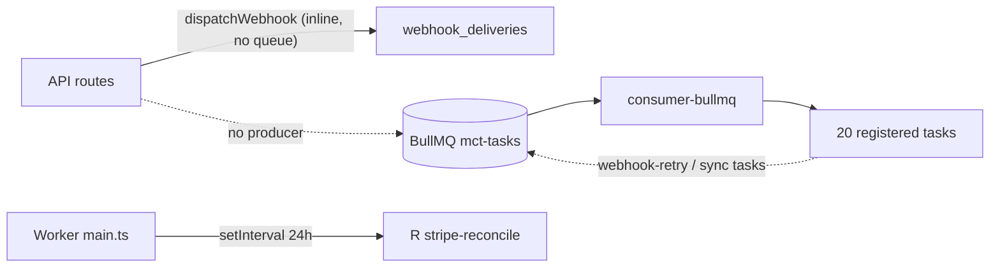

# Resilience, Recovery, and Failure Modes Audit

## Audit Metadata

- Audit name: repo-deep-dive
- Run: 20260801-0233-develop-a585f1d
- Repository: C:\temp\mainecybertech-portal
- Branch: develop
- Commit SHA: a585f1d
- Generated at: 2026-08-01
- Auditor: principal repository auditor (automated, evidence-based)
- Area code: RES
- Output path: prompts/repo-deep-dive/20260801-0233-develop-a585f1d/13_resilience_recovery_failure_modes.md
- Scope limitations: Read-only audit. No code modified, no production connections, no destructive commands. Evidence gathered from source files, migrations, infra config, and CI workflows in this commit.

## Scope

Reviewed: timeouts, retries/backoff, idempotency, circuit breakers, queue DLQ, webhook recovery, worker recovery, graceful shutdown, DB/Redis/API/email/realtime failure behavior, offline client behavior, transactions, partial writes, duplicate events, backups/restore, rollback, incident runbooks, failure injection/load tests.

Not reviewed (no evidence in this commit): actual production incident history, live monitoring data, third-party outage responses.

## Evidence Reviewed

| Evidence | Type | Why relevant | Notes |
| -------- | ---- | ------------ | ----- |
| `apps/api/src/main.ts` | Source | Graceful shutdown, unhandledRejection | SIGTERM/SIGINT + 10s force-exit; no uncaughtException |
| `apps/worker/src/main.ts` | Source | Worker bootstrap, Sentry, scheduled task | 24h stripe-reconcile setInterval; only task producer in repo |
| `apps/worker/src/consumer-bullmq.ts` | Source | Queue consumer | "mct-tasks" Worker; close + drainInFlight on signals |
| `apps/worker/src/consumer-sqs.ts` | Source | SQS consumer | poll/delete; failed → message returned to queue (no max attempts) |
| `apps/worker/src/tasks/index.ts` | Source | Task registry | 20 tasks registered; none scheduled except stripe-reconcile |
| `apps/worker/src/tasks/webhook-retry.ts` | Source | Webhook DLQ/retry | MAX_RETRIES 5, backoff, dead_letter; uses ANON key (RLS risk) |
| `apps/worker/src/tasks/webhook-dispatcher.ts` | Source | Webhook dispatch (worker variant) | 10s AbortController; records deliveries |
| `apps/api/src/lib/webhook-dispatcher.ts` | Source | Webhook dispatch (API variant) | Inline in ticket/project create; idempotency key; no retry/CB |
| `apps/api/src/lib/circuit-breaker.ts` | Source | Circuit breaker | closed/open/half-open, monitoringWindow 60s |
| `apps/api/src/lib/http-client.ts` | Source | Timeouts/retries/CB | stripe 15s/2, jsm 15s/2, teams 10s/1, geo 5s/1 |
| `apps/api/src/services/supabase.ts` | Source | Supabase client + CB | getSupabaseCircuitBreaker never used in app code |
| `apps/api/src/lib/idempotency.ts` | Source | Idempotency store | Redis + in-memory fallback, TTL 24h |
| `apps/api/src/middleware/idempotency.ts` | Source | Idempotency middleware | 409 on replay; stores response body |
| `apps/api/src/middleware/cache.ts` | Source | Response cache | initializeCache/shutdownCache never called |
| `apps/api/src/middleware/request-timeout.ts` | Source | 408 timeout | 30s global |
| `apps/api/src/lib/email.ts` | Source | Email delivery | no timeout; fail-silent |
| `apps/api/src/routes/health.ts` | Source | Health endpoint | DB/Stripe/JSM only; no Redis/worker check |
| `apps/api/src/routes/public.ts` | Source | Public endpoints | turnstile raw fetch (no timeout) |
| `apps/api/src/routes/auth.ts` | Source | Auth endpoints | raw fetch token exchange + RPC (no timeout) |
| `apps/api/src/routes/webhooks.ts` | Source | Inbound webhooks | dedup keys, signature verify, delivery log |
| `apps/api/src/routes/tickets.ts` | Source | Ticket create | dispatchWebhook inline, per-admin notification inserts |
| `apps/api/src/routes/projects.ts` | Source | Project create | dispatchWebhook inline, Promise.all batched user fetch (good) |
| `apps/api/src/routes/notifications.ts` | Source | SSE stream | keepalive 30s, auth revalidate 5min (Bearer-only bug) |
| `supabase/migrations/5302050_webhook_retry_dlq.sql` | Migration | DLQ schema | retry_count, next_retry_at, dead_letter, webhook_dead_letters |
| `supabase/migrations/5302053_webhook_idempotency.sql` | Migration | Idempotency constraint | unique idempotency_key |
| `supabase/migrations/5302102_add_performance_indexes.sql` | Migration | Indexes | pg_trgm + composite indexes |
| `infra/digitalocean/docker-compose.yml` | Infra | Runtime stack | Redis default password fallback; no prometheus |
| `apps/api/Dockerfile`, `apps/worker/Dockerfile`, `apps/web/Dockerfile` | Infra | Healthchecks | wget-based HEALTHCHECK |
| `docs/ROLLBACK_PROCEDURES.md` | Docs | Rollback | Docker/Supabase/Terraform rollback docs |
| `docs/MONITORING_AND_ALERTING.md` | Docs | Alerting plan | Recommends prometheus but not deployed |

## Executive Summary

The repository contains a solid set of resilience primitives: request timeouts (408), retries with exponential backoff + configurable timeouts (SDK and API `HttpClient`), circuit breakers for outbound third-party HTTP (Stripe/JSM/Teams/geo), Redis-backed idempotency with in-memory fallback, optimistic locking on 11+ PATCH handlers, graceful shutdown with drain in both API and Worker, and a webhook retry/DLQ schema. These are genuinely good engineering.

However, there is one systemic gap that dominates the audit: **there is no queue producer anywhere in the repository.** The Worker registers 20 task handlers and consumes from BullMQ `"mct-tasks"` (default) or SQS, but no API/web/worker code ever calls `queue.add()`, sends an SQS message, or otherwise enqueues a job. The only task that actually executes is `stripe-reconcile`, which is invoked directly via a `setInterval` in `apps/worker/src/main.ts:30` — bypassing the queue entirely. This means:

- `webhook-retry` (the DLQ/retry loop) is **never triggered** → webhook failures are logged to `webhook_deliveries` but never retried, and `webhook_dead_letters` will never fill.
- `jira-sync`, `jsm-sync`, `m365-calendar-sync`, `scheduled-notifications`, `retention`, `orphan-cleanup`, and all 13 module tasks are **dead code in production**.
- The entire BullMQ/SQS infrastructure (Redis dependency, SQS SDK) is effectively write-only.

Additionally, the API's `dispatchWebhook` runs outbound webhooks **synchronously inline** during ticket/project creation (`tickets.ts:154`, `projects.ts:358`), meaning a slow webhook endpoint adds up to 10s to the create response, with no retry and no circuit breaker on the endpoint fetch itself.

Secondary gaps: the cache middleware is never initialized (Redis cache never connects, in-memory eviction never runs), the Supabase client has no wired circuit breaker (the breaker exists but is unused), no `uncaughtException` handler in API and none in Worker, health checks omit Redis/queue/worker, and Redis has a well-known default password fallback in docker-compose.

Recommended next actions: (1) implement a queue producer (BullMQ `Queue` in API lib or an outbox pattern) and a scheduler for recurring tasks; (2) wire `webhook-retry` to a periodic trigger; (3) move `dispatchWebhook` off the request path or add retry/timeout hardening; (4) call `initializeCache()` at bootstrap and add `uncaughtException` handlers; (5) add Redis/queue to health checks.

## Inventory

| Item | Path / symbol | Purpose | Current state | Risk | Notes |
| ---- | ------------- | ------- | ------------- | ---- | ----- |
| HTTP timeouts (API outbound) | `apps/api/src/lib/http-client.ts:17-21` | Timeouts + retries | Implemented | Low | stripe 15s, jsm 15s, teams 10s, geo 5s; retries 1-2 |
| Global request timeout | `apps/api/src/middleware/request-timeout.ts` | 408 after 30s | Implemented | Low | Applied in app.ts:127 |
| SDK retry/timeout | `packages/sdk/src/client.ts:24,53,60-122` | Client retries | Implemented | Low | retryable 429/502/503/504; backoff; 30s default |
| Idempotency (requests) | `apps/api/src/middleware/idempotency.ts` | Replay protection | Implemented | Low | 256-char cap; 409 on replay |
| Idempotency (webhooks in) | `apps/api/src/routes/webhooks.ts:93-97,242-246,320-324,411-415` | Dedup inbound | Implemented | Low | deterministic keys; Redis + memory |
| Circuit breaker | `apps/api/src/lib/circuit-breaker.ts` | Third-party CB | Implemented | Low | Used via HttpClient for stripe/jsm/teams/geo |
| Supabase circuit breaker | `apps/api/src/services/supabase.ts:60` | DB CB | Dead code | High | Defined, never referenced in app code |
| Outbound webhook dispatch | `apps/api/src/lib/webhook-dispatcher.ts` | Client webhooks | Inline, no retry | High | Runs in request path; 10s cap; failure only logged |
| Queue producer | None (grep verified) | Enqueue jobs | ABSENT | Critical | No `queue.add`, no SQS send, no outbox table |
| Queue consumer | `apps/worker/src/consumer-bullmq.ts` | Consume jobs | Implemented | High | Consumes "mct-tasks" nothing produces |
| Webhook retry/DLQ | `apps/worker/src/tasks/webhook-retry.ts` | Retry loop | Never scheduled | High | 5 retries, backoff, DLQ; anon-key client (RLS risk) |
| Graceful shutdown API | `apps/api/src/main.ts:26-41` | Drain | Implemented | Low | server.close + 10s force-exit |
| Graceful shutdown Worker | `apps/worker/src/consumer-bullmq.ts:45-55`, `shutdown.ts` | Drain | Implemented | Low | close + drainInFlight |
| uncaughtException API | `apps/api/src/main.ts` | Crash handling | ABSENT | Medium | Only unhandledRejection |
| unhandledRejection Worker | `apps/worker/src/main.ts` | Crash handling | ABSENT | Medium | No handler at all |
| Response cache | `apps/api/src/middleware/cache.ts` | GET caching | Never initialized | High | initializeCache()/shutdownCache() uncalled |
| Email resilience | `apps/api/src/lib/email.ts` | Notifications | No timeout/retry | Medium | fail-silent returns false |
| Optimistic locking | `apps/api/src/middleware/optimistic-locking.ts` | Version conflicts | Implemented (11 routes) | Low | requireIfMatch + checkVersionMatch |
| Health checks | `apps/api/src/routes/health.ts` | Readiness | Partial | Medium | DB/Stripe/JSM; no Redis/worker/queue |
| SSE stream | `apps/api/src/routes/notifications.ts:28-118` | Real-time | Implemented | Medium | auth revalidate uses Bearer-only header |
| Backup/restore | `supabase` (hosted) + `docs/ROLLBACK_PROCEDURES.md` | DR | Documented only | Medium | No in-repo restore automation |
| Redis password | `infra/digitalocean/docker-compose.yml:24` | Queue security | Weak default | Medium | `mct_redis_changeme_in_production` fallback |

## Domain Scorecard

| Category                                 | Score | Evidence | Gap | Recommended action |
| ---------------------------------------- | ----: | -------- | --- | ------------------ |
| Timeouts                                 |    4 | http-client.ts, request-timeout.ts, SDK client.ts | Raw `fetch` in auth.ts:194/222, public.ts:29, health.ts:33/56 without HttpClient | Route all outbound calls through HttpClient |
| Retries/backoff                          |    4 | http-client.ts:50-69, SDK client.ts:60-122 | No retry on webhook dispatch; no retry in email.ts | Add retry to webhook dispatch + email |
| Idempotency                              |    4 | idempotency.ts lib+middleware, webhooks.ts dedup | In-memory fallback lock is a promise chain, not a true mutex | Document/verify concurrency guarantees |
| Circuit breakers                         |    3 | circuit-breaker.ts via http-client.ts | Supabase CB never wired; setCircuitBreakerStatus metric never called | Wire CB into supabase service + emit metric |
| Queue DLQ                                |    1 | migration 5302050 + webhook-retry task | No producer → DLQ unreachable | Add producer + scheduler |
| Webhook recovery                         |    1 | webhook-retry.ts, 5302050 | Retry task never scheduled; anon key client | Schedule retry; use service role |
| Worker recovery                          |    3 | consumer-bullmq/sqs, shutdown.ts | No max-attempts on SQS path; no unhandledRejection | Add attempts/backoff + process handlers |
| Graceful shutdown                        |    4 | main.ts (api+worker), shutdown.ts | No uncaughtException | Add uncaughtException handlers |
| DB/Redis/API/email/file/realtime failure |    2 | health.ts, cache.ts, email.ts | Health omits Redis/worker; cache never inits; email no timeout | Expand health; init cache; email timeout |
| Offline client                           |    2 | NotificationBell.tsx fallback polling | Limited evidence of offline queueing in web app | Audit client offline behavior |
| Transactions                             |    3 | optimistic-locking.ts; Supabase RPCs | Multi-table writes not transactional in app layer | Document per-route atomicity |
| Partial writes                           |    3 | tickets.ts:177-187 per-admin inserts | Notification inserts not transactional with ticket create | Add transactional/outbox pattern |

## Detailed Review

### Item: Timeouts

- Evidence: `apps/api/src/lib/http-client.ts:17-21` (default 10s/3 retries), `:147-151` (`httpClients`), `apps/api/src/middleware/request-timeout.ts` (408 after 30s), `packages/sdk/src/client.ts:53` (30s), `apps/api/src/routes/health.ts:32-36,54-61` (5s AbortController).
- What it does: Enforces timeouts on outbound calls and on the request itself.
- How it appears to work: Well for third-party HTTP (Stripe/JSM/Teams/geo) and SDK. Raw `fetch` still used in auth.ts token exchange + bootstrap RPC, public.ts turnstile, and health.ts stripe/jsm (health uses its own AbortController, acceptable).
- Dependencies: AbortController, global fetch.
- Current controls: HttpClient (timeout + abort), requestTimeout middleware, SDK timeout.
- Missing controls: HttpClient for auth.ts/public.ts raw fetches.
- Risks: Supabase auth/RPC call can hang indefinitely on network stall (no timeout) → ticket creation / login blocked.
- Recommended improvement: Route auth.ts:194/222 and public.ts:29 through `httpClients` or add AbortController.
- Suggested tests: Kill a mocked auth endpoint; assert 401 after timeout not hang.
- Suggested docs: Note timeout matrix in ENVIRONMENT_VARIABLES.md / API docs.

### Item: Retries/backoff

- Evidence: `apps/api/src/lib/http-client.ts:50-69` (retry loop with `retryDelay * (attempt + 1)`), `packages/sdk/src/client.ts:60-122` (exponential backoff `initialDelayMs * backoffFactor^attempt`).
- What it does: Retries transient failures.
- How it appears to work: HttpClient retries non-abort errors; SDK retries 429/502/503/504 and aborts.
- Dependencies: —.
- Current controls: HttpClient retries (1-3), SDK retries.
- Missing controls: Webhook dispatch retry (dispatchWebhook), email retry.
- Risks: Outbound webhook to a flaky endpoint is lost (only logged). Email to flaky SMTP lost.
- Recommended improvement: Add retry to `dispatchWebhook` (or enqueue to worker); add 1-2 retries with backoff to `sendEmail`.
- Suggested tests: Mock failing webhook endpoint, assert 2nd attempt.
- Suggested docs: Document retry policies per integration.

### Item: Idempotency

- Evidence: `apps/api/src/middleware/idempotency.ts` (header check, 256 cap, 409 replay), `apps/api/src/lib/idempotency.ts` (Redis TTL 24h + in-memory fallback), `apps/api/src/routes/webhooks.ts` (deterministic keys).
- What it does: Prevents duplicate processing of the same request/event.
- How it appears to work: Works for webhooks (stripe-{id}, jira/jsm/m365 keys) and for clients that send `Idempotency-Key`.
- Dependencies: Redis (optional; in-memory fallback), `storeIdempotencyKey` on 2xx.
- Current controls: Header middleware, webhook dedup, Redis+memory, max 10k in-memory entries.
- Missing controls: `acquireMemoryLock` is a promise-chain serialization queue, not a mutex — two concurrent same-key requests could both pass. Not a documented guarantee.
- Risks: Under multi-instance + Redis down, two API replicas could both process a duplicate.
- Recommended improvement: Document idempotency guarantees; consider Redis SETNX for atomic claim.
- Suggested tests: Concurrent duplicate webhook posts; assert single processing.
- Suggested docs: Add idempotency doc (docs/API_IDEMPOTENCY.md).

### Item: Circuit breakers

- Evidence: `apps/api/src/lib/circuit-breaker.ts` (states, thresholds, timeout 30s, monitoringWindow 60s), `apps/api/src/lib/http-client.ts:29-31` (default breaker per HttpClient).
- What it does: Trips open after 5 failures, half-open probe, closes after 2 successes.
- How it appears to work: Each `httpClients` entry (stripe/jsm/teams/geo) gets its own breaker via constructor default.
- Dependencies: —.
- Current controls: HttpClient breakers.
- Missing controls: Supabase client breaker (`getSupabaseCircuitBreaker()` at supabase.ts:60 is never imported); `setCircuitBreakerStatus` metric never emitted.
- Risks: Supabase DB outage causes cascading timeouts on all entity routes with no fast-fail.
- Recommended improvement: Wrap Supabase query helper with breaker; emit `portal_circuit_breaker_status`.
- Suggested tests: Circuit breaker unit tests exist; add integration for supabase wrapper.
- Suggested docs: Document breaker thresholds.

### Item: Queue DLQ

- Evidence: `supabase/migrations/5302050_webhook_retry_dlq.sql` (retry_count, next_retry_at, dead_letter, webhook_dead_letters), `apps/worker/src/tasks/webhook-retry.ts`.
- What it does: Schema + task for DLQ exist.
- How it appears to work: **Does not run.** No producer enqueues `webhook-retry`; no scheduler calls it.
- Dependencies: Producer (absent), queue consumer.
- Current controls: Schema + registered handler only.
- Missing controls: Producer/scheduler; anon-key client (webhook-retry.ts:15 uses `SUPABASE_ANON_KEY`, which is subject to RLS and will likely fail to read `webhook_deliveries`).
- Risks: Dead-letter queue never fills; failed webhooks never retried; silent data loss to integrators.
- Recommended improvement: Add a BullMQ/SQS producer and a periodic scheduler (or `setInterval` like stripe-reconcile) invoking `webhook-retry`; switch client to service role.
- Suggested tests: Seed failed deliveries, trigger task, assert retry/DLQ.
- Suggested docs: Update AGENTS.md queue section (currently overstates capability).

### Item: Webhook recovery

- Evidence: `apps/api/src/lib/webhook-dispatcher.ts`, `apps/api/src/routes/tickets.ts:154`, `apps/api/src/routes/projects.ts:358`.
- What it does: API dispatches client webhooks synchronously during create; worker variant exists but unused.
- How it appears to work: Inline fetch with 10s timeout; records `webhook_deliveries` with idempotency key; no retry; failure updates endpoint last_error.
- Dependencies: `webhook_endpoints`, `webhook_deliveries`, idempotency store.
- Current controls: Delivery log, idempotency, endpoint status tracking.
- Missing controls: Retry loop (never scheduled), circuit breaker on endpoint fetch, non-blocking dispatch.
- Risks: 10s added latency on every ticket/project create if endpoint slow; failed delivery lost.
- Recommended improvement: Enqueue to queue asynchronously; trigger `webhook-retry` on schedule.
- Suggested tests: Slow endpoint → create still fast; failed delivery → retried.
- Suggested docs: Webhook delivery lifecycle doc.

### Item: Worker recovery

- Evidence: `apps/worker/src/consumer-bullmq.ts` (close + drainInFlight on SIGTERM/SIGINT, on("failed") logs), `apps/worker/src/consumer-sqs.ts` (failed → message stays for visibility-timeout retry, no max attempts), `apps/worker/src/shutdown.ts`.
- What it does: Drains in-flight tasks on shutdown; SQS failed tasks return to queue.
- How it appears to work: Reasonable for current (empty) queue traffic.
- Dependencies: Redis (bullmq) or SQS, Supabase.
- Current controls: drainInFlight, shutdown markers.
- Missing controls: SQS max-attempts/redrive policy; BullMQ attempts/backoff config; `unhandledRejection`/`uncaughtException` handlers in worker main.
- Risks: Poison messages retry forever on SQS; a thrown error in main loop crashes without Sentry capture for worker-level (only task-level Sentry).
- Recommended improvement: Add attempts + backoff to BullWorker; add redrive policy note; add process handlers.
- Suggested tests: Poison message; assert move-to-DLQ.
- Suggested docs: Queue ops doc.

### Item: Graceful shutdown

- Evidence: `apps/api/src/main.ts:26-41` (SIGTERM/SIGINT, server.close, 10s force-exit), `apps/worker/src/main.ts`, `apps/worker/src/consumer-bullmq.ts:45-55`, `apps/worker/src/consumer-sqs.ts:104-139`, `apps/worker/src/shutdown.ts`.
- What it does: Drains connections/tasks before exit.
- How it appears to work: Implemented in both apps; worker drains via drainInFlight.
- Dependencies: —.
- Current controls: signal handlers, force-exit timers.
- Missing controls: `uncaughtException` (API), all process-level handlers in worker (only runWorkerTasks().catch).
- Risks: Unhandled exceptions cause unclean exit / lost state.
- Recommended improvement: Add `uncaughtException` handler (log + Sentry + exit(1)) to API; mirror in worker.
- Suggested tests: Throw in a route; assert graceful 500 and process exit.
- Suggested docs: Update runbook.

### Item: DB/Redis/API/email/file/realtime failure

- Evidence: `apps/api/src/routes/health.ts`, `apps/api/src/middleware/cache.ts`, `apps/api/src/lib/email.ts`, `apps/api/src/routes/notifications.ts` (realtime).
- What it does: Health endpoint reports DB/Stripe/JSM; cache falls back to memory; email fail-silent; realtime SSE.
- How it appears to work: Partial — health gives no signal on Redis/queue/worker; cache never initializes Redis; email returns false silently.
- Dependencies: Supabase, Redis, SMTP.
- Current controls: Health DB probe, memory cache fallback, email try/catch.
- Missing controls: Redis health probe, cache init, email timeout, worker health in API health.
- Risks: Ops cannot detect Redis outage via /health; email silently dropped.
- Recommended improvement: Extend health.ts with redis ping + worker check; call initializeCache() in main.ts; add SMTP connection timeout.
- Suggested tests: Health test with Redis down.
- Suggested docs: Update MONITORING_AND_ALERTING.md.

### Item: Offline client

- Evidence: `apps/web/components/NotificationBell.tsx:74-108` (SSE with polling fallback), SDK client.ts.
- What it does: NotificationBell falls back to 30s polling if SSE fails.
- How it appears to work: Graceful degradation for notifications.
- Dependencies: EventSource, SDK.
- Current controls: SSE + polling fallback.
- Missing controls: No offline queueing for form submissions/actions in web app (limited evidence).
- Risks: Unknown offline behavior for portal actions.
- Recommended improvement: Audit portal actions for offline tolerance.
- Suggested tests: E2E with SSE failure.
- Suggested docs: —.

### Item: Transactions

- Evidence: `apps/api/src/middleware/optimistic-locking.ts`, Supabase RPCs (e.g., `bootstrap_portal_access`), migrations.
- What it does: Optimistic locking on PATCH; some multi-table operations via RPC.
- How it appears to work: Version check on 11 routes (approvals, assets, findings, organizations, domain-monitors, documents, proposals, projects, profiles, tickets, webhook-management).
- Dependencies: Supabase.
- Current controls: requireIfMatch + checkVersionMatch.
- Missing controls: Multi-table writes (ticket + notifications + webhooks) not atomic.
- Risks: Notification created but ticket insert fails → orphan notifications.
- Recommended improvement: Use Supabase RPC transaction or outbox.
- Suggested tests: Force failure between inserts.
- Suggested docs: —.

### Item: Partial writes

- Evidence: `apps/api/src/routes/tickets.ts:177-187` (loop of `createNotification` per admin).
- What it does: Sequential inserts; failure mid-loop leaves partial state.
- How it appears to work: No rollback across the loop.
- Dependencies: Supabase.
- Current controls: None transactional.
- Missing controls: Bulk insert or RPC transaction.
- Risks: Duplicate/partial notifications on crash.
- Recommended improvement: Batch insert or wrap in RPC.
- Suggested tests: Fail 2nd insert; assert consistency.
- Suggested docs: —.

### Item: Duplicate events

- Evidence: `apps/api/src/routes/webhooks.ts` (dedup), `apps/api/src/lib/idempotency.ts`.
- What it does: Dedups inbound webhook events and idempotent requests.
- How it appears to work: Deterministic keys + Redis/memory store.
- Dependencies: Redis (optional).
- Current controls: checkIdempotencyKey + storeIdempotencyKey.
- Missing controls: Multi-instance atomicity when Redis down.
- Risks: Duplicate processing during Redis outage + multi-instance.
- Recommended improvement: SETNX or DB-level unique constraint (idempotency_key unique exists for webhook_deliveries).
- Suggested tests: Duplicate webhook test exists; add multi-instance note.
- Suggested docs: —.

### Item: Backups/restore

- Evidence: Hosted Supabase; `docs/ROLLBACK_PROCEDURES.md`.
- What it does: Relies on Supabase-managed backups.
- How it appears to work: No in-repo restore automation.
- Dependencies: Supabase project.
- Current controls: Provider-level.
- Missing controls: Restore drill, RPO/RTO documentation.
- Risks: No tested restore path.
- Recommended improvement: Add restore drill to ops runbook.
- Suggested tests: Restore drill.
- Suggested docs: ROLLBACK_PROCEDURES.md.

### Item: Rollback

- Evidence: `docs/ROLLBACK_PROCEDURES.md`; `deploy-do.yml` rollback step (per AGENTS.md).
- What it does: Documented rollback for Docker/Supabase/Terraform; deploy rollback-on-failure.
- How it appears to work: Documented; CI rollback step present.
- Dependencies: —.
- Current controls: Docs + CI rollback.
- Missing controls: Automated smoke after rollback.
- Risks: Rollback to bad tag.
- Recommended improvement: Post-rollback health verification.
- Suggested tests: CI test.
- Suggested docs: —.

### Item: Incident runbooks

- Evidence: `docs/ROLLBACK_PROCEDURES.md`, `docs/MONITORING_AND_ALERTING.md`, `docs/FINAL_DEPLOYMENT_OPERATIONS_HANDBOOK.md`.
- What it does: Documents recovery procedures.
- How it appears to work: Broad runbook docs exist (245-product runbook commits).
- Dependencies: —.
- Current controls: Docs.
- Missing controls: Incident checklist with severity/comm-blast-radius, on-call rotation.
- Risks: Slow response to incidents.
- Recommended improvement: Add incident runbook template.
- Suggested tests: Tabletop exercise (prompt 33).
- Suggested docs: Create docs/INCIDENT_RESPONSE.md.

### Item: Failure injection/load tests

- Evidence: `scripts/load-testing/` (README + k6 reference).
- What it does: Load testing scaffold only.
- How it appears to work: Skeleton; no failure injection scripts.
- Dependencies: k6.
- Current controls: None.
- Missing controls: Chaos/failure injection (kill Redis, kill worker, network blip).
- Risks: Untested failure paths.
- Recommended improvement: Add chaos test plan (see below).
- Suggested tests: Kill Redis mid-request; kill worker during task.
- Suggested docs: docs/CHAOS_TESTING.md.

## Scenario / Control Matrix

| ID      | Scenario or control                      | Evidence | Current control | Gap | Severity | Recommendation |
| ------- | ---------------------------------------- | -------- | --------------- | --- | -------- | -------------- |
| RES-001 | Timeouts                                 | http-client.ts, request-timeout.ts | HttpClient + 408 middleware | Raw fetch in auth/public | P2 | Route all outbound via HttpClient |
| RES-002 | Retries/backoff                          | http-client.ts:50-69, sdk client.ts | Retries on HTTP clients + SDK | No webhook/email retry | P2 | Add retries |
| RES-003 | Idempotency                              | idempotency.ts (lib+middleware), webhooks.ts | Header + webhook dedup | Memory lock not atomic | P3 | Document/verify |
| RES-004 | Circuit breakers                         | circuit-breaker.ts, http-client.ts | Third-party CBs | Supabase CB unwired | P1 | Wire supabase CB |
| RES-005 | Queue DLQ                                | migration 5302050, webhook-retry.ts | DLQ schema + task | No producer/scheduler | P0 | Add producer + scheduler |
| RES-006 | Webhook recovery                         | webhook-dispatcher.ts (api+worker) | Delivery log + idempotency | Retry never runs; inline dispatch | P1 | Async dispatch + scheduled retry |
| RES-007 | Worker recovery                          | consumer-bullmq/sqs, shutdown.ts | Drain + shutdown | No SQS redrive; no process handlers | P1 | Attempts/backoff + handlers |
| RES-008 | Graceful shutdown                        | main.ts (api+worker), shutdown.ts | SIGTERM/SIGINT + drain | No uncaughtException | P2 | Add uncaughtException |
| RES-009 | DB/Redis/API/email/file/realtime failure | health.ts, cache.ts, email.ts | Health probes + fallbacks | Health omits Redis/worker; cache never inits | P1 | Expand health; init cache |
| RES-010 | Offline client                           | NotificationBell.tsx | SSE + polling fallback | Limited offline support | P3 | Audit portal offline |
| RES-011 | Transactions                             | optimistic-locking.ts | Optimistic locking | Multi-write not atomic | P2 | RPC/outbox |
| RES-012 | Partial writes                           | tickets.ts:177-187 | Sequential inserts | No rollback | P2 | Batch/RPC |

## Findings

### Finding ID: RES-P0-001 - No queue producer exists; entire worker task pipeline (retry, sync, notifications) is unreachable

- Severity: P0
- Confidence: High
- Area: Resilience / Queue / Worker
- Evidence:
  - `apps/worker/src/tasks/index.ts` (20 tasks registered)
  - `apps/worker/src/consumer-bullmq.ts:14` (Worker "mct-tasks")
  - `apps/worker/src/main.ts:30` (only scheduler: stripe-reconcile setInterval)
  - Grep across `apps/` for `queue.add`, `new Queue`, `SendMessageCommand`, `enqueue`, `outbox`: **zero producers**
- What is happening: The Worker consumes from BullMQ "mct-tasks" (or SQS), but nothing in API/web/worker ever enqueues a job. The only executing task is `stripe-reconcile`, called directly by `setInterval` in `main.ts:30-33` (bypassing the queue).
- Why it matters: Every registered task that depends on the queue — `webhook-retry`, `jira-sync`, `jsm-sync`, `m365-calendar-sync`, `scheduled-notifications`, `retention`, `orphan-cleanup`, and 13 module tasks — never runs in production.
- User / business impact: Webhook deliveries are never retried (DLQ unreachable); scheduled notifications/email not sent; sync tasks inert; retention/orphan cleanup inert (data growth).
- Security / privacy / reliability impact: Silent reliability degradation; integrators lose webhook delivery guarantees; DB growth from inert retention.
- Recommended fix: Add a BullMQ `Queue("mct-tasks")` producer (e.g., `apps/api/src/lib/task-producer.ts`) and enqueue from the relevant mutation routes; or implement an outbox table + worker poller; add a scheduler (cron/setInterval) for recurring tasks like `webhook-retry`.
- Suggested validation: Integration test: enqueue → assert BullMQ job processed; e2e: create ticket → assert webhook delivered.
- Owner suggestion: Backend/platform engineer.
- Effort estimate: 2-3 days.
- Dependencies: Redis, BullMQ or outbox migration.
- Status: Open

### Finding ID: RES-P0-002 - Webhook retry/DLQ loop is never scheduled and uses the anon key

- Severity: P0
- Confidence: High
- Area: Resilience / Webhooks
- Evidence:
  - `apps/worker/src/tasks/webhook-retry.ts` (whole file)
  - `apps/worker/src/tasks/webhook-retry.ts:15` (`createClient(env.SUPABASE_URL, env.SUPABASE_ANON_KEY)`)
  - `supabase/migrations/5302050_webhook_retry_dlq.sql`
- What is happening: The retry task exists with exponential backoff (BASE_DELAY 60s, MAX_RETRIES 5, batch 20) and DLQ insertion, but nothing ever invokes it, and it connects with the anon key (RLS will block reads of `webhook_deliveries` without valid user context).
- Why it matters: Webhook recovery is non-functional; `webhook_dead_letters` is dead table.
- User / business impact: Failed client webhooks (ticket/project events) are silently lost; downstream systems miss updates.
- Security / privacy / reliability impact: Integration data inconsistency; potential RLS failures at runtime if ever triggered.
- Recommended fix: Schedule `webhook-retry` (producer + scheduler per RES-P0-001) and switch to service-role client (`getSupabaseAdmin`).
- Suggested validation: Unit test with seeded failed deliveries; assert retry count/DLQ.
- Owner suggestion: Backend engineer.
- Effort estimate: 1-2 days.
- Dependencies: RES-P0-001.
- Status: Open

### Finding ID: RES-P1-001 - API dispatches outbound webhooks synchronously in the request path with no retry/circuit breaker

- Severity: P1
- Confidence: High
- Area: Resilience / Webhooks / Performance
- Evidence:
  - `apps/api/src/lib/webhook-dispatcher.ts:47-66` (10s AbortController fetch, no retry, no CB)
  - `apps/api/src/routes/tickets.ts:154` (`dispatchWebhook(...)`)
  - `apps/api/src/routes/projects.ts:358` (`dispatchWebhook(...)`)
- What is happening: Webhook delivery to client endpoints happens inline during ticket/project creation (await'ed inside the handler via `dispatchWebhook`). A slow webhook endpoint holds the create request up to 10s. No retry; failure only logged + recorded.
- Why it matters: Create latency depends on third-party endpoint health; failed deliveries are never retried (see RES-P0-002).
- User / business impact: Slow creates in portal; lost webhook events.
- Security / privacy / reliability impact: Denial-of-service vector via slow webhook endpoint consuming request slots; silent event loss.
- Recommended fix: Fire-and-forget via queue (task producer) OR make dispatch non-blocking with its own retry; add per-endpoint circuit breaker.
- Suggested validation: Test with 10s-slow endpoint: create returns fast, delivery retried.
- Owner suggestion: Backend engineer.
- Effort estimate: 1 day.
- Dependencies: RES-P0-001 (preferred).
- Status: Open

### Finding ID: RES-P1-002 - Supabase circuit breaker is dead code; no fast-fail for DB outages

- Severity: P1
- Confidence: High
- Area: Resilience / Circuit breaker
- Evidence:
  - `apps/api/src/services/supabase.ts:10` (`const circuitBreaker = createSupabaseCircuitBreaker()`)
  - `apps/api/src/services/supabase.ts:60` (`getSupabaseCircuitBreaker`)
  - Grep: no imports/callers of `getSupabaseCircuitBreaker` in app code
- What is happening: The breaker instance is created but never used to wrap Supabase queries. Only `HttpClient` (third-party HTTP) uses breakers.
- Why it matters: A Supabase outage makes every entity route wait on DB timeouts with no fast-fail and no metric.
- User / business impact: Slow degraded API during DB outage; no signal to operators.
- Security / privacy / reliability impact: Cascading latency; masking of DB outage.
- Recommended fix: Add a query wrapper (e.g., `withSupabaseBreaker(fn)`) in `services/supabase.ts` and apply in routes; emit `setCircuitBreakerStatus`.
- Suggested validation: Circuit-breaker unit tests already exist; add integration wrapping a DB call.
- Owner suggestion: Backend engineer.
- Effort estimate: 4-8 hours.
- Dependencies: None.
- Status: Open

### Finding ID: RES-P1-003 - Cache middleware never initialized; Redis cache never connects and in-memory eviction never runs

- Severity: P1
- Confidence: High
- Area: Resilience / Caching
- Evidence:
  - `apps/api/src/middleware/cache.ts:130` (`initializeCache`)
  - `apps/api/src/middleware/cache.ts:134` (`shutdownCache`)
  - `apps/api/src/main.ts` (no call), `apps/api/src/app.ts` (no call)
  - Grep: `initializeCache(` only at definition; no caller
- What is happening: `cacheBackend.initialize()` (Redis connect + cleanup timer) is never invoked. `useRedis` stays false, `startCleanup()` never starts, so expired in-memory entries are only evicted lazily on read and `MAX_MEMORY_ENTRIES` eviction never runs.
- Why it matters: Response caching silently operates as an unbounded-ish in-memory cache; Redis not used even when `REDIS_URL` configured; potential slow memory growth.
- User / business impact: Degraded cache effectiveness; possible memory growth on high-traffic GETs.
- Security / privacy / reliability impact: Memory exhaustion risk over time; no cache coherency across instances.
- Recommended fix: Call `await initializeCache()` in `main.ts` (and/or `createApp()`); wire `shutdownCache()` into API shutdown.
- Suggested validation: Test that Redis is used when REDIS_URL set (cache.test.ts currently in-memory only).
- Owner suggestion: Backend engineer.
- Effort estimate: 2-4 hours.
- Dependencies: None.
- Status: Open

### Finding ID: RES-P1-004 - Health endpoint does not cover Redis, queue, or worker

- Severity: P1
- Confidence: High
- Area: Resilience / Observability / Health
- Evidence:
  - `apps/api/src/routes/health.ts:8-85` (database, stripe, jsm only)
  - `apps/worker/src/health-server.ts:9-20` (always `status: "healthy"`)
- What is happening: API `/health` checks DB, Stripe, JSM. Worker `/health` always returns 200 healthy regardless of queue/task state. No Redis/queue check anywhere.
- Why it matters: Operators/Caddy/CMS can't detect Redis outage or worker failure via health.
- User / business impact: Outages invisible until users complain.
- Security / privacy / reliability impact: Blindness to dependency failure.
- Recommended fix: Add Redis `PING`, worker reachability, and queue-depth checks to `health.ts`; make worker health reflect queue state.
- Suggested validation: Health test with Redis down.
- Owner suggestion: Backend/SRE.
- Effort estimate: 4 hours.
- Dependencies: None.
- Status: Open

### Finding ID: RES-P1-005 - Redis password default fallback is a well-known value in production compose

- Severity: P1
- Confidence: High
- Area: Resilience / Security / Infra
- Evidence:
  - `infra/digitalocean/docker-compose.yml:24` (`command: redis-server --requirepass ${REDIS_PASSWORD:-mct_redis_changeme_in_production}`)
  - `:33` (healthcheck uses same fallback), `:46-47,80-81` (REDIS_URL with fallback)
- What is happening: If `REDIS_PASSWORD` is unset in the production `.env`, Redis runs with the well-known fallback password, and API/worker REDIS_URL embeds it.
- Why it matters: Anyone who reads the repo can auth to a misconfigured production Redis (queue data, idempotency keys, caches).
- User / business impact: Data exposure/queue tampering risk.
- Security / privacy / reliability impact: Security.
- Recommended fix: Require `REDIS_PASSWORD` (no default), fail compose if unset; document in deploy .env.
- Suggested validation: `docker compose config` fails when var missing.
- Owner suggestion: SRE.
- Effort estimate: 30 min.
- Dependencies: None.
- Status: Open

### Finding ID: RES-P2-001 - No uncaughtException handler in API; no process-level handlers in Worker

- Severity: P2
- Confidence: High
- Area: Resilience / Process management
- Evidence:
  - `apps/api/src/main.ts:43-45` (unhandledRejection only)
  - `apps/worker/src/main.ts` (no process handlers)
- What is happening: API handles unhandledRejection; worker has none. Neither handles uncaughtException.
- Why it matters: Unhandled exceptions crash uncleanly (default Node behavior) without structured log/Sentry.
- Recommended impact: Flaky incidents, missing telemetry on crash.
- Recommended fix: Add `process.on("uncaughtException")` handlers (log + Sentry + exit(1)) in both mains; consider `process.on("unhandledRejection")` in worker.
- Suggested validation: Unit test invoking handler.
- Owner suggestion: Backend engineer.
- Effort estimate: 1 hour.
- Dependencies: None.
- Status: Open

### Finding ID: RES-P2-002 - Raw fetch in auth.ts and public.ts lacks timeout/retry

- Severity: P2
- Confidence: High
- Area: Resilience / Auth
- Evidence:
  - `apps/api/src/routes/auth.ts:194` (token exchange fetch)
  - `apps/api/src/routes/auth.ts:222` (bootstrap RPC fetch)
  - `apps/api/src/routes/public.ts:29` (turnstile verify)
- What is happening: Supabase auth/RPC and Turnstile calls use raw `fetch` with no timeout. A stalled network hangs login/contact flows.
- Recommended fix: Route through `httpClients` or add AbortController (geo pattern in public.ts:53).
- Suggested validation: Kill mocked auth endpoint; assert timeout handling.
- Owner suggestion: Backend engineer.
- Effort estimate: 2 hours.
- Dependencies: None.
- Status: Open

### Finding ID: RES-P2-003 - Email delivery has no timeout or retry and fails silently

- Severity: P2
- Confidence: Medium
- Area: Resilience / Email
- Evidence:
  - `apps/api/src/lib/email.ts:20-44` (nodemailer transport, no connectionTimeout, catch returns false)
- What is happening: `sendEmail` returns false on any error; callers may treat as success. No retry/backoff.
- Recommended fix: Add `connectionTimeout`, retry (1-2 attempts), and log/alert on failure.
- Suggested validation: Mock SMTP failure; assert retry + returned status.
- Owner suggestion: Backend engineer.
- Effort estimate: 2 hours.
- Dependencies: None.
- Status: Open

### Finding ID: RES-P2-004 - SSE stream auth revalidation only checks the Bearer header, breaking cookie-authenticated streams

- Severity: P2
- Confidence: High
- Area: Resilience / Realtime
- Evidence:
  - `apps/api/src/routes/notifications.ts:50-58` (`req.headers.authorization?.replace("Bearer ", "") || ""`)
  - `apps/web/components/NotificationBell.tsx:80` (`new EventSource(url, { withCredentials: true })`)
- What is happening: EventSource authenticates via `mct_session` cookie (no Authorization header). The 5-minute auth revalidation sends an empty token to `supabase.auth.getUser("")`, which errors → stream closes every ~5 minutes.
- Why it matters: SSE streams die periodically for cookie-authed users; relies on EventSource auto-reconnect (which works, but is churn).
- Recommended fix: Revalidate using `req.authUser`/cookie (call `requireAuth`-style check) instead of the header, or skip revalidation when header absent.
- Suggested validation: E2E: open NotificationBell, wait >5 min, assert stream stays connected.
- Owner suggestion: Backend engineer.
- Effort estimate: 2 hours.
- Dependencies: None.
- Status: Open

### Finding ID: RES-P3-001 - No chaos/failure-injection test coverage

- Severity: P3
- Confidence: High
- Area: Resilience / Testing
- Evidence:
  - `scripts/load-testing/README.md` (load scaffold only)
  - No failure-injection tests in repo
- What is happening: No automated chaos tests (kill Redis, kill worker, network blip).
- Recommended fix: Add a chaos test plan; see "Chaos Test Plan" in appendix.
- Owner suggestion: SRE.
- Effort estimate: 1-2 days.
- Dependencies: None.
- Status: Open

## Risks

| Risk | Severity | Likelihood | Impact | Evidence | Mitigation |
| ---- | -------- | ---------- | ------ | -------- | ---------- |
| Worker tasks never run (no producer) | P0 | Certain | High | consumer-bullmq.ts, tasks/index.ts, no producer grep | Add producer/scheduler |
| Webhook deliveries lost (no retry) | P0 | High | High | webhook-dispatcher.ts, webhook-retry.ts | Schedule retry; async dispatch |
| Supabase outage → no fast-fail | P1 | Medium | High | supabase.ts:60 unused CB | Wire DB breaker |
| Redis cache never used / memory growth | P1 | Medium | Medium | cache.ts initializeCache uncalled | Init cache |
| Health blindness to Redis/worker | P1 | Medium | Medium | health.ts | Extend probes |
| Redis default password | P1 | Low | High | docker-compose.yml:24 | Require strong password |
| Create latency tied to webhook endpoints | P1 | Medium | Medium | tickets.ts:154 | Async dispatch |
| Unhandled exceptions crash uncleanly | P2 | Medium | Medium | main.ts (api+worker) | Add handlers |
| Email silently dropped | P2 | Medium | Medium | email.ts | Retry + alert |
| SSE churn for cookie auth | P2 | High | Low | notifications.ts:50 | Fix revalidation |

## Recommendations

### Immediate / Release Blocking

1. **RES-P0-001 / RES-P0-002:** Implement a queue producer + scheduler so `webhook-retry` and other tasks actually run; switch `webhook-retry` to service role.
2. **RES-P1-001:** Make webhook dispatch asynchronous (queue) or add retry/CB; stop blocking ticket/project creates.
3. **RES-P1-005:** Remove the Redis default password fallback.

### This Week

4. **RES-P1-002:** Wire Supabase circuit breaker.
5. **RES-P1-003:** Call `initializeCache()` at bootstrap; add `shutdownCache()` to shutdown.
6. **RES-P1-004:** Add Redis/queue/worker probes to `/health`.

### This Month

7. **RES-P1-006, RES-P2-002, RES-P2-003, RES-P2-004:** Process handlers, raw-fetch timeouts, email retry, SSE revalidation fix.
8. **RES-P2-001:** uncaughtException handlers in API + worker.
9. **RES-P2-005 (partial writes):** batch notification inserts.

### Later / Platform Evolution

10. **RES-P3-001:** Chaos test suite; transactional RPC/outbox; offline client audit.

## Quick Wins

| Quick win | Why it helps | Files likely involved | Validation |
| --------- | ------------ | --------------------- | ---------- |
| Call `initializeCache()` in main.ts | Redis cache + eviction works | `apps/api/src/main.ts`, `apps/api/src/middleware/cache.ts` | Unit test with REDIS_URL |
| Add `uncaughtException` handlers | Clean crash + Sentry | `apps/api/src/main.ts`, `apps/worker/src/main.ts` | Unit test |
| Remove Redis password fallback | Security | `infra/digitalocean/docker-compose.yml` | compose config test |
| Add Redis ping to /health | Detect Redis outage | `apps/api/src/routes/health.ts` | Health test |
| Add AbortController to auth.ts fetches | Login robustness | `apps/api/src/routes/auth.ts` | Unit test |
| Fix SSE revalidation to use cookie | Stable streams | `apps/api/src/routes/notifications.ts` | E2E |

## Hardening Backlog

| Backlog item | Priority | Owner suggestion | Effort | Dependency |
| ------------ | -------- | ---------------- | ------ | ---------- |
| Queue producer + scheduler | P0 | Backend | 2-3d | Redis |
| Webhook retry scheduling + service-role | P0 | Backend | 1-2d | Producer |
| Async webhook dispatch | P1 | Backend | 1d | Producer |
| Supabase circuit breaker wiring | P1 | Backend | 4-8h | None |
| Cache init + shutdown | P1 | Backend | 2-4h | None |
| Health Redis/worker probes | P1 | SRE | 4h | None |
| Redis password hardening | P1 | SRE | 30m | None |
| Process-level error handlers | P2 | Backend | 1h | None |
| Raw fetch timeouts (auth/public) | P2 | Backend | 2h | None |
| Email retry/timeout | P2 | Backend | 2h | None |
| SSE auth revalidation fix | P2 | Backend | 2h | None |
| Chaos/failure tests | P3 | SRE | 1-2d | None |
| Transactional multi-write (outbox) | P2 | Backend | 2-3d | None |

## Suggested Tests

- Unit: circuit-breaker (exists), idempotency (exists), cache (exists, in-memory only).
- Integration: enqueue task → BullMQ processes; webhook-retry on seeded failed deliveries → DLQ.
- E2E: create ticket with slow webhook endpoint → create returns fast, delivery retried; NotificationBell stays connected > 5 min.
- CI: add failure-injection job (kill Redis in test stack; assert graceful behavior).
- Manual: kill worker during a task batch; verify drain + no lost messages.

## Suggested Documentation Updates

- `docs/MONITORING_AND_ALERTING.md`: add Redis/queue/worker health coverage.
- New `docs/QUEUE_ARCHITECTURE.md`: producers, consumers, retry/DLQ lifecycle (currently overstated in AGENTS.md).
- `docs/ROLLBACK_PROCEDURES.md`: add restore drill and RPO/RTO.
- New `docs/INCIDENT_RESPONSE.md`: incident checklist + on-call.
- `docs/ENVIRONMENT_VARIABLES.md`: note REDIS_PASSWORD required (no default).

## Open Questions

| Question | Why it matters | Evidence needed |
| -------- | -------------- | --------------- |
| Is there an out-of-repo producer (cron, separate service) enqueuing tasks? | Would invalidate RES-P0-001 | Deploy config / worker logs |
| Is `webhook-retry` triggered anywhere not in this repo? | DLQ effectiveness | Runtime logs |
| Does the in-memory idempotency lock need atomic claim? | Correctness under concurrency | Load test with Redis down |
| What is the target RPO/RTO? | Backup/restore adequacy | Ops decision |

## Appendix

### Failure Mode Inventory

| Failure mode | Detection | Impact | Current control | Gap |
| ------------ | --------- | ------ | --------------- | --- |
| Supabase DB down | /health DB probe | Slow API, 500s | Health probe | No CB fast-fail |
| Redis down | None (not probed) | Idempotency→memory, cache→memory, queue idle | In-memory fallbacks | No health signal |
| Worker down | None | No tasks run | — | No worker probe |
| Webhook endpoint slow | delivery log | Create latency | 10s timeout | No retry/async |
| Webhook endpoint 500 | delivery log | Lost event | Delivery record | Retry loop dead |
| SMTP down | log only | Email lost | Fail-silent | No retry/alert |
| API crash | — | Downtime | unhandledRejection | No uncaughtException |

### Critical Path Resilience Matrix

| Flow | Timeout | Retry | CB | Idempotency | DLQ | Status |
| ---- | ------- | ----- | -- | ----------- | --- | ------ |
| Stripe outbound | 15s | 2 | Yes | — | — | Good |
| JSM outbound | 15s | 2 | Yes | — | — | Good |
| Teams webhook | 10s | 1 | Yes | — | — | Good |
| Geo lookup | 5s | 1 | Yes | — | — | Good |
| Client webhook out | 10s | No | No | Yes (delivery) | Dead | Weak |
| Supabase DB | 30s | No | No | — | — | Weak |
| Email | None | No | No | — | — | Weak |
| Supabase auth exchange | None | No | No | — | — | Weak |
| Queue tasks | — | BullMQ default | No | Yes (webhook keys) | SQS none | Weak |

### Chaos Test Plan (proposal)

1. **Redis kill**: `docker stop mct-portal-redis` → verify API remains up (memory fallbacks), /health reports redis unhealthy, queue consumer reconnects on restart.
2. **Worker kill**: `docker stop mct-portal-worker` → verify no data loss on restart, tasks resume (after producer exists).
3. **Slow webhook endpoint**: point endpoint at 12s-responder → verify create < timeout, delivery retried/DLQ.
4. **Supabase outage**: block egress → verify CB trips after 5 failures, metrics show open state.
5. **SMTP outage**: → verify retry/backoff and alert.

### Mermaid: Current (as-built) queue flow

Note the arrows missing from API→Q and TASKS→(scheduled execution): these are the core gaps.
