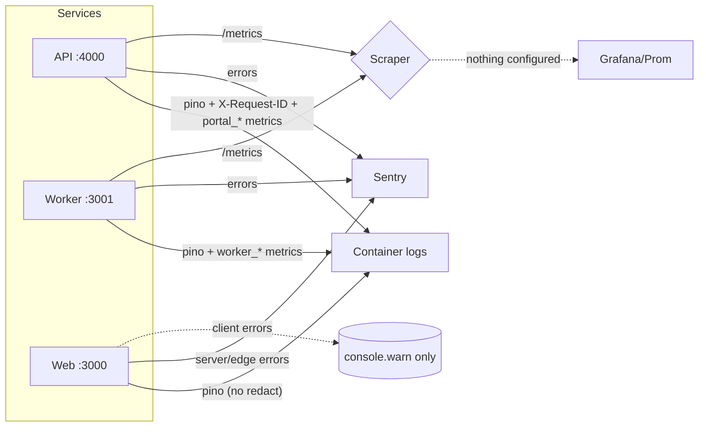

# Observability, Monitoring, and Incident Readiness Audit

## Audit Metadata

- Audit name: repo-deep-dive
- Run: 20260801-0233-develop-a585f1d
- Repository: C:\temp\mainecybertech-portal
- Branch: develop
- Commit SHA: a585f1d
- Generated at: 2026-08-01
- Auditor: principal repository auditor (automated, evidence-based)
- Area code: OBS
- Output path: prompts/repo-deep-dive/20260801-0233-develop-a585f1d/14_observability_monitoring_incident_readiness.md
- Scope limitations: Read-only audit. No code modified, no production connections, no destructive commands. Evidence gathered from source files, infra config, CI workflows, and docs in this commit. Live production metric/log/alert state is `Unknown` (not assessable from this commit).

## Scope

Reviewed: structured logs (API/Worker/Web), request IDs/correlation, error tracking (Sentry), Prometheus metrics + `/metrics` endpoints, tracing, health/readiness endpoints, client/API/worker error visibility, job metrics, DB/queue/webhook/notification metrics, uptime checks, alerts, dashboards, incident runbooks, audit/security logs, release markers, user-impact signals, data-quality signals.

Not reviewed (no evidence in this commit): live production dashboards, real-time Prometheus data, Sentry project alert rules, DO monitoring alarm config, log forwarding pipeline, actual incident history.

## Evidence Reviewed

| Evidence | Type | Why relevant | Notes |
| -------- | ---- | ------------ | ----- |
| `apps/api/src/lib/logger.ts` | Source | API structured logging | pino, `env.LOG_LEVEL`, 14-path redact list, pino-pretty in dev |
| `apps/api/src/middleware/request-id.ts` | Source | Request IDs + HTTP metrics | `req.id` child logger, X-Request-ID echo, finish-log, `httpRequestsTotal`/`httpRequestDuration` |
| `apps/api/src/middleware/error.ts` | Source | Error handler | Sentry.captureException with requestId/path/method/user; logger.error/warn |
| `apps/api/src/lib/sentry.ts` | Source | Sentry init | No-op without SENTRY_DSN; tracesSampleRate 0.2 prod |
| `apps/api/src/lib/metrics.ts` | Source | Prometheus metrics | registry + default metrics prefix `portal_`; 11 custom metric definitions |
| `apps/api/src/app.ts:71,130-137` | Source | `/metrics` route | `register.metrics()` with `rateLimitMetrics` guard |
| `apps/api/src/routes/health.ts` | Source | API health | database/Stripe/JSM only; 503 when degraded |
| `apps/api/src/routes/webhooks.ts:197,275,358,425` | Source | Webhook metric calls | `recordWebhookDelivery` on success paths only |
| `apps/api/src/routes/auth.ts:75,91` | Source | Auth metric calls | `recordAuthAttempt` success/failure |
| `apps/api/src/routes/uptime-monitor.ts` | Source | Uptime UI routes | CRUD/dashboard only; reads stored `uptime_results` |
| `apps/api/src/routes/audit.ts` | Source | Audit log viewer | GET `/` + `/export`; backed by `audit_logs` |
| `apps/api/src/services/audit.ts` | Source | Audit logging | `logAuditEvent` → `audit_logs` insert |
| `apps/api/src/routes/notifications.ts` | Source | SSE stream | keepalive 30s; 5-min auth revalidation (Bearer-only header bug) |
| `apps/worker/src/logger.ts` | Source | Worker structured logging | pino + redact list (same shape as API) |
| `apps/worker/src/metrics.ts` | Source | Worker Prometheus metrics | taskExecutionsTotal, taskExecutionDuration, taskQueueDepth, workerMemoryUsage |
| `apps/worker/src/health-server.ts` | Source | Worker health + metrics | `/health` always 200; `/metrics` served |
| `apps/worker/src/task-registry.ts` | Source | Task execution + metrics | executeTask records duration/status; Sentry on throw |
| `apps/worker/src/main.ts` | Source | Worker bootstrap | Sentry init, health server, stripe-reconcile setInterval, crash handler |
| `apps/worker/src/tasks/module-tasks.ts:240-288` | Source | Uptime check task | `website-monitor-check` performs real HTTP checks into `uptime_results` — never scheduled |
| `apps/web/lib/logger.ts` | Source | Web structured logging | pino, NO redact config |
| `apps/web/instrumentation.ts` | Source | Web Sentry bootstrap | loads server + edge configs only |
| `apps/web/sentry.server.config.ts` | Source | Web server Sentry | 0.2 prod traces; guarded by DSN |
| `apps/web/sentry.edge.config.ts` | Source | Web edge Sentry | 0.2 prod traces; guarded by DSN |
| `apps/web/lib/api.ts` | Source | Web API client | MCTClient with cookie token; NEXT_PUBLIC_API_URL fallback |
| `apps/web/components/NotificationBell.tsx` | Source | Client error visibility | SSE + 30s polling fallback; 8× `console.warn` (no Sentry) |
| `apps/web/components/admin/AdminGlobalSearch.tsx:50` | Source | Client error visibility | `console.warn` on search failure |
| `apps/web/components/portal/PortalGlobalSearch.tsx:48` | Source | Client error visibility | `console.warn` on search failure |
| `packages/sdk/src/client.ts` | Source | SDK retries/timeout | 30s timeout, 3 retries exponential backoff, retryable 429/502/503/504, ApiError |
| `infra/digitalocean/docker-compose.yml` | Infra | Runtime stack | No prometheus/grafana/alertmanager service; healthchecks present |
| `infra/digitalocean/Caddyfile` | Infra | Proxy + SSE | `flush_interval -1` for SSE stream; no observability routes |
| `docs/MONITORING_AND_ALERTING.md` | Docs | Monitoring strategy | Section 4 "Prometheus Metrics (Planned)"; incident checklist; no deployed stack |
| `docs/ROLLBACK_PROCEDURES.md` | Docs | Incident recovery | Docker/Supabase/Terraform rollback |
| `docs/FINAL_DEPLOYMENT_OPERATIONS_HANDBOOK.md` | Docs | Ops handbook | Broad runbook |
| `apps/web/app/(admin)/admin/health/page.tsx` | Source | Health dashboard UI | Admin health view (API health data) |
| `apps/api/src/routes/sla.ts:13` | Source | SLA metrics endpoint | `GET /api/v1/sla/metrics` (business metrics, not ops) |
| `apps/api/src/routes/analytics.ts` | Source | Analytics endpoint | `POST /track`, `GET /`, `GET /summary` |

## Executive Summary

The repository has a genuinely solid observability *foundation* but almost no observability *delivery*. All three services emit structured pino JSON logs; API and Worker configure PII redaction; API injects `X-Request-ID` correlation and per-request child loggers; API and Worker both expose Prometheus-format `/metrics` endpoints (API at `/metrics` with `portal_` prefix, Worker at `/metrics` with task counters/histograms); Sentry is wired into API, Worker, and Web (server + edge); and there is an audit log table plus an admin health dashboard. That is the good news.

The dominant systemic gap: **metrics are emitted but nothing scrapes them and no alert rules exist anywhere in the repo.** `docker-compose.yml` contains no Prometheus, Grafana, or Alertmanager service; `docs/MONITORING_AND_ALERTING.md` section 4 labels the Prometheus stack "Planned". So `portal_http_requests_total`, `worker_task_executions_total`, and every other metric are dead data. Operators currently rely on: Sentry email for app exceptions, GitHub notifications for deploy failures, Docker `restart: unless-stopped` self-healing, and DO dashboard manual checks. A Redis outage, a dead worker consumer, or a webhook failure storm is invisible until a user complains.

Secondary gaps that weaken diagnosis:

- **Health endpoints overstate readiness.** API `/health` (`apps/api/src/routes/health.ts:8-85`) checks only DB/Stripe/JSM — no Redis, no worker reachability, no queue depth. Worker `/health` (`apps/worker/src/health-server.ts:9-20`) returns `200 "healthy"` unconditionally regardless of consumer state. Docker healthchecks will never fail for these causes.
- **`dbQueryDuration` and 9 of 13 metric helpers are never called.** Only `recordWebhookDelivery` (webhooks.ts) and `recordAuthAttempt` (auth.ts) have callers. DB latency, entity creation, search, circuit-breaker state, idempotency hits, active orgs/users metrics are dead code.
- **`worker_task_queue_depth` is misleading.** `apps/worker/src/metrics.ts:51` labels the gauge with `queue: "registered"` and sets it to the *count of registered task types*, not the BullMQ queue depth. It will report ~20 even when the queue has 0 or 5,000 pending jobs.
- **Web has no client-side error tracking.** Only `sentry.server.config.ts` and `sentry.edge.config.ts` exist; there is no `sentry.client.config.ts`, so browser-side JS errors and failed fetches surface only as `console.warn` (NotificationBell, search components).
- **Web logger has no redaction.** `apps/web/lib/logger.ts` is bare pino — a PII-leak risk if server components log user data.
- **No distributed tracing.** Sentry `tracesSampleRate: 0.2` in prod is the only tracing; no OTel spans, no web→API→DB correlation of individual requests end-to-end.
- **Uptime checks for the platform don't run.** `website-monitor-check` in `module-tasks.ts:240-288` does real HTTP checks but is registered, not scheduled (no producer — see RES-P0-001). `uptime-monitor.ts` routes are CRUD/dashboard only.

Recommended next actions: (1) deploy a Prometheus + Grafana (+ Alertmanager or Grafana alerting) stack in docker-compose and scrape API/Worker metrics; (2) define and configure alert rules for the golden signals (error rate, latency p95, queue backlog, worker dead, Redis down, health degraded); (3) fix `taskQueueDepth` to read real BullMQ depth; (4) wire the 9 unused metric helpers and `dbQueryDuration`; (5) add `sentry.client.config.ts` + release tracking; (6) split liveness/readiness and add Redis/worker probes; (7) add redaction to the web logger; (8) schedule `website-monitor-check` so platform uptime is actually measured.

## Inventory

| Item | Path / symbol | Purpose | Current state | Risk | Notes |
| ---- | ------------- | ------- | ------------- | ---- | ----- |
| API pino logger | `apps/api/src/lib/logger.ts` | Structured logs | Implemented (redacted) | Low | 14-path redact; level from env |
| Worker pino logger | `apps/worker/src/logger.ts` | Structured logs | Implemented (redacted) | Low | Same redact shape as API |
| Web pino logger | `apps/web/lib/logger.ts` | Structured logs | Implemented (no redact) | Medium | PII-leak risk in server components |
| Request ID middleware | `apps/api/src/middleware/request-id.ts` | Correlation | Implemented (API only) | Medium | No X-Request-ID propagation to worker/web |
| HTTP request metrics | `apps/api/src/middleware/request-id.ts:41-49` | Golden signals | Implemented | Low | Total + duration histogram per route/status |
| DB query metrics | `apps/api/src/lib/metrics.ts:22` | DB latency | DEAD CODE | High | `dbQueryDuration` never called |
| Webhook metrics | `apps/api/src/routes/webhooks.ts` | Delivery throughput | Partial | Medium | success-only; failures not counted |
| Auth metrics | `apps/api/src/routes/auth.ts:75,91` | Auth attempts | Implemented | Low | success + failure |
| Entity/metric helpers | `apps/api/src/lib/metrics.ts:107-140` | Orgs/projects/tickets/docs/search/CB/idempotency/users | DEAD CODE (9 helpers) | Medium | No callers |
| API `/metrics` | `apps/api/src/app.ts:130-137` | Prometheus scrape | Implemented | Medium | Unauthenticated (rate-limited only) |
| Worker `/metrics` | `apps/worker/src/health-server.ts:21-33` | Prometheus scrape | Implemented | Medium | taskQueueDepth gauge is wrong |
| Worker task metrics | `apps/worker/src/task-registry.ts:45-62` | Job metrics | Implemented | Low | duration + status counters |
| API health | `apps/api/src/routes/health.ts` | Readiness | Partial | High | DB/Stripe/JSM only; no Redis/worker/queue |
| Worker health | `apps/worker/src/health-server.ts:9-20` | Readiness | False-green | High | Always 200 "healthy" |
| Sentry (API) | `apps/api/src/lib/sentry.ts`, `error.ts` | Error tracking | Implemented | Low | 0.2 prod traces |
| Sentry (Worker) | `apps/worker/src/main.ts:11-18`, `task-registry.ts:65` | Error tracking | Implemented | Low | task-level + main-loop |
| Sentry (Web server/edge) | `instrumentation.ts`, `sentry.server.config.ts`, `sentry.edge.config.ts` | Error tracking | Partial | Medium | No client config |
| Sentry (Web client) | `sentry.client.config.ts` | Client error tracking | ABSENT | High | Browser errors invisible |
| Client error visibility | `NotificationBell.tsx`, search components | UX diagnostics | console.warn only | Medium | No Sentry/RUM |
| SDK resilience | `packages/sdk/src/client.ts` | Client error handling | Implemented | Low | retries, timeout, ApiError |
| Uptime checks (platform) | `apps/worker/src/tasks/module-tasks.ts:240-288` | External probing | Registered, never scheduled | High | Depends on RES-P0-001 |
| Uptime UI | `apps/api/src/routes/uptime-monitor.ts` | Dashboard data | Implemented | Medium | Reads stored results only |
| Audit log | `apps/api/src/services/audit.ts`, `routes/audit.ts` | Audit/security log | Implemented | Low | audit_logs table + viewer/export |
| Prometheus/Grafana | `infra/digitalocean/docker-compose.yml` | Scraping/dashboards | ABSENT | Critical | "Planned" per docs |
| Alerting | none in repo | Detect failures | ABSENT | Critical | Sentry email + GitHub notif only |
| Dashboards | none in repo | Visualize metrics | ABSENT | High | Admin health page is the only UI |
| Incident runbooks | `docs/MONITORING_AND_ALERTING.md`, `ROLLBACK_PROCEDURES.md` | Recovery | Documented | Medium | No severity/comm template |
| Release markers | GHCR SHA images + deploy-do.yml | Deploy traceability | Implemented | Low | No Sentry release tagging |

## Domain Scorecard

| Category                              | Score | Evidence | Gap | Recommended action |
| ------------------------------------- | ----: | -------- | --- | ------------------ |
| Structured logs                       |    4 | logger.ts (api+worker+web) | Web logger lacks redaction | Add redact to `apps/web/lib/logger.ts` |
| Request IDs/correlation               |    3 | request-id.ts | API-only; not propagated to worker/web/SSE | Emit X-Request-ID in web client; log in worker |
| Error tracking                        |    3 | Sentry api/worker/web-server+edge | No web client config; no release tracking | Add `sentry.client.config.ts`; `Sentry.setRelease` |
| Metrics                               |    3 | metrics.ts (api+worker), `/metrics` routes | 9 helpers + dbQueryDuration unused; no scrape target | Wire helpers; add prometheus scrape job |
| Tracing                               |    1 | Sentry tracesSampleRate 0.2 | No OTel/spans/distributed traces | Add OTel or Sentry trace propagation headers |
| Health/readiness                      |    3 | health.ts, health-server.ts | No Redis/worker/queue; worker always 200 | Split liveness/readiness; add probes |
| Client/API/worker errors              |    3 | error.ts, task-registry.ts, SDK, NotificationBell | Client errors = console.warn only | Route client errors to Sentry |
| Job metrics                           |    2 | task-registry.ts, metrics.ts | taskQueueDepth is fake; no DLQ metric/alerts | Read real BullMQ depth; add failed/DLQ counters |
| DB/queue/webhook/notification metrics |    1 | dbQueryDuration (dead), webhooks.ts success-only | No DB/queue/notification metrics at all | Instrument Supabase calls + notifications |
| Uptime checks                         |    1 | module-tasks.ts:240-288 (unscheduled) | No scheduler → no platform probes | Schedule `website-monitor-check` (RES-P0-001) |
| Alerts                                |    1 | docs/MONITORING_AND_ALERTING.md §4/§7 | Nothing deployed in-repo | Deploy Alertmanager/Grafana alert rules |
| Dashboards                            |    1 | no grafana/prometheus config | No metric dashboards | Add Grafana provisioned dashboards |

## Detailed Review

### Item: Structured logs

- Evidence: `apps/api/src/lib/logger.ts:6-44`, `apps/worker/src/logger.ts:4-40`, `apps/web/lib/logger.ts:4-17`.
- What it does: JSON structured logging via pino across all services; API/Worker redact secrets/PII; web is bare.
- How it appears to work: API and Worker `redact` covers `password/secret/token/authorization/cookie/email/phone/fullName` (+ nested `req.headers.*`). Web has no redact config. Log level from env (`LOG_LEVEL`).
- Dependencies: pino; `pino-pretty` in non-production.
- Current controls: Redaction (api+worker); request-scoped child logger in API.
- Missing controls: Web redaction; shared redact config; log shipping/retention (no vector/Loki sidecar in compose).
- Risks: Web server components logging user data would leak PII unredacted.
- Recommended improvement: Mirror the API redact list in `apps/web/lib/logger.ts`; add log forwarding (vector) as backlog.
- Suggested tests: Unit test that web logger redacts `email`/`token` keys.
- Suggested docs: `docs/MONITORING_AND_ALERTING.md` §1 already documents redaction — extend to note web gap is fixed.

### Item: Request IDs / correlation

- Evidence: `apps/api/src/middleware/request-id.ts:15-20` (`req.id`, `rootLogger.child({requestId})`), `:22-53` (requestLogger), `apps/api/src/middleware/error.ts:13` (uses `req.id`).
- What it does: Assigns/carries `X-Request-ID`, adds it to all API logs, echoes header, and records HTTP metrics.
- How it appears to work: Solid within the API process — every log line and Sentry event carries `requestId`.
- Dependencies: Express middleware order (`app.ts:123-124`).
- Current controls: Inbound echo + child logger + error handler.
- Missing controls: No propagation into Worker tasks (task logs have no correlation to the originating request); Web server components do not forward the header; SSE stream has no per-connection id.
- Risks: Cross-service debugging (web→API→worker→email/webhook) requires manual correlation.
- Recommended improvement: Accept/forward `x-request-id` in the web SDK and client components; stamp worker task logs with the originating request id where available.
- Suggested tests: Assert child logger carries requestId; assert SSE events log connection id.
- Suggested docs: Add correlation matrix to `docs/MONITORING_AND_ALERTING.md`.

### Item: Error tracking

- Evidence: `apps/api/src/lib/sentry.ts:4-13`, `apps/api/src/middleware/error.ts:15-18`, `apps/worker/src/main.ts:11-18`, `apps/worker/src/task-registry.ts:65-67`, `apps/web/instrumentation.ts`, `sentry.server.config.ts`, `sentry.edge.config.ts`.
- What it does: Sentry captures API route errors (with requestId/path/method/user), worker task throws + main-loop crashes, and web server/edge route errors.
- How it appears to work: API + Worker coverage is good; all three skip init when DSN unset.
- Dependencies: `SENTRY_DSN` (API/worker), `NEXT_PUBLIC_SENTRY_DSN` (web); Sentry account.
- Current controls: `captureException` in error middleware and task wrapper; `captureRequestError` in web instrumentation.
- Missing controls: **No `sentry.client.config.ts`** (browser errors never captured); no release/SHA tagging; no user-scoping in web; no environment override beyond NODE_ENV.
- Risks: Client-side failures (UI crashes, failed API calls in the browser) are invisible; cannot map errors to deploy SHA.
- Recommended improvement: Add `sentry.client.config.ts`; `Sentry.setRelease(process.env.NEXT_PUBLIC_VERCEL_GIT_COMMIT_SHA ?? process.env.IMAGE_TAG)` in web init; scope web user.
- Suggested tests: E2E triggering a client error asserts Sentry capture (mock).
- Suggested docs: Document DSN set + release tagging in `docs/MONITORING_AND_ALERTING.md` §5.

### Item: Metrics

- Evidence: `apps/api/src/lib/metrics.ts` (full file), `apps/api/src/app.ts:130-137`, `apps/worker/src/metrics.ts`, `apps/worker/src/health-server.ts:21-33`.
- What it does: Exposes Prometheus-format metrics for API (HTTP totals/durations + default Node metrics, `portal_` prefix) and Worker (task executions/duration/memory).
- How it appears to work: Both `/metrics` endpoints serve correctly; API route is rate-limited (`rateLimitMetrics`).
- Dependencies: `prom-client`; nothing scrapes them today.
- Current controls: Emitted counters/histograms; default metrics (Node event loop, memory).
- Missing controls: No scrape target in compose; 9 helper functions dead (`recordOrganizationCreated`, `recordProjectCreated`, `recordTicketCreated`, `recordDocumentCreated`, `recordSearchQuery`, `setCircuitBreakerStatus`, `setActiveOrganizations`, `setActiveUsers`, `recordIdempotencyKeyHit`); `dbQueryDuration` never observed; no web metrics (web is Next.js with no prom-client).
- Risks: Operators cannot see traffic, error rate, latency distribution, or task throughput in any dashboard; metric definitions imply capability that does not exist.
- Recommended improvement: Add a `prometheus` service to docker-compose scraping `api:4000/metrics` and `worker:3001/metrics`; wire unused helpers at their natural callsites (organization/project/ticket/document create, search, idempotency, circuit breaker); add `dbQueryDuration` observer around the Supabase query helper.
- Suggested tests: Scrape `/metrics` and assert labels exist; unit test each helper increments.
- Suggested docs: Update `docs/MONITORING_AND_ALERTING.md` §4 from "Planned" to deployed.

### Item: Tracing

- Evidence: `apps/api/src/lib/sentry.ts:11`, `apps/web/sentry.server.config.ts:8`, `sentry.edge.config.ts:8`, `apps/worker/src/main.ts:15`.
- What it does: Sentry transaction sampling at 0.2 in production for API/Worker/Web server.
- How it appears to work: Sampling exists, but no OTel, no manual spans, no propagation of trace context across the web→API boundary beyond Sentry's auto-instrumentation (which for Next.js/Express is partial).
- Dependencies: Sentry.
- Current controls: tracesSampleRate; Sentry auto-instrumentation.
- Missing controls: No OpenTelemetry exporter; no explicit web→API trace header propagation in the SDK; no DB span instrumentation; no per-route latency breakdown outside Sentry.
- Risks: End-to-end latency attribution for a slow request (web→API→Supabase→email/webhook) is guesswork.
- Recommended improvement: Enable Sentry tracing propagation in the SDK (`fetch` with `baggage`/`sentry-trace`) and consider OTel for DB spans; at minimum add `tracesSampleRate` in client config.
- Suggested tests: Assert a trace id is present on SDK-initated requests.
- Suggested docs: Document tracing strategy in `docs/MONITORING_AND_ALERTING.md`.

### Item: Health / readiness

- Evidence: `apps/api/src/routes/health.ts:8-85`, `apps/worker/src/health-server.ts:9-20`, `infra/digitalocean/docker-compose.yml:66-70` (api healthcheck), `:32-36` (redis ping).
- What it does: API `/health` returns 200/503 with per-dependency checks (database/Stripe/JSM); Worker `/health` returns 200 always; Docker healthchecks wrap them.
- How it appears to work: Docker restarts unhealthy containers; CI post-deploy health loop checks API and web.
- Dependencies: Supabase, Stripe, JSM for API health; nothing for worker.
- Current controls: DB probe (`select` from roles, `head: true`), Stripe/JSM fetch with 5s AbortController.
- Missing controls: No Redis `PING`; no worker reachability probe; no queue-depth check; no liveness (process up) vs readiness (deps ready) split; worker health ignores consumer state (BullMQ connection, in-flight count).
- Risks: `docker healthcheck` for the worker doesn't exist in compose (worker has no healthcheck block — compose lines 72-106 define no healthcheck); a dead worker consumer is never detected by Docker or the API.
- Recommended improvement: Add worker healthcheck in compose; extend API health with Redis ping + worker reachability + queue depth; make worker health return 503 when consumer is not running.
- Suggested tests: Health suite with Redis down; worker health test with consumer stopped.
- Suggested docs: Update `docs/MONITORING_AND_ALERTING.md` §2 table.

### Item: Client / API / worker errors

- Evidence: `apps/api/src/middleware/error.ts`, `apps/worker/src/task-registry.ts:58-69`, `packages/sdk/src/client.ts` (ApiError/retries), `apps/web/components/NotificationBell.tsx:38-70,93-169`, `AdminGlobalSearch.tsx:50`, `PortalGlobalSearch.tsx:48`.
- What it does: API/Worker route all errors through Sentry + structured logs; SDK surfaces typed ApiError with retry; client components degrade gracefully.
- How it appears to work: Server-side is strong; client-side errors are `console.warn` only — no Sentry capture, no error boundary for these components (global boundaries exist but only for thrown render errors).
- Dependencies: SDK, Sentry (server).
- Current controls: error middleware, task wrapper, SDK retries, client-side fallbacks (SSE→polling).
- Missing controls: Client error telemetry; no metric for client-side API failures.
- Risks: User-visible failures in the browser leave no trace.
- Recommended improvement: Add `sentry.client.config.ts` + `Sentry.captureException`/`captureMessage` in client catch blocks; add a small `reportClientError` helper.
- Suggested tests: Component test asserting Sentry capture on failed fetch.
- Suggested docs: —.

### Item: Job metrics

- Evidence: `apps/worker/src/metrics.ts`, `apps/worker/src/task-registry.ts:45-62`.
- What it does: Records task executions (status: success/failure/error/no_handler), duration histogram, memory, and a "queue depth" gauge.
- How it appears to work: Correct for completed executions; **`taskQueueDepth` is wrong** — `getMetrics()` sets `queue: "registered"` to `getRegisteredTaskTypes().length` (~20), not the actual BullMQ pending count.
- Dependencies: prom-client; BullMQ (for real depth — not used).
- Current controls: Execution counters/histograms; memory gauge.
- Missing controls: Real queue depth (`worker.getWaitingCount()` / BullMQ queue metric), retry/delayed counts, DLQ (dead-letter) counter, per-task-type alerting.
- Risks: A growing backlog is invisible (gauge stays at ~20 while 5,000 jobs pile up).
- Recommended improvement: Replace `taskQueueDepth` with real BullMQ counts (waiting/delayed/active/completed/failed) via the queue instance; keep `registered` as a separate gauge.
- Suggested tests: Enqueue N jobs, assert gauge reflects N.
- Suggested docs: Update worker metrics table in `docs/MONITORING_AND_ALERTING.md`.

### Item: DB / queue / webhook / notification metrics

- Evidence: `apps/api/src/lib/metrics.ts:22-28` (dbQueryDuration, dead), `webhooks.ts:197,275,358,425` (success-only deliveries), `notifications.ts` (no metrics), queue (none).
- What it does: Intended to expose DB latency, webhook throughput, and queue/notification signals.
- How it appears to work: Only webhook success deliveries and auth attempts emit. DB histogram and all entity/notification metrics are absent.
- Dependencies: —.
- Current controls: `webhookDeliveriesTotal`, `authAttemptsTotal`.
- Missing controls: DB query observer (dead code), failed webhook deliveries, notification sends/failures, queue depth in API.
- Risks: DB performance regressions and notification/webhook failures are unmeasured.
- Recommended improvement: Wrap the Supabase query helper to observe `dbQueryDuration`; count failed webhook deliveries (recordWebhookDelivery("failed", ...) in catch paths); add notification send/fail counters.
- Suggested tests: Assert metrics after a failing webhook; assert dbQueryDuration observed on a query.
- Suggested docs: —.

### Item: Uptime checks

- Evidence: `apps/worker/src/tasks/module-tasks.ts:240-288` (`website-monitor-check`), `apps/api/src/routes/uptime-monitor.ts`.
- What it does: A worker task exists that fetches `uptime_checks`, performs real HTTP probes, and writes `uptime_results`; the API exposes CRUD + dashboard/uptime math over those stored results.
- How it appears to work: **Does not run.** The task is registered but never scheduled (no producer — see RES-P0-001). The API routes only serve data that nothing writes (outside the admin creating checks).
- Dependencies: Producer/scheduler (absent).
- Current controls: Task handler + dashboard endpoints.
- Missing controls: Scheduler; also no platform-level probe of api.mainecybertech.com/web itself (the DO/Caddy layer has no uptime checker).
- Risks: The product offers uptime monitoring to clients but the probe never executes — `uptime_results` stays empty and dashboards show 100% vacuously.
- Recommended improvement: Schedule `website-monitor-check` (recurring producer per RES-P0-001); optionally add a synthetic-check task for the portal endpoints.
- Suggested tests: Seed a check, run task, assert `uptime_results` row + dashboard math.
- Suggested docs: Update `docs/MONITORING_AND_ALERTING.md` with an uptime-monitoring section.

### Item: Alerts

- Evidence: `docs/MONITORING_AND_ALERTING.md` §4 (Prometheus "Planned"), §7 (alert triggers table), `infra/digitalocean/docker-compose.yml` (no alerting service).
- What it does: Documented alert triggers (Sentry >10 events/5min, auth endpoint errors, deploy failures, DO CPU/disk). No in-repo Alertmanager/Grafana alert rules or Prometheus rules.
- How it appears to work: Only Sentry email (project-level, configured in Sentry dashboard, not in repo) + GitHub notifications + manual DO monitoring.
- Dependencies: Sentry account, DO account.
- Current controls: Sentry alerts (out-of-repo), GitHub deploy notifications, Docker restart self-healing.
- Missing controls: No alert on Redis down, worker dead, error-rate spike, latency SLO breach, queue backlog, webhook failure rate — because no metrics are scraped.
- Risks: Silent degradation is the norm until users report it.
- Recommended improvement: Deploy Prometheus + Alertmanager (or Grafana alerts) and define the alert set in the suggested-alerts section.
- Suggested tests: CI config validation for alert rules; chaos drill triggers alert.
- Suggested docs: Replace §7 prose with committed alert rules.

### Item: Dashboards

- Evidence: `apps/web/app/(admin)/admin/health/page.tsx` (admin health UI), no grafana/prometheus config.
- What it does: A single admin page renders API health data; no metric dashboards exist.
- How it appears to work: Health page is UI-only (shows health JSON); no time-series views.
- Dependencies: —.
- Current controls: Admin health page.
- Missing controls: Grafana dashboards for golden signals; per-module dashboards; SLA dashboard exists as business UI (`sla.ts`), not ops.
- Risks: No operational visibility into trends (traffic, latency, errors over time).
- Recommended improvement: Provision Grafana dashboards (JSON provisioning) for RED/USE metrics; link from health page.
- Suggested tests: Dashboard JSON validates in CI.
- Suggested docs: Document dashboard URLs in `docs/MONITORING_AND_ALERTING.md`.

### Item: Incident runbooks

- Evidence: `docs/MONITORING_AND_ALERTING.md` §8 (incident checklist), `docs/ROLLBACK_PROCEDURES.md`, `docs/FINAL_DEPLOYMENT_OPERATIONS_HANDBOOK.md`.
- What it does: Documents a 16-step incident checklist and rollback procedures.
- How it appears to work: Adequate for a single-droplet operator, but no severity classification, no communication/blast-radius section, no postmortem template, no on-call rotation.
- Dependencies: —.
- Current controls: Checklist + rollback docs.
- Missing controls: Incident severity/comm matrix; template.
- Risks: Slow/undirected response during a real outage.
- Recommended improvement: Create `docs/INCIDENT_RESPONSE.md` with severity table, roles, comm templates, postmortem template.
- Suggested tests: Tabletop exercise (prompt 33).
- Suggested docs: New `docs/INCIDENT_RESPONSE.md`.

### Item: Audit / security logs

- Evidence: `apps/api/src/services/audit.ts` (`logAuditEvent` → `audit_logs`), `apps/api/src/routes/audit.ts` (GET `/`, `/export`), wired into ~60 mutation routes/services.
- What it does: Captures every mutation (auth, profiles, users, memberships, orgs, documents, projects, tickets, and all 60 module entities) to the `audit_logs` table with org/actor/action/entity.
- How it appears to work: Comprehensive; admin viewer with pagination/filters and CSV/JSON export exists.
- Dependencies: Supabase RLS.
- Current controls: `logAuditEvent`, audit viewer, export.
- Missing controls: No retention/archival policy in-repo; audit failure is swallowed (per audit.ts, errors are logged but not raised).
- Risks: Audit log retention unknown; a failing audit insert is invisible.
- Recommended improvement: Document audit retention; alert on audit-log write failures.
- Suggested tests: Audit retention job test.
- Suggested docs: Retention section in `docs/MONITORING_AND_ALERTING.md`.

### Item: Release markers

- Evidence: GHCR SHA-tagged images, `IMAGE_TAG` in `docker-compose.yml`, deploy-do.yml health verification, `docs/ROLLBACK_PROCEDURES.md`.
- What it does: Every deploy is a SHA-tagged image with rollback capability.
- How it appears to work: Traceable at the image level.
- Dependencies: —.
- Current controls: SHA tags, rollback steps.
- Missing controls: No Sentry release tagging (`Sentry.setRelease`), no app-version exposed in /health or UI.
- Risks: Cannot attribute a Sentry event to a deploy SHA without git archaeology.
- Recommended improvement: Set `Sentry.setRelease` from IMAGE_TAG/SHA in all services; add `version` to health responses.
- Suggested tests: Assert health payload includes version.
- Suggested docs: —.

### Item: User-impact signals

- Evidence: `NotificationBell.tsx` (connectionError UI), error boundaries with "Try again", SDK ApiError messages, SLA metrics UI.
- What it does: Some user-facing failure states exist (notification error banner, retry buttons).
- How it appears to work: Partial; most failures surface as silent `console.warn` + no-op.
- Missing controls: No RUM; no client error rate telemetry; no UX-level SLI.
- Risks: User pain invisible to ops.
- Recommended improvement: RUM via Sentry browser; add client error counter endpoint.
- Suggested tests: E2E asserting error banner + Sentry event.
- Suggested docs: —.

### Item: Data-quality signals

- Evidence: `apps/api/src/routes/sla.ts:13` (SLA metrics), `analytics.ts` (`POST /track`, `GET /summary`), uptime dashboard.
- What it does: Business-level metrics (SLA breaches, uptime percentages) exist as API endpoints.
- How it appears to work: Business metrics present; no data-quality job (orphan/duplicate detection) beyond `retention`/`orphan-cleanup` tasks (which are unscheduled — RES-P0-001).
- Missing controls: No scheduled data-quality checks.
- Risks: Silent data degradation.
- Recommended improvement: Schedule retention/orphan-cleanup; add duplicate-detection metrics.
- Suggested tests: —.
- Suggested docs: —.

## Scenario / Control Matrix

| ID      | Scenario or control                   | Evidence | Current control | Gap | Severity | Recommendation |
| ------- | ------------------------------------- | -------- | --------------- | --- | -------- | -------------- |
| OBS-001 | Structured logs                       | logger.ts (api/worker/web) | pino + redaction (api/worker) | Web logger unredacted | P2 | Add redact to web logger |
| OBS-002 | Request IDs/correlation               | request-id.ts | API request id + child logger | Not propagated to worker/web | P2 | Propagate x-request-id |
| OBS-003 | Error tracking                        | sentry.*, error.ts, task-registry.ts | API/Worker/Web-server Sentry | No web client config | P1 | Add sentry.client.config.ts |
| OBS-004 | Metrics                               | metrics.ts, app.ts, health-server.ts | /metrics endpoints | 9 helpers + dbQueryDuration dead; no scrape | P1 | Wire helpers; add prometheus |
| OBS-005 | Tracing                               | sentry 0.2 sampling | Sentry sampling | No OTel/distributed traces | P2 | Add trace propagation/OTel |
| OBS-006 | Health/readiness                      | health.ts, health-server.ts | DB/Stripe/JSM + worker always 200 | No Redis/worker/queue; no worker healthcheck | P1 | Add probes + worker healthcheck |
| OBS-007 | Client/API/worker errors              | error.ts, SDK, NotificationBell | Server-side + SDK retries | Client console.warn only | P2 | Client Sentry capture |
| OBS-008 | Job metrics                           | task-registry.ts, metrics.ts | Execution counters | taskQueueDepth is fake | P1 | Real BullMQ depth |
| OBS-009 | DB/queue/webhook/notification metrics | dbQueryDuration (dead), webhooks.ts | Webhook/auth counters | DB/queue/notification absent | P2 | Instrument DB + notifications |
| OBS-010 | Uptime checks                         | module-tasks.ts:240-288 | Task registered | Never scheduled | P1 | Schedule website-monitor-check |
| OBS-011 | Alerts                                | docs §4/§7, compose | Sentry email + GitHub notif | No metrics-based alerts deployed | P1 | Deploy Alertmanager rules |
| OBS-012 | Dashboards                            | admin health page | Single health UI | No metric dashboards | P2 | Provision Grafana |

## Findings

### Finding ID: OBS-P1-001 - Metrics are emitted but nothing scrapes them; no alerting is deployed anywhere in the repo

- Severity: P1
- Confidence: High
- Area: Observability / Alerting / Infra
- Evidence:
  - `apps/api/src/lib/metrics.ts` (registry + custom metrics)
  - `apps/api/src/app.ts:130-137` (`/metrics` route)
  - `apps/worker/src/health-server.ts:21-33` (worker `/metrics`)
  - `infra/digitalocean/docker-compose.yml` (services: redis, api, worker, web, caddy — no prometheus/grafana/alertmanager)
  - `docs/MONITORING_AND_ALERTING.md:115-140` (Prometheus "Planned"), `:183-213` (alert triggers, none in-repo)
- What is happening: API and Worker both expose valid Prometheus metrics, but no service in docker-compose scrapes them, and no alert rules exist in the repository. The documented alert path is Sentry email + GitHub notifications + DO dashboard (manual).
- Why it matters: Every emitted metric is dead data; error rate, latency, task throughput, Redis state, and queue backlog are invisible. A production degradation is detected only when users complain.
- User / business impact: Undetected outages; longer time-to-detect (TTD); no data to answer "what changed?"
- Security / privacy / reliability impact: Reliability; no SLI/SLO measurement possible; incident response is reactive.
- Recommended fix: Add a `prometheus` service to docker-compose scraping `api:4000/metrics` and `worker:3001/metrics` (internal, not exposed publicly); add Alertmanager or Grafana alerting with the rules in "Suggested Alerts" below.
- Suggested validation: `docker compose up` → `curl localhost:9090/api/v1/targets` shows both targets up; alert rule fires on a deliberately induced failure.
- Owner suggestion: SRE / platform engineer.
- Effort estimate: 1-2 days.
- Dependencies: None (compose change only).
- Status: Open

### Finding ID: OBS-P1-002 - Health endpoints overstate readiness (no Redis/worker/queue; worker always 200) and worker lacks a Docker healthcheck

- Severity: P1
- Confidence: High
- Area: Observability / Health / Readiness
- Evidence:
  - `apps/api/src/routes/health.ts:8-85` (database/stripe/jsm checks only)
  - `apps/worker/src/health-server.ts:9-20` (unconditional `status: "healthy"`, always 200)
  - `infra/digitalocean/docker-compose.yml:66-70` (api healthcheck), `:72-106` (worker has NO healthcheck block)
- What is happening: API `/health` reports healthy even when Redis is down or the worker is unreachable; worker `/health` is hard-coded healthy regardless of consumer state; Docker does not healthcheck the worker at all.
- Why it matters: Readiness signals are false-green. Deploy verification and Docker restart logic cannot detect the two most common single-point failures (Redis, worker consumer).
- User / business impact: Notifications/email/tasks silently stop while all dashboards show green.
- Security / privacy / reliability impact: Reliability; masks dependency outages.
- Recommended fix: Extend `health.ts` with Redis `PING` and worker reachability + queue-depth checks; make worker health reflect consumer state (503 when consumer down); add a worker healthcheck to compose (`wget http://localhost:3001/health`).
- Suggested validation: Health test suite with Redis down and worker stopped; assert 503.
- Owner suggestion: Backend/SRE.
- Effort estimate: 4 hours.
- Dependencies: None. Cross-reference RES-P1-004.
- Status: Open

### Finding ID: OBS-P1-003 - No web client-side error tracking (sentry.client.config.ts missing); browser failures are console.warn only

- Severity: P1
- Confidence: High
- Area: Observability / Error tracking
- Evidence:
  - `apps/web/instrumentation.ts` (loads server + edge only)
  - Glob: `apps/web/**/sentry*` → only `sentry.server.config.ts`, `sentry.edge.config.ts`; no client config
  - `apps/web/components/NotificationBell.tsx:38-169` (8× `console.warn`)
  - `apps/web/components/admin/AdminGlobalSearch.tsx:50`, `apps/web/components/portal/PortalGlobalSearch.tsx:48` (`console.warn`)
- What is happening: The web app is heavily client-rendered (portal/admin), but browser-side JS errors, failed fetches, and SSE failures are only logged to `console.warn` — never sent to Sentry.
- Why it matters: The most common user-facing failures happen in the browser and leave no telemetry; error boundaries are server-side/route-level, not component-level.
- User / business impact: UI breakage and failed actions invisible to ops.
- Security / privacy / reliability impact: Reliability; no client error-rate SLI.
- Recommended fix: Add `apps/web/sentry.client.config.ts` (`Sentry.init` guarded by `NEXT_PUBLIC_SENTRY_DSN`, tracesSampleRate 0.2 prod); route `console.warn` catch blocks through `Sentry.captureException`/`captureMessage` (small `lib/client-report.ts` helper).
- Suggested validation: Component test with mocked Sentry asserting capture on failed fetch; E2E trigger of a client error.
- Owner suggestion: Web engineer.
- Effort estimate: 4-6 hours.
- Dependencies: None.
- Status: Open

### Finding ID: OBS-P1-004 - worker_task_queue_depth reports the count of registered task types, not the actual queue depth

- Severity: P1
- Confidence: High
- Area: Observability / Job metrics
- Evidence:
  - `apps/worker/src/metrics.ts:23-28` (taskQueueDepth gauge), `:49-52` (`taskQueueDepth.set({ queue: "registered" }, getRegisteredTaskTypes().length)`)
- What is happening: The "queue depth" metric is set to `getRegisteredTaskTypes().length` (~20), a static number that is identical whether the queue is empty or has 10,000 pending jobs.
- Why it matters: Job backlog — the single most important queue signal — cannot be monitored. When a producer is added (RES-P0-001), this metric will still lie.
- User / business impact: Silent job pileup (email/notification/webhook backlogs) with no visible backlog.
- Security / privacy / reliability impact: Reliability.
- Recommended fix: Use the BullMQ queue instance to set real counts (waiting/delayed/active/completed/failed) as labeled gauges; keep `registered` as a separate informational gauge.
- Suggested validation: Integration test: enqueue N jobs, assert gauge reflects N; complete them, assert returns to 0.
- Owner suggestion: Backend engineer.
- Effort estimate: 2-4 hours.
- Dependencies: Producer (RES-P0-001) to make it meaningful.
- Status: Open

### Finding ID: OBS-P2-001 - dbQueryDuration histogram and 9 of 11 metric helpers are dead code

- Severity: P2
- Confidence: High
- Area: Observability / Metrics
- Evidence:
  - `apps/api/src/lib/metrics.ts:22-28` (`dbQueryDuration`)
  - `apps/api/src/lib/metrics.ts:107-140` (`recordOrganizationCreated`, `recordProjectCreated`, `recordTicketCreated`, `recordDocumentCreated`, `recordSearchQuery`, `setCircuitBreakerStatus`, `setActiveOrganizations`, `setActiveUsers`, `recordIdempotencyKeyHit`)
  - Grep for callers: only `recordWebhookDelivery` (`webhooks.ts:197,275,358,425`) and `recordAuthAttempt` (`auth.ts:75,91`) are referenced
- What is happening: The API defines DB latency and entity/process metrics but never calls them. `dbQueryDuration` is never observed; the entity counters never increment.
- Why it matters: DB performance regressions, entity growth, circuit-breaker trips, and idempotency replay are unmeasured — exactly the signals needed to diagnose load incidents.
- Recommended impact: No data for capacity planning or DB tuning.
- Recommended fix: Wrap the shared Supabase query helper (or key DB calls) to observe `dbQueryDuration`; call the helpers at their natural callsites (create handlers, search route, idempotency middleware, circuit-breaker state changes, org/user count jobs).
- Suggested validation: Unit tests asserting metric values after a query/create/search; verify on /metrics scrape.
- Owner suggestion: Backend engineer.
- Effort estimate: 4-6 hours.
- Dependencies: None.
- Status: Open

### Finding ID: OBS-P2-002 - Web pino logger has no PII redaction

- Severity: P2
- Confidence: Medium
- Area: Observability / Privacy / Logging
- Evidence:
  - `apps/web/lib/logger.ts:4-17` (bare pino; no `redact`)
  - Contrast: `apps/api/src/lib/logger.ts:8-31` and `apps/worker/src/logger.ts:6-27` (14-path redact lists)
- What is happening: Web server components/actions log with pino but without the redaction list that API and Worker use.
- Why it matters: If a server action logs request payloads or user fields, `email`, `phone`, tokens, or auth cookies would be written to container logs in plaintext.
- User / business impact: Potential PII exposure in logs.
- Security / privacy / reliability impact: Privacy.
- Recommended fix: Add the same `redact` config to `apps/web/lib/logger.ts` (share via `@mct/config` or a small helper).
- Suggested validation: Unit test asserting a logged `{ email }` object is redacted.
- Owner suggestion: Web engineer.
- Effort estimate: 30 min.
- Dependencies: None.
- Status: Open

### Finding ID: OBS-P2-003 - Request correlation is API-only; worker tasks and web requests carry no X-Request-ID

- Severity: P2
- Confidence: High
- Area: Observability / Correlation
- Evidence:
  - `apps/api/src/middleware/request-id.ts:15-20` (API-only)
  - `apps/worker/src/task-registry.ts` (task logs carry `type` only, no requestId)
  - `apps/web/lib/api.ts` (MCTClient; no x-request-id forwarding observed)
- What is happening: Correlation ids exist inside the API process only. A user action that flows web→API→worker→webhook/email cannot be traced as a single unit.
- Why it matters: Debugging async failures requires manual matching across 3 services' logs.
- Recommended improvement: Forward inbound `x-request-id` from the SDK; stamp worker task logs with originating request id when enqueued; add connection-id to SSE logs.
- Suggested validation: E2E asserts a single id across web/API logs.
- Owner suggestion: Backend + web engineers.
- Effort estimate: 4 hours.
- Dependencies: RES-P0-001 (producer) to propagate ids into tasks.
- Status: Open

### Finding ID: OBS-P2-004 - No distributed tracing (no OTel, no cross-service span propagation)

- Severity: P2
- Confidence: Medium
- Area: Observability / Tracing
- Evidence:
  - `apps/api/src/lib/sentry.ts:11`, `apps/web/sentry.server.config.ts:8`, `apps/worker/src/main.ts:15` — Sentry sampling only
  - No `@opentelemetry/*` deps observed; no span instrumentation in the SDK
- What is happening: The only tracing is Sentry transaction sampling (0.2 prod). There is no end-to-end trace spanning web→API→Supabase→worker.
- Why it matters: Latency attribution for slow flows (login, ticket create, notification delivery) is guesswork.
- Recommended improvement: Enable Sentry trace propagation in the SDK fetch layer; consider OTel SDK for Supabase/DB spans; document the tracing story.
- Suggested validation: Assert `sentry-trace`/`baggage` headers on SDK requests.
- Owner suggestion: Platform engineer.
- Effort estimate: 1-2 days.
- Dependencies: None.
- Status: Open

### Finding ID: OBS-P2-005 - Platform uptime is not actually monitored (website-monitor-check never scheduled)

- Severity: P2
- Confidence: High
- Area: Observability / Uptime
- Evidence:
  - `apps/worker/src/tasks/module-tasks.ts:240-288` (`website-monitor-check` performs HTTP probes → `uptime_results`)
  - `apps/api/src/routes/uptime-monitor.ts` (CRUD + dashboard math over stored results)
  - No scheduler/producer (see RES-P0-001)
- What is happening: The uptime-monitor feature sells/offers monitoring, but the task that would populate `uptime_results` is registered only. `uptime_checks` can be created via the API; nothing ever runs the probe, so dashboards report vacuously (100% with zero results).
- Why it matters: The platform's own uptime (api/web/worker behind Caddy) is unmeasured by any synthetic check; client-facing uptime dashboards are misleading.
- Recommended improvement: Schedule `website-monitor-check` on a recurring interval (or queue producer per RES-P0-001); add a synthetic-check task for `https://api.*/health` and the web origin.
- Suggested validation: Seed a check, run task, assert `uptime_results` row + dashboard percentages.
- Owner suggestion: Backend engineer.
- Effort estimate: 1 day.
- Dependencies: RES-P0-001.
- Status: Open

### Finding ID: OBS-P2-006 - Webhook failure/notification metrics absent; only success deliveries are counted

- Severity: P2
- Confidence: Medium
- Area: Observability / Metrics
- Evidence:
  - `apps/api/src/routes/webhooks.ts:197,275,358,425` — `recordWebhookDelivery("success", ...)` only; no `"failed"` call sites
  - `apps/api/src/routes/notifications.ts` — no metric emission
- What is happening: `recordWebhookDelivery` accepts `"failed"` but no code path calls it; notifications (send/read/fail) have no metrics.
- Why it matters: Failure storms in inbound webhooks or outbound notifications are invisible.
- Recommended improvement: Emit `recordWebhookDelivery("failed", ...)` in verification/processing catch paths; add notification counters (sent/failed/read).
- Suggested validation: Unit test asserting failed-delivery metric on a bad signature.
- Owner suggestion: Backend engineer.
- Effort estimate: 2-4 hours.
- Dependencies: None.
- Status: Open

### Finding ID: OBS-P3-001 - No Sentry release tracking or version marker in health payloads

- Severity: P3
- Confidence: High
- Area: Observability / Release markers
- Evidence:
  - `apps/api/src/lib/sentry.ts` (no `Sentry.setRelease`), `apps/web/sentry.server.config.ts`/`sentry.edge.config.ts` (no release), `apps/worker/src/main.ts` (no release)
  - `apps/api/src/routes/health.ts:77-83` (no version field)
- What is happening: Deploys are SHA-tagged images, but Sentry events and health responses do not carry a version/release.
- Why it matters: Correlating an error to a deploy requires git archaeology.
- Recommended improvement: `Sentry.setRelease(process.env.IMAGE_TAG ?? git SHA)` in all three services; add `version` to health payloads.
- Suggested validation: Assert health JSON includes `version`.
- Owner suggestion: Platform engineer.
- Effort estimate: 1 hour.
- Dependencies: None.
- Status: Open

### Finding ID: OBS-P3-002 - Incident response docs lack severity classification and structured communication template

- Severity: P3
- Confidence: High
- Area: Observability / Incident readiness
- Evidence:
  - `docs/MONITORING_AND_ALERTING.md:217-246` (16-step checklist, no severity table)
  - `docs/ROLLBACK_PROCEDURES.md`, `docs/FINAL_DEPLOYMENT_OPERATIONS_HANDBOOK.md`
- What is happening: Recovery procedures are well documented, but there is no severity model (SEV-1..3), no incident commander/owner roles, no communication/blast-radius section, and no postmortem template.
- Recommended improvement: Add `docs/INCIDENT_RESPONSE.md` with severity table, roles, comm templates, and a postmortem template.
- Suggested validation: Tabletop exercise (see prompt 33).
- Owner suggestion: CTO / SRE.
- Effort estimate: 2-3 hours.
- Dependencies: None.
- Status: Open

## Risks

| Risk | Severity | Likelihood | Impact | Evidence | Mitigation |
| ---- | -------- | ---------- | ------ | -------- | ---------- |
| No metrics scraping/alerting → undetected degradation | P1 | Certain | High | compose has no prometheus; docs §4 "Planned" | Deploy Prometheus + alert rules |
| False-green health (Redis/worker invisible) | P1 | High | High | health.ts, health-server.ts, no worker healthcheck | Add probes + worker healthcheck |
| Client errors invisible (no sentry.client.config.ts) | P1 | High | Medium | instrumentation.ts, console.warn usage | Add client Sentry |
| Queue backlog invisible (taskQueueDepth fake) | P1 | High | Medium | metrics.ts:51 | Real BullMQ depth |
| Uptime product claims unsupported (probe never runs) | P2 | Certain | Medium | module-tasks.ts unscheduled | Schedule website-monitor-check |
| DB/entity metrics dead → no capacity data | P2 | Medium | Medium | dbQueryDuration unused; 9 helpers dead | Wire helpers |
| Web logs leak PII (no redact) | P2 | Low | High | web logger.ts | Add redact list |
| Cross-service debugging slow (no correlation/tracing) | P2 | High | Low | request-id API-only; no OTel | Propagate ids; OTel |
| Audit-log write failure silent | P2 | Medium | Medium | services/audit.ts catch | Alert on audit failure |

## Recommendations

### Immediate / Release Blocking

1. **OBS-P1-001:** Deploy a Prometheus service in docker-compose scraping `api:4000/metrics` + `worker:3001/metrics`; expose only internally (Caddy blocks `/metrics` publicly). Add Grafana (or Alertmanager) with the alert set below.
2. **OBS-P1-002:** Add Redis ping + worker reachability to API `/health`; make worker `/health` report 503 when the consumer is down; add a worker healthcheck block in compose.
3. **OBS-P1-003:** Add `apps/web/sentry.client.config.ts` and route client catch blocks through Sentry.

### This Week

4. **OBS-P1-004:** Fix `taskQueueDepth` to read real BullMQ counts (waiting/delayed/active/failed).
5. **OBS-P2-001:** Wire `dbQueryDuration` + the 9 unused metric helpers.
6. **OBS-P2-005:** Schedule `website-monitor-check` (depends on RES-P0-001 producer work).
7. **OBS-P2-002:** Add redaction to `apps/web/lib/logger.ts`.

### This Month

8. **OBS-P2-003 / OBS-P2-004:** Propagate X-Request-ID across services; add Sentry trace propagation in the SDK.
9. **OBS-P2-006:** Add failed-webhook + notification metrics.
10. **OBS-P3-001:** Set Sentry releases + version field in health.
11. **OBS-P3-002:** Create `docs/INCIDENT_RESPONSE.md`.

### Later / Platform Evolution

12. OTel-based distributed tracing with DB span instrumentation; RUM (client performance) via Sentry browser; log shipping (vector → Loki/cloud); audit-log retention + alerting.

## Quick Wins

| Quick win | Why it helps | Files likely involved | Validation |
| --------- | ------------ | --------------------- | ---------- |
| Add prometheus service to compose | Actually scrapes emitted metrics | `infra/digitalocean/docker-compose.yml` | `curl localhost:9090/targets` shows api+worker up |
| Add redact to web logger | Prevents PII in web logs | `apps/web/lib/logger.ts` | Unit test redaction |
| Add worker healthcheck in compose | Docker detects dead worker | `infra/digitalocean/docker-compose.yml` | `docker compose ps` shows worker healthy |
| Make worker /health report consumer state | True readiness | `apps/worker/src/health-server.ts` | Test with consumer stopped → 503 |
| Add `sentry.client.config.ts` | Client errors captured | `apps/web/sentry.client.config.ts` | Sentry dashboard shows browser events |
| Set Sentry release from IMAGE_TAG | Map errors to deploys | sentry configs (3 services) | Sentry event shows release SHA |
| Emit `recordWebhookDelivery("failed", ...)` | Failure storms visible | `apps/api/src/routes/webhooks.ts` | Unit test on bad signature |

## Hardening Backlog

| Backlog item | Priority | Owner suggestion | Effort | Dependency |
| ------------ | -------- | ---------------- | ------ | ---------- |
| Deploy Prometheus + alert rules | P1 | SRE | 1-2d | None |
| Health: Redis/worker/queue probes + worker healthcheck | P1 | Backend/SRE | 4h | None |
| Web client Sentry config + capture | P1 | Web | 4-6h | None |
| Real BullMQ queue depth metric | P1 | Backend | 2-4h | RES-P0-001 |
| Wire dbQueryDuration + 9 helpers | P2 | Backend | 4-6h | None |
| Schedule website-monitor-check | P2 | Backend | 1d | RES-P0-001 |
| Web logger redaction | P2 | Web | 30m | None |
| X-Request-ID propagation + trace headers | P2 | Backend/Web | 4h-1d | None |
| Webhook failed + notification metrics | P2 | Backend | 2-4h | None |
| Sentry releases + health version | P3 | Platform | 1h | None |
| Incident response template | P3 | CTO/SRE | 2-3h | None |
| OTel distributed tracing | P3 | Platform | 2-3d | None |

## Suggested Tests

- Unit: web logger redaction (email/token redacted); `sentry.client.config` guard when DSN unset; worker health 503 when consumer stopped; metrics helper increments (`recordTicketCreated` etc.); failed-webhook metric on bad signature; taskQueueDepth reflects enqueued N jobs.
- Integration: scrape `api:4000/metrics` and `worker:3001/metrics` → assert custom metric names present; health suite with Redis down → 503; health suite with worker down → 503.
- E2E: client error (forced fetch failure) → Sentry capture (mocked); NotificationBell SSE failure → connectionError banner + polling fallback.
- CI: compose config validation ensuring `prometheus`/`grafana` services present and `/metrics` targets not publicly exposed; alert-rule file lint.
- Security: verify `/metrics` is not reachable via the public Caddy route (internal-only).
- Manual: chaos drill — stop Redis/worker → observe alert + dashboard; verify recovery.

## Suggested Documentation Updates

- `docs/MONITORING_AND_ALERTING.md`: move §4 from "Planned" to deployed (services, scrape targets, endpoints); replace §7 prose with committed alert rules; add correlation matrix (X-Request-ID propagation) and worker health semantics; add uptime-monitoring section.
- New `docs/INCIDENT_RESPONSE.md`: severity table (SEV-1..3), roles/owner, communication templates, postmortem template.
- `docs/ROLLBACK_PROCEDURES.md`: add audit-log retention note.
- `docs/ENVIRONMENT_VARIABLES.md`: document `IMAGE_TAG`/`SENTRY_DSN` usage for release tagging if added.

## Open Questions

| Question | Why it matters | Evidence needed |
| -------- | -------------- | --------------- |
| Are there out-of-repo Prometheus/Grafana instances or DO Managed Monitoring alarms scraping these endpoints? | Would invalidate OBS-P1-001 | Live infra config / DO account |
| Are Sentry alert rules configured in the Sentry project (not in repo)? | Alerting exists out-of-band | Sentry dashboard |
| What is the log retention policy and is any log shipping configured on the droplet? | PII exposure + forensic capability | Droplet config |
| Are client-side errors currently being reported through any RUM tool? | Client visibility | Browser network/console, Sentry project |
| Does the deployed `.env` set a real `REDIS_PASSWORD` and is Redis actually reachable by the worker consumer? | Health + queue reality | Deploy .env / runtime |

## Appendix

### Suggested Alerts (prometheus rules / Alertmanager)

| Alert | Expression (illustrative) | For | Severity |
| ----- | ------------------------- | --- | -------- |
| API 5xx spike | `sum(rate(portal_http_requests_total{status_code=~"5.."}[5m])) / sum(rate(portal_http_requests_total[5m])) > 0.05` | 5m | P1 |
| API p95 latency | `histogram_quantile(0.95, sum(rate(portal_http_request_duration_seconds_bucket[5m])) by (le)) > 2` | 10m | P2 |
| API degraded | `portal_health{check!="database"} == 0` (once health exposes per-check metrics) | 2m | P1 |
| Redis down | `up{job="redis"} == 0` (redis_exporter) | 2m | P1 |
| Worker dead | `up{job="worker"} == 0` | 2m | P1 |
| Queue backlog | `worker_task_queue_depth{queue="waiting"} > 100` (once real depth exists) | 10m | P2 |
| Worker task failure rate | `sum(rate(worker_task_executions_total{status="failure"}[5m])) > 0.1` | 5m | P2 |
| Auth failure spike | `sum(rate(portal_auth_attempts_total{result="failure"}[5m])) > 5` | 5m | P1 |
| Webhook failure rate | `sum(rate(portal_webhook_deliveries_total{status="failed"}[5m])) > 0.1` (once failed path emits) | 5m | P2 |

### Golden Signals Assessment

| Signal | Metric available? | Scraped? | Alert? | Gap |
| ------ | ----------------- | -------- | ------ | --- |
| Traffic (request volume) | Yes (`portal_http_requests_total`) | No | No | Add scrape + dashboard |
| Errors (5xx rate) | Yes (status label) | No | No | Add alert |
| Latency (p95) | Yes (`portal_http_request_duration_seconds`) | No | No | Add alert |
| Saturation (queue/memory) | Partial (worker memory; queue gauge wrong) | No | No | Fix depth + scrape |
| DB latency | Defined (`dbQueryDuration`), never observed | No | No | Wire observer + alert |

### Mermaid: Current (as-built) observability flow

Note the missing edges: API/WORKER → Prometheus scrape target (none in compose), WEB client → Sentry, and metrics → alerts/dashboards.

### Raw metric inventory (defined vs used)

| Metric | Defined | Called | Notes |
| ------ | ------- | ------ | ----- |
| portal_http_requests_total | yes | yes (request-id.ts) | per method/route/status |
| portal_http_request_duration_seconds | yes | yes (request-id.ts) | buckets to 5s |
| portal_db_query_duration_seconds | yes | **no** | dead |
| portal_webhook_deliveries_total | yes | yes (success only) | no failed path |
| portal_auth_attempts_total | yes | yes | success/failure |
| portal_organizations_created_total | yes | **no** | dead |
| portal_projects_created_total | yes | **no** | dead |
| portal_tickets_created_total | yes | **no** | dead |
| portal_documents_created_total | yes | **no** | dead |
| portal_search_queries_total | yes | **no** | dead |
| portal_active_organizations | yes | **no** | dead |
| portal_active_users | yes | **no** | dead |
| portal_circuit_breaker_status | yes | **no** | dead |
| portal_idempotency_key_hits_total | yes | **no** | dead |
| worker_task_executions_total | yes | yes | status labels |
| worker_task_execution_duration_seconds | yes | yes | per task_type |
| worker_task_queue_depth | yes | yes (WRONG) | `registered` label, not real depth |
| worker_memory_usage_bytes | yes | yes | on scrape |
