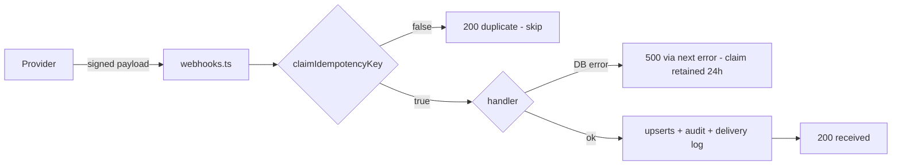

# API Contracts, Realtime, and Integrations Audit

## Audit Metadata

- Audit name: repo-deep-dive
- Run: 20260806-1722-develop-75d3926
- Repository: C:\temp\mainecybertech-portal
- Branch: develop (working tree at HEAD)
- Commit SHA: 75d39269310fcc09826fe532d5838d3a53d1739a (verified with `git rev-parse HEAD`)
- Generated at: 2026-08-06
- Auditor: principal repository auditor (fresh pass — no reliance on prior reports)
- Area codes: API (prompt 08), BILL (prompt 29)
- Output path: prompts/repo-deep-dive/20260806-1722-develop-75d3926/08_api_contracts_realtime_integrations.md
- Scope limitations: read-only audit of current source; no runtime/DB connectivity, no production access, no code modification. Worker task internals (stripe-reconcile, webhook-retry handlers) only partially verified (scheduling confirmed, handler bodies not exhaustively read). Server actions in web reviewed at surface level only.

## Scope

Reviewed at HEAD 75d3926:

- `apps/api/src/app.ts` (route mounting), `apps/api/src/main.ts` (bootstrap/shutdown)
- All 54 route files under `apps/api/src/routes/*.ts` (envelope consistency, Zod validation, status codes, route ordering/shadowing)
- Middleware: `auth.ts`, `org-access.ts`, `idempotency.ts`, `csrf.ts`, `rate-limit.ts`, `error.ts`, `request-timeout` (wired in app.ts)
- Lib: `idempotency.ts`, `webhook-signature.ts`, `webhook-dispatcher.ts`, `http-client.ts`, `circuit-breaker.ts`, `roles.ts`
- `apps/api/src/openapi/spec.ts` (route coverage vs live routes)
- SDK: `packages/sdk/src/client.ts`, `billing.ts`, `permissions.ts`, `index.ts` (accessor surface), plus usage scan across `apps/web`
- Web integration: `lib/api.ts`, `lib/client-api.ts`, `lib/use-permissions.ts`, `lib/auth/permissions.ts`, `components/NotificationBell.tsx`, portal/admin billing pages
- Migrations `5302125`, `5302127`, `5302128` (state columns, role catalog)
- Tests: `me-permissions.test.ts`, `idempotency.test.ts`, `lib-idempotency.test.ts`, `middleware-org-access.test.ts`, `middleware-auth*.test.ts`, `csrf.test.ts`

Not reviewed in depth: worker task handler bodies, Supabase RLS policy files (other than migrations cited), Terraform/CI.

## Evidence Reviewed

| Evidence | Type | Why relevant | Notes |
| -------- | ---- | ------------ | ----- |
| `apps/api/src/app.ts` | source | Router mounting order + global middleware chain | 54 routers under `/api/v1` |
| `apps/api/src/types/index.ts` | source | `success()`/`failure()` envelope contract | Single envelope type |
| `apps/api/src/routes/*.ts` (54 files) | source | Route contracts, validation, ordering | Shadowing found in vendors.ts, license-optimizer.ts |
| `apps/api/src/middleware/org-access.ts` | source | Tenant isolation + org injection | Platform-admin bypass by design |
| `apps/api/src/lib/roles.ts` | source | PLATFORM_ADMIN_KEYS (8 keys) | admin/engineer/dispatcher/finance = cross-tenant |
| `apps/api/src/routes/me.ts` | source | `GET /me/permissions` | Override org-scoping bug |
| `apps/api/src/routes/billing.ts` | source | Stripe sync, portal session | Portal session org from query only |
| `apps/api/src/routes/webhooks.ts` | source | Stripe/Jira/JSM/M365 handlers | Dedup-key and claim-before-process issues |
| `apps/api/src/routes/notifications.ts` | source | SSE stream + CRUD | 5-min auth revalidation bug |
| `apps/api/src/routes/governance.ts` | source | change-requests/risks state machine | PATCH bypass; approve w/o admin gate |
| `apps/api/src/routes/final.ts` | source | DNS/backups/procurement/state actions | Static-before-param ordering correct here |
| `apps/api/src/middleware/idempotency.ts` + `lib/idempotency.ts` | source | SET NX EX atomic claim | Sound; client-driven |
| `apps/api/src/lib/http-client.ts`, `circuit-breaker.ts` | source | Outbound resilience | No HTTP-status retries |
| `apps/api/src/openapi/spec.ts` | source | API docs | Missing `/me/permissions` |
| `packages/sdk/src/client.ts`, `billing.ts`, `permissions.ts`, `index.ts` | source | SDK contracts | POST retry without idempotency key |
| `apps/web/lib/*` (api, client-api, use-permissions, auth/permissions) | source | SDK usage, permission gating | Permission enforcement web-only |
| `apps/web/components/NotificationBell.tsx` | source | SSE client | EventSource has no auth header |
| `apps/web/app/(portal)/portal/billing/BillingPageClient.tsx` | source | Portal billing UI | Broken createPortalSession call |
| `supabase/migrations/5302125/5302127/5302128` | migration | State columns + role catalog | Columns exist; roles expanded |
| API tests (`me-permissions`, `idempotency`, `middleware-org-access`, `csrf`) | tests | Contract coverage | 6 tests for me/permissions |

## Executive Summary

The API layer is in strong overall shape: a consistent `success()/failure()` envelope is used across ~54 route files, Zod validation covers most mutations, the global error handler normalizes AppError/ZodError responses, multi-layer rate limiting (IP 300/15min, per-user 600/15min, auth 10/15min, email 5/hr) and CSRF double-submit are in place, outbound HTTP has timeouts/retries/circuit breakers, webhook signatures are verified for all four providers, and idempotency uses atomic Redis `SET NX EX` with an in-memory fallback. Route ordering is correct in most routers (projects/roles/tickets/approvals/documents/final), and migrations 5302125/5302127 back the new risk/change-request state columns.

However, the audit found one systemic architectural gap and several contract bugs:

1. **The granular RBAC catalog (90 modules × view/create/edit/delete/manage/export) is enforced nowhere in the API.** `requirePermission` does not exist in `apps/api`; the API enforces auth + org access (+ `requireAdmin` on a handful of admin routes). Every module action endpoint (change-request approve, phishing launch, scorecard evaluate, DNS approve, record create/delete) is callable by any approved member of an org with an org-scoped call, and the 8 `PLATFORM_ADMIN_KEYS` (including `engineer`, `dispatcher`, `finance`) grant cross-tenant access to everything. The permission matrix is effectively a UI affordance.
2. **State machines are bypassable via generic PATCH** (change-requests/dns-changes/risks accept arbitrary `status`/`approved_by` writes), and the approve/implement/verify endpoints lack admin/permission gating.
3. **Dead endpoints from route shadowing** — `GET /vendors/vendor-contracts/renewals` and `GET /license-optimizer/reclaimable/license-list` + `/summary/data` are registered after generic `/:id` routes and can never match (the same bug class previously fixed for `roles/with-permissions`).
4. **Webhook dedup can drop legitimate events** (Jira/JSM keyed only on `webhookEvent+issueKey`) and **claim-before-process loses events on handler failure** (retries return 200 "duplicate").
5. **Portal "Manage Billing" is broken** — `createPortalSession` reads `organization_id` from the query string while the SDK sends it in the body.
6. **SSE notification stream self-terminates every 5 minutes** (revalidation only checks the Authorization header, which EventSource never sends).
7. **SDK retries non-idempotent POSTs** on 429/5xx without ever sending an `Idempotency-Key`, risking double-created tickets/comments under transient failures.

Billing: Stripe amount units are handled correctly (cents everywhere, `_cents` columns), webhook signature verification is correct, and sync/webhook upserts are idempotent on Stripe IDs. Gaps: no server-side entitlement enforcement, no dunning/refund/cancel flows, silent skip of failed Stripe responses in sync, and raw-array vs paginated response shape inconsistency.

Overall REST/contracts domain score: **3.5/5** — functional and well-tested, but not hardened because permission enforcement, state-machine integrity, and webhook event-loss semantics are unresolved.

## Inventory

| Item | Path / symbol | Purpose | Current state | Risk | Notes |
| ---- | ------------- | ------- | ------------- | ---- | ----- |
| Envelope types | `apps/api/src/types/index.ts` | `success/failure` contract | Implemented, consistent | Low | 204 deletes bypass envelope (by design) |
| Org isolation | `apps/api/src/middleware/org-access.ts` | Tenant scoping | Implemented; platform-admin bypass | Medium | 8 MSP role keys = cross-tenant |
| Permission enforcement | none in `apps/api` | RBAC catalog enforcement | **Absent** | High | UI-only enforcement |
| me/permissions | `apps/api/src/routes/me.ts` | Effective permission set | Implemented + 6 tests | Medium | Overrides not org-scoped; missing from OpenAPI |
| Change-request state machine | `apps/api/src/routes/governance.ts` | submit/approve/implement/verify | Implemented (5302127 columns exist) | Medium | PATCH bypass; no admin gate |
| Webhook ingress | `apps/api/src/routes/webhooks.ts` | Stripe/Jira/JSM/M365 | Sig-verified, deduped | High | Over-suppression + claim-before-process |
| Webhook egress | `apps/api/src/lib/webhook-dispatcher.ts` | Org webhook delivery | Queue-first + inline fallback | Medium | Inline path no retry |
| Idempotency | `apps/api/src/lib/idempotency.ts` | Atomic dedup | Sound (SET NX EX) | Low | Client must opt in |
| Outbound HTTP | `apps/api/src/lib/http-client.ts` | Timeout/retry/circuit breaker | Implemented | Medium | No retry on HTTP 4xx/5xx |
| SSE notifications | `apps/api/src/routes/notifications.ts` | Realtime stream | Implemented | Medium | 5-min self-termination |
| Stripe integration | `apps/api/src/routes/billing.ts` | Sync + portal session | Implemented | Medium | Portal session contract mismatch; silent skip on !ok |
| SDK client | `packages/sdk/src/client.ts` | Typed client | Implemented | Medium | Retries unsafe POSTs; no Idempotency-Key |
| OpenAPI | `apps/api/src/openapi/spec.ts` | Docs | Broad coverage | Low | Missing new endpoints (me/permissions) |
| Rate limiting | `apps/api/src/middleware/rate-limit.ts` | IP/user/auth/email buckets | Implemented | Low | Plain-string 429 message |
| Error handler | `apps/api/src/middleware/error.ts` | Normalized errors | Implemented | Low | Good |

## Domain Scorecard (Prompt 08)

| Category | Score | Evidence | Gap | Recommended action |
| -------- | ----: | -------- | --- | ------------------ |
| REST/RPC routes | 3 | 54 routers, consistent envelope; shadowed endpoints in vendors/license-optimizer | Dead endpoints; no permission middleware | Reorder routes; add API-side permission checks |
| Server actions | 3 | Web actions exist (tests cover workflow-button states at HEAD) | Not contract-tested against API schema | Contract tests action ↔ route |
| WebSocket/realtime | 2 | SSE stream implemented; killed at 5-min auth revalidation; polling fallback | EventSource cannot send Authorization | Auth-revalidate via cookie; heartbeats |
| Subscriptions/events | 3 | Supabase realtime channel per user, sanitized payloads | No disconnect backoff/fallback | Reconnect logic |
| Webhooks | 4 | 4 providers signature-verified; atomic dedup; retry+DLQ worker scheduled | Jira/JSM over-broad dedup keys; claim-before-process loses events | Include timestamp/event id in keys; release claim on failure |
| External clients | 3 | Timeouts, retries, circuit breakers on Stripe/JSM/Teams/geo | No HTTP-status retry; silent skip on !ok in billing sync | Retry on 429/5xx; surface failures |
| Retries/timeouts/circuit breakers | 3 | HttpClient + CircuitBreaker + request timeout 30s | SDK retries unsafe POSTs w/o idempotency | Don't retry POSTs without key |
| Pagination/filter/sort | 3 | `{items,total,page,limit}` on most lists | Raw arrays on subscriptions/api-keys; no sort params | Unify envelope |
| Error response format | 4 | Global handler; AppError/ZodError normalized | `rateLimitByUser` returns plain string | Envelope it |
| OpenAPI/versioning | 3 | ~400 paths, `/api/v1` prefix, Swagger UI | `/me/permissions` missing; manual spec drift | Add missing paths; add drift check |
| Request/response validation | 4 | Zod on most mutations; `schema.partial()` on final.ts PATCH | Generic crudRoute PATCH (governance) unvalidated | Add update schemas |
| Auth/rate limit | 4 | Multi-layer limiters, CSRF, JWT fast-path | Permission layer absent at API | Add requirePermission middleware |

## Domain Scorecard (Prompt 29 — Billing)

| Category | Score | Evidence | Gap | Recommended action |
| -------- | ----: | -------- | --- | ------------------ |
| Billing pages | 3 | Admin org billing viewer + portal billing page | Portal "Manage Billing" 400s (contract mismatch) | Fix org source on create-portal-session |
| Subscription/plan models | 3 | `subscriptions` table synced from Stripe | No plan catalog, no entitlements | Add plan/entitlement model |
| Entitlement checks | 1 | No server-side entitlement checks anywhere | Module access ignores subscription state | Gate paid features server-side |
| Billing APIs | 3 | summary/invoices/subscriptions/payments/sync/portal-session | Shape inconsistency; sync silent failures | Unify envelopes; report sync failures |
| Payment provider integration | 4 | Stripe via httpClients (15s timeout, 2 retries, breaker); `constructEvent` sig verify; cents handled correctly | No checkout-creation endpoint (only webhook) | Add create-checkout flow |
| Webhooks | 4 | `invoice.paid/payment_failed`, subscription events, `checkout.session.completed` upserts | `client_reference_id` trusted as org id; claim-before-process | Validate client_reference_id |
| Invoices/status records | 3 | `invoices` upserted with `_cents`, due/paid timestamps | Overdue derived at sync-time only | Recompute overdue in worker |
| Reconciliation jobs | 3 | `POST /billing/sync` (manual, admin) + stripe-reconcile worker task (scheduled) | Sync skips non-ok Stripe responses silently | Track per-customer failures |
| Failed payments | 2 | `invoice.payment_failed` upserts invoice | No dunning/alert workflow, no UI | Add failed-payment workflow |
| Refund/cancel/trial states | 2 | Status passthrough only | No refund/cancel/trial logic | Add lifecycle endpoints |
| Seat counts | 1 | Memberships count could derive seats | Not implemented | Define seat model |
| Usage billing | 0 | None | N/A | N/A |

## Detailed Review

### Item: Response envelope & error handling

- Evidence: `apps/api/src/types/index.ts:24-38`, `apps/api/src/middleware/error.ts`
- What it does: every JSON response uses `{success, data}` or `{success, error:{code,message,status}}`; `AppError` and `ZodError` are normalized in one place.
- How it appears to work: consistent; DELETE handlers return bare `204` (many routes), which the SDK tolerates only because it never parses 204 bodies.
- Missing controls: `rateLimitByUser` (rate-limit.ts:43) returns a plain string 429 (global limiter uses the JSON envelope at app.ts:105-112) — SDK surfaces `UNKNOWN/HTTP 429`.
- Risks: minor client confusion; nothing exploitable.

### Item: Route ordering / shadowing

- Evidence: `apps/api/src/routes/vendors.ts:53` (`GET /vendor-contracts/:id`) registered before `:169` (`GET /vendor-contracts/renewals`); `apps/api/src/routes/license-optimizer.ts:50` (`GET /:id`) before `:136` (`/reclaimable/license-list`) and `:157` (`/summary/data`).
- What it does: Express matches in registration order; the generic `/:id` handler wins and `id="renewals"` is queried against `vendor_contracts.id` → 404/DB error. Both endpoints are unreachable dead code.
- Correctly ordered for contrast: `projects.ts` (`/compound` at :116 before `/:id` :279), `roles.ts` (`/with-permissions`), `documents.ts` (`/shares/:token` :130 before `/:id` :219), `final.ts` (static routes before the crud loop at :441), `tickets.ts`, `approvals.ts`, `domain-monitors.ts`.
- Risk: P1 functional — SDK/web consumers of these endpoints always fail.

### Item: Permission enforcement

- Evidence: `grep requirePermission apps/api` → no matches; enforcement lives in `apps/web/lib/auth/permissions.ts:11` (page redirects) and `components/RouteGuard.tsx`; `apps/api/src/lib/roles.ts:9-18` defines 8 `PLATFORM_ADMIN_KEYS`.
- What it does: the API authorizes at the level of (a) authenticated, (b) approved membership in an org, (c) `requireAdmin` on select admin routes. The 90-module permission catalog (`5302118`, `5302128`) is applied only in the UI.
- Risks: any org member can `POST /governance/change-requests/:id/approve`, `POST /edu-automation/phishing/:id/launch`, `POST /final/dns-changes/:id/approve`, or create/delete records in any module; `engineer`/`dispatcher`/`finance`/`onboarding-specialist` roles (seeded demo users) are cross-tenant platform admins by design.

### Item: Billing / Stripe

- Evidence: `apps/api/src/routes/billing.ts`
- What it does: summary/invoices/payments/subscriptions reads; admin `POST /sync` pulls Stripe invoices+subscriptions and upserts on `stripe_invoice_id`/`stripe_subscription_id`; `POST /create-portal-session` creates a Stripe billing portal URL.
- Amount units: correct — Stripe returns minor units; stored in `*_cents` (`Math.round(inv.subtotal)` etc.) and `amount_cents`.
- Contract bug: `create-portal-session` reads `req.query.organization_id` (:283-284); the SDK (`packages/sdk/src/billing.ts:111-113`) sends `organizationId` in the body and `X-Active-Org` header — the portal page call (`BillingPageClient.tsx:104`) always gets 400.
- Silent failure: `sync` skips any `!res.ok` Stripe response (:205, :236) and still returns `{synced: N}`.
- Signature verification: `constructEvent(rawBody, signature, STRIPE_WEBHOOK_SECRET)` in `webhooks.ts:85` with raw body captured via `express.json({verify})` — correct.

### Item: Webhook ingress idempotency

- Evidence: `apps/api/src/routes/webhooks.ts` + `lib/idempotency.ts`
- Atomic claim: `claimIdempotencyKey` = Redis `SET key val EX ttl NX` (:108) — correct.
- Over-broad keys: Jira `jira-${webhookEvent}-${issueKey}` (:246), JSM `jsm-${webhookEvent}-${issueKey}` (:324) — no event id/timestamp → a second legitimate status change for the same issue within 24h is dropped. Contrast with M365 which digests the full notification (:427-432).
- Claim-before-process: the key is claimed before DB writes; if the handler errors (500 via `next(error)`), the claim persists 24h, so Stripe/Jira retries of the same event receive 200 "Duplicate webhook, skipping" → permanent event loss.

### Item: SSE notifications

- Evidence: `apps/api/src/routes/notifications.ts:27-118`, `apps/web/components/NotificationBell.tsx:80-81`
- What it does: authenticated SSE stream over a per-user Supabase realtime channel with keepalives and a 5-min session revalidation.
- Bug: revalidation (:49-57) calls `supabase.auth.getUser(req.headers.authorization?.replace("Bearer ","") || "")`; the browser connects via `new EventSource(url, {withCredentials:true})`, which cannot send an Authorization header → `getUser("")` fails → `auth_expired` → connection closed every 5 minutes. NotificationBell's 30s polling fallback masks the failure.

### Item: SDK client behavior

- Evidence: `packages/sdk/src/client.ts`
- What it does: base client with timeout (30s), retry (3x, exponential, 429/502/503/504), CSRF header for cookie-only mutations, `X-Active-Org` forwarding.
- Risks: retries apply to unsafe POSTs (tickets create, comments, documents) without an `Idempotency-Key`; the API's idempotency middleware (`middleware/idempotency.ts:13`) only activates when the client sends the header — so a 503 mid-flight can double-create records.

### Item: me/permissions

- Evidence: `apps/api/src/routes/me.ts`
- What it does: computes effective permissions from approved memberships → role_permissions → permissions, applies `user_permission_overrides`, super-admin shortcut.
- Gap: overrides are applied to a single global `grantedIds` set (:92-100) with no org dimension — a deny override in org A strips the permission in every org, and an allow in org A grants it everywhere; the response contains no per-org map. Web `usePermissions` (`apps/web/lib/use-permissions.ts`) consumes a flat `keys` list, so multi-org users get wrong UI. Also: endpoint absent from OpenAPI.

### Item: State machines (change-requests, risks, dns-changes)

- Evidence: `apps/api/src/routes/governance.ts`, `apps/api/src/routes/final.ts`
- Columns exist: migration `5302127_module_state_columns.sql` adds `submitted_at`, `approved_by`, `approved_at`, `verified_at` to `change_requests`; `implemented_at` from `5302071`; `risk_register` columns in `5302125`.
- Transition handlers enforce prior state via `.eq("status", ...)` — correct direction.
- Gaps: `crudRoute("change-requests", ...)` is registered WITHOUT an update schema (governance.ts:148-152) → generic `PATCH /change-requests/:id` accepts arbitrary `status`/`approvedBy`/`submittedAt`, fully bypassing submit→approve→implement→verify and spoofing the approver identity; same for `risks` (direct `risk_score`) and `dns-changes` (PATCH status to `implemented`). No `requireAdmin`/permission check on the approve/implement/verify actions themselves.

## Scenario / Control Matrix

| ID | Scenario or control | Evidence | Current control | Gap | Severity | Recommendation |
| -- | ------------------- | -------- | --------------- | --- | -------- | -------------- |
| API-001 | REST/RPC routes | 54 routers in app.ts | Envelope + Zod on most | Shadowed endpoints; PATCH bypass | P1 | Reorder + update schemas |
| API-002 | Server actions | web actions + tests | Passed at HEAD | No contract tests vs API | P3 | Add contract tests |
| API-003 | WebSocket/realtime | notifications stream | SSE + keepalive | 5-min self-kill | P2 | Cookie-based revalidation |
| API-004 | Subscriptions/events | Supabase realtime channel | Per-user filter | No reconnect/backoff | P3 | Client retry logic |
| API-005 | Webhooks | webhooks.ts | Sig verify + atomic dedup | Over-broad keys; claim-before-process | P1 | Fix keys; release on failure |
| API-006 | External clients | http-client.ts | timeout/retry/breaker | No HTTP-status retries | P2 | Retry 429/5xx, surface errors |
| API-007 | Retries/timeouts/circuit breakers | http-client + circuit-breaker + request-timeout(30s) | Good | SDK retries unsafe POSTs | P2 | Idempotency-Key on retries |
| API-008 | Pagination/filter/sort | list endpoints | Paginated envelope | Raw arrays (subscriptions, api-keys); no sort | P3 | Unify |
| API-009 | Error response format | error.ts | Normalized | rateLimitByUser string | P3 | Envelope |
| API-010 | OpenAPI/versioning | spec.ts | ~400 paths | Missing me/permissions, drift | P3 | Drift check in CI |
| API-011 | Request/response validation | validators/* | Broad | governance PATCH unvalidated | P1 | Add update schemas |
| API-012 | Auth/rate limit | auth.ts, rate-limit.ts, csrf.ts | Multi-layer | No permission enforcement | P1 | API-side requirePermission |

## Findings

### Finding ID: API-P1-001 - Granular RBAC catalog is not enforced in the API (permission layer is UI-only)

- Severity: P1
- Confidence: High
- Area: Authorization
- Evidence:
  - `apps/api/src/routes/governance.ts:179` (approve), `apps/api/src/routes/final.ts:318` (dns approve), `apps/api/src/routes/edu-automation.ts:300` (phishing launch), `apps/api/src/routes/security-ops.ts:144` (offboarding complete-step), `apps/api/src/routes/scorecards/evaluate` (`edu-automation.ts:722`)
  - `grep requirePermission apps/api` → 0 matches; only `apps/web/lib/auth/permissions.ts:11` and `apps/web/components/RouteGuard.tsx`
  - `apps/api/src/lib/roles.ts:9-18` — `PLATFORM_ADMIN_KEYS` includes `engineer`, `dispatcher`, `finance`, `onboarding-specialist`
- What is happening: The API enforces auth + approved membership (org access) and `requireAdmin` on a handful of routes. The 90-module permission catalog seeded by `5302118`/`5302128` is consulted only by web-side guards and the UI. Any approved member of an org can invoke every module action endpoint directly, including approve/implement/verify transitions and delete operations, regardless of the module:action permissions shown in the matrix.
- Why it matters: The permission matrix (roles, overrides, /admin/permissions UI, `me/permissions` endpoint) creates a false sense of access control; the actual enforcement boundary is org membership plus an admin flag.
- User / business impact: A client_user with "view only" per their role can create/delete records and approve change requests via API calls; audit logs record the action as legitimate.
- Security / privacy / reliability impact: Tenant-adjacent privilege escalation for any org member; compliance exposure (documented RBAC ≠ enforced RBAC).
- Recommended fix: Add `requirePermission(module, action)` middleware in the API mirroring `apps/web/lib/auth/permissions.ts` (reuse `me/permissions` computation server-side); apply to module action endpoints; keep super-admin bypass.
- Suggested validation: New middleware test asserting a client_user without `tickets:delete` gets 403 on DELETE; E2E test removing UI guard and calling API directly.
- Owner suggestion: API principal engineer
- Effort estimate: 2-3 days (middleware + route sweep + tests)
- Dependencies: `me/permissions` computation must be extractable per-request (org-aware)
- Status: Open

### Finding ID: API-P1-002 - Route shadowing: three documented endpoints are unreachable dead code

- Severity: P1
- Confidence: High
- Area: Routing
- Evidence:
  - `apps/api/src/routes/vendors.ts:53` `GET /vendor-contracts/:id` registered before `:169` `GET /vendor-contracts/renewals`
  - `apps/api/src/routes/license-optimizer.ts:50` `GET /:id` before `:136` `GET /reclaimable/license-list` and `:157` `GET /summary/data`
  - Documented in `apps/api/src/openapi/spec.ts:492`, `:395-396` (spec claims they exist)
- What is happening: Express matches in registration order; `id="renewals"`, `id="summary"`, `id="reclaimable"` are queried as record UUIDs → `NOT_FOUND`/DB error. Same bug class as the previously fixed `roles/with-permissions` shadowing.
- Why it matters: Any consumer (admin vendors page renewals panel, license-optimizer summary) gets 404; the OpenAPI spec advertises endpoints that cannot work.
- User / business impact: Vendor renewals and license-optimizer summary features silently broken.
- Security / privacy / reliability impact: None direct; feature failure.
- Recommended fix: Move static routes before the generic `/:id` registration (or use distinct path prefixes such as `/renewals` on a separate sub-router).
- Suggested validation: Supertest asserting `GET /api/v1/vendors/vendor-contracts/renewals` hits the intended handler; add a route-shadowing lint/test across all routers (like the existing cache-collision regression test pattern).
- Owner suggestion: Implementation agent
- Effort estimate: Small (0.5 day + regression test)
- Dependencies: None
- Status: Open

### Finding ID: API-P1-003 - Jira/JSM webhook dedup keys suppress legitimate repeat events for 24h

- Severity: P1
- Confidence: High
- Area: Webhooks / data integrity
- Evidence:
  - `apps/api/src/routes/webhooks.ts:246` `jira-${event.webhookEvent ?? "unknown"}-${issueKey ?? "unknown"}`
  - `apps/api/src/routes/webhooks.ts:324` `jsm-${event.webhookEvent ?? "unknown"}-${issueKey ?? "unknown"}`
  - Contrast: M365 dedup digests full notification content (`webhooks.ts:427-432`)
  - TTL 24h (`apps/api/src/lib/idempotency.ts:49`)
- What is happening: A second legitimate `issue_updated` for the same issue (e.g., In Progress → Resolved) within 24 hours is treated as a duplicate and skipped — the project task/ticket status is never synced.
- Why it matters: Jira/JSM webhooks fire once per transition; the status map logic (`JIRA_STATUS_MAP`/`JSM_STATUS_MAP`) is the only sync path for issue transitions.
- User / business impact: Ticket/task statuses go stale in the portal; helpdesk workflows misreport state.
- Security / privacy / reliability impact: Data integrity — silently dropped events with no DLQ record.
- Recommended fix: Include the payload `timestamp` (Jira/JSM send one) or the full-body digest in the key, e.g. `jsm-${webhookEvent}-${issueKey}-${digest(body)}` (mirror the M365 pattern).
- Suggested validation: Unit test with two sequential same-issue events differing only in timestamp → both processed; existing `webhooks.test.ts` suite update.
- Owner suggestion: Implementation agent
- Effort estimate: Small (0.5 day)
- Dependencies: None
- Status: Open

### Finding ID: API-P1-004 - Webhook claim-before-process drops events when the handler fails

- Severity: P1
- Confidence: High
- Area: Webhooks / reliability
- Evidence:
  - `apps/api/src/routes/webhooks.ts:97` claim before processing; `:104` (`invoice.paid`) DB writes; on error → `next(error)` → 500
  - `apps/api/src/lib/idempotency.ts:98-133` claim TTL 24h
- What is happening: If any DB upsert or downstream step throws after the claim, the response is 500 but the key stays claimed. Stripe/Jira retry the same event within 24h → `dedupWebhook` returns true → 200 "duplicate" → event never processed.
- Why it matters: Transient DB failure = permanent data loss (invoice status, subscription state, task/ticket status).
- User / business impact: Billing records and issue statuses silently out of sync until manual `POST /billing/sync`.
- Security / privacy / reliability impact: Payment/status data integrity.
- Recommended fix: Delete the claim on failure (call `deleteIdempotencyKey` in the catch before `next(error)`) or switch to a two-phase pattern (claim with short TTL, extend on completion).
- Suggested validation: Test simulating a DB error on first delivery and a retry with the same event id — assert the retry is processed.
- Owner suggestion: API principal engineer
- Effort estimate: Small (0.5 day + test)
- Dependencies: None
- Status: Open

### Finding ID: API-P1-005 - Portal "Manage Billing" is broken: create-portal-session reads org from query, SDK sends it in body

- Severity: P1
- Confidence: High
- Area: Billing / API contract
- Evidence:
  - `apps/api/src/routes/billing.ts:283-284` `const orgId = req.query.organization_id ...; if (!orgId) throw VALIDATION 400`
  - `packages/sdk/src/billing.ts:111-113` `createPortalSession(data?: {organizationId})` → body
  - `apps/web/app/(portal)/portal/billing/BillingPageClient.tsx:104` `getClientApi().billing.createPortalSession()` (no args)
- What is happening: The SDK/UI sends `organizationId` in the body (or relies on `X-Active-Org`), the route only reads the query string → always 400 "organization_id is required". The Manage Billing button cannot work.
- Why it matters: Self-service billing is a portal headline feature; the contract between SDK and API is broken.
- User / business impact: Portal users cannot reach the Stripe billing portal.
- Security / privacy / reliability impact: None; functional.
- Recommended fix: Resolve org from `extractActiveOrgId` (query → body → X-Active-Org header → cookie) as `requireOrgAccess` does, or change SDK to pass query params.
- Suggested validation: Integration test calling `createPortalSession` with the X-Active-Org header; SDK test asserting body/query parity.
- Owner suggestion: Implementation agent
- Effort estimate: Small (0.25 day)
- Dependencies: None
- Status: Open

### Finding ID: API-P1-006 - State machines bypassable via generic PATCH (governance/final/risks)

- Severity: P1
- Confidence: High
- Area: Workflow integrity
- Evidence:
  - `apps/api/src/routes/governance.ts:148-152` `crudRoute("change-requests", ...)` with no update schema → `PATCH /change-requests/:id` writes any body field (governance.ts:91-124)
  - `apps/api/src/routes/final.ts:94-128` generic PATCH (partial schema) for `dns-changes`/`backups`/`satisfaction` tables
  - `apps/api/src/routes/governance.ts:283` risks PATCH allows direct `risk_score` writes
- What is happening: `PATCH /api/v1/governance/change-requests/:id` with `{status:"verified", approvedBy:"<any uuid>"}` bypasses submit→approve→implement→verify and fabricates the approver; `PATCH /final/dns-changes/:id {status:"implemented"}` bypasses approval. The dedicated transition endpoints (which correctly gate on prior status) are therefore cosmetic.
- Why it matters: The approval workflows added by `5302127` are not an integrity boundary; audit evidence (approved_by/approved_at) can be forged by any org member.
- User / business impact: Change-management/DNS change controls are void; compliance posture undermined.
- Security / privacy / reliability impact: Audit-trail forgery; workflow control bypass.
- Recommended fix: Give each stateful table a strict update schema (status excluded or constrained to non-transitional fields) or route PATCH through transition guards; forbid writing `approved_by`/`approved_at`/`submitted_at` via PATCH.
- Suggested validation: Tests asserting PATCH cannot change `status` on change-requests/dns-changes; the existing `governance.test.ts` extended.
- Owner suggestion: API principal engineer
- Effort estimate: 1 day + tests
- Dependencies: None
- Status: Open

### Finding ID: API-P2-007 - me/permissions applies org-scoped overrides globally; endpoint missing from OpenAPI

- Severity: P2
- Confidence: High
- Area: Authorization semantics
- Evidence:
  - `apps/api/src/routes/me.ts:92-100` — single `grantedIds` set for overrides across all orgs
  - `apps/web/lib/use-permissions.ts:80-96` — flat `keys`, org-agnostic `can()`
  - `apps/api/src/openapi/spec.ts` — no `/me/permissions` path
- What is happening: A deny `documents:delete` override on org A also removes the permission in org B where the role grants it; an allow override grants the permission in every org. Multi-org users (seed 07/08 fixtures deliberately include these cases) get incorrect UI and the response cannot express per-org truth.
- Why it matters: The override feature (built 2026-08-02) has different semantics than the per-org data model (`user_permission_overrides.organization_id`).
- User / business impact: Wrong buttons/visibility for multi-org users; deny-override users may lose access they are entitled to.
- Security / privacy / reliability impact: Both over- and under-privilege; if API-side enforcement is later added on top of this endpoint, the bug becomes a security hole.
- Recommended fix: Return per-org permission maps (`permissionsByOrg`) and compute the effective set per active org; update `usePermissions`/`can(module, action, orgId?)`.
- Suggested validation: Unit test with allow-in-A/deny-in-B override asserting per-org keys.
- Owner suggestion: Implementation agent
- Effort estimate: 1 day
- Dependencies: Web permission consumers
- Status: Open

### Finding ID: API-P2-008 - SSE notifications stream self-terminates every 5 minutes

- Severity: P2
- Confidence: High
- Area: Realtime
- Evidence:
  - `apps/api/src/routes/notifications.ts:49-57` — revalidation uses `req.headers.authorization` only
  - `apps/web/components/NotificationBell.tsx:80-81` — `new EventSource(url, { withCredentials: true })` (cookies, no Authorization header)
  - Initial auth works because `requireAuth` (`middleware/auth.ts:37-39`) falls back to the `mct_session` cookie
- What is happening: `supabase.auth.getUser("")` fails on the 5-minute check → `auth_expired` event → server closes the stream. The bell silently degrades to 30s polling (`NotificationBell.tsx:101`).
- Why it matters: The advertised realtime channel (and the Supabase realtime subscription) is torn down every 5 minutes; realtime latency is effectively polling latency.
- User / business impact: Notification latency up to 30s; connection churn.
- Security / privacy / reliability impact: None severe; resource churn.
- Recommended fix: Revalidate via the `mct_session` cookie (or reuse `requireAuth`'s cookie path) instead of the Authorization header; also handle `auth_expired` with an EventSource reconnect.
- Suggested validation: E2E/integration test keeping a stream open >5 min and asserting no `auth_expired`; unit test for the revalidation helper.
- Owner suggestion: Implementation agent
- Effort estimate: 0.5 day
- Dependencies: None
- Status: Open

### Finding ID: API-P2-009 - SDK retries unsafe POSTs without Idempotency-Key → duplicate records on transient failures

- Severity: P2
- Confidence: High
- Area: SDK / retry semantics
- Evidence:
  - `packages/sdk/src/client.ts:63-116` — retries all methods on 429/502/503/504, including POST
  - `packages/sdk/src/client.ts:49` — unsafeMethods used only for CSRF header; no `Idempotency-Key` header anywhere in the SDK
  - `apps/api/src/middleware/idempotency.ts:13-16` — dedup only activates when the client sends the header
- What is happening: A ticket-create POST that reaches the API but whose response is lost (503 after commit) is retried 3x → multiple tickets/comments/documents. The API-side idempotency middleware exists but is client-opt-in and never used by the SDK.
- Why it matters: The "atomic idempotency" investment (2026-08-01) is not wired to the primary client.
- User / business impact: Duplicate tickets/comments under flaky networks — previously observed user complaints pattern.
- Security / privacy / reliability impact: Data duplication, support noise.
- Recommended fix: SDK generates `Idempotency-Key` (UUID) per POST/PATCH and sends it; or drop retries for unsafe methods when no key is available.
- Suggested validation: SDK test asserting the header on retried POST; API test that a replayed key returns 409 then the same resource.
- Owner suggestion: SDK owner
- Effort estimate: 0.5 day
- Dependencies: None
- Status: Open

### Finding ID: API-P2-010 - Outbound HTTP does not retry 4xx/5xx; billing sync silently skips failed Stripe responses

- Severity: P2
- Confidence: High
- Area: Integrations / resilience
- Evidence:
  - `apps/api/src/lib/http-client.ts:50-71` — retry loop only on thrown fetch errors; `response` returned regardless of `ok`
  - `apps/api/src/routes/billing.ts:205,236` — `if (invoicesRes.ok) { ... }` else silent skip; `res.json(success({ synced }))` counts only customers, not successes
- What is happening: Stripe 429/5xx responses are never retried (circuit breaker also only tracks thrown errors), and sync reports success while skipping un-synced customers/invoices.
- Why it matters: Reconciliation is the point of `POST /billing/sync`; silent partial failure undermines it.
- User / business impact: Stale invoices/subscriptions with no error surfaced.
- Security / privacy / reliability impact: Financial-data staleness.
- Recommended fix: Retry on `429/5xx` in `HttpClient.fetch` (check `response.status`), trip the breaker on repeated HTTP failures, and return per-customer failure counts from sync.
- Suggested validation: Unit test with mocked 500 then 200 response; billing sync test asserting failure count in payload.
- Owner suggestion: API principal engineer
- Effort estimate: 1 day
- Dependencies: None
- Status: Open

### Finding ID: API-P2-011 - Platform admins without an active-org cookie get 500s on org-scoped module lists (unconditional `.eq()` filters)

- Severity: P2
- Confidence: Medium
- Area: Org scoping / route robustness
- Evidence:
  - `apps/api/src/routes/governance.ts:37-39`, `vendors.ts:34`, `final.ts:37`, `edu-automation.ts` — unconditional `.eq("organization_id", req.query.organization_id as string)`
  - `apps/api/src/middleware/org-access.ts:119,147-150` — platform admins get NO injected org when no explicit/active org resolves
  - Contrast: `api-keys.ts:41`, `billing.ts:81`, `license-optimizer.ts:55` use `if (orgId)`
- What is happening: A platform admin with no `mct_active_org` cookie and no `organization_id` param triggers `.eq("organization_id", undefined)` → PostgREST filter error → 500. The web always sends orgs today (cookie/switcher), but any direct API client hits this.
- Why it matters: The org-injection design is only safe when every consumer sends an org; the API surface itself is not robust.
- User / business impact: 500s for API clients of platform admins without a cookie.
- Security / privacy / reliability impact: None (fails closed), availability.
- Recommended fix: Guard filters (`if (orgId) q = q.eq(...)`) everywhere or require an org for module routes and return 400 otherwise.
- Suggested validation: Middleware test for org-less platform admin against a governance list route.
- Owner suggestion: Implementation agent
- Effort estimate: 0.5 day
- Dependencies: None
- Status: Open

### Finding ID: API-P3-012 - Minor contract inconsistencies (429 envelope, raw-array lists, OpenAPI drift, webhook_deliveries body retention)

- Severity: P3
- Confidence: High
- Area: Consistency / hygiene
- Evidence:
  - `apps/api/src/middleware/rate-limit.ts:43` plain-string 429 vs envelope at `app.ts:105`
  - `apps/api/src/routes/billing.ts:121` subscriptions returns raw array; `api-keys.ts:46` same; most lists return `{items,total,page,limit}`
  - `apps/api/src/openapi/spec.ts` missing `/me/permissions`, `/notifications/stream` present but `/me/permissions` absent
  - `apps/api/src/routes/webhooks.ts:22-28` `request_body: reqBody` stored with no retention on `webhook_deliveries` (payment/PII-bearing payloads)
- What is happening: Several small contract/consistency gaps; the deliveries table accumulates raw webhook bodies indefinitely.
- Why it matters: Client error handling, SDK types, and privacy retention.
- User / business impact: Minor; SDK shows generic errors for 429.
- Security / privacy / reliability impact: PII retention on deliveries (data minimization).
- Recommended fix: Envelope the 429 message; unify list shapes; add missing OpenAPI paths + a CI drift check; add retention policy for `webhook_deliveries.request_body`.
- Suggested validation: Existing suites plus a spec-vs-router drift test.
- Owner suggestion: Implementation agent
- Effort estimate: 1 day
- Dependencies: None
- Status: Open

## Risks

| Risk | Severity | Likelihood | Impact | Evidence | Mitigation |
| ---- | -------- | ---------- | ------ | -------- | ---------- |
| Org members can perform actions their role denies (API bypass of RBAC) | P1 | High | Medium | no requirePermission in apps/api | API permission middleware |
| Webhook events permanently dropped on handler failure | P1 | Medium | High | claim-before-process, webhooks.ts:97 | Release claim on failure |
| Legit Jira/JSM transitions suppressed for 24h | P1 | High | Medium | webhooks.ts:246/324 | Include timestamp/digest in key |
| State-machine/PATCH bypass forges approvals | P1 | High | Medium | governance.ts:91-124 | Strict update schemas |
| Portal billing portal session unusable | P1 | Certain | Low | billing.ts:283, BillingPageClient.tsx:104 | Align org resolution |
| Dead endpoints advertised in OpenAPI | P1 | Certain | Low | vendors.ts:169, license-optimizer.ts:136/157 | Route reorder + test |
| SDK double-create on transient 5xx | P2 | Medium | Medium | client.ts retry loop | Idempotency-Key in SDK |
| Realtime degrades to polling every 5 min | P2 | Certain | Low | notifications.ts:49-57 | Cookie revalidation |
| Override semantics wrong for multi-org users | P2 | Medium | Medium | me.ts:92-100 | Per-org effective set |
| Silent partial billing sync | P2 | Medium | Medium | billing.ts:205/236 | Fail-count reporting |
| webhook_deliveries PII retention | P3 | Certain | Low | webhooks.ts:22 | Retention policy |

## Recommendations

### Immediate / Release Blocking

1. **API-P1-001**: Add API-side `requirePermission(module, action)` middleware and apply to all module action + mutation endpoints. (2-3 days)
2. **API-P1-003/004**: Fix Jira/JSM dedup keys and release idempotency claims on handler failure. (1 day)
3. **API-P1-006**: Add strict update schemas to stateful tables (change-requests, dns-changes, risks) so PATCH cannot move status or write `approved_by`. (1 day)
4. **API-P1-005**: Fix org resolution on `create-portal-session`; unblock portal billing. (0.25 day)

### This Week

5. **API-P1-002**: Reorder shadowed routes (vendors renewals, license-optimizer summary/reclaimable) + add a route-shadowing regression test. (0.5 day)
6. **API-P2-008**: SSE revalidation via cookie. (0.5 day)
7. **API-P2-009**: SDK `Idempotency-Key` on unsafe methods. (0.5 day)
8. **API-P2-010**: HTTP-status retries + sync failure reporting. (1 day)

### This Month

9. **API-P2-007**: Per-org effective permissions in `me/permissions` + web consumers. (1 day)
10. **API-P2-011**: Guard org filters against undefined; uniform 400. (0.5 day)
11. Billing entitlements: define plan/seat model and gate paid modules server-side (prompt 29). (3-5 days)
12. Failed-payment dunning workflow (invoice.payment_failed → notification/email + retry). (2 days)

### Later / Platform Evolution

13. OpenAPI drift check in CI (spec vs router inventory). (1 day)
14. `webhook_deliveries` retention/redaction. (0.5 day)
15. Checkout creation endpoint (currently only webhook consumption). (2 days)
16. Seat-based billing from memberships. (3 days)

## Quick Wins

| Quick win | Why it helps | Files likely involved | Validation |
| --------- | ------------ | --------------------- | ---------- |
| Move static routes before `/:id` in vendors/license-optimizer | Unblocks 3 dead endpoints | `vendors.ts`, `license-optimizer.ts` | Supertest 200 |
| Fix create-portal-session org source | Fixes portal billing button | `billing.ts`, `sdk/src/billing.ts` | Integration test |
| Add timestamp to Jira/JSM dedup keys | Stops losing status syncs | `webhooks.ts` | Unit test |
| Delete claim on webhook failure | Stops permanent event loss | `webhooks.ts` | Failure-retry test |
| SSE revalidation via cookie | Real realtime for >5 min sessions | `notifications.ts` | 6-min stream test |

## Hardening Backlog

| Backlog item | Priority | Owner suggestion | Effort | Dependency |
| ------------ | -------- | ---------------- | ------ | ---------- |
| API permission middleware | P1 | API principal | 2-3d | me/permissions per-org fix |
| Webhook dedup/failure semantics | P1 | Implementation agent | 1d | — |
| State-machine PATCH hardening | P1 | Implementation agent | 1d | — |
| Billing entitlements + seat model | P2 | Product + API | 3-5d | plan catalog |
| Dunning/failed-payment workflow | P2 | Product + Worker | 2d | notification channels |
| OpenAPI drift CI check | P3 | Implementation agent | 1d | — |
| Delivery-body retention | P3 | Implementation agent | 0.5d | — |

## Suggested Tests

- Unit: Jira/JSM second-transition processed (different timestamp, same issue).
- Unit: webhook failure → retry of same event id processed (claim released).
- Unit: PATCH on change-requests with `status`/`approvedBy` → 400.
- Integration: `createPortalSession` via X-Active-Org → 200.
- Integration: org-less platform admin list route → 400 not 500.
- Middleware: client_user calling a module action without permission → 403.
- SDK: retried POST carries `Idempotency-Key`.
- E2E: SSE stream alive >5 minutes.
- Billing: sync with mocked Stripe 500 returns failure counts.
- CI: spec-vs-router drift test (every mounted path has an OpenAPI entry).

## Suggested Documentation Updates

- `docs/ENVIRONMENT_VARIABLES.md` — confirm `X-Active-Org`/cookie org precedence documented for portal-session.
- `docs/API_ENDPOINT_INVENTORY.md` — add `/me/permissions`, `POST /billing/create-portal-session` contract note.
- `docs/GITHUB_SECRETS_AND_VARIABLES_MATRIX.md` — no change needed (no new secrets).
- Add `docs/API_PERMISSION_MODEL.md` — document that the API does NOT enforce the permission catalog (current state) and the target design.

## Open Questions

| Question | Why it matters | Evidence needed |
| -------- | -------------- | --------------- |
| Is UI-only permission enforcement an accepted product decision for the MVP? | Determines whether API-P1-001 is a defect or a documented decision | Product/security sign-off |
| Are Jira/JSM payloads guaranteed to include `timestamp`? | Needed for the dedup-key fix | Capture one real payload |
| Is `webhook_deliveries` covered by a retention job? | PII/privacy posture | Migration/worker scan |
| Does any consumer call the shadowed vendor/license-optimizer endpoints? | Prioritization of API-P1-002 | Web/SDK usage scan |
| Are `stripe-reconcile`/`webhook-retry` worker handlers resilient to concurrent runs? | Reconciliation correctness | Read worker task bodies |

## Appendix

### Route-inventory method

- Enumerated `router.*` registrations per file with `Select-String` and read the ordering-sensitive files in full (`governance.ts`, `final.ts`, `vendors.ts`, `license-optimizer.ts`, `projects.ts`, `documents.ts`, `tickets.ts`).
- Verified static-before-param ordering is correct in: projects, roles, tickets, approvals, documents, final, domain-monitors, assets, proposals, memberships, users, training-hub, insurance-binder.
- Verified shadowing in: vendors (renewals), license-optimizer (license-list, summary/data).

### SDK usage scan (apps/web, excluding tests)

- Accessor-level unused in web: `api.analytics`, `api.businessOs` (business-os pages use `api.dashboard.businessOsSummary`).
- Method-level: `createPortalSession` (1 call — broken contract), `syncFromStripe` (2 calls), `inviteUsers`/`getVersion`/`getSignedUrl`/`getNotificationPreferences`/`testEndpoint`/`exportCsv` — no web call sites (may be used by future/other clients; verify).

### Mermaid: webhook event lifecycle (current)

### Migration evidence

- `5302127_module_state_columns.sql`: `change_requests.submitted_at/approved_by/approved_at/verified_at`; `compliance_readiness` score columns; `m365_hardening` scan columns; `patch_compliance`/`endpoint_security` last_checked_at; `qbr_reports.generated_at` — all present.
- `5302125_risk_assess_columns.sql`: `risk_register.risk_level/accepting_controls/assessed_at` — present.
- `5302128_role_catalog_expansion.sql`: 8 new roles (dispatcher, engineer, security-analyst, project-manager, finance, onboarding-specialist, +2) with `module_key/action_key` grants — present; `apps/api/src/lib/roles.ts` PLATFORM_ADMIN_KEYS matches these keys.
